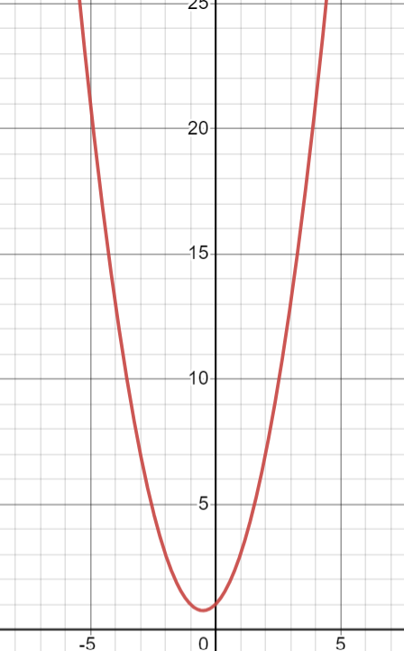

# binary search

## binary search to solve quadratic function

This is example of how was able to binary search for the k values in a quadratic function using binary search algorithm.  

Finding if there is a solution to this equation 1 + x + x^2 = n, where x is the unknown variable.  So just need to find at what x it is equal to n.  But x > 0,  so you are only searching one side of quadratic equation that is why binary search works.  

The area that is actually be searched is monotonic and that is why binary search will work. 



```py
quadratic = lambda k: 1 + k + k**2
left, right = 2, 1_000_000_000
while left < right:
    mid = (left + right) >> 1
    if quadratic(mid) == n: return print("Yes")
    if quadratic(mid) <= n: left = mid + 1
    else: right = mid
```

## binary search lower and upper bound

The way to write the lower_bound and upper_bound binary search function.  Where k is the goal.  This is for when the values of the array are weakly decreasing though.  So [5, 4, 3, 3, 2, 1] and it is saying FFFFTT and so on.  And it returns the last F.  for instance if k = 3
but for lower_bound it is FFTTTT so you get 1 and 3 for lower and upper bound respectively.

```py
def upper_bound(start):
    lo, hi = start, n - 1
    while lo < hi:
        mid = (lo + hi + 1) >> 1
        if st.query(start, mid) < k:
            hi = mid - 1
        else:
            lo = mid
    return lo
def lower_bound(start):
    lo, hi = start, n - 1
    while lo < hi:
        mid = (lo + hi) >> 1
        if st.query(start, mid) <= k:
            hi = mid
        else:
            lo = mid + 1
    return lo
```

```cpp
int search(int lo, int hi) {
    while (lo < hi) {
        int mid = lo + (hi - lo) / 2;
        char res = query(mid);
        if (res == '>') {
            lo = mid + 1;
        } else if (res == '<') {
            hi = mid;
        }
    }
    return -1;
}

```