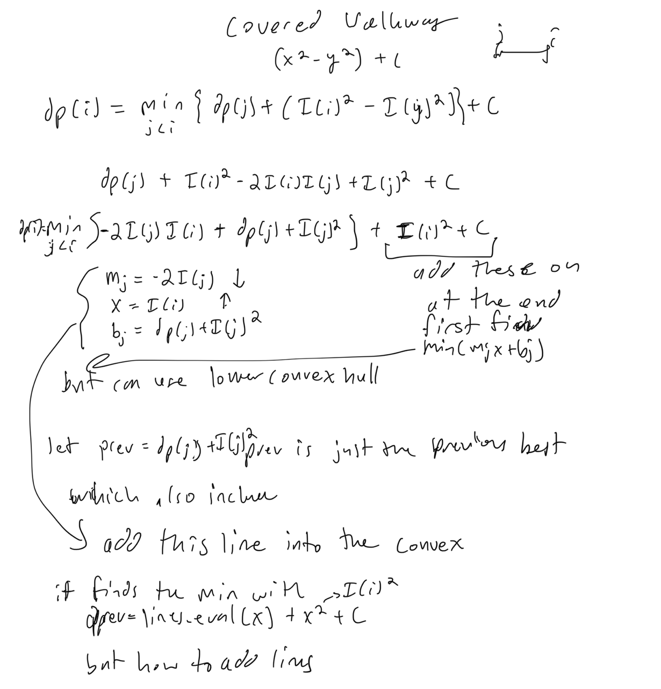

# Convex Hull Trick DP Optimization

Convex hull is an optimization for some dynamic programming problems that satisfy some conditions.  And can take an O(n^2) to O(nlogn) solution often times. 

The simplest form is when the you have a function that is a line, y = mx + b and you are finding the hull of the line.  Then there are variations in techniques when dealing with some conditions.

## Deque optimization

1. The lines can be added in sorted order of slope
2. The query positions are in sorted order

Variation 1:
1. Maximize result, upper convex hull
2. The lines are added in weakly increasing slope
3. The query positions are in weakly increasing order

Example Problems: 
[Commando]<https://dmoj.ca/problem/apio10p1>

These can be solved with a deque to maintain the slopes in sorted order to remove from front and back to maintain only lines that could potentially be optimal solution.

### Commando

```cpp
struct line {
    int m, b;
    int eval(int x) {
        return m * x + b;
    }
};

inline bool overlap(const line &p1, const line &p2, const line &p3) {
  return (p1.m - p2.m) * (p3.b - p1.b) <= (p1.m - p3.m) * (p2.b - p1.b);
}

int n, a, b, c;
deque<line> lines;
vector<int> arr;

signed main() {
    ios::sync_with_stdio(0);
    cin.tie(0);
    cout.tie(0);
    lines.clear();
    lines.push_back({0, 0});
    cin >> n;
    cin >> a >> b >> c;
    arr.resize(n);
    for (int i = 0; i < n; i++) {
        cin >> arr[i];
    }
    // go through queries in sorted order
    // x = psum[j]
    int prev = 0, x = 0;
    for (int i = 0; i < n; i++) {
        x += arr[i];
        while (lines.size() >= 2 && lines[0].eval(x) <= lines[1].eval(x)) {
            lines.pop_front();
        }
        prev = lines[0].eval(x) + a * x * x + b * x + c;
        int m = -2 * a * x;
        int y_intercept = prev + a * x * x - b * x;
        line cur = line{m, y_intercept};
        while (lines.size() >= 2 && overlap(lines.end()[-2], lines.end()[-1], cur)) {
            lines.pop_back();
        }
        lines.push_back(cur);
    }
    cout << prev << endl;
    return 0;
}
```

Variation 2:
1. Minimize result, lower convex hull
2. The lines are added in weakly decreasing slope
3. The query positions are in weakly increasing order

Solve minimize problem same way as maximize by negating the slope and y-intercept and basically mirroring the graph over the x-axis.

[covered walkway]<https://open.kattis.com/problems/coveredwalkway>



The one thing that is wrong about the image is that it should be min_j<=i
You can have j == i because you can pick (x - x)^2, it is one of the cases

This is a little weird, because it means you can add the current line into the set to be process at the start and use it.

```cpp
struct line {
    int m, b;
    int eval(int x) {
        return m * x + b;
    }
};

// checks overlap and avoids any doubles
inline bool overlap(const line &p1, const line &p2, const line &p3) {
  return (p1.m - p2.m) * (p3.b - p1.b) <= (p1.m - p3.m) * (p2.b - p1.b);
}

deque<line> lines;
int N, C, x;

signed main() {
    ios::sync_with_stdio(0);
    cin.tie(0);
    cout.tie(0);
    cin >> N >> C;
    int prev = 0;
    for (int i = 0; i < N; i++) {
        cin >> x;
        int m = -2LL * x;
        int b = x * x + prev;
        line cur = {m, b};
        // adding line into set of lines
        while (lines.size() >= 2 && overlap(lines.end()[-2], lines.end()[-1], cur)) {
            lines.pop_back();
        }
        lines.push_back(cur);
        // query the set of lines
        while (lines.size() >= 2 && lines[0].eval(x) >= lines[1].eval(x)) {
            lines.pop_front();
        }
        prev = lines[0].eval(x) + x * x + C;
    }
    cout << prev << endl;
    return 0;
}
```

Variation 3: 


## Another

1. The line are added in sorted order
2. The query positions are in arbitrary order


## Another

1. The lines are added in arbitrary order
2. The query positions are in arbitrary order

I believe this is when you have to use a multiset data structure

