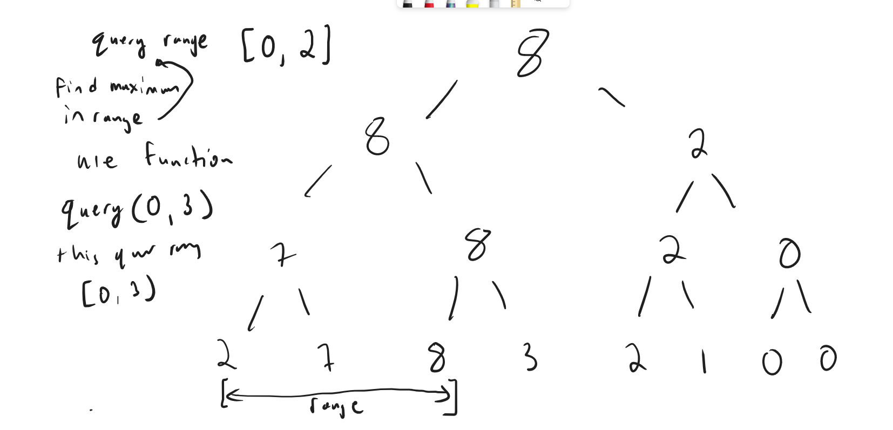

# SEGMENT TREES



## segment tree

Base segment tree that takes in a function and a neutral element and some initial array

Just note for range queries it is querying the range [L, R), so that means it does not include R.  So you are actually searching the range [L, R - 1]

```py
class SegmentTree:
    def __init__(self, n, neutral, func, initial_arr):
        self.func = func
        self.neutral = neutral
        self.size = 1
        self.n = n
        while self.size<n:
            self.size*=2
        self.nodes = [neutral for _ in range(self.size*2)] 
        self.build(initial_arr)

    def build(self, initial_arr):
        for i, segment_idx in enumerate(range(self.n)):
            segment_idx += self.size - 1
            val = initial_arr[i]
            self.nodes[segment_idx] = val
            self.ascend(segment_idx)

    def ascend(self, segment_idx):
        while segment_idx > 0:
            segment_idx -= 1
            segment_idx >>= 1
            left_segment_idx, right_segment_idx = 2*segment_idx + 1, 2*segment_idx + 2
            self.nodes[segment_idx] = self.func(self.nodes[left_segment_idx], self.nodes[right_segment_idx])
        
    def update(self, segment_idx, val):
        segment_idx += self.size - 1
        self.nodes[segment_idx] = val
        self.ascend(segment_idx)
            
    def query(self, left, right):
        stack = [(0, self.size, 0)]
        result = self.neutral
        while stack:
            # BOUNDS FOR CURRENT INTERVAL and idx for tree
            segment_left_bound, segment_right_bound, segment_idx = stack.pop()
            # NO OVERLAP
            if segment_left_bound >= right or segment_right_bound <= left: continue
            # COMPLETE OVERLAP
            if segment_left_bound >= left and segment_right_bound <= right:
                result = self.func(result, self.nodes[segment_idx])
                continue
            # PARTIAL OVERLAP
            mid_point = (segment_left_bound + segment_right_bound) >> 1
            left_segment_idx, right_segment_idx = 2*segment_idx + 1, 2*segment_idx + 2
            stack.extend([(mid_point, segment_right_bound, right_segment_idx), (segment_left_bound, mid_point, left_segment_idx)])
        return result
    
    def __repr__(self):
        return f"nodes array: {self.nodes}"
```

segment tree without initial array

```py
class SegmentTree:
    def __init__(self, n: int, neutral: int, func):
        self.func = func
        self.neutral = neutral
        self.size = 1
        self.n = n
        while self.size<n:
            self.size*=2
        self.nodes = [neutral for _ in range(self.size*2)]

    def ascend(self, segment_idx: int) -> None:
        while segment_idx > 0:
            segment_idx -= 1
            segment_idx >>= 1
            left_segment_idx, right_segment_idx = 2*segment_idx + 1, 2*segment_idx + 2
            self.nodes[segment_idx] = self.func(self.nodes[left_segment_idx], self.nodes[right_segment_idx])
        
    def update(self, segment_idx: int, val: int) -> None:
        segment_idx += self.size - 1
        self.nodes[segment_idx] = val
        self.ascend(segment_idx)
            
    def query(self, left: int, right: int) -> int:
        stack = [(0, self.size, 0)]
        result = self.neutral
        while stack:
            # BOUNDS FOR CURRENT INTERVAL and idx for tree
            segment_left_bound, segment_right_bound, segment_idx = stack.pop()
            # NO OVERLAP
            if segment_left_bound >= right or segment_right_bound <= left: continue
            # COMPLETE OVERLAP
            if segment_left_bound >= left and segment_right_bound <= right:
                result = self.func(result, self.nodes[segment_idx])
                continue
            # PARTIAL OVERLAP
            mid_point = (segment_left_bound + segment_right_bound) >> 1
            left_segment_idx, right_segment_idx = 2*segment_idx + 1, 2*segment_idx + 2
            stack.extend([(mid_point, segment_right_bound, right_segment_idx), (segment_left_bound, mid_point, left_segment_idx)])
        return result
    
    def __repr__(self) -> str:
        return f"nodes array: {self.nodes}"
```

This variation was needed for a problem where you want to always keep the minimum or maximum value of an integer at an index in a segment tree, so that means the update function is updating based on the self.func(cur, val)

```py
class SegmentTree:
    def __init__(self, n: int, neutral: int, func):
        self.func = func
        self.neutral = neutral
        self.size = 1
        self.n = n
        while self.size<n:
            self.size*=2
        self.nodes = [neutral for _ in range(self.size*2)]

    def ascend(self, segment_idx: int) -> None:
        while segment_idx > 0:
            segment_idx -= 1
            segment_idx >>= 1
            left_segment_idx, right_segment_idx = 2*segment_idx + 1, 2*segment_idx + 2
            self.nodes[segment_idx] = self.func(self.nodes[left_segment_idx], self.nodes[right_segment_idx])
        
    def update(self, segment_idx: int, val: int) -> None:
        segment_idx += self.size - 1
        self.nodes[segment_idx] = self.func(self.nodes[segment_idx], val)
        self.ascend(segment_idx)
            
    def query(self, left: int, right: int) -> int:
        stack = [(0, self.size, 0)]
        result = self.neutral
        while stack:
            # BOUNDS FOR CURRENT INTERVAL and idx for tree
            segment_left_bound, segment_right_bound, segment_idx = stack.pop()
            # NO OVERLAP
            if segment_left_bound >= right or segment_right_bound <= left: continue
            # COMPLETE OVERLAP
            if segment_left_bound >= left and segment_right_bound <= right:
                result = self.func(result, self.nodes[segment_idx])
                continue
            # PARTIAL OVERLAP
            mid_point = (segment_left_bound + segment_right_bound) >> 1
            left_segment_idx, right_segment_idx = 2*segment_idx + 1, 2*segment_idx + 2
            stack.extend([(mid_point, segment_right_bound, right_segment_idx), (segment_left_bound, mid_point, left_segment_idx)])
        return result
    
    def __repr__(self) -> str:
        return f"nodes array: {self.nodes}, next array: {self.nodes}"
```

## Segment tree for mex

It can deal with updates to values in an array and find the mex for each query. 

```py
class SegmentTree:
    def __init__(self, n: int, neutral: int, func):
        self.func = func
        self.neutral = neutral
        self.size = 1
        self.n = n
        while self.size<n:
            self.size*=2
        self.nodes = [neutral for _ in range(self.size*2)]
    def ascend(self, segment_idx: int) -> None:
        while segment_idx > 0:
            segment_idx -= 1
            segment_idx >>= 1
            left_segment_idx, right_segment_idx = 2*segment_idx + 1, 2*segment_idx + 2
            self.nodes[segment_idx] = self.func(self.nodes[left_segment_idx], self.nodes[right_segment_idx]) 
    def update(self, segment_idx: int, val: int) -> None:
        segment_idx += self.size - 1
        self.nodes[segment_idx] += val
        self.ascend(segment_idx)
    def query_mex(self) -> int:
        segment_left_bound, segment_right_bound, segment_idx = 0, self.size, 0
        while segment_left_bound + 1 < segment_right_bound:
            mid_point = (segment_left_bound + segment_right_bound) >> 1
            left_segment_idx, right_segment_idx = 2 * segment_idx + 1, 2 * segment_idx + 2
            child_segment_len = (segment_right_bound - segment_left_bound) >> 1
            if self.nodes[left_segment_idx] < child_segment_len:
                segment_idx = left_segment_idx
                segment_right_bound = mid_point
            else:
                segment_idx = right_segment_idx
                segment_left_bound = mid_point
        return segment_left_bound
    def __repr__(self) -> str:
        return f"nodes array: {self.nodes}, next array: {self.nodes}"

freq = Counter()
summation = lambda x, y: x + y
seg = SegmentTree(MAXN + 1, 0, summation)  
for num in arr:
    freq[num] += 1
    if freq[num] == 1 and num <= MAXN:
        seg.update(num, 1)
```

## Fast Segment tree in C++ Point updates and Range Queries PURQ

point update, range query

Implement the function in here, such as max for func, but it can be other functions.  and update each index value. 

Inclusive queries [left, right].  

this is the best one right now for C++

```cpp
struct SegmentTree {
    int size;
    vector<int> nodes;

    void init(int num_nodes) {
        size = 1;
        while (size < num_nodes) size *= 2;
        nodes.assign(size * 2, 0);
    }

    int func(int x, int y) {
        return max(x, y);
    }

    void ascend(int segment_idx) {
        while (segment_idx > 0) {
            int left_segment_idx = 2 * segment_idx, right_segment_idx = 2 * segment_idx + 1;
            nodes[segment_idx] = func(nodes[left_segment_idx], nodes[right_segment_idx]);
            segment_idx >>= 1;
        }
    }

    void update(int segment_idx, int val) {
        segment_idx += size;
        nodes[segment_idx] = val;
        segment_idx >>= 1;
        ascend(segment_idx);
    }

    int query(int left, int right) {
        left += size, right += size;
        int res = 0;
        while (left <= right) {
            if (left & 1) {
                res = max(res, nodes[left]);
                left++;
            }
            if (~right & 1) {
                res = max(res, nodes[right]);
                right--;
            }
            left >>= 1, right >>= 1;
        }
        return res;
    }
};
```

## Segment tree for Point updates and full range queries

The basic difference is that when you perform full range query, you can just get the value from seg.nodes[1]

This one shows one with an interesting merge methodology.

This is for a problem where you have a dynamic programming solution, but you are updating values, which you can then update the rest of the tree and propagate to the root or full segment by the fact you can merge two segments with some arithmetic.

```cpp
struct Node {
    int cumsum_prefix_products, cumsum_suffix_products, prefix_product, exp;
};

struct SegmentTree {
    int size;
    vector<Node> nodes;
    void init(int num_nodes) {
        size = 1;
        while (size < num_nodes) size *= 2;
        nodes.assign(size * 2, {0, 0, 1, 0});
    }
    Node func(Node x, Node y) {
        Node res;
        res.cumsum_prefix_products = (x.cumsum_prefix_products + (y.cumsum_prefix_products * x.prefix_product) % MOD) % MOD;
        res.prefix_product = (x.prefix_product * y.prefix_product) % MOD;
        res.cumsum_suffix_products = ((x.cumsum_suffix_products * y.prefix_product) % MOD + y.cumsum_suffix_products) % MOD;
        res.exp = (x.exp + y.exp + (x.cumsum_suffix_products * y.cumsum_prefix_products) % MOD) % MOD;
        return res;
    }
    void ascend(int segment_idx) {
        while (segment_idx > 0) {
            int left_segment_idx = 2 * segment_idx, right_segment_idx = 2 * segment_idx + 1;
            nodes[segment_idx] = func(nodes[left_segment_idx], nodes[right_segment_idx]);
            segment_idx >>= 1;
        }
    }
    void update(int segment_idx, int val) {
        segment_idx += size;
        nodes[segment_idx] = {val, val, val, val};
        segment_idx >>= 1;
        ascend(segment_idx);
    }
};
```