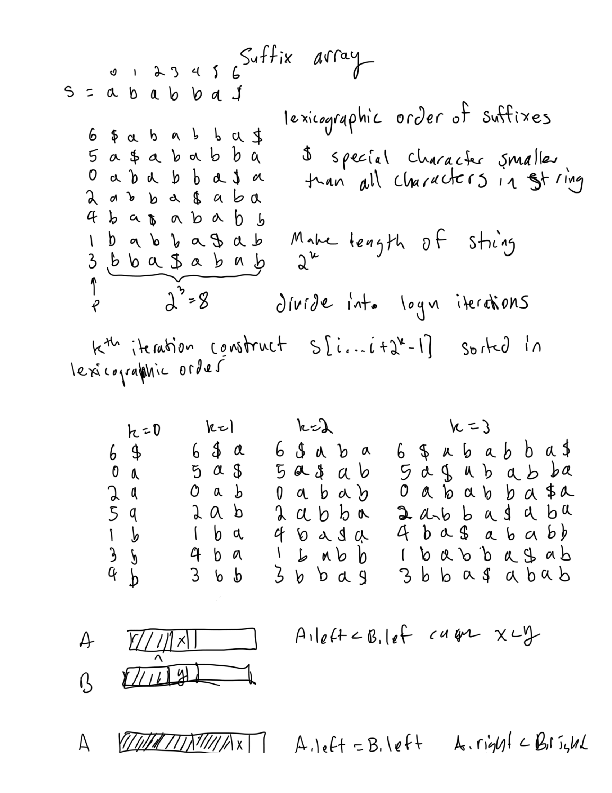
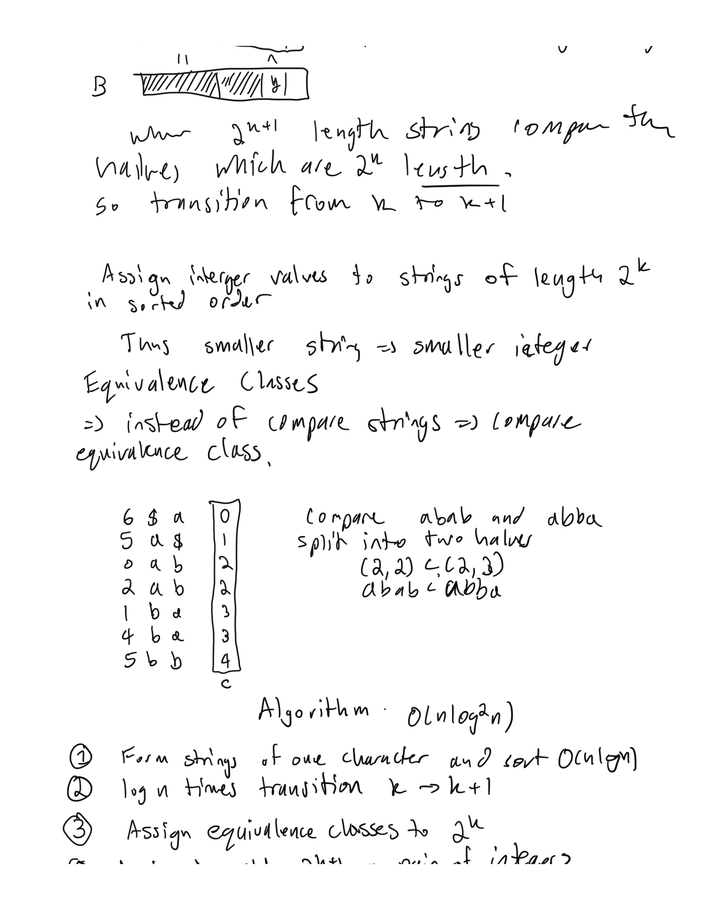
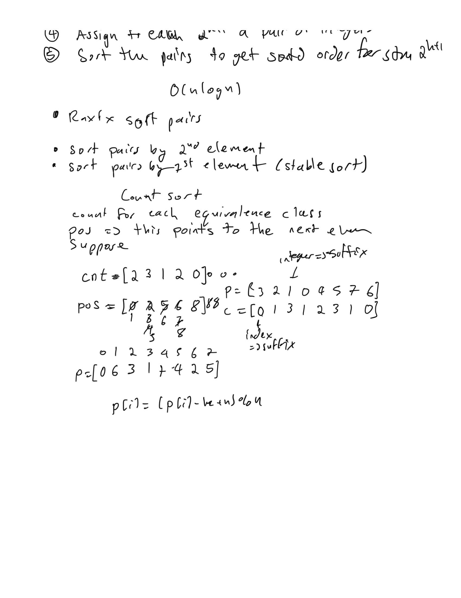
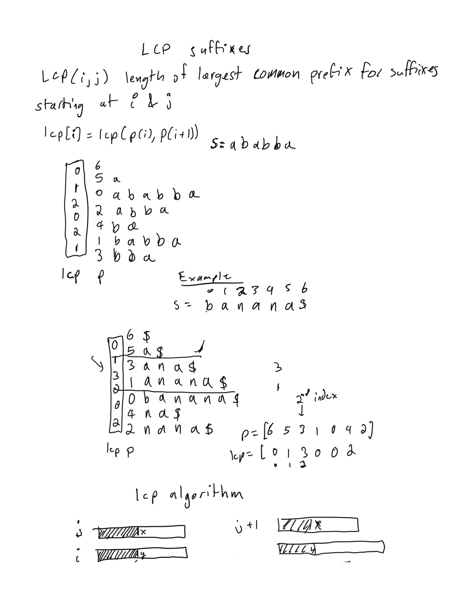
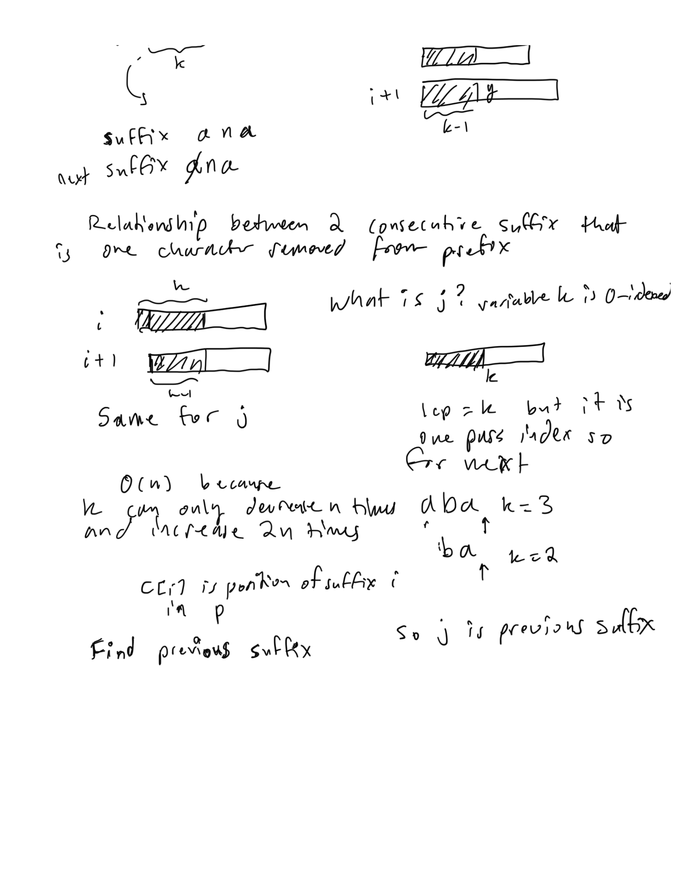
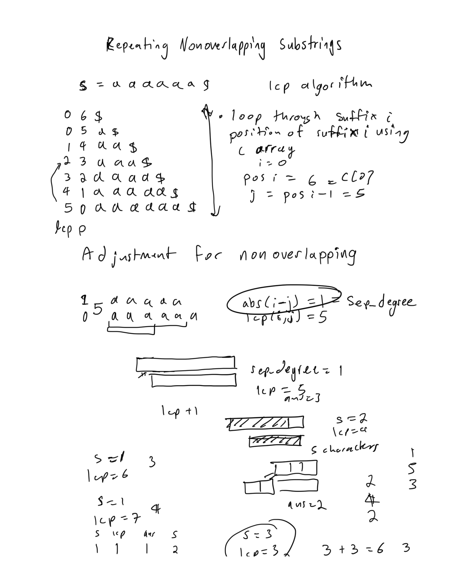
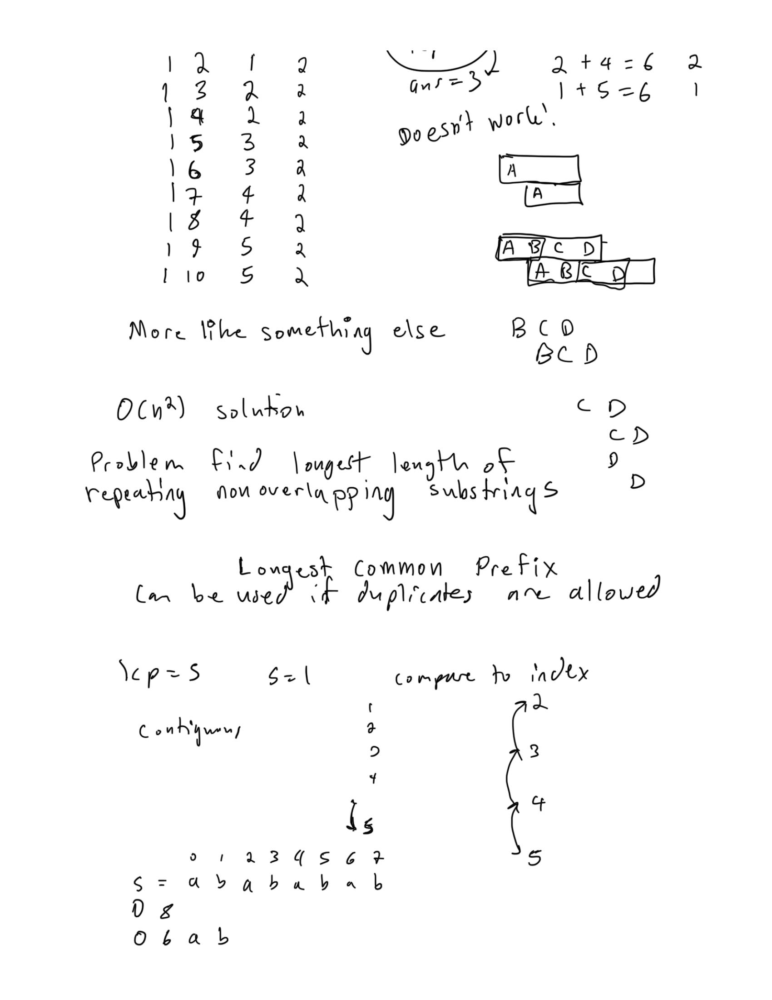
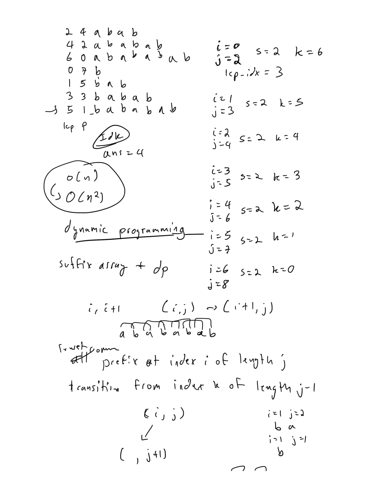
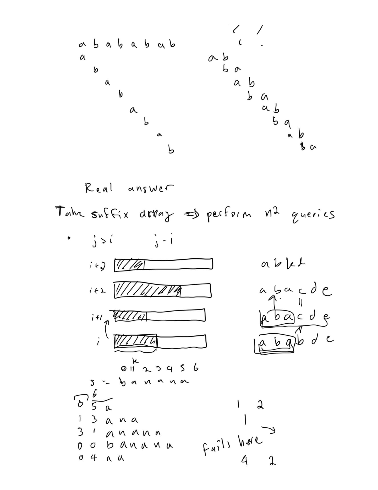
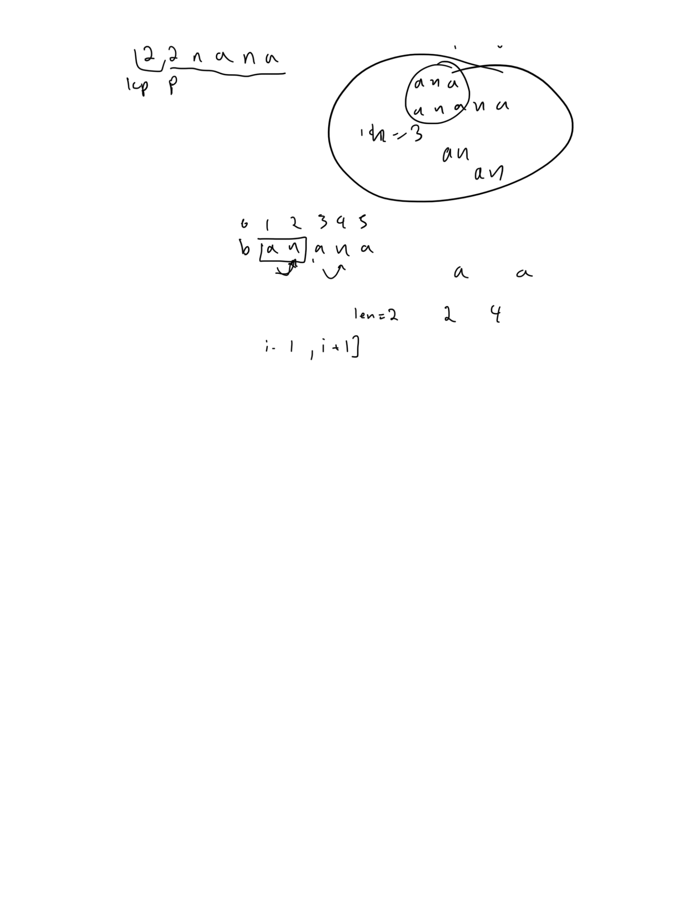

# suffix array

## Simplest implementation O(nlog^2(n)) time and O(n) space

"$" is smaller than any other character

1. Form strings of one character and sort 
1. log n time perform transition k to k + 1
1. Assign equivalence classes to strings 2^k
1. Assign to each string 2^(k+1) a pair of integers from equivalence classes for each half
1. Sort the pairs to get sorted order for string 2^(k+1)

```py
from typing import List
def suffix_array(s: str) -> List[int]:
    n = len(s)
    p, c = [0]*n, [0]*n
    arr = [None]*n
    for i, ch in enumerate(s):
        arr[i] = (ch, i)
    arr.sort()
    for i, (_, j) in enumerate(arr):
        p[i] = j
    c[p[0]] = 0
    for i in range(1,n):
        c[p[i]] = c[p[i-1]] + (arr[i][0] != arr[i-1][0])
    k = 1
    is_finished = False
    while k < n and not is_finished:
        for i in range(n):
            arr[i] = (c[i], c[(i+k)%n], i)
        arr.sort()
        for i, (_, _, j) in enumerate(arr):
            p[i] = j
        c[p[0]] = 0
        is_finished = True
        for i in range(1,n):
            c[p[i]] = c[p[i-1]] + (arr[i][:2] != arr[i-1][:2]) # slow part
            is_finished &= (c[p[i]] != c[p[i-1]])
        k <<= 1
    return ' '.join(map(str, p))
 
def main():
    s = input() + '$'
    return suffix_array(s)
 
if __name__ == '__main__':
    print(main())
```

Suffix array is an array of integers, where the integers represent the suffix from a string.
the integer in suffix array represents the starting index for the suffix. 
suffix array is these suffix index sorted in order of suffix order from ascending order

sorting is O(n+k) where k is the range of values in the string.

To use this you must append the "$" character at end of the string, to get the suffix array sorted.

```py
from typing import List
def radix_sort(leaderboard: List[int], equivalence_class: List[int]) -> List[int]:
    n = len(leaderboard)
    bucket_size = [0]*n
    for eq_class in equivalence_class:
        bucket_size[eq_class] += 1
    bucket_pos = [0]*n
    for i in range(1, n):
        bucket_pos[i] = bucket_pos[i-1] + bucket_size[i-1]
    updated_leaderboard = [0]*n
    for i in range(n):
        eq_class = equivalence_class[leaderboard[i]]
        pos = bucket_pos[eq_class]
        updated_leaderboard[pos] = leaderboard[i]
        bucket_pos[eq_class] += 1
    return updated_leaderboard

def suffix_array(s: str) -> List[int]:
    n = len(s)
    arr = [None]*n
    for i, ch in enumerate(s):
        arr[i] = (ch, i)
    arr.sort()
    leaderboard = [0]*n
    equivalence_class = [0]*n
    for i, (_, j) in enumerate(arr):
        leaderboard[i] = j
    equivalence_class[leaderboard[0]] = 0
    for i in range(1, n):
        left_segment = arr[i-1][0]
        right_segment = arr[i][0]
        equivalence_class[leaderboard[i]] = equivalence_class[leaderboard[i-1]] + (left_segment != right_segment)
    is_finished = False
    k = 1
    while k < n and not is_finished:
        for i in range(n):
            leaderboard[i] = (leaderboard[i] - k + n)%n # create left segment, keeps sort of the right segment
        leaderboard = radix_sort(leaderboard, equivalence_class) # radix sort for the left segment
        updated_equivalence_class = [0]*n
        updated_equivalence_class[leaderboard[0]] = 0
        for i in range(1, n):
            left_segment = (equivalence_class[leaderboard[i-1]], equivalence_class[(leaderboard[i-1]+k)%n])
            right_segment = (equivalence_class[leaderboard[i]], equivalence_class[(leaderboard[i]+k)%n])
            updated_equivalence_class[leaderboard[i]] = updated_equivalence_class[leaderboard[i-1]] + (left_segment != right_segment)
            is_finished &= (updated_equivalence_class[leaderboard[i]] != updated_equivalence_class[leaderboard[i-1]])
        k <<= 1
        equivalence_class = updated_equivalence_class
    return leaderboard
```

### C++ implementation of suffix array

```cpp
vector<int> bucket_size, bucket_pos, leaderboard, update_leaderboard, equivalence_class, update_equivalence_class;

void radix_sort() {
    int n = leaderboard.size();
    bucket_size.assign(n, 0);
    for (int eq_class : equivalence_class) {
        bucket_size[eq_class]++;
    }
    bucket_pos.assign(n, 0);
    for (int i = 1; i < n; i++) {
        bucket_pos[i] = bucket_pos[i - 1] + bucket_size[i - 1];
    }
    update_leaderboard.assign(n, 0);
    for (int i = 0; i < n; i++) {
        int eq_class = equivalence_class[leaderboard[i]];
        int pos = bucket_pos[eq_class];
        update_leaderboard[pos] = leaderboard[i];
        bucket_pos[eq_class]++;
    }
}

void suffix_array(string& s) {
    int n = s.size();
    vector<pair<char, int>> arr(n);
    for (int i = 0; i < n; i++) {
        arr[i] = {s[i], i};
    }
    sort(arr.begin(), arr.end());
    leaderboard.assign(n, 0);
    equivalence_class.assign(n, 0);
    for (int i = 0; i < n; i++) {
        leaderboard[i] = arr[i].second;
    }
    equivalence_class[leaderboard[0]] = 0;
    for (int i = 1; i < n; i++) {
        int left_segment = arr[i - 1].first;
        int right_segment = arr[i].first;
        equivalence_class[leaderboard[i]] = equivalence_class[leaderboard[i - 1]] + (left_segment != right_segment);
    }
    bool is_finished = false;
    int k = 1;
    while (k < n && !is_finished) {
        for (int i = 0; i < n; i++) {
            leaderboard[i] = (leaderboard[i] - k + n) % n; // create left segment, keeps sort of the right segment
        }
        radix_sort(); // radix sort for the left segment
        swap(leaderboard, update_leaderboard);
        update_equivalence_class.assign(n, 0);
        update_equivalence_class[leaderboard[0]] = 0;
        for (int i = 1; i < n; i++) {
            pair<int, int> left_segment = {equivalence_class[leaderboard[i - 1]], equivalence_class[(leaderboard[i - 1] + k) % n]};
            pair<int, int> right_segment = {equivalence_class[leaderboard[i]], equivalence_class[(leaderboard[i] + k) % n]};
            update_equivalence_class[leaderboard[i]] = update_equivalence_class[leaderboard[i - 1]] + (left_segment != right_segment);
            is_finished &= (update_equivalence_class[leaderboard[i]] != update_equivalence_class[leaderboard[i - 1]]);
        }
        k <<= 1;
        swap(equivalence_class, update_equivalence_class);
    }
}

/*
how to call suffix array, then use the leaderboard
string S + "$";
suffix_array(S);
*/
```

## suffix array and longest common prefix (lcp) array

This requires that you append "$" character at the end of any string, because it includes the empty string in it with that. 

```py
from typing import List
def radix_sort(leaderboard: List[int], equivalence_class: List[int]) -> List[int]:
    n = len(leaderboard)
    bucket_size = [0]*n
    for eq_class in equivalence_class:
        bucket_size[eq_class] += 1
    bucket_pos = [0]*n
    for i in range(1, n):
        bucket_pos[i] = bucket_pos[i-1] + bucket_size[i-1]
    updated_leaderboard = [0]*n
    for i in range(n):
        eq_class = equivalence_class[leaderboard[i]]
        pos = bucket_pos[eq_class]
        updated_leaderboard[pos] = leaderboard[i]
        bucket_pos[eq_class] += 1
    return updated_leaderboard

def suffix_array(s: str) -> List[int]:
    n = len(s)
    arr = [None]*n
    for i, ch in enumerate(s):
        arr[i] = (ch, i)
    arr.sort()
    leaderboard = [0]*n
    equivalence_class = [0]*n
    for i, (_, j) in enumerate(arr):
        leaderboard[i] = j
    equivalence_class[leaderboard[0]] = 0
    for i in range(1, n):
        left_segment = arr[i-1][0]
        right_segment = arr[i][0]
        equivalence_class[leaderboard[i]] = equivalence_class[leaderboard[i-1]] + (left_segment != right_segment)
    is_finished = False
    k = 1
    while k < n and not is_finished:
        for i in range(n):
            leaderboard[i] = (leaderboard[i] - k + n)%n # create left segment, keeps sort of the right segment
        leaderboard = radix_sort(leaderboard, equivalence_class) # radix sort for the left segment
        updated_equivalence_class = [0]*n
        updated_equivalence_class[leaderboard[0]] = 0
        for i in range(1, n):
            left_segment = (equivalence_class[leaderboard[i-1]], equivalence_class[(leaderboard[i-1]+k)%n])
            right_segment = (equivalence_class[leaderboard[i]], equivalence_class[(leaderboard[i]+k)%n])
            updated_equivalence_class[leaderboard[i]] = updated_equivalence_class[leaderboard[i-1]] + (left_segment != right_segment)
            is_finished &= (updated_equivalence_class[leaderboard[i]] != updated_equivalence_class[leaderboard[i-1]])
        k <<= 1
        equivalence_class = updated_equivalence_class
    return leaderboard, equivalence_class

def lcp(leaderboard: List[int], equivalence_class: List[int], s: str) -> List[int]:
    n = len(s)
    lcp = [0]*(n-1)
    k = 0
    for i in range(n-1):
        pos_i = equivalence_class[i]
        j = leaderboard[pos_i - 1]
        while s[i + k] == s[j + k]: k += 1
        lcp[pos_i-1] = k
        k = max(k - 1, 0)
    return lcp
```

## suffix array notes







## Longest repeated substring

This one can be solved with suffix array and LCP array. The time complexity is O(nlogn) and space complexity is O(n). 

Uses the code above for suffix and lcp array

```py
def longestDupSubstring(self, s: str) -> str:
    s += '$'
    n = len(s)
    p, c = suffix_array(s)
    lcp_arr = lcp(p, c, s)
    idx = max(range(n - 1), key = lambda i: lcp_arr[i])
    len_ = lcp_arr[idx]
    suffix_index = p[idx]
    return s[suffix_index: suffix_index + len_]
```

## notes for longest repeated and non overlapping substring

At first I tried to get suffix array and lcp array to work to solve this problem.  But I found contradictions that lead me to believe it doens't work.  And the best solution is dynamic programming that is relatively easy to learn.







## Longest repeated and non-overlapping substring

Dynamic programming with time complexity of O(n^2) can solve this one. 

dp[i][j] is the longest common substring with both substrings ending at ith and jth character. The transition is from the i-1 j-1 end character.  So if the current characters are equal and the length doesn't cause overlap of the substrings then it's good. 


```py
def longestSubstring(self, S , N):
    dp = [[0]*(N + 1) for _ in range(N + 1)]
    max_len = 0
    res = ''
    for i in range(N):
        for j in range(i + 1, N):
            if S[i] == S[j] and dp[i][j] < j - i:
                dp[i + 1][j + 1] = max(dp[i + 1][j + 1], dp[i][j] + 1)
                if dp[i + 1][j + 1] > max_len:
                    max_len = dp[i + 1][j + 1]
                    res = S[i - max_len + 1 : i + 1]
    return res if len(res) > 0 else -1
```

## Given multiple patterns matching to a string text

This can be used to solve problems involving you have Q queries, where each query is a string.
Then you want to find the count or the positions in some text string S, where those queries are a substring of the text.
