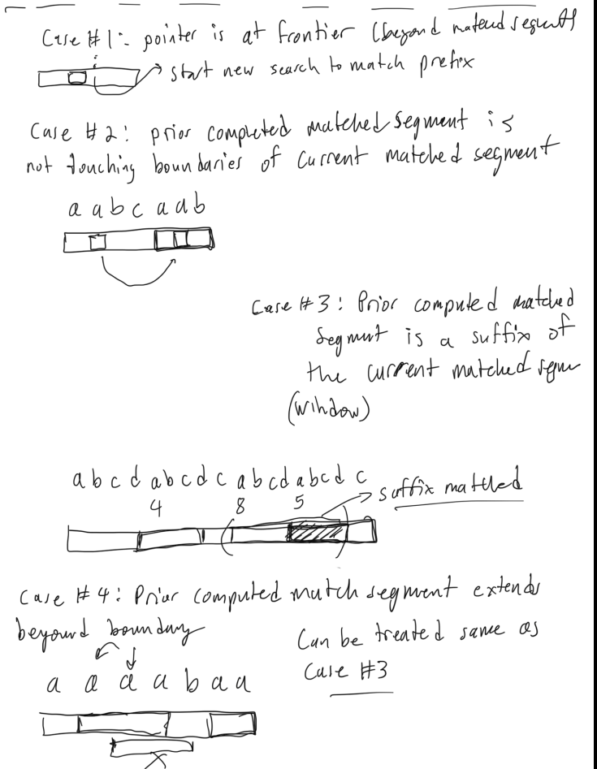

# Z Algorithm

The Z algorithm is a linear time string matching algorithm which prepares an array Z where each Z[i] represents the length of the longest substring starting from i that is also a prefix of the string.  Essentially, the z array helps in finding all occurrences of a pattern within a text in linear time. 

Just think the pattern is the prefix, so if you find a substring that is length of the pattern which is prefix than it matches the pattern.



## Z algorithm implemented in python

This is an implementation of the Z algorithm for computing matching substrings in a string with the prefix of the string
This part will return the z-array which can be used for a few things.

The best way to check if a pattern exist in a string is to pass in a string with 
pat$text, for if you are determining if pat exists in text.  The $ is ust a character that doesn't appear in the pat or text, that way it is a delimiter. So that 
you can look for values of z_array that are equal to the len of the pattern, cause that means it matches a the prefix starting at that index in text.  But also the prefix 
it matching is pat if the value of z_array equals the len(pat).  So it can be used to find all the indices where pat matches in text in linear time.  

```py
def z_algorithm(s: str) -> list[int]:
    n = len(s)
    z = [0]*n
    left = right = 0
    for i in range(1,n):
        # BEYOND CURRENT MATCHED SEGMENT, TRY TO MATCH WITH PREFIX
        if i > right:
            left = right = i
            while right < n and s[right-left] == s[right]:
                right += 1
            z[i] = right - left
            right -= 1
        else:
            k = i - left
            # IF PREVIOUS MATCHED SEGMENT IS NOT TOUCHING BOUNDARIES OF CURRENT MATCHED SEGMENT
            if z[k] < right - i + 1:
                z[i] = z[k]
            # IF PREVIOUS MATCHED SEGMENT TOUCHES OR PASSES THE RIGHT BOUNDARY OF CURRENT MATCHED SEGMENT
            else:
                left = i
                while right < n and s[right-left] == s[right]:
                    right += 1
                z[i] = right - left
                right -= 1
    return z
```