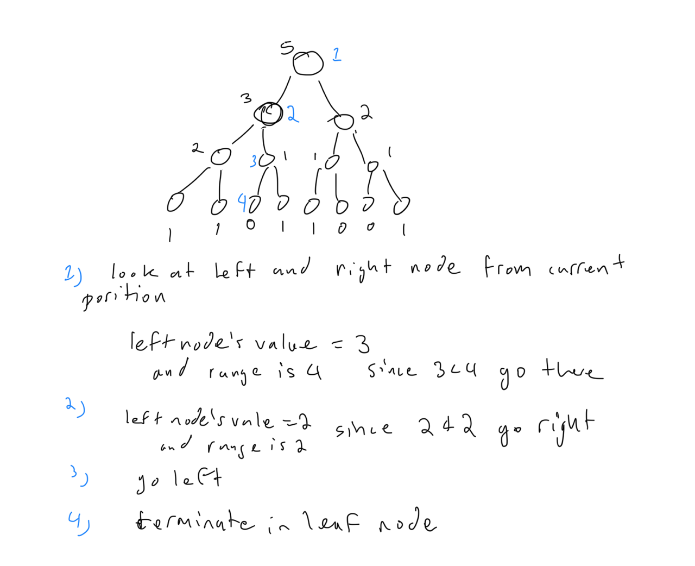

# Atcoder Beginner Contest 330

## E - Mex and Update 

### Solution 1:  frequency table, segment tree, mex queries in segment tree, range sum segment tree, PURQ segment tree

-1 means remove from segment tree
+1 means add to segment tree



```py
from collections import Counter

class SegmentTree:
    def __init__(self, n: int, neutral: int, func):
        self.func = func
        self.neutral = neutral
        self.size = 1
        self.n = n
        while self.size<n:
            self.size*=2
        self.nodes = [neutral for _ in range(self.size*2)]
    def ascend(self, segment_idx: int) -> None:
        while segment_idx > 0:
            segment_idx -= 1
            segment_idx >>= 1
            left_segment_idx, right_segment_idx = 2*segment_idx + 1, 2*segment_idx + 2
            self.nodes[segment_idx] = self.func(self.nodes[left_segment_idx], self.nodes[right_segment_idx]) 
    def update(self, segment_idx: int, val: int) -> None:
        segment_idx += self.size - 1
        self.nodes[segment_idx] += val
        self.ascend(segment_idx)
    def query_mex(self) -> int:
        segment_left_bound, segment_right_bound, segment_idx = 0, self.size, 0
        while segment_left_bound + 1 < segment_right_bound:
            mid_point = (segment_left_bound + segment_right_bound) >> 1
            left_segment_idx, right_segment_idx = 2 * segment_idx + 1, 2 * segment_idx + 2
            child_segment_len = (segment_right_bound - segment_left_bound) >> 1
            if self.nodes[left_segment_idx] < child_segment_len:
                segment_idx = left_segment_idx
                segment_right_bound = mid_point
            else:
                segment_idx = right_segment_idx
                segment_left_bound = mid_point
        return segment_left_bound
    def __repr__(self) -> str:
        return f"nodes array: {self.nodes}, next array: {self.nodes}"
    
MAXN = 2 * 10**5

def main():
    N, Q = map(int, input().split())
    arr = list(map(int, input().split()))
    freq = Counter()
    summation = lambda x, y: x + y
    seg = SegmentTree(MAXN + 1, 0, summation)  
    for num in arr:
        freq[num] += 1
        if freq[num] == 1 and num <= MAXN:
            seg.update(num, 1)
    for _ in range(Q):
        i, x = map(int, input().split())
        i -= 1
        freq[arr[i]] -= 1
        if freq[arr[i]] == 0 and arr[i] <= MAXN:
            seg.update(arr[i], -1)
        arr[i] = x
        freq[arr[i]] += 1
        if freq[arr[i]] == 1 and arr[i] <= MAXN:
            seg.update(arr[i], 1)
        print(seg.query_mex())

if __name__ == '__main__':
    main()
```

## F - Minimize Bounding Square 

### Solution 1: 

```py

```

## G - Inversion Squared 

### Solution 1: 

```py

```