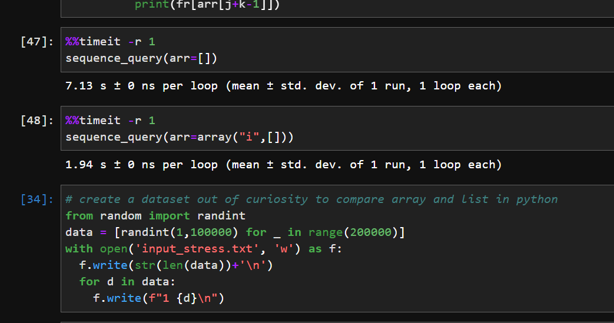

# Atcoder Beginner Contest 241

Problems A and B were just simple for loops and for B using a 
hashmap or dictionary for storing counts.

Problem C I just created a sliding window algorithm that goes
over the horizontal, vertical, and diagonals.  It was heavy
on implementation.  I did not clean up the code so that I could
move on to other problem. 

## D. Sequence Query

### Solution: multiset + binary search + online query

This solution uses a multiset to be able to efficiently maintain
a sorted list of values

TC: O(NlogN)

```c++
#include <bits/stdc++.h>
using namespace std;

multiset<long long> A;

long long klargest(long long x, int k) {
  auto itr = A.upper_bound(x);
  for (int i = 0;i<k;i++) {
    if (itr == A.begin()) return -1;
    itr = prev(itr);
  }
  return *itr;
}

long long ksmallest(long long x, int k) {
  auto itr = A.lower_bound(x);
  if (itr == A.end()) return -1;
  for (int i = 1;i<k;i++) {
    itr = next(itr);
    if (itr==A.end()) return -1;
  }
  return *itr;
}

int main() {
  int Q, t, k;
  long long x;
  freopen("input.txt", "r", stdin);
  cin>>Q;
  for (int i = 0;i<Q;i++) {
    cin>>t>>x;
    if (t==1) {
      A.insert(x);
    } else if (t==2) {
      cin>>k;
      cout<<klargest(x, k)<<endl;
    } else {
      cin>>k;
      cout<<ksmallest(x,k)<<endl;
    }
  }
}
```


### Solution: Array + binary search + Coordinate Compression

I'm surprised this one passes, but I guess it is optimized enough with array that
it works. The insert is much quicker as compared with a stress test.  I didn't know
this.  I just did a little comparison 



TC: O(N^2logN)

```py
def sequence_query():

  Q = int(input())
  arr = array("i", [])

  queries = [list(map(int,input().split())) for _ in range(Q)]
  x_values = [queries[i][1] for i in range(Q)]
  x_values = set(x_values)
  x_values = sorted(list(x_values))
  to = {}
  fr = {}
  for i in range(len(x_values)):
    to[x_values[i]] = i
    fr[i] = x_values[i]
  for i in range(Q):
    query = queries[i]
    if query[0] == 1:
      x_index = to[query[1]]
      insort_left(arr, x_index) # nlogn
    elif query[0] == 2:
      x_index = to[query[1]]
      j = bisect_right(arr,x_index)
      k = query[2]
      if k > j:
        print(-1)
      else:
        print(fr[arr[j-k]])
    else:
      x_index = to[query[1]]
      j = bisect_left(arr,x_index)
      k = query[2]
      if k > len(arr) - j:
        print(-1)
      else:
        print(fr[arr[j+k-1]])
```

### Solution: Fenwick Tree + Coordinate Compression

