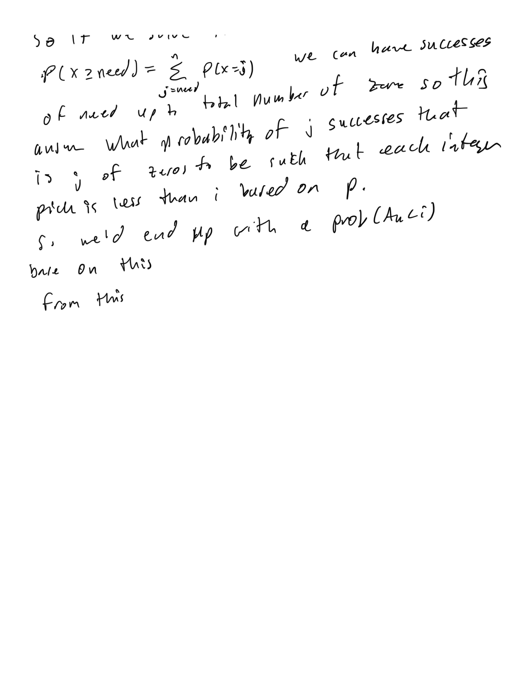

# Atcoder Beginner Contest 295

## What is used at the top of each submission

```py
import os,sys
from io import BytesIO, IOBase
sys.setrecursionlimit(10**6)
from typing import *
import pypyjit
pypyjit.set_param('max_unroll_recursion=-1')
 
# Fast IO Region
BUFSIZE = 8192
class FastIO(IOBase):
    newlines = 0
    def __init__(self, file):
        self._fd = file.fileno()
        self.buffer = BytesIO()
        self.writable = "x" in file.mode or "r" not in file.mode
        self.write = self.buffer.write if self.writable else None
    def read(self):
        while True:
            b = os.read(self._fd, max(os.fstat(self._fd).st_size, BUFSIZE))
            if not b:
                break
            ptr = self.buffer.tell()
            self.buffer.seek(0, 2), self.buffer.write(b), self.buffer.seek(ptr)
        self.newlines = 0
        return self.buffer.read()
    def readline(self):
        while self.newlines == 0:
            b = os.read(self._fd, max(os.fstat(self._fd).st_size, BUFSIZE))
            self.newlines = b.count(b"\n") + (not b)
            ptr = self.buffer.tell()
            self.buffer.seek(0, 2), self.buffer.write(b), self.buffer.seek(ptr)
        self.newlines -= 1
        return self.buffer.readline()
    def flush(self):
        if self.writable:
            os.write(self._fd, self.buffer.getvalue())
            self.buffer.truncate(0), self.buffer.seek(0)
class IOWrapper(IOBase):
    def __init__(self, file):
        self.buffer = FastIO(file)
        self.flush = self.buffer.flush
        self.writable = self.buffer.writable
        self.write = lambda s: self.buffer.write(s.encode("ascii"))
        self.read = lambda: self.buffer.read().decode("ascii")
        self.readline = lambda: self.buffer.readline().decode("ascii")
sys.stdin, sys.stdout = IOWrapper(sys.stdin), IOWrapper(sys.stdout)
input = lambda: sys.stdin.readline().rstrip("\r\n")
```

## A - Probably English 

### Solution 1: set

```py
def main():
    n = int(input())
    words = map(str, input().split())
    lookup = set(['and', 'not', 'that', 'the', 'you'])
    if any(word in lookup for word in words):
        print('Yes')
    else:
        print('No')

if __name__ == '__main__':
    main()
```

## B - Bombs 

### Solution 1:  brute force bfs from each bomb

```py
from itertools import product
 
def main():
    R, C = map(int, input().split())
    grid = [list(input()) for _ in range(R)]
    empty, wall = '.', '#'
    manhattan_distance = lambda a, b: abs(a[0] - b[0]) + abs(a[1] - b[1])
    for r, c in product(range(R), range(C)):
        if grid[r][c] in '.#': continue
        area = int(grid[r][c])
        grid[r][c] = empty
        vis = set()
        vis.add((r, c))
        stack = [(r, c)]
        while stack:
            cr, cc = stack.pop()
            for nr, nc in [(cr + 1, cc), (cr - 1, cc), (cr, cc + 1), (cr, cc - 1)]:
                if 0 <= nr < R and 0 <= nc < C and (nr, nc) not in vis and manhattan_distance((r, c), (nr, nc)) <= area:
                    if grid[nr][nc] == wall: grid[nr][nc] = empty
                    vis.add((nr, nc))
                    stack.append((nr, nc))
    result = '\n'.join(''.join(row) for row in grid)
    print(result)
 
if __name__ == '__main__':
    main()
```

## C - Socks

### Solution 1:  sum

```py
def main():
    n = int(input())
    arr = list(map(int, input().split()))
    counts = Counter(arr)
    print(sum([val//2 for val in counts.values()]))

if __name__ == '__main__':
    main()
```

## D - Three Days Ago 

### Solution 1: prefix + bitmask

Just keep track of a bitmask for the digits for when it has even and odds and sum them up. 

```py
from collections import Counter

def main():
    arr = map(int, list(input()))
    mask_counts = Counter({0: 1})
    prefix_mask = res = 0
    for num in arr:
        prefix_mask ^= (1 << num)
        res += mask_counts[prefix_mask]
        mask_counts[prefix_mask] += 1
    print(res)

if __name__ == '__main__':
    main()
```

## E - Kth Number

### Solution 1:  statistics + binomial distribution + probability 

I wrote down my interpretation of the solution in notes app.




```py
from collections import Counter

def mod_inverse(num, mod):
    return pow(num, mod - 2, mod)

def main():
    # integers between 1 and m
    n, m, k = map(int, input().split())
    freq = Counter(map(int, input().split()))
    mod = 998244353
    fact = [1]*(n + 1)
    for i in range(1, n + 1):
        fact[i] = (fact[i - 1] * i) % mod
    inv_fact = [1]*(n + 1)
    inv_fact[-1] = mod_inverse(fact[-1], mod)
    for i in range(n - 1, -1, -1):
        inv_fact[i] = (inv_fact[i + 1] * (i + 1)) % mod
    def nCr(n, r):
        if n < r: return 0
        return (fact[n] * inv_fact[r] * inv_fact[n - r]) % mod
    def pmf_binomial_distribution(n, m, p):
        return (nCr(n, m) * pow(p, m, mod) * pow(1 - p, n - m, mod))%mod
    cnt_zeros = freq[0]
    # total prob = sum from i = 1 to m of prob(A_k >= i)
    count_less_than_i = total_prob = 0
    for i in range(1, m + 1):
        needed_zeros_to_replace = max(0, k - count_less_than_i)
        if needed_zeros_to_replace == 0: continue
        # p is the probability of success for replacing a 0 with integer less than i
        p = ((i - 1) * mod_inverse(m, mod)) % mod
        prob_less_than_i = 0
        for j in range(needed_zeros_to_replace, cnt_zeros + 1):
            prob_less_than_i = (prob_less_than_i + pmf_binomial_distribution(cnt_zeros, j, p)%mod)%mod
        prob_greater_than_equal_to_i = 1 - prob_less_than_i
        total_prob = (total_prob + prob_greater_than_equal_to_i)%mod
        count_less_than_i += freq[i]
    print(total_prob)

if __name__ == '__main__':
    main()
```

## F - substr = S

### Solution 1:   

```py

```