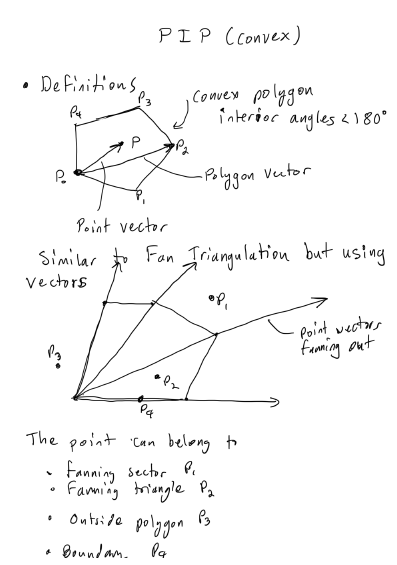
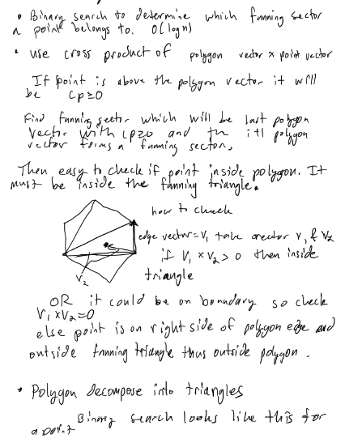
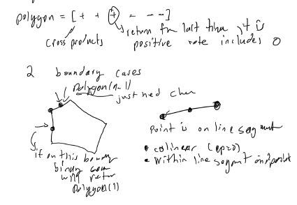
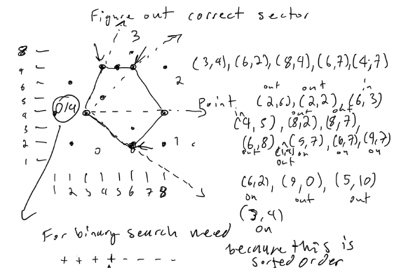

# Atcoder Beginner Contest 296

## What is used at the top of each submission

```py
import os,sys
from io import BytesIO, IOBase
sys.setrecursionlimit(10**6)
from typing import *
# only use pypyjit when needed, it usese more memory, but speeds up recursion in pypy
import pypyjit
pypyjit.set_param('max_unroll_recursion=-1')
 
# Fast IO Region
BUFSIZE = 8192
class FastIO(IOBase):
    newlines = 0
    def __init__(self, file):
        self._fd = file.fileno()
        self.buffer = BytesIO()
        self.writable = "x" in file.mode or "r" not in file.mode
        self.write = self.buffer.write if self.writable else None
    def read(self):
        while True:
            b = os.read(self._fd, max(os.fstat(self._fd).st_size, BUFSIZE))
            if not b:
                break
            ptr = self.buffer.tell()
            self.buffer.seek(0, 2), self.buffer.write(b), self.buffer.seek(ptr)
        self.newlines = 0
        return self.buffer.read()
    def readline(self):
        while self.newlines == 0:
            b = os.read(self._fd, max(os.fstat(self._fd).st_size, BUFSIZE))
            self.newlines = b.count(b"\n") + (not b)
            ptr = self.buffer.tell()
            self.buffer.seek(0, 2), self.buffer.write(b), self.buffer.seek(ptr)
        self.newlines -= 1
        return self.buffer.readline()
    def flush(self):
        if self.writable:
            os.write(self._fd, self.buffer.getvalue())
            self.buffer.truncate(0), self.buffer.seek(0)
class IOWrapper(IOBase):
    def __init__(self, file):
        self.buffer = FastIO(file)
        self.flush = self.buffer.flush
        self.writable = self.buffer.writable
        self.write = lambda s: self.buffer.write(s.encode("ascii"))
        self.read = lambda: self.buffer.read().decode("ascii")
        self.readline = lambda: self.buffer.readline().decode("ascii")
sys.stdin, sys.stdout = IOWrapper(sys.stdin), IOWrapper(sys.stdout)
input = lambda: sys.stdin.readline().rstrip("\r\n")
```

## 

### Solution 1:

```py

```

## 

### Solution 1:

```py

```

## 

### Solution 1:

```py

```

## D - M<=ab

### Solution 1:

```py
import math
import bisect

def main():
    n, m = map(int, input().split())
    if m <= n: return m
    res = math.inf
    f1 = min(n, math.ceil(m/n))
    f2 = bisect.bisect_left(range(n), math.ceil(m/f1))
    if f1*f2 >= m: 
        res = min(res, f1*f2)
    f1 = min(n, m//n)
    f2 = bisect.bisect_left(range(n), math.ceil(m/f1))
    if f1*f2 >= m:
        res = min(res, f1*f2)
    if res >= m and res != math.inf: return res
    return -1

if __name__ == '__main__':
    print(main())
```

## E - Transition Game

### Solution 1:

```py
def main():
    n = int(input())
    arr = list(map(int, input().split()))
    adj_list = [-1]*(n + 1)
    for i in range(n):
        u, v = i + 1, arr[i]
        adj_list[u] = v
    on_stack = [0]*(n + 1)
    disc = [0]*(n + 1)
    time = 0
    res = 0
    def dfs(node):
        nonlocal res, time
        stack = []
        while not disc[node]:
            time += 1
            disc[node] = time
            on_stack[node] = 1
            stack.append(node)
            node = adj_list[node]
        if on_stack[node]:
            while stack:
                res += 1
                x = stack.pop()
                on_stack[x] = 0
                if x == node: break
        while stack:
            x = stack.pop()
            on_stack[x] = 0

    for i in range(1, n + 1):
        if disc[i]: continue
        dfs(i)
    return res

if __name__ == '__main__':
    print(main())
```

## G - Polygon and Points

### Solution 1:  binary search + online query + outer product + sort by angle from polygon vertex + fan triangulation of convex polygon

This is a description of the algorithm, while the images below will give a better idea of what is going on.
We can use this lemma below and is why this works.
lemma 1: fan triangulation works for any convex polygon
1. Use fan triangulation to triangulate the polygon.  Use the first vertex as the initial vertex.
1. binary search for which triangle the point belongs to based on fact that each triangle is sorted by angle with respect to initial vertex in polygon.
1. Check if it is in a triangle and on boundary of the polygon edge
1. check if it is on boundary of polygon edge that is adjacent to the non-triangular region outside of the polygon.
1. Check if it is inside one of the triangles of the polygon from the fan triangulation method.
1. all other cases it would be outside of the polygon






```py
outer_product = lambda v1, v2: v1[0]*v2[1] - v1[1]*v2[0]

def binary_search(point, polygon):
    n = len(polygon)
    left, right = 0, n
    v = (point[0] - polygon[0][0], point[1] - polygon[0][1])
    while left < right:
        mid = (left + right) >> 1
        v1 = (polygon[mid][0] - polygon[0][0], polygon[mid][1] - polygon[0][1])
        outer_prod = outer_product(v1, v)
        if outer_prod >= 0:
            left = mid + 1
        else:
            right = mid
    return left

def main():
    n = int(input())
    polygon = []
    for _ in range(n):
        polygon.append(tuple(map(int, input().split())))
    q = int(input())
    points = []
    for _ in range(q):
        points.append(tuple(map(int, input().split())))
    res = []
    for p in points:
        v = (p[0] - polygon[0][0], p[1] - polygon[0][1])
        i = binary_search(p, polygon) - 1
        p0, p1, p2 = polygon[0], polygon[i], polygon[(i + 1)%n]
        v1, v2 = (p2[0] - p1[0], p2[1] - p1[1]), (p[0] - p1[0], p[1] - p1[1])
        v3 = (p1[0] - p0[0], p1[1] - p0[1])
        edge_outer_prod = outer_product(v1, v2)
        boundary_outer_prod = outer_product(v3, v)
        # boundary cases
        if 0 < i < n - 1:
            if edge_outer_prod == 0:
                res.append('ON')
                continue
        if i == 1 or i == n - 1:
            if boundary_outer_prod == 0 and min(p0[0], p1[0]) <= p[0] <= max(p0[0], p1[0]) and min(p0[1], p1[1]) <= p[1] <= max(p0[1], p1[1]):
                res.append('ON')
                continue
        # check if inside triangle and therefore polygon
        if 0 < i < n - 1 and edge_outer_prod > 0:
            res.append('IN')
        else:
            res.append('OUT')
    return '\n'.join(res)

if __name__ == '__main__':
    print(main())

"""
example that is same as image above
5
3 4
6 2
8 4
6 7
4 7
15
2 6
2 2
6 3
4 5
8 2
8 7
6 8
1 4
5 7
6 7
4 7
6 2
9 0
5 10
3 4

OUT
OUT
IN
IN
OUT
OUT
OUT
OUT
ON
ON
ON
ON
OUT
OUT
ON
"""
```