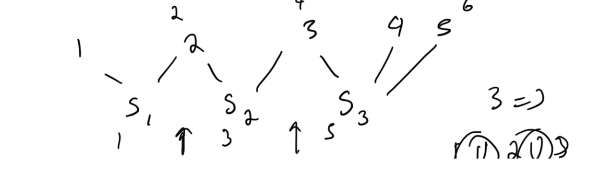

# Atcoder Beginner Contest 302

## What is used at the top of each submission

```py
import os,sys
from io import BytesIO, IOBase
sys.setrecursionlimit(10**6)
from typing import *
# only use pypyjit when needed, it usese more memory, but speeds up recursion in pypy
# import pypyjit
# pypyjit.set_param('max_unroll_recursion=-1')
# sys.stdout = open('output.txt', 'w')

# Fast IO Region
BUFSIZE = 8192
class FastIO(IOBase):
    newlines = 0
    def __init__(self, file):
        self._fd = file.fileno()
        self.buffer = BytesIO()
        self.writable = "x" in file.mode or "r" not in file.mode
        self.write = self.buffer.write if self.writable else None
    def read(self):
        while True:
            b = os.read(self._fd, max(os.fstat(self._fd).st_size, BUFSIZE))
            if not b:
                break
            ptr = self.buffer.tell()
            self.buffer.seek(0, 2), self.buffer.write(b), self.buffer.seek(ptr)
        self.newlines = 0
        return self.buffer.read()
    def readline(self):
        while self.newlines == 0:
            b = os.read(self._fd, max(os.fstat(self._fd).st_size, BUFSIZE))
            self.newlines = b.count(b"\n") + (not b)
            ptr = self.buffer.tell()
            self.buffer.seek(0, 2), self.buffer.write(b), self.buffer.seek(ptr)
        self.newlines -= 1
        return self.buffer.readline()
    def flush(self):
        if self.writable:
            os.write(self._fd, self.buffer.getvalue())
            self.buffer.truncate(0), self.buffer.seek(0)
class IOWrapper(IOBase):
    def __init__(self, file):
        self.buffer = FastIO(file)
        self.flush = self.buffer.flush
        self.writable = self.buffer.writable
        self.write = lambda s: self.buffer.write(s.encode("ascii"))
        self.read = lambda: self.buffer.read().decode("ascii")
        self.readline = lambda: self.buffer.readline().decode("ascii")
sys.stdin, sys.stdout = IOWrapper(sys.stdin), IOWrapper(sys.stdout)
input = lambda: sys.stdin.readline().rstrip("\r\n")
                    
if __name__ == '__main__':
    print(main())
    # main()
    # sys.stdout.close()
```

## A - Attack

### Solution 1:  math

```py
import math
 
def main():
    a, b = map(int, input().split())
    attacks = a // b
    return attacks if a - attacks * b <= 0 else attacks + 1
```

## B - Find snuke

### Solution 1:  bfs

```py
from collections import deque
from itertools import product
 
def solve():
    h, w = map(int, input().split())
    grid = [input() for _ in range(h)]
    target = 'snuke'
    in_bounds = lambda r, c: 0 <= r < h and 0 <= c < w
    main_diag_neighborhood = lambda r, c: [(r + 1, c + 1), (r - 1, c - 1)]
    minor_diag_neighborhood = lambda r, c: [(r + 1, c - 1), (r - 1, c + 1)]
    hor_neighborhood = lambda r, c: [(r, c + 1), (r, c - 1)]
    vert_neighborhood = lambda r, c: [(r + 1, c), (r - 1, c)]
    def bfs(neighborhood):
        queue = deque([(r, c, [(r, c)]) for r, c in product(range(h), range(w)) if grid[r][c] == 's'])
        while queue:
            r, c, points = queue.popleft()
            if len(points) == len(target):
                break
            for nr, nc in neighborhood(r, c):
                if not in_bounds(nr, nc) or grid[nr][nc] != target[len(points)]: continue
                queue.append((nr, nc, points + [(nr, nc)]))
        return points
    main_diag = bfs(main_diag_neighborhood)
    if len(main_diag) == len(target):
        return main_diag
    minor_diag = bfs(minor_diag_neighborhood)
    if len(minor_diag) == len(target):
        return minor_diag
    hor = bfs(hor_neighborhood)
    if len(hor) == len(target):
        return hor
    vert = bfs(vert_neighborhood)
    if len(vert) == len(target):
        return vert
    
def main():
    points = solve()
    for u, v in points:
        print(u + 1, v + 1)
 
if __name__ == '__main__':
    main()
```

## C - Almost Equal

### Solution 1:  bitmask + hamming distance

find if can reach the end_mask meaning visited all nodes given condition can only traverse an edge when edge_weight = 1.  where edge weight is the count of different characters between two strings.

```py
from collections import deque
from itertools import product
 
def solve():
    n, m = map(int, input().split())
    strs = [input() for _ in range(n)]
    dist = [[0]*n for _ in range(n)]
    for i, j in product(range(n), repeat = 2):
        dist[i][j] = sum(1 for k in range(m) if strs[i][k] != strs[j][k])
    vis = [[0]*(1 << n) for _ in range(n)]
    stack = []
    for i in range(n):
        vis[i][1 << i] = 1
        stack.append((i, 1 << i))
    end_mask = (1 << n) - 1
    while stack:
        i, mask = stack.pop()
        if mask == end_mask: return "Yes"
        for j in range(n):
            if dist[i][j] != 1 or ((mask >> j) & 1): continue
            nmask = mask | (1 << j)
            if vis[j][nmask]: continue
            vis[j][nmask] = 1
            stack.append((j, nmask)) 
    return "No"
 
def main():
    print(solve())
 
if __name__ == '__main__':
    main()
```

## D - Impartial Gift

### Solution 1:  sort + two pointers

```py
 def main():
    n, m, d = map(int, input().split())
    A = sorted(list(map(int, input().split())))
    B = sorted(list(map(int, input().split())))
    j = 0
    res = -1
    for i in range(n):
        while j + 1 < m and B[j + 1] <= A[i] + d:
            j += 1
        if abs(A[i] - B[j]) <= d:
            res = max(res, A[i] + B[j])
    print(res)
 
if __name__ == '__main__':
    main()
```

## E - Isolation

### Solution 1:  undirected graph + set adjacency list for removals + degrees

```py
def main():
    n, q = map(int, input().split())
    degrees = [0] * (n + 1)
    adj_list = [set() for _ in range(n + 1)]
    cnt = n
    res = [None] * q
    for i in range(q):
        query = list(map(int, input().split()))
        if query[0] == 1:
            u, v = query[1:]
            cnt -= degrees[u] == 0
            cnt -= degrees[v] == 0
            degrees[u] += 1
            degrees[v] += 1
            adj_list[u].add(v)
            adj_list[v].add(u)
        else:
            u = query[1]
            cnt += degrees[u] > 0
            degrees[u] = 0
            for v in adj_list[u]:
                degrees[v] -= 1
                cnt += degrees[v] == 0
                adj_list[v].discard(u)
            adj_list[u].clear()
        res[i] = cnt
    return '\n'.join(map(str, res))
 
if __name__ == '__main__':
    print(main())
```

## F - Merge Set

### Solution 1:  undirected graph + elements are nodes + sets are nodes + bfs + shortest path from source to destination node

Each edge connects a set to an element



```py
from collections import deque
 
def main():
    n, m = map(int, input().split())
    adj_list = [[] for _ in range(n + m)]
    for i in range(n):
        _ = input()
        arr = list(map(int, input().split()))
        for num in arr:
            adj_list[num - 1].append(m + i)
            adj_list[m + i].append(num - 1)
    queue = deque([0])
    vis = [0] * (n + m)
    vis[0] = 1
    steps = 0
    while queue:
        for _ in range(len(queue)):
            node = queue.popleft()
            if node == m - 1: return steps // 2 - 1
            for nei in adj_list[node]:
                if vis[nei]: continue
                vis[nei] = 1
                queue.append(nei)
        steps += 1
    return -1
 
if __name__ == '__main__':
    print(main())
```

## G - Sort from 1 to 4

### Solution 1

```py
def main():
    n = int(input())
    arr = list(map(int, input().split()))
    res = 0
    def inversion_count(left, right):
        if right-left <= 1: return 0
        mid = (left+right)>>1
        res = inversion_count(left, mid) + inversion_count(mid, right) + merge(left, right, mid)
        return res

    def merge(left, right, mid):
        i, j = left, mid
        temp = []
        inv_count = 0
        while i < mid and j < right:
            if arr[i] <= arr[j]:
                temp.append(arr[i])
                i += 1
            else:
                temp.append(arr[j])
                print('mid', mid, 'i', i, 'j', j)
                inv_count += (mid - i)
                j += 1
        while i < mid:
            temp.append(arr[i])
            i += 1
        while j < right:
            temp.append(arr[j])
            j += 1
        for i in range(left, right):
            arr[i] = temp[i-left]
        return inv_count

    res = inversion_count(0, n)
    return res

if __name__ == '__main__':
    print(main())
```
