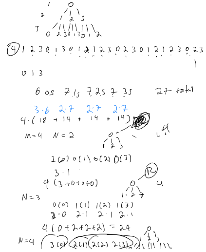
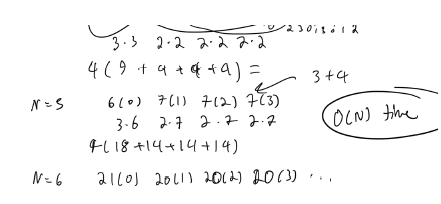

# Atcoder Beginner Contest 307

## What is used at the top of each submission

```py
import os,sys
from io import BytesIO, IOBase
sys.setrecursionlimit(10**6)
from typing import *
# only use pypyjit when needed, it usese more memory, but speeds up recursion in pypy
# import pypyjit
# pypyjit.set_param('max_unroll_recursion=-1')
# sys.stdout = open('output.txt', 'w')

# Fast IO Region
BUFSIZE = 8192
class FastIO(IOBase):
    newlines = 0
    def __init__(self, file):
        self._fd = file.fileno()
        self.buffer = BytesIO()
        self.writable = "x" in file.mode or "r" not in file.mode
        self.write = self.buffer.write if self.writable else None
    def read(self):
        while True:
            b = os.read(self._fd, max(os.fstat(self._fd).st_size, BUFSIZE))
            if not b:
                break
            ptr = self.buffer.tell()
            self.buffer.seek(0, 2), self.buffer.write(b), self.buffer.seek(ptr)
        self.newlines = 0
        return self.buffer.read()
    def readline(self):
        while self.newlines == 0:
            b = os.read(self._fd, max(os.fstat(self._fd).st_size, BUFSIZE))
            self.newlines = b.count(b"\n") + (not b)
            ptr = self.buffer.tell()
            self.buffer.seek(0, 2), self.buffer.write(b), self.buffer.seek(ptr)
        self.newlines -= 1
        return self.buffer.readline()
    def flush(self):
        if self.writable:
            os.write(self._fd, self.buffer.getvalue())
            self.buffer.truncate(0), self.buffer.seek(0)
class IOWrapper(IOBase):
    def __init__(self, file):
        self.buffer = FastIO(file)
        self.flush = self.buffer.flush
        self.writable = self.buffer.writable
        self.write = lambda s: self.buffer.write(s.encode("ascii"))
        self.read = lambda: self.buffer.read().decode("ascii")
        self.readline = lambda: self.buffer.readline().decode("ascii")
sys.stdin, sys.stdout = IOWrapper(sys.stdin), IOWrapper(sys.stdout)
input = lambda: sys.stdin.readline().rstrip("\r\n")
                    
if __name__ == '__main__':
    print(main())
    # main()
    # sys.stdout.close()
```

## A - Weekly Records 

### Solution 1: 

```py
def main():
    n = int(input())
    arr = list(map(int, input().split()))
    for i in range(0, 7 * n, 7):
        res = sum(arr[i:i+7])
        print(res)

if __name__ == '__main__':
    main()
```

## B - racecar 

### Solution 1: 

```py
def main():
    n = int(input())
    words = [input() for _ in range(n)]
    is_palindrome = lambda s1, s2: s1 + s2 == (s1 + s2)[::-1]
    for i in range(n):
        for j in range(i + 1, n):
            if is_palindrome(words[i], words[j]) or is_palindrome(words[j], words[i]):
                return print("Yes")
    print("No")

if __name__ == '__main__':
    main()
```

## C - Ideal Sheet 

### Solution 1:  set + matrix + union of sets + normalize everything to first quadrant and cutout at that spot

The main reason I struggled with this problem is that I didn't realize that X must contain all the black squares from A and B. 

```py
from itertools import product

# i corresponds to the row, and also the position on the y axis
# j corresponds to the column, and also the position on the x axis
def convert(H, W, grid):
    s = set()
    for i, j in product(range(H), range(W)):
        if grid[i][j] == '#':
            s.add((i, j))
    return s

"""
convert everything to the first quadrant, and with minimim black squares on x = 0 and y = 0
"""
def normalize(s):
    min_x, min_y = min(x for y, x in s), min(y for y, x in s)
    return set((y - min_y, x - min_x) for y, x in s)

def main():
    n = int(input())
    HA, WA = map(int, input().split())
    A = normalize(convert(HA, WA, [input() for _ in range(HA)]))
    HB, WB = map(int, input().split())
    B = normalize(convert(HB, WB, [input() for _ in range(HB)]))
    HX, WX = map(int, input().split())
    X = normalize(convert(HX, WX, [input() for _ in range(HX)]))
    res = False
    for dx, dy in product(range(-HX, HX + 1), range(-WX, WX + 1)):
        res |= normalize(A.union(set((y + dy, x + dx) for y, x in B))) == X
    print('Yes' if res else 'No')

if __name__ == '__main__':
    main()
```

## D - Mismatched Parentheses 

### Solution 1:  2 stacks + result string stack and parentheses stack

```py
def main():
    n = int(input())
    s = input()
    result = []
    stack = []
    for ch in s:
        result.append(ch)
        if ch == '(':
            stack.append(ch)
        elif ch == ')' and stack:
            stack.pop()
            while result[-1] != '(':
                result.pop()
            result.pop()
    print(''.join(result))

if __name__ == '__main__':
    main()
```

## E - Distinct Adjacent 

### Solution 1:  dynamic programming + combinatorics + O(n) time + O(1) space

This is a tough one to solve, but you can derive a dynamic programming method.  Since the starting node is important, consider the starting node, you need to do this m times, but because of symmetry and each one is the same you just need to compute it for 1 tree, and multiply result by m at the end. 

So for one tree, you want to track the count of the number of nodes that contain the starting integer and the number of nodes that do not contain the starting integer. 

so if starting node is x1, then others is set of m - 1 other integers that are not x1 or in other words
suppose entire set is S, then it will be the others = S - {x1} from set difference.
then you will have a count for x1, and a count for others

There is a pattern to how these counts change for each level in the tree, it is rather simple though
so let x represent count of starting node that is fixed, and y represent count of the other nodes. 

initially it will be set x = 0, y = 1, because the first level you cannot have the adjacent tree. 

Then for each transition state. it will be that all the m - 1 integers that have count = y.  these will contribute to the fixed integer at the next level so x = (m - 1) * y
Then for the non fixed integers, they will all appear based on the sum of all integers - the count of y, so y = x + (m - 2) * y, which can be represented like this as well. 

Then add everything together as shown in image to get the final result and multiply m.




```py
def main():
    n, m = map(int, input().split())
    mod = 998244353
    x, y = 1, 0
    for _ in range(n - 2):
        nx = ((m - 1) * y) % mod
        ny = (x + (m - 2) * y) % mod 
        x, y = nx, ny
    res = (m * (x * (m - 1) + y * (m - 2) * (m - 1))) % mod
    print(res)

if __name__ == '__main__':
    main()
```

## F - Virus 2 

### Solution 1:  dijkstra + min heap

```py
from heapq import heappush, heappop

def main():
    n, m = map(int, input().split())
    adj_list = [[] for _ in range(n + 1)]
    for _ in range(m):
        u, v, w = map(int, input().split())
        adj_list[u].append((v, w))
        adj_list[v].append((u, w))
    K = int(input())
    start_nodes = map(int, input().split())
    D = int(input())
    dist = [0] + list(map(int, input().split()))
    res = [-1] * (n + 1)
    min_heap = []
    for node in start_nodes:
        res[node] = 0
        for nei, wei in adj_list[node]:
            heappush(min_heap, (wei, nei))
    def dfs(node, rem_dist):
        neighbors = []
        rem_heap = [(rem_dist, node)]
        while rem_heap:
            rem_dist, node = heappop(rem_heap)
            for nei, wei in adj_list[node]:
                if res[nei] != -1: continue
                if wei <= rem_dist:
                    res[nei] = day
                    heappush(rem_heap, (rem_dist - wei, nei))
                else:
                    neighbors.append((wei, nei))
        return neighbors
    for day in range(1, D + 1):
        tomorrow = []
        while min_heap and min_heap[0][0] <= dist[day]:
            wei, node = heappop(min_heap)
            if res[node] != -1: continue
            res[node] = day
            tomorrow.extend(dfs(node, dist[day] - wei))
        for wei, node in tomorrow:
            heappush(min_heap, (wei, node))
    print('\n'.join(map(str, res[1:])))

if __name__ == '__main__':
    main()
```

## G - Approximate Equalization 

### Solution 1:  dynamic programming + prefix sum + O(n^2) time

dp(i, j) = minimum number of operations to make the first j of the first i elements equal to v0 and the rest equal to v1. 

prefix sum can be used to calculate what the last value of the array must have been set to from previous elements. 

then can transition that last_val to v0 or v1, and update the number of operations required for that. 

```py
import math
from itertools import accumulate

def main():
    n = int(input())
    arr = list(map(int, input().split()))
    psum = [0] + list(accumulate(arr))
    sum_ = sum(arr)
    v0 = sum_ // n
    v1 = v0 + 1
    v0_terms = n - sum_ % n
    dp = [[math.inf] * (n + 1) for _ in range(n + 1)]
    dp[0][0] = 0
    # j v0 terms
    for i in range(n):
        for j in range(i + 1):
            prev_psum = j * v0 + (i - j) * v1
            last_val = psum[i + 1] - prev_psum
            # add v0 term
            dp[i + 1][j + 1] = min(dp[i + 1][j + 1], dp[i][j] + abs(v0 - last_val))
            # add v1 term
            dp[i + 1][j] = min(dp[i + 1][j], dp[i][j] + abs(v1 - last_val))
    print(dp[-1][v0_terms])

if __name__ == '__main__':
    main()
```