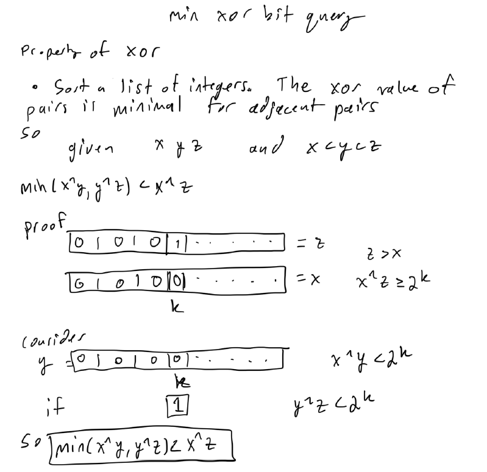

# Atcoder Beginner Contest 308

## What is used at the top of each submission

```py
import os,sys
from io import BytesIO, IOBase
sys.setrecursionlimit(10**6)
from typing import *
# only use pypyjit when needed, it usese more memory, but speeds up recursion in pypy
# import pypyjit
# pypyjit.set_param('max_unroll_recursion=-1')
# sys.stdout = open('output.txt', 'w')

# Fast IO Region
BUFSIZE = 8192
class FastIO(IOBase):
    newlines = 0
    def __init__(self, file):
        self._fd = file.fileno()
        self.buffer = BytesIO()
        self.writable = "x" in file.mode or "r" not in file.mode
        self.write = self.buffer.write if self.writable else None
    def read(self):
        while True:
            b = os.read(self._fd, max(os.fstat(self._fd).st_size, BUFSIZE))
            if not b:
                break
            ptr = self.buffer.tell()
            self.buffer.seek(0, 2), self.buffer.write(b), self.buffer.seek(ptr)
        self.newlines = 0
        return self.buffer.read()
    def readline(self):
        while self.newlines == 0:
            b = os.read(self._fd, max(os.fstat(self._fd).st_size, BUFSIZE))
            self.newlines = b.count(b"\n") + (not b)
            ptr = self.buffer.tell()
            self.buffer.seek(0, 2), self.buffer.write(b), self.buffer.seek(ptr)
        self.newlines -= 1
        return self.buffer.readline()
    def flush(self):
        if self.writable:
            os.write(self._fd, self.buffer.getvalue())
            self.buffer.truncate(0), self.buffer.seek(0)
class IOWrapper(IOBase):
    def __init__(self, file):
        self.buffer = FastIO(file)
        self.flush = self.buffer.flush
        self.writable = self.buffer.writable
        self.write = lambda s: self.buffer.write(s.encode("ascii"))
        self.read = lambda: self.buffer.read().decode("ascii")
        self.readline = lambda: self.buffer.readline().decode("ascii")
sys.stdin, sys.stdout = IOWrapper(sys.stdin), IOWrapper(sys.stdout)
input = lambda: sys.stdin.readline().rstrip("\r\n")
                    
if __name__ == '__main__':
    print(main())
    # main()
    # sys.stdout.close()
```

## A - New Scheme 

### Solution 1: all conditions

```py
def main():
    arr = list(map(int, input().split()))
    if all(x % 25 == 0 for x in arr) and all(100 <= x <= 675 for x in arr) and all(y >= x for x, y in zip(arr, arr[1:])):
        print("Yes")
    else:
        print("No")

if __name__ == '__main__':
    main()
```

## B - Default Price 

### Solution 1: hash table

```py
def main():
    n, m = map(int, input().split())
    colors = input().split()
    D = input().split()
    P = list(map(int, input().split()))
    costs = {d: p for d, p in zip(D, P[1:])}
    res = sum(costs[col] if col in costs else P[0] for col in colors)
    print(res)

if __name__ == '__main__':
    main()
```

## C - Standings 

### Solution 1: sorting fractions + custom comparator + fraction class + math

Let us first design a function that compares the success rates of two people. Here, it is discouraged to compare h / (h + t)
using a floating-point number type, due to potential computational errors. In fact, some test cases are prepared to hack the solutions that compares values using std::double.

```py
# comparator for fractions
class Fraction:
    def __init__(self, num, denom):
        self.num, self.denom = num, denom
    
    def __lt__(self, other):
        return self.num * other.denom < other.num * self.denom

def main():
    n = int(input())
    heads, tails = [None] * n, [None] * n
    succ = [0] * n
    for i in range(n):
        h, t = map(int, input().split())
        heads[i], tails[i] = h, t
        succ[i] = Fraction(h, h + t)
    res = sorted(range(1, n + 1), key = lambda i: (succ[i - 1], -i), reverse = True)
    print(*res)

if __name__ == '__main__':
    main()
```

## D - Snuke Maze 

### Solution 1:  bfs + deque + grid + modulus

```py
from collections import deque

def main():
    H, W = map(int, input().split())
    S = [input() for _ in range(H)]
    vis = [[0] * W for _ in range(H)]
    neighborhood = lambda r, c: [(r + 1, c), (r - 1, c), (r, c + 1), (r, c - 1)]
    in_bounds = lambda r, c: 0 <= r < H and 0 <= c < W
    target = "snuke"
    index = 0
    queue = deque()
    if S[0][0] == target[index]:
        vis[0][0] = 1
        index += 1
        queue.append((0, 0))
    while queue:
        for _ in range(len(queue)):
            r, c = queue.popleft()
            if (r, c) == (H - 1, W - 1): return print("Yes")
            for nr, nc in neighborhood(r, c):
                if not in_bounds(nr, nc) or vis[nr][nc] or S[nr][nc] != target[index]: continue
                vis[nr][nc] = 1
                queue.append((nr, nc))
        index += 1
        index %= len(target)
    print("No")

if __name__ == '__main__':
    main()
```

## E - MEX 

### Solution 1:  dynamic programming + count

```py
from itertools import dropwhile

def main():
    n = int(input())
    arr = list(map(int, input().split()))
    s = input()
    mex = lambda x, y, z: next(dropwhile(lambda i: i in (x, y, z), range(4)))
    m = [0] * 3
    me = [[0] * 3 for _ in range(3)]
    res = 0
    for i in range(n):
        if s[i] == 'M':
            m[arr[i]] += 1
        elif s[i] == 'E':
            for j in range(3):
                r, c = min(j, arr[i]), max(j, arr[i])
                me[r][c] += m[j]
        else:
            for j in range(3):
                for k in range(j, 3):
                    res += mex(j, k, arr[i]) * me[j][k]
    print(res)

if __name__ == '__main__':
    main()
```

## F - Vouchers 

### Solution 1: max heap + sort + offline query

vouchers are added into the max heap when they become available for the current price and always take the best voucher cause it gives the most discount

```py
from heapq import heappush, heappop

def main():
    n, m = map(int, input().split())
    P = list(map(int, input().split()))
    L = list(map(int, input().split()))
    D = list(map(int, input().split()))
    queries = sorted([(l, d) for l, d in zip(L, D)])
    max_heap = []
    res = i = 0
    for p in sorted(P):
        res += p
        while i < m and queries[i][0] <= p:
            heappush(max_heap, -queries[i][1])
            i += 1
        if max_heap:
            res += heappop(max_heap)
    print(res)

if __name__ == '__main__':
    main()
```

## G - Minimum Xor Pair Query 



### Solution 1: 

```py

```