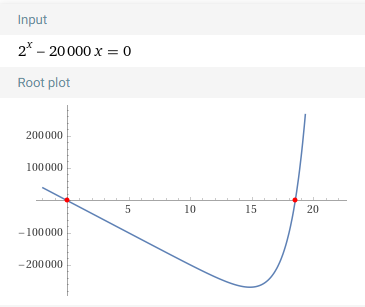
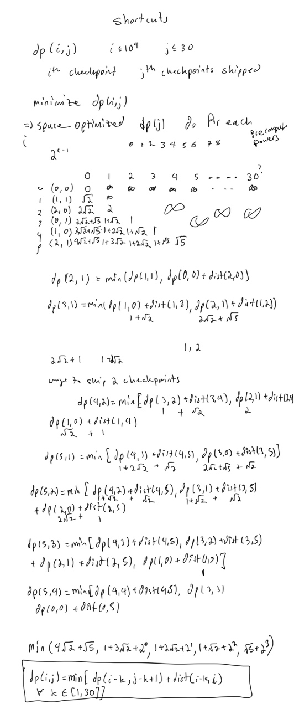

# Atcoder Beginner Contest 315

## 

### Solution 1: 

```py

```

## 

### Solution 1: 

```py

```

## 

### Solution 1: 

```py

```

## 

### Solution 1: 

```py

```

## 

### Solution 1: 

```py

```

## 

### Solution 1:  dynamic programming

Observe that there will be at most 2^20 penalty, cause anything worse than that results in a penalty that is greater than the cost of just including any checkpoint.

Suppose all checkpoints are the farthest distance from each other which is 20,000.  The two numbers somewhat converge when you suppose you skip 20 checkpoints with worse case which is going to give you 400,000, and 2^20 penalty is always going to be worse than actually including all the checkpoints, cause 2^20 = 1,048,576.

Solve this equation $20,000 * x = 2^{x}$

As you can see by the graph of the equation the point at which $2^{x}$ becomes larger than the cost of including shortcuts is just before x = 19.  So picking x = 20 should work.  Once the line is in the positive y values it means the penalty of skipping the checkpoints is incurring more cost then just not skipping the checkpoints.

You can think of this function as the cost of skipping checkpoints.  x = number of checkpoints skipped
$f(x) = 2^{x} - 20,000 * x$, when $f(x) < 0$ that means reducing the total cost.  When $f(x) > 0$ that means it is increasing the cost.






```py

```

## 

### Solution 1: 

```py

```

