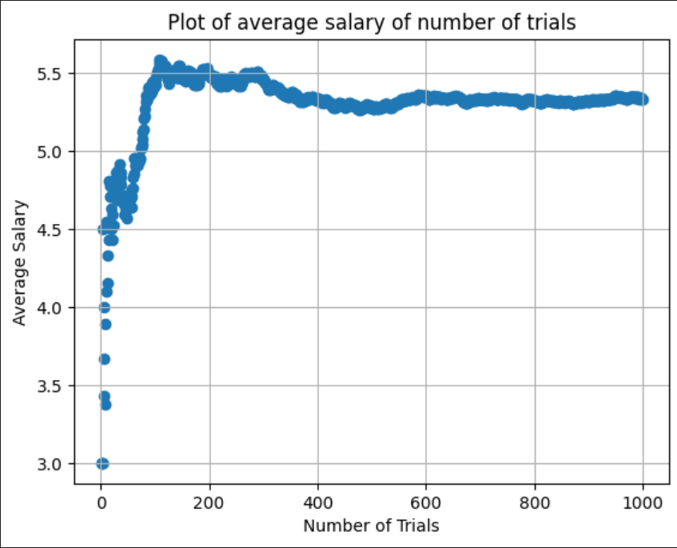

# Atcoder Beginner Contest 326

## C - Peak 

### Solution 1: 

```py
from collections import deque

def main():
    N, M = map(int, input().split())
    arr = sorted(map(int, input().split()))
    queue = deque()
    res = 0
    i = 0
    while i < N:
        cur = arr[i]
        while i < N and arr[i] == cur:
            i += 1
            queue.append(cur)
        while queue[0] <= queue[-1] - M:
            queue.popleft()
        res = max(res, len(queue))
    print(res)

if __name__ == '__main__':
    main()
```

## D - ABC Puzzle 

### Solution 1:  

```py

```

## E - Revenge of "The Salary of AtCoder Inc." 

### Solution 1:  probability, uniform, expectation value, cumulative sum

probability of finding ith index after x = j where j is 0 <= j < i, but the summation of all those probabilitys multiplied by 1/3.  including if x = 0 which is p_0 = 1



```py
mod = 998244353

def mod_inverse(v):
    return pow(v, mod - 2, mod)

def main():
    N = int(input())
    arr = list(map(int, input().split()))
    res = 0
    psum = 1
    for num in arr:
        cur = (psum * mod_inverse(N)) % mod
        res = (res + num * cur) % mod
        psum = (psum + cur) % mod
    print(res)

if __name__ == '__main__':
    main()
```

## 

### Solution 1: 

```py

```

## 

### Solution 1: 

```py

```

## 

### Solution 1: 

```py

```

## 

### Solution 1: 

```py

```

