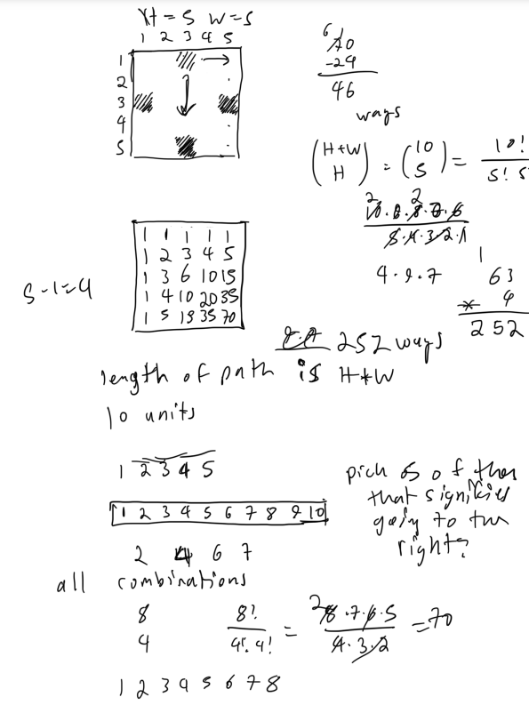
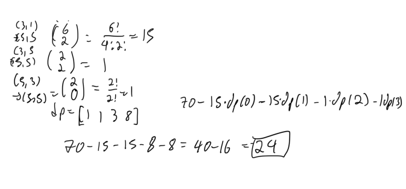

# Educational DP

## Y Grid 2





### Solution 1: 

```py

```

## S - Digit Sum 

### Solution 1:  digit dp, remainder math

When you take the modulus is important, if you added cnt first and then % mod, it TLE.

```py
mod = int(1e9) + 7

# dp state (index, remainder modulo D of digit sum, tight, zero)
def main():
    K = input()
    D = int(input())
    dp = Counter()
    dp[(0, True, True)] = 1
    for d in map(int, K):
        ndp = Counter()
        for (rem, tight, zero), cnt in dp.items():
            for dig in range(10 if not tight else d + 1):
                nrem, ntight, nzero = (rem + dig) % D, tight and dig == d, zero and dig == 0
                ndp[(nrem, ntight, nzero)] = (ndp[(nrem, ntight, nzero)] + cnt) % mod
        dp = ndp
    ans = sum(cnt for (rem, _, zero), cnt in dp.items() if rem == 0 and not zero) % mod
    print(ans)

if __name__ == '__main__':
    main()
```

### Solution 2:  Same as above but with arrays

It is not that much, faster so the approach above is simpler to code anyway so probably recommend it. 

```py
from itertools import product
mod = int(1e9) + 7

# dp state (index, remainder modulo D of digit sum, tight, zero)
def main():
    K = input()
    D = int(input())
    dp = [[[0] * 2 for _ in range(2)] for _ in range(D)]
    dp[0][1][1] = 1
    for d in map(int, K):
        ndp = [[[0] * 2 for _ in range(2)] for _ in range(D)]
        for rem, tight, zero in product(range(D), range(2), range(2)):
            for dig in range(10 if not tight else d + 1):
                nrem, ntight, nzero = (rem + dig) % D, tight and dig == d, zero and dig == 0
                ndp[nrem][ntight][nzero] = (ndp[nrem][ntight][nzero] + dp[rem][tight][zero]) % mod
        dp = ndp
    ans = sum(dp[0][t][0] for t in range(2)) % mod
    print(ans)

if __name__ == '__main__':
    main()
```

## knapsack 1

### Solution 1:  0/1 knapsack dp

```cpp
int N, W;
vector<int> values, weights, dp, ndp;

void solve() {
    cin >> N >> W;
    values.resize(N);
    weights.resize(N);
    for (int i = 0; i < N; i++) {
        cin >> weights[i] >> values[i];
    }
    dp.assign(W + 1, 0);
    for (int i = 0; i < N; i++) {
        ndp.assign(W + 1, 0);
        for (int cap = 0; cap <= W; cap++) {
            if (cap >= weights[i]) {
                ndp[cap] = max(ndp[cap], dp[cap - weights[i]] + values[i]);
            }
            ndp[cap] = max(ndp[cap], dp[cap]);
        }
        swap(dp, ndp);
    }
    cout << dp[W] << endl;
}

signed main() {
    solve();
    return 0;
}
```

## knapsack 2

### Solution 1:  0/1 min cost knapsack dp

```cpp
const int INF = 1e18;
int N, W;
vector<int> values, weights, dp, ndp;

void solve() {
    cin >> N >> W;
    int V = 0;
    values.resize(N);
    weights.resize(N);
    for (int i = 0; i < N; i++) {
        cin >> weights[i] >> values[i];
        V += values[i];
    }
    dp.assign(V + 1, INF);
    dp[0] = 0;
    for (int i = 0; i < N; i++) {
        ndp.assign(V + 1, INF);
        for (int v = 0; v <= V; v++) {
            ndp[v] = min(ndp[v], dp[v]);
            if (values[i] <= v) {
                ndp[v] = min(ndp[v], dp[v - values[i]] + weights[i]);
            }
        }
        swap(dp, ndp);
    }
    int ans = 0;
    for (int v = 0; v <= V; v++) {
        if (dp[v] <= W) ans = v;
    }
    cout << ans << endl;
}

signed main() {
    solve();
    return 0;
}
```

## 

### Solution 1: 

```py

```

## 

### Solution 1: 

```py

```

## 

### Solution 1: 

```py

```

## 

### Solution 1: 

```py

```

## 

### Solution 1: 

```py

```

## 

### Solution 1: 

```py

```

## 

### Solution 1: 

```py

```