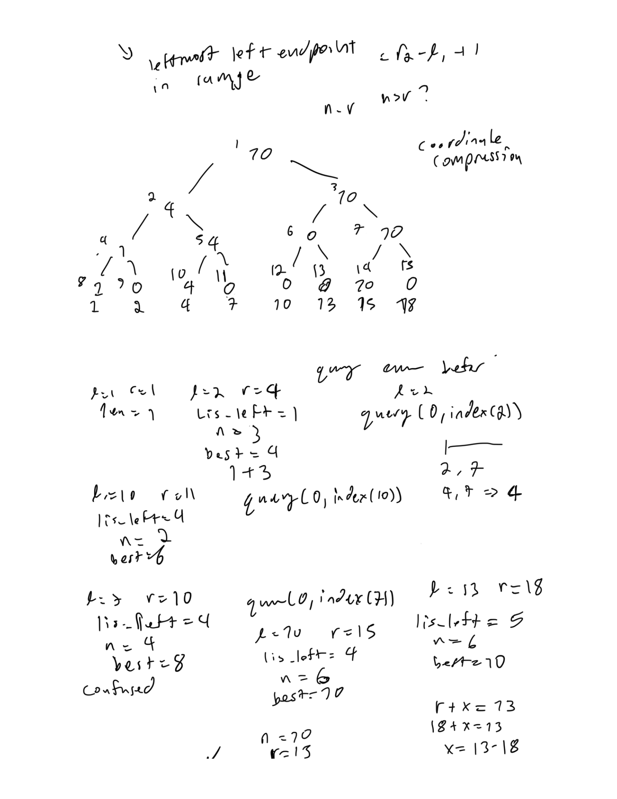
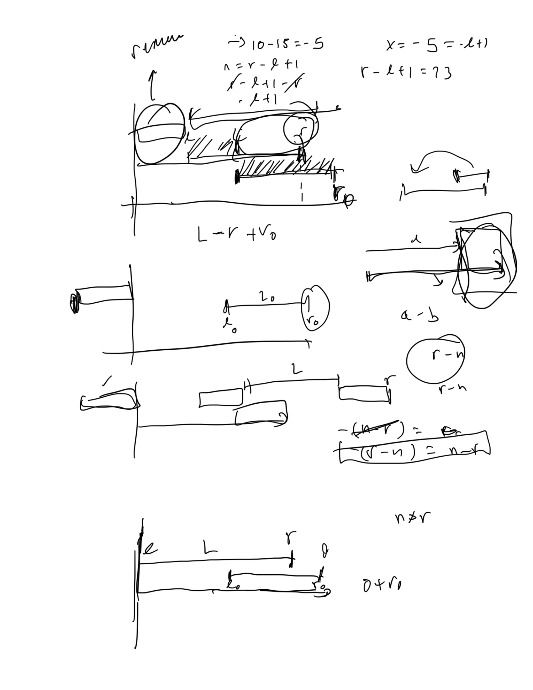

# Atcoder Regular Contest 159

## What is used at the top of each submission

```py
import os,sys
from io import BytesIO, IOBase
sys.setrecursionlimit(10**6)
from typing import *
# only use pypyjit when needed, it usese more memory, but speeds up recursion in pypy
import pypyjit
pypyjit.set_param('max_unroll_recursion=-1')
 
# Fast IO Region
BUFSIZE = 8192
class FastIO(IOBase):
    newlines = 0
    def __init__(self, file):
        self._fd = file.fileno()
        self.buffer = BytesIO()
        self.writable = "x" in file.mode or "r" not in file.mode
        self.write = self.buffer.write if self.writable else None
    def read(self):
        while True:
            b = os.read(self._fd, max(os.fstat(self._fd).st_size, BUFSIZE))
            if not b:
                break
            ptr = self.buffer.tell()
            self.buffer.seek(0, 2), self.buffer.write(b), self.buffer.seek(ptr)
        self.newlines = 0
        return self.buffer.read()
    def readline(self):
        while self.newlines == 0:
            b = os.read(self._fd, max(os.fstat(self._fd).st_size, BUFSIZE))
            self.newlines = b.count(b"\n") + (not b)
            ptr = self.buffer.tell()
            self.buffer.seek(0, 2), self.buffer.write(b), self.buffer.seek(ptr)
        self.newlines -= 1
        return self.buffer.readline()
    def flush(self):
        if self.writable:
            os.write(self._fd, self.buffer.getvalue())
            self.buffer.truncate(0), self.buffer.seek(0)
class IOWrapper(IOBase):
    def __init__(self, file):
        self.buffer = FastIO(file)
        self.flush = self.buffer.flush
        self.writable = self.buffer.writable
        self.write = lambda s: self.buffer.write(s.encode("ascii"))
        self.read = lambda: self.buffer.read().decode("ascii")
        self.readline = lambda: self.buffer.readline().decode("ascii")
sys.stdin, sys.stdout = IOWrapper(sys.stdin), IOWrapper(sys.stdout)
input = lambda: sys.stdin.readline().rstrip("\r\n")
```

## A - Copy and Paste Graph 

### Solution 1:  modular arithmetic + bfs

```py
from itertools import product
from collections import deque

def main():
    n, k = map(int, input().split())
    matrix = [list(map(int, input().split())) for _ in range(n)]
    adj_list = [[] for _ in range(n)]
    for i, j in product(range(n), repeat = 2):
        if matrix[i][j] == 1:
            adj_list[i].append(j)
    q = int(input())
    def bfs(src, dst):
        visited = set()
        s_sec = src//n
        d_sec = dst//n
        dst %= n
        src %= n
        visited.add((src, s_sec))
        queue = deque([(src, s_sec, 0)])
        while queue:
            node, sec, dist = queue.popleft()
            if node == dst and d_sec == sec: return dist
            for nei in adj_list[node]:
                if (nei, d_sec) in visited: continue
                visited.add((nei, d_sec))
                queue.append((nei, d_sec, dist + 1))
        return -1
    for _ in range(q):
        u, v = map(int, input().split())
        u -= 1
        v -= 1
        print(bfs(u, v))

if __name__ == '__main__':
    main()
```

## B - GCD Subtraction 

### Solution 1:

doesn't work, can't figure out fast enough solution

```py
import math

def main():
    a, b = map(int, input().split())
    cnt = 0
    while a > 0 and b > 0:
        g = math.gcd(a, b)
        m = 1
        if cnt > 100_000 and g > 1:
            ma, mb = a//g, b//g
            m = min(ma, mb)
        a -= m*g
        b -= m*g
        cnt += m
    return cnt

if __name__ == '__main__':
    print(main())
```

## C - Permutation Addition 

### Solution 1:

fails

```py
def main():
    n = int(input())
    arr = list(map(int, input().split()))
    arr = [[x, i] for i, x in enumerate(arr)]
    mx = 10_000
    results = []
    for i in range(mx):
        arr = sorted(arr, reverse = True)
        if arr[0][0] == arr[-1][0]: break
        res = [0]*n
        for j in range(n):
            arr[j][0] += j + 1
            idx = arr[j][1]
            res[idx] = j + 1
        results.append(res)
    arr = sorted(arr, reverse = True)
    if arr[0][0] != arr[-1][0]: 
        print("No")
        return
    print("Yes")
    print(len(results))
    for res in results:
        print(*res)

if __name__ == '__main__':
    main()
```

## D - LIS 2 

### Solution 1:  min and max segment tree + interval problem + segment trees




```py
import math

class SegmentTree:
    def __init__(self, n: int, neutral: int, func, initial_arr):
        self.func = func
        self.neutral = neutral
        self.size = 1
        self.n = n
        while self.size<n:
            self.size*=2
        self.nodes = [neutral for _ in range(self.size*2)] 
        self.build(initial_arr)

    def build(self, initial_arr: List[int]) -> None:
        for i, segment_idx in enumerate(range(self.n)):
            segment_idx += self.size - 1
            val = initial_arr[i]
            self.nodes[segment_idx] = val
            self.ascend(segment_idx)

    def ascend(self, segment_idx: int) -> None:
        while segment_idx > 0:
            segment_idx -= 1
            segment_idx >>= 1
            left_segment_idx, right_segment_idx = 2*segment_idx + 1, 2*segment_idx + 2
            self.nodes[segment_idx] = self.func(self.nodes[left_segment_idx], self.nodes[right_segment_idx])
        
    def update(self, segment_idx: int, val: int) -> None:
        segment_idx += self.size - 1
        self.nodes[segment_idx] = val
        self.ascend(segment_idx)
            
    def query(self, left: int, right: int) -> int:
        stack = [(0, self.size, 0)]
        result = self.neutral
        while stack:
            # BOUNDS FOR CURRENT INTERVAL and idx for tree
            segment_left_bound, segment_right_bound, segment_idx = stack.pop()
            # NO OVERLAP
            if segment_left_bound >= right or segment_right_bound <= left: continue
            # COMPLETE OVERLAP
            if segment_left_bound >= left and segment_right_bound <= right:
                result = self.func(result, self.nodes[segment_idx])
                continue
            # PARTIAL OVERLAP
            mid_point = (segment_left_bound + segment_right_bound) >> 1
            left_segment_idx, right_segment_idx = 2*segment_idx + 1, 2*segment_idx + 2
            stack.extend([(mid_point, segment_right_bound, right_segment_idx), (segment_left_bound, mid_point, left_segment_idx)])
        return result
    
    def __repr__(self) -> str:
        return f"nodes array: {self.nodes}, next array: {self.next}"
    
def main():
    n = int(input())
    queries = []
    endpoints = set()
    for _ in range(n):
        left, right = map(int, input().split())
        endpoints.update([left, right])
        queries.append((left, right))
    index_map = {endpoint: i for i, endpoint in enumerate(sorted(endpoints))}
    m = len(endpoints)
    left_segment_tree = SegmentTree(m, -math.inf, max, [0]*m)
    missing_segment_tree = SegmentTree(m, math.inf, min, [math.inf]*m)
    res = 0
    for left, right in queries:
        segment_len = right - left + 1
        left_segment_len = left_segment_tree.query(0, index_map[left])
        missing_segment_len = missing_segment_tree.query(index_map[left], index_map[right] + 1)
        segment_len = max(segment_len, left_segment_len + segment_len, right - missing_segment_len)
        left_segment_tree.update(index_map[right], segment_len)
        missing_segment_tree.update(index_map[right], right - segment_len)
        res = max(res, segment_len)
    return res

if __name__ == '__main__':
    print(main())
```

##

### Solution 1:

```py

```

##

### Solution 1:

```py

```