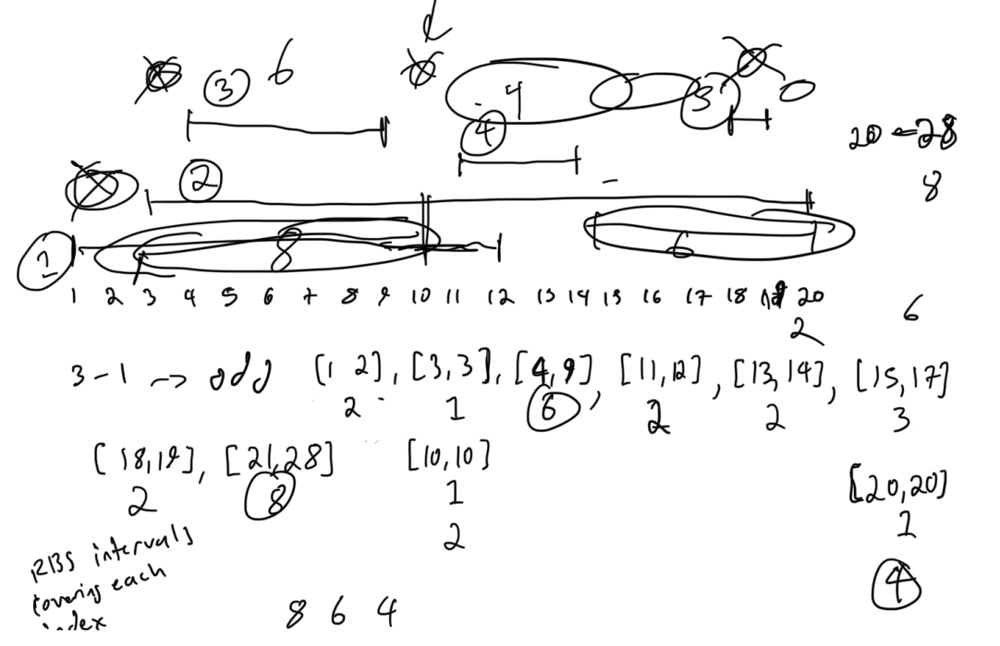
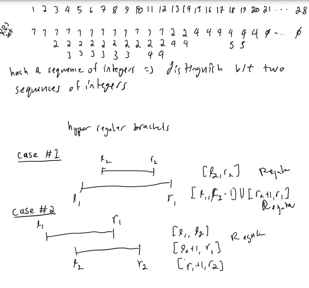
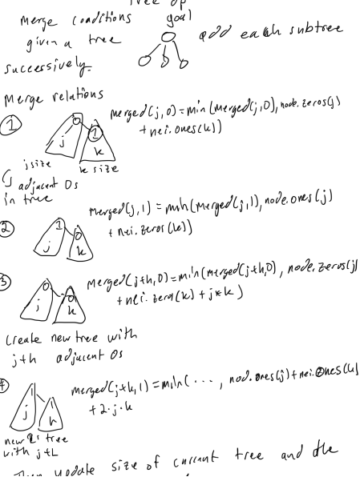
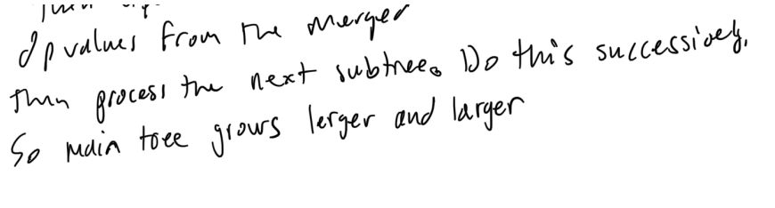
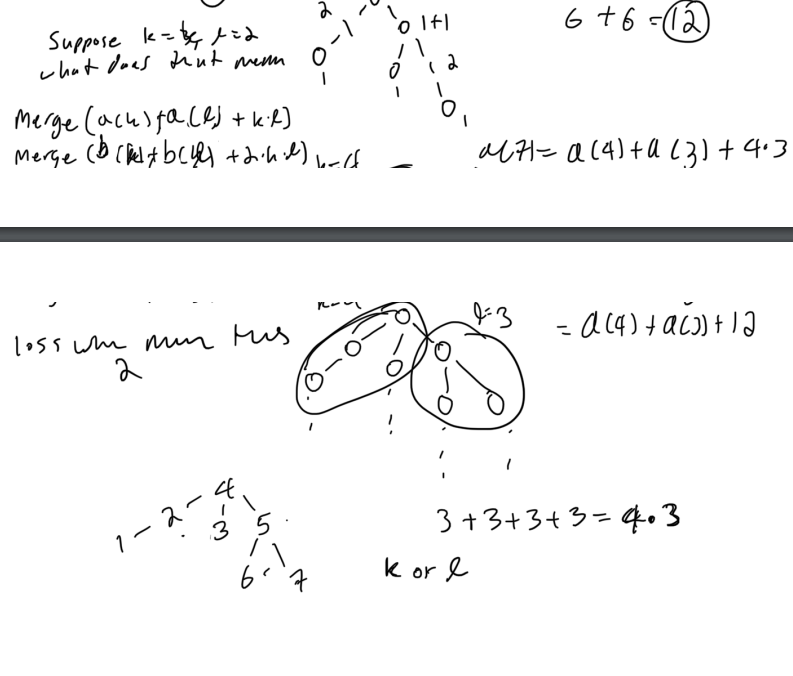
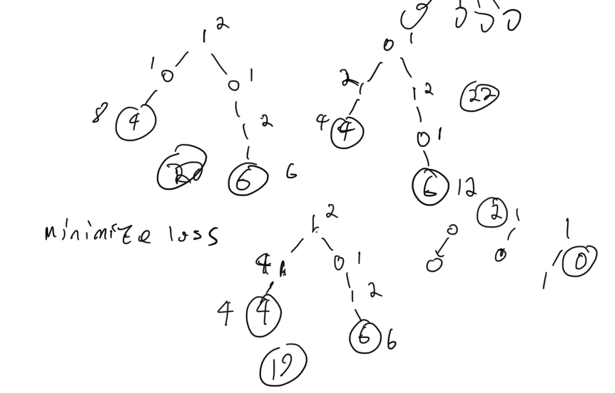

# Codeforces Round 875 Div 2

## Notes

if the implementation is in python it will have this at the top of the python script for fast IO operations

```py
import os,sys
from io import BytesIO, IOBase
from typing import *
import pypyjit
pypyjit.set_param('max_unroll_recursion=-1')
 
# Fast IO Region
BUFSIZE = 8192
class FastIO(IOBase):
    newlines = 0
    def __init__(self, file):
        self._fd = file.fileno()
        self.buffer = BytesIO()
        self.writable = "x" in file.mode or "r" not in file.mode
        self.write = self.buffer.write if self.writable else None
    def read(self):
        while True:
            b = os.read(self._fd, max(os.fstat(self._fd).st_size, BUFSIZE))
            if not b:
                break
            ptr = self.buffer.tell()
            self.buffer.seek(0, 2), self.buffer.write(b), self.buffer.seek(ptr)
        self.newlines = 0
        return self.buffer.read()
    def readline(self):
        while self.newlines == 0:
            b = os.read(self._fd, max(os.fstat(self._fd).st_size, BUFSIZE))
            self.newlines = b.count(b"\n") + (not b)
            ptr = self.buffer.tell()
            self.buffer.seek(0, 2), self.buffer.write(b), self.buffer.seek(ptr)
        self.newlines -= 1
        return self.buffer.readline()
    def flush(self):
        if self.writable:
            os.write(self._fd, self.buffer.getvalue())
            self.buffer.truncate(0), self.buffer.seek(0)
class IOWrapper(IOBase):
    def __init__(self, file):
        self.buffer = FastIO(file)
        self.flush = self.buffer.flush
        self.writable = self.buffer.writable
        self.write = lambda s: self.buffer.write(s.encode("ascii"))
        self.read = lambda: self.buffer.read().decode("ascii")
        self.readline = lambda: self.buffer.readline().decode("ascii")
sys.stdin, sys.stdout = IOWrapper(sys.stdin), IOWrapper(sys.stdout)
input = lambda: sys.stdin.readline().rstrip("\r\n")
```

## A. Twin Permutations

### Solution 1:  can make all elements equal

```py
def main():
    n = int(input())
    arr = list(map(int, input().split()))
    res = [None] * n
    for i in range(n):
        res[i] = n + 1 - arr[i]
    print(*res)
 
if __name__ == '__main__':
    T = int(input())
    for _ in range(T):
        main()
```

## B. Array merging

### Solution 1:  counter + max

Find the longest consecutive equal integer in both arrays and find longest combined equal integer.

```py
 
from collections import Counter
from itertools import chain
    
def main():
    n = int(input())
    a = list(map(int, input().split()))
    b = list(map(int, input().split()))
    def construct(arr):
        counter = Counter()
        cnt = 1
        for i in range(1, n):
            if arr[i - 1] == arr[i]:
                cnt += 1
            else:
                counter[arr[i - 1]] = max(counter[arr[i - 1]], cnt)
                cnt = 1
        counter[arr[-1]] = max(counter[arr[-1]], cnt)
        return counter
    counter_a, counter_b = construct(a), construct(b)
    res = 0
    for v in chain(counter_a.keys(), counter_b.keys()):
        res = max(res, counter_a[v] + counter_b[v])
    print(res)
 
if __name__ == '__main__':
    T = int(input())
    for _ in range(T):
        main()
```

## C. Copil Copac Draws Trees

### Solution 1:  0/1 bfs + bfs on a graph with edge weights equal to 0 and 1 + find the largest sum of edge weights from root to leaf nodes over all simple paths from root to leaf nodes (that do not contain any node more than once) 

```py
 
from collections import defaultdict, deque
import bisect
import math
    
def main():
    n = int(input())
    vis = [0] * (n + 1)
    edge_map = defaultdict(list)
    for i in range(n - 1):
        u, v = map(int, input().split())
        edge_map[u].append((i, v))
        edge_map[v].append((i, u))
    queue = deque([(1, -1, 1)])
    vis[1] = 1
    while queue:
        node, index, dist = queue.popleft()
        for nei_index, nei_node in edge_map[node]:
            if vis[nei_node]: continue
            vis[nei_node] = 1
            if nei_index < index:
                queue.append((nei_node, nei_index, dist + 1))
            else:
                queue.appendleft((nei_node, nei_index, dist))
    print(dist)
 
if __name__ == '__main__':
    T = int(input())
    for _ in range(T):
        main()
```

## D. The BOSS Can Count Pairs

### Solution 1:

```py

```

## E. Hyperregular Bracket Strings

### Solution 1:  catalan number + difference array + addition to get unique subsets in difference array

Want to find the length (number of index from 1 to n) that a subset of intervals covers.  Then we know it is the catalan number of the size of subsets divided by 2.  Each unique subset of intervals must be a regular bracket string.




```py
from collections import Counter
 
MOD = 998244353
 
def singleton(__init__):
    def __new__(cls, *args, **kwargs):
        if hasattr(cls, 'instance'):
            return getattr(cls, 'instance')
        instance = super(cls, cls).__new__(cls)
        __init__(instance, *args, **kwargs)
        setattr(cls, 'instance', instance)
        return instance
    return __new__
 
class Inverse:
    @singleton
    def __new__(cls):
        cls.inverse = {1: 1}
 
    def __getitem__(self, item):
        for i in range(len(self.inverse) + 1, item + 1):
            self.inverse[i] = self.inverse[MOD % i] * (MOD - MOD // i) % MOD
        return self.inverse[item]
 
class Catalan:
    @singleton
    def __new__(cls):
        cls.catalan = [1]
 
    def __getitem__(self, item):
        for i in range(len(self.catalan), item + 1):
            self.catalan.append(self.catalan[-1] * (4 * i - 2) * Inverse()[i + 1] % MOD)
        return self.catalan[item]
 
def main():
    n, k = map(int, input().split())
    diff, bit = [0] * (n + 1), 1
    mod1 = 1_000_000_007
    for _ in range(k):
        left, right = map(int, input().split())
        diff[left - 1] = diff[left - 1] + bit
        diff[right] = diff[right] - bit
        bit = bit * mod1 % MOD
    diff.pop()
    for i in range(1, n):
        diff[i] += diff[i - 1]
    result = 1
    for count in Counter(diff).values():
        if count & 1:
            return 0
        result = result * Catalan()[count >> 1] % MOD
    return result

if __name__ == '__main__':
    T = int(input())
    for _ in range(T):
        print(main())
```

## F. Mex Tree

### Solution 1:  tree dynamic programming + heavy edges memory optimization + 0/1 knapsack style dp

Find the minimum instead of the maximum.


The problem is minimizing the loss from the maximum possible value for the entire tree.  The max value can be shown to be n * (n + 1),  it is basically the number of paths between nodes i and nodes j when i < j such as 
1,1
1,2
1,3
2,2
2,3
3,3
is n * (n + 1) / 2 pairs
The maximum loss will be multiplied by two, since the mex of mex({0, 1}) = 2





Proof that bipartite matching will not minimize the loss from the maximum. 


```py
const int threshold = 300;
const int inf = 1e16;

struct dp_state
{
    vector<int> zero_trees, one_trees;
    void init()
    {
        zero_trees.resize(threshold + 1, inf);
        one_trees.resize(threshold + 1, inf);
        zero_trees[1] = 1;
        one_trees[1] = 2;
    }
};

int32_t  main(){
	int T = read();
    while (T--) {
        int n = read();
        vector<vector<int>> adj_list(n + 1);
        vector<int> sz(n + 1);
        for (int i = 0; i < n - 1; i++) {
            int u = read(), v = read();
            adj_list[u].push_back(v);
            adj_list[v].push_back(u);
        }
        function<int(int, int)> heavy_edge_first = [&](int node, int parent) {
            int sz = 1;
            pair<int, int> res;
            for (int i = 0; i < adj_list[node].size(); i++) {
                if (adj_list[node][i] == parent) continue;
                int child_sz = heavy_edge_first(adj_list[node][i], node);
                res = max(res, {child_sz, i});
                sz += child_sz;
            }
            if (!adj_list[node].empty()) {
                swap(adj_list[node][0], adj_list[node][res.second]);
            }
            return sz;
        };
        heavy_edge_first(1, 0);
        vector<vector<int>> merged(2 * threshold + 1, vector<int>(2, inf));
        function<dp_state(int, int)> dfs = [&](int node, int parent) {
            dp_state dp;
            sz[node] = 1;
            bool hasinit = false;
            for (auto nei : adj_list[node]) {
                if (nei == parent) continue;
                dp_state nei_dp = dfs(nei, node);
                if (!hasinit) {
                    dp.init();
                    hasinit = true;
                }
                for (int i = 0; i <= min(sz[node], threshold) + min(sz[nei], threshold); i++ ) {
                    merged[i][0] = merged[i][1] = inf;
                }
                for (int j = 1; j <= min(sz[node], threshold); j++) {
                    for (int k = 1; k <= min(sz[nei], threshold); k++) {
                        merged[j][0] = min(merged[j][0], dp.zero_trees[j] + nei_dp.one_trees[k]);
                        merged[j][1] = min(merged[j][1], dp.one_trees[j] + nei_dp.zero_trees[k]);
                        merged[j + k][0] = min(merged[j + k][0], dp.zero_trees[j] + nei_dp.zero_trees[k] + j * k);
                        merged[j + k][1] = min(merged[j + k][1], dp.one_trees[j] + nei_dp.one_trees[k] + j * k * 2);
                    }
                }
                sz[node] += sz[nei];
                for (int i = 1; i <= min(sz[node], threshold); i++) {
                    dp.zero_trees[i] = merged[i][0];
                    dp.one_trees[i] = merged[i][1];
                }
            }
            if (!hasinit) {
                dp.init();
                hasinit = true;
            }
            return dp;
        };
        dp_state dp = dfs(1, 0);
        int res = inf;
        for (int i = 1; i <= threshold; i++) {
            res = min(res, dp.zero_trees[i]);
            res = min(res, dp.one_trees[i]);
        }
        cout << n * (n + 1) - res << endl;
    }
}
```