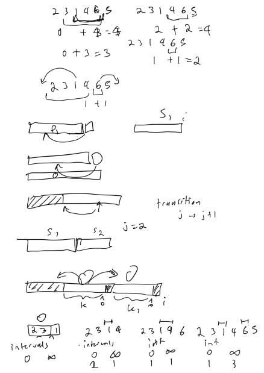
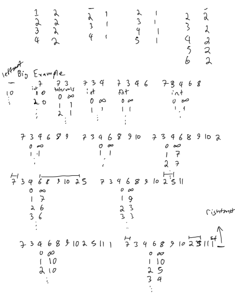

# Codeforces Round 876 Div 2

## Notes

if the implementation is in python it will have this at the top of the python script for fast IO operations

```py
import os,sys
from io import BytesIO, IOBase
from typing import *
import pypyjit
pypyjit.set_param('max_unroll_recursion=-1')
 
# Fast IO Region
BUFSIZE = 8192
class FastIO(IOBase):
    newlines = 0
    def __init__(self, file):
        self._fd = file.fileno()
        self.buffer = BytesIO()
        self.writable = "x" in file.mode or "r" not in file.mode
        self.write = self.buffer.write if self.writable else None
    def read(self):
        while True:
            b = os.read(self._fd, max(os.fstat(self._fd).st_size, BUFSIZE))
            if not b:
                break
            ptr = self.buffer.tell()
            self.buffer.seek(0, 2), self.buffer.write(b), self.buffer.seek(ptr)
        self.newlines = 0
        return self.buffer.read()
    def readline(self):
        while self.newlines == 0:
            b = os.read(self._fd, max(os.fstat(self._fd).st_size, BUFSIZE))
            self.newlines = b.count(b"\n") + (not b)
            ptr = self.buffer.tell()
            self.buffer.seek(0, 2), self.buffer.write(b), self.buffer.seek(ptr)
        self.newlines -= 1
        return self.buffer.readline()
    def flush(self):
        if self.writable:
            os.write(self._fd, self.buffer.getvalue())
            self.buffer.truncate(0), self.buffer.seek(0)
class IOWrapper(IOBase):
    def __init__(self, file):
        self.buffer = FastIO(file)
        self.flush = self.buffer.flush
        self.writable = self.buffer.writable
        self.write = lambda s: self.buffer.write(s.encode("ascii"))
        self.read = lambda: self.buffer.read().decode("ascii")
        self.readline = lambda: self.buffer.readline().decode("ascii")
sys.stdin, sys.stdout = IOWrapper(sys.stdin), IOWrapper(sys.stdout)
input = lambda: sys.stdin.readline().rstrip("\r\n")
```

```cpp
#include <bits/stdc++.h>
using namespace std;
#define int long long

inline int read() {
	int x = 0, y = 1; char c = getchar();
	while (c < '0' || c > '9') {
		if (c == '-') y = -1;
		c = getchar();
	}
	while (c >= '0' && c <= '9') x = x * 10 + c - '0', c = getchar();
	return x * y;
}
```

##

### Solution 1: 

```py
import math
 
def main():
    n, k = map(int, input().split())
    first, last = [0] * n, [0] * n
    for i in range(0, n, k):
        first[i] = 1
    for i in range(n - 1, -1, -k):
        last[i] = 1
    guess = [0] * n
    for i in range(n // 2 + 1):
        guess[i] = first[i]
    for i in range(n - 1, n // 2, -1):
        guess[i] = last[i]
    cur = 0
    for i in range(n):
        cur += guess[i]
        if cur < math.ceil((i + 1) / k):
            cur += 1
            guess[i] = 1
    cur = 0
    for i in reversed(range(n)):
        cur += guess[i]
        if cur < math.ceil((n - i) / k):
            cur += 1
            guess[i] = 1
    return sum(guess)

if __name__ == '__main__':
    T = int(input())
    for _ in range(T):
        print(main())
```

##

### Solution 1: 

```py
from heapq import heappop, heappush
 
def main():
    n = int(input())
    heap, active_heap = [], []
    for _ in range(n):
        a, b = map(int, input().split())
        heappush(heap, (a, -b))
    res = 0
    while heap:
        a, b = heappop(heap)
        b = -b
        res += b
        heappush(active_heap, a)
        x = len(active_heap)
        while active_heap and active_heap[0] <= x:
            heappop(active_heap)
        while heap and heap[0][0] <= x:
            heappop(heap)
    return res

if __name__ == '__main__':
    T = int(input())
    for _ in range(T):
        print(main())
```

##

### Solution 1: 

```py
def main():
    n = int(input())
    arr = list(map(int, input().split()))
    p = n - 1
    toggle = 0
    res = [None] * n
    for i in reversed(range(n)):
        while p >= 0 and arr[p] ^ toggle == 0:
            p -= 1
        if p + 1 > i: return print("NO")
        res[i] = p + 1
        toggle ^= 1
    print("YES")
    print(*res)

if __name__ == '__main__':
    T = int(input())
    for _ in range(T):
        main()
```

## D. Ball Sorting

### Solution 1:  dynammic programming

dp(i, j) = the minimum cost for the arr[0:i] and with j intervals
The intervals are those bits that are not parted of increasing contiguous subsequences and must have operation two to put them into sorted order.  

dp(i, j) = dp(i - 1, j) if arr(i) > arr(i - 1), if can be part of previous increasing contiguous subsequence. 
but also look through for each subsequence arr[k:i] and consider if arr[k] and arr[i] form increasing subsequence, so then just need to move all the elements between them, and add one more interval, so the transition state would be 
dp(i, j) = min(dp(i, j), dp(k, j - 1) + i - k - 1)




```py
def main():
    n = int(input())
    arr = [0] + list(map(int, input().split())) + [n + 1]
    dp = [[n + 1] * (n + 1) for _ in range(n + 2)] 
    for i in range(n + 1):
        dp[0][i] = 0 # base case, for i inserted 0s, looking at just from 0th sequence 0 flips
    # substring i...k, can use flip? 
    for i in range(1, n + 2):
        for j in range(n + 1):
            if arr[i] > arr[i - 1]: # increeasing sequence don't need to swap
                dp[i][j] = dp[i - 1][j]
            if j == 0: continue
            for k in range(i):
                if arr[k] < arr[i]:
                    dp[i][j] = min(dp[i][j], dp[k][j - 1] + i - k - 1)
    res = [None] * n
    for i in range(1, n + 1):
        res[i - 1] = dp[n + 1][i]
    print(*res)

if __name__ == '__main__':
    T = int(input())
    for _ in range(T):
        main()
```

## E. Decreasing Game

### Solution 1: 

```py
from itertools import dropwhile

def main():
    n = int(input())
    arr = [0] + list(map(int, input().split()))
    sum_ = sum(arr)
    if sum_ & 1: # if odd sum pick first player
        print("First", flush = True)
        first_player = True
    else:
        print("Second", flush = True)
        first_player = False
    while True:
        if first_player:
            i = next(dropwhile(lambda idx: arr[idx] == 0, range(n + 1)))
            print(i, flush = True)
            j = int(input())
            if j == 0 or j == -1: return
            d = min(arr[i], arr[j])
            arr[i] -= d
            arr[j] -= d
        else:
            print(arr, flush = True)
            i = int(input())
            if i == 0 or i == -1: return
            j = next(dropwhile(lambda idx: arr[idx] == 0 or idx == i, range(n + 1)))
            print(arr[i], arr[j], flush = True)
            d = min(arr[i], arr[j])
            arr[i] -= d
            arr[j] -= d
            print(j, flush = True)


if __name__ == '__main__':
    main()
```