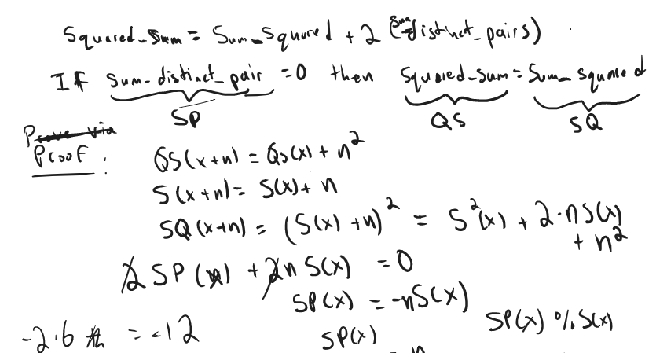
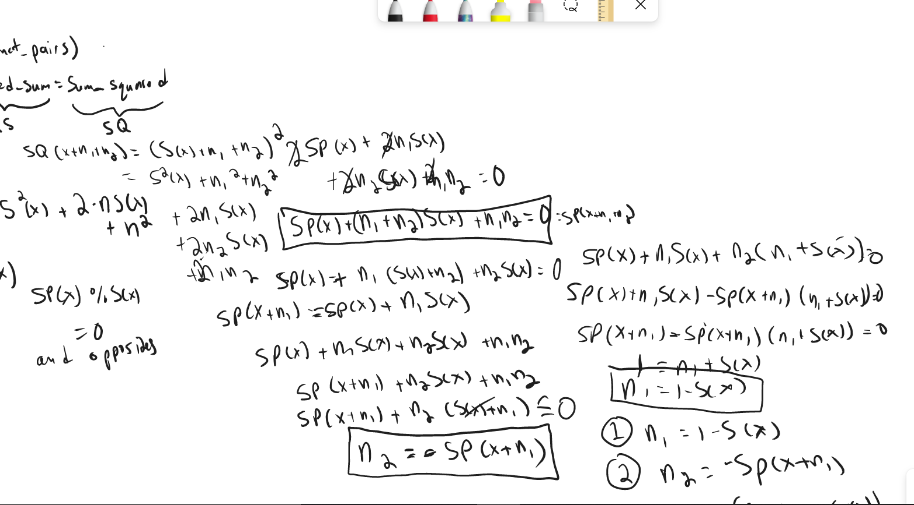

# Google Codejam Round 1C

## Letter Blocks

### Solution 1: greedy + break it down into starting characters and extending characters

```py
from collections import defaultdict
import string
IMP = "IMPOSSIBLE"
def main():
    N = int(input())
    prefix, suffix, single = defaultdict(list), defaultdict(list), defaultdict(list)
    middle = defaultdict(list)
    S = input().split()
    for i, s in enumerate(S):
        seen = [0]*26
        prev = s[0]
        start, end = s[0], s[-1]
        for ch in s:
            x = ord(ch)-ord('A')
            if ch != prev and seen[x]: return IMP
            if ch not in (prev, start, end):
                middle[ch].append(i)
            seen[x] = 1
            prev = ch
        # ADD ELEMENT TO THE SINGLES IF START EQUAL ENDS
        if start == end:
            single[start].append(i)
        else: # ADD ELEMENT TO PREFIX AND SUFFIX
            prefix[start].append(i)
            suffix[end].append(i)
    # CANDIDATE LIST FOR CHARACTERS YOU CAN START WITH
    candidates = []
    # REST CAN ONLY BE USED AS EXTENSION BLOCKS
    # IMPOSSIBLE CONDITIONS ARE 
    for ch in string.ascii_uppercase:
        MIDDLE_LEN, PREFIX_LEN, SUFFIX_LEN, SINGLE_LEN = len(middle[ch]), len(prefix[ch]), len(suffix[ch]), len(single[ch])
        if MIDDLE_LEN > 1 or PREFIX_LEN > 1 or SUFFIX_LEN > 1: return IMP
        if MIDDLE_LEN == 1 and (PREFIX_LEN > 0 or SUFFIX_LEN > 0 or SINGLE_LEN > 0): return IMP
        if MIDDLE_LEN == 1 or SUFFIX_LEN == 1: continue
        if MIDDLE_LEN==PREFIX_LEN==SUFFIX_LEN==SINGLE_LEN==0: continue
        candidates.append(ch)
    # NOW WE WANT TO MOVE THROUGH CANDIDATES UNTIL THE END
    result = []
    current_char = -1
    while candidates or current_char != -1:
        if current_char == -1: # NEED STARTING CHARACTER
            current_char = candidates.pop()
            for index in single[current_char]:
                result.append(index)
            for index in prefix[current_char]:
                result.append(index)
        else: # NEED EXTENDING CHARACTER
            for index in single[current_char]:
                result.append(index)
            for index in prefix[current_char]:
                result.append(index)
        next_char = S[result[-1]][-1]
        if next_char == current_char:
            current_char = -1
        else:
            current_char = next_char
        
        
    if len(result) != len(S): return IMP
    return "".join([S[i] for i in result])
    
if __name__ == '__main__':
    T = int(input())
    for t in range(1,T+1):
        print(f"Case #{t}: {main()}")
```

## Squary

### Solution 1: math + finding out need the sum of distinct multiplicative pairs to be equal to 0





```py
from itertools import product
IMP = "IMPOSSIBLE"
def main():
    N, K = map(int,input().split())
    arr = list(map(int,input().split()))
    SP = (sum(x*y for x, y in product(arr,repeat=2)) - sum(x*x for x in arr))//2
    S = sum(arr)
    if K == 1:
        if SP==S==0: return 1
        if S==0: return IMP
        return -SP//S if SP%S==0 else IMP
    n1 = 1-S
    n2 = -(SP+n1*S)
    return f"{n1} {n2}"
    
if __name__ == '__main__':
    T = int(input())
    for t in range(1,T+1):
        print(f"Case #{t}: {main()}")
```

## Intranets

Need to know how to take the multiplicative modular inverse

```py

```