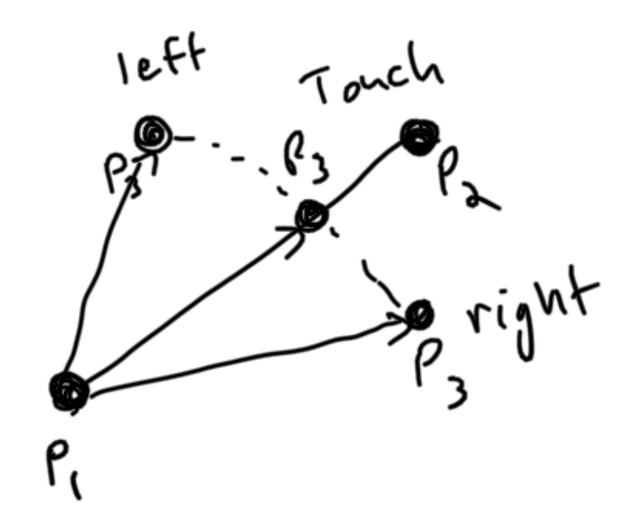
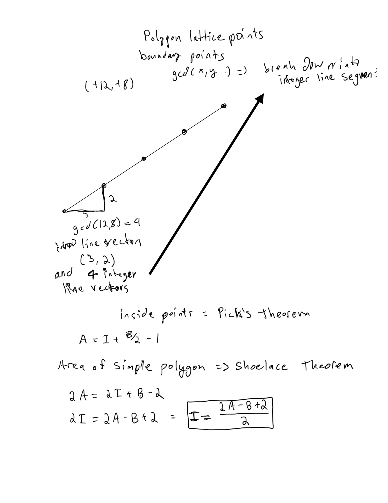

# Geometry

## USED IN SUBMISSIONS

```py
import os,sys
from io import BytesIO, IOBase
from typing import *
sys.setrecursionlimit(1_000_000)
# only use pypyjit when needed, it usese more memory, but speeds up recursion in pypy
import pypyjit
pypyjit.set_param('max_unroll_recursion=-1')

# Fast IO Region
BUFSIZE = 8192
class FastIO(IOBase):
    newlines = 0
    def __init__(self, file):
        self._fd = file.fileno()
        self.buffer = BytesIO()
        self.writable = "x" in file.mode or "r" not in file.mode
        self.write = self.buffer.write if self.writable else None
    def read(self):
        while True:
            b = os.read(self._fd, max(os.fstat(self._fd).st_size, BUFSIZE))
            if not b:
                break
            ptr = self.buffer.tell()
            self.buffer.seek(0, 2), self.buffer.write(b), self.buffer.seek(ptr)
        self.newlines = 0
        return self.buffer.read()
    def readline(self):
        while self.newlines == 0:
            b = os.read(self._fd, max(os.fstat(self._fd).st_size, BUFSIZE))
            self.newlines = b.count(b"\n") + (not b)
            ptr = self.buffer.tell()
            self.buffer.seek(0, 2), self.buffer.write(b), self.buffer.seek(ptr)
        self.newlines -= 1
        return self.buffer.readline()
    def flush(self):
        if self.writable:
            os.write(self._fd, self.buffer.getvalue())
            self.buffer.truncate(0), self.buffer.seek(0)
class IOWrapper(IOBase):
    def __init__(self, file):
        self.buffer = FastIO(file)
        self.flush = self.buffer.flush
        self.writable = self.buffer.writable
        self.write = lambda s: self.buffer.write(s.encode("ascii"))
        self.read = lambda: self.buffer.read().decode("ascii")
        self.readline = lambda: self.buffer.readline().decode("ascii")
sys.stdin, sys.stdout = IOWrapper(sys.stdin), IOWrapper(sys.stdout)
input = lambda: sys.stdin.readline().rstrip("\r\n")
```

```cpp
#include <bits/stdc++.h>
using namespace std;

inline int read()
{
	int x = 0, y = 1; char c = getchar();
	while (c < '0' || c > '9') {
		if (c == '-') y = -1;
		c = getchar();
	}
	while (c >= '0' && c <= '9') x = x * 10 + c - '0', c = getchar();
	return x * y;
}

inline long long readll() {
	long long x = 0, y = 1; char c = getchar();
	while (c < '0' || c > '9') {
		if (c == '-') y = -1;
		c = getchar();
	}
	while (c >= '0' && c <= '9') x = x * 10 + c - '0', c = getchar();
	return x * y;
}
```

## Point Location Test

### Solution 1:  outer product test

1. if outer product > 0 => the point is to the left of the line
1. outer product < 0 => the point is to the right of the line
1. outer product = 0 => the point and line segment points are collinear, that is lying on the same line.



```py
def main():
    x1, y1, x2, y2, x3, y3 = map(int, input().split())
    outer_product = lambda v1, v2: v1[0]*v2[1] - v1[1]*v2[0]
    line_vector = (x2-x1, y2-y1)
    point_vector = (x3-x1, y3-y1)
    outer_prod = outer_product(line_vector, point_vector)
    if outer_prod > 0:
        print('LEFT')
    elif outer_prod < 0:
        print('RIGHT')
    else:
        print("TOUCH")
        
if __name__ == '__main__':
    T = int(input())
    for _ in range(T):
        main()
```

## Line Segment Intersection

### Solution 1:  outer product

The easiest thing is to check if it doesn't intersect, so for instance if the both points of a line segment are on the same side of the other line segment, then they don't intersect.  You can do this for both so you swap the points and do from other perspective. 

Then you need to check when the outer product is 0 for both which indicates collinear lines.  You need to just check if the lines overlap with each other by taking the max of one and min of other, It is guaranteed to not overlap if the max is less than the min of a single coordinate, either x or y coordinate.  Check each dimension independently. Imagine if the max x element is less than the min x element from another line segment then they do not intersect.

```py
def main():
    x1, y1, x2, y2, x3, y3, x4, y4 = map(int, input().split())
    p1, p2, p3, p4 = (x1, y1), (x2, y2), (x3, y3), (x4, y4)
    outer_product = lambda v1, v2: v1[0]*v2[1] - v1[1]*v2[0]
    def intersects(p1, p2, p3, p4):
        for _ in range(2):
            v1, v2, v3 = (p2[0]-p1[0], p2[1]-p1[1]), (p3[0]-p1[0], p3[1]-p1[1]), (p4[0]-p1[0], p4[1]-p1[1])
            outer_prod1 = outer_product(v1, v2)
            outer_prod2 = outer_product(v1, v3)
            if (outer_prod1 < 0 and outer_prod2 < 0) or (outer_prod1 > 0 and outer_prod2 > 0): return False
            if outer_prod1 == outer_prod2 == 0 and (max(p1[0], p2[0]) < min(p3[0], p4[0])) or (max(p1[1], p2[1]) < min(p3[1], p4[1])): return False
            p1, p2, p3, p4 = p3, p4, p1, p2
        return True
    return "YES" if intersects(p1, p2, p3, p4) else "NO"
        
if __name__ == '__main__':
    T = int(input())
    for _ in range(T):
        print(main())
```

## Polygon Area

### Solution 1:  shoelace theorem + O(n) time

shoelace theorem is like taking the determinant of each pair of connected coordinates moving in a clockwise direction.  Then you take the absolute value of the sum of the determinants and divide by 2.  This is the area of the polygon.  The determinant is the area of the parallelogram formed by the two vectors.  The area of the triangle is half of the parallelogram.  So the area of the polygon is the sum of the areas of the triangles formed by the vertices of the polygon.

```py
def main():
    n = int(input())
    vertices = []
    for _ in range(n):
        x, y = map(int, input().split())
        vertices.append((x, y))
    double_area = 0
    for i in range(n):
        x1, y1 = vertices[i]
        x2, y2 = vertices[(i + 1) % n]
        double_area += x1 * y2 - x2 * y1
    double_area = abs(double_area)
    print(double_area)
        
if __name__ == '__main__':
    main()
```

## Point in Polygon

### Solution 1:

```py

```

## Polygon Lattice Points

### Solution 1:  pick's theorem + shoelace theorem + O(n) time

Uses the shoelace theorem to calculate the 2*area of the simple polygon.  Which uses a determinant of each pair of connected coordinates moving in a clockwise or counterclockwise direction.

Calculate the number of boundary points by taking the difference between each pair of coordinates and then compute the gcd, that is how many integer points it will cross along the line segment connecting the pair of coordinates.  Given assumption that the coordinates of the polygon are integers.

Pick's theorem can be used to solve for interior points with area and boundary points known.  Just solve the equation A = I + B/2 - 1 for I.



```py
import math

def main():
    n = int(input())
    vertices = []
    for _ in range(n):
        x, y = map(int, input().split())
        vertices.append((x, y))
    # count boundary points
    boundary = double_area = 0
    for i in range(n):
        x1, y1 = vertices[i]
        x2, y2 = vertices[(i + 1) % n]
        double_area += x1 * y2 - x2 * y1
        boundary += math.gcd(abs(x1 - x2), abs(y1 - y2))
    double_area = abs(double_area)
    interior = (double_area - boundary + 2) // 2
    print(interior, boundary)
    
if __name__ == '__main__':
    main()
```

## Minimum Euclidean Distance

### Solution 1:  divide and conquor + O(nlogn) time

It is too slow in python. 
This works because we keep points on the left and right side regions based on x values, and then we maintain sorted points by y as well, so that can iterate through in the strip quickly.  it is guaranteed to be just 16 points in the strip.  So we can just brute force it.


```py
import math

def main():
    n = int(input())
    points = []
    for _ in range(n):
        x, y = map(int, input().split())
        points.append((x, y))
    points.sort()
    points_y = sorted(points, key=lambda x: x[1])
    euclidean_dist = lambda p1, p2: (p1[0] - p2[0])**2+(p1[1] - p2[1])**2
    def divide(points, points_y):
        n = len(points)
        if n <= 1: return math.inf
        left_points = points[:n//2]
        right_points = points[n//2:]
        left_points_y, right_points_y = [], []
        mid_x = left_points[-1][0]
        mid_y = left_points[-1][1]
        for x, y in points:
            if (x, y) <= (mid_x, mid_y):
                left_points_y.append((x, y))
            else:
                right_points_y.append((x, y))
        # divide
        d = min(divide(left_points, left_points_y), divide(right_points, right_points_y))
        # left [left, mid)
        # right [mid, right)
        # merge
        strip = []
        for x, y in points_y:
            if abs(x - mid_x) <= d:
                strip.append((x, y))
        for i in range(len(strip)):
            # this loop is O(1), at most 16 points, but actually even less. 
            for j in range(i+1, len(strip)):
                if strip[j][1] - strip[i][1] >= d: break
                d = min(d, euclidean_dist(strip[i], strip[j]))
        return d
    return divide(points, points_y)
        
if __name__ == '__main__':
    print(main())
```

Same algorithm written in cpp it also tle on one test case.

```cpp
#define Point pair<int, int>
#define x first
#define y second

long long square(long long x) {
    return x * x;
}

long long euclidean_dist(Point &p1, Point &p2) {
    return square(p1.x - p2.x) + square(p1.y - p2.y);
}

long long divide(vector<Point> &points, vector<Point> &points_y) {
    int n = points.size();
    if (n <= 1) {
        return LLONG_MAX;
    }
    vector<Point> left_points(points.begin(), points.begin() + n / 2);
    vector<Point> right_points(points.begin() + n / 2, points.end());
    vector<Point> left_points_y;
    vector<Point> right_points_y;
    int mid_x = left_points.back().x;
    int mid_y = left_points.back().y;
    for (auto &p : points) {
        if (make_pair(p.x, p.y) <= make_pair(mid_x, mid_y)) {
            left_points_y.push_back(p);
        } else {
            right_points_y.push_back(p);
        }
    }
    long long d = min(divide(left_points, left_points_y), divide(right_points, right_points_y));
    vector<Point> strip;
    for (auto &p : points_y) {
        if (abs(p.x - mid_x) < d) {
            strip.push_back(p);
        }
    }
    for (int i = 0; i < strip.size(); ++i) {
        for (int j = i + 1; j < strip.size() && strip[j].y - strip[i].y < d; ++j) {
            d = min(d, euclidean_dist(strip[i], strip[j]));
        }
    }
    return d;
}

int main() {
    int n = read();
    vector<Point> points(n);
    for (int i = 0; i < n; i++) {
        int x = read(), y = read();
        points[i] = {x, y};
    }
    sort(points.begin(), points.end(), [](auto &a, auto &b) {return make_pair(a.x, a.y) < make_pair(b.x, b.y);});
    vector<Point> points_y = points;
    sort(points_y.begin(), points_y.end(), [](auto &a, auto &b) {return a.y < b.y;});
    cout << divide(points, points_y) << endl;
    return 0;
}
```

## Convex Hull

### Solution 1:

```py

```