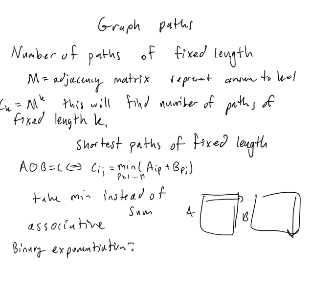

# Mathematics

## Notes

if the implementation is in python it will have this at the top of the python script for fast IO operations

```py
import os,sys
from io import BytesIO, IOBase
from typing import *

# Fast IO Region
BUFSIZE = 8192
class FastIO(IOBase):
    newlines = 0
    def __init__(self, file):
        self._fd = file.fileno()
        self.buffer = BytesIO()
        self.writable = "x" in file.mode or "r" not in file.mode
        self.write = self.buffer.write if self.writable else None
    def read(self):
        while True:
            b = os.read(self._fd, max(os.fstat(self._fd).st_size, BUFSIZE))
            if not b:
                break
            ptr = self.buffer.tell()
            self.buffer.seek(0, 2), self.buffer.write(b), self.buffer.seek(ptr)
        self.newlines = 0
        return self.buffer.read()
    def readline(self):
        while self.newlines == 0:
            b = os.read(self._fd, max(os.fstat(self._fd).st_size, BUFSIZE))
            self.newlines = b.count(b"\n") + (not b)
            ptr = self.buffer.tell()
            self.buffer.seek(0, 2), self.buffer.write(b), self.buffer.seek(ptr)
        self.newlines -= 1
        return self.buffer.readline()
    def flush(self):
        if self.writable:
            os.write(self._fd, self.buffer.getvalue())
            self.buffer.truncate(0), self.buffer.seek(0)
class IOWrapper(IOBase):
    def __init__(self, file):
        self.buffer = FastIO(file)
        self.flush = self.buffer.flush
        self.writable = self.buffer.writable
        self.write = lambda s: self.buffer.write(s.encode("ascii"))
        self.read = lambda: self.buffer.read().decode("ascii")
        self.readline = lambda: self.buffer.readline().decode("ascii")
sys.stdin, sys.stdout = IOWrapper(sys.stdin), IOWrapper(sys.stdout)
input = lambda: sys.stdin.readline().rstrip("\r\n")
```

## Solutions

## Throwing Dice

### Solution 1:  linear reccurence relation + matrix exponentiation + linear algebra + matrix

f(n) = f(n - 1) + f(n - 2) + f(n - 3) + f(n - 4) + f(n - 5) + f(n - 6)


```py
"""
matrix multiplication with modulus
"""
def mat_mul(mat1: List[List[int]], mat2: List[List[int]], mod: int) -> List[List[int]]:
    result_matrix = []
    for i in range(len(mat1)):
        result_matrix.append([0]*len(mat2[0]))
        for j in range(len(mat2[0])):
            for k in range(len(mat1[0])):
                result_matrix[i][j] += (mat1[i][k]*mat2[k][j])%mod
    return result_matrix

"""
matrix exponentiation with modulus
matrix is represented as list of lists in python
"""
def mat_pow(matrix: List[List[int]], power: int, mod: int) -> List[List[int]]:
    if power<=0:
        print('n must be non-negative integer')
        return None
    if power==1:
        return matrix
    if power==2:
        return mat_mul(matrix, matrix, mod)
    t1 = mat_pow(matrix, power//2, mod)
    if power%2 == 0:
        return mat_mul(t1, t1, mod)
    return mat_mul(t1, mat_mul(matrix, t1, mod), mod)

def main():
    n = int(input())
    mod = 10**9+7
    matrix = [
        [1, 1, 1, 1, 1, 1],
        [1, 0, 0, 0, 0, 0],
        [0, 1, 0, 0, 0, 0],
        [0, 0, 1, 0, 0, 0],
        [0, 0, 0, 1, 0, 0],
        [0, 0, 0, 0, 1, 0]
    ]
    base_matrix = [
        [1],
        [0],
        [0],
        [0],
        [0],
        [0]
    ]
    exponentiated_matrix = mat_pow(matrix, n, mod)
    result_matrix = mat_mul(exponentiated_matrix, base_matrix, mod)
    return result_matrix[0][0]

if __name__ == '__main__':
    print(main())
```

## Dice Probability

### Solution 1:  math + probability + and or logic of probability

```py
def main():
    n, a, b = map(int, input().split())
    dp = [0] * (b + 1)
    for i in range(1, min(7, b + 1)):
        dp[i] = 1 / 6
    for _ in range(n - 1):
        ndp = [0] * (b + 1)
        for i in range(b):
            for j in range(1, 7):
                if i + j > b: continue
                ndp[i + j] += dp[i] / 6
        dp = ndp
    res = f"{sum(dp[a : b + 1]):0.6f}"
    print(res)

if __name__ == '__main__':
    main()
```

## Binomial Coefficients

### Solution 1: python math module + math.comb

TLE here, but sometimes it can work. 

```py
import math

def main():
    n = int(input())
    mod = int(1e9) + 7
    for _ in range(n):
        a, b = map(int, input().split())
        res = math.comb(a, b) % mod
        print(res)

if __name__ == '__main__':
    main()
```

### Solution 2:  precompute factorial and inverse factorial + O(1) to compute binomial coefficient + O(m) time, where m is the max(n, k)

```py
def mod_inverse(num, mod):
    return pow(num, mod - 2, mod)

def main():
    n = int(input())
    m = int(1e6) + 1
    mod = int(1e9) + 7
    fact = [1]*(m + 1)
    for i in range(1, m + 1):
        fact[i] = (fact[i - 1] * i) % mod
    inv_fact = [1]*(m + 1)
    inv_fact[-1] = mod_inverse(fact[-1], mod)
    for i in range(m - 1, -1, -1):
        inv_fact[i] = (inv_fact[i + 1] * (i + 1)) % mod
    for _ in range(n):
        a, b = map(int, input().split())
        res = fact[a] * inv_fact[b] * inv_fact[a - b] % mod
        print(res)

if __name__ == '__main__':
    main()
```

## Candy Lottery

### Solution 1: Expected maximum

given n items, and k possible values it computes the expected maximum it represents a square, for the proof

1 2 3
2 2 3
3 3 3

as you can see 1 is in a 1 sided square, 1^2
2 is in a 2 sidied square, 2^2 = 4
3 is in 3 sided square 3^2,
but that is at least those values, so need to take f(x) - f(x - 1) to calculate the number of 3. But this is for 2 items, so extrapolate it to n items. 

```py
def main():
    n, k = map(int, input().split())
    prob = lambda x: pow((x / k), n)
    res = sum(i * (prob(i) - prob(i - 1)) for i in range(1, k + 1))
    print(f"{res:0.6f}")

if __name__ == '__main__':
    main()
```

## Moving Robots

### Solution 1: dynamic programming + probability + expectation of indicator random variable


```py
"""
probability cell is empty is 1 - probability of robot existing on cell
"""
from itertools import product

def main():
    k = int(input())
    n = 8
    board = [[[0] * n for _ in range(n)] for _ in range(n * n)]
    neighborhood = lambda r, c: [(r - 1, c), (r + 1, c), (r, c - 1), (r, c + 1)]
    in_bounds = lambda r, c: 0 <= r < n and 0 <= c < n
    for i in range(n * n):
        r, c = i // n, i % n
        board[i][r][c] = 1
    on_corner = lambda r, c: (r == 0 and c == 0) or (r == 0 and c == n - 1) or (r == n - 1 and c == 0) or (r == n - 1 and c == n - 1)
    on_boundary = lambda r, c: r == 0 or r == n - 1 or c == 0 or c == n - 1
    for _ in range(k):
        nboard = [[[0] * n for _ in range(n)] for _ in range(n * n)]
        for i, r, c in product(range(n * n), range(n), range(n)):
            p = 3 if on_boundary(r, c) else 4
            p = 2 if on_corner(r, c) else p
            for nr, nc in neighborhood(r, c):
                if in_bounds(nr, nc):
                    nboard[i][nr][nc] += board[i][r][c] / p
        board = nboard
    """
    probability that first robot is not in that cell at kth step, 1 - probability robot exists in that cell at kth step
    so it should be multiplied, because you want the probability of the sequence that robot1, robot2, robot3 are all not at that cell
    so how to do this for all.
    low*high = low 
    low*low = low
    high*high = high
    """
    res = [[1] * n for _ in range(n)]
    for i, r, c in product(range(n * n), range(n), range(n)):
        res[r][c] *= (1 - board[i][r][c])
    """
    expectation value is sum of all probabilities of each cell
    using linearity of expectation
    E[x+y] = E[x] + E[y
    that is expecation value of all cells is equal to expectation value of each cell that it is empty
    """
    sum_ = sum(sum(row) for row in res)
    print(f"{sum_:0.6f}")

if __name__ == '__main__':
    main()
```

## Creating Strings II

### Solution 1:  combinatorics + factorials = modular inverse + multinomial coefficient + reduce + string module and count of each lowercase character


```py
from functools import reduce
import string

def mod_inverse(num, mod):
    return pow(num, mod - 2, mod)

def factorials(n, mod):
    fact = [1]*(n + 1)
    for i in range(1, n + 1):
        fact[i] = (fact[i - 1] * i) % mod
    inv_fact = [1]*(n + 1)
    inv_fact[-1] = mod_inverse(fact[-1], mod)
    for i in range(n - 1, -1, -1):
        inv_fact[i] = (inv_fact[i + 1] * (i + 1)) % mod
    return fact, inv_fact

def main():
    s = input()
    n = len(s)
    mod = int(1e9) + 7
    fact, inv_fact = factorials(n, mod)
    res = (fact[n] * reduce(lambda cur, val: inv_fact[s.count(val)] * cur, string.ascii_lowercase, 1)) % mod
    print(res)

if __name__ == '__main__':
    main()
```

## Distributing Apples

### Solution 1:  factorials + modular inverse + inverse factorials + combinations + binomial coefficient + combinatorics


```py
def mod_inverse(num, mod):
    return pow(num, mod - 2, mod)

def factorials(n, mod):
    fact = [1]*(n + 1)
    for i in range(1, n + 1):
        fact[i] = (fact[i - 1] * i) % mod
    inv_fact = [1]*(n + 1)
    inv_fact[-1] = mod_inverse(fact[-1], mod)
    for i in range(n - 1, -1, -1):
        inv_fact[i] = (inv_fact[i + 1] * (i + 1)) % mod
    return fact, inv_fact

def main():
    n, m = map(int, input().split())
    mod = int(1e9) + 7
    fact, inv_fact = factorials(n + m, mod)
    res = (fact[n + m - 1] * inv_fact[n - 1] * inv_fact[m]) % mod
    print(res)

if __name__ == '__main__':
    main()
```

## Christmas Party

### Solution 1:  inclusion-exclusion principle + math + combinatorics + derangements


```py
def mod_inverse(num, mod):
    return pow(num, mod - 2, mod)

def main():
    n = int(input())
    mod = int(1e9) + 7
    fact = [1]*(n + 1)
    for i in range(1, n + 1):
        fact[i] = (fact[i - 1] * i) % mod
    inv_fact = [1]*(n + 1)
    inv_fact[-1] = mod_inverse(fact[-1], mod)
    for i in range(n - 1, -1, -1):
        inv_fact[i] = (inv_fact[i + 1] * (i + 1)) % mod
    res = 0
    for i in range(n + 1):
        res = (res + (inv_fact[i] if i % 2 == 0 else -inv_fact[i])) % mod
    res = (res * fact[n]) % mod
    print(res)

if __name__ == '__main__':
    main()
```

## Counting Divisors

### Solution 1: math, smallest prime factor, sieve, counting divisors, multiplicity of prime factors


Use fact that the largest multiplicity is 20 and the largest number of distinct prime factors is 7. So at most there will be 20 iterations for factorization so it's going to be fast enough.

```cpp
const int N = 1e6 + 5;
int spf[N];

// nloglog(n)
void sieve() {
    for (int i = 2; i < N; i++) {
        if (spf[i] != i) continue;
        for (int j = i * i; j < N; j += i) {
            if (spf[j] != j) continue;
            spf[j] = i;
        }
    }
}

// log(x) algorithm with spf
int count_divisors(int x) {
    int res = 1;
    int prev = -1;
    int cnt = 1;
    while (x > 1) {
        if (spf[x] != prev) {
            res *= cnt;
            cnt = 1;
        }
        cnt++;
        prev = spf[x];
        x /= spf[x];
    }
    res *= cnt;
    return res;
}

signed main() {
    ios::sync_with_stdio(0);
    cin.tie(0);
    cout.tie(0);
    int n, x;
    cin >> n;
    for (int i = 0; i < N; i++) {
        spf[i] = i;
    }
    sieve();
    for (int i = 0; i < n; i++) {
        cin >> x;
        cout << count_divisors(x) << endl;
    }
    return 0;
}
```

## Common Divisors

### Solution 1:  harmonic series, math, sieve, 

The image seems wrong? 


```py
const int N = 1e6 + 5;
int freq[N];

int solve() {
    int n, x;
    cin >> n;
    memset(freq, 0, sizeof(freq));
    int max_x = 0;
    for (int i = 0; i < n; i++) {
        cin >> x;
        // increase the frequency and so on
        freq[x]++;
        max_x = max(x, max_x);
    }
    for (int g = max_x; g > 0; g--) {
        int div_count = 0;
        for (int j = g; j <= max_x; j += g) {
            div_count += freq[j];
        }
        if (div_count > 1) return g;
    }
    return 1;
}

signed main() {
    ios::sync_with_stdio(0);
    cin.tie(0);
    cout.tie(0);
    cout << solve() << endl;
    return 0;
}
```

## Prime Multiples

### Solution 1:  inclusion exclusion principle + bitmasks + bit manipulation + subsets


```py
def main():
    n, k = map(int, input().split())
    primes = list(map(int, input().split()))
    res = 0
    for bitmask in range(1, 1 << k):
        num_divisible = n
        num_primes = 0
        for i in range(k):
            if (bitmask >> i) & 1:
                num_divisible //= primes[i]
                num_primes += 1
        res = (res + (num_divisible if num_primes & 1 else -num_divisible))
    print(res)

if __name__ == '__main__':
    main()
```

## Counting Coprime Pairs

### Solution 1:  combinatorics + combinations + inclusion exclusion principle + bitmasks + bit manipulation + prime sieve + gcd + math + factorials

Only the cpp code pass all test cases without TLE


```py
"""
precomputes the prime factorization for each integer from 0 to upper_bound (inclusive)
"""
def prime_sieve(upper_bound):
    prime_factorizations = [[] for _ in range(upper_bound + 1)]
    for i in range(2, upper_bound + 1):
        if len(prime_factorizations[i]) > 0: continue # not a prime
        for j in range(i, upper_bound + 1, i):
            prime_factorizations[j].append(i)
    return prime_factorizations

"""
given upper_bound <= 10^6, the highest count of prime factors for any integer 
in that range is going to be 7
"""
def main():
    n = int(input())
    arr = list(map(int, input().split()))
    upper_bound = max(arr)
    prime_factorizations = prime_sieve(upper_bound)
    # count and size of each pair of primes for each integer
    count = [0] * (upper_bound + 1)
    size = [0] * (upper_bound + 1)
    for num in arr:
        k = len(prime_factorizations[num])
        for bitmask in range(1, 1 << k):
            prod = 1
            num_primes = 0
            for i in range(k):
                if (bitmask >> i) & 1:
                    prod *= prime_factorizations[num][i]
                    num_primes += 1
            count[prod] += 1
            size[prod] = num_primes
    res = 0
    # combinbation formula is n! / (n - k)! * k!
    # but for pairs it is always n * (n - 1) / 2
    for i in range(1, upper_bound + 1):
        if count[i] < 2: continue
        pair_combinations = count[i] * (count[i] - 1) // 2
        res = (res + (pair_combinations if size[i] & 1 else -pair_combinations))
    # solving the complement, the upper bound on the number of combinations of pairs is n choose 2
    upper_value = n * (n - 1) // 2
    print(upper_value - res)

if __name__ == '__main__':
    main()
```

```cpp
vector<vector<int>> prime_sieve(int upper_bound) {
    vector<vector<int>> prime_factorizations(upper_bound + 1);
    vector<bool> vis(upper_bound + 1);
    for (int i = 2; i <= upper_bound; i++) {
        if (vis[i]) continue;
        for (int j = i; j <= upper_bound; j += i) {
            vis[j] = true;
            prime_factorizations[j].push_back(i);
        }
    }
    return prime_factorizations;
}

int32_t main() {
    int n = read();
    vector<int> arr(n);
    for (int i = 0; i < n; i++) {
        arr[i] = read();
    }
    int upper_bound = *max_element(arr.begin(), arr.end());
    vector<vector<int>> prime_factorizations = prime_sieve(upper_bound);
    vector<int> prod_counts(upper_bound + 1);
    vector<int> prod_size(upper_bound + 1);
    for (int num : arr) {
        int k = prime_factorizations[num].size();
        for (int bitmask = 1; bitmask < (1 << k); bitmask++) {
            int prod = 1;
            int num_primes = 0;
            for (int i = 0; i < k; i++) {
                if ((bitmask >> i) & 1) {
                    prod *= prime_factorizations[num][i];
                    num_primes++;
                }
            }
            prod_counts[prod]++;
            prod_size[prod] = num_primes;
        }
    }
    int res = 0;
    for (int i = 0; i <= upper_bound; i++) {
        if (prod_counts[i] < 2) continue;
        int pair_combinations = prod_counts[i] * (prod_counts[i] - 1) / 2;
        res = (res + ((prod_size[i] & 1) ? pair_combinations : -pair_combinations));
    }
    int upper_value = n * (n - 1) / 2;
    int ans = upper_value - res;
    cout << ans << endl;
    return 0;
}
```

## Graph Paths I

### Solution 1:



```py

```

## Graph Paths II

### Solution 1:

```py

```

## Stick Game

### Solution 1:

```py

```

## Nim Game I

### Solution 1:  grundy numbers + independent sub games for each heap so take the nim sum + grundy number is equal to number of sticks in pile + O(n) time

```py
from functools import reduce
import operator

def main():
    n = int(input())
    heaps = list(map(int, input().split()))
    return 'first' if reduce(operator.xor, heaps) > 0 else 'second'

if __name__ == '__main__':
    T = int(input())
    for _ in range(T):
        print(main())
```

## Nim Game II

### Solution 1:

```py

```

## Stair Game

### Solution 1:

```py
from functools import cache
sys.stdout = open('output.txt', 'w')


@cache
def main(n, stairs):
    if sum(stairs[1:]) == 0: return 0
    grundy_numbers = set()
    for i in range(1, n):
        if stairs[i] == 0: continue
        new_stairs = list(stairs)
        for _ in range(stairs[i]):
            new_stairs[i] -= 1
            new_stairs[i - 1] += 1
            grundy_numbers.add(main(n, tuple(new_stairs)))
    mex = 0
    while mex in grundy_numbers:
        mex += 1
    if mex != 0:
        print('stairs', stairs, 'mex =', mex)
    return mex

if __name__ == '__main__':
    n = 6
    stairs = [20, 20, 20, 20, 20, 20]
    main(n, tuple(stairs))
    sys.stdout.close()
```

## Grundy's Game

### Solution 1:  grundy numbers + memoization + mex function + independent subgames that are summed up + observe pattern that grundy only equal to 0 for n < 1300 + O(n^2) time complexity

```cpp
#include <bits/stdc++.h>
using namespace std;

int memo[1301];
int thres = 10000;

int grundy(int coins) {
	if (memo[coins] != -1) return memo[coins];
	if (coins <= 2) return 0;
	vector<int> grundy_numbers(thres, 0);
	for (int i = 1; i <= coins/2; i++) {
		if (i == coins - i) continue;
		grundy_numbers[grundy(i) ^ grundy(coins - i)] = 1;
	}
	for (int grundy_number = 0; grundy_number < thres; grundy_number++) {
		if (grundy_numbers[grundy_number] == 0) {
			return memo[coins] = grundy_number;
		}
	}
	return -1;
}

int main() {
	cin.tie(0)->sync_with_stdio(0);
	int n, t;
	cin >> t;
	memset(memo, -1, sizeof(memo));
	grundy(1300);
	while (t--) {
		cin >> n;
		if (n <= 1300) {
			cout << (memo[n] > 0 ? "first" : "second") << endl;
		} else {
			cout << "first" << endl;
		}
	}
	return 0;
}
```


## Another Game

### Solution 1: brute force + expontential time + sprague grundy theorem + use to observe the pattern to derive the simpler solution

```py
from functools import cache
import sys
sys.setrecursionlimit(1_000_000)
sys.stdout = open('output.txt', 'w')

@cache
def coin_game(n, heaps):
    if all(h == 0 for h in heaps):
        return 0
    grundy_numbers = set()
    for mask in range(1, 1 << n):
        nei_heaps = list(heaps)
        below_zero = False
        for i in range(n):
            if (mask>>i)&1:
                if nei_heaps[i] == 0:
                    below_zero = True
                    break
                nei_heaps[i] -= 1
        if not below_zero:
            grundy_numbers.add(coin_game(n, tuple(nei_heaps)))
    # mex function implementation
    grundy_number = 0
    while grundy_number in grundy_numbers:
        grundy_number += 1
    print(heaps, 'g =', grundy_number)
    return grundy_number

if __name__ == '__main__':
    n = 4
    heaps = tuple([8, 8, 8, 8])
    print(coin_game(n, heaps))
    sys.stdout.close
```

### Solution 2:  periodicity observed from using sprague grund's theorem + if all the numbers are even then the grundy number is 0 and a losing state for first player + first player only wins if at least one number is odd

```py
def main():
    n = int(input())
    heaps = list(map(int, input().split()))
    return 'first' if any(h&1 for h in heaps) else 'second'
    
if __name__ == '__main__':
    T = int(input())
    for _ in range(T):
        print(main())
```
