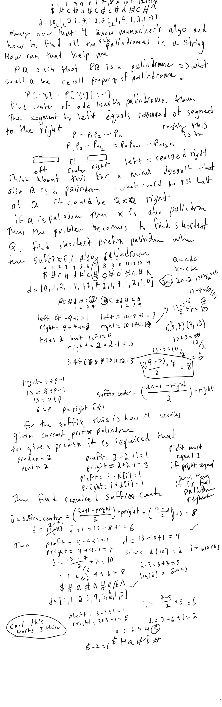

# Google Kickstart 2022 Round E

## Summary

##  P1: Color Game

### Solution 1:  greedy + math

```py
def main():
    n = int(input())
    score = 0
    loc = 0
    while loc < n:
        score += 1
        loc += 5
    return score

if __name__ == '__main__':
    T = int(input())
    for t in range(1,T+1):
        print(f'Case #{t}: {main()}')
```

## P2: Students and Mentors

### Solution 1:  binary search + hash table

```py
from collections import defaultdict
from bisect import bisect_right
def main():
    n = int(input())
    ratings = list(map(int,input().split()))
    index = defaultdict(list)
    for i, r in enumerate(ratings):
        index[r].append(i)
    result = [-1]*n
    ratings = sorted(list(set(ratings)))
    for r in ratings:
        i = bisect_right(ratings, 2*r) - 1
        if ratings[i] == r and len(index[r]) == 1:
            i -= 1
        if i < 0: continue
        for j in index[r]:
            result[j] = ratings[i]
    return ' '.join(map(str, result))

if __name__ == '__main__':
    T = int(input())
    for t in range(1,T+1):
        print(f'Case #{t}: {main()}')
```

## P3: Matching Palindrome

### Solution 1:  dynamic programming + manacher's algorithm + shortest prefix palindrome with the rest being suffix palindrome + P = QX and QXQ is palindrome too

```py
def main():
    delim_char, begin_char, end_char = '#', '$', '^'
    n = int(input())
    s = begin_char + input()
    arr = [s[i//2] if i%2 == 0 else delim_char for i in range(2*n+2)] + [end_char]
    d = [0]*(2*n+3)
    left = right = 1
    for i in range(1,2*n+2):
        d[i] = max(0, min(right-i, d[left + (right-i)]))
        while arr[i-d[i]] == arr[i+d[i]]:
            d[i] += 1
        if i+d[i] > right:
            left, right = i-d[i], i+d[i]
    for prefix_center in range(1,2*n):
        if d[prefix_center] < 2: continue
        prefix_left, prefix_right = prefix_center - d[prefix_center] + 1, prefix_center + d[prefix_center]- 1
        if prefix_left != 1: continue # required for it to be a prefix palindrome
        suffix_center = (2*n+1-prefix_right)//2+prefix_right
        suffix_radius = 2*n+1-suffix_center+1 # required radius to be a suffix palindrome
        if d[suffix_center] == suffix_radius:
            return ''.join(filter(lambda x: x!=delim_char, arr[prefix_left:prefix_right+1]))
    return s[1:]

    
if __name__ == '__main__':
    T = int(input())
    for t in range(1,T+1):
        print(f'Case #{t}: {main()}')
```



##

### Solution 1: 

```py

```