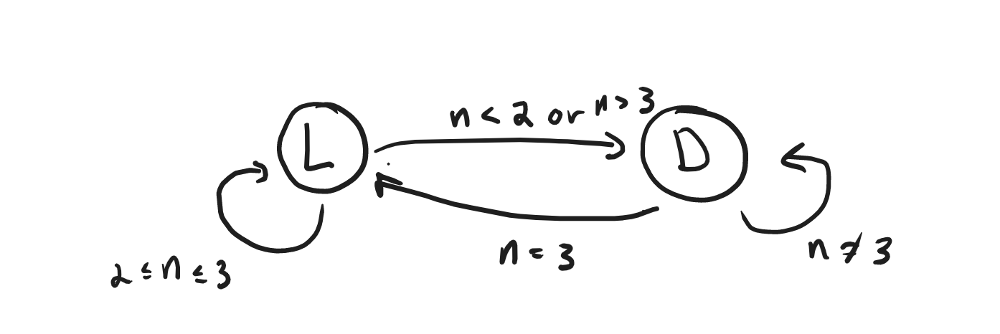

# 289. Game of Life

## Solution 1: FSM (finite state machine) + Mark matrix for transition states in-place (dummy variables)

I can mark the matrix in place if I use negatives and positives, where positive represent
no transition and negatives represent transition to another state.  This works because
the states are binary, there are only two states.  I will need to mark dead state as 2 though for 
this idea.  Then if 1 is live, 2 is dead, then -1 transition to dead, -2 transition to live

In cellular automata the moore neighborhood is the 8 neighboring cells



```py
class Solution:
    def gameOfLife(self, board: List[List[int]]) -> None:
        R, C = len(board), len(board[0])
        for r, c in product(range(R), range(C)):
            if board[r][c]==0:
                board[r][c] = 2
        in_boundary = lambda r, c: 0<=r<R and 0<=c<C
        living = lambda r, c: abs(board[r][c]) == 1
        for r, c in product(range(R), range(C)):
            num_live = num_dead = 0
            for dr, dc in product(range(-1,2),range(-1,2)):
                if dr==dc==0: continue
                nr, nc = r+dr, c+dc
                if in_boundary(nr,nc):
                    num_live += (abs(board[nr][nc]) == 1)
                    num_dead += (abs(board[nr][nc]) == 2)
            if living(r,c):
                if num_live < 2 or num_live > 3:
                    board[r][c] = -1
            else:
                if num_live == 3:
                    board[r][c] = -2
        for r, c in product(range(R), range(C)):
            if board[r][c] == -1:
                board[r][c] = 0
            elif board[r][c] == -2:
                board[r][c] = 1
            elif board[r][c] == 2:
                board[r][c] = 0
```