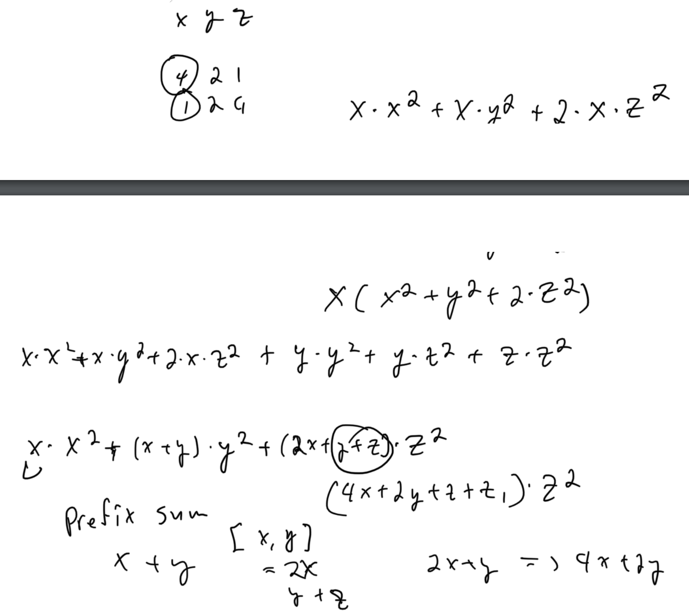

# Leetcode Biweekly Contest 104

## 2678. Number of Senior Citizens

### Solution 1:  string slicing

```py
class Solution:
    def countSeniors(self, details: List[str]) -> int:
        return sum(1 for info in details if int(info[11:13]) > 60)
```

## 2679. Sum in a Matrix

### Solution 1:  sort rows + transpose matrix

By sorting the rows in reverse guarantee largest elements are first, then by taking transpose, each column will be turned into rows in new matrix. Then we can sum the largest element in each row. Because that corresponds to largest value in each column

```py
class Solution:
    def matrixSum(self, nums: List[List[int]]) -> int:
        for row in nums:
            row.sort(reverse = True)
        def transpose_matrix(matrix):
            return list(map(list, zip(*matrix)))
        mat = transpose_matrix(nums)
        return sum(max(row) for row in mat)
```

## 2680. Maximum OR

### Solution 1:  frequency array

```py
class Solution:
    def maximumOr(self, nums: List[int], k: int) -> int:
        freq = [0]*45
        res = 0
        for num in nums:
            for j in range(32):
                if (num>>j)&1:
                    freq[j] += 1
        for num in nums:
            cur = 0
            for j in range(45):
                if (num>>j)&1:
                    freq[j] -= 1
                    freq[j + k] += 1
                if freq[j] > 0:
                    cur |= (1 << j)
            res = max(res, cur)
            for j in range(45):
                if (num>>j)&1:
                    freq[j] += 1
                    freq[j + k] -= 1
        return res
```

### Solution 2:  prefix and suffix or sum + bit manipulation

Consider current element and multiplying by 2^k or shifting bits to the left by k.  Then or that with the pref_or and suffix_or

```py
class Solution:
    def maximumOr(self, nums: List[int], k: int) -> int:
        n = len(nums)
        pref_or, suf_or = 0, [0]*(n+1)
        for i in range(n - 1, -1, -1):
            suf_or[i] = suf_or[i+1] | nums[i]
        res = 0
        for i in range(n):
            val = nums[i] << k
            res = max(res, pref_or | val | suf_or[i+1])
            pref_or |= nums[i]
        return res
```

## 2681. Power of Heroes

### Solution 1:  sort + math + deque + prefix sum



```py
class Solution:
    def sumOfPower(self, nums: List[int]) -> int:
        nums.sort()
        res = 0
        n = len(nums)
        mod = int(1e9) + 7
        q = deque()
        psum1 = psum2 = 0
        for num in nums:
            psum1 = (psum1 + num)%mod
            q.append(num)
            if len(q) > 2:
                x = q.popleft()
                psum1 -= x
                psum2 += x
            psum2 = (psum2*2)%mod
            res = (res + ((psum1 + psum2)*pow(num, 2, mod))%mod)%mod
        return res
```