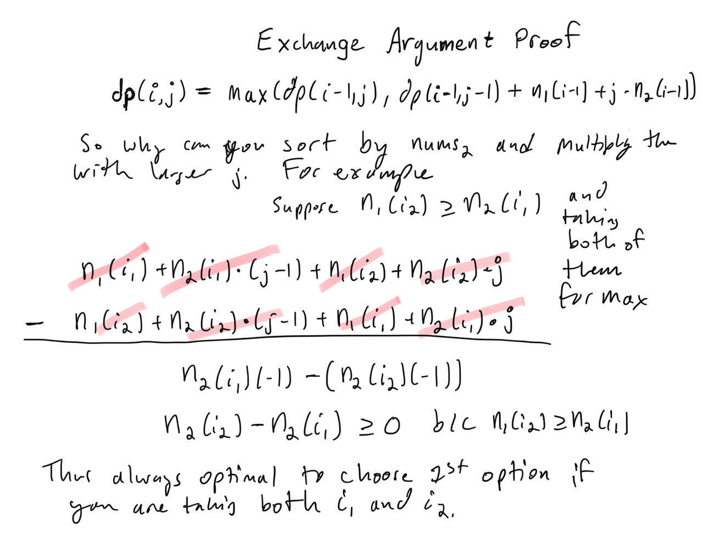

# Leetcode Biweekly Contest 110

## 2806. Account Balance After Rounded Purchase

### Solution 1:  brute force

```py
class Solution:
    def accountBalanceAfterPurchase(self, purchaseAmount: int) -> int:
        best, diff = 0, math.inf
        for i in range(0, 101, 10):
            if abs(purchaseAmount - i) <= diff:
                best = i
                diff = abs(purchaseAmount - i)
        return 100 - best
```

## 2807. Insert Greatest Common Divisors in Linked List

### Solution 1:  linked list + inserting nodes + gcd

```py
class Solution:
    def insertGreatestCommonDivisors(self, head: Optional[ListNode]) -> Optional[ListNode]:
        cur = head
        while cur.next:
            nxt = cur.next
            cur.next = ListNode(math.gcd(cur.val, nxt.val))
            cur.next.next = nxt
            cur = nxt
        return head
```

## 2808. Minimum Seconds to Equalize a Circular Array

### Solution 1: dictionary + maximize

you just need to store the last index for when last a value appeared, and then you need to calculate the distance between current occurrence and last index of that integer. The number of seconds required to fill in everything between it with it's value will be (dist + 1) // 2. You need to maximize this value for each integer.

proof is 
x _ _ _ x, 
it will take 2 seconds obviously to fill in 3 slots between an integer
1st second x x _ x x
2nd second x x x x x
so you just need to know the number of slots that need to be changed to value x.  Or think of it like yeah, but at each second they can move to right and left, so iti s just dividing by 2. 

```py
class Solution:
    def minimumSeconds(self, nums: List[int]) -> int:
        n = len(nums)
        last_index = {}
        time = Counter()
        for i in range(n):
            last_index[nums[i]] = i
        for i in range(n):
            dist = (i - last_index[nums[i]] - 1) % n
            last_index[nums[i]] = i
            delta = (dist + 1) // 2
            time[nums[i]] = max(time[nums[i]], delta)
        return min(time.values())
```

## 2809. Minimum Time to Make Array Sum At Most x

### Solution 1:  greedy + sort + dynamic programming + exchange argument

dp[i][j] = maximum value for the first i elements and j operations

To really understand the greedy sorting part you can use exchange argument to prove that you just need to sort nums2 and that anytime you picking the same element it is always optimal to pick it later so that it has a larger multiplier



```py
class Solution:
    def minimumTime(self, nums1: List[int], nums2: List[int], x: int) -> int:
        n = len(nums1)
        nums = sorted([(x1, x2) for x1, x2 in zip(nums1, nums2)], key = lambda pair: pair[1])
        s1, s2 = sum(nums1), sum(nums2)
        dp = [[0] * (n + 1) for _ in range(n + 1)]
        for i, j in product(range(n), repeat = 2):
            # j + 1 operation
            dp[i + 1][j + 1] = max(dp[i][j + 1], dp[i][j] + nums[i][0] + (j + 1) * nums[i][1])
        for i in range(n + 1):
            if s1 + s2 * i - dp[n][i] <= x: return i
        return - 1
```