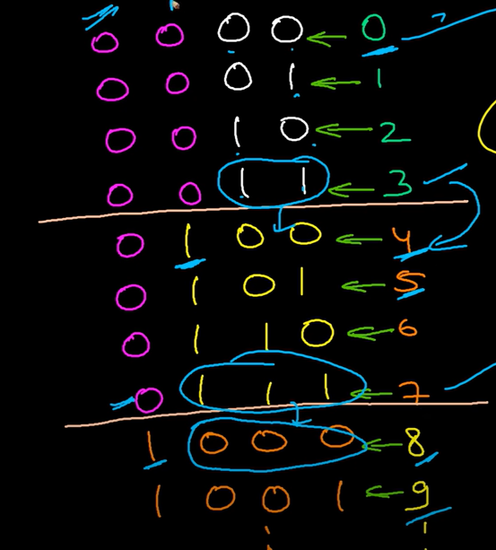

## 1043. Partition Array for Maximum Sum

### Solution 1:  dynammic programming, O(n^2)

dp[i] = maximum sum of partitioning arr[:i + 1] into segments of length at most k when setting the values equal to the max value in each segment. 

For each position i it computes the maximum sum that can be achieved by partitioning the array up to and including the ith element.

Then it increases the size of the current partition that includes i, by moving the j pointer back until it reaches the max size of k.  And it tracks the maximum element in that partition, as that will be the value of all elements in the partition.  And then it computes the value by taking the maximum sum of the partition up to j, and adding the value of the partition to the sum.  And then it updates the dp[i + 1] with the maximum value of the partition.

```py
class Solution:
    def maxSumAfterPartitioning(self, arr: List[int], k: int) -> int:
        n = len(arr)
        dp = [-math.inf] * (n + 1)
        dp[0] = 0
        for i in range(n):
            segmax = -math.inf
            for j in range(i, max(-1, i - k), -1):
                segmax = max(segmax, arr[j])
                dp[i + 1] = max(dp[i + 1], dp[j] + (i - j + 1) * segmax)
        return dp[-1]
```

## 49. Group Anagrams

### Solution 1:  sort, groupby, counter

```py
class Solution:
    def groupAnagrams(self, strs: List[str]) -> List[List[str]]:
        ans = []
        prev = Counter({"i": -1})
        for s in sorted(strs, key = lambda x: sorted(list(x))):
            freq = Counter(s)
            if prev == freq:
                ans[-1].append(s)
            else:
                ans.append([s])
            prev = freq
        return ans
```

```py
class Solution:
    def groupAnagrams(self, strs: List[str]) -> List[List[str]]:
        ans = []
        strs.sort(key = sorted)
        for k, grp in groupby(strs, key = sorted):
            ans.append(list(grp))
        return ans
```

## 368. Largest Divisible Subset

### Solution 1:  sort, dynamic programming, parent array to track best path, backtrack in parent array

```py
class Solution:
    def largestDivisibleSubset(self, nums: List[int]) -> List[int]:
        nums.sort()
        n = len(nums)
        dp = [0] * n
        parent = [-1] * n
        for i in range(n):
            for j in range(i):
                if nums[i] % nums[j] == 0 and dp[j] >= dp[i]:
                    dp[i] = dp[j] + 1
                    parent[i] = j
        ans = []
        i = max(range(n), key = lambda i: dp[i])
        while i != -1:
            ans.append(nums[i])
            i = parent[i]
        return ans
```

## 1463. Cherry Pickup II

### Solution 1:  iterative dp, space optimized, maximize
(column robot 1 occupies, column robot 2 occupies)
And just compute maximum for every possible transition.  

```py
class Solution:
    def cherryPickup(self, grid: List[List[int]]) -> int:
        R, C = len(grid), len(grid[0])
        dp = [[-math.inf] * C for _ in range(C)]
        dp[0][-1] = grid[0][0] + grid[0][-1]
        in_bounds = lambda c: 0 <= c < C
        for r in range(1, R):
            ndp = [[-math.inf] * C for _ in range(C)]
            for c1, c2 in product(range(C), repeat = 2):
                if dp[c1][c2] == -math.inf: continue
                for nc1, nc2 in product(range(c1 - 1, c1 + 2), range(c2 - 1, c2 + 2)):
                    if not in_bounds(nc1) or not in_bounds(nc2): continue
                    ndp[nc1][nc2] = max(ndp[nc1][nc2], dp[c1][c2] + grid[r][nc1] + (grid[r][nc2] if nc1 != nc2 else 0))
            dp = ndp
        return max(max(row) for row in dp)
```

## 169. Majority Element

### Solution 1:  Boyer-Moore Voting Algorithm

```py
class Solution:
    def majorityElement(self, nums: List[int]) -> int:
        n = len(nums)
        ans = cnt = 0
        for num in nums:
            if cnt == 0: ans = num
            if ans == num: cnt += 1
            else: cnt -= 1
        return ans
```

## 1481. Least Number of Unique Integers after K Removals

### Solution 1:  count, sort

```py
class Solution:
    def findLeastNumOfUniqueInts(self, arr: List[int], k: int) -> int:
        freq = sorted(Counter(arr).values(), reverse = True)
        while k > 0:
            x = freq.pop()
            k -= x
            if k < 0: freq.append(x)
        return len(freq)
```

## 201. Bitwise AND of Numbers Range

### Solution 1:  bit manipulation



Observation 1:
All the bits to the right of a flipped bit between left and right will also be flipped in the range.

```py
class Solution:
    def rangeBitwiseAnd(self, left: int, right: int) -> int:
        ans = 0
        try:
            start = next(dropwhile(lambda i: not ((right >> i) & 1), reversed(range(32))))
        except:
            return ans
        for i in range(start, -1, -1):
            if (right >> i) != (left >> i): break
            if (right >> i) & 1: ans |= (1 << i)
        return ans
```

## 2092. Find All People With Secret

### Solution 1:  undirected graph, dfs

Form an many undirected graphs at each time step.  And the person who has a secret spreads to everyone they can reach.  So use a dfs through the graph from each person that knows a secret let it flow to everyone. 

```py
class Solution:
    def findAllPeople(self, n: int, meetings: List[List[int]], firstPerson: int) -> List[int]:
        know = [0] * n
        know[0] = know[firstPerson] = 1
        edge_lists = defaultdict(list)
        for u, v, t in sorted(meetings, key = lambda pair: pair[-1]):
            edge_lists[t].append((u, v))
        def dfs(src):
            stk = [src]
            vis.add(src)
            while stk:
                u = stk.pop()
                know[u] = 1
                for v in adj[u]:
                    if v in vis: continue
                    vis.add(v)
                    stk.append(v)
        for edges in edge_lists.values():
            adj = defaultdict(list)
            nodes, vis = set(), set()
            for u, v in edges:
                adj[u].append(v)
                adj[v].append(u)
                nodes.update([u, v])
            for u in nodes:
                if u in vis: continue
                if not know[u]: continue
                dfs(u)
        return [i for i in range(n) if know[i]]
```

## 543. Diameter of Binary Tree

### Solution 1: recursion, dfs

```py
class Solution:
    def diameterOfBinaryTree(self, root: Optional[TreeNode]) -> int:
        ans = 0
        def dfs(u):
            nonlocal ans
            if not u: return 0
            llen, rlen = dfs(u.left), dfs(u.right)
            ans = max(ans, llen + rlen)
            return max(llen, rlen) + 1
        dfs(root)
        return ans
```

## 513. Find Bottom Left Tree Value

### Solution 1:  bfs

```py
class Solution:
    def findBottomLeftValue(self, root: Optional[TreeNode]) -> int:
        q = deque([root])
        while q:
            first = q[0].val
            for _ in range(len(q)):
                u = q.popleft() 
                q.extend(filter(None, (u.left, u.right)))
        return first
```

## 1609. Even Odd Tree

### Solution 1:  hash map, dfs

```py
class Solution:
    def isEvenOddTree(self, root: Optional[TreeNode]) -> bool:
        last = {}
        def dfs(u, depth = 0):
            if not u: return True
            if depth & 1:
                if u.val & 1: return False
                if u.val >= last.get(depth, math.inf): return False
                last[depth] = u.val
            else:
                if u.val % 2 == 0: return False
                if u.val <= last.get(depth, -math.inf): return False
                last[depth] = u.val
            return dfs(u.left, depth + 1) and dfs(u.right, depth + 1)
        return dfs(root)
```

## 1750. Minimum Length of String After Deleting Similar Ends

### Solution 1:  two pointers 

```py
class Solution:
    def minimumLength(self, s: str) -> int:
        l, r = 0, len(s) - 1
        while l < r:
            if s[l] != s[r]: break 
            ch = s[l]
            while l <= r and s[l] == ch: l += 1 
            while l <= r and s[r] == ch: r -= 1
        return max(0, r - l + 1)
```

## 791. Custom Sort String

### Solution 1:  sort with key, string find

```py
class Solution:
    def customSortString(self, order: str, s: str) -> str:
        return "".join(sorted(s, key = lambda ch: order.find(ch)))
```

## 1171. Remove Zero Sum Consecutive Nodes from Linked List

### Solution 1: linked list, sentinel node, start and end node for range and prefix sum

```py
class Solution:
    def removeZeroSumSublists(self, head: Optional[ListNode]) -> Optional[ListNode]:
        front = ListNode(0, head)
        start = front
        while start:
            psum = 0
            end = start.next
            while end:
                psum += end.val
                if psum == 0: start.next = end.next
                end = end.next
            start = start.next
        return front.next
```

## 930. Binary Subarrays With Sum

### Solution 1:  sliding window, frequency array, natural sequence sum formula

```py
class Solution:
    def numSubarraysWithSum(self, nums: List[int], goal: int) -> int:
        f = lambda n: n * (n + 1) // 2
        if goal == 0: return sum(f(len(list(grp))) for k, grp in groupby(nums) if k == 0)
        n = len(nums)
        freq = [1] * (n + 1)
        ans = 0
        for i in reversed(range(n)):
            if nums[i] == 0: freq[i] = freq[i + 1] + 1
        j = wsum = 0
        for i in range(n):
            wsum += nums[i]
            while wsum > goal:
                wsum -= nums[j]
                j += 1
            if wsum == goal: ans += freq[j]
        return ans
```

## 238. Product of Array Except Self

### Solution 1:  prefix and suffix multiplication

```py
class Solution:
    def productExceptSelf(self, nums: List[int]) -> List[int]:
        n = len(nums)
        ans = list(accumulate(reversed(nums), func = operator.mul))
        ans.reverse()
        pmul = 1
        for i in range(n):
            ans[i] = pmul * (ans[i + 1] if i + 1 < n else 1)
            pmul *= nums[i]
        return ans
```

## 452. Minimum Number of Arrows to Burst Balloons

### Solution 1: line sweep, greedy, stack

```py
class Solution:
    def findMinArrowShots(self, points: List[List[int]]) -> int:
        START = -1
        END = 1
        n = len(points)
        events = []
        for i, (s, e) in enumerate(points):
            events.append((s, START, i))
            events.append((e, END, i))
        events.sort()
        arrows = [-1] * n
        stk = []
        shots = 1
        for _, d, i in events:
            if d == END and arrows[i] == -1: # set of balloons not burst yet
                while stk: # burst everything that has been seen
                    j = stk.pop()
                    arrows[j] = shots
                shots += 1 # will need 1 more shot for any more balloons not burst by this shot
            elif d == START:
                stk.append(i)
        return max(arrows)
```

## 621. Task Scheduler

### Solution 1:  maxheap, array, greedy

place the most frequent task first in each cycle, cycles are of length n + 1, save in array for characters so they are not used more than once in cycle, but will be added back into max heap after the cycle. 

```py
class Solution:
    def leastInterval(self, tasks: List[str], n: int) -> int:
        freq = Counter(tasks)
        heapify(maxheap := [(-freq[ch], ch) for ch in string.ascii_uppercase if freq[ch] > 0])
        ans = cur = 0
        while maxheap:
            stk = []
            for i in range(n + 1):
                cur += 1
                if not maxheap: continue
                _, ch = heappop(maxheap)
                ans = cur
                freq[ch] -= 1
                stk.append(ch)
            for ch in stk:
                if freq[ch] > 0: heappush(maxheap, (-freq[ch], ch))
        return ans
```

## 41. First Missing Positive

### Solution 1: answer in range [1,n], swap elements to correct index

```py
class Solution:
    def firstMissingPositive(self, nums: List[int]) -> int:
        nums.append(0)
        n = len(nums)
        for i in range(n):
            index = None
            while 0 <= nums[i] < n and nums[i] != index:
                index = nums[i]
                nums[index], nums[i] = nums[i], nums[index]
        for i in range(1, n):
            if nums[i] != i: return i
        return n
```

## 713. Subarray Product Less Than K

### Solution 1:  two pointers, prefix calculation with multiplication

```py
class Solution:
    def numSubarrayProductLessThanK(self, nums: List[int], k: int) -> int:
        n = len(nums)
        ans = j = 0
        pmul = 1
        for i in range(n):
            pmul *= nums[i]
            while j <= i and pmul >= k:
                pmul //= nums[j]
                j += 1
            ans += i - j + 1
        return ans
```

## 992. Subarrays with K Different Integers

### Solution 1:  two sliding windows, two pointers, frequency array

```py
class Solution:
    def subarraysWithKDistinct(self, nums: List[int], k: int) -> int:
        p1 = p2 = ans = d1 = d2 = 0
        n = len(nums)
        f1, f2 = [0] * (n + 1), [0] * (n + 1)
        for i in range(n):
            f1[nums[i]] += 1
            f2[nums[i]] += 1
            if f1[nums[i]] == 1: d1 += 1
            if f2[nums[i]] == 1: d2 += 1
            while d1 > k:
                f1[nums[p1]] -= 1
                if f1[nums[p1]] == 0: d1 -= 1
                p1 += 1
            while d2 >= k:
                f2[nums[p2]] -= 1
                if f2[nums[p2]] == 0: d2 -= 1
                p2 += 1
            ans += p2 - p1
        return ans
```

## 678. Valid Parenthesis String

### Solution 1: two pointers, greedy

```py
class Solution:
    def checkValidString(self, s: str) -> bool:
        lo = hi = 0
        for i, ch in enumerate(s):
            if ch == "(": 
                lo += 1
                hi += 1
            elif ch == ")":
                lo -= 1
                hi -= 1
            else:
                lo -= 1
                hi += 1
            if hi < 0: return False
            lo = max(0, lo)
        return lo == 0
```

## 950. Reveal Cards In Increasing Order

### Solution 1: simulation deque

```py
class Solution:
    def deckRevealedIncreasing(self, deck: List[int]) -> List[int]:
        n = len(deck)
        pos = [0] * n
        dq = deque(range(n))
        i = 0
        while dq:
            ndq = deque()
            while dq:
                v = dq.popleft()
                if i % 2 == 0:
                    pos[v] = i // 2
                else:
                    ndq.append(v)
                i += 1
            dq = ndq
        deck.sort()
        ans = [deck[pos[i]] for i in range(n)]
        return ans
```

## 402. Remove K Digits

### Solution 1:  monotonic queue, deque

```py
class Solution:
    def removeKdigits(self, num: str, k: int) -> str:
        num += "0"
        q = deque()
        for x in map(int, num):
            while k > 0 and q and q[-1] > x:
                q.pop()
                k -= 1
            q.append(x)
        while len(q) > 1 and q[0] == 0: q.popleft() # remove leading 0s
        if len(q) > 1: q.pop() # remove artificial tail "0"
        return "".join(map(str, q))
```

## 2953. Count Complete Substrings

### Solution 1:  fixed sized sliding window, frequency, difference array

```py
class Solution:
    def count(self, s, e, word, sz, k):
        len_ = e - s
        under_count = over_count = ans = 0
        if sz > len_: return ans
        freq = [0] * 26
        unicode = lambda ch: ord(ch) - ord("a")
        for i in range(s, e):
            v = unicode(word[i])
            freq[v] += 1
            if freq[v] == 1: under_count += 1
            if freq[v] == k: under_count -= 1
            elif freq[v] == k + 1: over_count += 1
            if i >= s + sz - 1:
                if over_count == under_count == 0: ans += 1
                v = unicode(word[i - sz + 1])
                freq[v] -= 1
                if freq[v] == k: over_count -= 1
                elif freq[v] == k - 1: under_count += 1
                if freq[v] == 0: under_count -= 1
        return ans
    def countCompleteSubstrings(self, word: str, k: int) -> int:
        n = len(word)
        diff_arr = [0] * n
        unicode = lambda ch: ord(ch) - ord("a")
        chdiff = lambda i, j: abs(unicode(word[i]) - unicode(word[j]))
        for i in range(n - 1):
            diff_arr[i] = chdiff(i, i + 1)
        diff_arr[-1] = 3
        queries = []
        start = 0
        for end in range(n):
            if diff_arr[end] > 2:
                queries.append((start, end + 1))
                start = end + 1
        ans = 0
        for nc in range(1, 27):
            sz = nc * k
            for s, e in queries:
                ans += self.count(s, e, word, sz, k)
        return ans
```

## 2954. Count the Number of Infection Sequences

### Solution 1:  dp, counting, multinomial coefficient, factorials

```py
MOD = int(1e9) + 7
def mod_inverse(num):
    return pow(num, MOD - 2, MOD)
def factorials(n):
    fact = [1]*(n + 1)
    for i in range(1, n + 1):
        fact[i] = (fact[i - 1] * i) % MOD
    inv_fact = [1]*(n + 1)
    inv_fact[-1] = mod_inverse(fact[-1])
    for i in range(n - 1, -1, -1):
        inv_fact[i] = (inv_fact[i + 1] * (i + 1)) % MOD
    return fact, inv_fact
class Solution:
    def numberOfSequence(self, n: int, sick: List[int]) -> int:
        blocks = []
        sick.insert(0, -1)
        sick.append(n)
        for i in range(1, len(sick)):
            blocks.append(sick[i] - sick[i - 1] - 1)
        fact, inv_fact = factorials(n)
        ans = fact[sum(blocks)]
        m = len(blocks)
        for i in range(m):
            ans = (ans * inv_fact[blocks[i]]) % MOD
            if 0 < i < m - 1: ans = (ans * pow(2, max(0, blocks[i] - 1), MOD)) % MOD
        return ans
```

## 2977. Minimum Cost to Convert String II

### Solution 1:  dijkstra, rolling hash, minimize dp

TLE

```py
def dijkstra(adj, src, dst):
    N = len(adj)
    min_heap = [(0, src)]
    vis = set()
    while min_heap:
        cost, u = heapq.heappop(min_heap)
        if u == dst: return cost
        if u in vis: continue
        vis.add(u)
        for v, w in adj[u]:
            if v in vis: continue
            heapq.heappush(min_heap, (cost + w, v))
    return math.inf

class Solution:
    def minimumCost(self, source: str, target: str, original: List[str], changed: List[str], cost: List[int]) -> int:
        p, MOD1, MOD2 = 31, int(1e9) + 7, int(1e9) + 9
        coefficient = lambda x: ord(x) - ord('a') + 1
        transformation = {}
        add = lambda h, mod, ch: ((h * p) % mod + coefficient(ch)) % mod
        n = len(source)
        for l in range(n):
            hash1 = hash2 = 0
            for r in range(l, n):
                hash1 = add(hash1, MOD1, source[r]) 
                hash2 = add(hash2, MOD1, target[r])
                transformation[hash1] = hash2
        edges = defaultdict(lambda: math.inf)
        for u, v, w in zip(original, changed, cost):
            hash1 = hash2 = 0
            for i in range(len(u)):
                hash1 = add(hash1, MOD1, u[i]) 
                hash2 = add(hash2, MOD1, v[i])
            edges[(hash1, hash2)]
            edges[(hash1, hash2)] = min(edges[(hash1, hash2)], w)
        adj = defaultdict(list)
        for (u, v), w in edges.items():
            adj[u].append((v, w))
        transitions = [[math.inf] * n for _ in range(n)]
        for l in range(n):
            hash1 = hash2 = 0
            for r in range(l, n):
                hash1 = add(hash1, MOD1, source[r]) 
                hash2 = add(hash2, MOD1, target[r])
                if hash1 == hash2: transitions[l][r] = 0
                else: transitions[l][r] = dijkstra(adj, hash1, hash2)
        dp = [math.inf] * n
        for r in range(n):
            for l in range(r + 1):
                cur = transitions[l][r]
                if l > 0: cur += dp[l - 1]
                dp[r] = min(dp[r], cur)
        return dp[-1] if dp[-1] < math.inf else -1
```

## 3008. Find Beautiful Indices in the Given Array II

### Solution 1:  z algorithm, string matching, two pointers

```py
def z_algorithm(s: str) -> list[int]:
    n = len(s)
    z = [0]*n
    left = right = 0
    for i in range(1,n):
        # BEYOND CURRENT MATCHED SEGMENT, TRY TO MATCH WITH PREFIX
        if i > right:
            left = right = i
            while right < n and s[right-left] == s[right]:
                right += 1
            z[i] = right - left
            right -= 1
        else:
            k = i - left
            # IF PREVIOUS MATCHED SEGMENT IS NOT TOUCHING BOUNDARIES OF CURRENT MATCHED SEGMENT
            if z[k] < right - i + 1:
                z[i] = z[k]
            # IF PREVIOUS MATCHED SEGMENT TOUCHES OR PASSES THE RIGHT BOUNDARY OF CURRENT MATCHED SEGMENT
            else:
                left = i
                while right < n and s[right-left] == s[right]:
                    right += 1
                z[i] = right - left
                right -= 1
    return z

class Solution:
    def beautifulIndices(self, s: str, a: str, b: str, k: int) -> List[int]:
        n, na, nb = len(s), len(a), len(b)
        z_arr_a = z_algorithm(a + "$" + s)[na + 1:]
        z_arr_b = z_algorithm(b + "$" + s)[nb + 1:]
        arra = [i for i, x in enumerate(z_arr_a) if x == na]
        arrb = [i for i, x in enumerate(z_arr_b) if x == nb]
        j = 0
        ans = []
        for i in arra:
            while j < len(arrb) and arrb[j] < i and i - arrb[j] > k: j += 1
            if j == len(arrb): break
            if abs(i - arrb[j]) <= k: ans.append(i)
        return ans
```

## 3049. Earliest Second to Mark Indices II

### Solution 1:

```py

```

## 3017. Count the Number of Houses at a Certain Distance II

### Solution 1:

```py

```

## 2968. Apply Operations to Maximize Frequency Score

### Solution 1:  binary search size of subarray, sort, rolling median deivation, prefix sum

```py
class Solution:
    def maxFrequencyScore(self, nums: List[int], k: int) -> int:
        n = len(nums)
        nums.sort()
        psum = list(accumulate(nums))
        def sum_(i, j):
            return psum[j] - (psum[i - 1] if i > 0 else 0)
        def deviation(i, j, mid):
            lsum = (mid - i + 1) * nums[mid] - sum_(i, mid)
            rsum = sum_(mid, j) - (j - mid + 1) * nums[mid]
            return lsum + rsum
        def RMD(nums, k): # rolling median deviation
            n = len(nums)
            ans = math.inf
            l = 0
            for r in range(k - 1, n):
                mid = (l + r) >> 1
                ans = min(ans, deviation(l, r, mid))
                if k % 2 == 0:
                    ans = min(ans, deviation(l, r, mid - 1))
                l += 1
            return ans
        l, r = 1, n
        while l < r:
            m = (l + r + 1) >> 1
            if RMD(nums, m) <= k:
                l = m
            else:
                r = m - 1
        return l
```

## 752. Open the Lock

### Solution 1:  bfs, deque, hash table, set

```py
class Solution:
    def openLock(self, deadends: List[str], target: str) -> int:
        n = len(deadends)
        q = deque([[0, 0, 0, 0]])
        vis = set(deadends)
        start = "0000"
        if target == start: return 0
        if start in vis: return -1
        vis.add(start)
        cnt = 0
        def create_lock(i, delta):
            lock[i] = (lock[i] + delta) % 10
            new_lock = lock[::]
            lock[i] = (lock[i] - delta) % 10
            return new_lock
        while q:
            cnt += 1
            for _ in range(len(q)):
                lock = q.popleft()
                for i in range(4):
                    new_lock = create_lock(i, 1)
                    key = "".join(map(str, new_lock))
                    if key not in vis: 
                        if key == target: return cnt
                        vis.add(key)
                        q.append(new_lock)
                    new_lock = create_lock(i, -1)
                    key = "".join(map(str, new_lock))
                    if key not in vis: 
                        if key == target: return cnt
                        vis.add(key)
                        q.append(new_lock)
        return -1
```

## 1289. Minimum Falling Path Sum II

### Solution 1:  dynamic programming, space optimized, save two minimums

```py
class Solution:
    def minFallingPathSum(self, grid: List[List[int]]) -> int:
        N = len(grid)
        dp1 = dp2 = 0
        i1 = i2 = -1
        for row in grid:
            ndp1 = ndp2 = math.inf
            ni1 = ni2 = -1
            for i in range(N):
                if i != i1:
                    cand = dp1 + row[i]
                else:
                    cand = dp2 + row[i]
                if cand < ndp1:
                    ndp2 = ndp1
                    ni2 = ni1
                    ndp1 = cand
                    ni1 = i
                elif cand < ndp2:
                    ndp2 = cand
                    ni2 = i
            dp1, dp2 = ndp1, ndp2
            i1, i2 = ni1, ni2
        return dp1
```

## 506. Relative Ranks

### Solution 1:  dictionary, sort

```py
class Solution:
    def findRelativeRanks(self, score: List[int]) -> List[str]:
        n = len(score)
        ans = [None] * n
        place = {}
        place[1] = "Gold Medal"
        place[2] = "Silver Medal"
        place[3] = "Bronze Medal"
        for r, i in enumerate(sorted(range(n), key = lambda x: score[x], reverse = True), start = 1):
            ans[i] = place.get(r, str(r))
        return ans
```

## 786. K-th Smallest Prime Fraction

### Solution 1:  binary search, floats, two pointers

```py
class Solution:
    def kthSmallestPrimeFraction(self, arr: List[int], k: int) -> List[int]:
        n = len(arr)
        def possible(target):
            x, y = 1, 100_000
            j = ans = 0
            for i in range(n):
                j = i + 1
                while j < n and arr[i] / arr[j] >= target: j += 1
                if j < n:
                    ans += n - j
                    if arr[i] * y > x * arr[j]: x, y = arr[i], arr[j]
            return ans, x, y
        lo, hi = 0, 1.0
        while lo < hi:
            mid = (lo + hi) / 2
            cnt, x, y = possible(mid)
            if cnt == k: return [x, y]
            if cnt < k:
                lo = mid
            else:
                hi = mid
        return []
```

## 861. Score After Flipping Matrix

### Solution 1:  greedy, bit manipulation, binary

```py
class Solution:
    def matrixScore(self, grid: List[List[int]]) -> int:
        R, C = len(grid), len(grid[0])
        for i in range(R):
            if grid[i][0]: continue
            for j in range(C):
                grid[i][j] ^= 1
        col_count = [[0] * 2 for _ in range(C)]
        for r, c in product(range(R), range(C)):
            col_count[c][grid[r][c]] += 1
        for r, c in product(range(R), range(C)):
            if col_count[c][0] > col_count[c][1]: grid[r][c] ^= 1
        ans = sum(int("".join(map(str, row)), 2) for row in grid)
        return ans
```

## 1219. Path with Maximum Gold

### Solution 1:  undirected graph, bitmask dynamic programming, counter, index compression

```py
class Solution:
    def getMaximumGold(self, grid: List[List[int]]) -> int:
        R, C = len(grid), len(grid[0])
        nodes = {(-1, -1): 0}
        for r, c in product(range(R), range(C)):
            if grid[r][c] > 0:
                nodes[(r, c)] = len(nodes)
        n = len(nodes)
        amt = [0] * n
        adj = [[] for _ in range(n)]
        neighborhood = lambda r, c: [(r + 1, c), (r - 1, c), (r, c + 1), (r, c - 1)]
        in_bounds = lambda r, c: 0 <= r < R and 0 <= c < C
        for r, c in product(range(R), range(C)):
            if not grid[r][c]: continue
            amt[nodes[(r, c)]] = grid[r][c]
            adj[0].append(nodes[(r, c)])
            for nr, nc in neighborhood(r, c):
                if not in_bounds(nr, nc) or not grid[nr][nc]: continue
                adj[nodes[(r, c)]].append(nodes[(nr, nc)])
        ans = 0
        dp = Counter({(1, 0) : 0})
        while dp:
            ndp = Counter()
            for (mask, u), gold in dp.items():
                ans = max(ans, gold)
                for v in adj[u]:
                    if (mask >> v) & 1: continue
                    nmask = mask | (1 << v)
                    ndp[(nmask, v)] = max(ndp[(nmask, v)], gold + amt[v])
            dp = ndp
        return ans
```

## 979. Distribute Coins in Binary Tree

### Solution 1:  dfs, tree traversal

```py
class Solution:
    def distributeCoins(self, root: Optional[TreeNode]) -> int:
        ans = 0
        def dfs(u):
            nonlocal ans
            if not u: return 0
            if not u.left and not u.right: return -1 if u.val == 0 else u.val - 1
            lcoins, rcoins = dfs(u.left), dfs(u.right)
            ans = ans + abs(lcoins) + abs(rcoins)
            u.val = u.val + lcoins + rcoins
            return u.val - 1
        dfs(root)
        return ans
```

## 1863. Sum of All Subset XOR Totals

### Solution 1:  dynamic programming, bitmask, subset sum

```py
class Solution:
    def subsetXORSum(self, nums: List[int]) -> int:
        n = len(nums)
        ans = 0
        m = 2 ** 5
        dp = [0] * (m + 1)
        dp[0] = 1
        for num in nums:
            ndp = dp[:]
            for v in range(m + 1):
                if v ^ num > m: continue
                ndp[v ^ num] += dp[v]
            dp = ndp
        return sum(i * v for i, v in enumerate(dp))
```

## 1255. Maximum Score Words Formed by Letters

### Solution 1:  enumerate bitmask, frequency array

```py
class Solution:
    def maxScoreWords(self, words: List[str], letters: List[str], score: List[int]) -> int:
        n, m = len(words), len(letters)
        unicode = lambda ch: ord(ch) - ord("a")
        freq = [0] * 26
        for ch in letters:
            freq[unicode(ch)] += 1
        ans = 0
        for mask in range(1 << n):
            mfreq = [0] * 26
            for i in range(n):
                if (mask >> i) & 1:
                    for ch in words[i]:
                        mfreq[unicode(ch)] += 1
            if any(f1 > f2 for f1, f2 in zip(mfreq, freq)): continue
            ans = max(ans, sum(score[i] * mfreq[i] for i in range(26)))
        return ans
```

## 552. Student Attendance Record II

### Solution 1:  dynamic programming, counting

```py
class Solution:
    def checkRecord(self, n: int) -> int:
        MOD = int(1e9) + 7
        dp = [[0] * 3 for _ in range(2)] # dp[A][L]
        dp[0][0] = 1
        for _ in range(n):
            ndp = [[0] * 3 for _ in range(2)]
            for i in range(3):
                # add A
                ndp[1][0] = (ndp[1][0] + dp[0][i]) % MOD
                for j in range(2):
                    # add P
                    ndp[j][0] = (ndp[j][0] + dp[j][i]) % MOD
                    # add L
                    if i > 0: ndp[j][i] = (ndp[j][i] + dp[j][i - 1]) % MOD
            dp = ndp
        return sum(sum(row) % MOD for row in dp) % MOD
```

## 1404. Number of Steps to Reduce a Number in Binary Representation to One

### Solution 1:  loop, addition modulo 2

```py
class Solution:
    def numSteps(self, s: str) -> int:
        carry = ans = 0
        n = len(s)
        for i in reversed(range(1, n)):
            cur = int(s[i]) + carry
            if cur > 0: carry = 1
            ans = ans + 1 + cur % 2
        return ans + carry
```

## 260. Single Number III

### Solution 1:  bit manipulation, bitwise xor sum

You end with xor = x ^ y, where x and y are the integers you are trying to find.  
You know where the xor has a bit equal to 1 that indicates that the x and y disagreed at that bit.
So x may have had that bit set to 1 and y had it set to 0.  So then split all the numbers based on if they have that bit
This will lead to getting x and also y.

```py
import operator
class Solution:
    def singleNumber(self, nums: List[int]) -> List[int]:
        xsum = reduce(operator.xor, nums, 0)
        ans = [0] * 2
        i = 0
        while i < 32:
            if (xsum >> i) & 1: break
            i += 1
        for num in nums:
            if (num >> i) & 1:
                ans[0] ^= num
            else:
                ans[1] ^= num
        return ans
```

## 846. Hand of Straights

### Solution 1:  compression, frequency array, two pointers 

```cpp
class Solution {
public:
    bool isNStraightHand(vector<int>& hand, int groupSize) {
        sort(hand.begin(), hand.end());
        vector<int> freq;
        freq.push_back(1);
        for (int i = 1; i < hand.size(); i++) {
            if (hand[i] == hand[i - 1]) {
                freq.end()[-1]++;
            } else {
                freq.push_back(1);
            }
        }
        hand.erase(unique(hand.begin(), hand.end()), hand.end());
        int N = hand.size();
        int i = 0;
        while (i < N) {
            freq[i]--;
            for (int j = 1; j < groupSize; j++) {
                if (i + j == N) return false;
                if (hand[i + j] != hand[i + j - 1] + 1 || freq[i + j] == 0) return false;
                freq[i + j]--;
            }
            while (i < N && freq[i] == 0) i++;
        }
        return true;
    }
};
```

## 523. Continuous Subarray Sum

### Solution 1:  hash table, modular arithmetic, prefix sum under modulo

```cpp
class Solution {
public:
    bool checkSubarraySum(vector<int>& nums, int k) {
        set<int> vis;
        long long psum = 0, ppsum = 0;
        for (long long num : nums) {
            psum = (psum + num) % k;
            if (vis.find(psum) != vis.end()) return true;
            vis.insert(ppsum);
            ppsum = psum;
        }
        return false;
    }
};
```

## 1122. Relative Sort Array

### Solution 1:  rank, custom sorting

```cpp
class Solution {
public:
    vector<int> relativeSortArray(vector<int>& arr1, vector<int>& arr2) {
        const int N = 1e3 + 5;
        vector<int> rank(N, N);
        int n1 = arr1.size(), n2 = arr2.size();
        for (int i = 0; i < n2; i++) {
            rank[arr2[i]] = i;
        }
        sort(arr1.begin(), arr1.end(), [&](const int& a, const int& b) {
            if (rank[a] != rank[b]) return rank[a] < rank[b];
            return a < b;
        });
        return arr1;
    }
};
```

## 945. Minimum Increment to Make Array Unique

### Solution 1:  sort, two pointers

```cpp
class Solution {
public:
    int minIncrementForUnique(vector<int>& nums) {
        sort(nums.begin(), nums.end());
        int freq = 0, ans = 0, n = nums.size(), j = 0;
        const int N = 2e5;
        for (int i = 0; i <= N; i++) {
            ans += freq;
            for (; j < n && nums[j] == i; j++) freq++;
            if (freq > 0) freq--;
        }
        return ans;
    }
};
```

## 330. Patching Array

### Solution 1:  two pointers, reach

```cpp
class Solution {
public:
    int minPatches(vector<int>& nums, int n) {
        int ans = 0;
        long long reach = 0;
        for (int i = 0; reach < n;) {
            if (i < nums.size() && nums[i] <= reach + 1) {
                reach += nums[i++];
            } else {
                reach += reach + 1;
                ans++;
            }
        }
        return ans;
    }
};
```

## 633. Sum of Square Numbers

### Solution 1:  hash table

```cpp
class Solution {
public:
    bool judgeSquareSum(int c) {
        set<int> vis;
        for (long long i = 0; i * i <= c; i++) {
            int b2 = c - i * i;
            if (i * i + i * i == c) return true;
            if (vis.find(b2) != vis.end()) return true;
            vis.insert(i * i);
        }
        return false;
    }
};
```

## 826. Most Profit Assigning Work

### Solution 1:  sorting, prefix max, two pointers

```cpp
class Solution {
public:
    int maxProfitAssignment(vector<int>& difficulty, vector<int>& profit, vector<int>& worker) {
        int pmax = 0, n = profit.size(), ans = 0;
        sort(worker.begin(), worker.end());
        vector<pair<int, int>> queries;
        queries.reserve(n);
        for (int i = 0; i < n; i++) {
            queries.emplace_back(difficulty[i], profit[i]);
        }
        sort(queries.begin(), queries.end());
        int j = 0;
        for (int w : worker) {
            while (j < n && queries[j].first <= w) {
                auto [d, p] = queries[j];
                j++;
                pmax = max(pmax, p);
            }
            ans += pmax;
        }
        return ans;
    }
};
```

## 1482. Minimum Number of Days to Make m Bouquets

### Solution 1:  greedy, binary search

```cpp
class Solution {
public:
    int minDays(vector<int>& bloomDay, int m, int k) {
        function<bool(int)> possible = [&](int target) {
            int cur = 0, cnt = 0;
            for (int day : bloomDay) {
                if (day <= target) {
                    cur++;
                } else {
                    cur = 0;
                }
                if (cur == k) {
                    cnt++;
                    cur = 0;
                }
            }
            return cnt < m;
        };
        const int INF = 1e9 + 5;
        int lo = -1, hi = INF;
        while (lo < hi) {
            int mi = lo + (hi - lo) / 2;
            if (possible(mi)) {
                lo = mi + 1;
            } else {
                hi = mi;
            }
        }
        return lo < INF ? lo : -1;
    }
};
```

## 1052. Grumpy Bookstore Owner

### Solution 1:  fixed size sliding window

```cpp
class Solution {
public:
    int maxSatisfied(vector<int>& customers, vector<int>& grumpy, int minutes) {
        int n = customers.size();
        int sum = 0, wsum = 0, ans = 0;
        for (int i = 0; i < n; i++) {
            if (!grumpy[i]) sum += customers[i];
            else wsum += customers[i];
            if (i >= minutes) {
                if (grumpy[i - minutes]) wsum -= customers[i - minutes];
            }
            ans = max(wsum, ans);
        }
        return sum + ans;
    }
};
```

## 1248. Count Number of Nice Subarrays

### Solution 1:  preprocessed trick, calculating the prefix sum of count of even integers before every odd integer

```cpp
class Solution {
public:
    int numberOfSubarrays(vector<int>& nums, int k) {
        vector<int> preprocessed;
        int cnt = 0;
        for (int num : nums) {
            if (num % 2 == 0) cnt++;
            else {
                preprocessed.push_back(cnt);
                cnt = 0;
            }
        }
        preprocessed.push_back(cnt);
        int n = preprocessed.size(), ans = 0;
        for (int i = 0; i < n - k; i++) {
            ans += (preprocessed[i] + 1) * (preprocessed[i + k] + 1);

        }
        return ans;
    }
};
```

### Solution 2:  Calculate number of subarrays with at most k odd integers, Take the difference to find how many subarrays with exactly k odd integers

```cpp
class Solution {
public:
    int numberOfSubarrays(vector<int>& nums, int k) {
        function<int(int)> atMost = [&nums](int k) {
            int cnt = 0, res = 0;
            for (int l = 0, r = 0; r < nums.size(); r++) {
                cnt += nums[r] % 2;
                while (cnt > k) {
                    cnt -= nums[l] % 2;
                    l++;
                }
                res += r - l + 1;
            }
            return res;
        };
        return atMost(k) - atMost(k - 1);
    }
};
```

## 1438. Longest Continuous Subarray With Absolute Diff Less Than or Equal to Limit

### Solution 1:  monotonic deques, min deque, max deque, two pointers

```cpp
class Solution {
public:
    int longestSubarray(vector<int>& nums, int limit) {
        int n = nums.size(), ans = 0, j = 0;
        deque<int> minq, maxq;
        for (int i = 0; i < n; i++) {
            while (!minq.empty() && nums[i] < nums[minq.back()]) minq.pop_back();
            while (!maxq.empty() && nums[i] > nums[maxq.back()]) maxq.pop_back();
            minq.push_back(i); maxq.push_back(i);
            while (nums[maxq.front()] - nums[minq.front()] > limit) {
                if (minq.front() < maxq.front()) {
                    j = minq.front() + 1;
                    minq.pop_front();
                }
                else {
                    j = maxq.front() + 1;
                    maxq.pop_front();
                }
            }
            ans = max(ans, i - j + 1);
        }
        return ans;
    }
};
```

## 995. Minimum Number of K Consecutive Bit Flips

### Solution 1:  deque, prefix count, start backwards, with target, greedily flip when it is required

```cpp
class Solution {
public:
    int minKBitFlips(vector<int>& nums, int k) {
        deque<int> dq;
        int parity = 0, N = nums.size(), ans = 0;
        for (int i = 0; i < N; i++) {
            if (parity == nums[i]) {
                parity ^= 1;
                ans++;
                dq.push_back(i + k - 1);
            }
            if (!dq.empty() && i == dq.front()) {
                dq.pop_front();
                parity ^= 1;
            }
        }
        return dq.empty() ? ans : -1;
    }   
};
```

## 1038. Binary Search Tree to Greater Sum Tree

### Solution 1:  recursion, inorder tree traversal, binary search tree

```cpp
class Solution {
public:
    int sum = 0;
    TreeNode* bstToGst(TreeNode* root) {
        if (root == nullptr) return nullptr;
        bstToGst(root -> right);
        sum += root -> val;
        root -> val = sum;
        bstToGst(root -> left);
        return root;
    }
};
```

## 1791. Find Center of Star Graph

### Solution 1:  Node that appears in any two pair of edges is center

```cpp
class Solution {
public:
    int findCenter(vector<vector<int>>& edges) {
        int u1 = edges[0][0], v1 = edges[0][1], u2 = edges[1][0], v2 = edges[1][1];
        if (u1 == u2 || u1 == v2) return u1;
        return v1;
    }
};
```

## 1190. Reverse Substrings Between Each Pair of Parentheses

### Solution 1: stack, reverse, string

```cpp
class Solution {
public:
    string reverseParentheses(string s) {
        stack<string> stk;
        stk.push("");
        for (char ch : s) {
            if (ch == ')') {
                string prv = stk.top();
                reverse(prv.begin(), prv.end());
                stk.pop();
                stk.top() += prv;
            } else if (ch == '(') {
                stk.push("");
            } else {
                stk.top() += ch;
            }
        }
        return stk.top();
    }
};
```

### Solution 2: wormholes

```cpp

```

## 1717. Maximum Score From Removing Substrings

### Solution 1:  stack, pointers, greedy

```cpp
class Solution {
public:
    int maximumGain(string s, int x, int y) {
        function<int(string, int)> score = [&s](const string pat, const int val) {
            int res = 0, i = 0;
            for (int j = 0; j < s.size(); j++) {
                s[i++] = s[j];
                if (i > 1 && s[i - 2] == pat[0] && s[i - 1] == pat[1]) {
                    i -= 2;
                    res += val;
                }
            }
            s.resize(i);
            return res;
        };
        string a = "ab", b = "ba";
        if (x < y) {
            swap(a, b);
            swap(x, y);
        };
        return score(a, x) + score(b, y);
    }
};
```

## 726. Number of Atoms

### Solution 1:  stack of map, frequency maps

```cpp
class Solution {
public:
    string countOfAtoms(string formula) {
        stack<map<string, int>> stk;
        stk.push(map<string, int>());
        string element = "";
        int cnt = 0;
        function<void()> update = [&]() {
            if (!element.empty()) {
                if (cnt == 0) cnt++;
                if (stk.top().find(element) == stk.top().end()) {
                    stk.top()[element] = 0;
                }
                stk.top()[element] += cnt;
            }
        };
        for (int i = 0; i < formula.size(); i++) {
            char ch = formula[i];
            if (isupper(ch) || ch == '(' || ch == ')') {
                update();
                element = "";
                cnt = 0;
                if (ch == '(') stk.push(map<string, int>());
                else if (ch == ')') {
                    i++;
                    map<string, int> freq = stk.top();
                    stk.pop();
                    while (i < formula.size() && isdigit(formula[i])) {
                        cnt = (cnt * 10) + formula[i] - '0';
                        i++;
                    }
                    if (cnt == 0) cnt++;
                    for (const auto [k, v] : freq) {
                        if (stk.top().find(k) == stk.top().end()) stk.top()[k] = 0;
                        stk.top()[k] += v * cnt;
                    }
                    i--;
                    cnt = 0;
                }
            }
            if (isalpha(ch)) element += ch;
            if (isdigit(ch)) cnt = (cnt * 10) + ch - '0';
        }
        update();
        string res = "";
        for (const auto [k, v] : stk.top()) {
            res += k;
            if (v > 1) res += to_string(v);
        }
        return res;
    }
};
```

## 2096. Step-By-Step Directions From a Binary Tree Node to Another

### Solution 1:  dfs, strings, string replacement, prefix matching cancel

```cpp
class Solution {
public:
    bool findPath(TreeNode* root, int target, string& path) {
        if (root == nullptr) return false;
        if (root -> val == target) return true;
        if (findPath(root -> left, target, path)) {
            path.push_back('L');
            return true;
        }
        if (findPath(root -> right, target, path)) {
            path.push_back('R');
            return true;
        }
        return false;
    }
    string getDirections(TreeNode* root, int startValue, int destValue) {
        string startPath, destPath;
        findPath(root, startValue, startPath);
        findPath(root, destValue, destPath);
        while (!startPath.empty() && !destPath.empty() && startPath.end()[-1] == destPath.end()[-1]) {
            startPath.pop_back();
            destPath.pop_back();
        }
        reverse(startPath.begin(), startPath.end());
        reverse(destPath.begin(), destPath.end());
        replace(startPath.begin(), startPath.end(), 'L', 'U');
        replace(startPath.begin(), startPath.end(), 'R', 'U');
        string res = startPath + destPath;
        return res;
    }
};
```

## 1530. Number of Good Leaf Nodes Pairs

### Solution 1:  postorder dfs, frequency maps, merging maps
```cpp
class Solution {
public:
    int DIST, ans;
    map<int, int> dfs(TreeNode* root) {
        map<int, int> res;
        if (root == nullptr) return res;
        map<int, int> left_child = dfs(root -> left), right_child = dfs(root -> right);
        if (left_child.empty() && right_child.empty()) res[0] = 1;
        for (auto [k1, v1] : left_child) {
            for (auto [k2, v2] : right_child) {
                int cand = k1 + k2 + 2;
                if (cand <= DIST) ans += v1 * v2;
            }
        }
        for (auto [k, v] : left_child) {
            if (res.find(k + 1) == res.end()) res[k + 1] = 0;
            res[k + 1] += v;
        }
        for (auto [k, v] : right_child) {
            if (res.find(k + 1) == res.end()) res[k + 1] = 0;
            res[k + 1] += v;
        }
        return res;
    }
    int countPairs(TreeNode* root, int distance) {
        DIST = distance;
        ans = 0;
        dfs(root);
        return ans;
    }
};
```

## 1380. Lucky Numbers in a Matrix

### Solution 1:  min and max precompute, loops, matrix

```cpp
class Solution {
public:
    vector<int> luckyNumbers (vector<vector<int>>& matrix) {
        const int INF = 1e9;
        int R = matrix.size(), C = matrix[0].size();
        vector<int> ans, rows(R, INF), cols(C, -INF);
        for (int r = 0; r < R; r++) {
            for (int c = 0; c < C; c++) {
                rows[r] = min(rows[r], matrix[r][c]);
                cols[c] = max(cols[c], matrix[r][c]);
            }
        }
        for (int r = 0; r < R; r++) {
            for (int c = 0; c < C; c++) {
                if (matrix[r][c] == rows[r] && matrix[r][c] == cols[c]) ans.push_back(matrix[r][c]);
            }
        }
        return ans;
    }
};
```

## 1636. Sort Array by Increasing Frequency

### Solution 1: custom sorting, frequency

```cpp
class Solution {
public:
    vector<int> frequencySort(vector<int>& nums) {
        const int MAXN = 205, OFFSET = 100;
        vector<int> freq(MAXN, 0);
        for (int x : nums) {
            freq[x + OFFSET]++;
        }
        sort(nums.begin(), nums.end(), [&](const int& a, const int& b) {
            if (freq[a + OFFSET] != freq[b + OFFSET]) return freq[a + OFFSET] < freq[b + OFFSET]; // ascending order
            return a > b; // descending order
        });
        return nums;
    }
};
```

## 1395. Count Number of Teams

### Solution 1: O(n^2) loop the middle index

elements less than rating[j] to left
elements greater than rating[j] to right
arr[i] < rating[j] for i < j
arr[i] > rating[j] for i > j

```cpp
class Solution {
public:
    int calc(const vector<int>& rating) {
        int ans = 0, N = rating.size();
        for (int j = 1; j < N; j++) {
            int pcount = 0, scount = 0;
            for (int i = 0; i < j; i++) {
                if (rating[i] < rating[j]) pcount++;
            }
            for (int i = j + 1; i < N; i++) {
                if (rating[i] > rating[j]) scount++;
            }
            ans += pcount * scount;
        }
        return ans;
    }
    int numTeams(vector<int>& rating) {
        int ans = 0;
        ans += calc(rating);
        reverse(rating.begin(), rating.end());
        ans += calc(rating);
        return ans;
    }
};
```

## 2045. Second Minimum Time to Reach Destination

### Solution 1:  shortest path unweighted graph, bfs, from source and from destination, bridge between two shortest paths

```cpp
class Solution {
public:
    int N;
    vector<vector<int>> adj;
    vector<int> bfs(int src) {
        queue<int> q;
        vector<int> dist(N, N + 1);
        q.push(src);
        dist[src] = 0;
        while (!q.empty()) {
            int u = q.front();
            q.pop();
            for (int v : adj[u]) {
                if (dist[u] + 1 < dist[v]) {
                    q.push(v);
                    dist[v] = dist[u] + 1;
                }
            }
        }
        return dist;
    }
    int secondMinimum(int n, vector<vector<int>>& edges, int time, int change) {
        N = n;
        adj.assign(N, vector<int>());
        for (const auto &edge : edges) {
            int u = edge[0], v = edge[1];
            u--; v--;
            adj[u].push_back(v);
            adj[v].push_back(u);
        }
        vector<int> src_dist = bfs(0), dst_dist = bfs(N - 1);
        int ans = N + 1;
        for (const auto &edge : edges) {
            int u = edge[0], v = edge[1];
            u--; v--;
            if (src_dist[u] + dst_dist[v] + 1 > src_dist.end()[-1]) {
                ans = min(ans, src_dist[u] + dst_dist[v] + 1);
            }
            if (dst_dist[u] + src_dist[v] + 1 > src_dist.end()[-1]) {
                ans = min(ans, dst_dist[u] + src_dist[v] + 1);
            }
        }
        int reach = 0;
        while (ans--) {
            int rem = reach % (2 * change);
            if (rem >= change) {
                reach += 2 * change - rem;
            }
            reach += time;
        }
        return reach;
    }
};
```

## 1653. Minimum Deletions to Make String Balanced

### Solution 1:  prefix and suffix count, delete a's from suffix and b's from prefix

```cpp
class Solution {
public:
    int minimumDeletions(string s) {
        int N = s.size();
        vector<int> scount(N + 1, 0);
        for (int i = N - 1; i >= 0; i--) {
            scount[i] = scount[i + 1];
            if (s[i] == 'a') scount[i]++;
        }
        int ans = N, pcount = 0;
        for (int i = 0; i < N; i++) {
            ans = min(ans, pcount + scount[i]);
            if (s[i] == 'b') pcount++;
        }
        return min(ans, pcount);
    }
};
```

## 1460. Make Two Arrays Equal by Reversing Subarrays

### Solution 1:  same count of elements in both arrays, all_of in c++

```cpp
class Solution {
public:
    bool canBeEqual(vector<int>& target, vector<int>& arr) {
        const int MAXN = 1000 + 5;
        int N = arr.size();
        vector<int> counts(MAXN, 0);
        for (int x : arr) {
            counts[x]++;
        }
        for (int x : target) {
            counts[x]--;
        }
        return all_of(counts.begin(), counts.end(), [](const int &x) {
            return x == 0;
            });
    }
};
```

## 840. Magic Squares In Grid

### Solution 1:  only 8 magic squares, check if equals magic square

```cpp
class Solution {
public:
    const vector<vector<vector<int>>> MAGIC = {
        {{4, 9, 2}, {3, 5, 7}, {8, 1, 6}},
        {{2, 7, 6}, {9, 5, 1}, {4, 3, 8}},
        {{6, 1, 8}, {7, 5, 3}, {2, 9, 4}},
        {{8, 3, 4}, {1, 5, 9}, {6, 7, 2}},
        {{4, 3, 8}, {9, 5, 1}, {2, 7, 6}},
        {{2, 9, 4}, {7, 5, 3}, {6, 1, 8}},
        {{6, 7, 2}, {1, 5, 9}, {8, 3, 4}},
        {{8, 1, 6}, {3, 5, 7}, {4, 9, 2}}
    };
    int numMagicSquaresInside(vector<vector<int>>& grid) {
        int R = grid.size(), C = grid[0].size(), ans = 0;
        for (int r = 0; r <= R - 3; r++) {
            for (int c = 0; c <= C - 3; c++) {
                vector<vector<int>> subgrid(3, vector<int>(3, 0));
                for (int i = 0; i < 3; i++) {
                    for (int j = 0; j < 3; j++) {
                        subgrid[i][j] = grid[i + r][j + c];
                    }
                }
                for (int i = 0; i < 8; i++) {
                    if (MAGIC[i] == subgrid) ans++;
                }
            }
        }
        return ans;
    }
};
```

## 959. Regions Cut By Slashes

### Solution 1:  disjoint set data structure, union find, undirected graph, grid

```cpp
struct UnionFind {
    vector<int> parents, size;
    void init(int n) {
        parents.resize(n);
        iota(parents.begin(),parents.end(),0);
        size.assign(n,1);
    }

    int find(int i) {
        if (i==parents[i]) {
            return i;
        }
        return parents[i]=find(parents[i]);
    }

    bool same(int i, int j) {
        i = find(i), j = find(j);
        if (i!=j) {
            if (size[j]>size[i]) {
                swap(i,j);
            }
            size[i]+=size[j];
            parents[j]=i;
            return false;
        }
        return true;
    }
};
class Solution {
public:
    const char FORWARD = '/', BACKWARD = '\\';
    int N;
    int id(int r, int c) {
        return r * (N + 1) + c;
    }
    int regionsBySlashes(vector<string>& grid) {
        N = grid.size();
        UnionFind dsu;
        dsu.init((N + 1) * (N + 1));
        for (int r = 0; r <= N; r++) {
            for (int c = 0; c <= N; c++) {
                if (c > 0 && (r == 0 || r == N)) dsu.same(id(r, c), id(r, c - 1)); // upper and lower (horizontal) borders
                if (r < N && (c == 0 || c == N)) dsu.same(id(r, c), id(r + 1, c)); // left and right (vertical) borders
            }
        }
        int ans = 1;
        for (int r = 0; r < N; r++) {
            for (int c = 0; c < N; c++) {
                if (grid[r][c] == FORWARD) {
                    if (dsu.same(id(r, c + 1), id(r + 1, c))) ans++;
                } else if (grid[r][c] == BACKWARD) {
                    if (dsu.same(id(r, c), id(r + 1, c + 1))) ans++;
                }
            }
        }
        return ans;
    }
};
```

## 885. Spiral Matrix III

### Solution 1:  implementation, spiral loop

```cpp
class Solution {
public:
    vector<vector<int>> spiralMatrixIII(int rows, int cols, int rStart, int cStart) {
        vector<vector<int>> ans;
        function<bool(int, int)> in_bounds = [&](const int &r, const int &c) {
            return r >= 0 && r < rows && c >= 0 && c < cols;
        };
        int r = rStart, c = cStart;
        for (int R = cStart, L = cStart, U = rStart, D = rStart; R <= cols || L >= 0 || D <= rows || U >= 0; ) {
            // move right
            R++;
            for (; c < R; c++) {
                if (in_bounds(r, c)) ans.push_back({r, c});
            }
            // move down
            D++;
            for (; r < D; r++) {
                if (in_bounds(r, c)) ans.push_back({r, c});
            }
            // move left
            L--;
            for (; c > L; c--) {
                if (in_bounds(r, c)) ans.push_back({r, c});
            }
            // move up
            U--;
            for (; r > U; r--) {
                if (in_bounds(r, c)) ans.push_back({r, c});
            }
        }
        return ans;
    }
};
```

## 1568. Minimum Number of Days to Disconnect Island

### Solution 1:  floodfill, connected components, either 0, 1, or 2 days are needed, check if 0 are needed, check if 1 are needed

```cpp
class Solution {
public:
    const int WATER = 0, LAND = 1, VIS = 2;
    int R, C, num_comp;
    bool in_bounds(int r, int c) {
        return r >= 0 && r < R && c >= 0 && c < C;
    }
    vector<pair<int, int>> neighborhood(int r, int c) {
        return {{r + 1, c}, {r - 1, c}, {r, c + 1}, {r, c - 1}};
    }
    void floodfill(vector<vector<int>>& grid, int r, int c) {
        if (!in_bounds(r, c) || grid[r][c] != LAND) return;
        grid[r][c] = VIS;
        vector<pair<int, int>> neighbors = neighborhood(r, c);
        for (const auto &[nr, nc] : neighbors) {
            floodfill(grid, nr, nc);
        }
    }
    int minDays(vector<vector<int>>& grid) {
        R = grid.size(), C = grid[0].size();
        num_comp = 0;
        for (int r = 0; r < R; r++) {
            for (int c = 0; c < C; c++) {
                if (grid[r][c] == LAND) {
                    floodfill(grid, r, c);
                    num_comp++;
                }
            }
        }
        if (num_comp != 1) return 0;
        for (int r = 0; r < R; r++) {
            for (int c = 0; c < C; c++) {
                if (grid[r][c] == VIS) grid[r][c] = LAND;
            }
        }
        for (int r = 0; r < R; r++) {
            for (int c = 0; c < C; c++) {
                if (grid[r][c] != LAND) continue;
                grid[r][c] = VIS;
                num_comp = 0;
                for (int i = 0; i < R; i++) {
                    for (int j = 0; j < C; j++) {
                        if (grid[i][j] == LAND) {
                            floodfill(grid, i, j);
                            num_comp++;
                        }
                    }
                }
                if (num_comp != 1) return 1;
                for (int i = 0; i < R; i++) {
                    for (int j = 0; j < C; j++) {
                        if (grid[i][j] == VIS) grid[i][j] = LAND;
                    }
                }
            }
        }
        return 2;
    }
};
```

## 40. Combination Sum II

### Solution 1:  recursion, backtracking, pruning, sorting, combinations

```cpp
class Solution {
public:
    int N;
    vector<int> cur, cands;
    vector<vector<int>> ans;
    void recurse(int idx, int sum, int target) {
        if (sum >= target) {
            if (sum == target) ans.push_back(cur);
            return;
        }
        for (int i = idx; i < N; i++) {
            if (i > idx && cands[i] == cands[i - 1]) continue;
            cur.push_back(cands[i]);
            recurse(i + 1, sum + cands[i], target);
            cur.pop_back();
        }
    }
    vector<vector<int>> combinationSum2(vector<int>& candidates, int target) {
        N = candidates.size();
        cands = candidates;
        sort(cands.begin(), cands.end());
        recurse(0, 0, target);
        return ans;
    }
};
```

## 719. Find K-th Smallest Pair Distance

### Solution 1:  sort, sliding window, two pointers, binary search

TTTTFFFF, return first F.
since cnt < k is false

```cpp
class Solution {
public:
    int smallestDistancePair(vector<int>& nums, int k) {
        int N = nums.size();
        sort(nums.begin(), nums.end());
        function<bool(int)> possible = [&](int target) {
            int cnt = 0;
            for (int l = 0, r = 0; r < N; r++) {
                while (nums[r] - nums[l] > target) l++;
                cnt += r - l;
            }
            return cnt < k;
        };
        int lo = 0, hi = 1e6 + 5;
        while (lo < hi) {
            int mid = lo + (hi - lo) / 2;
            if (possible(mid)) lo = mid + 1;
            else hi = mid;
        }
        return lo;
    }
};
```

## 860. Lemonade Change

### Solution 1:  greedy, use largest to smallest bills

```cpp
class Solution {
public:
    const vector<int> BILLS = {20, 10, 5};
    bool lemonadeChange(vector<int>& bills) {
        int reg[21];
        for (int bill : bills) {
            reg[bill]++;
            int change = bill - 5;
            for (int b : BILLS) {
                int take = min(reg[b], change / b);
                reg[b] -= take;
                change -= take * b;
            }
            if (change > 0) return false;
        }
        return true;
    }
};
```

## 1937. Maximum Number of Points with Cost

### Solution 1:  dynamic programming, prefix and suffix max

```cpp
class Solution {
public:
    long long maxPoints(vector<vector<int>>& points) {
        int R = points.size(), C = points[0].size();
        vector<long long> dp(C, 0), ndp, pmax(C), smax(C);
        for (int r = 0; r < R; r++) {
            ndp.assign(C, 0);
            pmax.assign(C, 0);
            pmax[0] = dp[0];
            for (int c = 1; c < C; c++) {
                pmax[c] = max(pmax[c - 1] - 1, dp[c]);
            }
            smax.assign(C, 0);
            smax.back() = dp.back();
            for (int c = C - 2; c >= 0; c--) {
                smax[c] = max(smax[c + 1] - 1, dp[c]);
            }
            for (int c = 0; c < C; c++) {
                ndp[c] = points[r][c] + max(pmax[c], smax[c]);
            }
            swap(dp, ndp);
        }
        long long ans = *max_element(dp.begin(), dp.end());
        return ans;
    }
};
```

## 650. 2 Keys Keyboard

### Solution 1:  dynamic programming, factorization, O(nsqrt(n))

```cpp
class Solution {
public:
    const int INF = 1e9;
    int minSteps(int n) {
        vector<int> dp(n + 1, INF);
        dp[1] = 0;
        for (int i = 2; i <= n; i++) {
            for (int j = 1; j * j <= i; j++) {
                if (i % j == 0) {
                    dp[i] = min(dp[i], dp[j] + i / j);
                    int f = i / j;
                    if (f != j) dp[i] = min(dp[i], dp[f] + i / f);
                }
            }
        }
        return dp[n];
    }
};
```

### Solution 2:  sum of prime factorization, O(n)

```cpp
class Solution {
public:
    int minSteps(int n) {
        int ans = 0;
        for (int d = 2; n > 1; d++) {
            while (n % d == 0) {
                n /= d;
                ans += d;
            }
        }
        return ans;
    }
};
```

## 592. Fraction Addition and Subtraction

### Solution 1:  fraction addition, lowest common multiple, prime integers, parsing string, irreducible fractions

```cpp
class Solution {
public:
    const vector<int> PRIMES = {2, 3, 5, 7};
    const int LCM = 2 * 2 * 2 * 3 * 3 * 5 * 7;
    pair<int, int> parse_fraction(const string& s) {
        auto idx = s.find('/');
        int num = stoi(s.substr(0, idx));
        int den = stoi(s.substr(idx + 1));
        return {num, den};
    }
    string fractionAddition(string expression) {
        vector<string> pos, neg;
        // split based on two delimiters
        bool sign = false;
        string cur = "";
        for (char ch : expression) {
            if ((ch == '-' || ch == '+') && cur.size() > 0) {
                if (sign) {
                    neg.push_back(cur);
                } else {
                    pos.push_back(cur);
                }
                cur = "";
            }
            if (ch == '-') sign = true;
            if (ch == '+') sign = false;
            if (ch != '-' && ch != '+') cur += ch;
        }
        if (sign) {
            neg.push_back(cur);
        } else {
            pos.push_back(cur);
        }
        int nsum = 0;
        for (const string &f : pos) {
            auto [num, den] = parse_fraction(f);
            num *= LCM / den;
            nsum += num;
        }
        for (const string &f : neg) {
            auto [num, den] = parse_fraction(f);
            num *= LCM / den;
            nsum -= num;
        }
        int den = LCM;
        for (int p : PRIMES) {
            while (nsum % p == 0 && den % p == 0) {
                nsum /= p;
                den /= p;
            }
        }
        string ans = to_string(nsum) + '/' + to_string(den);
        return ans;
    }
};
```

## 854. K-Similar Strings

### Solution 1:  bfs + memoization

```cpp
class Solution {
public:
    int kSimilarity(string s1, string s2) {
        int n = s1.size();
        unordered_set<string> memo;
        int ans = 0;
        memo.insert(s1);
        queue<pair<string, int>> dq;
        dq.emplace(s1, 0);
        while (!dq.empty()) {
            int cnt = dq.size();
            string s;
            int idx;
            while (cnt--) {
                tie(s, idx) = dq.front();
                dq.pop();
                if (s == s2) return ans;
                while (s[idx] == s2[idx]) idx++;
                for (int j = idx + 1; j < n; j++) {
                    if (s[j] != s2[idx]) continue;
                    swap(s[idx], s[j]);
                    if (memo.find(s) == memo.end()) {
                        dq.emplace(s, idx);
                        memo.insert(s);
                    }
                    swap(s[idx], s[j]);
                }
            }
            ans++;
        }
        return ans;
    }
};
```

## 320. Generalized Abbreviation

### Solution 1:  bitmask, string

```cpp
class Solution {
public:
    string decode(int mask, string &word) {
        string res = "";
        int cnt = 0;
        for (int i = 0; i < word.size(); i++) {
            if ((mask >> i) & 1) {
                cnt++;
            } else {
                if (cnt > 0) res += to_string(cnt);
                res += word[i];
                cnt = 0;
            }
        }
        if (cnt > 0) res += to_string(cnt);
        return res;
    }
    vector<string> generateAbbreviations(string word) {
        vector<string> ans;
        int n = word.size();
        for (int mask = 0; mask < (1 << n); mask++) {
            ans.push_back(decode(mask, word));
        }
        return ans;
    }
};
```

## 937. Reorder Data in Log Files

### Solution 1: custom sorting, struct, string, insert

```cpp
struct LetterLog {
    string id, contents;
    LetterLog() {}
    LetterLog(const string &id, const string &contents) : id(id), contents(contents) {}
    bool operator<(const LetterLog& other) const {
        if (contents != other.contents) return contents < other.contents;
        return id < other.id;
    }
};
class Solution {
public:
    bool is_digitlog(const string &s) {
        for (const char &ch : s) {
            if (!isdigit(ch) && !isspace(ch)) return false;
        }
        return true;
    }
    vector<string> reorderLogFiles(vector<string>& logs) {
        vector<string> dlogs;
        vector<LetterLog> llogs;
        for (const string& log : logs) {
            int i = log.find(' ');
            if (is_digitlog(log.substr(i + 1))) dlogs.push_back(log);
            else llogs.emplace_back(log.substr(0, i), log.substr(i + 1));
        }
        sort(llogs.begin(), llogs.end());
        vector<string> ans;
        for (const LetterLog& log : llogs) {
            ans.push_back(log.id + " " + log.contents);
        }
        ans.insert(ans.end(), dlogs.begin(), dlogs.end());
        return ans;
    }
};
```

## 1650. Lowest Common Ancestor of a Binary Tree III

### Solution 1:  tree, depth, parents, lca

```cpp
class Solution {
public:
    int compute_depth(Node* root) {
        int ans = -1;
        while (root != NULL) {
            root = root -> parent;
            ans++;
        }
        return ans;
    }
    Node* lowestCommonAncestor(Node* p, Node * q) {
        int dp = compute_depth(p), dq = compute_depth(q);
        while (p -> val != q -> val) {
            if (dp > dq) {
                p = p -> parent;
                dp--;
            } else {
                q = q -> parent;
                dq--;
            }
        }
        return p;
    }
};
```

## 1676. Lowest Common Ancestor of a Binary Tree IV

### Solution 1:  dfs, recursion, postorder traversal, set

```cpp
class Solution {
public:
    set<int> vis;
    TreeNode* dfs(TreeNode* u) {
        if (u == NULL) return NULL;
        if (vis.find(u -> val) != vis.end()) return u;
        TreeNode* left = dfs(u -> left);
        TreeNode* right = dfs(u -> right);
        if (left == NULL) return right;
        if (right == NULL) return left;
        return u;
    }
    TreeNode* lowestCommonAncestor(TreeNode* root, vector<TreeNode*> &nodes) {
        for (auto u : nodes) {
            vis.insert(u -> val);
        }
        return dfs(root);
    }
};
```

## 2534. Time Taken to Cross the Door

### Solution 1:  queues, conditional logic

```cpp
class Solution {
public:
    vector<int> timeTaken(vector<int>& arrival, vector<int>& state) {
        int N = arrival.size();
        vector<int> ans(N);
        queue<int> enterq, exitq;
        int prv = -1;
        for (int t = 0, i = 0; i < N || !enterq.empty() || !exitq.empty(); t++) {
            while (i < N && arrival[i] == t) {
                if (state[i]) {
                    exitq.push(i);
                } else {
                    enterq.push(i);
                }
                i++;
            }
            if ((prv == 1 && !enterq.empty())) {
                ans[enterq.front()] = t;
                enterq.pop();
            } else if (!exitq.empty()) {
                ans[exitq.front()] = t;
                exitq.pop();
                prv = 0;
            } else if (!enterq.empty()) {
                ans[enterq.front()] = t;
                enterq.pop();
                prv = 1;
            } else {
                prv = -1;
            }
        }
        return ans;
    }
};
```

## 3268. Find Overlapping Shifts II

### Solution 1:  unpivot, melt, gropuby cumulative sum, combinatorics, math, join

```py
import pandas as pd
import math

def calculate_shift_overlaps(employee_shifts: pd.DataFrame) -> pd.DataFrame:
    df = (
        pd.melt(employee_shifts, id_vars = ["employee_id", ],
        value_vars = ["start_time", "end_time"], value_name = "time")
        .sort_values(["employee_id", "time"])
    )
    df.time = pd.to_datetime(df.time)
    df["incr"] = df.variable.apply(lambda x: 1 if x == "start_time" else -1)
    df["c_sum"] = df.groupby("employee_id").agg(
        c_sum = ("incr", "cumsum")
    )
    df_max = (
        df.groupby("employee_id").agg(
            c_sum = ("c_sum", "max")
        )
        .reset_index()
    )
    df["multi"] = df.c_sum.apply(lambda x: math.comb(x, 2))
    df["total_overlap_duration"] = (
        ((df.time.shift(-1) - df.time) / pd.Timedelta(minutes = 1)) * df.multi
    )
    df_tot = (
        df.groupby("employee_id").agg(
            total_overlap_duration = ("total_overlap_duration", "sum")
        )
        .reset_index()
    )
    df = (
        df_max.merge(df_tot, how = "inner", on = "employee_id")
        .rename(columns = {"c_sum": "max_overlapping_shifts"})
    )
    return df
```

## 3262. Find Overlapping Shifts

### Solution 1:  unpivot, groupby applied to create a column, cumulative sum, delta

```py
import pandas as pd

def find_overlapping_shifts(employee_shifts: pd.DataFrame) -> pd.DataFrame:
    df = (
        pd.melt(employee_shifts, id_vars = ["employee_id"], value_vars = ["start_time", "end_time"], value_name = "time")
        .sort_values(["employee_id", "time"])
    )
    df["delta"] = df.variable.apply(lambda row: 1 if row == "start_time" else -1)
    df["csum"] = df.groupby("employee_id")["delta"].cumsum()
    mask = df.delta > 0
    df = df[mask]
    df["csum"] -= 1
    overlap_df = (
        df.groupby("employee_id").agg(
            overlapping_shifts = ("csum", "sum")
        )
        .reset_index()
    )
    mask = overlap_df.overlapping_shifts > 0
    return overlap_df[mask]

```

## 3278. Find Candidates for Data Scientist Position II

### Solution 1: groupby with nunique and sum, joins, conditional masks, idxmax, and using label based indexing loc

```py
import pandas as pd

def calc(row):
    if row.proficiency > row.importance: return 10
    if row.proficiency < row.importance: return -5
    return 0

def find_best_candidates(candidates: pd.DataFrame, projects: pd.DataFrame) -> pd.DataFrame:
    proj_counts_df = (
        projects.groupby("project_id").agg(
            cnt = ("skill", "nunique")
        )
    )
    df = candidates.merge(projects, how = "inner", on = "skill")
    df["score"] = df[["proficiency", "importance"]].apply(lambda row: calc(row), axis = 1)
    score_df = (
        df.groupby(["project_id", "candidate_id"]).agg(
            score = ("score", "sum"),
            cnt = ("skill", "nunique")
        )
        .reset_index()
        .sort_values(["project_id", "candidate_id"])
    )
    result_df = score_df.merge(proj_counts_df, how = "inner", on = ["project_id", "cnt"])
    # finds the index with maximum value for score column for each project_id group. 
    idx = result_df.groupby("project_id")["score"].idxmax()
    result_df = result_df.loc[idx]
    result_df["score"] += 100
    return result_df.drop(columns = ["cnt"])
```

## 874. Walking Robot Simulation

### Solution 1:  hash table, grid, 90 degree rotations, 

```cpp
#define x first
#define y second

pair<int, int> rotate_right(int x, int y) {
    return {y, -x};
}
pair<int, int> rotate_left(int x, int y) {
    return {-y, x};
}
int euclidean_distance(int x, int y) {
    return x * x + y * y;
}
const int HASH_MULTIPLIER = 60'001;
int hash_coords(int x, int y) {
    return x + HASH_MULTIPLIER * y;
}
class Solution {
public:
    int robotSim(vector<int>& commands, vector<vector<int>>& obstacles) {
        unordered_set<int> s;
        for (const auto &vec : obstacles) {
            s.insert(hash_coords(vec[0], vec[1]));
        }
        pair<int, int> dir = {0, 1}, pos = {0, 0};
        int ans = 0;
        for (int x : commands) {
            if (x == -2) {
                dir = rotate_left(dir.x, dir.y);
            } else if (x == -1) {
                dir = rotate_right(dir.x, dir.y);
            } else {
                while (x--) {
                    pos.x += dir.x;
                    pos.y += dir.y;
                    if (s.find(hash_coords(pos.x, pos.y)) != s.end()) {
                        pos.x -= dir.x;
                        pos.y -= dir.y;
                        break;
                    }
                    ans = max(ans, euclidean_distance(pos.x, pos.y));
                }
            }
        }
        return ans;
    }
};
```

## 2386. Find the K-Sum of an Array

### Solution 1:  minheap, decision tree, sort, next smallest subsequence sum, kth smallest subsequence sum

```cpp
class Solution {
public:
    long long kSum(vector<int>& nums, int k) {
        int N = nums.size();
        long long maxsum = 0;
        for (int &x : nums) {
            maxsum += max(0LL, (long long)x);
            x = abs(x);
        }
        sort(nums.begin(), nums.end());
        priority_queue<pair<long long, int>, vector<pair<long long, int>>, greater<pair<long long, int>>> minheap;
        minheap.emplace(nums[0], 0);
        long long subt = 0;
        while (--k) {
            auto [v, i] = minheap.top();
            minheap.pop();
            subt = v;
            if (i + 1 < N) {
                minheap.emplace(v + nums[i + 1], i + 1);
                minheap.emplace(v + nums[i + 1] - nums[i], i + 1);
            }
        }
        return maxsum - subt;
    }
};
```

## 2028 Find Missing Observations

### Solution 1:  math, arithmetic mean

```cpp
class Solution {
public:
    vector<int> missingRolls(vector<int>& rolls, int mean, int n) {
        int m = rolls.size();
        int rem = mean * (n + m) - accumulate(rolls.begin(), rolls.end(), 0);
        if (rem < n || rem > 6 * n) return {};
        vector<int> ans;
        while (n--) {
            int take = min(rem - n, 6);
            rem -= take;
            ans.push_back(take);
        }
        return ans;
    }
};
```

## 3246. Premier League Table Ranking

### Solution 1:  math, rank, sort

1. create the points column based on the multiplier of wins added to draws
2. Create position column by using rank and have it sort by points in descending order (largest to smallest), and use method = min, so that it will take the min index for the rank
3. sort values by position and team name in ascending order.

```py
import pandas as pd

def calculate_team_standings(team_stats: pd.DataFrame) -> pd.DataFrame:
    team_stats["points"] = team_stats.wins * 3 + team_stats.draws
    df = team_stats.drop(columns = ["matches_played", "wins", "draws", "losses"])
    df["position"] = df["points"].rank(ascending = False, method = "min")
    df = df.sort_values(["position", "team_name"])
    return df
```

## 3252. Premier League Table Ranking II

### Solution 1:  math, rank, sort, quantile, apply

Learned about quantile function for pandas dataframe

given a sorted array of elements, it calculates the position based on 
(N - 1) * pct = pos,  it is 0 indexed, so if you get 1.3, that means it is between the
2nd and 3rd element, and 0.3 is how much it is between them. 

If you keep the default interpolation method of linear, then it will calculate it using
given it is between i = 1 and j = 2 position, 
i + (j - i) * fraction,  where fraction = 0.3, that is fraction = pos - i

I'm not sure but for this problem to get correct answer, you have to round up the first and second quantile 
to the next integer.  

```py
import pandas as pd
import math

def calculate_team_tiers(team_stats: pd.DataFrame) -> pd.DataFrame:
    def tier(row):
        if row <= first_quantile:
            return "Tier 1"
        elif row <= second_quantile:
            return "Tier 2"
        return "Tier 3"
    team_stats["points"] = team_stats.wins * 3 + team_stats.draws
    team_stats["position"] = team_stats["points"].rank(ascending = False, method = "min")
    team_stats = team_stats.sort_values(["position", "team_name"])
    team_stats = team_stats.drop(columns = ["matches_played", "wins", "draws", "losses", "team_id"])
    first_quantile = math.ceil(team_stats.position.quantile(0.33))
    second_quantile = math.ceil(team_stats.position.quantile(0.66))
    team_stats["tier"] = team_stats.position.apply(lambda row: tier(row))
    return team_stats
```

## 2916. Subarrays Distinct Element Sum of Squares II

### Solution 1:  lazy segment tree, sums, range updates, range queries, arithmetic

1. You need to derive how whenever you move from index i - 1 to index i.  You want to figure out how based on just the sum of distinct counts relates to the change when transitioning from i - 1 -> i
2. You can derive a relationshipt between the sum of the distinct counts and how the sum changes for perfect squares, hint x1^2 + x2^2 + x3^2 -> (x1+1)^2 + (x2+1)^2 + (x3+1)^2
3. There is another step though, because you only increase the distinct count for elements up to where you last saw this nums[i], so you track the latest index in which you've seen that value.  Because the distinct count doesn't increase for anything there and before it.  Only the range between.
4. 

```cpp
const long long M = 1e9 + 7;
struct LazySegmentTree {
    vector<long long> values;
    vector<long long> operations;
    long long size;
    long long neutral = 0, noop = 0;

    void init(long long n) {
        size = 1;
        while (size < n) size *= 2;
        values.assign(2 * size, neutral);
        operations.assign(2 * size, noop);
    }

    long long modify_op(long long x, long long y, long long length = 1) {
        return (x + y * length) % M;
    }

    long long calc_op(long long x, long long y) {
        return (x + y) % M;
    }

    bool is_leaf(long long segment_right_bound, long long segment_left_bound) {
        return segment_right_bound - segment_left_bound == 1;
    }

    void propagate(long long segment_idx, long long segment_left_bound, long long segment_right_bound) {
        if (is_leaf(segment_right_bound, segment_left_bound) || operations[segment_idx] == noop) return;
        long long left_segment_idx = 2 * segment_idx + 1, right_segment_idx = 2 * segment_idx + 2;
        long long children_segment_len = (segment_right_bound - segment_left_bound) >> 1;
        operations[left_segment_idx] = modify_op(operations[left_segment_idx], operations[segment_idx]);
        operations[right_segment_idx] = modify_op(operations[right_segment_idx], operations[segment_idx]);
        values[left_segment_idx] = modify_op(values[left_segment_idx], operations[segment_idx], children_segment_len);
        values[right_segment_idx] = modify_op(values[right_segment_idx], operations[segment_idx], children_segment_len);
        operations[segment_idx] = noop;
    }

    void ascend(long long segment_idx) {
        while (segment_idx > 0) {
            segment_idx--;
            segment_idx >>= 1;
            long long left_segment_idx = 2 * segment_idx + 1, right_segment_idx = 2 * segment_idx + 2;
            values[segment_idx] = calc_op(values[left_segment_idx], values[right_segment_idx]);
        }
    }

    void update(long long left, long long right, long long val) {
        stack<tuple<long long, long long, long long>> stk;
        stk.emplace(0, size, 0);
        vector<long long> segments;
        long long segment_left_bound, segment_right_bound, segment_idx;
        while (!stk.empty()) {
            tie(segment_left_bound, segment_right_bound, segment_idx) = stk.top();
            stk.pop();
            // NO OVERLAP
            if (segment_left_bound >= right || segment_right_bound <= left) continue;
            // COMPLETE OVERLAP
            if (segment_left_bound >= left && segment_right_bound <= right) {
                operations[segment_idx] = modify_op(operations[segment_idx], val);
                long long segment_len = segment_right_bound - segment_left_bound;
                values[segment_idx] = modify_op(values[segment_idx], val, segment_len);
                segments.push_back(segment_idx);
                continue;
            }
            // PARTIAL OVERLAP
            long long mid_point = (segment_left_bound + segment_right_bound) >> 1;
            long long left_segment_idx = 2 * segment_idx + 1, right_segment_idx = 2 * segment_idx + 2;
            propagate(segment_idx, segment_left_bound, segment_right_bound);
            stk.emplace(mid_point, segment_right_bound, right_segment_idx);
            stk.emplace(segment_left_bound, mid_point, left_segment_idx);
        }
        for (long long segment_idx : segments) ascend(segment_idx);
    }

    long long query(long long left, long long right) {
        stack<tuple<long long, long long, long long>> stk;
        stk.emplace(0, size, 0);
        long long result = neutral;
        long long segment_left_bound, segment_right_bound, segment_idx;
        while (!stk.empty()) {
            tie(segment_left_bound, segment_right_bound, segment_idx) = stk.top();
            stk.pop();
            // NO OVERLAP
            if (segment_left_bound >= right || segment_right_bound <= left) continue;
            // COMPLETE OVERLAP
            if (segment_left_bound >= left && segment_right_bound <= right) {
                result = calc_op(result, values[segment_idx]);
                continue;
            }
            // PARTIAL OVERLAP
            long long mid_point = (segment_left_bound + segment_right_bound) >> 1;
            long long left_segment_idx = 2 * segment_idx + 1, right_segment_idx = 2 * segment_idx + 2;
            propagate(segment_idx, segment_left_bound, segment_right_bound);
            stk.emplace(mid_point, segment_right_bound, right_segment_idx);
            stk.emplace(segment_left_bound, mid_point, left_segment_idx);
        }
        return result;
    }
};
class Solution {
public:
    const int MAXN = 1e5 + 1;
    int sumCounts(vector<int>& nums) {
        int N = nums.size();
        LazySegmentTree seg;
        seg.init(N);
        long long ans = 0, sum = 0;
        vector<int> last(MAXN, 0);
        for (int i = 0; i < N; i++) {
            int j = last[nums[i]];
            long long delta_sum = seg.query(j, i);
            long long delta = 2 * delta_sum + i - j + 1; // delta based on the range sum of distinct counts
            sum = (sum + delta) % M; // updating the total sum with the delta
            ans = (ans + sum) % M; // adding it to the answer
            seg.update(j, i + 1, 1);
            last[nums[i]] = i + 1;
        }
        return ans;
    }
};
```

## 2322. Minimum Score After Removals on a Tree

### Solution 1:

```cpp
int N, ans;
const int INF = 1e9;
vector<vector<int>> adj;
vector<int> dp, dpp;
vector<bool> vis;
class Solution {
public:
    void dfs(vector<int>& nums, int u, int p = -1) {
        vis[u] = true;
        dp[u] = nums[u];
        for (int v : adj[u]) {
            if (v == p) continue;
            dfs(nums, v, u);
            dp[u] ^= dp[v];
        }
    }
    void reroot(vector<int>& nums, int u, int other, int p = -1) {
        if (p != -1) {
            int small = min(dpp[u], min(dp[u], other));
            int large = max(dpp[u], max(dp[u], other));
            ans = min(ans, large - small);
        }
        for (int v : adj[u]) {
            if (v == p) continue;
            // update
            dpp[v] = dpp[u] ^ dp[u] ^ dp[v];
            reroot(nums, v, other, u);
        }
    }
    int calc(vector<int>& nums, vector<vector<int>>& edges, int idx) {
        adj.assign(N, vector<int>());
        for (int i = 0; i < N - 1; i++) {
            if (i == idx) continue;
            int u = edges[i][0], v = edges[i][1];
            adj[u].push_back(v);
            adj[v].push_back(u);
        }
        dp.assign(N, 0);
        vis.assign(N, false);
        vector<int> roots;
        for (int i = 0; i < N; i++) {
            if (vis[i]) continue;
            dfs(nums, i);
            roots.push_back(i);
        }
        assert(roots.size() == 2);
        dpp.assign(N, 0);
        for (int i = 0; i < 2; i++) {
            reroot(nums, roots[i], dp[roots[i ^ 1]]);
        }
        return 0;
    }
    int minimumScore(vector<int>& nums, vector<vector<int>>& edges) {
        N = nums.size();
        ans = INF;
        for (int i = 0; i < N - 1; i++) {
            calc(nums, edges, i);
        }
        return ans;
    }
};
```

## 2945. Find Maximum Non-decreasing Array Length

### Solution 1:  push dp, pull dp, binary search, prefix sum

```cpp
const long long INF = 1e18;
int N;
vector<long long> psum;
long long sum(int l, int r) {
    long long ans = psum[r];
    if (l > 0) ans -= psum[l - 1];
    return ans;
}
int search(int start, int target) {
    int lo = start, hi = N;
    while (lo < hi) {
        int mid = lo + (hi - lo) / 2;
        if (sum(start, mid) < target) lo = mid + 1;
        else hi = mid;
    }
    return lo;
}
class Solution {
public:
    int findMaximumLength(vector<int>& nums) {
        N = nums.size();
        psum.assign(N, 0);
        for (int i = 0; i < N; i++) {
            psum[i] = nums[i];
            if (i > 0) psum[i] += psum[i - 1];
        }
        int i = 1;
        vector<int> dp(N, 0);
        vector<long long> last_sum(N, INF);
        dp[0] = 1;
        last_sum[0] = nums[0];
        for (int i = 0; i < N; i++) {
            // pull
            if (i > 0 && dp[i - 1] >= dp[i]) {
                if (dp[i - 1] > dp[i]) {
                    last_sum[i] = last_sum[i - 1] + nums[i];
                } else {
                    last_sum[i] = min(last_sum[i - 1] + nums[i], last_sum[i]);
                }
                dp[i] = dp[i - 1];
            }
            // push
            int j = search(i + 1, last_sum[i]);
            if (j < N && dp[i] + 1 >= dp[j]) {
                if (dp[i] + 1 > dp[j]) {
                    last_sum[j] = sum(i + 1, j);
                } else {
                    last_sum[j] = min(last_sum[j], sum(i + 1, j));
                }
                dp[j] = dp[i] + 1;
            }
        }
        return dp.back();
    }
};
```

## 2334. Subarray With Elements Greater Than Varying Threshold

### Solution 1:  sorting, disjoint sets, size of disjoint set, vis array

```cpp
struct UnionFind {
    vector<int> parents, size;
    void init(int n) {
        parents.resize(n);
        iota(parents.begin(),parents.end(),0);
        size.assign(n,1);
    }

    int find(int i) {
        if (i==parents[i]) {
            return i;
        }
        return parents[i]=find(parents[i]);
    }

    bool same(int i, int j) {
        i = find(i), j = find(j);
        if (i!=j) {
            if (size[j]>size[i]) {
                swap(i,j);
            }
            size[i]+=size[j];
            parents[j]=i;
            return false;
        }
        return true;
    }
};

int floor(int x, int y) {
    return x / y;
}
class Solution {
public:
    int validSubarraySize(vector<int>& nums, int threshold) {
        int N = nums.size();
        UnionFind dsu;
        dsu.init(N);
        vector<pair<int, int>> arr(N);
        for (int i = 0; i < N; i++) {
            arr[i] = {nums[i], i};
        }
        sort(arr.begin(), arr.end(), greater<pair<int, int>>());
        vector<bool> vis(N, false);
        for (const auto &[x, i] : arr) {
            if (i > 0 && vis[i - 1]) dsu.same(i, i - 1);
            if (i + 1 < N && vis[i + 1]) dsu.same(i, i + 1);
            vis[i] = true;
            int sz = dsu.size[dsu.find(i)];
            if (x > floor(threshold, sz)) return sz;
        }
        return -1;
    }
};
```

### Solution 2: monotonic stacks for next and previous

```cpp

```

## 3104. Find Longest Self-Contained Substring

### Solution 1:  first and last of each self contained string, iterate over characters, expand as much as possible for each start index

```cpp
class Solution {
public:
    int maxSubstringLength(string s) {
        int N = s.size();
        vector<int> first(26, N), last(26, 0);
        for (int i = 0; i < N; i++) {
            int v = s[i] - 'a';
            last[v] = i;
        }
        for (int i = N - 1; i >= 0; i--) {
            int v = s[i] - 'a';
            first[v] = i;
        }
        for (int i = 0; i < 26; i++) {
            for (int j = first[i]; j <= last[i]; j++) {
                int v = s[j] - 'a';
                first[i] = min(first[i], first[v]);
                last[i] = max(last[i], last[v]);
            }
        }
        int ans = -1;
        for (int i = 0; i < N; i++) {
            int c = s[i] - 'a';
            if (first[c] < i) continue;
            int l = first[c], r = last[c];
            if (r - l + 1 < N) ans = max(ans, r - l + 1);
            for (int j = r + 1; j < N; j++) {
                int c = s[j] - 'a';
                if (first[c] < l) break;
                r = max(r, last[c]);
                if (r - l + 1 < N) ans = max(ans, r - l + 1);
                j = r;
            }
        }
        return ans;
    }
};
```

## 2927. Distribute Candies Among Children III

### Solution 1:  math, arithmetic progression of natural integers

```cpp
long long summation(long long n) {
    return n * (n + 1) / 2LL;
}
class Solution {
public:
    long long distributeCandies(int n, int limit) {
        long long ans = 0;
        if (n > 3 * limit) return ans;
        if (n <= limit) return summation(n + 1);
        if (n >= 2 * limit) return summation(3 * limit - n + 1);
        ans = summation(limit + 1) + summation(limit) - summation(n - limit) - summation(2 * limit - n);
        return ans;
    }
};
```

## 1889. Minimum Space Wasted From Packaging

### Solution 1:  sorting, binary search, pointers, minimize the size of the boxes, minimize the wasted space. 

```cpp
class Solution {
public:
    const long long M = 1e9 + 7, INF = 1e18;
    int minWastedSpace(vector<int>& packages, vector<vector<int>>& boxes) {
        int N = packages.size();
        sort(packages.begin(), packages.end());
        long long min_box_size = INF; // min box size that can hold all packages
        for (vector<int> &box : boxes) {
            sort(box.begin(), box.end());
            int i = 0;
            long long cur = 0;
            for (int b : box) {
                int j = upper_bound(packages.begin() + i, packages.end(), b) - packages.begin() - 1;
                cur += (j - i + 1) * (long long)b;
                i = j + 1;
            }
            if (i == N) min_box_size = min(min_box_size, cur);
        }
        long long packages_size = accumulate(packages.begin(), packages.end(), 0LL);
        if (min_box_size == INF) return -1;
        int ans = (min_box_size - packages_size + M) % M;
        return ans;
    }
};
```

## 2307. Check for Contradictions in Equations

### Solution 1:  bidirectional graph, weighted graph, use sum of logarithm property for multiplication to prevent overflow/underflow issues

When you follow a path you are following weights like w_bc * w_ca, and b / c * c / a and that give syou b / a and w_ba.  So they cancel
so each value is from some fraction, so need to make sure no contradiction by exploring the graph cycles. 

```cpp
vector<vector<pair<int, long double>>> adj;
vector<long double> vis;
unordered_map<string, int> ind;
vector<string> nodes;
const long double TOL = 1e-5;
// returns true if there is no contradiction, if valid
bool dfs(int u, double val) {
    if (vis[u] != -1.0) {
        if (abs(val - vis[u]) <= TOL) return true;
        return false;
    }
    vis[u] = val;
    for (const auto &[v, w] : adj[u]) {
        if (!dfs(v, val + w)) return false;
    }
    return true;
}
class Solution {
public:
    bool checkContradictions(vector<vector<string>>& equations, vector<double>& values) {
        for (const auto &vec : equations) {
            for (int i = 0; i < 2; i++) {
                if (ind.count(vec[i]) == 0) {
                    ind[vec[i]] = nodes.size();
                    nodes.push_back(vec[i]);
                }
            }
        }
        int N = nodes.size();
        adj.assign(N, vector<pair<int, long double>>());
        for (int i = 0; i < equations.size(); i++) {
            int u = ind[equations[i][0]], v = ind[equations[i][1]];
            long double w = values[i];
            adj[u].emplace_back(v, log(w));
            adj[v].emplace_back(u, log(1.0 / w));
        }
        vis.assign(N, -1.0);
        for (int i = 0; i < N; i++) {
            if (vis[i] != -1.0) continue;
            if (!dfs(i, 0.0)) return true;
        }
        return false;
    }
};
```

## 2949. Count Beautiful Substrings II

### Solution 1:

```cpp

```

## 1367. Linked List in Binary Tree

### Solution 1:  recursion, linked list, binary tree

```cpp
bool dfs(ListNode* head, TreeNode* root) {
    if (head == NULL) return true;
    if (root == NULL) return false;
    if (head -> val != root -> val) return false;
    return dfs(head -> next, root -> left) || dfs(head -> next, root -> right);
}

class Solution {
public:
    bool isSubPath(ListNode* head, TreeNode* root) {
        if (root == NULL) return false;
        return dfs(head, root) || isSubPath(head, root -> left) || isSubPath(head, root -> right);
    }
};
```

## 3230. Customer Purchasing Behavior Analysis

### Solution 1:  join, sort, groupby, transform, aggregation, rounding

1. The idea is to join the dataframes together to get the categories
2. Create the category score based on the count using groupby on (customer_id, category)
3. Sort the values in descending order by (category_score, transaction_date)
4. Then in the aggregation, you can pick the top category by just using first
5. The rest are calculated with corresponding aggregation functions, sum, count, nunique, mean, first
6. Then need to calculate loyalty_score, and apply custom round function cause otherwise WA.
7. mixed sort, where you sort descend and ascend on separate columns

```py
import pandas as pd

round_ = lambda x: round(x + 0.00001, 2)

def analyze_customer_behavior(transactions: pd.DataFrame, products: pd.DataFrame) -> pd.DataFrame:
    df = (
        transactions.merge(products, how = "inner", on = ["product_id"])
    )
    df["category_score"] = (
        df.groupby(["customer_id", "category"])["category"].transform("count")
    )
    df.sort_values(["category_score", "transaction_date"], ascending = [False, False], inplace = True)
    df = (
        df.groupby("customer_id")
        .agg(
            total_amount = ("amount", "sum"),
            transaction_count = ("transaction_id", "count"),
            unique_categories = ("category", "nunique"),
            avg_transaction_amount = ("amount", "mean"),
            top_category = ("category", "first")
        )
        .reset_index()
    )
    df["loyalty_score"] = (df.transaction_count * 10 + df.total_amount / 100)
    df["total_amount"] = df.total_amount.apply(lambda row: round_(row))
    df["avg_transaction_amount"] = df.avg_transaction_amount.apply(lambda row: round_(row))
    df["loyalty_score"] = df.loyalty_score.apply(lambda row: round_(row))
    df.sort_values(["loyalty_score", "customer_id"], ascending = [False, True], inplace = True)
    return df
```

## 3204. Bitwise User Permissions Analysis

### Solution 1: reduce, operator for bitwise and an or operation, create pandas dataframe from dictionary

```py
import pandas as pd
import operator

def analyze_permissions(user_permissions: pd.DataFrame) -> pd.DataFrame:
    common_perms = reduce(operator.and_, user_permissions.permissions)
    any_perms = reduce(operator.or_, user_permissions.permissions)
    return pd.DataFrame(
        {"common_perms": [common_perms],
        "any_perms": [any_perms]}
    )
```

## 1684. Count the Number of Consistent Strings

### Solution 1:  sorting, pointer, deduplication

```cpp
class Solution {
public:
    int countConsistentStrings(string allowed, vector<string>& words) {
        int ans = 0;
        sort(allowed.begin(), allowed.end());
        for (string &w : words) {
            sort(w.begin(), w.end());
            w.erase(unique(w.begin(), w.end()), w.end());
            int i = 0;
            for (const char &ch : allowed) {
                if (w[i] == ch) i++;
                if (i == w.size()) break;
            }
            if (i == w.size()) ans++;
        }
        return ans;
    }
};
```

## 1310. XOR Queries of a Subarray

### Solution 1:  prefix xor, static xor sum range queries

```cpp
class Solution {
public:
    vector<int> prefix;
    int xorsum(int l, int r) {
        int ans = prefix[r];
        if (l > 0) ans ^= prefix[l - 1];
        return ans;
    }
    vector<int> xorQueries(vector<int>& arr, vector<vector<int>>& queries) {
        int N = arr.size(), M = queries.size();
        prefix.assign(N, 0);
        vector<int> ans(M);
        for (int i = 0; i < N; i++) {
            prefix[i] = arr[i];
            if (i > 0) prefix[i] ^= prefix[i - 1];
        }
        for (int i = 0; i < M; i++) {
            int l = queries[i][0], r = queries[i][1];
            ans[i] = xorsum(l, r);
        }
        return ans;
    }
};
```

## 884. Uncommon Words from Two Sentences

### Solution 1: istringstream, unordered_map, frequency count, split string by delimiter with getline

```cpp
class Solution {
public:
    unordered_map<string, int> freq;
    void process(const string& s) {
        istringstream iss(s);
        string word;
        while (getline(iss, word, ' ')) freq[word]++;
    }
    vector<string> uncommonFromSentences(string s1, string s2) {
        process(s1);
        process(s2);
        vector<string> ans;
        for (const auto &[w, c] : freq) {
            if (c == 1) ans.push_back(w);
        }
        return ans;
    }
};
```

## 241. Different Ways to Add Parentheses

### Solution 1:  recursion, divide and conquer, expression tree

1. You can visualize this as having intermediate nodes which are operators, and leaf nodes which are numbers.  This is called an expression tree.
2. You just want to divide the expression into two parts, and then recursively solve the subproblems.

```cpp
class Solution {
public:
    int operation(int x, int y, char c) {
        if (c == '+') return x + y;
        if (c == '-') return x - y;
        return x * y;
    }
    vector<int> diffWaysToCompute(string expression) {
        int N = expression.size();
        vector<int> ans;
        bool is_number = true;
        for (int i = 0; i < N; i++) {
            if (!isdigit(expression[i])) {
                is_number = false;
                vector<int> left = diffWaysToCompute(expression.substr(0, i));
                vector<int> right = diffWaysToCompute(expression.substr(i + 1));
                for (int x : left) {
                    for (int y : right) {
                        ans.push_back(operation(x, y, expression[i]));
                    }
                }
            }
        }
        if (is_number) return {stoi(expression)};
        return ans;
    }
};
```

## 214. Shortest Palindrome

### Solution 1:  manacher's algorithm, odd length palindrome, longest palindrome substring

```cpp
class Solution {
public:
    string manacher(const string& s) {
        string t = "#";
        for (char ch : s) {
            t += ch;
            t += "#";
        }
        vector<int> parr = manacher_odd(t);
        int mxi = 0;
        for (int i = 0; i < parr.size(); i++) {
            if (parr[i] > i) mxi = max(mxi, i + parr[i] - 1);
        }
        string ans = "";
        for (int i = parr.size() - 1; i > mxi; i--) {
            if (t[i] == '#') continue;
            ans += t[i];
        }
        return ans;
    }
    vector<int> manacher_odd(string& s) {
        int N = s.size();
        s = "$" + s + "^";
        vector<int> P(N + 2, 0);
        int l = 1, r = 1;
        for (int i = 1; i <= N; i++) {
            P[i] = max(0, min(r - i, P[l + (r - i)]));
            while (s[i - P[i]] == s[i + P[i]]) {
                P[i]++;
            }
            if (i + P[i] > r) {
                l = i - P[i];
                r = i + P[i];
            }
        }
        return vector<int>(P.begin() + 1, P.end() - 1);
    }
    string shortestPalindrome(string s) {
        int N = s.size();
        string ans = manacher(s) + s;
        return ans;
    }
};
```

## Solution 2:  kmp, longest prefix suffix, reverse string, concatenate

```cpp
class Solution {
public:
    vector<int> kmp(const string& s) {
        int N = s.size();
        vector<int> pi(N, 0);
        for (int i = 1; i < N; i++) {
            int j = pi[i - 1];
            while (j > 0 && s[i] != s[j]) {
                j = pi[j - 1];
            }
            if (s[j] == s[i]) j++;
            pi[i] = j;
        }
        return pi;
    }
    string shortestPalindrome(string s) {
        int N = s.size();
        string t = s + "#";
        string rs = s;
        reverse(rs.begin(), rs.end());
        t += rs;
        vector<int> pi = kmp(t);
        int mxi = pi.back();
        string sub = s.substr(mxi);
        reverse(sub.begin(), sub.end());
        string ans = sub + s;
        return ans;
    }
};
```

## 386. Lexicographical Numbers

### Solution 1:  dfs, lexicographical order, leaft leaning tree

```cpp
class Solution {
public:
    int N;
    vector<int> ans;
    void dfs(int x) {
        if (x > N) return;
        ans.push_back(x);
        for (int d = 0; d < 10; d++) {
            dfs(10 * x + d);
        }
    }
    vector<int> lexicalOrder(int n) {
        N = n;
        for (int i = 1; i < 10; i++) {
            dfs(i);
        }
        return ans;
    }
};
```

## 440. K-th Smallest in Lexicographical Order

### Solution 1:  tree, count size of subtree, dfs, lexicographical order

```cpp
class Solution {
public:
    int N;
    int size_(long long prefix1, long long prefix2) {
        int ans = 0;
        while (prefix1 <= N) {
            ans += min((long long)N + 1, prefix2) - prefix1;
            prefix1 *= 10;
            prefix2 *= 10;
        }
        return ans;
    }
    int findKthNumber(int n, int k) {
        int ans = 1;
        k--;
        N = n;
        while (k > 0) {
            int cnt = size_(ans, ans + 1);
            if (k < cnt) {
                ans *= 10;
                k--;
            } else {
                ans++;
                k -= cnt;
            }
        }   
        return ans;
    }
};
```

## 1858. Longest Word With All Prefixes

### Solution 1:  postorder dfs, recursion, set, dynamic programming with memoization

```cpp
class Solution {
public:
    unordered_map<string, bool> dp;
    unordered_set<string> words_set;
    bool dfs(string& s) {
        if (s.empty()) return true;
        if (!words_set.count(s)) return false;
        if (dp.count(s)) return dp[s];
        char ch = s.back();
        s.pop_back();
        bool ans = dfs(s);
        s.push_back(ch);
        return dp[s] = ans;
    }
    string longestWord(vector<string>& words) {
        words_set.insert(words.begin(), words.end());
        string ans = "";
        for (string w : words) {
            dfs(w);
            if (w.size() >= ans.size() && dp[w]) {
                if (w.size() > ans.size()) ans = w;
                else ans = min(ans, w);
            }
        }
        return ans;
    }
};
```

### Solution 2:  trie, prefix tree

```cpp
struct Node {
    int children[26];
    bool isLeaf;
    void init() {
        memset(children, 0 ,sizeof(children));
        isLeaf = false;
    }
};
struct Trie {
    vector<Node> trie;
    void init() {
        Node root;
        root.init();
        trie.push_back(root);
    }
    void insert(const string& s) {
        int cur = 0;
        for (const char &c : s) {
            int i = c-'a';
            if (trie[cur].children[i]==0) {
                Node root;
                root.init();
                trie[cur].children[i] = trie.size();
                trie.push_back(root);
            }
            cur = trie[cur].children[i];
        }
        trie[cur].isLeaf= true;
    }
    int search(const string& s) {
        int cur = 0;
        bool ans = true;
        for (const char &c : s) {
            int i = c-'a';
            if (!trie[cur].children[i]) { return false;
            }
            cur = trie[cur].children[i];
            if (!trie[cur].isLeaf) return false;
        }
        return trie[cur].isLeaf;
    }
};
class Solution {
public:
    string longestWord(vector<string>& words) {
        Trie trie;
        trie.init();
        string ans = "";
        for (const string& w : words) {
            trie.insert(w);
        }
        for (const string& w : words) {
            if (w.size() < ans.size()) continue;
            if (w.size() == ans.size() && ans < w) continue;
            if (trie.search(w)) ans = w;
        }
        return ans;
    }
};
```

## 729. My Calendar I

### Solution 1:  binary search, set, overlapping intervals

1. time complexity should be O(NlogN), where N is number of events
1. 

```cpp
struct Event {
    int s, e;
    Event() {}
    Event(int s, int e) : s(s), e(e) {}
    bool operator<(const Event& other) const {
        return s < other.s;
    }
};
// overlap of half open intervals [s, e)
bool overlap(int s1, int e1, int s2, int e2) {
    return min(e1, e2) - max(s1, s2) > 0;
}
class MyCalendar {
public:
    set<Event> events;
    MyCalendar() {
        events.clear();
    }
    bool book(int start, int end) {
        Event ev(start, end);
        auto it = events.upper_bound(ev);
        if (it != events.end()) {
            Event ev2 = *it;
            if (overlap(ev.s, ev.e, ev2.s, ev2.e)) return false;
        }
        if (it != events.begin()) {
            Event ev2 = *prev(it);
            if (overlap(ev.s, ev.e, ev2.s, ev2.e)) return false;
        }
        events.insert(ev);
        return true;
    }
};
```

## 432. All O`one Data Structure

### Solution 1:  min heap, max heap, frequency array

```cpp
class AllOne {
public:
    priority_queue<pair<int, string>> maxheap;
    priority_queue<pair<int, string>, vector<pair<int, string>>, greater<pair<int, string>>> minheap;
    unordered_map<string, int> freq;
    AllOne() {
        // max heap and min heap yes. 
        freq.clear();
    }
    
    void inc(string key) {
        freq[key]++;
        maxheap.emplace(freq[key], key);
        minheap.emplace(freq[key], key);
    }
    
    void dec(string key) {
        freq[key]--;
        maxheap.emplace(freq[key], key);
        minheap.emplace(freq[key], key);
    }
    
    string getMaxKey() {
        while (!maxheap.empty()) {
            auto [k, s] = maxheap.top();
            if (k > 0 && k == freq[s]) return s;
            maxheap.pop();
        }
        return "";
    }
    
    string getMinKey() {
        while (!minheap.empty()) {
            auto [k, s] = minheap.top();
            if (k > 0 && k == freq[s]) return s;
            minheap.pop();
        }
        return "";
    }
};
```

## 641. Design Circular Deque

### Solution 1:  ring buffer, count, modulus, two pointers, front, rear, circular buffer

trivial solution would be just using a deque. 

```cpp
class MyCircularDeque {
private:
    int k, cnt, front, rear;
    vector<int> buffer;
public:
    MyCircularDeque(int k) : k(k), cnt(0), front(0), rear(1 % k), buffer(k, 0) {}
    int advance(int v) {
        return (v + 1) % k;
    }
    int retreat(int v) {
        return (v - 1 + k) % k;
    }
    bool insertFront(int value) {
        if (isFull()) return false;
        buffer[front] = value;
        front = retreat(front);
        cnt++;
        return true;
    }
    bool insertLast(int value) {
        if (isFull()) return false;
        buffer[rear] = value;
        rear = advance(rear);
        cnt++;
        return true;
    }
    bool deleteFront() {
        if (isEmpty()) return false;
        front = advance(front);
        cnt--;
        return true;
    }
    bool deleteLast() {
        if (isEmpty()) return false;
        rear = retreat(rear);
        cnt--;
        return true;
    }
    int getFront() {
        if (isEmpty()) return -1;
        return buffer[advance(front) % k];
    }
    int getRear() {
        if (isEmpty()) return -1;
        return buffer[retreat(rear) % k];
    }
    bool isEmpty() {
        return cnt == 0;
    }
    bool isFull() {
        return cnt == k;
    }
};
```

## 731. My Calendar II

### Solution 1:  line sweep, frequency array, position sorted set

1. This will work well with k bookings, just instead of cnt > 2, just say cnt > k - 1.  And it will prvent k simultaneous bookings.

```cpp
class MyCalendarTwo {
private:
    set<int> pos;
    unordered_map<int, int> delta;
public:
    MyCalendarTwo() {}
    
    bool book(int start, int end) {
        delta[start]++;
        delta[end]--;
        pos.insert(start);
        pos.insert(end);
        int cnt = 0;
        bool tripled_book = false;
        for (int p : pos) {
            cnt += delta[p];
            if (cnt > 2) {
                tripled_book = true;
                break;
            }
        }
        if (tripled_book) {
            delta[start]--;
            delta[end]++;
        }
        return !tripled_book;
    }
};
```

## 1381. Design a Stack With Increment Operation

### Solution 1:  vector, stack, delta array, lazy update

```cpp
class CustomStack {
private:
    int cnt, maxSize;
    vector<int> stk, delta;
public:
    CustomStack(int maxSize) : cnt(0), maxSize(maxSize), stk(maxSize, 0), delta(maxSize + 1, 0) {}
    bool isFull() {
        return cnt == maxSize;
    }
    bool isEmpty() {
        return cnt == 0;
    }
    void push(int x) {
        if (isFull()) return;
        stk[cnt++] = x;
    }
    int pop() {
        if (isEmpty()) return -1;
        delta[cnt - 1] += delta[cnt];
        int val = stk[cnt - 1] + delta[cnt];
        delta[cnt] = 0;
        cnt--;
        return val;
    }
    void increment(int k, int val) {
        delta[min(k, cnt)] += val;
    }
};
```

## 1497. Check If Array Pairs Are Divisible by k

### Solution 1:  modular arithmetic, multiset

1. TC O(NlogN)

```cpp
class Solution {
public:
    int modulus(int x, int m) {
        return (x % m + m) % m;
    }
    bool canArrange(vector<int>& arr, int k) {
        multiset<int> pool;
        for (int x : arr) {
            auto it = pool.find(modulus(k - modulus(x, k), k));
            if (it != pool.end()) {
                pool.erase(it);
            } else {
                pool.insert(modulus(x, k));
            }
        }
        return pool.empty();
    }
};
```

## 1331. Rank Transform of an Array

### Solution 1:  sorted map

```cpp
class Solution {
public:
    vector<int> arrayRankTransform(vector<int>& arr) {
        int N = arr.size();
        map<int, vector<int>> pairs;
        for (int i = 0; i < N; i++) {
            pairs[arr[i]].push_back(i);
        }
        int rank = 1;
        for (auto [k, indices] : pairs) {
            for (int i : indices) {
                arr[i] = rank;
            }
            rank++;
        }
        return arr;
    }
};
```

## 1590. Make Sum Divisible by P

### Solution 1:  map, prefix sum, modular arithmetic

```cpp
class Solution {
public:
    const int INF = 1e9;
    int minSubarray(vector<int>& nums, int p) {
        int N = nums.size();
        unordered_map<int, int> lookup = {{0, -1}};
        long long psum = 0, sum = accumulate(nums.begin(), nums.end(), 0LL);
        if (sum % p == 0) return 0;
        int ans = INF;
        for (int i = 0; i < N; i++) {
            psum = (psum + nums[i]) % p;
            int x = (psum - sum % p + p) % p;
            if (lookup.count(x)) {
                ans = min(ans, i - lookup[x]);
            }
            lookup[psum] = i;
        }
        return ans < N ? ans : -1;
    }
};
```

## 2491. Divide Players Into Teams of Equal Skill

### Solution 1: two pointer, sort, greedy pair strongest with weakest player, O(nlogn) time

```cpp
class Solution {
public:
    long long dividePlayers(vector<int>& skill) {
        int N = skill.size();
        sort(skill.begin(), skill.end());
        int x = skill.front() + skill.back();
        long long ans = 0;
        for (int i = 0; i < N / 2; i++) {
            if (skill[i] + skill[N - i - 1] != x) return -1;
            ans += skill[i] * skill[N - i - 1];
        }
        return ans;
    }
};
```

## 1813. Sentence Similarity III

### Solution 1:  prefix and suffix, string

```cpp
class Solution {
public:
    vector<string> process(const string& s) {
        vector<string> ans;
        istringstream iss(s);
        string word;
        while (getline(iss, word, ' ')) ans.push_back(word);
        return ans;
    }
    bool areSentencesSimilar(string s1, string s2) {
        vector<string> A = process(s1), B = process(s2);
        if (A.size() < B.size()) swap(A, B);
        int N = A.size(), M = B.size();
        int p = 0, s = M - 1;
        for (; p < M; p++) {
            if (A[p] != B[p]) break;
        }
        for (int i = N - 1; s >= 0; s--, i--) {
            if (A[i] != B[s]) break;
        }
        return p > s;
    }
};
```

## 921. Minimum Add to Make Parentheses Valid

### Solution 1:  balance, greedy

```cpp
class Solution {
public:
    int minAddToMakeValid(string s) {
        int ans = 0, bal = 0;
        for (char ch : s) {
            if (ch == '(') {
                bal++;
            } else {
                bal--;
            }
            if (bal < 0) {
                ans++;
                bal = 0;
            }
        }
        return ans + bal;
    }
};
```

## 962. Maximum Width Ramp

### Solution 1:  sparse tables, range maximum query

```cpp
const int LOG = 17, INF = 1e9;
vector<vector<int>> st;

int query(int L, int R) {
	int k = log2(R - L + 1);
	return max(st[k][L], st[k][R - (1LL << k) + 1]);
}

class Solution {
public:
    int maxWidthRamp(vector<int>& nums) {
        int N = nums.size();
        int mx = *max_element(nums.begin(), nums.end());
        st.assign(LOG, vector<int>(mx + 1, -INF));
        for (int i = 0; i < N; i++) {
            st[0][nums[i]] = i;
        }
        for (int i = 1; i < LOG; i++) {
            for (int j = 0; j + (1LL << (i - 1)) <= mx; j++) {
                st[i][j] = max(st[i - 1][j], st[i - 1][j + (1LL << (i - 1))]);
            }
        }
        int ans = 0;
        for (int i = 0; i < N; i++) {
            int j = query(nums[i], mx);
            ans = max(ans, j - i);
        }
        return ans;
    }
};
```

### Solution 2:  Monotonic stack, weakly decreasing stack

It is a bit hard to understand this one, not as straight forward.  But it is maybe genius. 
It builds a monotonically decrease stack from the left to right scan of array.  Then it scans from right to left, and it can pop off any element that is less than or equal to the current, why because this will give the largest width with that specific element from stack.  

```cpp
class Solution {
public:
    int maxWidthRamp(vector<int>& nums) {
        int N = nums.size(), ans = 0;
        stack<int> stk;
        for (int i = 0; i < N; i++) {
            if (stk.empty() || nums[i] < nums[stk.top()]) stk.push(i);
        }
        for (int i = N - 1; i >= 0; i--) {
            while (!stk.empty() && nums[i] >= nums[stk.top()]) {
                ans = max(ans, i - stk.top());
                stk.pop();
            }
        }
        return ans;
    }
};
```

## 1405. Longest Happy String

### Solution 1:  greedy, frequency, maximum

```cpp
class Solution {
private:
    const string CHARS = "abc";
    int freq[3];
    int cur, prv;
    string ans;
    void calc() {
        int mx = 0;
        prv = cur;
        cur = -1;
        for (int i = 0; i < 3; i++) {
            if (i == prv) continue;
            if (freq[i] > mx) {
                mx = freq[i];
                cur = i;
            }
        }
    }
    void update(int i) {
        if (!freq[i]) return;
        ans += CHARS[i];
        freq[i]--;
    }
public:
    string longestDiverseString(int a, int b, int c) {
        freq[0] = a; freq[1] = b; freq[2] = c;
        cur = -1;
        calc();
        while (cur != -1) {
            if (freq[cur] == *max_element(freq, freq + 3)) {
                update(cur); update(cur);
            } else {
                update(cur);
            }
            calc();
        }
        return ans;
    }
};
```

## 670. Maximum Swap

### Solution 1:  greedy

```cpp
class Solution {
public:
    int maximumSwap(int num) {
        string s = to_string(num);
        int N = s.size();
        int mxi = -1, i1 = 0, i2 = 0;
        for (int i = N - 1; i >= 0; i--) {
            if (mxi == -1 || s[i] > s[mxi]) {
                mxi = i;
            } else if (s[i] < s[mxi]) {
                i1 = i;
                i2 = mxi;
            }
        }
        swap(s[i1], s[i2]);
        return stoi(s);
    }
};
```

## 2044. Count Number of Maximum Bitwise-OR Subsets

### Solution 1:  0/1 knapsack problem, dynamic programming, bitmask

```cpp
class Solution {
public:
    int dp[1 << 17];
    int countMaxOrSubsets(vector<int>& nums) {
        int N = nums.size();
        dp[0] = 1;
        int max_ = 0;
        for (const int& num : nums) {
            for (int mask = max_; mask >= 0; mask--) {
                dp[mask | num] += dp[mask];
            }
            max_ |= num;
        }
        return dp[max_];
    }
};
```

## 1545. Find Kth Bit in Nth Binary String

### Solution 1:  recursion, bit manipulation, power of two, parity

```cpp
class Solution {
public:
    bool is_power_of_two(int x) {
        return x > 0 && (x & (x - 1)) == 0;
    };
    char conv(int x, char base = '0') {
        return x + base;
    }
    char findKthBit(int n, int k) {
        int steps = 0;
        int p = 1;
        while (p < k) {
            p <<= 1;
        }
        for (; k > 1 && !is_power_of_two(k); p >>= 1) {
            if (p > k) continue;
            k = 2 * p - k;
            steps ^= 1;
        }
        if (k > 1) steps ^= 1;
        return conv(0 ^ (steps % 2));
    }
};
```

## 1106. Parsing A Boolean Expression

### Solution 1:  stacks, parsing, boolean expression

```cpp
class Solution {
public:
    void eval(char op, bool& res, bool b) {
        if (op == '!') res = !b;
        else if (op == '&') res &= b;
        else res |= b;
    }
    bool parseBoolExpr(string expression) {
        stack<char> operand_stk;
        stack<bool> results;
        for (char ch : expression) {
             if (ch == ')') {
                operand_stk.pop();
                if (results.size() > 1) {
                    bool prv_bool = results.top();
                    results.pop();
                    eval(operand_stk.top(), results.top(), prv_bool);
                }
            } else if (ch == 't' || ch == 'f') {
                eval(operand_stk.top(), results.top(), ch == 't');
            } else if (ch == '&' || ch == '|' || ch == '!') {
                operand_stk.push(ch);
                results.push(ch == '&');
            }
        }
        return results.top();
    }
};
```

## 1593. Split a String Into the Max Number of Unique Substrings

### Solution 1:  bitmask, set, brute force

```cpp
class Solution {
public:
    int maxUniqueSplit(string s) {
        int N = s.size();
        int ans = 1;
        for (int mask = 0; mask < (1 << (N - 1)); mask++) {
            unordered_set<string> vis;
            string cur = "";
            int cnt = 1;
            bool flag = true;
            for (int i = 0; i < N; i++) {
                cur += s[i];
                if ((mask >> i) & 1) {
                    if (vis.contains(cur)) {
                        flag = false;
                        break;
                    }
                    vis.insert(cur);
                    cur = "";
                    cnt++;
                }
            }
            if (vis.contains(cur)) flag = false;
            if (flag) ans = max(ans, cnt);
        }
        return ans;
    }
};
```

## 951. Flip Equivalent Binary Trees

### Solution 1:  recursion, binary tree, boolean logic

```cpp
class Solution {
public:
    bool flipEquiv(TreeNode* root1, TreeNode* root2) {
        if (root1 == NULL || root2 == NULL) return root1 == NULL && root2 == NULL;
        if (root1 -> val != root2 -> val) return false;
        bool stay = flipEquiv(root1 -> left, root2 -> left) && flipEquiv(root1 -> right, root2 -> right);
        bool flip = flipEquiv(root1 -> left, root2 -> right) && flipEquiv(root1 -> right, root2 -> left);
        return stay || flip;
    }
};
```


## 1233. Remove Sub-Folders from the Filesystem

### Solution 1:  trie, dfs, map, string processing

```cpp
struct Node {
    map<string, int> children;
    bool isMarked;
    void init() {
        isMarked = false;
    }
};
struct Trie {
    vector<Node> trie;
    void init() {
        Node root;
        root.init();
        trie.emplace_back(root);
    }
    void insert(const vector<string>& vec) {
        int cur = 0;
        for (const string& s : vec) {
            if (!trie[cur].children.count(s)) {
                Node root;
                root.init();
                trie[cur].children[s] = trie.size();
                trie.emplace_back(root);
            }
            cur = trie[cur].children[s];
        }
        trie[cur].isMarked = true;
    }
    const Node& operator[](int idx) {
        return trie[idx];
    }
};
class Solution {
public:
    vector<string> process(const string& s, char delimiter = ' ') {
        vector<string> ans;
        istringstream iss(s.substr(1));
        string word;
        while (getline(iss, word, delimiter)) ans.emplace_back(word);
        return ans;
    }
    vector<string> ans;
    string path;
    Trie trie;
    void dfs(int u) {
        if (trie[u].isMarked) {
            ans.emplace_back(path);
            return;
        }
        path += '/';
        for (const auto& [s, v] : trie[u].children) {
            path += s;
            dfs(v);
            for (int i = 0; i < s.size(); i++) {
                path.pop_back();
            }
        }
        path.pop_back();
    }
    vector<string> removeSubfolders(vector<string>& folder) {
        trie.init();
        for (const string& f : folder) {
            vector<string> folds = process(f, '/');
            trie.insert(folds);
        }
        dfs(0);
        return ans;
    }
};
```

### Solution 2:  sorting, string comparison

```cpp
class Solution {
public:
    vector<string> removeSubfolders(vector<string>& folder) {
        int N = folder.size();
        sort(folder.begin(), folder.end());
        vector<string> res;
        res.emplace_back(folder[0]);
        for (int i = 1; i < N; i++) {
            string lastFolder = res.back() + '/';
            if (folder[i].compare(0, lastFolder.size(), lastFolder)) res.emplace_back(folder[i]);
        }
        return res;
    }
};
```

## 2458. Height of Binary Tree After Subtree Removal Queries

### Solution 1: post order traversal, pre order traversal, dfs, binary tree

1. Precompute the max height from each subtree
1. In preorder fashion track the maximum height of the tree possible by the subtree that is not going to be removed. 
1. So it is tracking it down the backbone of the binary tree in a sense.  And it updates appropriately for if you move left or right. 
1. The answer is the maximum height of any other subtree along the backbone of the binary tree, and the current depth.  

Some other solutions answer the queries in two passes by traversing the tree in different order, left to right and right to left children.  This is actually interesting solution as well.

```cpp
class Solution {
private:
    map<int, int> heights, answer;
    int dfs(TreeNode* root, int h = -1) {
        if (!root) return h;
        int mh = max(dfs(root -> left, h + 1), dfs(root -> right, h + 1));
        heights[root -> val] = mh;
        return mh;
    }
    void dfs2(TreeNode* root, int mh = 0, int d = 0) {
        if (!root) return;
        answer[root -> val] = max(mh, d - 1);
        int rmax = root -> right ? max(mh, heights[root -> right -> val]) : mh;
        int lmax = root -> left ? max(mh, heights[root -> left -> val]) : mh;
        dfs2(root -> left, rmax, d + 1);
        dfs2(root -> right, lmax, d + 1);
    }
public:
    vector<int> treeQueries(TreeNode* root, vector<int>& queries) {
        int m = queries.size();
        dfs(root);
        dfs2(root);
        vector<int> ans(m);
        for (int i = 0; i < m; i++) {
            ans[i] = answer[queries[i]];
        }
        return ans;
    }
};
```

### Solution 2:  binary tree, euler tour, prefix max, suffix max

1. Basically once you have euler tour, you just need to know enter and exit
1. Then you want to query the maximum depth if you remove the subtree, which means ignore any of the values in the middle between the enter and exit for that node. 
1. So you can do that by query prefix and suffix max.  

Also it turn out to be a lot faster to precompute the size of the tree then to use maps.

```cpp
class Solution {
private:
    int N, timer;
    vector<int> depths, enter, exit;
    void pre(TreeNode* root) {
        if (!root) return;
        N++;
        pre(root -> left);
        pre(root -> right);
    }
    void dfs(TreeNode* root, int d = 0) {
        if (!root) return;
        int v = root -> val;
        enter[v] = timer;
        depths[timer] = d;
        timer++;
        dfs(root -> left, d + 1);
        dfs(root -> right, d + 1);
        exit[v] = timer;
        depths[timer] = d;
        timer++;
    }
public:
    vector<int> treeQueries(TreeNode* root, vector<int>& queries) {
        N = 0;
        pre(root);
        enter.resize(N + 1);
        exit.resize(N + 1);
        depths.resize(2 * N);
        int m = queries.size();
        timer = 0;
        dfs(root);
        vector<int> pmax(2 * N, 0), smax(2 * N, 0);
        for (int i = 1; i < 2 * N; i++) {
            pmax[i] = max(depths[i], pmax[i - 1]);
        }
        for (int i = 2 * N - 2; i >= 0; i--) {
            smax[i] = max(depths[i], smax[i + 1]);
        }
        vector<int> ans(m);
        for (int i = 0; i < m; i++) {
            int l = enter[queries[i]], r = exit[queries[i]];
            ans[i] = max(pmax[l - 1], smax[r + 1]);
        }
        return ans;
    }
};
```


##

### Solution 1:

```cpp

```

##

### Solution 1:

```cpp

```

##

### Solution 1:

```cpp

```

##

### Solution 1:

```cpp

```