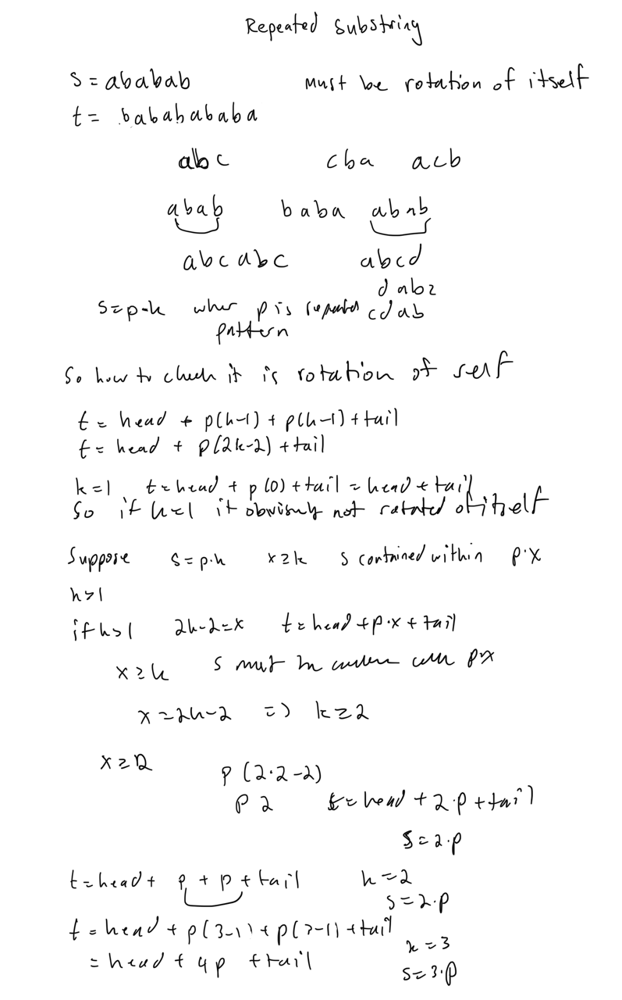

## 271. Encode and Decode Strings

### Solution 1:  Chunked Transfer Encoding + string

Stores the size of each chunk as a prefix and then there is the delimiter '#'.

```py
class Codec:
    def encode(self, strs: List[str]) -> str:
        """Encodes a list of strings to a single string.
        """
        n = len(strs)
        result = [None] * n
        for i in range(n):
            size = len(strs[i])
            result[i] = f"{size}#{strs[i]}"
        return "".join(result)

    def decode(self, s: str) -> List[str]:
        """Decodes a single string to a list of strings.
        """
        result = []
        i = 0
        while i < len(s):
            j = s.find('#', i)
            size = int(s[i:j])
            str_ = s[j + 1:j + 1 + size]
            result.append(str_)
            i = j + 1 + size
        return result
        
# Your Codec object will be instantiated and called as such:
# codec = Codec()
# codec.decode(codec.encode(strs))
```

## 920. Number of Music Playlists

### Solution 1:  dynamic programming

dp[i][j] = number of playlists of length i that have exactly j unique songs

Two transition states:
1. play song
Play a new song that has not been played before this will increase the distinct songs by one
You need to determine how many songs you can play in this instance, it is going to be the total number of songs - number of unique songs played so far + 1. For example, 
xxxx 4 unique songs played, and there are n = 10 total songs, then you can play either song 5,6,7,8,9,10, which is 10 - 4 = 6 songs
The transition state looks like dp[i - 1][j - 1] * (n - (j - 1)), because you are coming from state with j - 1 unique songs played.
2. replay song
Play a song that has been played before, this will not increase the distinct songs played
Because you can only play a replayed song after k other songs you need to consider this
if j = 5, so 5 unique songs played 
and k = 3, so you need to play 3 songs between so for instance, 1,2,3,4,5,x => you can only replay 1 and 2 so that means there are 2 songs you can replay for 5 unique songs always, 
because there must be 3 songs in window that are distinct, so j - k is the songs you can play in this scenario so multipy by that
you get dp[i - 1][j] * (j - k)

why is it multiplication? 
Because at each state you have x possible songs you can play, and so if there are 4 ways to get to thst state, you can now take those 4 ways call them x1, x2, x3, x4
and if x = 3
you can now add 1 to end of all 4 states and 2 to end of all 4 states and 3 to end of all 4 states, so that is 3 * 4 = 12, or x * num_ways
another way I think of it is take this

_ _ _ _ _
        ^
      4
so you know there are 4 ways to fill in the first 4 slots, now for the current slot you are at, if you have x choices, then you are going to add it to end of all the previous 4 ways, so you get 4 * x ways now


```py
class Solution:
    def numMusicPlaylists(self, n: int, goal: int, k: int) -> int:
        mod = int(1e9) + 7
        dp = [[0] * (n + 1) for _ in range(goal + 1)]
        dp[0][0] = 1
        for i, j in product(range(1, goal + 1), range(1, n + 1)):
            dp[i][j] = (dp[i - 1][j - 1] * (n - j + 1) + dp[i - 1][j] * max(j - k, 0)) % mod
        return dp[goal][n]
```

### Solution 2:  math + combinatorics + inclusion exclusion principle + modular inverse + fermat's little theorem + precompute factorial and inverse factorials


```py
mod = int(1e9) + 7

def mod_inverse(v):
    return pow(v, mod - 2, mod)

def factorials(n):
    fact, inv_fact = [1] * (n + 1), [0] * (n + 1)
    for i in range(2, n + 1):
        fact[i] = (fact[i - 1] * i) % mod
    inv_fact[-1] = mod_inverse(fact[-1])
    for i in reversed(range(n)):
        inv_fact[i] = (inv_fact[i + 1] * (i + 1)) % mod
    return fact, inv_fact

class Solution:
    def numMusicPlaylists(self, n: int, goal: int, k: int) -> int:
        fact, inv_fact = factorials(n)
        f = lambda x: pow(x - k, goal - k, mod) * inv_fact[n - x] * inv_fact[x - k]
        res = 0
        for i in range(k, n + 1):
            res = (res + (1 if (n - i) % 2 == 0 else -1) * f(i)) % mod
        return (res * fact[n]) % mod
```

## 1378. Replace Employee ID With The Unique Identifier

### Solution 1:  left join + merge in pandas

```py
import pandas as pd

def replace_employee_id(employees: pd.DataFrame, employee_uni: pd.DataFrame) -> pd.DataFrame:
    df = (
        employees
        .merge(employee_uni, how = 'left', on = 'id')
        .drop(columns = ['id'])
    )
    return df
```

## 81. Search in Rotated Sorted Array II

### Solution 1:  binary search + linear search when stuck

```py
class Solution:
    def search(self, nums: List[int], target: int) -> int:
        n = len(nums)
        left, right = 0, n - 1
        while left < right:
            mid = (left + right + 1) >> 1
            if nums[right] == nums[left] == nums[mid]:
                while left < right and nums[left] == nums[mid]:
                    left += 1
                left -= 1
                while left < right and nums[right] == nums[mid]:
                    right -= 1
            elif nums[right] <= nums[left] <= nums[mid]:
                if target >= nums[mid] or target <= nums[right]:
                    left = mid
                else:
                    right = mid - 1
            elif nums[mid] <= nums[right] <= nums[left]:
                if nums[mid] <= target <= nums[right]:
                    left = mid
                else:
                    right = mid - 1
            else:
                if target >= nums[mid]:
                    left = mid
                else:
                    right = mid - 1
        return nums[left] == target
```

### Solution 2: Binary search

Binary search but with two arrays you have array S and array F, both are 
non-decreasing arrays.  But normall the arrays are array S + array F, but with the 
pivot point it get's rotated and you have array F + array S

The following you just need to consider 4 cases to solve the problem

special case: This is for it you can't determine which array mid belongs in, which is the case 
when nums[mid]==nums[lo], because you don't know which array it belongs to.
case 1: if mid in F and target in F, then you just need to look at comparison of target to nums[mid]
case 2: if mid in S and target in S, then you just need to look at comparison of target to nums[mid]
case 3: if mid in F and target in S, then you need to look to right of mid
case 3: if mid in S and target in F, then you need to look to left of mid


```py
class Solution:
    def search(self, nums: List[int], target: int) -> bool:
        """
        Break it down to two arrays
        [F][S]
        """
        def can_binary_search(start_val, cur_val):
            return cur_val != start_val
        # in the F array if this is true
        def find_arr(start_val, cur_val):
            return cur_val>=start_val
        lo, hi = 0, len(nums)-1
        while lo < hi:
            mid = (lo+hi)>>1
            if nums[mid]==target: return True
            if not can_binary_search(nums[lo],nums[mid]):
                lo += 1
                continue
            target_arr = find_arr(nums[lo], target)
            mid_arr = find_arr(nums[lo], nums[mid])
            if target_arr ^ mid_arr:
                if mid_arr:
                    lo = mid+1
                else:
                    hi = mid
            else:
                if nums[mid]<target:
                    lo=mid+1
                else:
                    hi=mid
        return nums[lo] == target
```

## 2814. Minimum Time Takes to Reach Destination Without Drowning

### Solution 1:  multisource bfs + single source bfs

Need a bfs for the flood and the person, and update flood and then position of person

```py
class Solution:
    def minimumSeconds(self, land: List[List[str]]) -> int:
        start, target, empty, stone, flood = 'S', 'D', '.', 'X', '*'
        R, C = len(land), len(land[0])
        frontier, queue = deque(), deque()
        for r, c in product(range(R), range(C)):
            if land[r][c] == start: queue.append((r, c))
            elif land[r][c] == flood: frontier.append((r, c))
        in_bounds = lambda r, c: 0 <= r < R and 0 <= c < C
        neighborhood = lambda r, c: [(r - 1, c), (r + 1, c), (r, c - 1), (r, c + 1)]
        steps = 0
        while queue:
            # update the flooded cells
            for _ in range(len(frontier)):
                r, c = frontier.popleft()
                for nr, nc in neighborhood(r, c):
                    if not in_bounds(nr, nc) or land[nr][nc] not in (empty, start): continue
                    land[nr][nc] = flood
                    frontier.append((nr, nc))
            # update possible places you can be
            steps += 1
            for _ in range(len(queue)):
                r, c = queue.popleft()
                if land[r][c] == target: return steps
                for nr, nc in neighborhood(r, c):
                    if not in_bounds(nr, nc) or land[nr][nc] not in (empty, target): continue
                    if land[nr][nc] == target: return steps
                    land[nr][nc] = start
                    queue.append((nr, nc))
        return -1
```

## 215. Kth Largest Element in an Array

### Solution 1:  nlargest + heapq

```py
class Solution:
    def findKthLargest(self, nums: List[int], k: int) -> int:
        return nlargest(k, nums)[-1]
```

## 1615. Maximal Network Rank

### Solution 1:  graph theory + degrees + adjacency matrix

if there are multiple with maximum degree than only need to look through those.

```py
class Solution:
    def maximalNetworkRank(self, n: int, roads: List[List[int]]) -> int:
        degrees = [0] * n
        adj_mat = [[0] * n for _ in range(n)]
        for u, v in roads:
            adj_mat[u][v], adj_mat[v][u] = 1, 1
            degrees[u] += 1
            degrees[v] += 1
        max_deg = max(degrees)
        max_ind = [i for i in range(n) if degrees[i] == max_deg]
        if len(max_ind) == 1:
            u = max_ind[0]
            return max(degrees[u] + degrees[v] - adj_mat[u][v] for v in range(n) if v != u)
        return max(degrees[u] + degrees[v] - adj_mat[u][v] for u, v in product(max_ind, repeat = 2) if u != v)
```

## 459. Repeated Substring Pattern

### Solution 1:  modulus + divisors + prefix + time complexity $O(n\sqrt{n})$

There may be $\sqrt{n}$ divisors for n, for each one check if the repeated substring matches the entire string s. 
You can do this with modulus, so just mod by the current divisor m, and that way it will keep wrapping around and matching the prefix with the string.  But need to iterate through entire string which is where the O(n) operations come from. 

```py
class Solution:
    def repeatedSubstringPattern(self, s: str) -> bool:
        n = len(s)
        def matches(m):
            for i in range(n):
                if s[i % m] != s[i]: return False
            return True
        for i in range(1, n // 2 + 1):
            if n % i == 0 and matches(i): return True
        return False
```

### Solution 2:  string is rotation of itself + concatenation of string + boyer's moore algorithm

python uses boyer's moore algorithm to test if pattern is in string.  Which is average time complexity of O(n) so it isn't too bad.  

This uses the fact that the string will be a roration of itself if it contains a repeated substring pattern. 

You have to remove the first and last characters, cause otherwise it will match the entire string which is like a trivial case.  That is string s is trivially a substring of itself. 



```py
class Solution:
    def repeatedSubstringPattern(self, s: str) -> bool:
        n = len(s)
        t = s[1:] + s[:-1]
        return s in t
```

### Solution 3:  using Z-algorithm

The pattern you are searching for is string s within the string s + s, with first and last character removed.  So just need to encode it for the z algorithm by putting pattern # string, and it will find if the pattern is a susbstring of the string.

```py
def z_algorithm(s: str) -> list[int]:
    n = len(s)
    z = [0]*n
    left = right = 0
    for i in range(1,n):
        # BEYOND CURRENT MATCHED SEGMENT, TRY TO MATCH WITH PREFIX
        if i > right:
            left = right = i
            while right < n and s[right-left] == s[right]:
                right += 1
            z[i] = right - left
            right -= 1
        else:
            k = i - left
            # IF PREVIOUS MATCHED SEGMENT IS NOT TOUCHING BOUNDARIES OF CURRENT MATCHED SEGMENT
            if z[k] < right - i + 1:
                z[i] = z[k]
            # IF PREVIOUS MATCHED SEGMENT TOUCHES OR PASSES THE RIGHT BOUNDARY OF CURRENT MATCHED SEGMENT
            else:
                left = i
                while right < n and s[right-left] == s[right]:
                    right += 1
                z[i] = right - left
                right -= 1
    return z

class Solution:
    def repeatedSubstringPattern(self, s: str) -> bool:
        n = len(s)
        t = s + "#" + s[1:] + s[:-1]
        z_array = z_algorithm(t)
        return any(z == n for z in z_array)
```

## 723. Candy Crush

### Solution 1:  matrix loop + inplace + lowest zero pointer + bottom to top and treat columns independent for drop phase + use absolute value to detect finding crushable sets in place

```py
class Solution:
    def candyCrush(self, board: List[List[int]]) -> List[List[int]]:
        R, C = len(board), len(board[0])
        def find():
            found = False
            for r, c in product(range(R), range(C)):
                # mark horizontal
                if 0 < c < C - 1 and board[r][c] != 0 and abs(board[r][c - 1]) == abs(board[r][c]) == abs(board[r][c + 1]):
                    for i in range(c - 1, c + 2):
                        board[r][i] = -abs(board[r][i])
                    found = True
                # mark vertical
                if 0 < r < R - 1 and board[r][c] != 0 and abs(board[r - 1][c]) == abs(board[r][c]) == abs(board[r + 1][c]):
                    for i in range(r - 1, r + 2):
                        board[i][c] = -abs(board[i][c])
                    found = True
            for r, c in product(range(R), range(C)):
                if board[r][c] < 0: board[r][c] = 0 # mark as empty
            return found
        def drop():
            for c in range(C):
                lowest_zero = -1
                for r in reversed(range(R)):
                    if board[r][c] == 0:
                        lowest_zero = max(lowest_zero, r)
                    elif lowest_zero >= 0 and board[r][c] > 0:
                        board[lowest_zero][c], board[r][c] = board[r][c], board[lowest_zero][c]
                        lowest_zero -= 1
        while find():
            drop()
        return board
```

## 168. Excel Sheet Column Title

### Solution 1:  base 26 + subtract by one because all characters are shifted by one

That is A is 1, Z is 26, but I want them to be 0 and 25, so shift to the left by 1.  To make the coefficients set so that 0 represents A and 25 represent Z you need to add one to each of the coefficients, and since we are converting to base 26, we need to subtract the 1.  Cause it had the added 1 in the base 10 representation.  

$V = (c_{n} + 1) * b^{n} + ... + (c_{2} + 1) * b^{2} + (c_{1} + 1) * b^{1} + (c_{0} + 1) * b^{0}$
Do this while V > 0
1. $V = V - 1$
1. $c_{i} = V \% b$
1. $V = \lfloor \frac{V}{b} \rfloor$

```py
class Solution:
    def convertToTitle(self, n: int) -> str:
        res = []
        while n > 0:
            n -= 1
            ch = chr(n % 26 + ord("A"))
            res.append(ch)
            n //= 26
        return "".join(reversed(res))
```

## 68. Text Justification

### Solution 1:  string + greedy + left justified

```py
class Solution:
    def fullJustify(self, words: List[str], maxWidth: int) -> List[str]:
        res = []
        cur = words[0]
        num = 0
        for word in words[1:]:
            if len(word) + 1 <= maxWidth - len(cur):
                cur += " "
                cur += word
                num += 1
            else:
                if not num:
                    res.append(cur.ljust(maxWidth, " "))
                else:
                    num_spaces = maxWidth - len(cur) + num
                    each = num_spaces // num
                    extra = num_spaces % num
                    s = ""
                    for w in cur.split():
                        s += w
                        s += " " * (each + int(extra > 0))
                        extra -= 1
                    res.append(s.rstrip(" "))
                cur = word
                num = 0
        res.append(cur.ljust(maxWidth, " "))
        return res
```

## 725. Split Linked List in Parts

### Solution 1:  linked list

```py
class Solution:
    def splitListToParts(self, head: Optional[ListNode], k: int) -> List[Optional[ListNode]]:
        def size(head):
            n = 0
            while head:
                head = head.next
                n += 1
            return n
        sz = size(head)
        res = []
        while k > 0:
            cnt = math.ceil(sz / k)
            sub_head = head
            for _ in range(cnt - 1):
                head = head.next
            if head:
                head.next, head = None, head.next
            res.append(sub_head)
            sz -= cnt
            k -= 1
        return res
```

## 92. Reverse Linked List II

### Solution 1:  multiple pointers for linked list + reverse linked list

```py
class Solution:
    def reverseBetween(self, head: Optional[ListNode], left: int, right: int) -> Optional[ListNode]:
        dummy = ListNode(next = head)
        s = dummy
        for _ in range(left - 1):
            s = s.next
        left_node = s.next
        right_node = None
        s.next = None
        e = left_node
        for _ in range(right - left + 1):
            nxt = e.next
            e.next = right_node
            right_node = e
            e = nxt
        s.next, left_node.next = right_node, e
        return dummy.next
```

## 1282. Group the People Given the Group Size They Belong To

### Solution 1:  offline query + sort

```py
class Solution:
    def groupThePeople(self, groupSizes: List[int]) -> List[List[int]]:
        groups = sorted([(g, i) for i, g in enumerate(groupSizes)])
        res = [[]]
        for g, i in groups:
            res[-1].append(i)
            if len(res[-1]) == g:
                res.append([])
        return res[:-1]
```

## 358. Rearrange String k Distance Apart

### Solution 1:  max heap + queue to store up to k characters + greedy

Best to use the characters with highest frequency, once used keep a queue of characters that are currently blocked. And once the length of queue is >= k that means the character can be reused, add back into max heap.  

```py
class Solution:
    def rearrangeString(self, s: str, k: int) -> str:
        queue = deque()
        heapify(max_heap := [(-s.count(ch), ch) for ch in string.ascii_lowercase])
        res = []
        while max_heap:
            cnt, ch = heappop(max_heap)
            cnt = abs(cnt)
            if cnt == 0: continue
            cnt -= 1
            res.append(ch)
            queue.append((cnt, ch))
            if len(queue) >= k:
                cnt, ch = queue.popleft()
                heappush(max_heap, (-cnt, ch))
        return "".join(res) if len(res) == len(s) else ""
```

## 332. Reconstruct Itinerary

### Solution 1:  dfs + stack + Hierholzer's algorithm + Eulerian path + directed graph + greedy + sort

```py
class Solution:
    def findItinerary(self, tickets: List[List[str]]) -> List[str]:
        tickets.sort(key = lambda x: x[-1], reverse = True)
        adj_list = defaultdict(list)
        for u, v in tickets:
            adj_list[u].append(v)
        stack = []
        def dfs(u):
            while adj_list[u]:
                dfs(adj_list[u].pop())
            stack.append(u)
        dfs("JFK")
        return stack[::-1]
```

## 1359. Count All Valid Pickup and Delivery Options

### Solution 1:  dynamic programming + space optimized + math

fixing P_i and then letting D_i have it's possible locations

```py
class Solution:
    def countOrders(self, n: int) -> int:
        mod = int(1e9) + 7
        f = lambda x: x * (2 * x - 1)
        dp = 1
        for i in range(1, n + 1):
            dp = (dp * f(i)) % mod
        return dp
```

### Solution 2:  permutations + combinatorics + math

```py
class Solution:
    def countOrders(self, n: int) -> int:
        mod = int(1e9) + 7
        res = fact = 1
        for i in range(2, n + 1):
            res = (res * (2 * i - 1)) % mod
            fact = (fact * i)
        return (res * fact) % mod
```

### Solution 3:  probability + math

probability = favorable_outcomes / total_outcomes

total_outcomes = (2n)! => total number of permutations
probability for correct order for P_i and D_i is 1/2
probability = (1/2)^n, probability that all are in correct order
favorable_outcomes = probability * total_outcomes

```py
class Solution:
    def countOrders(self, n: int) -> int:
        mod = int(1e9) + 7
        res = 1
        for i in range(2, 2 * n + 1):
            res *= i
            if i % 2 == 0: res //= 2
            res %= mod
        return res
```

## 847. Shortest Path Visiting All Nodes

### Solution: BFS + bitmask + dynamic programming

The reason to use BFS is because we have an unweighted undirected graph, so I can imagine all weights are equal to 1.  So BFS will explore it optimally to return the shortest path.  I do need to store the (node, mask) , else it will continue visiting the same node with the same set of nodes visited in the path.  This is obviously already been computed.  So save the shortest path to reach some node aftering visitin g a set of nodes.  

TC: O(N*2^N)

```c++
int shortestPathLength(vector<vector<int>>& graph) {
    int n = graph.size();
    queue<vector<int>> q;
    int endMask = (1<<n)-1;
    vector<vector<bool>> vis(n, vector<bool>(1<<n, false));
    for (int i = 0;i<n;i++) {
        vis[i][(1<<i)]=true;
        q.push({i,(1<<i),0});
    }
    while (!q.empty()) {
        auto v = q.front();
        int i = v[0], mask = v[1], path = v[2];
        q.pop();
        if (mask==endMask) return path;
        for (int nei : graph[i]) {
            int nmask = mask|(1<<nei);
            if (vis[nei][nmask]) continue;
            vis[nei][nmask] = true;
            q.push({nei, nmask, path+1});
        }
    }
    return -1;
}
```

```py
class Solution:
    def shortestPathLength(self, graph: List[List[int]]) -> int:
        n = len(graph)
        dq = deque()
        end_mask = (1 << n) - 1
        steps = 0
        vis = [[0] * (1 << n) for _ in range(n)]
        for i in range(n):
            vis[i][1 << i] = 1
            dq.append((i, 1 << i))
        while dq:
            for _ in range(len(dq)):
                u, mask = dq.popleft()
                for v in graph[u]:
                    nmask = mask | (1 << v)
                    if nmask == end_mask: return steps + 1
                    if vis[v][nmask]: continue
                    vis[v][nmask] = 1
                    dq.append((v, nmask))
            steps += 1
        return 0
```

## 1063. Number of Valid Subarrays

### Solution 1:  monotonically increasing stack

```py
class Solution:
    def validSubarrays(self, nums: List[int]) -> int:
        stack = []
        res = 0
        for num in nums:
            while stack and stack[-1] > num:
                stack.pop()
            stack.append(num)
            res += len(stack)
        return res
```

### Solution 2:  RMQ + sparse tables + binary search

```py
class Solution:
    def validSubarrays(self, nums: List[int]) -> int:
        n = len(nums)
        lg = [0] * (n + 1)
        for i in range(2, n + 1):
            lg[i] = lg[i // 2] + 1
        LOG = 16
        st = [[math.inf] * n for _ in range(LOG)]
        st[0] = nums[:]
        for i in range(1, LOG):
            j = 0
            while (j + (1 << (i - 1))) < n:
                st[i][j] = min(st[i - 1][j], st[i - 1][j + (1 << (i - 1))])
                j += 1
        def query(left, right):
            length = right - left + 1
            i = lg[length]
            return min(st[i][left], st[i][right - (1 << i) + 1])
        res = 0
        for i in range(n):
            left, right = i, n - 1
            while left < right:
                mid = (left + right + 1) >> 1
                if query(left, mid) >= nums[i]:
                    left = mid
                else:
                    right = mid - 1
            res += left - i + 1
        return res
```

## 389. Find the Difference

### Solution 1: hashmap with array of size 26

```py
class Solution:
    def findTheDifference(self, s: str, t: str) -> str:
        cnt = [0]*26
        for ch in t:
            cnt[ord(ch)-ord('a')]+=1
        for ch in s:
            cnt[ord(ch)-ord('a')]-=1
        for i, ct in enumerate(cnt):
            if ct:
                return chr(i+ord('a'))
        return ""
```

### Solution 2: Hashmap with dictionary in python, not best space optimization

```py
class Solution:
    def findTheDifference(self, s: str, t: str) -> str:
        return list(Counter(t) - Counter(s)).pop()
```

### Solution 3: mapreduce algorithm xor with last character

```py
class Solution:
    def findTheDifference(self, s: str, t: str) -> str:
        return chr(reduce(xor, map(ord, s+t)))
```

## 880. Decoded String at Index

### Solution 1:

```py
class Solution:
    def decodeAtIndex(self, s: str, k: int) -> str:
        s += "1"
        k -= 1
        arr = re.split(r'(\d{1})', s)
        arr.pop()
        stack = []
        p = 0
        for i in range(1, len(arr), 2):
            chars = arr[i - 1]
            cnt = int(arr[i])
            p = cnt * (len(chars) + p)
            stack.append((chars, cnt))
        while stack:
            chars, cnt = stack.pop()
            p = p // cnt - len(chars)
            if p <= k:
                k %= p + len(chars)
                i = k - p
                if i >= 0:
                    return chars[i]
        return ""
```

```py
class Solution:
    def decodeAtIndex(self, s: str, k: int) -> str:
        sz = 0
        for ch in s:
            if ch.isdigit():
                sz *= int(ch)
            else:
                sz += 1
        for ch in reversed(s):
            k %= sz
            if k == 0 and ch.isalpha(): return ch
            if ch.isdigit():
                sz //= int(ch)
            else:
                sz -= 1
```


```cpp
#define ll long long
class Solution {
public:
    string decodeAtIndex(string s, ll k) {
        ll sz = 0;
        for (auto ch : s) {
            if (isdigit(ch)) sz *= (ch - '0');
            else sz++;
        }
        reverse(s.begin(), s.end());
        for (auto ch: s) {
            k %= sz;
            if (k == 0 and !isdigit(ch)) {
                string s(1, ch);
                return s;
            }
            if (isdigit(ch)) sz /= (ch - '0');
            else sz--;
        }
        return "";
    }
};
```

## 557. Reverse Words in a String III

```py
class Solution:
    def reverseWords(self, s: str) -> str:
        res = " ".join(s.split()[::-1])[::-1]
        return res
```

## 1804. Implement Trie II (Prefix Tree)

```py
class TrieNode:
    def __init__(self):
        self.children = defaultdict(TrieNode)
        self.prefix_count = self.word_count = 0

class Trie:

    def __init__(self):
        self.root = TrieNode()

    def insert(self, word: str) -> None:
        node = self.root
        for ch in word:
            node = node.children[ch]
            node.prefix_count += 1
        node.word_count += 1

    def countWordsEqualTo(self, word: str) -> int:
        node = self.root
        for ch in word:
            node = node.children[ch]
        return node.word_count

    def countWordsStartingWith(self, prefix: str) -> int:
        node = self.root
        for ch in prefix:
            node = node.children[ch]
        return node.prefix_count

    def erase(self, word: str) -> None:
        node = self.root
        for ch in word:
            node = node.children[ch]
            node.prefix_count -= 1
        node.word_count -= 1
```

## 2038. Remove Colored Pieces if Both Neighbors are the Same Color

### Solution 1:

```cpp
class Solution {
public:
    bool winnerOfGame(string colors) {
        char prev = 'C';
        int cnt = 0, mv_a = 0, mv_b = 0;
        for (char ch : colors) {
            if (ch != prev) {
                cnt = 0;
            }
            cnt++;
            if (ch == 'A' && cnt > 2) mv_a++;
            if (ch == 'B' && cnt > 2) mv_b++;
            prev = ch;
        }
        return mv_a > mv_b;
    }
};
```

## 1512. Number of Good Pairs

### Solution 1:

```cpp
class Solution {
public:
    int numIdenticalPairs(vector<int>& nums) {
        vector<int> counts(101, 0);
        int res = 0;
        for (int num : nums) {
            res += counts[num];
            counts[num]++;
        }   
        return res;
    }
};
```

## 1095. Find in Mountain Array

binary search, boolean array

```py
class Solution:
    def findInMountainArray(self, target: int, mountain_arr: 'MountainArray') -> int:
        N = mountain_arr.length()
        left, right = 1, N - 1
        while left < right:
            mid = (left + right + 1) >> 1
            if mountain_arr.get(mid) > mountain_arr.get(mid - 1):
                left = mid
            else:
                right = mid - 1
        pi = left
        # search left side
        left, right = 0, pi
        while left < right:
            mid = (left + right + 1) >> 1
            if mountain_arr.get(mid) <= target:
                left = mid
            else:
                right = mid - 1
        if mountain_arr.get(left) == target: return left
        # search right side (decreasing)
        left, right = pi, N - 1
        while left < right:
            mid = (left + right + 1) >> 1
            if mountain_arr.get(mid) >= target:
                left =  mid
            else:
                right = mid - 1
        if mountain_arr.get(left) == target: return left
        return -1
```

## 2355. Maximum Number of Books You Can Take

### Solution 1: monotonic stack, arithmetic progression, dynamic programming

```py
class Solution:
    def maximumBooks(self, books: List[int]) -> int:
        n = len(books)
        stack = []
        dp = [0] * n
        def range_sum(left, right):
            n = min(books[right], right - left + 1)
            return n * (2 * books[right] - (n - 1)) // 2
        for i in range(n):
            while stack and books[stack[-1]] - stack[-1] >= books[i] - i:
                stack.pop()
            if not stack:
                dp[i] = range_sum(0, i)
            else:
                j = stack[-1]
                dp[i] = dp[j] + range_sum(j + 1, i)
            stack.append(i)
        return max(dp)
```

## 1361. Validate Binary Tree Nodes

### Solution 1: binary tree, queue, bfs, one root note, visited array

```py
class Solution:
    def validateBinaryTreeNodes(self, n: int, leftChild: List[int], rightChild: List[int]) -> bool:
        root = None
        vis = [0] * n
        def visit(i):
            if i != -1: vis[i] = 1
        def add(i):
            if i != -1:
                if vis[i]: return False
                vis[i] = 1
                queue.append(i)
            return True
        for l, r in zip(leftChild, rightChild):
            visit(l)
            visit(r)
        for i in range(n):
            if not vis[i]:
                if root is not None: return False
                root = i
        queue = deque()
        vis = [0] * n
        if root is not None: 
            queue.append(root)
            vis[root] = 1
        while queue:
            u = queue.popleft()
            left, right = leftChild[u], rightChild[u]
            if not add(left) or not add(right): return False
        return all(v for v in vis)
```

## 1425. Constrained Subsequence Sum

### Solution 1: deque, monotonic deque, dynamic programming

```py
class Solution:
    def constrainedSubsetSum(self, nums: List[int], k: int) -> int:
        nums = [0] + nums
        queue = deque([0])
        n = len(nums)
        for i in range(1, n):
            while i - queue[0] > k:
                queue.popleft()
            nums[i] = max(nums[i], nums[queue[0]] + nums[i])
            while queue and nums[queue[-1]] <= nums[i]:
                queue.pop()
            queue.append(i)
        return max(nums[1:])
```

## 1793. Maximum Score of a Good Subarray

### Solution 1:  two pointer, prefix min, greedy

```py
class Solution:
    def maximumScore(self, nums: List[int], k: int) -> int:
        n = len(nums)
        lmin = [math.inf] * (k + 1)
        lmin[0] = nums[k]
        for i in range(1, k + 1):
            lmin[i] = min(lmin[i - 1], nums[k - i])
        rmin = [math.inf] * (n - k)
        rmin[0] = nums[k]
        for i in range(1, n - k):
            rmin[i] = min(rmin[i - 1], nums[i + k])
        res = 0
        # rmin is weakly decreasing and lmin is weakly decreasing
        left, right = k, n - k - 1
        while left >= 0 and right >= 0:
            v = min(lmin[left], rmin[right])
            res = max(res, (right + left + 1) * v)
            while left >= 0 and lmin[left] == v:
                left -= 1
            while right >= 0 and rmin[right] == v:
                right -= 1
        return res
```

## 458. Poor Pigs

### Solution 1: math, quantum bits, count number of states, information theory

Find how many rounds you have to find everything
there will be floor( minutesToTest / minutesToDie ) rounds to run experiments

Can be anywhere between 1 to 100 rounds
And there are 1,000 buckets
xxxx
  xxxx
    xxxx


in 1 round
if you have 1 bucket you can use 0 pigs
2 buckets you can use 1 pig
3 buckets you can use 2 pigs 
4 buckets 2 pigs
5 to 8 buckets with 3 pigs
9 to 16 buckets with 4 pigs
17 to 32 with 5 pigs, 2^5
10 pigs can do 513 to 1024 buckets
2^4 = 16.

so at most 10 pigs are needed okay, so just precompute the combinatorics for all 10 pig
works if it divides into by less than or equal to number of rounds, and the remainder is less than or equal to 1


2 rounds
1 bucket with 0 pigs
2 to 3 buckets with 1 pig
4 to 7 buckets with 2 pigs
8 to 15 buckets with 3 pigs
16 to 31 buckets with 4 pigs


3 rounds
1 bucket with 0 pigs
2 to 4 buckets with 1 pig
5 to 10 buckets with 2 pigs


with 2 pigs you can test 3 every round and 4 on the last round
how to calculate this though? 

calculate the number of rounds 
then calculate the possible number of combinations for each pig, and find the one that you have enough buckets for.  So you know it is

for x pigs
math.comb(x, x) + math.comb(x, x - 1) + math.comb(x, x - 2) + math.comb(x, 1)

2 rounds
2 buckets you can use 1 pig
3 buckets you can use 1 pig
4 buckets you can use 


2 pigs
xx
x x
8

base encoding problem
that is with 1 round and 3 pigs you have
000
001
010 and so on
so there are 2^3 possible configurations that would all let you know which pig died.

Suppose you have 2 rounds now you can do this
000
001
002

Because you are saying you test it in round 1 or round 2 now.  
How many configurations now there will be 3^3 possible configurations, because you still have 3 pigs, and 3 possiblities for each pig. 

so solution is just the lowest num of pigs that achieve (rounds + 1)^pigs

look into application to information theory

find x such that states^x >= buckets
x >= log_states(buckets)
x >= log(buckets) / log(states)

```py
class Solution:
    def poorPigs(self, buckets: int, minutesToDie: int, minutesToTest: int) -> int:
      rounds = minutesToTest // minutesToDie
      for i in range(11):
        if pow(rounds + 1, i) >= buckets: return i
      return 10
```

```py
class Solution:
    def poorPigs(self, buckets: int, minutesToDie: int, minutesToTest: int) -> int:
      states = minutesToTest // minutesToDie + 1
      return math.ceil(round(math.log(buckets) / math.log(states), 6))
```

## 1356. Sort Integers by The Number of 1 Bits

### Solution 1: custom sort

```py
class Solution:
    def sortByBits(self, arr: List[int]) -> List[int]:
        return sorted(arr, key = lambda x: (x.bit_count(), x))
```

## 501. Find Mode in Binary Search Tree

### Solution 1:  binary search tree, inorder traversal, depth first search

```py
class Solution:
    def findMode(self, root: Optional[TreeNode]) -> List[int]:
        max_streak = cur_streak = 0
        prev = -math.inf
        ans = []
        def dfs(node):
            nonlocal ans, prev, cur_streak, max_streak
            if not node: return
            dfs(node.left)
            if node.val != prev:
                cur_streak = 0
            prev = node.val
            cur_streak += 1
            if cur_streak > max_streak:
                ans = [node.val]
                max_streak = cur_streak
            elif cur_streak == max_streak:
                ans.append(node.val)
            dfs(node.right)
        dfs(root)
        return ans
```

## 1503. Last Moment Before All Ants Fall Out of a Plank

### Solution 1:  greedy, observation

The trick is to realize that when left and right moving ants meet, you just swap them, so the worst time is whichever ant takes longest to reach end of plank.

```py
class Solution:
    def getLastMoment(self, n: int, left: List[int], right: List[int]) -> int:
        right = [n - r for r in right]
        return max(left + right)
```

## 1535. Find the Winner of an Array Game

### Solution 1: counter, iterate

```py
class Solution:
    def getWinner(self, arr: List[int], k: int) -> int:
        n = len(arr)
        rounds = [0] * n
        j = 0
        for i in range(1, n):
            if arr[i] > arr[j]:
                j = i
            rounds[j] += 1
        for i in range(n):
            if rounds[i] >= k: return arr[i]
        return max(arr) 
```

## 1845. Seat Reservation Manager

### Solution 1: min heap

```py
class SeatManager:

    def __init__(self, n: int):
        self.seats = list(range(1, n + 1))
        heapify(self.seats)

    def reserve(self) -> int:
        return heappop(self.seats)

    def unreserve(self, seatNumber: int) -> None:
        heappush(self.seats, seatNumber)
```

## 1743. Restore the Array From Adjacent Pairs

### Solution 1:  graph, eulerian path

```py
class Solution:
    def restoreArray(self, adjacentPairs: List[List[int]]) -> List[int]:
        n = len(adjacentPairs) + 1
        adj = defaultdict(list)
        for u, v in adjacentPairs:
            adj[u].append(v)
            adj[v].append(u)
        res = []
        for k, v in adj.items():
            if len(v) == 1:
                res.append(k)
                break
        prev = None
        while len(res) < n:
            for v in adj[res[-1]]:
                if v != prev:
                    prev = res[-1]
                    res.append(v)
                    break
        return res
```

## 1759. Count Number of Homogenous Substrings

### Solution 1: greedy, math

```py
class Solution:
    def countHomogenous(self, s: str) -> int:
        n = len(s)
        mod = int(1e9) + 7
        res = delta = 0
        cur = None
        for i in range(n):
            if s[i] != cur:
                delta = 0
                cur = s[i]
            delta += 1
            res = (res + delta) % mod
        return res
```

## 573. Squirrel Simulation

### Solution 1:  manhattan distance, choosing which nut to take first, subtraction from total sum of distances

```py
class Solution:
    def minDistance(self, height: int, width: int, tree: List[int], squirrel: List[int], nuts: List[List[int]]) -> int:
        n = len(nuts)
        dist = [0] * n
        tx, ty = tree
        sx, sy = squirrel
        manhattan_dist = lambda x1, y1, x2, y2: abs(x1 - x2) + abs(y1 - y2)
        for i, (x, y) in enumerate(nuts):
            dist[i] = 2 * manhattan_dist(x, y, tx, ty)
        total = sum(dist)
        res = math.inf
        for i, (x, y) in enumerate(nuts):
            res = min(res, total - dist[i] + manhattan_dist(sx, sy, x, y) + manhattan_dist(x, y, tx, ty))
        return res
```

## 346. Moving Average from Data Stream

### Solution 1:  deque, sliding window

```py
class MovingAverage:

    def __init__(self, size: int):
        self.window = deque()
        self.size = size
        self.window_sum = 0

    def next(self, val: int) -> float:
        self.window.append(val)
        self.window_sum += val
        if len(self.window) > self.size:
            self.window_sum -= self.window.popleft()
        return self.window_sum / len(self.window)
```

## 1846. Maximum Element After Decreasing and Rearranging

### Solution 1:  sort

```py
class Solution:
    def maximumElementAfterDecrementingAndRearranging(self, arr: List[int]) -> int:
        arr.sort()
        arr[0] = 1
        n = len(arr)
        for i in range(1, n):
            arr[i] = min(arr[i - 1] + 1, arr[i])
        return arr[-1]
```

## 1980. Find Unique Binary String

### Solution 1:  bit manipulation, bitmasks

```py
class Solution:
    def findDifferentBinaryString(self, nums: List[str]) -> str:
        n = len(nums)
        nums = set(map(lambda x: int(x, 2), nums))
        for i in range(1 << n):
            if i not in nums:
                return str(bin(i)[2:]).zfill(n)
        return ""
```

## 1838. Frequency of the Most Frequent Element

### Solution 1:  sliding window, window sum

```py
class Solution:
    def maxFrequency(self, nums: List[int], k: int) -> int:
        n = len(nums)
        nums.sort()
        left = wsum = res = 0
        for right in range(n):
            wsum += nums[right]
            while (right - left + 1) * nums[right] - wsum > k:
                wsum -= nums[left]
                left += 1
            res = max(res, right - left + 1)
        return res
```

## 1887. Reduction Operations to Make the Array Elements Equal

### Solution 1:  sort, greedy, sum

```py
class Solution:
    def reductionOperations(self, nums: List[int]) -> int:
        n = len(nums)
        nums.sort(reverse = True)
        return sum(i for i in range(1, n) if nums[i] != nums[i - 1])
```

## 1424. Diagonal Traverse II

### Solution 1:  custom sort

```cpp
#define row first
#define col second
bool comp(pair<int, int>& a, pair<int, int>& b) {
    int sa = a.row + a.col, sb = b.row + b.col;
    if (sa != sb) return sa < sb;
    return a.row > b.row;
}
class Solution {
public:
    vector<int> findDiagonalOrder(vector<vector<int>>& nums) {
        vector<pair<int, int>> diag;
        for (int i = 0; i < nums.size(); i++) {
            for (int j = 0; j < nums[i].size(); j++) {
                diag.emplace_back(i, j);
            }
        }
        sort(diag.begin(), diag.end(), comp);
        vector<int> ans;
        for (auto &[r, c] : diag) {
            ans.push_back(nums[r][c]);
        }
        return ans;
    }
};
```

## 624. Maximum Distance in Arrays

### Solution 1:  prefix min and max

```py
class Solution {
public:
    int maxDistance(vector<vector<int>>& arrays) {
        int pmin = INT_MAX, pmax = -INT_MAX, res = 0;
        for (int i = 0; i < arrays.size(); i++) {
            if (i > 0) {
                for (int j = 0; j < arrays[i].size(); j++) {
                    res = max(res, abs(arrays[i][j] - pmin));
                    res = max(res, abs(arrays[i][j] - pmax));
                }
            }
            for (int j = 0; j < arrays[i].size(); j++) {
                pmin = min(pmin, arrays[i][j]);
                pmax = max(pmax, arrays[i][j]);
            }
        }
        return res;
    }
};
```

## 1561. Maximum Number of Coins You Can Get

### Solution 1:  greedy, take the second best each time, let bob take the smallest, and you can get the second to best

```py
class Solution:
    def maxCoins(self, P):
        P.sort()
        dq=deque(P)
        ans=0
        while dq:
            bob=dq.popleft()
            alice=dq.pop()
            me=dq.pop()
            ans+=me
        return ans
```

## 1685. Sum of Absolute Differences in a Sorted Array

### Solution 1: math, prefix sum, suffix sum

```cpp
class Solution {
public:
    vector<int> getSumAbsoluteDifferences(vector<int>& nums) {
        int n = nums.size();
        vector<int> ans(n, 0);
        int ssum = accumulate(nums.begin(), nums.end(), 0), psum = 0;
        int lsum, rsum;
        for (int i = 0; i < n; i++) {
            lsum = i * nums[i] - psum, rsum = ssum - (n - i) * nums[i];
            ans[i] = lsum + rsum;
            ssum -= nums[i]; psum += nums[i];
        }
        return ans;
    }
};
```

## 1727. Largest Submatrix With Rearrangements

### Solution 1:  greedy, sort

Suppose a pillar of 1s and the height of the pillar is just the number of consecutive ones above.  Now you can suppose that for each row it is a platform of which pillars can be built upon at each column.  Now you can easily update the height of the pillar given the current platform by just taking previous height at the platform above it.  then you can sort the pillar heights and use that to form the width and height given that you are able to rearrange these pillars or columns. 

```py
class Solution:
    def largestSubmatrix(self, matrix: List[List[int]]) -> int:
        R, C = len(matrix), len(matrix[0])
        for r, c in product(range(1, R), range(C)):
            if matrix[r][c] == 0: continue
            matrix[r][c] += matrix[r - 1][c]
        res = 0
        for row in matrix:
            for c, height in enumerate(sorted(row)):
                width = C - c
                res = max(res, height * width)
        return res
```

## 935. Knight Dialer

### Solution 1:  dynamic programming, hash table

Precompute all the possible moves for each number, then use dynamic programming to compute the number of ways to reach each number.  Then sum up all the ways to reach each number.
It will keep increasing as there are more and more digits.  But however many ways you can reach 4, and now you can reach 0 from 4, so add all those ways to it.  Such as dp[9] = dp[2] + dp[4]

```py
class Solution:
    def knightDialer(self, n: int) -> int:
        moves = {0: [4, 6], 7: [2, 6], 8: [1, 3], 9: [2, 4], 4: [0, 3, 9], 5: [], 6: [0, 1, 7], 1: [6, 8], 2: [7, 9], 3: [4, 8]}
        mod = int(1e9) + 7
        dp = [1] * 10
        for i in range(1, n):
            ndp = [0] * 10
            for v in range(10):
                for pv in moves[v]:
                    ndp[v] = (ndp[v] + dp[pv]) % mod
            dp = ndp
        return sum(dp) % mod
```

## 1160. Find Words That Can Be Formed by Characters

### Solution 1:  strings, counter

```cpp
class Solution {
public:
    vector<int> freq;
    bool check(string word) {
        vector<int> wfreq(26, 0);
        for (auto ch : word) {
            wfreq[ch - 'a']++;
            if (wfreq[ch - 'a'] > freq[ch - 'a']) return false;
        }
        return true;
    }
    int countCharacters(vector<string>& words, string chars) {
        freq.assign(26, 0);
        for (auto ch : chars) {
            freq[ch - 'a']++;
        }
        int res = 0;
        for (string word : words) {
            if (check(word)) res += word.size();
        }
        return res;
    }
};
```

## 1266. Minimum Time Visiting All Points

### Solution 1:  sum + max delta between x and y

```py
class Solution:
    def minTimeToVisitAllPoints(self, points: List[List[int]]) -> int:
        return sum(max(abs(points[i][0] - points[i - 1][0]), abs(points[i][1] - points[i - 1][1])) for i in range(1, len(points)))
```

## 1688. Count of Matches in Tournament

### Solution 1:  division

```cpp
class Solution {
public:
    int numberOfMatches(int n) {
        int res = 0;
        while (n > 1) {
            res += n >> 1;
            if (n & 1) n++;
            n >>= 1;
        }
        return res;
    }
};
```

## 1716. Calculate Money in Leetcode Bank

### Solution 1:  loop through, arithmetic progression, sum of a natural number sequence

```py
class Solution:
    def totalMoney(self, n: int) -> int:
        f = lambda x: x * (x + 1) // 2
        res = 0
        for i in range(0, n, 7):
            cnt = i // 7
            len_ = min(7, n - i)
            res += f(len_ + cnt) - f(cnt)
        return res
```

## 1287. Element Appearing More Than 25% In Sorted Array

### Solution 1:  sliding window, math
length of window > n / 4 => multiply both sides by 4 and solve that insted

```py
class Solution:
    def findSpecialInteger(self, arr: List[int]) -> int:
        n = len(arr)
        left = 0
        for right in range(n):
            if arr[left] != arr[right]:
                left = right
            if 4 * (right - left + 1) > n: return arr[right]
        return 0
```

## 1464. Maximum Product of Two Elements in an Array

### Solution 1:  track second biggest

```py
class Solution:
    def maxProduct(self, nums: List[int]) -> int:
        m1 = m2 = 0
        for num in nums:
            if num > m1:
                m2 = m1
                m1 = num
            elif num > m2:
                m2 = num
        return (m1 - 1) * (m2 - 1)
```

##

### Solution 1:

```py

```

##

### Solution 1:

```py

```

##

### Solution 1:

```py

```

##

### Solution 1:

```py

```

##

### Solution 1:

```py

```