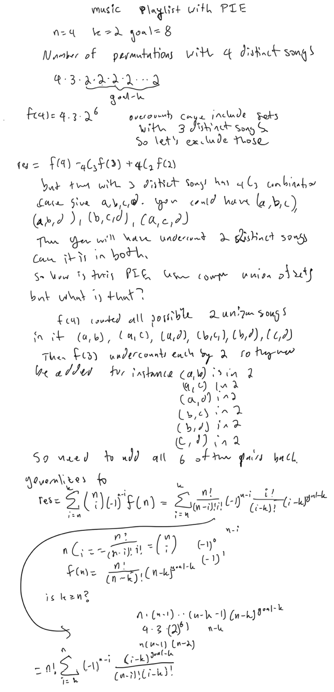

## 271. Encode and Decode Strings

### Solution 1:  Chunked Transfer Encoding + string

Stores the size of each chunk as a prefix and then there is the delimiter '#'.

```py
class Codec:
    def encode(self, strs: List[str]) -> str:
        """Encodes a list of strings to a single string.
        """
        n = len(strs)
        result = [None] * n
        for i in range(n):
            size = len(strs[i])
            result[i] = f"{size}#{strs[i]}"
        return "".join(result)

    def decode(self, s: str) -> List[str]:
        """Decodes a single string to a list of strings.
        """
        result = []
        i = 0
        while i < len(s):
            j = s.find('#', i)
            size = int(s[i:j])
            str_ = s[j + 1:j + 1 + size]
            result.append(str_)
            i = j + 1 + size
        return result
        
# Your Codec object will be instantiated and called as such:
# codec = Codec()
# codec.decode(codec.encode(strs))
```

## 920. Number of Music Playlists

### Solution 1:  dynamic programming

dp[i][j] = number of playlists of length i that have exactly j unique songs

Two transition states:
1. play song
Play a new song that has not been played before this will increase the distinct songs by one
You need to determine how many songs you can play in this instance, it is going to be the total number of songs - number of unique songs played so far + 1. For example, 
xxxx 4 unique songs played, and there are n = 10 total songs, then you can play either song 5,6,7,8,9,10, which is 10 - 4 = 6 songs
The transition state looks like dp[i - 1][j - 1] * (n - (j - 1)), because you are coming from state with j - 1 unique songs played.
2. replay song
Play a song that has been played before, this will not increase the distinct songs played
Because you can only play a replayed song after k other songs you need to consider this
if j = 5, so 5 unique songs played 
and k = 3, so you need to play 3 songs between so for instance, 1,2,3,4,5,x => you can only replay 1 and 2 so that means there are 2 songs you can replay for 5 unique songs always, 
because there must be 3 songs in window that are distinct, so j - k is the songs you can play in this scenario so multipy by that
you get dp[i - 1][j] * (j - k)

why is it multiplication? 
Because at each state you have x possible songs you can play, and so if there are 4 ways to get to thst state, you can now take those 4 ways call them x1, x2, x3, x4
and if x = 3
you can now add 1 to end of all 4 states and 2 to end of all 4 states and 3 to end of all 4 states, so that is 3 * 4 = 12, or x * num_ways
another way I think of it is take this

_ _ _ _ _
        ^
      4
so you know there are 4 ways to fill in the first 4 slots, now for the current slot you are at, if you have x choices, then you are going to add it to end of all the previous 4 ways, so you get 4 * x ways now


```py
class Solution:
    def numMusicPlaylists(self, n: int, goal: int, k: int) -> int:
        mod = int(1e9) + 7
        dp = [[0] * (n + 1) for _ in range(goal + 1)]
        dp[0][0] = 1
        for i, j in product(range(1, goal + 1), range(1, n + 1)):
            dp[i][j] = (dp[i - 1][j - 1] * (n - j + 1) + dp[i - 1][j] * max(j - k, 0)) % mod
        return dp[goal][n]
```

### Solution 2:  math + combinatorics + inclusion exclusion principle + modular inverse + fermat's little theorem + precompute factorial and inverse factorials



```py
mod = int(1e9) + 7

def mod_inverse(v):
    return pow(v, mod - 2, mod)

def factorials(n):
    fact, inv_fact = [1] * (n + 1), [0] * (n + 1)
    for i in range(2, n + 1):
        fact[i] = (fact[i - 1] * i) % mod
    inv_fact[-1] = mod_inverse(fact[-1])
    for i in reversed(range(n)):
        inv_fact[i] = (inv_fact[i + 1] * (i + 1)) % mod
    return fact, inv_fact

class Solution:
    def numMusicPlaylists(self, n: int, goal: int, k: int) -> int:
        fact, inv_fact = factorials(n)
        f = lambda x: pow(x - k, goal - k, mod) * inv_fact[n - x] * inv_fact[x - k]
        res = 0
        for i in range(k, n + 1):
            res = (res + (1 if (n - i) % 2 == 0 else -1) * f(i)) % mod
        return (res * fact[n]) % mod
```

## 1378. Replace Employee ID With The Unique Identifier

### Solution 1:  left join + merge in pandas

```py
import pandas as pd

def replace_employee_id(employees: pd.DataFrame, employee_uni: pd.DataFrame) -> pd.DataFrame:
    df = (
        employees
        .merge(employee_uni, how = 'left', on = 'id')
        .drop(columns = ['id'])
    )
    return df
```

## 81. Search in Rotated Sorted Array II

### Solution 1:  binary search + linear search when stuck

```py
class Solution:
    def search(self, nums: List[int], target: int) -> int:
        n = len(nums)
        left, right = 0, n - 1
        while left < right:
            mid = (left + right + 1) >> 1
            if nums[right] == nums[left] == nums[mid]:
                while left < right and nums[left] == nums[mid]:
                    left += 1
                left -= 1
                while left < right and nums[right] == nums[mid]:
                    right -= 1
            elif nums[right] <= nums[left] <= nums[mid]:
                if target >= nums[mid] or target <= nums[right]:
                    left = mid
                else:
                    right = mid - 1
            elif nums[mid] <= nums[right] <= nums[left]:
                if nums[mid] <= target <= nums[right]:
                    left = mid
                else:
                    right = mid - 1
            else:
                if target >= nums[mid]:
                    left = mid
                else:
                    right = mid - 1
        return nums[left] == target
```

### Solution 2: Binary search

Binary search but with two arrays you have array S and array F, both are 
non-decreasing arrays.  But normall the arrays are array S + array F, but with the 
pivot point it get's rotated and you have array F + array S

The following you just need to consider 4 cases to solve the problem

special case: This is for it you can't determine which array mid belongs in, which is the case 
when nums[mid]==nums[lo], because you don't know which array it belongs to.
case 1: if mid in F and target in F, then you just need to look at comparison of target to nums[mid]
case 2: if mid in S and target in S, then you just need to look at comparison of target to nums[mid]
case 3: if mid in F and target in S, then you need to look to right of mid
case 3: if mid in S and target in F, then you need to look to left of mid


```py
class Solution:
    def search(self, nums: List[int], target: int) -> bool:
        """
        Break it down to two arrays
        [F][S]
        """
        def can_binary_search(start_val, cur_val):
            return cur_val != start_val
        # in the F array if this is true
        def find_arr(start_val, cur_val):
            return cur_val>=start_val
        lo, hi = 0, len(nums)-1
        while lo < hi:
            mid = (lo+hi)>>1
            if nums[mid]==target: return True
            if not can_binary_search(nums[lo],nums[mid]):
                lo += 1
                continue
            target_arr = find_arr(nums[lo], target)
            mid_arr = find_arr(nums[lo], nums[mid])
            if target_arr ^ mid_arr:
                if mid_arr:
                    lo = mid+1
                else:
                    hi = mid
            else:
                if nums[mid]<target:
                    lo=mid+1
                else:
                    hi=mid
        return nums[lo] == target
```

## 2814. Minimum Time Takes to Reach Destination Without Drowning

### Solution 1:  multisource bfs + single source bfs

Need a bfs for the flood and the person, and update flood and then position of person

```py
class Solution:
    def minimumSeconds(self, land: List[List[str]]) -> int:
        start, target, empty, stone, flood = 'S', 'D', '.', 'X', '*'
        R, C = len(land), len(land[0])
        frontier, queue = deque(), deque()
        for r, c in product(range(R), range(C)):
            if land[r][c] == start: queue.append((r, c))
            elif land[r][c] == flood: frontier.append((r, c))
        in_bounds = lambda r, c: 0 <= r < R and 0 <= c < C
        neighborhood = lambda r, c: [(r - 1, c), (r + 1, c), (r, c - 1), (r, c + 1)]
        steps = 0
        while queue:
            # update the flooded cells
            for _ in range(len(frontier)):
                r, c = frontier.popleft()
                for nr, nc in neighborhood(r, c):
                    if not in_bounds(nr, nc) or land[nr][nc] not in (empty, start): continue
                    land[nr][nc] = flood
                    frontier.append((nr, nc))
            # update possible places you can be
            steps += 1
            for _ in range(len(queue)):
                r, c = queue.popleft()
                if land[r][c] == target: return steps
                for nr, nc in neighborhood(r, c):
                    if not in_bounds(nr, nc) or land[nr][nc] not in (empty, target): continue
                    if land[nr][nc] == target: return steps
                    land[nr][nc] = start
                    queue.append((nr, nc))
        return -1
```

## 215. Kth Largest Element in an Array

### Solution 1:  nlargest + heapq

```py
class Solution:
    def findKthLargest(self, nums: List[int], k: int) -> int:
        return nlargest(k, nums)[-1]
```

## 1615. Maximal Network Rank

### Solution 1:  graph theory + degrees + adjacency matrix

if there are multiple with maximum degree than only need to look through those.

```py
class Solution:
    def maximalNetworkRank(self, n: int, roads: List[List[int]]) -> int:
        degrees = [0] * n
        adj_mat = [[0] * n for _ in range(n)]
        for u, v in roads:
            adj_mat[u][v], adj_mat[v][u] = 1, 1
            degrees[u] += 1
            degrees[v] += 1
        max_deg = max(degrees)
        max_ind = [i for i in range(n) if degrees[i] == max_deg]
        if len(max_ind) == 1:
            u = max_ind[0]
            return max(degrees[u] + degrees[v] - adj_mat[u][v] for v in range(n) if v != u)
        return max(degrees[u] + degrees[v] - adj_mat[u][v] for u, v in product(max_ind, repeat = 2) if u != v)
```

## 459. Repeated Substring Pattern

### Solution 1:  modulus + divisors + prefix + time complexity $O(n\sqrt{n})$

There may be $\sqrt{n}$ divisors for n, for each one check if the repeated substring matches the entire string s. 
You can do this with modulus, so just mod by the current divisor m, and that way it will keep wrapping around and matching the prefix with the string.  But need to iterate through entire string which is where the O(n) operations come from. 

```py
class Solution:
    def repeatedSubstringPattern(self, s: str) -> bool:
        n = len(s)
        def matches(m):
            for i in range(n):
                if s[i % m] != s[i]: return False
            return True
        for i in range(1, n // 2 + 1):
            if n % i == 0 and matches(i): return True
        return False
```

### Solution 2:  string is rotation of itself + concatenation of string + boyer's moore algorithm

python uses boyer's moore algorithm to test if pattern is in string.  Which is average time complexity of O(n) so it isn't too bad.  

This uses the fact that the string will be a roration of itself if it contains a repeated substring pattern. 

You have to remove the first and last characters, cause otherwise it will match the entire string which is like a trivial case.  That is string s is trivially a substring of itself. 

```py
class Solution:
    def repeatedSubstringPattern(self, s: str) -> bool:
        n = len(s)
        t = s[1:] + s[:-1]
        return s in t
```

### Solution 3:  using Z-algorithm

The pattern you are searching for is string s within the string s + s, with first and last character removed.  So just need to encode it for the z algorithm by putting pattern # string, and it will find if the pattern is a susbstring of the string.

```py
def z_algorithm(s: str) -> list[int]:
    n = len(s)
    z = [0]*n
    left = right = 0
    for i in range(1,n):
        # BEYOND CURRENT MATCHED SEGMENT, TRY TO MATCH WITH PREFIX
        if i > right:
            left = right = i
            while right < n and s[right-left] == s[right]:
                right += 1
            z[i] = right - left
            right -= 1
        else:
            k = i - left
            # IF PREVIOUS MATCHED SEGMENT IS NOT TOUCHING BOUNDARIES OF CURRENT MATCHED SEGMENT
            if z[k] < right - i + 1:
                z[i] = z[k]
            # IF PREVIOUS MATCHED SEGMENT TOUCHES OR PASSES THE RIGHT BOUNDARY OF CURRENT MATCHED SEGMENT
            else:
                left = i
                while right < n and s[right-left] == s[right]:
                    right += 1
                z[i] = right - left
                right -= 1
    return z

class Solution:
    def repeatedSubstringPattern(self, s: str) -> bool:
        n = len(s)
        t = s + "#" + s[1:] + s[:-1]
        z_array = z_algorithm(t)
        return any(z == n for z in z_array)
```

##

### Solution 1:

```py

```

##

### Solution 1:

```py

```

##

### Solution 1:

```py

```

##

### Solution 1:

```py

```

##

### Solution 1:

```py

```

##

### Solution 1:

```py

```