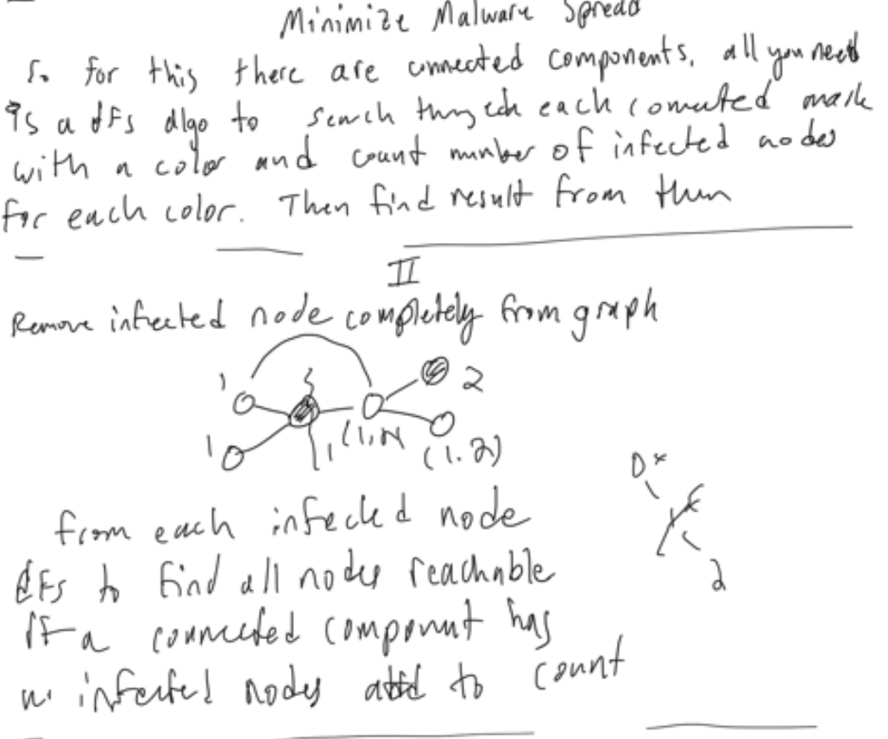
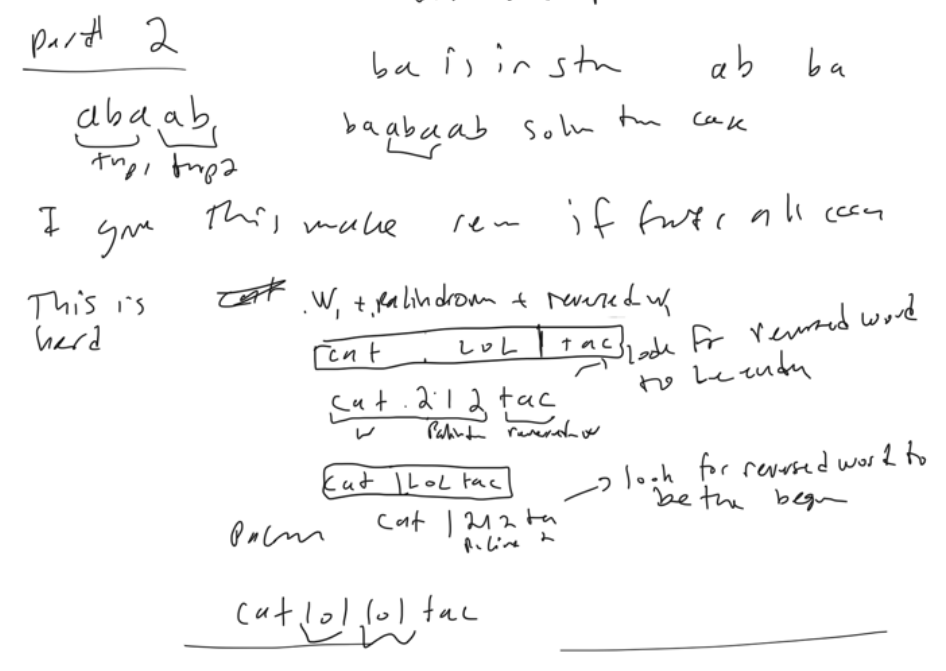
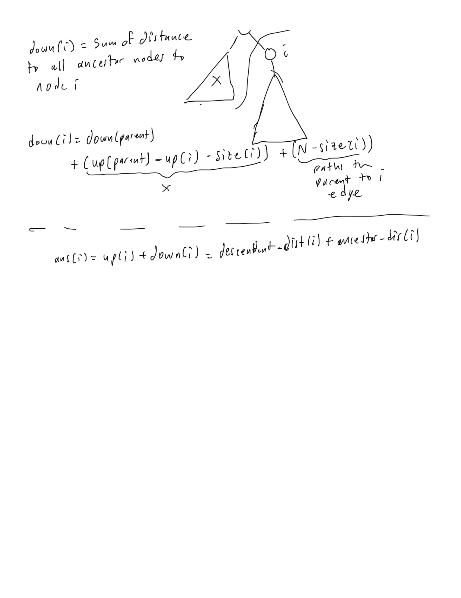
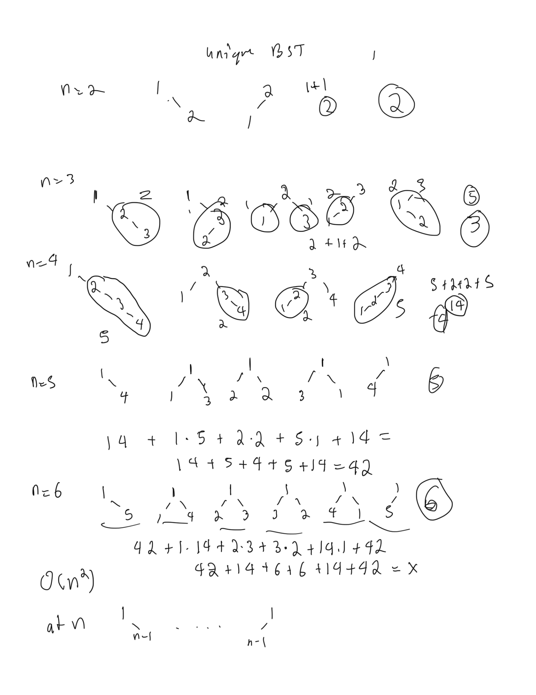
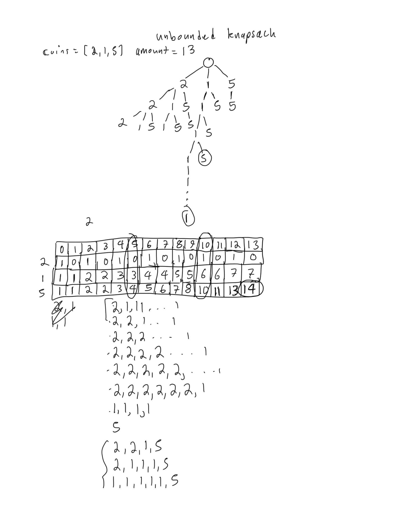
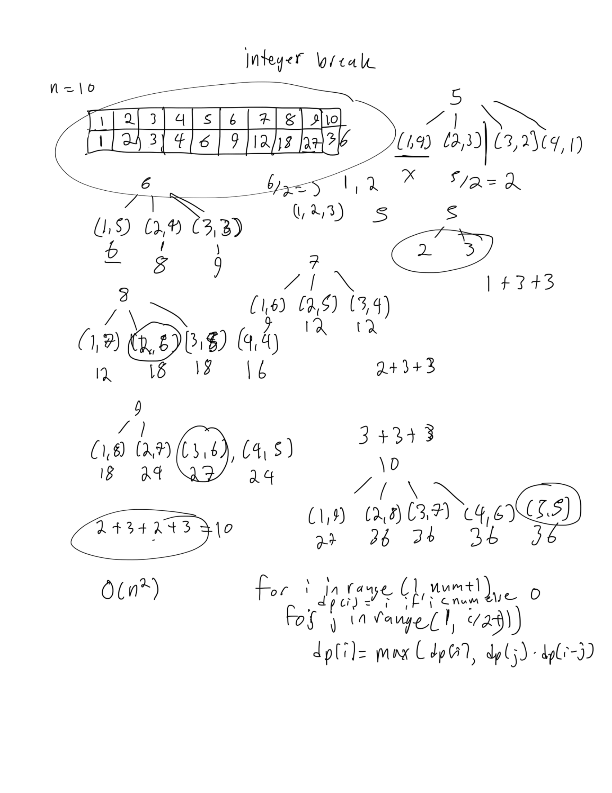

# Summary 

## 99. Recover Binary Search Tree

### Solution 1: dfs + recursion until no longer swap nodes

```py
class Solution:
    def recoverTree(self, root: Optional[TreeNode]) -> None:
        def swap_nodes(root, lo=TreeNode(-inf), hi=TreeNode(inf)):
            if not root: return False
            if root.val < lo.val:
                root.val, lo.val = lo.val, root.val
                return True
            if root.val > hi.val:
                root.val, hi.val = hi.val, root.val
                return True
            if swap_nodes(root.left, lo, root):
                return True
            if swap_nodes(root.right, root, hi):
                return True
        while swap_nodes(root):
            pass
```

### Solution 2: 

```py
class Solution:
    def recoverTree(self, root: TreeNode):
        def inorder(node):
            if node:
                yield from inorder(node.left)
                yield node.val
                yield from inorder(node.right)
        def swapped_nodes(arr):
            first = second = None
            for i in range(1,len(arr)):
                if arr[i] < arr[i-1]:
                    second = arr[i]
                    if not first:
                        first = arr[i-1]
                    
            return first, second
        def recover(node, count = 2):
            if node:
                if node.val == first or node.val == second:
                    node.val = first if node.val == second else second
                    count -= 1
                    if count == 0: return
                recover(node.left, count)
                recover(node.right, count)
        
        arr = list(inorder(root))
        first, second = swapped_nodes(arr)
        recover(root)
```

### Solution 3: Iterative inorder traversal with stack

```py
class Solution:
    def recoverTree(self, root: TreeNode):
        def inorder(node):
            stack = []
            while node or stack:
                while node:
                    stack.append(node)
                    node = node.left
                node = stack.pop()
                yield node
                node = node.right
            
        prev_node = first_node = second_node = None
        for node in inorder(root):
            if prev_node and prev_node.val > node.val:
                second_node = node
                if not first_node:
                    first_node = prev_node
            prev_node = node
        first_node.val, second_node.val = second_node.val, first_node.val
```

## 1586. Binary Search Tree Iterator II

### Solution 1: Flatten BST + recursive inorder traversal

```py
class BSTIterator:
    
    def inorder(self, root):
        if not root: return []
        return self.inorder(root.left) + [root.val] + self.inorder(root.right)

    def __init__(self, root: Optional[TreeNode]):
        self.arr = [0] + self.inorder(root)
        self.i = 0

    def hasNext(self) -> bool:
        return self.i < len(self.arr) - 1

    def next(self) -> int:
        self.i += 1
        return self.arr[self.i]

    def hasPrev(self) -> bool:
        return self.i > 1

    def prev(self) -> int:
        self.i -= 1
        return self.arr[self.i]
```

### Solution 2: iterative stack based inorder traversal

```py
class BSTIterator:

    def __init__(self, root: Optional[TreeNode]):
        self.node = root
        self.stack, self.arr = [], []
        self.pointer = -1

    def hasNext(self) -> bool:
        return self.stack or self.node or self.pointer + 1 < len(self.arr)

    def next(self) -> int:
        self.pointer += 1
        if self.pointer == len(self.arr):
            while self.node:
                self.stack.append(self.node)
                self.node = self.node.left
            self.node = self.stack.pop()
            self.arr.append(self.node.val)
            self.node = self.node.right
        return self.arr[self.pointer]

    def hasPrev(self) -> bool:
        return self.pointer > 0 

    def prev(self) -> int:
        self.pointer -= 1
        return self.arr[self.pointer]
```

## 285. Inorder Successor in BST

### Solution 1: Iterative stack based inorder traversal

```py
class Solution:
    def inorderSuccessor(self, root: TreeNode, p: TreeNode) -> Optional[TreeNode]:
        def inorder(node):
            stack = []
            while node or stack:
                while node:
                    stack.append(node)
                    node=node.left
                node = stack.pop()
                yield node
                node=node.right
        root_iter = inorder(root)
        while next(root_iter).val != p.val: pass
        try: 
            return next(root_iter)
        except:
            return None
```

## 2237. Count Positions on Street With Required Brightness

### Solution 1: counter + hash table for change in brightness

```py
class Solution:
    def meetRequirement(self, n: int, lights: List[List[int]], requirement: List[int]) -> int:
        change_brightness = [0]*n
        for pos, dist in lights:
            change_brightness[max(0,pos-dist)] += 1
            if pos+dist+1 < n:
                change_brightness[pos+dist+1] -= 1
        brightness = cnt = 0
        for req, delta in zip(requirement, change_brightness):
            brightness += delta
            cnt += (brightness >= req)
        return cnt
```

## 2238. Number of Times a Driver Was a Passenger

### Solution 1: Left Join with distinct driver_id + group by driver_id and aggregate for count of passenger_id

```sql
SELECT 
  d.driver_id, Count(r2.passenger_id) cnt
FROM 
  (SELECT DISTINCT r1.driver_id FROM rides r1) d
  LEFT JOIN rides r2 ON d.driver_id = r2.passenger_id
GROUP BY driver_id
```

## 173. Binary Search Tree Iterator

### Solution 1: iterative inorder BST traversal with stack

```py
class BSTIterator:

    def __init__(self, root: Optional[TreeNode]):
        self.node = root
        self.stack = []

    def next(self) -> int:
        while self.node:
            self.stack.append(self.node)
            self.node = self.node.left
        self.node = self.stack.pop()
        val = self.node.val
        self.node = self.node.right
        return val

    def hasNext(self) -> bool:
        return self.stack or self.node
```

## 705. Design Hashset

### Solution 1:  separate-chaining = Hashset with modulus of prime number and using buckets with linkedlist for collisions

This uses separate chaining because each bucket contains a datastructure that stores all elements that have that bucket index
from the hash function.  So if there is a hash collision it will search through the linked list to add it into that bucket.  

This is still O(n) though because to search through linked list is O(n) but delete, add are O(1)

We could use a list for the buckets and it would be O(n) for search and delete but O(1) for add

We could finally use a self-balancing binary search tree which would give O(logn) for add, search, delete

```py
class MyHashSet:

    def __init__(self):
        self.MOD = 769
        self.values = [Bucket() for _ in range(self.MOD)]
    
    def hash_(self, key: int) -> int:
        return key % self.MOD
    
    def add(self, key: int) -> None:
        i = self.hash_(key)
        self.values[i].add(key)

    def remove(self, key: int) -> None:
        i = self.hash_(key)
        self.values[i].remove(key)

    def contains(self, key: int) -> bool:
        i = self.hash_(key)
        return self.values[i].contains(key)

class Bucket:
    def __init__(self):
        self.linked_list = LinkedList()

    def add(self, value):
        self.linked_list.add(value)

    def remove(self, value):
        self.linked_list.remove(value)

    def contains(self, value):
        return self.linked_list.contains(value)

class Node:
    def __init__(self, val=0, next_node=None):
        self.val = val
        self.next = next_node
    
class LinkedList:
    def __init__(self):
        self.head = Node()
    
    def add(self, val: int) -> None:
        if self.contains(val): return
        node = self.head
        while node.next:
            node = node.next
        node.next = Node(val)
    
    def remove(self, val: int) -> None:
        node = self.head
        while node.next:
            if node.next.val == val:
                node.next = node.next.next
                break
            node=node.next
        
    def contains(self, val: int) -> None:
        node = self.head.next
        while node:
            if node.val == val: return True
            node=node.next
        return False
```

### Solution 2: Separate chaining with buckets but bucket is binary search tree

Example of a facade design pattern

```py
class MyHashSet:

    def __init__(self):
        self.MOD = 769
        self.values = [Bucket() for _ in range(self.MOD)]
    
    def hash_(self, key: int) -> int:
        return key % self.MOD
    
    def add(self, key: int) -> None:
        i = self.hash_(key)
        self.values[i].add(key)

    def remove(self, key: int) -> None:
        i = self.hash_(key)
        self.values[i].remove(key)

    def contains(self, key: int) -> bool:
        i = self.hash_(key)
        return self.values[i].contains(key)

class Bucket:
    def __init__(self):
        self.tree = BSTree()

    def add(self, value):
        self.tree.root = self.tree.insertIntoBST(self.tree.root, value)

    def remove(self, value):
        self.tree.root = self.tree.deleteNode(self.tree.root, value)

    def contains(self, value):
        return (self.tree.searchBST(self.tree.root, value) is not None)

class TreeNode:
    def __init__(self, value):
        self.val = value
        self.left = None
        self.right = None

class BSTree:
    def __init__(self):
        self.root = None

    def searchBST(self, root: TreeNode, val: int) -> TreeNode:
        if root is None or val == root.val:
            return root

        return self.searchBST(root.left, val) if val < root.val \
            else self.searchBST(root.right, val)

    def insertIntoBST(self, root: TreeNode, val: int) -> TreeNode:
        if not root:
            return TreeNode(val)

        if val > root.val:
            # insert into the right subtree
            root.right = self.insertIntoBST(root.right, val)
        elif val == root.val:
            return root
        else:
            # insert into the left subtree
            root.left = self.insertIntoBST(root.left, val)
        return root

    def successor(self, root):
        """
        One step right and then always left
        """
        root = root.right
        while root.left:
            root = root.left
        return root.val

    def predecessor(self, root):
        """
        One step left and then always right
        """
        root = root.left
        while root.right:
            root = root.right
        return root.val

    def deleteNode(self, root: TreeNode, key: int) -> TreeNode:
        if not root:
            return None

        # delete from the right subtree
        if key > root.val:
            root.right = self.deleteNode(root.right, key)
        # delete from the left subtree
        elif key < root.val:
            root.left = self.deleteNode(root.left, key)
        # delete the current node
        else:
            # the node is a leaf
            if not (root.left or root.right):
                root = None
            # the node is not a leaf and has a right child
            elif root.right:
                root.val = self.successor(root)
                root.right = self.deleteNode(root.right, root.val)
            # the node is not a leaf, has no right child, and has a left child
            else:
                root.val = self.predecessor(root)
                root.left = self.deleteNode(root.left, root.val)

        return root
```

## 706. Design HashMap

### Solution 1: 

```py
class MyHashMap:

    def __init__(self):
        self.MOD = 2069
        self.buckets = [Bucket() for _ in range(self.MOD)]
        
    def hash_(self, key: int) -> int:
        return key % self.MOD

    def put(self, key: int, value: int) -> None:
        bucket_index = self.hash_(key)
        self.buckets[bucket_index].add(key, value)

    def get(self, key: int) -> int:
        bucket_index = self.hash_(key)
        return self.buckets[bucket_index].search(key)

    def remove(self, key: int) -> None:
        bucket_index = self.hash_(key)
        self.buckets[bucket_index].remove(key)
        
class Node:
    def __init__(self, key=0, val=0,next_node=None):
        self.key = key
        self.val = val
        self.next = next_node
        
class Bucket:
    def __init__(self):
        self.head = Node()
        
    def search(self, key: int) -> int:
        node = self.head.next
        while node:
            if node.key == key: return node.val
            node=node.next
        return -1
    
    def add(self, key: int, val: int) -> None:
        node = self.head
        while node.next:
            if node.next.key == key: 
                node.next.val = val
                return
            node=node.next
        node.next = Node(key,val)
    
    def remove(self, key: int) -> None:
        node = self.head
        while node.next:
            if node.next.key == key:
                node.next = node.next.next
                return
            node=node.next
```

## 687. Longest Univalue Path

### Solution 1: Recursion + postorder dfs binary tree traversal

```py
class Solution:
    def longestUnivaluePath(self, root: Optional[TreeNode]) -> int:
        self.longest_path = 0
        def dfs(node):
            if not node: return 0
            left_len, right_len = dfs(node.left), dfs(node.right)
            left_arrow = right_arrow = 0
            if node.left and node.val==node.left.val:
                left_arrow = left_len + 1
            if node.right and node.val==node.right.val:
                right_arrow = right_len + 1
            self.longest_path = max(self.longest_path, left_arrow + right_arrow)
            return max(left_arrow, right_arrow)
                
        dfs(root)
        return self.longest_path
```

## 535. Encode and Decode TinyURL

### Solution 1: counter + hash table

The problems with this solution is that integer will get very large over time and the tinyurl will be no longy short. 
And in other languages it will overflow, python it won't overflow so that is fine. But there will be performance degredation potentially

```py
class Codec:
    def __init__(self):
        self.cnt = 0
        self.map = {}
    def encode(self, longUrl: str) -> str:
        """Encodes a URL to a shortened URL.
        """
        self.map[self.cnt] = longUrl
        shortUrl = 'http://tinyurl.com/' + str(self.cnt)
        self.cnt += 1
        return shortUrl
    def decode(self, shortUrl: str) -> str:
        """Decodes a shortened URL to its original URL.
        """
        return self.map[int(shortUrl.replace('http://tinyurl.com/', ''))]
```

### Solution 2: variable length encoding

The next level is to use more than just integers to fix the overflow and the fact the short url becomes long quickly

we can use 62 characters if we take integers + alphabet

```py
    def __init__(self):
        self.chars = string.ascii_letters + string.digits
        self.cnt = 0
        self.map = {}
    def encode(self, longUrl: str) -> str:
        """Encodes a URL to a shortened URL.
        """
        count = self.cnt
        encoding = []
        while count > 0:
            encoding.append(self.chars[count%62])
            count //= 62
        encoding_str = "".join(encoding)
        shortUrl = f'http://tinyurl.com/{encoding_str}'
        self.map[encoding_str] = longUrl
        return shortUrl
    def decode(self, shortUrl: str) -> str:
        """Decodes a shortened URL to its original URL.
        """
        return self.map[shortUrl.replace('http://tinyurl.com/', '')]
```

### Solution 3: python inbuilt hash function

```py
class Codec:
    def __init__(self):
        self.map = {}
    def encode(self, longUrl: str) -> str:
        """Encodes a URL to a shortened URL.
        """
        hash_ = hash(longUrl)
        self.map[hash_] = longUrl
        return f'http://tinyurl.com/{hash_}'
    def decode(self, shortUrl: str) -> str:
        """Decodes a shortened URL to its original URL.
        """
        return self.map[int(shortUrl.replace('http://tinyurl.com/', ''))]
```

### Solution 4: random fixed length encoding

62 characters with 6 as fixed size is 62^6

```py

```

## 1396. Design Underground System

### Solution 1: Multiple hash tables 

```py
class UndergroundSystem:

    def __init__(self):
        self.trip_times = Counter()
        self.trip_counts = Counter()
        self.checkedin = {}

    def checkIn(self, id: int, stationName: str, t: int) -> None:
        self.checkedin[id] = (stationName, t)

    def checkOut(self, id: int, stationName: str, t: int) -> None:
        startStation, t1 = self.checkedin[id]
        self.trip_counts[(startStation, stationName)] += 1
        self.trip_times[(startStation, stationName)] += (t-t1)

    def getAverageTime(self, startStation: str, endStation: str) -> float:
        return self.trip_times[(startStation, endStation)] / self.trip_counts[(startStation, endStation)]
```

## 284. Peeking Iterator

### Solution 1: iterator that stores next value for peek, and uses boolean for end so it works with any data type

```py
# Below is the interface for Iterator, which is already defined for you.
#
# class Iterator:
#     def __init__(self, nums):
#         """
#         Initializes an iterator object to the beginning of a list.
#         :type nums: List[int]
#         """
#
#     def hasNext(self):
#         """
#         Returns true if the iteration has more elements.
#         :rtype: bool
#         """
#
#     def next(self):
#         """
#         Returns the next element in the iteration.
#         :rtype: int
#         """

class PeekingIterator:
    def __init__(self, iterator):
        """
        Initialize your data structure here.
        :type iterator: Iterator
        """
        self.iterator = iterator
        self.next_data = self.iterator.next()
        self.not_end = True

    def peek(self):
        """
        Returns the next element in the iteration without advancing the iterator.
        :rtype: int
        """
        if not self.hasNext():
            raise StopIteration
        return self.next_data

    def next(self):
        """
        :rtype: int
        """
        if not self.hasNext():
            raise StopIteration
        data = self.next_data
        self.not_end = False
        if self.iterator.hasNext():
            self.next_data = self.iterator.next()
            self.not_end = True
        return data

    def hasNext(self):
        """
        :rtype: bool
        """
        return self.not_end

# Your PeekingIterator object will be instantiated and called as such:
# iter = PeekingIterator(Iterator(nums))
# while iter.hasNext():
#     val = iter.peek()   # Get the next element but not advance the iterator.
#     iter.next()         # Should return the same value as [val].
```

## 1166. Design File System

### Solution 1: hash table + hash table for tree

```py
class FileSystem:

    def __init__(self):
        self.paths = {}

    def createPath(self, path: str, value: int) -> bool:
        if path in self.paths: return False
        parent = path[:path.rfind('/')]
        if len(parent) > 1 and parent not in self.paths: return False
        self.paths[path] = value
        return True

    def get(self, path: str) -> int:
        return self.paths[path] if path in self.paths else -1
```

### Solution 2: Trie datastructure

```py
class TrieNode:
    def __init__(self, name):
        self.children = defaultdict(TrieNode)
        self.name = name
        self.value = -1
class FileSystem:

    def __init__(self):
        self.root = TrieNode('')

    def createPath(self, path: str, value: int) -> bool:
        components = path.split('/')
        node = self.root
        for i in range(1,len(components)):
            name = components[i]
            if name not in node.children:
                if i==len(components)-1:
                    node.children[name] = TrieNode(name)
                else: 
                    return False
            node=node.children[name]
        if node.value != -1: return False
        node.value = value
        return True

    def get(self, path: str) -> int:
        components = path.split('/')
        node = self.root
        for i in range(1,len(components)):
            name = components[i]
            if name not in node.children: return -1
            node=node.children[name]
        return node.value
```

## 1584. Min Cost to Connect All Points

### Solution 1: Kruskal's Algorithm to find Minimimum Spanning Tree + UnionFind + sort

```py
class UnionFind:
    def __init__(self,n):
        self.size = [1]*n
        self.parent = list(range(n))
    
    def find(self,i):
        if i==self.parent[i]:
            return i
        self.parent[i] = self.find(self.parent[i])
        return self.parent[i]

    def union(self,i,j):
        i, j = self.find(i), self.find(j)
        if i!=j:
            if self.size[i] < self.size[j]:
                i,j=j,i
            self.parent[j] = i
            self.size[i] += self.size[j]
            return True
        return False
class Solution:
    def minCostConnectPoints(self, points: List[List[int]]) -> int:
        n = len(points)
        edges = []
        manhattan = lambda p1, p2: abs(p1[0]-p2[0])+abs(p1[1]-p2[1])
        for i in range(n):
            for j in range(i+1,n):
                edges.append((manhattan(points[i], points[j]), i, j))
        edges.sort()
        dsu = UnionFind(n)
        minCost = 0
        for cost, u, v in edges:
            if dsu.union(u,v):
                minCost += cost
            if dsu.size[u] == n: break
        return minCost
```

### Solution 2: Union find + min heap datastructure + minimum spanning Tree (MST)

```py
class UnionFind:
    def __init__(self,n):
        self.size = [1]*n
        self.parent = list(range(n))
    
    def find(self,i):
        if i==self.parent[i]:
            return i
        self.parent[i] = self.find(self.parent[i])
        return self.parent[i]

    def union(self,i,j):
        i, j = self.find(i), self.find(j)
        if i!=j:
            if self.size[i] < self.size[j]:
                i,j=j,i
            self.parent[j] = i
            self.size[i] += self.size[j]
            return True
        return False
class Solution:
    def minCostConnectPoints(self, points: List[List[int]]) -> int:
        n = len(points)
        manhattan_distance = lambda p1, p2: abs(p2[0]-p1[0]) + abs(p2[1]-p1[1])
        minheap = []
        for (i, p1), (j, p2) in product(enumerate(points), repeat = 2):
            if i == j: continue
            heappush(minheap, (manhattan_distance(p1,p2), i, j))
        dsu = UnionFind(n)
        mincost = 0
        while dsu.size[dsu.find(0)] < n:
            cost, i, j = heappop(minheap)
            if dsu.union(i,j):
                mincost += cost
        return mincost
        
```

## 1202. Smallest String With Swaps

### Solution 1: Union find + minheap for each connected component

```py
class UnionFind:
    pass
class Solution:
    def smallestStringWithSwaps(self, s: str, pairs: List[List[int]]) -> str:
        n = len(s)
        dsu = UnionFind(n)
        for u, v in pairs:
            dsu.union(u,v)
        connected_components = defaultdict(list)
        for i in range(n):
            heappush(connected_components[dsu.find(i)], s[i])
        swapped = []
        for i in range(n):
            swapped.append(heappop(connected_components[dsu.find(i)]))
        return "".join(swapped)
```

### Solution 1: dfs + sorting

```py
class Solution:
    def smallestStringWithSwaps(self, s: str, pairs: List[List[int]]) -> str:
        def dfs(u):
            component.append(u)
            for v in graph[u]:
                if visited[v]: continue
                visited[v] = 1
                dfs(v)
        n = len(s)
        graph = defaultdict(list)
        for u, v in pairs:
            graph[u].append(v)
            graph[v].append(u)
        visited = [0]*n
        result = list(s)
        for i in range(n):
            if visited[i]: continue
            component = []
            visited[i] = 1
            dfs(i)
            component.sort()
            chars = [s[j] for j in component]
            chars.sort()
            for j, k in enumerate(component):
                result[k] = chars[j]
        return "".join(result)
```

## 1631. Path With Minimum Effort

### Solution 1: min heap datastructure + memoize cheapest cost to that cell (similar to dijkstra algorithm)

```py
class Solution:
    def minimumEffortPath(self, heights: List[List[int]]) -> int:
        R, C = len(heights), len(heights[0])
        heap = [(0, 0, 0)] # (cost, row, column)
        diff_matrix = [[inf]*C for _ in range(R)]
        in_boundary = lambda r, c: 0<=r<R and 0<=c<C
        while heap:
            cost, row, col = heappop(heap)
            if row==R-1 and col==C-1:
                return cost
            for r, c in map(lambda x: (row+x[0], col+x[1]), [(1,0),(-1,0),(0,1),(0,-1)]):
                if not in_boundary(r,c): continue
                ncost = max(abs(heights[r][c]-heights[row][col]), cost)
                if ncost < diff_matrix[r][c]:
                    heappush(heap, (ncost, r, c))
                    diff_matrix[r][c] = ncost
        return -1
```

### Solution 2: Binary search + BFS

```py
class Solution:
    def minimumEffortPath(self, heights: List[List[int]]) -> int:
        left, right = 0, max((max(height) for height in heights))-min((min(height) for height in heights))
        R, C = len(heights), len(heights[0])
        def bfs(threshold):
            queue = deque([(0, 0)]) # (row, col)
            visited = set()
            in_boundary = lambda r, c: 0<=r<R and 0<=c<C
            while queue:
                row, col = queue.popleft()
                if row==R-1 and col==C-1:
                    return True
                for nr, nc in map(lambda x: (row+x[0], col+x[1]), [(1,0),(-1,0),(0,1),(0,-1)]):
                    if not in_boundary(nr,nc): continue
                    if (nr,nc) in visited or abs(heights[row][col]-heights[nr][nc]) > threshold: continue
                    visited.add((nr,nc))
                    queue.append((nr,nc))
            return False
        while left < right:
            mid = (left+right)>>1
            if not bfs(mid):
                left = mid+1
            else:
                right = mid
        return left
```

### Solution 3: binary search + dfs

Turns out to be much faster than using bfs too. 

```py
class Solution:
    def minimumEffortPath(self, heights: List[List[int]]) -> int:
        left, right = 0, max((max(height) for height in heights))-min((min(height) for height in heights))
        R, C = len(heights), len(heights[0])
        def dfs(row, col, threshold):
            if row==R-1 and col==C-1: return True
            visited[row][col] = 1
            for nr, nc in map(lambda x: (row+x[0], col+x[1]), [(1,0),(-1,0),(0,1),(0,-1)]):
                if not (0<=nr<R and 0<=nc<C): continue
                if visited[nr][nc] or abs(heights[row][col]-heights[nr][nc]) > threshold: continue
                visited[nr][nc] = 1
                if dfs(nr,nc,threshold): return True
            return False
        while left < right:
            mid = (left+right)>>1
            visited = [[0]*C for _ in range(R)]
            if not dfs(0,0,mid):
                left = mid+1
            else:
                right = mid
        return left
```

### Solution 4: Union Find + it contains the first and last cell in path

```py
class UnionFind:
    pass
class Solution:
    def minimumEffortPath(self, heights: List[List[int]]) -> int:
        R, C = len(heights), len(heights[0])
        dsu = UnionFind(R*C)
        edges = []
        in_boundary = lambda r, c: 0<=r<R and 0<=c<C
        for r, c in product(range(R), range(C)):
            for nr, nc in map(lambda x: (r+x[0],c+x[1]), [(1,0),(-1,0),(0,1),(0,-1)]):
                if not in_boundary(nr,nc): continue
                cost = abs(heights[r][c]-heights[nr][nc])
                node1, node2 = r*C+c, nr*C+nc
                edges.append((cost, node1, node2))
        edges.sort()
        for cost, u, v in edges:
            dsu.union(u,v)
            if dsu.find(0) == dsu.find(R*C-1):
                return cost
        return 0 # single node 
```


## 399. Evaluate Division

### Solution 1: Union Find to check if evaluate division will work + bfs

This is rather brute force, not really saving values, and just recomputing bfs many times. 

```py
class UnionFind:
    pass
class Solution:
    def calcEquation(self, equations: List[List[str]], values: List[float], queries: List[List[str]]) -> List[float]:
        graph = defaultdict(list)
        compressed = {}
        for i, (a, b) in enumerate(equations):
            if a not in compressed:
                compressed[a] = len(compressed)
            if b not in compressed:
                compressed[b] = len(compressed)
            u, v = compressed[a], compressed[b]
            graph[u].append((v, values[i]))
            graph[v].append((u, 1.0/values[i]))
        n=len(compressed)
        dsu = UnionFind(n)
        for a, b in equations:
            dsu.union(compressed[a], compressed[b])
        def bfs(u, v):
            queue = deque([(u, 1.0)])
            visited = set()
            visited.add(u)
            while queue:
                node, val = queue.popleft()
                if node == v: return val
                for nei, weight in graph[node]:
                    if nei in visited: continue
                    queue.append((nei, val*weight))
                    visited.add(nei)
            return -1.0
        answer = [-1.0]*len(queries)
        for i, (a, b) in enumerate(queries):
            if a not in compressed or b not in compressed: continue
            u, v = compressed[a], compressed[b]
            if dsu.find(u) != dsu.find(v): continue
            answer[i] = bfs(u, v)
        return answer
            
```

### Solution 2: Brute Force DFS

```py
class Solution:
    def calcEquation(self, equations: List[List[str]], values: List[float], queries: List[List[str]]) -> List[float]:
        graph = defaultdict(defaultdict)
        for (dividend, divisor), val in zip(equations, values):
            graph[dividend][divisor] = val
            graph[divisor][dividend] = 1/val
        def dfs(current_node, target_node):
            if current_node == target_node: return 1.0
            prod = inf
            for nei in graph[current_node]:
                if nei in visited: continue
                visited.add(nei)
                prod = (graph[current_node][nei]*dfs(nei, target_node))
                if prod != inf: return prod
            return prod 
        answer = [-1.0]*len(queries)
        for i, (a, b) in enumerate(queries):
            if a not in graph or b not in graph: continue
            visited = set()
            res = dfs(a,b)
            answer[i] = res if res != inf else -1.0
        return answer
```

### Solution 3: Floyd Warshall Algorithm

works because we have small number of vertices, the algorithm takes O(V^3) time complexity, 
very good for dense graphs that have many edges.  

think k internal nodes, 

```py
class Solution:
    def calcEquation(self, equations, values, queries):
        graph = defaultdict(dict)
        # INITIALIZE THE VALUES FOR EDGES AND ITSELF
        for (a, b), val in zip(equations, values):
            graph[a][b] = val
            graph[b][a] = 1.0/val
            graph[a][a] = 1.0
            graph[b][b] = 1.0
        # (i,j) => (i,k) + (k,j), k is internal node
        for k, i, j in permutations(graph, 3):
            if k in graph[i] and j in graph[k]:
                graph[i][j] = graph[i][k]*graph[k][j]
        return [graph[i][j] if j in graph[i] else -1.0 for i,j in queries]
```


```py
class Solution:
    def calcEquation(self, equations, values, queries):
        graph = defaultdict(dict)
        # INITIALIZE THE VALUES FOR EDGES AND ITSELF
        for (a, b), val in zip(equations, values):
            graph[a][b] = val
            graph[b][a] = 1.0/val
            graph[a][a] = 1.0
            graph[b][b] = 1.0
        n = len(graph)
        # (i,j) => (i,k) + (k,j), k is internal node
        for k in graph.keys():
            for i in graph.keys():
                if k not in graph[i]: continue
                for j in graph.keys():
                    if j not in graph[k]: continue
                    graph[i][j] = graph[i][k]*graph[k][j]
        return [graph[i][j] if j in graph[i] else -1.0 for i,j in queries]
```

### Solution 4: Union Find with Weighted Edges

```py

```

## 431. Encode N-ary Tree to Binary Tree

### Solution 1: BFS type algorithm 

The strategy is that for a given nary tree, for the first child we add it as a left node in the binary tree
Then from that binary tree we add each additional child node as a right node from each binary node. 


```py
class Codec:
    # Encodes an n-ary tree to a binary tree.
    def encode(self, root: 'Optional[Node]') -> Optional[TreeNode]:
        if not root: return None
        binary_root = TreeNode(root.val)
        queue = deque([(root, binary_root)])
        while queue:
            nary_node, binary_node = queue.popleft()
            current_node = binary_node # current binary node
            for child in nary_node.children:
                if not binary_node.left:
                    current_node.left = TreeNode(child.val)
                    current_node=current_node.left
                else:
                    current_node.right = TreeNode(child.val)
                    current_node=current_node.right
                queue.append((child, current_node))
        return binary_root
	
	# Decodes your binary tree to an n-ary tree.
    def decode(self, data: Optional[TreeNode]) -> 'Optional[Node]':
        if not data: return None
        queue = deque([(data, None)])
        while queue:
            binary_node, nary_node = queue.popleft()
            # nary node is going to be the parent for the current nary node
            current_node = Node(binary_node.val, []) # current nary node
            if not nary_node:
                root = current_node
            else:
                nary_node.children.append(current_node)
            if binary_node.left:
                queue.append((binary_node.left, current_node))
            if binary_node.right:
                queue.append((binary_node.right, nary_node))
        return root
```

### Solution 2: Alternative BFS

```py
class Codec:
    # Encodes an n-ary tree to a binary tree.
    def encode(self, root: 'Optional[Node]') -> Optional[TreeNode]:
        if not root: return None
        binary_root = TreeNode(root.val)
        queue = deque([(root, binary_root)])
        while queue:
            nary_node, binary_node = queue.popleft()
            current_node = binary_node # current binary node
            for child in nary_node.children:
                if not binary_node.left:
                    current_node.left = TreeNode(child.val)
                    current_node=current_node.left
                else:
                    current_node.right = TreeNode(child.val)
                    current_node=current_node.right
                queue.append((child, current_node))
        return binary_root
	
	# Decodes your binary tree to an n-ary tree.
    def decode(self, data: Optional[TreeNode]) -> 'Optional[Node]':
        if not data: return None
        root = Node(data.val, [])
        queue = deque([(data, root)])
        while queue:
            binary_node, nary_node = queue.popleft()
            # nary node is going to be the parent for the current nary node
            sibling = binary_node.left
            while sibling:
                current_node = Node(sibling.val, []) # current nary node
                nary_node.children.append(current_node)
                queue.append((sibling, current_node))
                sibling = sibling.right
        return root
```

### Solution 3: DFS with Recursion

```py
class Codec:
    # Encodes an n-ary tree to a binary tree.
    def encode(self, root: 'Optional[Node]') -> Optional[TreeNode]:
        if not root: return None
        binary_root = TreeNode(root.val)
        if not root.children: return binary_root
        binary_root.left = self.encode(root.children[0])
        current_node = binary_root.left
        for i in range(1,len(root.children)):
            current_node.right = self.encode(root.children[i])
            current_node = current_node.right
        return binary_root
	
	# Decodes your binary tree to an n-ary tree.
    def decode(self, data: Optional[TreeNode]) -> 'Optional[Node]':
        if not data: return None
        root = Node(data.val, [])
        sibling_node = data.left
        while sibling_node:
            root.children.append(self.decode(sibling_node))
            sibling_node = sibling_node.right
        return root
```

## 785. Is Graph Bipartite?

### Solution 1: dfs with 2 coloring algorithm 

```py
class Solution:
    def isBipartite(self, graph: List[List[int]]) -> bool:
        n=len(graph)
        colors = {}
        def dfs(node):
            if node not in colors: 
                colors[node] = 0
            for nei in graph[node]:
                if nei in colors and node in colors and colors[nei]==colors[node]: return False
                if nei in colors and node in colors: continue
                colors[nei] = colors[node]^1
                if not dfs(nei): return False
            return True
        
        for i in range(n):
            if not dfs(i): return False
        return True
```

### Solution 2: BFS with 2 coloring algorithm 

```py
class Solution:
    def isBipartite(self, graph: List[List[int]]) -> bool:
        n=len(graph)
        colors = {}
        def bfs(node):
            queue = deque([node])
            colors[node] = 0
            while queue:
                node = queue.popleft()
                for nei in graph[node]:
                    if node in colors and nei in colors:
                        if colors[node]==colors[nei]: return False
                        continue
                    colors[nei] = colors[node]^1
                    queue.append(nei)
            return True
        for i in range(n):
            if i in colors: continue
            if not bfs(i): return False
        return True
```

### Solution 3: Union Find

idea is that a node and all of it's neighbors should be in two disjoint sets.  If you ever catch
a node being in the same disjoint set as one of it's neighbor it is not a bipartite graph

```py
class UnionFind:
    pass
class Solution:
    def isBipartite(self, graph: List[List[int]]) -> bool:
        n=len(graph)
        dsu = UnionFind(n)
        for i in range(n):
            for j in graph[i]:
                if dsu.find(i) == dsu.find(j): return False
                dsu.union(graph[i][0], j)
        return True
```

## 905. Sort Array By Parity

### Solution 1: sorting by parity

```py
class Solution:
    def sortArrayByParity(self, nums: List[int]) -> List[int]:
        return sorted(nums, key=lambda x: x%2)
```

### Solution 2: two pointers

```py
class Solution:
    def sortArrayByParity(self, nums: List[int]) -> List[int]:
        n=len(nums)
        i, j = 0, n-1
        while i < j:
            if nums[i]%2==0:
                i += 1
            else:
                nums[i], nums[j] = nums[j], nums[i]
                j -= 1
        return nums
```

## 581. Shortest Unsorted Continuous Subarray

### Solution 1: Prefix Max + Suffix Min + two pointers + 3 loops + extra space

suppose it is sorted
nums = [2,4,6,6,6,6,8,9,10,15]
prefixMax = [-f,02,04,06,06,08,09,10,15]
suffixMin = [02,04,06,06,08,09,10,15,+f]
since prefixMax[i]==suffixMin[i-1] we know we can keep moving and it is sorted
the reason is that prefix max says the largest element I've seen at say index = 0, 
and so we ask the question what is the smallest element I've seen at index = 0, if they are the same
that would indicate that it is bost the max in the prefix and the min in the suffix, thus it is
the largest element so far, while also being the samllest from the suffix, so that means it belongs
at the prefix, and as they keep equal we are good, cause that means it is sorted according to this prefix max and suffix min
it doesn't mean it is the largest too, just that it is the equal to the largest or is the largest
and it doesn't mean it is the smallest, just that it is equal to the smallest or is the smallest. 
then again we know we can do the same from the right side, cause if suffixmin equals prefix max that means we can move it to left, cause that means it is th elargest element so far. 

```py
class Solution:
    def findUnsortedSubarray(self, nums: List[int]) -> int:
        n=len(nums)
        left, right = 1, n
        prefixMax, suffixMin = [-inf]*(n+1), [inf]*(n+1)
        for i in range(n):
            prefixMax[i+1] = max(prefixMax[i], nums[i])
        for i in range(n)[::-1]:
            suffixMin[i] = min(suffixMin[i+1], nums[i])
        while left <= right:
            if prefixMax[left]==suffixMin[left-1]:
                left += 1
            elif prefixMax[right]==suffixMin[right-1]:
                right -= 1
            else:
                break
        return right - left +1
```

### Solution 2: prefix Max + suffix Min + find last index + find first index + 2 O(n) loops + no extra space

```py
class Solution:
    def findUnsortedSubarray(self, nums: List[int]) -> int:
        n = len(nums)
        # find the last index that breaks the sort
        prefixMax = -inf
        right = 0
        for i in range(n):
            if nums[i] < prefixMax:
                right = i
            else:
                prefixMax = nums[i]
        # find the first index that breaks sort
        suffixMin = inf
        left = n-1
        for i in range(n)[::-1]:
            if nums[i] > suffixMin:
                left = i
            else:
                suffixMin = nums[i]
        return right-left+1 if right>0 else 0
```

```py
class Solution:
    def findUnsortedSubarray(self, nums: List[int]) -> int:
        n = len(nums)
        # find the last index that breaks the sort
        # find the first index that breaks sort
        prefixMax, suffixMin = -inf, inf
        left, right = n-1,0
        for i in range(n):
            if nums[i] < prefixMax:
                right = i
            if nums[n-i-1] > suffixMin:
                left = n-i-1
            prefixMax = max(prefixMax, nums[i])
            suffixMin = min(suffixMin, nums[n-i-1])
        return right-left+1 if right>0 else 0
```

### Solution 3: Using two deque for nums and sorted(nums), then just pop from left and from right as long as they are equal

```py
class Solution:
    def findUnsortedSubarray(self, nums: List[int]) -> int:
        nq = deque(nums)
        sq = deque(sorted(nums))
        while nq and nq[0]==sq[0]:
            nq.popleft(), sq.popleft()
        while nq and nq[-1]==sq[-1]:
            nq.pop(), sq.pop()
        return len(nq)
```

## 1679. Max Number of K-Sum Pairs

### Solution 1: sort + two pointers

```py
class Solution:
    def maxOperations(self, nums: List[int], k: int) -> int:
        nums.sort()
        n=len(nums)
        i, j = 0, n-1
        cnt = 0
        while i < j:
            if nums[i]+nums[j] == k:
                cnt += 1
                i += 1
                j -= 1
            elif nums[i]+nums[j] > k:
                j -= 1
            else:
                i += 1
        return cnt
```

### Solution 2: count + hash table

```py
class Solution:
    def maxOperations(self, nums: List[int], k: int) -> int:
        count = Counter()
        cnt = 0
        for x in nums:
            y = k - x
            if count[y] > 0:
                count[y] -= 1
                cnt += 1
            else:
                count[x] += 1
        return cnt
```

## 225. Implement Stack using Queues

### Solution 1: 2 queues push O(n), pop O(1)

```py
class MyStack:

    def __init__(self):
        self.queue = deque()

    def push(self, x: int) -> None:
        tmp_queue = deque([x])
        while self.queue:
            tmp_queue.append(self.queue.popleft())
        self.queue = tmp_queue

    def pop(self) -> int:
        return self.queue.popleft()

    def top(self) -> int:
        return self.queue[0]

    def empty(self) -> bool:
        return not self.queue
```

### Solution 2: Single queue with push O(n) and pop O(1)

```py
class MyStack:

    def __init__(self):
        self.queue = deque()

    def push(self, x: int) -> None:
        n = len(self.queue)
        self.queue.append(x)
        for _ in range(n):
            self.queue.append(self.queue.popleft())

    def pop(self) -> int:
        return self.queue.popleft()

    def top(self) -> int:
        return self.queue[0]

    def empty(self) -> bool:
        return not self.queue
```

### Solution 3:  queue of queues

```py
class MyStack:

    def __init__(self):
        self.queue = deque()

    def push(self, x: int) -> None:
        q = deque([x])
        q.append(self.queue)
        self.queue = q

    def pop(self) -> int:
        elem = self.queue.popleft()
        self.queue = self.queue.popleft()
        return elem

    def top(self) -> int:
        return self.queue[0]

    def empty(self) -> bool:
        return not self.queue
```


## 1209. Remove All Adjacent Duplicates in String II

### Solution 1: stack + store count

```py
class Solution:
    def removeDuplicates(self, s: str, k: int) -> str:
        stack = []
        for ch in s:
            if not stack or stack[-1][0] != ch:
                stack.append([ch, 1])
            elif stack[-1][0] == ch:
                stack[-1][1] += 1
            if stack and stack[-1][1] == k:
                stack.pop()
        return "".join(char*cnt for char, cnt in stack)
```

## 232. Implement Queue using Stacks

### Solution 1: temporary stack in push O(n), O(1) for pop 

```py
class MyQueue:

    def __init__(self):
        self.stack = []

    def push(self, x: int) -> None:
        tmp_stack = []
        while self.stack:
            tmp_stack.append(self.stack.pop())
        tmp_stack.append(x)
        while tmp_stack:
            self.stack.append(tmp_stack.pop())
        
    def pop(self) -> int:
        return self.stack.pop()

    def peek(self) -> int:
        return self.stack[-1]

    def empty(self) -> bool:
        return not bool(self.stack)
```

### Solution 2: two stacks, when one is empty place into there, O(1) push, and amortized O(1) pop

```py
class MyQueue:

    def __init__(self):
        self.activeStack, self.inactiveStack = [], []
 
    def push(self, x: int) -> None:
        self.inactiveStack.append(x)

    def pop(self) -> int:
        self.move()
        return self.activeStack.pop()
        
    def peek(self) -> int:
        self.move()
        return self.activeStack[-1]
    
    def move(self) -> None:
        if not self.activeStack:
            while self.inactiveStack:
                self.activeStack.append(self.inactiveStack.pop())

    def empty(self) -> bool:
        return not self.activeStack and not self.inactiveStack
```

## 456. 132 Pattern

### Solution 1: Sorted Dictionary + binary search through sorted dictionary to find elemen that is greater than prefix min and less than current element. 

```py
from sortedcontainers import SortedDict
class Solution:
    def find132pattern(self, nums: List[int]) -> bool:
        n = len(nums)
        sdict = SortedDict()
        for i in range(1,n):
            cnt = sdict.setdefault(nums[i], 0) + 1
            sdict[nums[i]] = cnt
        prefixMin = nums[0]
        for j in range(1,n-1):
            sdict[nums[j]] -= 1
            if sdict[nums[j]] == 0:
                sdict.pop(nums[j])
            k = sdict.bisect_right(prefixMin)
            keys = sdict.keys()
            if k < len(keys) and keys[k] < nums[j]: return True
            prefixMin = min(prefixMin, nums[j])
        return False
```

### Solution 2: prefix min for nums[i] candidates + min stack for nums[k] candidates + backwards iteration for nums[j] candidates to find if nums[i] < nums[k] < nums[j]

```py
class Solution:
    def find132pattern(self, nums: List[int]) -> bool:
        n = len(nums)
        prefixMin = list(accumulate(nums, min, initial=inf))
        minStack = [] # top element is minimum of stack, sorted in descending order
        k = n
        for i in range(n)[::-1]:
            k = bisect_right(nums, prefixMin[i], k, n)
            if k < n and prefixMin[i] < nums[k] < nums[i]: return True
            k -= 1
            nums[k] = nums[i]
        return False
```

### Solution 3: prefix min for nums[i] + storing values in nums array with a specific left and right pointer in nums array that is the segment to be binary searched to find elements that are greater than nums[i] for nums[k], then just need to check nums[k] < nums[j]

```py
class Solution:
    def find132pattern(self, nums: List[int]) -> bool:
        n = len(nums)
        prefixMin = list(accumulate(nums, min, initial=inf))
        minStack = [] # top element is minimum of stack, sorted in descending order
        k = n
        for i in range(n)[::-1]:
            k = bisect_right(nums, prefixMin[i], k, n)
            if k < n and prefixMin[i] < nums[k] < nums[i]: return True
            k -= 1
            nums[k] = nums[i]
        return False
```

## 484. Find Permutation

### Solution 1: stack based to reverse when it is D, and then always add to I and add from stack.  

```py
class Solution:
    def findPermutation(self, s: str) -> List[int]:
        result = []
        stack = []
        for i, ch in enumerate(s, start=1):
            if ch=='I':
                stack.append(i)
                while stack:
                    result.append(stack.pop())
            else:
                stack.append(i)
        stack.append(len(s)+1)
        while stack:
            result.append(stack.pop())
        return result
```

### Solution 2: greedily fill in the result array with elements in decreasing order everytime see an I, and add until you hit the len of result array, 

```py
class Solution:
    def findPermutation(self, s: str) -> List[int]:
        result = []
        for i, ch in enumerate(s, start=1):
            if ch=='I':
                result.extend(range(i, len(result),-1))
        result.extend(range(len(s)+1,len(result),-1))
        return result
```

## 2264. Largest 3-Same-Digit Number in String

### Solution 1: Check previous values

```py
class Solution:
    def largestGoodInteger(self, num: str) -> str:
        return max(num[i-2:i+1] if num[i-2]==num[i-1]==num[i] else "" for i in range(2,len(num)))
```

## 2265. Count Nodes Equal to Average of Subtree

### Solution 1: recursion and postorder traversal of binary tree

```py
class Solution:
    def averageOfSubtree(self, root: Optional[TreeNode]) -> int:
        self.cnt = 0
        def dfs(node):
            if not node: return 0, 0
            lsum, lcnt = dfs(node.left)
            rsum, rcnt = dfs(node.right)
            sum_ = lsum + rsum + node.val
            cnt_ = lcnt + rcnt + 1
            if sum_//cnt_ == node.val:
                self.cnt += 1
            return sum_, cnt_
        dfs(root)
        return self.cnt
```

## 2266. Count Number of Texts

### Solution 1:

```py

```

## 

### Solution 1: dynamic programming with state being the row,col,balance of the parentheses

```py
class Solution:
    def hasValidPath(self, grid: List[List[str]]) -> bool:
        R, C = len(grid), len(grid[0])
        for r, c in product(range(R), range(C)):
            grid[r][c] = 1 if grid[r][c] == '(' else -1
        stack = []
        if grid[0][0] == ')': return False
        stack.append((0,0,1))
        visited = set()
        in_bounds = lambda r, c: 0<=r<R and 0<=c<C
        while stack:
            row, col, bal = stack.pop()
            for nr, nc in [(row+1,col),(row,col+1)]:
                if not in_bounds(nr,nc): continue
                nbal = bal + grid[nr][nc]
                if nbal < 0 or nbal > (R+C)//2: continue
                state = (nr,nc,nbal)
                if state in visited: continue
                if nr==R-1 and nc==C-1 and nbal == 0: 
                    return True
                visited.add(state)
                stack.append(state)
        return False
```

## 341. Flatten Nested List Iterator

### Solution 1: Preprocess to flatten the list with a preorder traversal, and treating the nestedlist as a tree, where the leaf nodes are integers and internal nodes are nestedLists, gives a normal list of integers, and that is easy to creat iterator with a pointer.  Uses Recursion for the preorder traversal

```py
class NestedIterator:
    def __init__(self, nestedList: [NestedInteger]):
        self.nestedList = nestedList
        self.flatList = []
        self.flattenList(nestedList)
        self.pointer = 0
        
    def flattenList(self, node):
        for nei_node in node:
            if nei_node.isInteger():
                self.flatList.append(nei_node.getInteger())
            else:
                self.flattenList(nei_node.getList())
    
    def next(self) -> int:
        elem = self.flatList[self.pointer]
        self.pointer += 1
        return elem
    
    def hasNext(self) -> bool:
        return self.pointer < len(self.flatList)
```

### Solution 2: Same as solution 1, but just add a yield and make the flat list a flat list generator, then included peeked so that we can check if it hasNext element any number of times. 

```py
class NestedIterator:
    def __init__(self, nestedList: [NestedInteger]):
        self.flatList_generator = self.flattenList(nestedList)
        self.peeked = None
        
    def flattenList(self, node):
        for nei_node in node:
            if nei_node.isInteger():
                yield nei_node.getInteger()
            else:
                yield from self.flattenList(nei_node.getList())
    
    def next(self) -> int:
        if not self.hasNext(): return None # so we can get the next element for peeked
        integer, self.peeked = self.peeked, None
        return integer
    
    def hasNext(self) -> bool:
        if self.peeked is not None: return True
        try:
            self.peeked = next(self.flatList_generator)
            return True
        except:
            return False
```

### Solution 3: stack of nestedIntegers

```py

```

### Solution 4: optimized stack with 2 stack, pointers and nested list

```py

```

## 251. Flatten 2D Vector

### Solution 1: flatten generator with iterative solution 

```py
class Vector2D:

    def __init__(self, vec: List[List[int]]):
        self.flattenGen = self.flatten_generator(vec)
        self.peeked = None
        
    def flatten_generator(self, vec):
        for lst in vec:
            for elem in lst:
                yield elem

    def next(self) -> int:
        if not self.hasNext(): return None
        integer, self.peeked = self.peeked, None
        return integer

    def hasNext(self) -> bool:
        if self.peeked is not None: return True
        try: 
            self.peeked = next(self.flattenGen)
            return True
        except:
            return False
```

### Solution 2: two pointers 

```py
class Vector2D:

    def __init__(self, vec: List[List[int]]):
        self.vec = vec
        self.outer = self.inner = 0
        
    def update_pointers(self):
        while self.outer < len(self.vec) and self.inner == len(self.vec[self.outer]):
            self.outer += 1
            self.inner = 0

    def next(self) -> int:
        if not self.hasNext(): return
        elem = self.vec[self.outer][self.inner]
        self.inner += 1
        return elem

    def hasNext(self) -> bool:
        self.update_pointers()
        return self.outer < len(self.vec)
```

### Solution 3: hold the next value in peek always + Use None to mark the end of the iterator

```py
class Vector2D:

    def __init__(self, vec: List[List[int]]):
        self.flatten = chain.from_iterable(vec)
        self.peek()
        
    def peek(self) -> None:
        self.next_val = next(self.flatten, None)

    def next(self) -> int:
        elem = self.next_val
        self.peek()
        return elem

    def hasNext(self) -> bool:
        return self.next_val is not None
```

## 216 Combination Sum III

### Solution 1: Uses itertools.combinations in python to generate combinations of an iterage of range(1,10) with length of k

```py
class Solution:
    def combinationSum3(self, k: int, n: int) -> List[List[int]]:
        return [combo for combo in combinations(range(1,10),k) if sum(combo) == n]
```

### Solution 2: Iterates through all possible combinations of 1-9 digits with a bitmask and checks if the sum of digits equal to n

```py
class Solution:
    def combinationSum3(self, k: int, n: int) -> List[List[int]]:
        combinations = []
        for bitmask in range(1, 1<<9):
            if bitmask.bit_count() != k: continue
            cur_comb = []
            for i in range(9):
                if (bitmask>>i)&1:
                    cur_comb.append(i+1)
            if sum(cur_comb) == n:
                combinations.append(cur_comb)
        return combinations
```

## 223. Rectangle Area

### Solution 1: Geometry and Math

```py
class Solution:
    def computeArea(self, ax1: int, ay1: int, ax2: int, ay2: int, bx1: int, by1: int, bx2: int, by2: int) -> int:
        x_overlap, y_overlap = max(min(ax2,bx2) - max(ax1,bx1), 0), max(min(ay2,by2) - max(ay1,by1),0)
        area_overlap = x_overlap*y_overlap
        get_area = lambda x1, x2, y1, y2: (x2-x1)*(y2-y1)
        return get_area(ax1,ax2,ay1,ay2) + get_area(bx1,bx2,by1,by2) - area_overlap
```

## 2268. Minimum Number of Keypresses

### Solution 1: Math + count 

```py
class Solution:
    def minimumKeypresses(self, s: str) -> int:
        return sum(cnt*((i+9)//9) for i, cnt in enumerate(sorted(Counter(s).values(), reverse=True)))
```

## 2254. Design Video Sharing Platform

### Solution 1: hash table + minheap

```py
Video = namedtuple('Video', ['video', 'likes', 'dislikes', 'views'])
class VideoSharingPlatform:
    
    def __init__(self):
        self.video_dict = {}
        self.minheap = []
        self.pointer = 0

    def upload(self, video: str) -> int:
        if self.minheap:
            videoId = heappop(self.minheap)
        else:
            videoId = self.pointer
            self.pointer += 1
        self.video_dict[videoId] = Video(video,0,0,0)
        return videoId
        
    def remove(self, videoId: int) -> None:
        if videoId not in self.video_dict: return
        self.video_dict.pop(videoId)
        heappush(self.minheap, videoId)

    def watch(self, videoId: int, startMinute: int, endMinute: int) -> str:
        if videoId not in self.video_dict: return "-1"
        video = self.video_dict[videoId]
        self.video_dict[videoId] = video._replace(views=video.views+1)
        return video.video[startMinute:endMinute+1]

    def like(self, videoId: int) -> None:
        if videoId in self.video_dict:
            video = self.video_dict[videoId]
            self.video_dict[videoId] = video._replace(likes=video.likes + 1)

    def dislike(self, videoId: int) -> None:
        if videoId in self.video_dict:
            video = self.video_dict[videoId]
            self.video_dict[videoId] = video._replace(dislikes=video.dislikes+1)

    def getLikesAndDislikes(self, videoId: int) -> List[int]:
        if videoId not in self.video_dict: return [-1]
        likes, dislikes = self.video_dict[videoId].likes, self.video_dict[videoId].dislikes
        return [likes, dislikes]

    def getViews(self, videoId: int) -> int:
        if videoId not in self.video_dict: return -1
        return self.video_dict[videoId].views
```

## 117. Populating Next Right Pointers in Each Node II

### Solution 1: Preorder dfs with recursion 

```py
class Solution:
    def connect(self, root: 'Node') -> 'Node':
        depth_node_dict = {}
        def preorder_dfs(depth, node):
            if not node: return
            if depth in depth_node_dict:
                depth_node_dict[depth].next = node
            depth_node_dict[depth] = node
            preorder_dfs(depth+1, node.left)
            preorder_dfs(depth+1, node.right)
        preorder_dfs(0, root)
        return root
```

### Solution 2: stack based solution

```py
class Solution:
    def connect(self, root: 'Node') -> 'Node':
        depth_node_dict = {}
        stack = [(0, root)]
        while stack:
            depth, node = stack.pop()
            if not node: continue
            print(depth, node.val)
            if depth in depth_node_dict:
                depth_node_dict[depth].next = node
            depth_node_dict[depth] = node
            stack.append((depth+1, node.right))
            stack.append((depth+1, node.left))
        return root
```

### Solution 3: BFS level order traversal to remove needing the dictionary of previous node

```py
class Solution:
    def connect(self, root: 'Node') -> 'Node':
        queue = deque([(root)])
        while queue:
            sz = len(queue)
            prev_node = None
            for _ in range(sz):
                node = queue.popleft()
                if not node: continue
                if prev_node:
                    prev_node.next = node
                prev_node = node
                queue.append(node.left)
                queue.append(node.right)
        return root
```

### Solution 4: no extra space + using current level as linked list with next pointers set, and set next pointers for next level

```py
class Solution:
    def processChild(self, child_node, prev_node, leftmost_node):
        if child_node:
            if prev_node:
                prev_node.next = child_node
            else:
                leftmost_node = child_node
            prev_node = child_node
        return prev_node, leftmost_node
    def connect(self, root: 'Node') -> 'Node':
        leftmost_node = root
        
        while leftmost_node:
            
            curr_node, leftmost_node, prev_node = leftmost_node, None, None
            while curr_node:
                prev_node, leftmost_node = self.processChild(curr_node.left, prev_node, leftmost_node)
                prev_node, leftmost_node = self.processChild(curr_node.right, prev_node, leftmost_node)
                curr_node=curr_node.next
            
        return root
```

## Network Delay Time

### Solution 1: shortest path from single source in directed graph + dijkstra algorithm + O((V+E)logV)

```py
class Solution:
    def networkDelayTime(self, times: List[List[int]], n: int, k: int) -> int:
        graph = defaultdict(list)
        for u, v, w in times:
            graph[u].append((v,w))
        minheap = [(0, k)] # (time, node)
        dist = defaultdict(lambda: inf)
        dist[k] = 0
        while minheap:
            time, u = heappop(minheap)
            for v, w in graph[u]:
                ntime = time + w
                if ntime < dist[v]:
                    dist[v] = ntime
                    heappush(minheap, (ntime, v))
        return max(dist.values()) if len(dist)==n else -1
```

### Solution 2: Floyd Warshall + O(v^3) + good if dense networks (lots of edges)

```py
class Solution:
    def networkDelayTime(self, times: List[List[int]], n: int, K: int) -> int:
        dist = [[inf]*n for _ in range(n)]
        for u, v, w in times:
            dist[u-1][v-1] = w
        for i in range(n):
            dist[i][i] = 0
        for k, i, j in product(range(n),repeat=3):
            dist[i][j] = min(dist[i][j], dist[i][k]+dist[k][j])
        return max(dist[K-1]) if max(dist[K-1]) < inf else -1
```

### Solution 3: Bellman ford + SSSP(Single Source Shortest Path) + O(VE) + negative edge weights

```py
class Solution:
    def networkDelayTime(self, times: List[List[int]], n: int, k: int) -> int:  
        dist = defaultdict(lambda: inf)
        dist[k] = 0
        for _ in range(n):
            for u, v, w in times:
                dist[v] = min(dist[v], dist[u]+w)
        print(dist)
        return max(dist.values()) if len(dist)== n and max(dist.values()) < inf else -1
```

## Reverse Integer

### Solution 1: string 

```py
class Solution:
    def reverse(self, x: int) -> int:
        sign = [1,-1][x<0]
        rev_x = sign * int(str(abs(x))[::-1])
        return rev_x if rev_x>= -2**31 and rev_x<2**31 else 0
```

## 2269. Find the K-Beauty of a Number

### Solution 1: convert to strings + sliding window

```py
class Solution:
    def divisorSubstrings(self, num: int, k: int) -> int:
        nums = [int(str(num)[i-k:i]) for i in range(k,len(str(num))+1)]
        return sum(1 for n in nums if n!=0 and num%n==0)
```

## 2270. Number of Ways to Split Array

### Solution 1: prefix and suffix sum

```py
class Solution:
    def waysToSplitArray(self, nums: List[int]) -> int:
        psum = 0
        ssum = sum(nums)
        n = len(nums)
        cnt = 0
        for i in range(n-1):
            psum += nums[i]
            ssum -= nums[i]
            cnt += (psum>=ssum)
        return cnt
```

## 2271. Maximum White Tiles Covered by a Carpet

### Solution 1:

```py

```

## 2272. Substring With Largest Variance

### Solution 1: dynamic programming with maximum subarray by converting values to 1 and -1 + reduce search space by considering pair of characters, and convert to 1 and -1, 1 for the maximize one, and -1 for the minimize one. Then do the opposite. 

```py

class Solution:
    def largestVariance(self, s: str) -> int:
        n, var = len(s), 0
        chars = list(set(s))
        def maxSubarray(arr):
            mxSub = rsum = 0
            seen = False
            for x in arr:
                if x < 0: seen = True
                rsum += x
                if seen:
                    mxSub = max(mxSub, rsum)
                else:
                    mxSub = max(mxSub, rsum-1)
                if rsum < 0:
                    rsum = 0
                    seen = False
            return mxSub
        for i in range(len(chars)):
            for j in range(i+1,len(chars)):
                a, b = chars[i], chars[j]
                arr = []
                for ch in s:
                    if ch == a:
                        arr.append(1)
                    elif ch == b:
                        arr.append(-1)
                var = max(var, maxSubarray(arr), maxSubarray([-v for v in arr]))
        return var
```

## 1302. Deepest Leaves Sum

### Solution 1: Tree traversal + sum array

```py
class Solution:
    def deepestLeavesSum(self, root: Optional[TreeNode]) -> int:
        # sum of each level
        sum_arr = [0]
        def preorder(depth, node):
            if not node: return
            if depth == len(sum_arr):
                sum_arr.append(0)
            sum_arr[depth] += node.val
            preorder(depth+1, node.left)
            preorder(depth+1, node.right)
        preorder(0, root)
        return sum_arr[-1]
```

```py
class Solution:
    def deepestLeavesSum(self, root: Optional[TreeNode]) -> int:
        # sum of each level
        sum_arr = [0]
        def getDepth(node):
            if not node: return 0
            return max(getDepth(node.left), getDepth(node.right)) + 1
        self.depth = getDepth(root)
        self.sum = 0
        def deepSum(depth, node):
            if not node: return 0
            self.sum += (node.val if depth==self.depth else 0)
            deepSum(depth+1,node.left)
            deepSum(depth+1,node.right)
        deepSum(1, root)
        return self.sum
```

### Solution 2: Iterative BFS

```py
class Solution:
    def deepestLeavesSum(self, root: Optional[TreeNode]) -> int:
        last_sum = 0
        queue = deque([root])
        while queue:
            sz = len(queue)
            last_sum = 0
            for _ in range(sz):
                node = queue.popleft()
                last_sum += node.val
                if node.left:
                    queue.append(node.left)
                if node.right:
                    queue.append(node.right)
        return last_sum
```

## 694. Number of Distinct Islands

### Solution 1: hash table for distinct islands + DFS to create the local coordinates + frozenset to make set hashable

```py
class Solution:
    def numDistinctIslands(self, grid: List[List[int]]) -> int:
        R, C = len(grid), len(grid[0])
        unique_islands_set = set()
        def dfs(row, col):
            if 0<=row<R and 0<=col<C and grid[row][col]==1:
                grid[row][col] = 0
                island_set.add((row-cur_row,col-cur_col))
                for nr, nc in [(row+1,col), (row-1,col), (row,col+1), (row,col-1)]:
                    dfs(nr,nc)
        for r, c in product(range(R), range(C)):
            island_set = set()
            cur_row, cur_col = r, c
            dfs(r,c)
            if island_set:
                unique_islands_set.add(frozenset(island_set))
        return len(unique_islands_set)
```

### Solution 2: hash table + bfs + local coordinates + frozenset

```py
class Solution:
    def numDistinctIslands(self, grid: List[List[int]]) -> int:
        R, C = len(grid), len(grid[0])
        unique_islands_set = set()
        def bfs(row, col):
            queue = deque([(row,col)])
            grid[row][col] = 0
            in_bounds = lambda r, c: 0<=r<R and 0<=c<C
            while queue:
                r, c = queue.popleft()
                island_set.add((r-cur_row,c-cur_col))
                for nr, nc in [(r+1,c), (r-1,c), (r,c+1), (r,c-1)]:
                    if not in_bounds(nr,nc) or grid[nr][nc] == 0: continue
                    queue.append((nr,nc))
                    grid[nr][nc] = 0
        for r, c in product(range(R), range(C)):
            if grid[r][c] == 1:
                island_set = set()
                cur_row, cur_col = r, c
                bfs(r,c)
                unique_islands_set.add(frozenset(island_set))
        return len(unique_islands_set)
```

### Solution 2: dfs + hash table of tuple of path signature + need to store when backtracking in dfs

```py
class Solution:
    def numDistinctIslands(self, grid: List[List[int]]) -> int:
        R, C = len(grid), len(grid[0])
        unique_islands_set = set()
        def dfs(r, c, direction='0'):
            if 0<=r<R and 0<=c<C and grid[r][c] == 1:
                grid[r][c] = 0
                path_sig.append(direction)
                for nr, nc, ndirection in [(r+1,c,'D'),(r-1,c,'U'),(r,c+1,'R'),(r,c-1,'L')]:
                    dfs(nr,nc,ndirection)
                path_sig.append('0')
        for r, c in product(range(R), range(C)):
            if grid[r][c] == 1:
                path_sig = []
                dfs(r,c)
                unique_islands_set.add(tuple(path_sig))
        return len(unique_islands_set)
```

## 2273. Find Resultant Array After Removing Anagrams

### Solution 1: stack

```py
class Solution:
    def removeAnagrams(self, words: List[str]) -> List[str]:
        stk = [words[0]]
        for i in range(1,len(words)):
            if Counter(words[i]) == Counter(words[i-1]): continue
            stk.append(words[i])
        return stk
```

## 2274. Maximum Consecutive Floors Without Special Floors

### Solution 1: Sort + iterate

```py
class Solution:
    def maxConsecutive(self, bottom: int, top: int, special: List[int]) -> int:
        special.extend([bottom-1, top + 1])
        special.sort()
        result = 0
        for x, y in zip(special, special[1:]):
            result = max(result, y - x - 1)
        return result
```

## 2275. Largest Combination With Bitwise AND Greater Than Zero

### Solution 1: count maximum bit set across all candidates + 24 bits long

```py
class Solution:
    def largestCombination(self, candidates: List[int]) -> int:
        counts = [0]*24
        for cand in candidates:
            for i in range(24):
                if (cand>>i)&1:
                    counts[i] += 1
        return max(counts)
```

## 2276. Count Integers in Intervals

### Solution 1: binary search + merge intervals

```py
class Node:
    def __init__(self, lo=0, hi=10 ** 9):
        self.lo = lo
        self.hi = hi
        self.mi = (lo + hi) // 2
        self.cnt = 0
        self.left = self.right = None
    
    def add(self, lo, hi):
        if lo > self.hi or hi < self.lo or self.cnt == self.hi - self.lo + 1:
            return
        if lo <= self.lo and hi >= self.hi:
            self.cnt = self.hi - self.lo + 1
        else:
            if self.left is None:
                self.left = Node(self.lo, self.mi)
            self.left.add(lo, hi)
            if self.right is None:
                self.right = Node(self.mi + 1, self.hi)
            self.right.add(lo, hi)
            self.cnt = self.left.cnt + self.right.cnt


class CountIntervals:

    def __init__(self):
        self.root = Node()

    def add(self, left: int, right: int) -> None:
        self.root.add(left, right)

    def count(self) -> int:
        return self.root.cnt
```

```cpp
class CountIntervals {
public:
    set<pair<LL, LL> > se;
    LL W = 0;

    CountIntervals() {
    }
    
    void add(int left_, int right_) {
	LL left = left_;
	LL right = right_ + 1;
	auto it = se.lower_bound(make_pair(left, -1LL));
	while (it != se.end() && it->second <= right) {
	    W -= it->first - it->second;
	    amin(left, it->second);
	    amax(right, it->first);
	    se.erase(it++);
	}
        
	W += right - left;
	se.emplace(right, left);
    }
    
    int count() {
        
	return W;
    }
};

```

## 1091. Shortest Path in Binary Matrix

### Solution 1: BFS + queue

```py
class Solution:
    def shortestPathBinaryMatrix(self, grid: List[List[int]]) -> int:
        if grid[0][0] == 1: return -1
        n = len(grid)
        queue = deque([(0,0,1)])
        grid[0][0] = 1
        in_bounds = lambda r,c: 0<=r<n and 0<=c<n
        while queue:
            r, c, dist = queue.popleft()
            if r==c==n-1:
                return dist
            for nr,nc in [(r+1,c),(r-1,c),(r,c+1),(r,c-1),(r+1,c+1),(r+1,c-1),(r-1,c+1),(r-1,c-1)]:
                if not in_bounds(nr,nc) or grid[nr][nc]==1: continue
                queue.append((nr,nc,dist+1))
                grid[nr][nc] = 1
        return -1
```

## 1192. Critical Connections in a Network

### Solution 1: Find Articulation Points with DFS in undirected graph

```py

```

## 329. Longest Increasing Path in a Matrix

### Solution 1: sort + memoization

```py
class Solution:
    def longestIncreasingPath(self, matrix: List[List[int]]) -> int:
        R, C = len(matrix), len(matrix[0])
        cells = sorted([(r,c) for r, c in product(range(R), range(C))], key=lambda x: matrix[x[0]][x[1]])
        memo = [[1]*C for _ in range(R)]
        in_bounds = lambda r, c: 0<=r<R and 0<=c<C
        longest_path = 0
        for r, c in cells:
            val = matrix[r][c]
            for nr, nc in [(r+1,c), (r-1,c), (r,c+1), (r,c-1)]:
                if not in_bounds(nr,nc) or matrix[nr][nc] >= val: continue
                memo[r][c] = max(memo[r][c], memo[nr][nc]+1)
            longest_path = max(longest_path, memo[r][c])
        return longest_path
```

### Solution 2: Topological sort and longest path in DAG

```py

```

## 647. Palindromic Substrings

### Solution 1: dynamic programming

```py
class Solution:
    def countSubstrings(self, s: str) -> int:
        cnt, n = 0, len(s)
        def expand(left, right):
            cnt = 0
            while left >= 0 and right < n and s[left]==s[right]:
                cnt += 1
                left -= 1
                right += 1
            return cnt
        for i in range(n):
            cnt += expand(i, i)
            cnt += expand(i, i+1)
        return cnt
```

## 277. Find the Celebrity

### Solution 1: Graph problem 

```py
class Solution:
    def findCelebrity(self, n: int) -> int:
        celebrity = [True]*n 
        for celeb in range(n):
            if not celebrity[celeb]: continue
            for guest in range(n):
                if guest==celeb: continue
                if knows(guest, celeb):
                    celebrity[guest] = False # guest can't be celeb
                else:
                    celebrity[celeb] = False
                    break
                if knows(celeb, guest):
                    celebrity[celeb] = False
                else:
                    celebrity[guest] = False
        try:
            return celebrity.index(True)
        except:
            return -1
```

## 474. Ones and Zeroes

### Solution 1: Dynamic Programming with take or not take + Recursion

```py
class Solution:
    def findMaxForm(self, strs: List[str], m: int, n: int) -> int:
        @cache
        def dfs(i, zeros, ones):
            if i == len(strs) or zeros==ones==0: return 0
            cntOnes = strs[i].count('1')
            cntZeros = len(strs[i]) - cntOnes
            if zeros >= cntZeros and ones >= cntOnes:
                return max(dfs(i+1,zeros,ones), dfs(i+1,zeros-cntZeros,ones-cntOnes)+1)
            return dfs(i+1,zeros,ones)
            
        return dfs(0,m,n)
```

### Solution 2: dynamic programming + knapsack

```py
class Solution:
    def findMaxForm(self, strs: List[str], m: int, n: int) -> int:
        dp = [[0]*(m+1) for _ in range(n+1)]
        for s in strs:
            cntOnes = s.count('1')
            cntZeros = len(s) - cntOnes
            for ones, zeros in product(range(n,cntOnes-1,-1), range(m,cntZeros-1,-1)):
                dp[ones][zeros] = max(dp[ones][zeros], 1+dp[ones-cntOnes][zeros-cntZeros])
        return dp[-1][-1]
```

## Russian Doll Envelopes

### Solution 1: dynamic programming with sort + binary search

```py
class Solution:
    def maxEnvelopes(self, envelopes):
        nums = sorted(envelopes, key = lambda x: (x[0], -x[1]))
        UPPER_BOUND = 100001
        dp = [UPPER_BOUND] * (len(nums) + 1)
        for w, h in nums: 
            i = bisect_left(dp, h)
            dp[i] = h
        return dp.index(UPPER_BOUND)
```

## 268. Missing Number

### Solution 1: bit manipulation with xor

```py
class Solution:
    def missingNumber(self, nums: List[int]) -> int:
        answer = len(nums)
        for i, x in enumerate(nums):
            answer = answer ^ i ^ x
        return answer
```

### Solution 2: Gauss formula 

```py
class Solution:
    def missingNumber(self, nums: List[int]) -> int:
        n = len(nums)
        expected_sum = n*(n+1)//2
        return expected_sum - sum(nums)
```

## 1059. All Paths from Source Lead to Destination

### Solution 1: BFS + Detect cycle in directed graph with dfs with backtracking algorithm, checking if node is in path. 

```py
class Solution:
    def leadsToDestination(self, n: int, edges: List[List[int]], source: int, destination: int) -> bool:
        graph = defaultdict(list)
        for u, v in edges:
            graph[u].append(v)
        visited = [0]*n
        in_path = [0]*n
        def detect_cycle(node):
            visited[node] = 1
            in_path[node] = 1
            for nei in graph[node]:
                if in_path[nei]: return True
                if not visited[nei] and detect_cycle(nei): return True
            in_path[node] = 0
            return False
        if detect_cycle(source): return False
        visited = [0]*n
        visited[source] = 1
        queue = deque([source])
        is_terminal = lambda x: len(graph[x])==0
        while queue:
            node = queue.popleft()
            if is_terminal(node) and node != destination: return False
            for nei in graph[node]:
                if visited[nei]: continue
                visited[nei] = 1
                queue.append(nei)
        return True
```

## 595. Big Countries

### Solution 1: WHERE clause

```sql
SELECT name, population, area
FROM World
WHERE area >= 3000000
OR population >= 25000000;
```

## 1757. Recyclable and Low Fat Products

### Solution 1: Where clause

```sql
SELECT product_id
FROM Products
WHERE recyclable = 'Y'
AND low_fats = 'Y';
```

## 584. Find Customer Referee

### Solution 1: Where clause and IS NULL

```sql
SELECT name
FROM Customer
WHERE referee_id IS NULL
OR referee_id != 2;
```

## 183. Customers Who Never Order

### Solution 1: NOT IN clause

```sql
SELECT name AS Customers
FROM Customers
WHERE id NOT IN (SELECT customerId FROM Orders);
```

## 2286. Booking Concert Tickets in Groups

### Solution 1: fenwick tree for range sum queries and segment tree for range max query

```py
class FenwickTree:
    def __init__(self, N):
        self.sums = [0 for _ in range(N+1)]

    def update(self, i, delta):

        while i < len(self.sums):
            self.sums[i] += delta
            i += i & (-i)

    def query(self, i):
        res = 0
        while i > 0:
            res += self.sums[i]
            i -= i & (-i)
        return res

    def __repr__(self):
        return f"array: {self.sums}"
class MaxSegmentTree:
    def __init__(self,arr):
        self.arr = arr
        n = len(arr)
        self.neutral = -inf
        self.size = 1
        while self.size<n:
            self.size*=2
        self.tree = [0 for _ in range(self.size*2)]
    def update_tree(self, idx, val):
        self.update(idx,val,0,0,self.size)
    def build_tree(self):
        for i, val in enumerate(self.arr):
            self.update_tree(i,val)
    def update(self,idx,val,x,lx,rx):
        if rx-lx==1:
            self.tree[x] = val
            return
        mid = rx+lx>>1
        if idx<mid:
            self.update(idx,val,2*x+1,lx,mid)
        else:
            self.update(idx,val,2*x+2,mid,rx)
        self.tree[x] = max(self.tree[2*x+1],self.tree[2*x+2])
    def query(self, l, r, x, lx, rx):
        if lx>=r or l>=rx:
            return self.neutral
        if lx>=l and rx<=r:
            return self.tree[x]
        m = lx+rx>>1
        sl = self.query(l,r,2*x+1,lx,m)
        sr = self.query(l,r,2*x+2,m,rx)
        return max(sl,sr)
    def query_tree(self, l, r):
        return self.query(l,r,0,0,self.size)
    def get_first_tree(self,l, r,val):
        return self.get_first(l,r,0,0,self.size,val)
    def get_first(self,l,r,x,lx,rx,val):
        if lx>=r or rx<=l: return -1
        if l<=lx and rx<=r:
            if self.tree[x] < val: return -1
            while rx != lx+1:
                mid = lx + rx >> 1
                if self.tree[2*x+1]>=val:
                    x = 2*x+1
                    rx = mid
                else:
                    x = 2*x+2
                    lx = mid

            return lx
        mid = lx+rx>>1
        left_segment = self.get_first(l,r,2*x+1,lx,mid,val)
        if left_segment != -1: return left_segment
        return self.get_first(l,r,2*x+2,mid,rx,val)
    def __repr__(self):
        return f"array: {self.tree}"

class BookMyShow:

    def __init__(self, n: int, m: int):
        self.seats = [m]*n # cnt of empty seats
        self.row_len = m
        self.fenwick = FenwickTree(n)
        for i in range(1,n+1):
            self.fenwick.update(i,m)
        self.maxSegTree = MaxSegmentTree(self.seats)
        self.maxSegTree.build_tree()
        self.cur_row = 0
    def gather(self, k: int, maxRow: int) -> List[int]:
        r = self.maxSegTree.get_first_tree(0,maxRow+1,k)
        if r < 0: return []
        empty_seats = self.seats[r]
        c = self.row_len - empty_seats
        self.seats[r] -= k # update the empty seats in the row
        self.fenwick.update(r+1,-k)
        self.maxSegTree.update_tree(r,self.seats[r])
        return [r,c]

    def scatter(self, k: int, maxRow: int) -> bool:
        if self.fenwick.query(maxRow+1) < k: return False
        for r in range(self.cur_row, maxRow+1):
            fill_seats = min(k, self.seats[r])
            self.seats[r] -= fill_seats
            k -= fill_seats
            self.fenwick.update(r+1,-fill_seats)
            self.maxSegTree.update_tree(r,self.seats[r])
            if self.seats[r] == 0:
                self.cur_row = r + 1
            if k == 0: break
        return True
```

## 2283. Check if Number Has Equal Digit Count and Digit Value

### Solution 1: counter

```py
class Solution:
    def digitCount(self, num: str) -> bool:
        counts = Counter(map(int, num))
        return not any(counts[digit]!=cnt for digit, cnt in enumerate(map(int,num)))
```

## 2284. Sender With Largest Word Count

### Solution 1: counter + sorting

```py
class Solution:
    def largestWordCount(self, messages: List[str], senders: List[str]) -> str:
        sender_counter = Counter()
        for message, sender in zip(messages, senders):
            sender_counter[sender] += message.count(' ') + 1
        pairs = [(cnt , sender) for sender, cnt in sender_counter.items()]
        pairs.sort(reverse=True)
        return pairs[0][1]
```

## 2285. Maximum Total Importance of Roads

### Solution 1: count indegrees of undirected graph

```py
class Solution:
    def maximumImportance(self, n: int, roads: List[List[int]]) -> int:
        graph = defaultdict(list)
        for u, v in roads:
            graph[u].append(v)
            graph[v].append(u)
        num_nei = sorted([len(edges) for edges in graph.values()], reverse=True)
        return sum(i*cnt for i, cnt in zip(range(n+1)[::-1], num_nei))
```

```py
class Solution:
    def maximumImportance(self, n: int, roads: List[List[int]]) -> int:
        indegrees = [0]*n
        for u, v in roads:
            indegrees[u]+=1
            indegrees[v]+=1
        indegrees.sort()
        return sum(node*cnt_indegrees for node, cnt_indegrees in enumerate(indegrees, start=1))
```

## 318. Maximum Product of Word Lengths

### Solution 1: Counter + bitmask + bit manipulation

```py
class Solution:
    def maxProduct(self, words: List[str]) -> int:
        bitmask_dict = Counter()
        for word in words:
            bitmask = 0
            for ch in word:
                right_shift_index = ord(ch)-ord('a')
                bitmask |= (1<<right_shift_index)
            bitmask_dict[bitmask] = max(bitmask_dict[bitmask], len(word))
        max_prod = 0
        for (b1,l1), (b2,l2) in product(bitmask_dict.items(), repeat=2):
            if b1 & b2 == 0:
                max_prod = max(max_prod, l1*l2)
        return max_prod
```

### Solution 2: reduce 

```py
class Solution:
    def maxProduct(self, words: List[str]) -> int:
        bitmask_dict = Counter()
        for word in words:
            bitmask = reduce(lambda prev, cur: prev|(1<<(ord(cur)-ord('a'))), word, 0)
            bitmask_dict[bitmask] = max(bitmask_dict[bitmask], len(word))
        max_prod = 0
        for (b1,l1), (b2,l2) in product(bitmask_dict.items(), repeat=2):
            if b1 & b2 == 0:
                max_prod = max(max_prod, l1*l2)
        return max_prod
```

## 1136. Parallel Courses

### Solution 1: Topological sort + Use Topological sort to detect cycle + BFS Implementation + Called Kahn's Algorithm

```py
class Solution:
    def minimumSemesters(self, n: int, relations: List[List[int]]) -> int:
        visited = [0]*(n+1)
        graph = defaultdict(list)
        indegrees = [0]*(n+1)
        for u, v in relations:
            graph[u].append(v)
            indegrees[v] += 1
        num_semesters = studied_count = 0
        queue = deque()
        for node in range(1,n+1):
            if indegrees[node] == 0:
                queue.append(node)
                studied_count += 1
        while queue:
            num_semesters += 1
            sz = len(queue)
            for _ in range(sz):
                node = queue.popleft()
                for nei in graph[node]:
                    indegrees[nei] -= 1
                    if indegrees[nei] == 0 and not visited[nei]:
                        queue.append(nei)
                        studied_count += 1
        return num_semesters if studied_count == n else -1
```

## 2289. Steps to Make Array Non-decreasing

### Solution 1: stack + dynamic programming


```py
class Solution:
    def totalSteps(self, nums: List[int]) -> int:
        stack = []
        total_steps = 0
        for num in nums:
            steps = 0
            while stack and num >= stack[-1][0]:
                steps = max(steps, stack[-1][1])
                stack.pop()
            steps = steps + 1 if stack else 0
            total_steps = max(total_steps, steps)
            stack.append((num,steps))
        return total_steps
```

## 29. Divide Two Integers

### Solution 1: Repeated Exponential Search 

```py
class Solution:
    def divide(self, dividend: int, divisor: int) -> int:
        LOWER, UPPER = -2**31, 2**31-1  
        sign = 1 if (divisor>0)^(dividend>0) else -1
        # SPECIAL CASE
        if dividend == LOWER and divisor == -1: return UPPER
        quotient = 0
        dividend, divisor = -abs(dividend), -abs(divisor)
        while dividend <= divisor:
            value = divisor
            num_times = -1
            while value >= LOWER//2 and value+value >= dividend:
                value+=value
                num_times += num_times
            quotient += num_times
            dividend -= value
        return sign*quotient
```

### Solution 2: Single Exponential Search + memoization + linear scan in reverse through potential values

```py
class Solution:
    def divide(self, dividend: int, divisor: int) -> int:
        LOWER, UPPER = -2**31, 2**31-1  
        sign = 1 if (divisor>0)^(dividend>0) else -1
        # SPECIAL CASE
        if dividend == LOWER and divisor == -1: return UPPER
        quotient = 0
        dividend, divisor = -abs(dividend), -abs(divisor)
        powers_arr, values_arr = [], []
        values_arr, powers_arr = [divisor], [-1]
        while values_arr[-1] >= LOWER//2 and values_arr[-1]+values_arr[-1] >= dividend:
            values_arr.append(values_arr[-1]+values_arr[-1])
            powers_arr.append(powers_arr[-1]+powers_arr[-1])
        for val, pow_ in zip(reversed(values_arr), reversed(powers_arr)):
            if val >= dividend:
                quotient += pow_
                dividend -= val
        return sign*quotient
```

## 2287. Rearrange Characters to Make Target String

### Solution 1: Counter + min 

```py
class Solution:
    def rearrangeCharacters(self, s: str, target: str) -> int:
        counts, tcounts = map(Counter, (s, target))
        return min(counts[c]//tcounts[c] for c in tcounts)
```

## 2288. Apply Discount to Prices

### Solution 1: isnumeric() + string + floats

```py
class Solution:
    def discountPrices(self, sentence: str, discount: int) -> str:
        delta = (100-discount)/100
        words = sentence.split()
        for i, word in enumerate(words):
            if word[0] == '$' and word[1:].isnumeric():
                updated_price = int(word[1:])*delta
                words[i] = f'${updated_price:.2f}'
        return ' '.join(words)
```

## 627. Swap Salary

### Solution 1: UPDATE Query with CASE statement

```sql
UPDATE Salary
SET 
    sex =  CASE 
        WHEN sex = 'f' THEN 'm'
        ELSE 'f'
    END;
```

## 196. Delete Duplicate Emails

### Solution 1: DELETE FROM WITH IMPLICT JOIN QUERY USING WHERE

```sql
DELETE p1 FROM Person p1, Person p2
WHERE p1.email = p2.email 
AND p1.id > p2.id;
```

## 1873. Calculate Special Bonus

### Solution 1: SELECT + CASE + SUBSTRING

```sql
SELECT employee_id, 
    CASE 
        WHEN employee_id%2 = 0 OR SUBSTRING(name, 1, 1) = 'M' THEN 0
        ELSE salary
    END bonus
FROM Employees;
```

### Solution 2: SELECT + CASE + LIKE for prefix

```sql
SELECT employee_id, 
    CASE 
        WHEN employee_id%2 != 0 AND name NOT LIKE 'M%' THEN salary
        ELSE 0
    END bonus
FROM Employees;
```

## 2290. Minimum Obstacle Removal to Reach Corner

### Solution 1: Dijkstra Algorithm + minheap datastructure + shortest path

```py
class Solution:
    def minimumObstacles(self, grid: List[List[int]]) -> int:
        R, C = len(grid), len(grid[0])
        minheap = [(0,0,0)] # (num_obstacles_removed, row, col)
        # goal is to minimize on the num_obstacles_removed
        dist = [[inf]*C for _ in range(R)]
        in_bounds = lambda r, c: 0<=r<R and 0<=c<C
        def neighbors(row, col):
            for nr, nc in [(row-1,col),(row+1,col),(row,col-1),(row,col+1)]:
                if not in_bounds(nr,nc): continue
                yield nr, nc
        dist[0][0] = 0
        while minheap:
            cost, row, col = heappop(minheap)
            if row == R-1 and col == C-1:
                return cost
            for nr, nc in neighbors(row,col):
                ncost = cost + grid[nr][nc]
                if ncost < dist[nr][nc]:
                    dist[nr][nc] = ncost
                    heappush(minheap, (ncost,nr,nc))
        return -1
```

### Solution 2: 0/1 BFS + Modified BFS

```py
class Solution:
    def minimumObstacles(self, grid: List[List[int]]) -> int:
        R, C = len(grid), len(grid[0])
        queue = deque([(0,0,0)]) # (num_obstacles_removed, row, col)
        # goal is to minimize on the num_obstacles_removed
        dist = [[inf]*C for _ in range(R)]
        in_bounds = lambda r, c: 0<=r<R and 0<=c<C
        def neighbors(row, col):
            for nr, nc in [(row-1,col),(row+1,col),(row,col-1),(row,col+1)]:
                if not in_bounds(nr,nc) or dist[nr][nc] < inf: continue
                yield nr, nc
        dist[0][0] = 0
        while queue:
            cost, row, col = queue.popleft()
            if row == R-1 and col == C-1:
                return cost
            for nr, nc in neighbors(row,col):
                if grid[nr][nc] == 1:
                    dist[nr][nc] = cost + 1
                    queue.append((cost+1,nr,nc))
                else:
                    dist[nr][nc] = cost
                    queue.appendleft((cost, nr,nc))
        return -1
```

## 1667. Fix Names in a Table

### Solution 1: CONCAT + UPPER/LOWER + SUBSTRING

```sql
SELECT user_id, CONCAT(UPPER(SUBSTRING(name, 1, 1)),LOWER(SUBSTRING(name, 2))) AS name
FROM Users
ORDER BY user_id
```

## 1484. Group Sold Products By The Date

### Solution 1: GROUPBY + ORDERBY + GROUP_CONCAT create a list from a column

```sql
SELECT sell_date, COUNT(DISTINCT(product)) AS num_sold, GROUP_CONCAT(DISTINCT product ORDER BY product ASC) AS products
FROM Activities
GROUP BY sell_date
ORDER BY sell_date 
```

## 1527. Patients With a Condition

### Solution 1: WHERE WITH LIKE for prefix search + search for prefix in string

```sql
SELECT *
FROM Patients
WHERE conditions LIKE '% DIAB1%'
OR conditions LIKE 'DIAB1%'
```

## 1965. Employees With Missing Information

### Solution 1: INNER JOIN + UNION

```sql
SELECT employee_id 
FROM Employees
WHERE employee_id NOT IN (
    SELECT e.employee_id 
    FROM Employees e
    JOIN Salaries s
    ON e.employee_id=s.employee_id)
UNION
SELECT employee_id
FROM Salaries
WHERE employee_id NOT IN (
    SELECT e.employee_id
    FROM Employees e
    JOIN Salaries s
    ON e.employee_id=s.employee_id)
ORDER BY employee_id
```

## 1795. Rearrange Products Table

### Solution 1: UNION + DERIVED TABLE + WHERE

```sql
SELECT *
FROM (SELECT product_id, 'store1' AS store, store1 AS price
FROM Products
UNION
SELECT product_id, 'store2' AS store, store2 AS price
FROM Products
UNION
SELECT product_id, 'store3' AS store, store3 AS price
FROM Products) tbl
WHERE price IS NOT NULL;
```

### Solution 2: UNION + WITH for CTE (temporary table)

```sql
WITH tmp_tbl AS (SELECT product_id, 'store1' AS store, store1 AS price
FROM Products
UNION
SELECT product_id, 'store2' AS store, store2 AS price
FROM Products
UNION
SELECT product_id, 'store3' AS store, store3 AS price
FROM Products)
SELECT *
FROM tmp_tbl
WHERE price IS NOT NULL
```

## 608. Tree Node

### Solution 1: CASE STATEMENT 

```sql
SELECT id, 
CASE
    WHEN p_id IS NULL THEN 'Root'
    WHEN id NOT IN (SELECT DISTINCT(p_id) AS id FROM Tree WHERE p_id IS NOT NULL) THEN 'Leaf'
    ELSE 'Inner'
END AS type
FROM Tree;
```

## 176. Second Highest Salary

### Solution 1: LIMIT + OFFSET + GROUPBY + SUBQUERY FOR NULL

```sql
SELECT (
    SELECT
        salary
    FROM Employee
    GROUP BY salary
    ORDER BY salary DESC
    LIMIT 1 OFFSET 1
) SecondHighestSalary;
```

### Solution 2: LIMIT + OFFSET + GROUPBY + IFNULL

```sql
SELECT
    IFNULL (
    (SELECT
        salary
    FROM Employee
    GROUP BY salary
    ORDER BY salary DESC
    LIMIT 1 OFFSET 1
), NULL
) SecondHighestSalary;
```

## 1461. Check If a String Contains All Binary Codes of Size K

### Solution 1: set + combinations

Note on how to think about this, for if k = 3, for each index you have two choices '0' or '1'. 
so you have 2 choices for index=0, 2 choices for index=1, 2 choices for index=2, which gives
total of 2*2*2=8 ways to create unique binary string.  So you have 

```py
class Solution:
    def hasAllCodes(self, s: str, k: int) -> bool:
        return len(set(s[i-k:i] for i in range(k,len(s)+1))) == 2**k
```

```py
class Solution:
    def hasAllCodes(self, s: str, k: int) -> bool:
        need = 2**k
        seen = set()
        for i in range(k,len(s)+1):
            subs = s[i-k:i]
            if subs not in seen:
                need -= 1
                seen.add(subs)
            if need == 0: return True
        return False
```

### Solution 2: Rolling Hash with binary numbers formed from a specific size of bits

```py
class Solution:
    def hasAllCodes(self, s: str, k: int) -> bool:
        need = 2**k
        ones = need-1
        seen = [False]*need
        cur_hash = 0
        for i, bit in enumerate(map(int, s)):
            cur_hash = ((cur_hash << 1) & ones) | bit
            if i>=k-1 and not seen[cur_hash]:
                seen[cur_hash] = True
                need -= 1
                if need == 0: return True
        return False
```

```py
class Solution:
    def hasAllCodes(self, s: str, k: int) -> bool:
        all_codes = 2**k
        ones = all_codes-1
        seen = [False]*all_codes
        cur_hash = 0
        for i, bit in enumerate(map(int, s)):
            cur_hash = ((cur_hash << 1) & ones) | bit
            if i>=k-1 and not seen[cur_hash]:
                seen[cur_hash] = True
        return all(val for val in seen)
```

## 1480. Running Sum of 1d Array

### Solution 1: accumulate

```py
class Solution:
    def runningSum(self, nums: List[int]) -> List[int]:
        return accumulate(nums)
```

## 175. Combine Two Tables

### Solution 1: LEFT JOIN

```sql
SELECT p.firstName, p.lastName, a.city, a.state
FROM Person p
LEFT JOIN Address a
ON p.personId = a.personId
```

## 1581. Customer Who Visited but Did Not Make Any Transactions

### Solution 1: LEFT JOIN + GROUPBY

```sql
SELECT v.customer_id, COUNT(v.visit_id) AS count_no_trans
FROM Visits v
LEFT JOIN Transactions t
ON v.visit_id = t.visit_id
WHERE t.transaction_id IS NULL
GROUP BY v.customer_id
```

## 1148. Article Views I

### Solution 1: WHERE + DISTINCT

```sql
SELECT DISTINCT author_id AS id
FROM Views
WHERE author_id = viewer_id
ORDER BY id
```

## 586. Customer Placing the Largest Number of Orders

### Solution 1: GROUP BY + HAVING + ORDER BY + LIMIT

```sql
SELECT customer_number
FROM Orders
GROUP BY customer_number
HAVING COUNT(order_number) = (SELECT COUNT(order_number) AS cnt
                             FROM Orders
                             GROUP BY customer_number
                             ORDER BY cnt DESC LIMIT 1)
```

## 52. N-Queens II

### Solution 1: backtracking algorithm


```py
class Solution:
    def totalNQueens(self, n: int) -> int:
        # NEVER PLACE TWO QUEENS IN THE SAME COLUMN, MINOR DIAGONAL OR MAJOR DIAGONAL
        cols, minor_diagonals, major_diagonals = set(), set(), set()
        
        def place(r, c):
            minor_diagonals.add(r+c)
            major_diagonals.add(r-c)
            cols.add(c)
            
        def remove(r, c):
            minor_diagonals.remove(r+c)
            major_diagonals.remove(r-c)
            cols.remove(c)
            
        def is_free(r,c):
            return not (c in cols or r+c in minor_diagonals or r-c in major_diagonals)
        
        # COUNT THE VALID NUMBER OF BOARDS TO PLACE N QUEENS VIA BACKTRACK ALGORITHM
        def backtrack(num_queens, r):
            if num_queens == n:
                return 1
            counter = 0
            for c in range(n):
                if not is_free(r,c): continue
                place(r,c)
                counter += backtrack(num_queens+1, r+1)
                remove(r,c)
            return counter
        
        return backtrack(0,0)
```

## 51. N-Queens

### Solution 1: Backtracking algorithm

```py
class Solution:
    def solveNQueens(self, n: int) -> List[List[str]]:
        # NEVER PLACE TWO QUEENS IN THE SAME COLUMN, MINOR DIAGONAL OR MAJOR DIAGONAL
        cols, minor_diagonals, major_diagonals = set(), set(), set()
        boards, current_board = [], [['.']*n for _ in range(n)]
        
        def place(r, c):
            minor_diagonals.add(r+c)
            major_diagonals.add(r-c)
            cols.add(c)
            current_board[r][c] = 'Q'
            
        def remove(r, c):
            minor_diagonals.remove(r+c)
            major_diagonals.remove(r-c)
            cols.remove(c)
            current_board[r][c] = '.'
            
        def is_free(r,c):
            return not (c in cols or r+c in minor_diagonals or r-c in major_diagonals)
        
        def create_board():
            return [''.join(row) for row in current_board]
        
        def backtrack(num_queens, r):
            if num_queens == n:
                boards.append(create_board())
                return
            for c in range(n):
                if not is_free(r,c): continue
                place(r,c)
                backtrack(num_queens+1, r+1)
                remove(r,c)
        
        backtrack(0,0)
        return boards
```

## 2293. Min Max Game

### Solution 1: min-max game + simulation

```py
class Solution:
    def minMaxGame(self, nums: List[int]) -> int:
        while len(nums) > 1:
            sz = len(nums)//2
            new_nums = [0]*sz
            for i in range(sz):
                if i%2==0:
                    new_nums[i] = min(nums[2*i], nums[2*i+1])
                else:
                    new_nums[i] = max(nums[2*i], nums[2*i+1])
            nums = new_nums
        return nums[0]
```

## 2294. Partition Array Such That Maximum Difference Is K

### Solution 1: sort + sliding window 

```py
class Solution:
    def partitionArray(self, nums: List[int], k: int) -> int:
        nums.sort()
        counter = 1
        start_val = nums[0]
        for val in nums[1:]:
            if val-start_val > k:
                start_val = val
                counter += 1
        return counter
```

## 2295. Replace Elements in an Array

### Solution 1: dictionary to store the value and index and then replace arrays

```py
class Solution:
    def arrayChange(self, nums: List[int], operations: List[List[int]]) -> List[int]:
        nums_dict = {val: i for i, val in enumerate(nums)}
        for u, v in operations:
            index = nums_dict[u]
            nums[index] = v
            nums_dict[v] = index
        return nums
```

## 2296. Design a Text Editor

### Solution 1:  Doubly Linked List Data Structure implemented from scratch

```py
class Node:
    def __init__(self, val='', prev_node=None, next_node=None):
        self.val = val
        self.next = next_node
        self.prev = prev_node
    
class DoublyLinkedList:
    def __init__(self):
        self.head = Node() # head node
        self.cursor_node = self.head
        
    def add(self, text: str) -> None:
        node = self.cursor_node
        node_after = node.next
        for ch in text:
            node.next = Node(ch,node)
            node = node.next
        node.next = node_after
        if node_after:
            node_after.prev = node
        self.cursor_node = node
        
    def remove(self, num: int) -> int:
        node = self.cursor_node
        node_after = node.next
        counter = 0
        while counter < num:
            if node.val == '': break
            node = node.prev
            counter += 1
        node.next = node_after
        if node_after:
            node_after.prev = node
        self.cursor_node = node
        return counter

    def moveLeft(self, num: int) -> str:
        node = self.cursor_node
        for _ in range(num):
            if node.val == '': break
            node = node.prev
        self.cursor_node = node
        left_elements = []
        for _ in range(10):
            if node.val == '': break
            left_elements.append(node.val)
            node=node.prev
        return ''.join(reversed(left_elements))
    
    def moveRight(self, num: int) -> str:
        node = self.cursor_node
        for _ in range(num):
            if not node.next: break
            node = node.next
        self.cursor_node = node
        left_elements = []
        for _ in range(10):
            if node.val == '': break
            left_elements.append(node.val)
            node=node.prev
        return ''.join(reversed(left_elements))
    
class TextEditor:

    def __init__(self):
        self.text = DoublyLinkedList()

    def addText(self, text: str) -> None:
        self.text.add(text)

    def deleteText(self, k: int) -> int:
        res = self.text.remove(k)
        return res

    def cursorLeft(self, k: int) -> str:
        res = self.text.moveLeft(k)
        return res

    def cursorRight(self, k: int) -> str:
        res = self.text.moveRight(k)
        return res
```

## 511. Game Play Analysis I

### Solution 1: MIN for dates with GROUP BY

```sql
SELECT player_id, MIN(event_date) AS first_login
FROM Activity
GROUP BY player_id
```

## 1890. The Latest Login in 2020

### Solution 1: YEAR function with GROUP BY 

```sql
SELECT user_id, MAX(time_stamp) AS last_stamp
FROM Logins
WHERE YEAR(time_stamp) = 2020
GROUP BY user_id
```

## 1741. Find Total Time Spent by Each Employee

### Solution 1:

```sql
SELECT event_day AS day, emp_id, SUM(out_time-in_time) AS total_time
FROM Employees
GROUP BY emp_id, event_day
```

## 1729. Find Followers Count

### Solution 1: GROUP BY + ORDER BY

```sql
SELECT user_id, COUNT(follower_id) AS followers_count
FROM Followers
GROUP BY user_id
ORDER BY user_id
```

## 1693. Daily Leads and Partners

### Solution 1: GROUP BY + COUNT DISTINCT

```sql
SELECT date_id, make_name, COUNT(DISTINCT(lead_id)) AS unique_leads, COUNT(DISTINCT(partner_id)) AS unique_partners
FROM DailySales
GROUP BY date_id, make_name
```

## 1141. User Activity for the Past 30 Days I

### Solution 1: GROUP BY + COUNT DISTINCT + DATEDIFF + BETWEEN

```sql
SELECT activity_date AS day, COUNT(DISTINCT(user_id)) AS active_users
FROM Activity
WHERE DATEDIFF('2019-07-27', activity_date) BETWEEN 0 AND 29
GROUP BY activity_date
```

## 607. Sales Person

### Solution 1: NESTED IN + WHERE

```sql
SELECT name
FROM SalesPerson
WHERE sales_id NOT IN (
    SELECT sales_id
    FROM Orders
    WHERE com_id IN (
        SELECT com_id
        FROM Company
        WHERE name = 'RED'
    )
)
```

### Solution 2: RIGHT JOIN

```sql
SELECT s.name
FROM Orders o
JOIN Company c
ON o.com_id = c.com_id AND c.name = 'RED'
RIGHT JOIN SalesPerson s
ON s.sales_id = o.sales_id
WHERE o.sales_id IS NULL
```

### Solution 3: JOIN + IN

```sql
SELECT name FROM salesperson
where sales_id not in
(SELECT sales_id FROM orders
JOIN
company 
ON orders.com_id=company.com_id 
WHERE company.name='RED')

```

## 197. Rising Temperature

### Solution 1: JOIN + DATEDIFF

```sql
SELECT w2.id
FROM weather w1
JOIN weather w2
ON DATEDIFF(w2.recordDate, w1.recordDate) = 1 
AND w2.temperature > w1.temperature
```

### Solution 2: LAG WINDOW FUNCTION IN SUBQUERY

```sql
SELECT 
    id 
FROM (
    SELECT 
        id, 
        temperature current_temp, 
        LAG(temperature,1) OVER(
            ORDER BY recordDate
        ) prev_temp,
        recordDate current_d,
        LAG(recordDate,1) OVER(
            ORDER BY recordDate
        ) prev_d
    FROM 
        Weather
) w
WHERE current_temp > prev_temp
AND DATEDIFF(current_d,prev_d) = 1
```

## 1197. Minimum Knight Moves

### Solution 1: BFS

```py
class Solution:
    def minKnightMoves(self, x: int, y: int) -> int:
        queue = deque([(0,0,0)])
        vis = set([(0,0)])
        while queue:
            steps, cur_x, cur_y = queue.popleft()
            if cur_x == x and cur_y == y:
                return steps
            for nx, ny in [(cur_x+2, cur_y+1), (cur_x+1,cur_y+2), (cur_x+2,cur_y-1), (cur_x+1,cur_y-2), (cur_x-2,cur_y+1), (cur_x-1,cur_y+2,),(cur_x-2,cur_y-1),(cur_x-1,cur_y-2)]:
                if (nx,ny) not in vis:
                    vis.add((nx,ny))
                    queue.append((steps+1,nx,ny))
        return -1
```

### Solution 2: Optimized BFS + Double BFS 

```py

```

### Solution 3: Heuristic BFS + manhattan distance

```py

```

## 160. Intersection of Two Linked Lists

### Solution 1: two pointer + math of length of linked lists + single pass


```py
class Solution:
    def getIntersectionNode(self, headA: ListNode, headB: ListNode) -> Optional[ListNode]:
        pointerA, pointerB = headA, headB
        while pointerA != pointerB:
            pointerA = pointerA.next if pointerA else headB
            pointerB = pointerB.next if pointerB else headA
        return pointerA
```

## 1151. Minimum Swaps to Group All 1's Together

### Solution 1: two pointers for sliding window algorithm

```py
class Solution:
    def minSwaps(self, data: List[int]) -> int:
        count_ones, count_zeros, min_swaps = sum(data), 0, len(data)
        if count_ones == 0: return 0
        for i, bit in enumerate(data):
            count_zeros += (bit==0)
            if i>=count_ones-1:
                min_swaps = min(min_swaps, count_zeros)
                count_zeros -= (data[i-count_ones+1]==0)
        return min_swaps
```

### Solution 2: deque for sliding window

```py
class Solution:
    def minSwaps(self, data: List[int]) -> int:
        queue = deque()
        count_ones, min_swaps, count_zeros = sum(data), len(data), 0
        if count_ones == 0: return 0
        for i, bit in enumerate(data):
            queue.append(bit)
            count_zeros += (bit==0)
            if len(queue) == count_ones:
                min_swaps = min(min_swaps, count_zeros)
                count_zeros -= (queue.popleft()==0)
        return min_swaps
```

## 1332. Remove Palindromic Subsequences


### Solution 1: any with two pointers to check if palindrome

```py
class Solution:
    def removePalindromeSub(self, s: str) -> int:
        return 2 if any(s[i]!=s[~i] for i in range(len(s)//2)) else 1
```

## 1084. Sales Analysis III

### Solution 1:

```sql
WITH outside_dates_tbl AS (
    SELECT DISTINCT product_id
    FROM Sales
    WHERE sale_date NOT BETWEEN '2019-01-01' AND '2019-03-31'
),
inside_dates_tbl AS (
    SELECT DISTINCT product_id
    FROM Sales
    WHERE sale_date BETWEEN '2019-01-01' AND '2019-03-31'
),
products_in_range_tbl AS (
    SELECT i.product_id
    FROM inside_dates_tbl i
    LEFT JOIN outside_dates_tbl o
    ON i.product_id = o.product_id
    WHERE o.product_id IS NULL
)
SELECT p.product_id, p.product_name
FROM Product p
JOIN products_in_range_tbl o
ON p.product_id = o.product_id
```

```sql
WITH accepted_products_tbl AS (
    SELECT DISTINCT product_id
    FROM Sales
    WHERE sale_date BETWEEN '2019-01-01' AND '2019-03-31'
    AND product_id NOT IN (
        SELECT DISTINCT product_id
        FROM Sales
        WHERE sale_date NOT BETWEEN '2019-01-01' AND '2019-03-31'
    ) 
)
SELECT p.product_id, p.product_name
FROM Product p
WHERE p.product_id IN (SELECT product_id FROM accepted_products_tbl);
```

## 1587. Bank Account Summary II

### Solution 1:

```sql
WITH balance_tbl AS (
    SELECT account, SUM(amount) AS balance
    FROM Transactions
    GROUP BY account
    HAVING balance > 10000
)
SELECT 
    a.name, b.balance
FROM
    Users a
JOIN
    balance_tbl b
ON
    a.account = b.account
```

## 182. Duplicate Emails

### Solution 1:

```sql
SELECT email
FROM Person
GROUP BY email
HAVING COUNT(id) > 1;
```

## 1050. Actors and Directors Who Cooperated At Least Three Times

### Solution 1:

```sql
SELECT actor_id, director_id
FROM ActorDirector
GROUP BY actor_id, director_id
HAVING COUNT(timestamp) >= 3;
```

## 1393. Capital Gain/Loss

### Solution 1:

```sql
SELECT
    stock_name,
    SUM(
        CASE
            WHEN operation = 'Buy' THEN -price
            ELSE price
        END
    ) AS capital_gain_loss
FROM 
    Stocks
GROUP BY 
    stock_name
```

## 1407. Top Travellers

### Solution 1:

```sql
WITH dist_tbl AS (
    SELECT
        user_id, 
        SUM(distance) AS travelled_distance
    FROM
        Rides
    GROUP BY 
        user_id
)
SELECT
    u.name,
    IFNULL(
        d.travelled_distance, 
        0
    ) AS travelled_distance
FROM 
    Users u
LEFT JOIN
    dist_tbl d
ON 
    u.id = d.user_id
ORDER BY
    travelled_distance DESC,
    name ASC;
```

## 1158. Market Analysis I

### Solution 1:

```sql
WITH orders_2019_tbl AS (
    SELECT 
        buyer_id,
        COUNT(order_id) AS orders_in_2019
    FROM
        Orders
    WHERE
        YEAR(order_date) = 2019
    GROUP BY
        buyer_id
)
SELECT
    u.user_id AS buyer_id,
    u.join_date,
    IFNULL(o.orders_in_2019, 0) AS orders_in_2019
FROM
    Users u
LEFT JOIN
    orders_2019_tbl o
ON
    u.user_id = o.buyer_id
```

## 2292. Products With Three or More Orders in Two Consecutive Years

### Solution 1: SELF JOIN + GROUP BY WITH HAVING + ABS

```sql
WITH order_tbl AS (
    SELECT 
        COUNT(order_id) AS order_count, 
        YEAR(purchase_date) AS purchase_year,
        product_id
    FROM Orders
    GROUP BY product_id, YEAR(purchase_date)
    HAVING COUNT(order_id) >= 3
)
SELECT DISTINCT o1.product_id
FROM order_tbl o1
JOIN order_tbl o2
ON o1.product_id = o2.product_id
AND ABS(o1.purchase_year-o2.purchase_year) = 1
```

## 167. Two Sum II - Input Array Is Sorted

### Solution 1: 

```py
class Solution:
    def twoSum(self, numbers: List[int], target: int) -> List[int]:
        left, right = 0, len(numbers)-1
        while left < right:
            sum_ = numbers[left] + numbers[right]
            if sum_ == target:
                return [left+1,right+1]
            if sum_ < target:
                left += 1
            else:
                right -= 1
        return [-1,-1]
```

## 2297. Jump Game IX

### Solution 1: two stacks + dynammic programming

```py
class Solution:
    def minCost(self, nums: List[int], costs: List[int]) -> int:
        n = len(nums)
        dp = [inf]*n
        dp[0] = 0
        dstack, istack = [], []
        for j in range(n):
            num, cost = nums[j], costs[j]
            while dstack and num >= nums[dstack[-1]]:
                i = dstack.pop()
                dp[j] = min(dp[j], dp[i]+cost)
            dstack.append(j)
            while istack and num < nums[istack[-1]]:
                i = istack.pop()
                dp[j] = min(dp[j], dp[i]+cost)
            istack.append(j)
        return dp[-1]
```

## 3. Longest Substring Without Repeating Characters

### Solution 1: sliding window + counting + deque

```py
class Solution:
    def lengthOfLongestSubstring(self, s: str) -> int:
        window = deque()
        counter = Counter()
        max_window = 0
        for right_ch in s:
            counter[right_ch] += 1
            window.append(right_ch)
            while counter[right_ch] > 1:
                left_ch = window.popleft()
                counter[left_ch] -= 1
            max_window = max(max_window, len(window))
        return max_window
```

### Solution 2: Optimized sliding window with map + two pointers

```py
class Solution:
    def lengthOfLongestSubstring(self, s: str) -> int:
        last_seen = defaultdict(lambda: -inf)
        max_window = 0
        left = 0 
        for right in range(len(s)):
            ch = s[right]
            index = last_seen[ch]
            if index >= left:
                left = index + 1
            last_seen[ch] = right
            max_window = max(max_window, right-left+1)
        return max_window
```

## 1658. Minimum Operations to Reduce X to Zero

### Solution 1: sliding window + deque

```py
class Solution:
    def minOperations(self, nums: List[int], x: int) -> int:
        window = deque()
        subarray_sum, total, min_outer_window = 0, sum(nums), inf
        for num in nums:
            window.append(num)
            subarray_sum += num
            while window and subarray_sum > total-x:
                prev_num = window.popleft()
                subarray_sum -= prev_num
            if subarray_sum == total-x:
                min_outer_window = min(min_outer_window, len(nums)-len(window))
        return min_outer_window if min_outer_window != inf else -1
```

## 2277. Closest Node to Path in Tree

### Solution 1: BFS + Binary Lifting

```py
class TreeAncestor:

    def __init__(self, n: int, parent: List[int]):
        LOG = int(log2(n))+1
        self.up = [[-1]*LOG for _ in range(n)]
        for i in range(n):
            self.up[i][0] = parent[i]
        for j in range(1,LOG):
            for i in range(n):
                if self.up[i][j-1] == -1: continue
                self.up[i][j] = self.up[self.up[i][j-1]][j-1]
    def getKthAncestor(self, node: int, k: int) -> int:
        while node!=-1 and k>0:
            i = int(log2(k))
            node = self.up[node][i]
            k -= (1<<i)
        return node
```

## 1695. Maximum Erasure Value

### Solution 1: sliding window with deque

```py
class Solution:
    def maximumUniqueSubarray(self, nums: List[int]) -> int:
        window = deque()
        counter = Counter()
        max_window = sum_ = 0
        for num in nums:
            counter[num] += 1
            window.append(num)
            sum_ += num
            while counter[num] > 1:
                lnum = window.popleft()
                counter[lnum] -= 1
                sum_ -= lnum
            max_window = max(max_window, sum_)
        return max_window
```

### Solution 2: sliding window with two pointers

```py
class Solution:
    def maximumUniqueSubarray(self, nums: List[int]) -> int:
        counter_dict = Counter()
        left = sum_ = max_window = 0
        for num in nums:
            counter_dict[num] += 1
            sum_ += num
            while counter_dict[num] > 1:
                sum_ -= nums[left]
                counter_dict[nums[left]] -= 1
                left += 1
            max_window = max(max_window, sum_)
        return max_window
```

## 2303. Calculate Amount Paid in Taxes

### Solution 1: array

```py
class Solution:
    def calculateTax(self, brackets: List[List[int]], income: int) -> float:
        owe = cur_income = 0
        for upper, percent in brackets:
            fraction_in_bracket = min(upper, income) - cur_income
            owe += fraction_in_bracket*percent/100.0
            cur_income = upper
            if cur_income >= income: break
        return owe
```

## 2304. Minimum Path Cost in a Grid

### Solution 1: Dijkstra + shortest path problem

```py
class Solution:
    def minPathCost(self, grid: List[List[int]], moveCost: List[List[int]]) -> int:
        R, C = len(grid), len(grid[0])
        minheap = [(grid[0][c],0,c) for c in range(C)]
        dist = [[inf]*C for _ in range(R)]
        heapify(minheap)
        for c in range(C):
            dist[0][c] = 0
        while minheap:
            cost, r, c = heappop(minheap)
            if r == R-1:
                return cost
            for nc in range(C):
                ncost = cost + grid[r+1][nc] + moveCost[grid[r][c]][nc]
                if ncost < dist[r+1][nc]:
                    heappush(minheap, (ncost,r+1,nc))
                    dist[r+1][nc] = ncost
        return -1
```

## 2305. Fair Distribution of Cookies

### Solution 1: backtracking + early pruning optimization

```py
class Solution:
    def distributeCookies(self, cookies: List[int], k: int) -> int:
        n = len(cookies)
        if k == n: return max(cookies)
        end_mask = (1<<n)-1
        fair = [0]*k 
        self.fairest = inf
        def dfs(i):
            if i == n:
                self.fairest = min(self.fairest, max(fair))
                return
            if max(fair) >= self.fairest: return
            for j in range(k):
                fair[j] += cookies[i]
                dfs(i+1)
                fair[j] -= cookies[i]
        dfs(0)
        return self.fairest
```

### Solution 2: iterative dynamic programming 

```py
class Solution:
    def minPathCost(self, grid: List[List[int]], moveCost: List[List[int]]) -> int:
        R, C = len(grid), len(grid[0])
        min_cost_memo = [[inf]*C for _ in range(R)]
        for c in range(C):
            min_cost_memo[0][c] = grid[0][c]
        prev_cells = [0]*C
        for r in range(1,R):
            for c in range(C):
                for prev_c in range(C):
                    prev_cells[prev_c] = moveCost[grid[r-1][prev_c]][c] + min_cost_memo[r-1][prev_c] + grid[r][c]
                min_cost_memo[r][c] = min(prev_cells)
        return min(min_cost_memo[R-1])
```

## 2306. Naming a Company

### Solution 1:  Combinatinatorics + set theory + intersection of suffix sets


```py
class Solution:
    def distinctNames(self, ideas: List[str]) -> int:
        num_valid_names = 0
        suffix_sets = [set() for _ in range(26)]
        for first_ch_index, suffix in zip(map(lambda x: ord(x[0])-ord('a'), ideas), map(lambda x: x[1:], ideas)):
            suffix_sets[first_ch_index].add(suffix)
        for i in range(26):
            if len(suffix_sets[i]) == 0: continue
            for j in range(i+1,26):
                if len(suffix_sets[j]) == 0: continue
                num_intersections = len(suffix_sets[i] & suffix_sets[j])
                left_unique = len(suffix_sets[i]) - num_intersections
                right_unique = len(suffix_sets[j]) - num_intersections
                num_valid_names += 2*left_unique*right_unique
        return num_valid_names
```

```py
class Solution:
    def distinctNames(self, ideas: List[str]) -> int:
        res = 0
        unicode = lambda ch: ord(ch) - ord('a')
        groups = [set() for _ in range(26)]
        for ch, suffix in map(lambda word: (word[0], word[1:]), ideas):
            groups[unicode(ch)].add(suffix)
        for i in range(26):
            for j in range(i + 1, 26):
                num_mutuals = len(groups[i] & groups[j])
                left_unique = len(groups[i]) - num_mutuals
                right_unique = len(groups[j]) - num_mutuals
                res += 2*left_unique*right_unique
        return res
```

## 2299. Strong Password Checker II

### Solution 1: conditional + any

```py
class Solution:
    def strongPasswordCheckerII(self, password: str) -> bool:
        SPECIAL_CHARACTERS = "!@#$%^&*()-+"
        return not (len(password) < 8 or not any(ch.isupper() for ch in password) or\
                    not any(ch.islower() for ch in password) or\
                    not any(ch.isdigit() for ch in password) or \
                    not any(ch in SPECIAL_CHARACTERS for ch in password) or \
                    any(pch==ch for pch, ch in zip(password, password[1:])))
```

## 2300. Successful Pairs of Spells and Potions

### Solution 1: sort + binary search

```py
class Solution:
    def successfulPairs(self, spells: List[int], potions: List[int], success: int) -> List[int]:
        n, m = len(spells), len(potions)
        result = [0]*n
        potions.sort(reverse=True)
        def binary_search(spell):
            lo, hi = 0, m
            while lo < hi:
                mid = (lo+hi)>>1
                if spell*potions[mid]>=success:
                    lo=mid+1
                else:
                    hi = mid
            return lo
        for i in range(n):
            result[i] = binary_search(spells[i])
        return result
```

```py
class Solution:
    def successfulPairs(self, spells: List[int], potions: List[int], success: int) -> List[int]:
        potions.sort()
        n = len(potions)
        ans = [0]*len(spells)
        for i, spell in enumerate(spells):
            j = bisect_left(potions, success, key = lambda p: p*spell)
            ans[i] = n - j
        return ans
```

## 2301. Match Substring After Replacement

### Solution 1: hashmap + substrings slicing + all

```py
class Solution:
    def matchReplacement(self, s: str, sub: str, mappings: List[List[str]]) -> bool:
        mappings_dict = defaultdict(set)
        for u, v in mappings:
            mappings_dict[u].add(v)
        for ch in sub:
            mappings_dict[ch].add(ch)
        len_s, len_sub = len(s), len(sub)
        for i in range(len_sub, len_s+1):
            subs = s[i-len_sub:i]
            if all(ch in mappings_dict[sch] for ch, sch in zip(subs, sub)): return True
        return False
```

## 2302. Count Subarrays With Score Less Than K

### Solution 1: math + sliding window + deque

```py
class Solution:
    def countSubarrays(self, nums: List[int], k: int) -> int:
        num_ways = window_sum = 0
        window = deque()
        for num in nums:
            window.append(num)
            window_sum += num
            while window_sum*len(window) >= k:
                left_num = window.popleft()
                window_sum -= left_num
            num_ways += len(window)
        return num_ways
```

## 2298. Tasks Count in the Weekend

### Solution 1: GROUP BY + DAYOFWEEK + HAVING

```sql
WITH weekend_tbl AS (
    SELECT
        COUNT(task_id) AS weekend_cnt,
        DAYOFWEEK(submit_date) AS day
    FROM
        Tasks
    GROUP BY day IN (1,7)
    HAVING day IN (1, 7)
),
week_tbl AS (
    SELECT
        COUNT(task_id) AS working_cnt,
        DAYOFWEEK(submit_date) AS day
    FROM
        tasks
    GROUP BY day IN (2,3,4,5,6)
    HAVING day IN (2,3,4,5,6)
)
SELECT 
    weekend_tbl.weekend_cnt,
    week_tbl.working_cnt
FROM
    weekend_tbl, week_tbl

 # 1=Sunday, 2=Monday, 3=Tuesday, 4=Wednesday, 5=Thursday, 6=Friday, 7=Saturday.
```

### Solution 2: SUM + WEEKDAY

```sql
SELECT
    SUM(WEEKDAY(submit_date)>=5) AS weekend_cnt,
    SUM(WEEKDAY(submit_date)<5) AS working_cnt
FROM
    tasks
# 0=Monday, ..., 5=Saturday, 6=Sunday
```

## 745. Prefix and Suffix Search

### Solution 1: Wrapped Suffix with suffix#word trie datastructure + Create a virtual word to see if it exists as a prefix to any word in virtual dictionary

```py
class TrieNode:
    def __init__(self, index=-1):
        self.children = defaultdict(TrieNode)
        self.index = index

class WordFilter:

    def __init__(self, words: List[str]):
        self.trie = TrieNode()
        for i, word in enumerate(words):
            for j in range(len(word)):
                suffix_wrapped = f'{word[j:]}#{word}'
                current_node = self.trie
                for ch in suffix_wrapped:
                    current_node = current_node.children[ch]
                    current_node.index = i

    def f(self, prefix: str, suffix: str) -> int:
        virtual_prefix = f'{suffix}#{prefix}'
        current_node = self.trie
        for ch in virtual_prefix:
            current_node = current_node.children[ch]
            if current_node.index == -1: return -1
        return current_node.index
```

### Solution 2: Pair Trie Data structure + Advanced Trie datastructure

```py
class TrieNode:
    def __init__(self, index=-1):
        self.children = defaultdict(TrieNode)
        self.index = index
class WordFilter:

    def __init__(self, words: List[str]):
        self.trie = TrieNode()
        for i, word in enumerate(words):
            current_node = self.trie
            for j in range(len(word)):
                tmp_node = current_node
                for ch in word[j:]:
                    tmp_node = tmp_node.children[(ch,None)]
                    tmp_node.index = i
                tmp_node = current_node
                for ch in word[::-1][j:]:
                    tmp_node = tmp_node.children[(None, ch)]
                    tmp_node.index = i
                current_node = current_node.children[(word[j],word[~j])]
                current_node.index = i

    def f(self, prefix: str, suffix: str) -> int:
        current_node = self.trie
        for pch, sch in zip_longest(prefix, reversed(suffix)):
            current_node = current_node.children[(pch, sch)]
            if current_node.index == -1: return -1
        return current_node.index
```

### Solution 3: virtual word 'prefix#suffix' in hashmap

```py
class WordFilter:

    def __init__(self, words: List[str]):
        self.words_dict = defaultdict(lambda: -1)
        for index, word in enumerate(words):
            for i, j in product(range(len(word)), repeat=2):
                self.words_dict[f'{word[:i+1]}#{word[j:]}'] = index

    def f(self, prefix: str, suffix: str) -> int:
        return self.words_dict[f'{prefix}#{suffix}']
```

## 968. Binary Tree Cameras

### Solution 1: postorder DFS traversal for binary tree + place camera on parent if can else on current node.  Only place camera if it has no adjacent camera

```py
class Solution:
    def minCameraCover(self, root: Optional[TreeNode]) -> int:
        def postorderDFS(parent, node):
            if not node: return 0
            num_cameras = 0
            num_cameras +=  postorderDFS(node, node.left)
            num_cameras += postorderDFS(node, node.right)
            if (node.left and node.left.val == 1) or (node.right and node.right.val == 1) or node.val == 1 or (parent and parent.val == 1): return num_cameras
            if parent:
                parent.val = 1
            else:
                node.val = 1
            return num_cameras + 1
        return postorderDFS(None, root)
```

### Solution 2: postorder dfs + set for the covered pairs, which is always 4 nodes if include Nones

```py
class Solution:
    def minCameraCover(self, root: Optional[TreeNode]) -> int:
        covered = {None}
        def postorderDFS(node, parent = None):
            num_cameras = 0
            if node:
                num_cameras += postorderDFS(node.left, node)
                num_cameras += postorderDFS(node.right, node)
                if node.left not in covered or node.right not in covered or (parent is None and node not in covered):
                    covered.update({parent, node, node.left, node.right})
                    return num_cameras + 1
            return num_cameras
        return postorderDFS(root, None)
```

## 28. Implement strStr()

### Solution 1: Rolling hash to find pattern in string

```py
class Solution:
    def strStr(self, haystack: str, needle: str) -> int:
        p, MOD = 31, int(1e9)+7
        coefficient = lambda x: ord(x) - ord('a') + 1
        pat_hash = 0
        for ch in needle:
            pat_hash = ((pat_hash*p)%MOD + coefficient(ch))%MOD
        POW = 1
        for _ in range(len(needle)-1):
            POW = (POW*p)%MOD
        cur_hash = 0
        for i, ch in enumerate(haystack):
            cur_hash = ((cur_hash*p)%MOD + coefficient(ch))%MOD
            if i>=len(needle)-1:
                if cur_hash == pat_hash: return i-len(needle)+1
                cur_hash = (cur_hash - (POW*coefficient(haystack[i-len(needle)+1]))%MOD + MOD)%MOD
        return -1
```

### Solution 2: Generate hash for every substring of same length as needle to find a matching hash

```py
class Solution:
    def strStr(self, haystack: str, needle: str) -> int:
        pat_hash = hash(needle)
        for i in range(len(needle),len(haystack)+1):
            cur_hash = hash(haystack[i-len(needle):i])
            if pat_hash == cur_hash: return i-len(needle)
        return -1
```

## 90. Subsets II

### Solution 1: backtracking + dupe handling

```py
class Solution:
    def subsetsWithDup(self, nums: List[int]) -> List[List[int]]:
        nums.sort()
        n = len(nums)
        subsets, subset = [], []
        def backtrack(i):
            subsets.append(subset[:])
            if i == n: return
            for j in range(i, n):
                if j != i and nums[j] == nums[j-1]: continue
                subset.append(nums[j])
                backtrack(j+1)
                subset.pop()
        backtrack(0)
        return subsets
```

## 1575. Count All Possible Routes

### Solution 1: recursive DP + states are (city_index, fuel_amount)

```py
class Solution:
    def countRoutes(self, locations: List[int], start: int, finish: int, fuel: int) -> int:
        n = len(locations)
        MOD = int(1e9)+7
        cost = lambda x, y: abs(locations[x]-locations[y])
        @cache
        def dfs(index, fuel_):
            if fuel_ < 0: return 0
            num_routes = int(index == finish)
            for j in range(n):
                if index == j: continue
                num_routes = (num_routes + dfs(j, fuel_-cost))%MOD
            return num_routes
        return dfs(start, fuel)
```

```py
class Solution:
    def countRoutes(self, locations: List[int], start: int, finish: int, fuel: int) -> int:
        n = len(locations)
        MOD = int(1e9)+7
        cost = lambda x, y: abs(locations[x]-locations[y])
        @cache
        def dfs(index, fuel_):
            if fuel_ < 0: return 0
            return (sum(dfs(j, fuel_-cost(index, j)) for j in range(n) if index!=j) + (index==finish))%MOD
        return dfs(start, fuel)
```

## 1268. Search Suggestions System

### Solution 1:  Trie data structure + minheap 

```py
class TrieNode:
    def __init__(self):
        self.children = defaultdict(TrieNode)
        self.minheap = []
class Solution:
    def suggestedProducts(self, products: List[str], searchWord: str) -> List[List[str]]:
        trie = TrieNode()
        for product in products:
            current_node = trie
            for ch in product:
                current_node = current_node.children[ch]
                heappush(current_node.minheap, product)
        suggested = []
        current_node = trie
        for ch in searchWord:
            suggest = []
            current_node = current_node.children[ch]
            while len(suggest) < 3 and current_node.minheap:
                product = heappop(current_node.minheap)
                suggest.append(product)
            for sug in suggest:
                heappush(current_node.minheap, sug)
            suggested.append(suggest)
        return suggested
```

### Solution 2: sort products + trie for prefix


```py
class TrieNode:
    def __init__(self):
        self.children = defaultdict(TrieNode)
        self.suggestions = []
    def add_suggestion(self, suggestion):
        if len(self.suggestions) < 3:
            self.suggestions.append(suggestion)
class Solution:
    def suggestedProducts(self, products: List[str], searchWord: str) -> List[List[str]]:
        products.sort()
        trie = TrieNode()
        for product in products:
            current_node = trie
            for ch in product:
                current_node = current_node.children[ch]
                current_node.add_suggestion(product)
        suggested = []
        current_node = trie
        for ch in searchWord:
            current_node = current_node.children[ch]
            suggested.append(current_node.suggestions)
        return suggested
```

### Solution 3: binary search + optimized pruned search space 

```py
class Solution:
    def suggestedProducts(self, products: List[str], searchWord: str) -> List[List[str]]:
        products.sort()
        suggested = []
        prefix = ''
        start = 0
        for ch in searchWord:
            prefix += ch
            i = bisect_left(products, prefix, lo=start)
            start = i
            suggest = []
            for _ in range(3):
                if i == len(products) or prefix != products[i][:len(prefix)]: break
                suggest.append(products[i])
                i += 1
            suggested.append(suggest)
        return suggested
```

## 1699. Number of Calls Between Two Persons

### Solution 1: GROUP BY WITH PAIRS AND CASE STATEMENT

```sql
SELECT
    from_id AS person1,
    to_id AS person2,
    COUNT(duration) AS call_count,
    SUM(duration) AS total_duration
FROM
    Calls
GROUP BY   
    CASE
        WHEN from_id < to_id THEN from_id
        ELSE to_id
    END, 
    CASE
        WHEN from_id > to_id THEN from_id
        ELSE to_id
    END

```

### Solution 2: Group by person1 and person2 that are formed from LEAST AND GREATEST

```sql
SELECT
    LEAST(from_id, to_id) AS person1,
    GREATEST(from_id, to_id) AS person2,
    COUNT(duration) AS call_count,
    SUM(duration) AS total_duration
FROM
    Calls
GROUP BY person1, person2
```

## 1251. Average Selling Price

### Solution 1: GROUP BY + JOINS 

```sql
WITH units_sold_price_tbl AS (
    SELECT 
        u.product_id, 
        u.units,
        p.price
    FROM 
        UnitsSold u
    JOIN 
        Prices p
    ON 
        u.product_id = p.product_id
        AND u.purchase_date BETWEEN p.start_date AND p.end_date
),
quantity_tbl AS (
    SELECT
        product_id,
        SUM(units) AS quantity
    FROM 
        UnitsSold
    GROUP BY 
        product_id
),
price_tbl AS (
    SELECT
        product_id,
        SUM(units*price) AS price
    FROM
        units_sold_price_tbl
    GROUP BY
        product_id
)
SELECT
    p.product_id,
    ROUND(p.price/q.quantity,2) AS average_price
FROM
    quantity_tbl q, price_tbl p
WHERE
    q.product_id = p.product_id

```

## 1571. Warehouse Manager

### Solution 1: JOIN + SUM + GROUP BY

```sql
SELECT
    w.name AS warehouse_name,
    SUM(p.Width*p.Length*p.Height*w.units) AS volume
FROM Warehouse w
JOIN Products p
ON w.product_id = p.product_id
GROUP BY warehouse_name
```

## 1445. Apples & Oranges

### Solution 1: GROUP BY + CASE FOR SUM TO GET POSITIVE OR NEGATIVE

```sql
SELECT
    sale_date,
    SUM(
    CASE
        WHEN fruit = 'apples' THEN sold_num
        ELSE -sold_num
    END) AS diff
FROM Sales
GROUP BY sale_date
ORDER BY sale_date
```

## 1193. Monthly Transactions I

### Solution 1:

```sql
SELECT
    DATE_FORMAT(trans_date, '%Y-%m') AS month,
    country,
    COUNT(id) AS trans_count,
    SUM(state='approved') AS approved_count,
    SUM(amount) AS trans_total_amount,
    SUM(amount*(state='approved')) AS approved_total_amount
    
FROM
    Transactions
GROUP BY 
    month, country
```

### Solution 2: SUM + IF STATEMENTS

```sql
SELECT
    DATE_FORMAT(trans_date, '%Y-%m') AS month,
    country,
    COUNT(id) AS trans_count,
    SUM(IF(state='approved', 1, 0)) AS approved_count,
    SUM(amount) AS trans_total_amount,
    SUM(IF(state='approved', amount, 0)) AS approved_total_amount
FROM
    Transactions
GROUP BY 
    month, country
```

## 1211. Queries Quality and Percentage

### Solution 1:  GROUP BY + ROUND + AVG

```sql
SELECT
    query_name, 
    ROUND(AVG(rating/position), 2) AS quality,
    ROUND(AVG(rating<3)*100, 2) AS poor_query_percentage
FROM
    Queries
GROUP BY
    query_name
```

## 1173. Immediate Food Delivery I

### Solution 1: ROUND + AVG

```sql
SELECT
    ROUND(AVG(order_date = customer_pref_delivery_date)*100, 2) AS immediate_percentage
FROM
    Delivery
```

## 1633. Percentage of Users Attended a Contest

### Solution 1:  ROUND + COUNT + ORDER BY

```sql
SELECT
    contest_id,
    ROUND(COUNT(user_id)*100/(SELECT COUNT(user_id) FROM Users), 2) AS percentage
FROM
    Register
GROUP BY
    contest_id
ORDER BY
    percentage DESC, contest_id ASC
```

## 1607. Sellers With No Sales

### Solution 1: LEFT JOIN + YEAR

```sql
SELECT
    s.seller_name
FROM Seller s
LEFT JOIN Orders o
ON s.seller_id = o.seller_id
WHERE s.seller_id NOT IN (SELECT seller_id FROM Orders WHERE YEAR(sale_date) = '2020')
ORDER BY seller_name
```

## 619. Biggest Single Number

### Solution 1:  SUBQUERY + COUNT + IF

```sql
WITH single_number_tbl AS (
    SELECT num
    FROM MyNumbers
    GROUP BY num
    HAVING COUNT(*) = 1
)
SELECT 
    IF(COUNT(*)>0,MAX(num),NULL) AS num
FROM single_number_tbl
```

### Solution 2: SELECT single row in subquery that will return null if you have empty table

```sql
SELECT (SELECT num
FROM MyNumbers
GROUP BY num
HAVING COUNT(*) = 1
ORDER BY num DESC LIMIT 1) AS num
```

### Solution 3: UNION ORDER BY NULL IN LAST PLACE + LIMIT 

```sql
SELECT num
FROM MyNumbers
GROUP BY num
HAVING COUNT(*) = 1
UNION 
SELECT NULL
ORDER BY num DESC
LIMIT 1
```

## 1112. Highest Grade For Each Student

### Solution 1: JOIN + GROUP BY

```sql
WITH grd_tbl AS (  
    SELECT MAX(grade) AS grade, student_id
    FROM Enrollments
    GROUP BY student_id
),
tmp_tbl AS (
    SELECT e.student_id, e.course_id, e.grade
    FROM Enrollments e
    JOIN grd_tbl g
    ON e.grade = g.grade
    AND e.student_id = g.student_id
)
SELECT student_id, MIN(course_id) as course_id, grade
FROM tmp_tbl
GROUP BY student_id
ORDER BY student_id ASC
```

## 1398. Customers Who Bought Products A and B but Not C

### Solution 1:

```sql
WITH tmp_tbl AS (
    SELECT customer_id
    FROM Orders
    WHERE product_name IN ('A', 'B')
    GROUP BY customer_id
    HAVING COUNT(DISTINCT(product_name)) = 2
),
customer_tbl AS (
    SELECT DISTINCT t.customer_id
    FROM tmp_tbl t
    JOIN Orders o
    ON t.customer_id = o.customer_id
    WHERE o.customer_id NOT IN (SELECT DISTINCT customer_id FROM Orders WHERE product_name = 'C')
)
SELECT c1.customer_id, c2.customer_name
FROM customer_tbl c1
JOIN Customers c2
ON c1.customer_id = c2.customer_id
```

## 2309. Greatest English Letter in Upper and Lower Case

### Solution 1:  set intersection for upper and lower + max with default

```py
class Solution:
    def greatestLetter(self, s: str) -> str:
        lower, upper = set(), set()
        for ch in s:
            if ch.isupper():
                upper.add(ch)
            else:
                lower.add(ch.upper())
        return max(lower&upper, default='')
```

### Solution 2:  string + set + max with default

```py
class Solution:
    def greatestLetter(self, s: str) -> str:
        return max(set(ch for ch in string.ascii_uppercase if ch.lower() in s and ch.upper() in s), default='')
```

## 2310. Sum of Numbers With Units Digit K

### Solution 1:  iterative DP + memoization

```py
class Solution:
    def minimumNumbers(self, num: int, k: int) -> int:
        if num == 0: return 0
        memo = [inf]*(num+1)
        seen = []
        for i in range(num+1):
            if i%10 == k:
                memo[i] = 1
                seen.append(i)
                continue
            for j in seen:
                memo[i] = min(memo[i], memo[j] + memo[i-j])
        return memo[-1] if memo[-1] != inf else -1
```

### Solution 2: math + nk+10a = sum, where 10a = sum - nk

```py
class Solution:
    def minimumNumbers(self, num: int, k: int) -> int:
        if num == 0: return 0
        for i in range(1,11):
            if i*k%10 == num%10 and i*k <= num: return i
        return -1
```

## 2311. Longest Binary Subsequence Less Than or Equal to K

### Solution 1:  greedy + binary + bit manipulation

```py
class Solution:
    def longestSubsequence(self, s: str, k: int) -> int:
        count_zeros = s.count('0')
        num = longest = 0
        for i, bit in enumerate(reversed(s)):
            count_zeros -= (bit=='0')
            num |= (1<<i)*int(bit)
            if num > k: break
            longest = max(longest, count_zeros+i+1)
        return longest
```

## 721. Accounts Merge

### Solution 1:  DFS

```py

```

## 820. Short Encoding of Words

### Solution 1:  sort + suffix set

```py
class Solution:
    def minimumLengthEncoding(self, words: List[str]) -> int:
        suffix_set = set()
        words.sort(key=lambda x: len(x), reverse=True)
        encode_len = 0
        for word in words:
            if word in suffix_set: continue
            suffix_set.update(word[i:] for i in range(len(word)))
            encode_len += len(word) + 1
        return encode_len
```

### Solution 2:  set of words + remove word if it is a suffix of any other word


```py
class Solution:
    def minimumLengthEncoding(self, words: List[str]) -> int:
        non_suffix_words = set(words)
        for word in words:
            for i in range(1,len(word)):
                non_suffix_words.discard(word[i:])
        return sum(len(word)+1 for word in non_suffix_words)
```

## 527. Word Abbreviation

### Solution 1:  Count for all abbreviations

```py
class Solution:
    def wordsAbbreviation(self, words: List[str]) -> List[str]:
        n = len(words)
        abbrev_count = Counter()
        for word in words:
            internal_count = len(word)-2
            for i in range(1,len(word)-2):
                abbrev_count[f'{word[:i]}{len(word)-i-1}{word[-1]}'] += 1
        for i in range(n):
            for j in range(1,len(words[i])-2):
                word = f'{words[i][:j]}{len(words[i])-j-1}{words[i][-1]}'
                if abbrev_count[word] == 1:
                    words[i] = word
                    break
        return words
```

### Solution 2: groups with (len(word), first_letter, last_letter) + iterate through groups with trie datastructure


```py
class TrieNode:
    def __init__(self):
        self.children = defaultdict(TrieNode)
        self.count = 0
class Solution:
    def wordsAbbreviation(self, words: List[str]) -> List[str]:
        n = len(words)
        groups = defaultdict(list)
        for i, word in enumerate(words):
            groups[(len(word), word[0], word[-1])].append((word,i))
        for group in groups.values():
            if len(group) == 1:
                for word, index in group:
                    if len(word)-2 > 1:
                        words[index] = f'{word[:1]}{len(word)-2}{word[-1]}'
                continue
            trie = TrieNode()
            for word, _ in group:
                current_node = trie
                for ch in word[1:]:
                    current_node = current_node.children[ch] 
                    current_node.count += 1
            for word, index in group:
                current_node = trie
                for i in range(1,len(word)):
                    current_node = current_node.children[word[i]]
                    if current_node.count == 1:
                        if len(word)-i-2 > 1:
                            words[index] = f'{word[:i+1]}{len(word)-i-2}{word[-1]}'
                        break
        return words
```

## 24. Swap Nodes in Pairs

### Solution 1:  linked list +  rearranging

```py
class Solution:
    def swapPairs(self, head: Optional[ListNode]) -> Optional[ListNode]:
        sentinel_node = ListNode(next=head)
        current_node = sentinel_node
        while current_node and current_node.next and current_node.next.next:
            first_node = current_node.next
            second_node = current_node.next.next
            third_node = current_node.next.next.next
            second_node.next = first_node
            current_node.next = second_node
            first_node.next = third_node
            current_node = first_node
        return sentinel_node.next
```

### Solution 2: recursion + first and second node

```py
class Solution:
    def swapPairs(self, head: Optional[ListNode]) -> Optional[ListNode]:
        if not head or not head.next: return head
        first_node = head
        second_node = head.next
        first_node.next = self.swapPairs(second_node.next)
        second_node.next = first_node
        return second_node
```

## 2. Add Two Numbers

### Solution 1:  linked list + math

```py
class Solution:
    def addTwoNumbers(self, l1: Optional[ListNode], l2: Optional[ListNode]) -> Optional[ListNode]:
        sentinel_node = ListNode()
        node = sentinel_node
        carry = 0
        while l1 or l2 or carry>0:
            sum_ = carry
            if l1:
                sum_ += l1.val
                l1 = l1.next
            if l2:
                sum_ += l2.val
                l2 = l2.next
            carry = sum_//10
            node.next = ListNode(sum_%10)
            node = node.next
        return sentinel_node.next
```

## 1440. Evaluate Boolean Expression

### Solution 1:  multiple joins + case + if statement

```sql
SELECT 
    e.left_operand,
    e.operator, 
    e.right_operand, 
    (CASE
        WHEN e.operator = '<' THEN IF(v1.value < v2.value, 'true', 'false')
        WHEN e.operator = '=' THEN IF(v1.value = v2.value, 'true', 'false')
        WHEN e.operator = '>' THEN IF(v1.value > v2.value, 'true', 'false')
    END) AS value
FROM Expressions e
JOIN Variables v1
ON e.left_operand = v1.name
JOIN Variables v2
ON e.right_operand = v2.name


```

## 1264. Page Recommendations

### Solution 1:  CASE + JOIN + NOT IN

```sql
WITH friends_tbl AS (
    SELECT 
        (
        CASE
            WHEN user1_id != 1 THEN user1_id
            ELSE user2_id
        END
        ) AS user_id
    FROM Friendship
    WHERE user1_id = 1 or user2_id = 1
)
SELECT 
    DISTINCT l.page_id AS recommended_page
FROM friends_tbl f
JOIN Likes l
ON f.user_id = l.user_id
WHERE l.page_id NOT IN (SELECT page_id FROM Likes WHERE user_id = 1)
```

## 570. Managers with at Least 5 Direct Reports

### Solution 1:  SUBQUERY + HAVING + GROUPBY 

```sql
SELECT e1.name
FROM Employee e1
JOIN (SELECT
    managerId
    FROM Employee e1
    WHERE managerId != 'NULL'
    GROUP BY managerId
    HAVING COUNT(*) >= 5) e2
ON e1.id = e2.managerId
```

### Solution 2: self join + employee and manager table + having + groupby

```sql
SELECT e.name
FROM Employee e
JOIN Employee m
ON e.id = m.managerId
GROUP BY e.id
HAVING COUNT(*)>=5
```

## 1303. Find the Team Size

### Solution 1:  Self Join + Group By

```sql
SELECT
    e.employee_id,
    t.team_size
FROM Employee e 
JOIN (SELECT team_id, COUNT(employee_id) AS team_size FROM Employee GROUP BY team_id) t
ON e.team_id = t.team_id
```

### Solution 2: WINDOW FUNCTION WITH OVER CLAUSE + PARTITION 

```sql
SELECT
    employee_id,
    COUNT(*) OVER(PARTITION BY team_id) AS team_size
FROM Employee
```

## 1280. Students and Examinations

### Solution 1:  LEFT JOIN + GROUP BY

```sql
WITH exam_count_tbl AS (
    SELECT
        student_id,
        subject_name,
        COUNT(*) AS attended_exams
    FROM Examinations
    GROUP BY student_id, subject_name
),
class_tbl AS (
    SELECT *
    FROM students s1
    JOIN Subjects s2
)
SELECT 
    s.student_id,
    s.student_name,
    s.subject_name,
    IFNULL(e.attended_exams, 0) AS attended_exams
FROM class_tbl s
LEFT JOIN exam_count_tbl e
ON s.student_id = e.student_id AND s.subject_name = e.subject_name
ORDER BY s.student_id, s.subject_name 
```

### Soltuion 2: no subqueries

```sql
SELECT 
    s1.student_id,
    s1.student_name,
    s2.subject_name,
    COUNT(e.subject_name) as attended_exams
FROM Students s1
JOIN Subjects s2
LEFT JOIN Examinations e
ON s1.student_id = e.student_id AND s2.subject_name = e.subject_name
GROUP BY student_id, subject_name
ORDER BY student_id, subject_name
```

## 1501. Countries You Can Safely Invest In

### Solution 1: TWO JOINS + AVG + HAVING + GROUP BY

```sql
SELECT 
    co.name AS country
FROM Person p
JOIN Calls c
ON p.id IN (c.caller_id, c.callee_id)
JOIN Country co
ON SUBSTRING(p.phone_number, 1, 3) = co.country_code
GROUP BY co.name
HAVING AVG(c.duration) > (SELECT AVG(duration) FROM Calls)
```

## 184. Department Highest Salary

### Solution 1:  MULTIPLE JOINS + GROUP BY + MAX

```sql
WITH highest_salary_tbl AS (
    SELECT
        MAX(salary) AS salary,
        departmentId
    FROM Employee
    GROUP BY departmentId
)
SELECT
    d.name AS Department,
    e.name AS Employee,
    e.salary
FROM Employee e
JOIN highest_salary_tbl AS h
ON e.salary = h.salary AND e.departmentId = h.departmentId
JOIN Department d
ON e.departmentId = d.id
```

## 580. Count Student Number in Departments

### Solution 1:  LEFT JOIN + DESC AND ASC ORDER BY

```sql
SELECT
    d.dept_name,
    COUNT(s.student_id) AS student_number
FROM Department d
LEFT JOIN Student s
ON d.dept_id = s.dept_id
GROUP BY d.dept_id
ORDER BY student_number DESC, d.dept_name ASC
```

## 1164. Product Price at a Given Date

### Solution 1:

```sql
WITH latest_tbl AS (
    SELECT 
        product_id,
        MAX(change_date) AS recent_date
    FROM Products
    WHERE DATEDIFF(change_date, '2019-08-16') <= 0
    GROUP BY product_id
),
product_tbl AS (
    SELECT DISTINCT product_id
    FROM Products
),
price_tbl AS (
    SELECT 
        p.product_id,
        p.new_price AS price
    FROM Products p
    JOIN latest_tbl l
    ON p.product_id = l.product_id AND p.change_date = l.recent_date
)
SELECT 
    p1.product_id,
    IFNULL(p2.price, 10) AS price
FROM product_tbl p1
LEFT JOIN price_tbl p2
ON p1.product_id = p2.product_id
```

## 665. Non-decreasing Array

### Solution 1:  

```py
class Solution:
    def checkPossibility(self, nums: List[int]) -> bool:
        n = len(nums)
        can_increase = can_decrease = True
        cnti = cntd = 0
        for i in range(n):
            if i + 1 < n and nums[i] > nums[i+1]:
                if i > 0 and nums[i-1] > nums[i+1]:
                    can_decrease = False
                cntd += 1
            if i > 0 and nums[i] < nums[i-1]:
                if i + 1 < n and nums[i-1] > nums[i+1]:
                    can_increase = False
                cnti += 1
        return (cnti <= 1 and can_increase) or (cntd <= 1 and can_decrease)
```

## 2318. Number of Distinct Roll Sequences

### Solution 1:  dynamic programming + math + states are (prev_prev_roll, prev_roll) then you take the next possible roll and add to its state

```py
class Solution:
    def distinctSequences(self, n: int) -> int:
        if n == 1: return 6
        gcd_lookup = [[0]*6 for _ in range(6)]
        for i, j in product(range(6), repeat=2):
            gcd_lookup[i][j] = gcd(i+1,j+1)
        is_next = lambda r1, r2: gcd_lookup[r1][r2]==1 and r1!=r2
        last_roll = [[0]*6 for _ in range(6)]
        for i in range(6):
            for j in range(6):
                if not is_next(i,j): continue
                last_roll[i][j] += 1
        MOD = int(1e9)+7
        for i in range(2,n):
            next_roll = [[0]*6 for _ in range(6)]
            for r1, r2 in product(range(6), repeat=2):
                if last_roll[r1][r2] == 0: continue
                for r3 in range(6):
                    if not is_next(r2,r3) or r1 == r3: continue
                    next_roll[r2][r3] = (next_roll[r2][r3] + last_roll[r1][r2])%MOD
            last_roll = next_roll
        res = 0
        for row in last_roll:
            res = (res+sum(row)%MOD)%MOD
        return res
```

## 1294. Weather Type in Each Country

### Solution 1:

```sql
SELECT 
    c.country_name,
    (CASE
        WHEN AVG(a.weather_state) <= 15 THEN 'Cold'
        WHEN AVG(a.weather_state) >= 25 THEN 'Hot'
        ELSE 'Warm'
    END) AS weather_type
FROM Countries c
JOIN Weather a
ON c.country_id = a.country_id
WHERE DATE_FORMAT(a.day, '%m-%Y') = '11-2019'
GROUP BY c.country_id
```

## 1783. Grand Slam Titles

### Solution 1:

```sql
SELECT
    p.player_id,
    p.player_name,
    SUM(p.player_id=c.Wimbledon) + SUM(p.player_id=c.Fr_open) + SUM(p.player_id=c.US_open) + SUM(p.player_id=c.Au_open) AS grand_slams_count
FROM Championships c
JOIN Players p
ON p.player_id IN (c.Wimbledon, c.Fr_open, c.US_open, c.Au_open)
GROUP BY p.player_id
```

```sql
WITH unpivot_tbl AS (
    SELECT 
        c.Wimbledon AS id
    FROM Championships c
    UNION ALL
    SELECT
        c.Fr_open AS id
    FROM Championships c
    UNION ALL
    SELECT
        c.US_open AS id
    FROM Championships c
    UNION ALL
    SELECT
        c.Au_open AS id
    FROM Championships c
)
SELECT 
    b.player_id,
    b.player_name,
    COUNT(*) AS grand_slams_count
FROM unpivot_tbl a
JOIN Players b
ON a.id = b.player_id
GROUP BY a.id
```

## 626. Exchange Seats

### Solution 1:  LEAD + LAG + MOD

```sql
SELECT
    id,
    (CASE
        WHEN MOD(id,2)!=0 AND LEAD(student) OVER(ORDER BY id) IS NOT NULL THEN LEAD(student) OVER(ORDER BY id)
        WHEN MOD(id,2)=0 AND LAG(student) OVER(ORDER BY id) IS NOT NULL THEN LAG(student) OVER(ORDER BY id)
        ELSE student
    END) AS student
FROM Seat
```

## 181. Employees Earning More Than Their Managers

### Solution 1: SELF JOIN + WHERE

```sql
SELECT
    e1.name AS Employee
FROM Employee e1
JOIN Employee e2
ON e1.managerId = e2.id
WHERE e1.salary > e2.salary
```

## 2320. Count Number of Ways to Place Houses

### Solution 1:  fibonacci derivative + square of fibonacci sequence

```py
class Solution:
    def countHousePlacements(self, n: int) -> int:
        MOD = int(1e9)+7
        a = b = 1
        for _ in range(1,n+1):
            c = (a + b)%MOD
            b = a
            a = c
        return (c*c)%MOD
```

## 1423. Maximum Points You Can Obtain from Cards

### Solution 1:  prefix + suffix sum + stack

```py
class Solution:
    def maxScore(self, cardPoints: List[int], k: int) -> int:
        psum_stack = [0]
        for i in range(k):
            psum_stack.append(psum_stack[-1] + cardPoints[i])
        max_score = psum_stack[-1]
        n = len(cardPoints)
        ssum = 0
        for i, points in enumerate(reversed(cardPoints)):
            if i == k: break
            psum_stack.pop()
            ssum += points
            max_score = max(max_score, psum_stack[-1]+ssum)
        return max_score
```

### Solution 2: sliding window algorithm

```py
class Solution:
    def maxScore(self, cardPoints: List[int], k: int) -> int:
        min_score = inf
        n = len(cardPoints)
        if k == n: return sum(cardPoints)
        window_size = n - k
        window_sum = 0
        window = deque()
        for point in cardPoints:
            window.append(point)
            window_sum += point
            if len(window) == window_size:
                min_score = min(min_score, window_sum)
                left_point = window.popleft()
                window_sum -= left_point
        return sum(cardPoints) - min_score
```

## 1689. Partitioning Into Minimum Number Of Deci-Binary Numbers

### Solution 1:  greedy + observation

```py
class Solution:
    def minPartitions(self, n: str) -> int:
        return max(n)
```

## 1229. Meeting Scheduler

### Solution 1:  sort + two pointers

```py
class Solution:
    def minAvailableDuration(self, slots1: List[List[int]], slots2: List[List[int]], duration: int) -> List[int]:
        slots1.sort()
        slots2.sort()
        overlap = lambda s1, e1, s2, e2: min(e2,e1) - max(s1, s2)
        ptr1 = ptr2 = 0
        n, m = len(slots1), len(slots2)
        while ptr1 < n and ptr2 < m:
            s1, e1 = slots1[ptr1]
            s2, e2 = slots2[ptr2]
            if overlap(s1,e1,s2,e2) >= duration:
                return [max(s1,s2),max(s1,s2)+duration]
            if e1 < e2:
                ptr1 += 1
            else:
                ptr2 += 1
        return []
```

### Solution 2: heap

```py
class Solution:
    def minAvailableDuration(self, slots1: List[List[int]], slots2: List[List[int]], duration: int) -> List[int]:
        timeslots = list(filter(lambda x: x[1]-x[0]>=duration, slots1+slots2))
        heapify(timeslots)
        while len(timeslots) > 1:
            s1, e1 = heappop(timeslots)
            s2, e2 = timeslots[0]
            if e1 >= s2+duration:
                return [s2,s2+duration]
        return []
```

## 1747. Leetflex Banned Accounts

### Solution 1:  SELF JOIN + TEMPORAL JOIN + RANGE JOIN

```sql
SELECT 
    DISTINCT l1.account_id
FROM LogInfo l1
JOIN LogInfo l2
ON l1.account_id = l2.account_id 
AND l2.login BETWEEN l1.login AND l1.logout
AND l1.ip_address != l2.ip_address
```

## 1731. The Number of Employees Which Report to Each Employee

### Solution 1:

```sql
SELECT 
    e1.employee_id,
    e1.name,
    COUNT(e2.employee_id) AS reports_count,
    ROUND(AVG(e2.age),0) AS average_age
FROM Employees e1
JOIN Employees e2
ON e1.employee_id = e2.reports_to
GROUP BY e1.employee_id
ORDER BY e1.employee_id
```

## 603. Consecutive Available Seats

### Solution 1: SELF JOIN + DISTINCT + WHERE

```sql
SELECT
    DISTINCT c1.seat_id
FROM Cinema c1
JOIN Cinema c2
ON abs(c1.seat_id - c2.seat_id) = 1
WHERE c1.free AND c2.free
ORDER BY c1.seat_id
```

## 1459. Rectangles Area

### Solution 1:

```sql
SELECT 
    p.id AS p1,
    q.id AS p2,
    ABS((p.x_value-q.x_value)*(p.y_value-q.y_value)) AS area
FROM Points pa
JOIN Points q
ON p.id < q.id AND p.x_value != q.x_value AND p.y_value != q.y_value
ORDER BY area DESC, p1 ASC, p2 ASC
```

## 180. Consecutive Numbers

### Solution 1:  LEAD(column, steps) + DISTINCT

```sql
WITH pivot_tbl AS (
    SELECT 
        num,
        LEAD(num) OVER(ORDER BY id) AS num1, 
        LEAD(num,2) OVER(ORDER BY id) AS num2
    FROM Logs
)
SELECT
    DISTINCT num AS consecutiveNums
FROM pivot_tbl
WHERE num = num1 AND num = num2
```

### Solution 2: 3 WAY SELF JOIN + DISTINCT

```sql
SELECT 
    DISTINCT l1.num AS consecutiveNums
FROM Logs l1, Logs l2, Logs l3
WHERE
    l1.id = l2.id-1 
    AND l2.id = l3.id-1
    AND l1.num = l2.num
    AND l2.num = l3.num
```

## 1988. Find Cutoff Score for Each School

### Solution 1:  LEFT JOIN + COALESCE + GROUP BY

```sql
SELECT
    s.school_id,
    COALESCE(MIN(e.score),-1) AS score
FROM Schools s
LEFT JOIN Exam e
ON s.capacity >= e.student_count
GROUP BY s.school_id

```

## 1045. Customers Who Bought All Products

### Solution 1:  GROUP BY + HAVNIG + COUNT + DISTINCT + SUBQUERY

```sql
SELECT 
    customer_id
FROM Customer
GROUP BY customer_id
HAVING COUNT(DISTINCT product_key) = (SELECT COUNT(*) FROM Product)
```

## 1321. Restaurant Growth

### Solution 1:  WINDOW FUNCTION + ROWS BETWEEN IN WINDOW + GROUP BY + OFFSET

```sql
SELECT 
    visited_on,
    SUM(SUM(amount)) OVER(ORDER BY visited_on ROWS BETWEEN 6 PRECEDING AND CURRENT ROW) AS amount,
    ROUND(SUM(SUM(amount)) OVER(ORDER BY visited_on ROWS BETWEEN 6 PRECEDING AND CURRENT ROW) / 7.0, 2) as average_amount
FROM Customer
GROUP BY visited_on
ORDER BY visited_on
LIMIT 99999 OFFSET 6
```

### Solution 2:  WINDOW FUNCTION + RANGE BETWEEN INTERVAL FOR DATETIME 

```sql
SELECT 
    DISTINCT
    visited_on,
    SUM(amount) OVER(ORDER BY visited_on RANGE BETWEEN INTERVAL 6 DAY PRECEDING AND CURRENT ROW) AS amount,
    ROUND(SUM(amount) OVER(ORDER BY visited_on RANGE BETWEEN INTERVAL 6 DAY PRECEDING AND CURRENT ROW)/7.0, 2) AS average_amount
FROM Customer
ORDER BY visited_on
LIMIT 99999 OFFSET 6
```

### Solution 3:  SELF JOIN + DATEDIFF

```sql

```

## 1549. The Most Recent Orders for Each Product

### Solution 1:

```sql
WITH most_recent_tbl AS (
    SELECT
        product_id,
        MAX(order_date) AS order_date
    FROM Orders
    GROUP BY product_id
),
tmp_tbl AS (
    SELECT 
    p.product_name,
    m.product_id,
    m.order_date
    FROM most_recent_tbl m
    JOIN Products p
    ON m.product_id = p.product_id
)
SELECT
    t.product_name,
    t.product_id,
    o.order_id,
    t.order_date
FROM tmp_tbl t
JOIN Orders o
ON t.product_id = o.product_id
AND t.order_date = o.order_date
ORDER BY t.product_name ASC, t.product_id ASC, o.order_id ASC
```

## 1341. Movie Rating

### Solution 1:

```sql
WITH rated_tbl AS (
    SELECT 
        user_id,
        COUNT(movie_id) AS movie_count
    FROM MovieRating
    GROUP BY user_id
),
user_rate_most_tbl AS (
    SELECT
        u.name AS results
    FROM rated_tbl r
    JOIN Users u
    ON r.user_Id = u.user_id
    ORDER BY r.movie_count DESC, results ASC
    LIMIT 1
),
movie_avg_feb_tbl AS (
    SELECT 
        movie_id,
        AVG(rating) AS average_rating
    FROM MovieRating
    WHERE DATE_FORMAT(created_at, '%m-%Y') = '02-2020'
    GROUP BY movie_id
),
highest_rated_movie_feb_tbl AS (
    SELECT
        m2.title AS results
    FROM movie_avg_feb_tbl m1
    JOIN Movies m2
    ON m1.movie_id = m2.movie_id
    ORDER BY m1.average_rating DESC, results ASC
    LIMIT 1
)
SELECT *
FROM user_rate_most_tbl
UNION
SELECT *
FROM highest_rated_movie_feb_tbl
```

## 1867. Orders With Maximum Quantity Above Average

### Solution 1:  SUBQUERY + AVG + MAX + GROUP BY 

```sql
WITH quantity_avg_tbl AS (
    SELECT
        order_id,
        ROUND(AVG(quantity), 2) AS average_quantity,
        MAX(quantity) AS max_quantity
    FROM OrdersDetails
    GROUP BY order_id
)
SELECT
    order_id
FROM quantity_avg_tbl
WHERE max_quantity > (SELECT MAX(average_quantity) FROM quantity_avg_tbl)
```

### Solution 2: GROUP BY + HAVING + ALL

```sql
SELECT
    order_id
FROM OrdersDetails
GROUP BY order_id
HAVING MAX(quantity) > ALL (SELECT AVG(quantity) FROM OrdersDetails GROUP BY order_id)
```

## 550. Game Play Analysis IV

### Solution 1:

```sql
WITH tmp_tbl AS (
    SELECT
        player_id,
        MIN(event_date) AS first_login
    FROM Activity
    GROUP BY player_Id
)
SELECT 
    ROUND(COUNT(t.player_id) / (SELECT COUNT(DISTINCT player_id) FROM Activity), 2) AS fraction
FROM tmp_tbl t
JOIN Activity a
ON t.player_id = a.player_id
AND DATEDIFF(a.event_date, t.first_login) = 1
```

## 262. Trips and Users

### Solution 1:  TWO JOINS TO HELP FILTER + GROUP BY + WHERE + LIKE

```sql
SELECT 
    t.request_at AS Day,
    ROUND(SUM(t.status LIKE 'cancelled%')/COUNT(t.id), 2) AS 'Cancellation Rate'
FROM Trips t
JOIN Users u1
ON t.client_id = u1.users_id AND u1.banned = 'No'
JOIN Users u2
ON t.driver_id = u2.users_id AND u2.banned = 'No'
WHERE t.request_at BETWEEN '2013-10-01' AND '2013-10-03'
GROUP BY t.request_at
```

### Solution 2: FROM 3 tables + IMPLICIT JOIN IN WHERE CLAUSE

```sql
SELECT 
    t.request_at AS Day,
    ROUND(SUM(t.status LIKE 'cancelled%')/COUNT(t.id), 2) AS 'Cancellation Rate'
FROM Trips t, Users u1, Users u2
WHERE t.client_id = u1.users_id 
AND t.driver_id = u2.users_id
AND u1.banned = 'No'
AND u2.banned = 'No'
AND t.request_at BETWEEN '2013-10-01' AND '2013-10-03'
GROUP BY t.request_at
```

## 1647. Minimum Deletions to Make Character Frequencies Unique

### Solution 1:  sorting + greedy

```py
class Solution:
    def minDeletions(self, s: str) -> int:
        last_count, num_deletions = len(s) + 1, 0
        for cnt in sorted(Counter(s).values(), reverse=True):
            cur = min(cnt, max(0, last_count-1))
            num_deletions += (cnt-cur)
            last_count = cur
        return num_deletions
```

## 1564. Put Boxes Into the Warehouse I

### Solution 1: 

```py
class Solution:
    def maxBoxesInWarehouse(self, boxes: List[int], warehouse: List[int]) -> int:
        boxes.sort(reverse=True)
        cnt = i = 0
        for height in warehouse:
            while i<len(boxes) and boxes[i] > height:
                i += 1
            cnt += (i<len(boxes))
            i += 1
        return cnt
```

## 406. Queue Reconstruction by Height

### Solution 1:  brute force + greedily place smallest h with largest k first, but always some slots back

```py
class Solution:
    def reconstructQueue(self, people: List[List[int]]) -> List[List[int]]:
        n = len(people)
        rqueue = [-1]*n
        for h, k in sorted(people, key=lambda x: (x[0],-x[1])):
            num_slots = 0
            for i in range(n):
                if rqueue[i] != -1: continue
                if num_slots == k:
                    rqueue[i] = [h,k]
                    break
                num_slots += 1
        return rqueue
```

### Solution 2:  sort in descending order for height and ascending order for k, then insert at index, because it will have enough larger or equal elements in front of it. 

```py
class Solution:
    def reconstructQueue(self, people: List[List[int]]) -> List[List[int]]:
        output = []
        for h, k in sorted(people, key=lambda x: (-x[0], x[1])):
            output.insert(k, [h,k])
        return output
```

## 1465. Maximum Area of a Piece of Cake After Horizontal and Vertical Cuts

### Solution 1:  sort + greedy + area = width*height

```py
class Solution:
    def maxArea(self, h: int, w: int, horizontalCuts: List[int], verticalCuts: List[int]) -> int:
        MOD = int(1e9) + 7
        horizontalCuts = sorted([0] + horizontalCuts + [h])
        verticalCuts = sorted([0] + verticalCuts + [w])
        max_height = max(map(lambda x: x[1]-x[0], zip(horizontalCuts, horizontalCuts[1:])))
        max_width = max(map(lambda x: x[1]-x[0], zip(verticalCuts, verticalCuts[1:])))
        return max_height*max_width%MOD
```

## 256. Paint House

### Solution 1:  dynammic programing

```py
class Solution:
    def minCost(self, costs: List[List[int]]) -> int:
        memo = [0]*3
        for cost in costs:
            nmemo = [inf]*3
            for i in range(3):
                for j in range(3):
                    if i == j: continue
                    nmemo[i] = min(nmemo[i], cost[i] + memo[j])
            memo = nmemo
        return min(memo)
```

### Solution 2:  iterative dp + space optimized O(1) and O(nk) time if number of colors can be larger than 3

```py
class Solution:
    def minCost(self, costs: List[List[int]]) -> int:
        prev_min_color, prev_min_cost, prev_second_min_cost = None, inf, inf
        for house in costs:
            min_color, min_cost, second_min_cost = None, inf, inf
            for color, cost in enumerate(house):
                ncost = cost
                if prev_min_color is not None and prev_min_color == color:
                    ncost += prev_second_min_cost
                elif prev_min_color is not None:
                    ncost += prev_min_cost
                if ncost <= min_cost:
                    second_min_cost = min_cost
                    min_cost = ncost
                    min_color = color
                elif ncost < second_min_cost:
                    second_min_cost = ncost
            prev_min_color, prev_min_cost, prev_second_min_cost = min_color, min_cost, second_min_cost
        return prev_min_cost
```

## 1710. Maximum Units on a Truck

### Solution 1:  sort + greedy

```py
class Solution:
    def maximumUnits(self, boxTypes: List[List[int]], truckSize: int) -> int:
        boxTypes.sort(key=lambda x: (-x[1], x[0]))
        cnt = 0
        for numBoxes, units in boxTypes:
            take = min(truckSize, numBoxes)
            cnt += take*units
            truckSize -= take
            if truckSize == 0: break
        return cnt
```

## 462. Minimum Moves to Equal Array Elements II

### Solution 1:  sort + median of array

```py
class Solution:
    def minMoves2(self, nums: List[int]) -> int:
        n = len(nums)
        nums.sort()
        return sum(abs(val-nums[n//2]) for val in nums)
```

## 453. Minimum Moves to Equal Array Elements

### Solution 1:  dynamic programming + moving the smallest numbers to larger value 

```py
class Solution:
    def minMoves(self, nums: List[int]) -> int:
        nums.sort()
        moves = 0
        n = len(nums)
        for i in range(1,n):
            adjusted_num = nums[i] + moves
            moves += adjusted_num - nums[i-1]
            nums[i] = adjusted_num
        return moves
```

### Solution 2: math + decrement each individual number to the smallest number + work backwards + relative distance of all numbers after each step is same

```py
class Solution:
    def minMoves(self, nums: List[int]) -> int:
        min_num = min(nums)
        return reduce(lambda x,y: x-min_num+y, nums, 0)
```

## 1836. Remove Duplicates From an Unsorted Linked List

### Solution 1:  hash table + linked list

```py
class Solution:
    def deleteDuplicatesUnsorted(self, head: ListNode) -> ListNode:
        counter = Counter()
        sentinel_node = ListNode(0, head)
        while head:
            counter[head.val] += 1
            head = head.next
        cur = sentinel_node
        while cur:
            while cur.next and counter[cur.next.val] > 1:
                cur.next = cur.next.next 
            cur = cur.next
        return sentinel_node.next
```

## 1634. Add Two Polynomials Represented as Linked Lists

### Solution 1:  iterate 2 linked lists

```py
class Solution:
    def addPoly(self, poly1: 'PolyNode', poly2: 'PolyNode') -> 'PolyNode':
        sentinel_node = PolyNode()
        head = sentinel_node
        while poly1 and poly2:
            cur_power = max(poly1.power, poly2.power)
            cur_coef = 0
            if poly1.power == cur_power:
                cur_coef += poly1.coefficient
                poly1 = poly1.next
            if poly2.power == cur_power:
                cur_coef += poly2.coefficient
                poly2 = poly2.next
            if cur_coef != 0:
                head.next = PolyNode(cur_coef, cur_power)
                head = head.next
        if poly1:
            head.next = poly1
        if poly2:
            head.next = poly2
        return sentinel_node.next
```

## 369. Plus One Linked List

### Solution 1:  recursive post order traversal of linked list

```py
class Solution:
    def plusOne(self, head: ListNode) -> ListNode:
        sentinel_node = ListNode(0, head)
        def postorder(node):
            if not node:
                return 1
            carry = postorder(node.next)
            node.val += carry
            carry = max(0, node.val - 9)
            node.val %= 10
            return carry
        postorder(sentinel_node)
        return sentinel_node if sentinel_node.val > 0 else sentinel_node.next
```

## 135. Candy

### Solution 1:  sort + greedy

```py
class Solution:
    def candy(self, ratings: List[int]) -> int:
        cells = sorted([(rating, i) for i, rating in enumerate(ratings)])
        n = len(ratings)
        candies = [1]*n
        in_bounds = lambda x: 0<=x<n
        for rating, i in cells:
            for j in [i-1,i+1]:
                if not in_bounds(j) or ratings[j] >= rating: continue
                candies[i] = max(candies[i], candies[j] + 1)
        return sum(candies)
```

## 1213. Intersection of Three Sorted Arrays

### Solution 1:  set intersection + sort

```py
class Solution:
    def arraysIntersection(self, arr1: List[int], arr2: List[int], arr3: List[int]) -> List[int]:
        return sorted(set(arr1)&set(arr2)&set(arr3))
```

### Solution 2: hash table

```py
class Solution:
    def arraysIntersection(self, arr1: List[int], arr2: List[int], arr3: List[int]) -> List[int]:
        return [key for key, cnt in Counter(arr1+arr2+arr3).items() if cnt == 3]
```

### Solution 3: three pointers

```py
class Solution:
    def arraysIntersection(self, arr1: List[int], arr2: List[int], arr3: List[int]) -> List[int]:
        p1 = p2 = p3 = 0
        n1, n2, n3 = len(arr1), len(arr2), len(arr3)
        result = []
        while p1 < n1 and p2 < n2 and p3 < n3:
            v1, v2, v3 = arr1[p1], arr2[p2], arr3[p3]
            v = min(v1,v2,v3)
            if v1 == v2 == v3:
                result.append(v1)
            if v1 == v:
                p1 += 1
            if v2 == v:
                p2 += 1
            if v3 == v:
                p3 += 1
        return result
```

### Solution 4:  binary search

```py
class Solution:
    def arraysIntersection(self, arr1: List[int], arr2: List[int], arr3: List[int]) -> List[int]:
        n1, n2, n3 = len(arr1), len(arr2), len(arr3)
        result = []
        for val in arr1:
            i = bisect_left(arr2, val)
            j = bisect_left(arr3, val)
            if i == n2 or j == n3: continue
            if arr2[i] == arr3[j] == val:
                result.append(val)
        return result
```

## 1099. Two Sum Less Than K

### Solution 1:  two pointers + max

```py
class Solution:
    def twoSumLessThanK(self, nums: List[int], k: int) -> int:
        nums.sort()
        n = len(nums)
        left, right = 0, n-1
        best = -1
        while left < right:
            sum_ = nums[left] + nums[right]
            if sum_ < k:
                best = max(best, sum_)
                left += 1
            else:
                right -= 1
        return best
```

## 261. Graph Valid Tree
 
### Solution 1:  Union Find + cycle detection

```py
class UnionFind:
    def __init__(self, n):
        self.size = [1]*n
        self.parent = list(range(n))
    def union(self, i, j):
        i, j = self.find(i), self.find(j)
        if i != j:
            if self.size[i] < self.size[j]:
                i, j = j, i
            self.size[i] += self.size[j]
            self.parent[j] = i
            return True
        return False
    def find(self, i):
        if i == self.parent[i]:
            return i
        self.parent[i] = self.find(self.parent[i])
        return self.parent[i]
class Solution:
    def validTree(self, n: int, edges: List[List[int]]) -> bool:
        if len(edges) != n-1:
            return False
        dsu = UnionFind(n)
        for u, v in edges:
            if not dsu.union(u, v):
                return False
        return True
```

## 128. Longest Consecutive Sequence

### Solution 1:  hash set + intelligent sequence building

```py
class Solution:
    def longestConsecutive(self, nums: List[int]) -> int:
        nums_set = set(nums)
        long_streak = cur_streak = 0
        for num in nums_set:
            if num-1 in nums_set: continue
            cur_streak = 1
            cnum = num
            while cnum+1 in nums_set:
                cur_streak += 1
                cnum += 1
            long_streak = max(long_streak, cur_streak)
        return long_streak
```

## 426. Convert Binary Search Tree to Sorted Doubly Linked List

### Solution 1:  recursion + inorder binary search tree traversal + inplace algorithm + doubly linked list

```py
class Solution:
    def treeToDoublyList(self, root: 'Optional[Node]') -> 'Optional[Node]':
        if not root: return root
        self.last = self.first = None
        def inorder(node):
            if not node: return
            inorder(node.left)
            if self.last:
                self.last.right = node
                node.left = self.last
            else:
                self.first = node
            self.last = node
            inorder(node.right)
        inorder(root)
        self.last.right = self.first
        self.first.left = self.last
        return self.first
```

## 525. Contiguous Array

### Solution 1:  prefix sum + hash table

```py
class Solution:
    def findMaxLength(self, nums: List[int]) -> int:
        first_index = {0:-1}
        psum = max_len = 0
        for i, num in enumerate(nums):
            psum += (-1 if num==0 else 1)
            if psum not in first_index:
                first_index[psum] = i
            else:
                max_len = max(max_len, i-first_index[psum])
        return max_len
```

## 209. Minimum Size Subarray Sum

### Solution 1:  two pointers + sliding window

```py
class Solution:
    def minSubArrayLen(self, target: int, nums: List[int]) -> int:
        left = 0
        max_len, window_sum = inf, 0
        for right, num in enumerate(nums):
            window_sum += num
            while window_sum >= target:
                max_len = min(max_len, right-left+1)
                window_sum -= nums[left]
                left += 1
        return max_len if max_len != inf else 0
```

## 325. Maximum Size Subarray Sum Equals k

### Solution 1:  hash table + prefix sum + solve equation psum_right - psum_left = k

```py
class Solution:
    def maxSubArrayLen(self, nums: List[int], k: int) -> int:
        first_index = defaultdict(lambda: inf)
        first_index[0] = -1
        max_len = psum = 0
        for i, num in enumerate(nums):
            psum += num
            psum_left = psum - k
            first_index[psum] = min(first_index[psum],i)
            max_len = max(max_len, i-first_index[psum_left])
        return max_len
```

## 684. Redundant Connection

### Solution 1:  Union Find + cycle prevention + modified cycle detection

```py
class UnionFind:
    def __init__(self, n):
        self.size = [1]*n
        self.parent = list(range(n))
    def union(self, i, j):
        i, j = self.find(i), self.find(j)
        if i != j:
            if self.size[i] < self.size[j]:
                i, j = j, i
            self.size[i] += self.size[j]
            self.parent[j] = i
            return True
        return False
    def find(self, i):
        if i == self.parent[i]:
            return i
        self.parent[i] = self.find(self.parent[i])
        return self.parent[i]
class Solution:
    def findRedundantConnection(self, edges: List[List[int]]) -> List[int]:
        result = None
        n = len(edges)
        dsu = UnionFind(n+1) 
        for u, v in edges:
            if not dsu.union(u,v):
                result = [u,v]
        return result
```

## 685. Redundant Connection II

### Solution 1:

```py

```

## 1579. Remove Max Number of Edges to Keep Graph Fully Traversable

### Solution 1:  double union find + greedy

```py
class UnionFind:
    def __init__(self, n):
        self.size = [1]*n
        self.parent = list(range(n))
    def union(self, i, j):
        i, j = self.find(i), self.find(j)
        if i != j:
            if self.size[i] < self.size[j]:
                i, j = j, i
            self.size[i] += self.size[j]
            self.parent[j] = i
            return True
        return False
    def find(self, i):
        if i == self.parent[i]:
            return iself
        self.parent[i] = self.find(self.parent[i])
        return self.parent[i]
class Solution:
    def maxNumEdgesToRemove(self, n: int, edges: List[List[int]]) -> int:
        dsuA, dsuB = UnionFind(n+1), UnionFind(n+1)
        num_edges = 0
        for t, u, v in edges:
            if t == 3:
                if not dsuA.union(u,v):
                    num_edges += 1
                dsuB.union(u,v)
        for t, u, v in edges:
            if t == 1:
                if not dsuA.union(u,v):
                    num_edges += 1
            elif t == 2:
                if not dsuB.union(u,v):
                    num_edges += 1
        return num_edges if dsuA.size[dsuA.find(1)] == n and dsuB.size[dsuB.find(1)] == n else -1
```

## 1101. The Earliest Moment When Everyone Become Friends

### Solution 1:  union find + single connected component

```py
class UnionFind:
    def __init__(self, n):
        self.size = [1]*n
        self.parent = list(range(n))
    def union(self, i, j):
        i, j = self.find(i), self.find(j)
        if i != j:
            if self.size[i] < self.size[j]:
                i, j = j, i
            self.size[i] += self.size[j]
            self.parent[j] = i
            return True
        return False
    def find(self, i):
        if i == self.parent[i]:
            return i
        self.parent[i] = self.find(self.parent[i])
        return self.parent[i]
    def single_connected_component(self):
        return self.size[self.find(0)] == len(self.parent)
class Solution:
    def earliestAcq(self, logs: List[List[int]], n: int) -> int:
        dsu = UnionFind(n)
        logs.sort()
        for t, u, v in logs:
            dsu.union(u,v)
            if dsu.single_connected_component():
                return t
        return -1
```

## 990. Satisfiability of Equality Equations

### Solution 1:  Union find for equality + check for inequality that they are not in same connected component + variables in same connected component must be equal in value

```py
class UnionFind:
    def __init__(self, n):
        self.size = [1]*n
        self.parent = list(range(n))
    def union(self, i, j):
        i, j = self.find(i), self.find(j)
        if i != j:
            if self.size[i] < self.size[j]:
                i, j = j, i
            self.size[i] += self.size[j]
            self.parent[j] = i
            return True
        return False
    def find(self, i):
        if i == self.parent[i]:
            return i
        self.parent[i] = self.find(self.parent[i])
        return self.parent[i]
class Solution:
    def equationsPossible(self, equations: List[str]) -> bool:
        dsu = UnionFind(26)
        unicode = lambda x: ord(x) - ord('a')
        for u, eq, _, v in equations:
            if eq == '=':
                dsu.union(unicode(u),unicode(v))
        for u, eq, _, v in equations:
            if eq == '!' and dsu.find(unicode(u)) == dsu.find(unicode(v)):
                return False
        return True
```

## 213. House Robber II

### Solution 1:  Iterative DP

```py
class Solution:
    def rob_houses(self, nums: List[int]) -> int:
        prev_robbed = prev_prev_robbed = 0
        for num in nums:
            robbed = prev_prev_robbed + num
            prev_robbed, prev_prev_robbed = max(prev_robbed, robbed), prev_robbed
        return max(prev_robbed, prev_prev_robbed)
    def rob(self, nums: List[int]) -> int:
        return max(nums[0], self.rob_houses(nums[1:]), self.rob_houses(nums[:-1]))
```

## 1150. Check If a Number Is Majority Element in a Sorted Array

### Solution 1:  two binary search to find the range

```py
class Solution:
    def isMajorityElement(self, nums: List[int], target: int) -> bool:
        return bisect_right(nums, target) - bisect_left(nums, target) > len(nums)//2
```

## 1428. Leftmost Column with at Least a One

### Solution 1:  binary search on each row + API interface

```py
class Solution:
    def leftMostColumnWithOne(self, binaryMatrix: 'BinaryMatrix') -> int:
        R, C = binaryMatrix.dimensions()
        left_most = C
        for r in range(R):
            left, right = 0, C
            while left < right:
                mid = (left+right) >> 1
                try:
                    is_one = binaryMatrix.get(r,mid)
                except:
                    is_one = True
                if is_one:
                    right = mid
                else:
                    left = mid+1
            left_most = min(left_most, left)
        return left_most if left_most < C else -1
```

## 737. Sentence Similarity II

### Solution 1:  Union Find

```py
class UnionFind:
    def __init__(self, n):
        self.size = [1]*n
        self.parent = list(range(n))
    def union(self, i, j):
        i, j = self.find(i), self.find(j)
        if i != j:
            if self.size[i] < self.size[j]:
                i, j = j, i
            self.size[i] += self.size[j]
            self.parent[j] = i
            return True
        return False
    def find(self, i):
        if i == self.parent[i]:
            return i
        self.parent[i] = self.find(self.parent[i])
        return self.parent[i]
class Solution:
    def areSentencesSimilarTwo(self, sentence1: List[str], sentence2: List[str], similarPairs: List[List[str]]) -> bool:
        if len(sentence1) != len(sentence2): return False
        sindex_map = {}
        for s1, s2 in similarPairs:
            if s1 not in sindex_map:
                sindex_map[s1] = len(sindex_map)
            if s2 not in sindex_map:
                sindex_map[s2] = len(sindex_map)
        for s1, s2 in zip(sentence1, sentence2):
            if s1 not in sindex_map:
                sindex_map[s1] = len(sindex_map)
            if s2 not in sindex_map:
                sindex_map[s2] = len(sindex_map)
        dsu = UnionFind(len(sindex_map))
        for s1, s2 in similarPairs:
            u, v = sindex_map[s1], sindex_map[s2]
            dsu.union(u,v)
        return all(dsu.find(sindex_map[s1])==dsu.find(sindex_map[s2]) for s1, s2 in zip(sentence1, sentence2))
```

## 1061. Lexicographically Smallest Equivalent String

### Solution 1:

```py

```

## 509. Fibonacci Number

### Solution 1: dynamic programming + matrix exponentiation + numpy arrays + identity numpy array + matrix product

```py
import numpy as np   
class Solution:
    def fib(self, n: int) -> int:
        transition_matrix = np.array([[1,1],[1,0]])
        result = np.identity(2, dtype=np.int64)
        while n > 0:
            if n%2==1:
                result = np.matmul(result,transition_matrix)
            transition_matrix = np.matmul(transition_matrix,transition_matrix)
            n >>= 1
        return result[-1][0]
```

### Solution 2: Iterative DP + constant memory optimization

```py
class Solution:
    def fib(self, n: int) -> int:
        if n == 0: return 0
        f1, f2 = 1, 0
        for _ in range(2, n+1):
            f2, f1 = f1, f1+f2
        return f1
```

## 97. Interleaving String

### Solution 1:  bfs + memo + deque

```py
class Solution:
    def isInterleave(self, s1: str, s2: str, s3: str) -> bool:
        n1, n2, n3 = len(s1), len(s2), len(s3)
        if n1+n2 != n3: return False
        memo = set([(0,0)])
        queue = deque([(0,0)])
        while queue:
            i, j= queue.popleft()
            if i+j == n3: return True
            if i<n1 and s1[i] == s3[i+j] and (i+1,j) not in memo:
                queue.append((i+1,j))
                memo.add((i+1,j))
            if j<n2 and s2[j] == s3[i+j] and (i,j+1) not in memo:
                queue.append((i,j+1))
                memo.add((i,j+1))
        return False
```

## 270. Closest Binary Search Tree Value

### Solution 1:  binary search tree + nested function + min with custom comparison key

```py
class Solution:
    def __init__(self):
        self.closest_value = inf
    def closestValue(self, root: Optional[TreeNode], target: float) -> int:
        def binary_search(node):
            if not node: return
            self.closest_value = min(self.closest_value, node.val, key=lambda x: abs(x-target))
            if target < node.val:
                binary_search(node.left)
            else:
                binary_search(node.right)
        binary_search(root)
        return self.closest_value
```

### Solution 2:  iterative binary search on tree + min with custom comparison key

```py
class Solution:
    def closestValue(self, root: Optional[TreeNode], target: float) -> int:
        closest = root.val
        while root:
            closest = min(root.val, closest, key=lambda x: abs(target-x))
            root = root.left if target < root.val else root.right
        return closest
```

## 1231. Divide Chocolate

### Solution 1:  binary search + linear scan + greedy check

```py
class Solution:
    def maximizeSweetness(self, sweetness: List[int], k: int) -> int:
        left, right = 1, sum(sweetness)
        def possible(target):
            cuts = cur_sweet = 0
            for sweet in sweetness:
                cur_sweet += sweet
                if cur_sweet >= target:
                    cur_sweet = 0
                    cuts += 1
            return cuts > k
        while left < right:
            mid = (left+right+1)>>1
            if possible(mid):
                left = mid
            else:
                right = mid-1
        return left
```

## 153. Find Minimum in Rotated Sorted Array

### Solution 1:  optimized binary search + edge case analysis + pivot

```py
class Solution:
    def findMin(self, nums: List[int]) -> int:
        n = len(nums)
        left, right = 0, n-1
        while left < right:
            mid = (left+right)>>1
            if nums[mid]>=nums[left] and nums[mid]>nums[right]:
                left = mid+1
            else:
                right = mid
        return nums[left]
```

## 528. Random Pick with Weight

### Solution 1:  prefix sum + random with randint + binary search

```py
class Solution:

    def __init__(self, w: List[int]):
        self.psum = list(accumulate(w))

    def pickIndex(self) -> int:
        val = random.randint(1, self.psum[-1])
        return bisect_left(self.psum, val)
```

## 1831. Maximum Transaction Each Day

### Solution 1: DATE_FORMAT + JOIN + MAX + GROUP BY

```sql
WITH max_amt_tbl AS (
    SELECT
        DATE_FORMAT(day, '%Y-%m-%d') AS date,
        MAX(amount) AS max_amount
    FROM Transactions
    GROUP BY date
)
SELECT 
    t.transaction_id
FROM Transactions t
JOIN max_amt_tbl m
ON t.amount = m.max_amount
AND DATE_FORMAT(t.day, '%Y-%m-%d') = m.date
ORDER BY t.transaction_id
```

### Solution 2: RANK + PARTITION BY + ORDER BY + RANK USED TO FIND WHEN VALUE IS EQUAL TO MAX + MAX VALUE WILL ALWAYS HAVE A RANK OF 1

```sql
WITH trans_rank_tbl AS (
    SELECT
        transaction_id,
        DATE_FORMAT(day, '%Y-%m-%d') AS date,
        RANK() OVER(PARTITION BY DATE_FORMAT(day, '%Y-%m-%d') ORDER BY amount DESC) AS trans_rank
    FROM Transactions
)
SELECT transaction_id
FROM trans_rank_tbl
WHERE trans_rank = 1
ORDER BY transaction_id
```

## 1126. Active Businesses

### Solution 1: AVG + GROUP BY + JOIN

```sql
WITH avg_tbl AS (
    SELECT
        event_type,
        AVG(occurences) AS average_activity
    FROM Events
    GROUP BY event_type
)
SELECT 
    e.business_id
FROM Events e
JOIN avg_tbl a
ON e.event_type = a.event_type
AND e.occurences > a.average_activity
GROUP BY e.business_id
HAVING COUNT(*) > 1
```

### Solution 2: AVG + WINDOW FUNCTION WITH PARTITION BY + CASE + GROUP BY + HAVING

```sql
WITH chosen_tbl AS (
    SELECT
        business_id,
        CASE
            WHEN occurences > AVG(occurences) OVER(PARTITION BY event_type) THEN 1
            ELSE 0
        END AS chosen
    FROM Events
)
SELECT business_id
FROM chosen_tbl
GROUP BY business_id
HAVING SUM(chosen) > 1
```

## 1532. The Most Recent Three Orders

### Solution 1:  RANK + WINDOW FUNCTION WITH PARTITION BY AND ORDER BY + JOIN

Only works because each customer only orders once each day, otherwise would need ROW_NUMBER

```sql
WITH cust_rank_tbl AS (
    SELECT 
        c.name AS customer_name,
        c.customer_id,
        o.order_id,
        o.order_date,
        RANK() OVER (PARTITION BY customer_id ORDER BY order_date DESC)  AS order_rank
    FROM Orders o
    JOIN Customers c
    ON o.customer_id = c.customer_id
)
SELECT 
    customer_name,
    customer_id,
    order_id,
    order_date
FROM cust_rank_tbl
WHERE order_rank <= 3
ORDER BY customer_name, customer_id, order_date DESC
```

## 1949. Strong Friendship

### Solution 1:

```sql

```

## 1613. Find the Missing IDs

### Solution 1:  RECURSIVE CTE

```sql
WITH RECURSIVE series_tbl AS (
    SELECT 1 AS value
    UNION ALL
    SELECT value + 1
    FROM series_tbl
    WHERE value < (SELECT MAX(customer_id) FROM Customers)
)
SELECT
    value AS ids
FROM series_tbl
WHERE value NOT IN (SELECT customer_id FROM Customers)
```

## 1270. All People Report to the Given Manager

### Solution 1:  RECURSIVE CTE WITH HIERARCHICAL DATA + TREE DATA STRUCTURE

```sql
WITH RECURSIVE tree_tbl AS (
    SELECT employee_id
    FROM Employees
    WHERE manager_id = 1 AND employee_id != 1
    UNION
    SELECT e.employee_Id
    FROM Employees e
    JOIN tree_tbl t
    ON e.manager_id = t.employee_id
)
SELECT *
FROM tree_tbl
```

## 178. Rank Scores

### Solution 1:  WINDOW FUNCTION WITH DENSE_RANK 

```sql
SELECT 
    score,
    DENSE_RANK() OVER(ORDER BY score DESC) AS 'rank'
FROM Scores
```

## 177. Nth Highest Salary

### Solution 1:  WINDOW FUNCTION WITH DENSE_RANK + JOIN + LIMIT

```sql
CREATE FUNCTION getNthHighestSalary(N INT) RETURNS INT
BEGIN
  RETURN (
      WITH rank_tbl AS (
        SELECT 
            id,
            DENSE_RANK() OVER(ORDER BY salary DESC) AS rank_
        FROM Employee
      )
      SELECT 
         b.salary
      FROM rank_tbl a
      JOIN Employee b
      ON a.id = b.id
      WHERE a.rank_ = N
      LIMIT 1
  );
END
```

## 1709. Biggest Window Between Visits

### Solution 1:  WINDOW FUNCTION WITH LAG + PARTITION BY + DATEDIFF + IFNULL + GROUP BY

```sql
WITH window_tbl AS (
    SELECT 
        user_id,
        visit_date AS visit_date1,
        LAG(visit_date, 1, '2021-1-1') OVER(PARTITION BY user_id ORDER BY visit_date DESC) AS visit_date2
    FROM UserVisits
),
diff_tbl AS (
    SELECT
        user_id,
        MAX(DATEDIFF(visit_date2, visit_date1)) AS biggest_window
    FROM window_tbl
    GROUP BY user_id
)
SELECT *
FROM diff_tbl
```

## 1951. All the Pairs With the Maximum Number of Common Followers

### Solution 1:  WINDOW FUNCTION WITH RANK BY COMMON FOLLOWER COUNT + GROUP BY + SELF JOIN + GET HIGHEST RANK

```sql
WITH rank_tbl AS (
    SELECT 
        r1.user_id AS user1,
        r2.user_id AS user2,
        RANK() OVER(ORDER BY COUNT(r1.follower_id) DESC) AS follower_rank
    FROM Relations r1
    JOIN Relations r2
    ON r1.follower_id = r2.follower_id
    AND r1.user_id < r2.user_id
    GROUP BY user1, user2
)
SELECT 
    user1 AS user1_id,
    user2 AS user2_id
FROM rank_tbl
WHERE follower_rank = 1
```

## 1369. Get the Second Most Recent Activity 

### Solution 1:  WINDOW FUNCTION WITH RANK PARTITION BY + WINDOW FUNCTION FOR COUNT 

```sql
WITH rank_tbl AS (
    SELECT
        username,
        activity,
        startDate,
        endDate,
        RANK() OVER(PARTITION BY username ORDER BY endDate DESC) AS activity_rank,
        COUNT(*) OVER(PARTITION BY username) AS cnt
    FROM UserActivity
)
SELECT 
    username,
    activity,
    startDate,
    endDate
FROM rank_tbl
WHERE activity_rank = 2
OR cnt < 2

```

## 2339. All the Matches of the League

### Solution 1:  SELF JOIN

```sql
SELECT 
    t1.team_name AS home_team,
    t2.team_name AS away_team
FROM Teams t1
JOIN Teams t2
ON t1.team_name != t2.team_name
```

## 2346. Compute the Rank as a Percentage

### Solution 1:  WINDOW FUNCTION + PERCENT_RANK() + percentile rank

```sql
SELECT
    student_id,
    department_id,
    ROUND(100*PERCENT_RANK() OVER(
    PARTITION BY department_id ORDER BY mark DESC
    ),2) AS percentage
FROM Students

```

## 300. Longest Increasing Subsequence

### Solution 1:  binary search + dynamic programming

```py
class Solution:
    def lengthOfLIS(self, nums: List[int]) -> int:
        sub = [nums[0]]
        for num in nums[1:]:
            if num > sub[-1]:
                sub.append(num)
            else:
                i = bisect_left(sub, num)
                sub[i] = num
        return len(sub)
```

## 1061. Lexicographically Smallest Equivalent String

### Solution 1:  union find + find minimum character in each connected component + union find for the alphabet

```py
class UnionFind:
    def __init__(self, n):
        self.size = [1]*n
        self.parent = list(range(n))
    def union(self, i, j):
        i, j = self.find(i), self.find(j)
        if i != j:
            if self.size[i] < self.size[j]:
                i, j = j, i
            self.size[i] += self.size[j]
            self.parent[j] = i
            return True
        return False
    def find(self, i):
        if i == self.parent[i]:
            return i
        self.parent[i] = self.find(self.parent[i])
        return self.parent[i]
class Solution:
    def smallestEquivalentString(self, s1: str, s2: str, baseStr: str) -> str:
        dsu = UnionFind(26)
        unicode = lambda ch: ord(ch)-ord('a')
        char = lambda x: chr(x+ord('a'))
        for u, v in zip(s1,s2):
            dsu.union(unicode(u),unicode(v))
        connected_components = defaultdict(lambda: 'z')
        for i in range(26):
            root = dsu.find(i)
            connected_components[root] = min(connected_components[root], char(i))
        result = []
        for v in map(lambda x: unicode(x), baseStr):
            result.append(connected_components[dsu.find(v)])
        return ''.join(result)
```

### Solution 2: dfs + dictionaries + array

```py
class Solution:
    def smallestEquivalentString(self, s1: str, s2: str, baseStr: str) -> str:S
        groups = []
        char_groups = {}
        group_chars = defaultdict(list)
        vis = set()
        adj_list = defaultdict(list)
        for u, v in zip(s1, s2):
            adj_list[u].append(v)
            adj_list[v].append(u)
        def dfs(node: str) -> str:
            if node in vis: return
            vis.add(node)
            char_groups[node] = group_index
            group_chars[group_index].append(node)
            for nei in adj_list[node]:
                if nei in vis: continue
                dfs(nei)
        group_index = 0
        for ch in string.ascii_lowercase:
            if ch in vis: continue
            dfs(ch)
            groups.append(min(group_chars[group_index]))
            group_index += 1
        return ''.join(map(lambda ch: groups[char_groups[ch]], baseStr))
```

## 1258. Synonymous Sentences

### Solution 1:  union find + mapping strings to integers for union find + hash table + brute force

```py
class UnionFind:
    def __init__(self, n):
        self.size = [1]*n
        self.parent = list(range(n))
    def union(self, i, j):
        i, j = self.find(i), self.find(j)
        if i != j:
            if self.size[i] < self.size[j]:
                i, j = j, i
            self.size[i] += self.size[j]
            self.parent[j] = i
            return True
        return False
    def find(self, i):
        if i == self.parent[i]:
            return i
        self.parent[i] = self.find(self.parent[i])
        return self.parent[i]
class Solution:
    def generateSentences(self, synonyms: List[List[str]], text: str) -> List[str]:
        sindex = {}
        for u, v in synonyms:
            if u not in sindex:
                sindex[u] = len(sindex)
            if v not in sindex:
                sindex[v] = len(sindex)
        n = len(sindex)
        dsu = UnionFind(n)
        for u, v in synonyms:
            dsu.union(sindex[u], sindex[v])
        connected_components = defaultdict(list)
        for word, index in sindex.items():
            connected_components[dsu.find(index)].append(word)
        result = [[]]
        for word in text.split():
            result2 = []
            if word not in sindex:
                for res in result:
                    result2.append(res + [word])
            else:
                for gword in connected_components[dsu.find(sindex[word])]:
                    for res in result:
                        result2.append(res + [gword])
            result = result2
        return sorted([' '.join(sent) for sent in result])
```

## 1891. Cutting Ribbons

### Solution 1:  binary search + greedy

```py
class Solution:
    def maxLength(self, ribbons: List[int], k: int) -> int:
        left, right = 0, sum(ribbons)//k
        possible = lambda ribbon_len: sum(ribbon//ribbon_len for ribbon in ribbons) >=k
        while left < right:
            mid = (left+right+1)>>1
            if possible(mid):
                left = mid
            else:
                right = mid-1
        return left
```

## 1885. Count Pairs in Two Arrays

### Solution 1:  binary seach + math + sorting

```py
class Solution:
    def countPairs(self, nums1: List[int], nums2: List[int]) -> int:
        nums = sorted([x-y for x,y in zip(nums1,nums2)])
        res = 0
        n = len(nums)
        for i, x in enumerate(nums):
            idx = bisect_right(nums, -x, i+1)
            res += n - idx
        return res
```

## 658. Find K Closest Elements

### Solution 1:  sort with custom comparator

```py
class Solution:
    def findClosestElements(self, arr: List[int], k: int, x: int) -> List[int]:
        pre_arr = sorted([v for v in arr], key=lambda v: abs(v-x))
        return sorted(pre_arr[:k])
```

## 36. Valid Sudoku

### Solution 1:  hash table + math + defaultdict

```py
class Solution:
    def isValidSudoku(self, board: List[List[str]]) -> bool:
        rows, cols, subs = [defaultdict(set) for _ in range(3)]
        R, C = len(board), len(board[0])
        for r, c in product(range(R), range(C)):
            digit = board[r][c]
            if digit == '.': continue
            if digit in rows[r] or digit in cols[c] or digit in subs[(r//3, c//3)]: return False
            rows[r].add(digit)
            cols[c].add(digit)
            subs[(r//3,c//3)].add(digit)
        return True
```

## 37. Sudoku Solver

### Solution 1:  backtracking + hash table + deque

```py
class Solution:
    def solveSudoku(self, board: List[List[str]]) -> None:
        """
        Do not return anything, modify board in-place instead.
        """
        rows, cols, subs = [defaultdict(set) for _ in range(3)]
        R, C = len(board), len(board[0])
        empty_cells = deque()
        for r, c in product(range(R), range(C)):
            digit = board[r][c]
            if digit == '.':
                empty_cells.append((r,c))
                continue
            rows[r].add(digit)
            cols[c].add(digit)
            subs[(r//3,c//3)].add(digit)
        def backtrack():
            if not empty_cells:
                return True
            r, c = empty_cells.popleft()
            for digit in string.digits[1:]:
                sub = (r//3,c//3)
                if digit in rows[r] or digit in cols[c] or digit in subs[sub]: continue
                rows[r].add(digit)
                cols[c].add(digit)
                subs[sub].add(digit)
                board[r][c] = digit
                if backtrack(): return True
                rows[r].remove(digit)
                cols[c].remove(digit)
                subs[sub].remove(digit)
                board[r][c] = '.'
            empty_cells.appendleft((r,c))
            return False
        backtrack()
```

## 79. Word Search

### Solution 1:  dfs with backtracking

```py
class Solution:
    def exist(self, board: List[List[str]], word: str) -> bool:
        n = len(word)
        R, C = len(board), len(board[0])
        in_bounds = lambda r, c: 0<=r<R and 0<=c<C
        def backtrack(i, r, c):
            if i == n:
                return True
            for nr, nc in [(r+1,c),(r-1,c),(r,c+1),(r,c-1)]:
                if not in_bounds(nr,nc) or board[nr][nc] == '.' or board[nr][nc] != word[i]: continue
                board[nr][nc] = '.'
                if backtrack(i+1,nr,nc): return True
                board[nr][nc] = word[i]
            return False
        for r, c in product(range(R), range(C)):
            if board[r][c] == word[0]:
                board[r][c] = '.'
                if backtrack(1,r,c): return True
                board[r][c] = word[0]
        return False          
```

## 17. Letter Combinations of a Phone Number

### Solution 1:  brute force + subset iterative

```py
class Solution:
    def letterCombinations(self, digits: str) -> List[str]:
        if not digits: return []
        phone = {'2': 'abc', '3': 'def', '4': 'ghi', '5': 'jkl', '6': 'mno', '7': 'pqrs', '8': 'tuv', '9': 'wxyz'}
        result = ['']
        for digit in digits:
            result2 = []
            for res in result:
                for ch in phone[digit]:
                    result2.append(res+ch)
            result = result2
        return result
```

## 139. Word Break

### Solution 1:  memoization + iterative dynamic programing + set

```py
class Solution:
    def wordBreak(self, s: str, wordDict: List[str]) -> bool:
        n = len(s)
        max_len = len(max(wordDict, key = lambda x: len(x)))
        words = set(wordDict)
        memo = [0]*(n+1)
        memo[0] = 1
        for j in range(1,n+1):
            for i in range(max(0,j-max_len),j):
                if s[i:j] in words:
                    memo[j] |= memo[i]
        return memo[-1]
```

## 295. Find Median from Data Stream

### Solution 1:  max heap and min heap datastructure + heap + rolling heap

```py
class MedianFinder:

    def __init__(self):
        self.minheap, self.maxheap = [], []

    def addNum(self, num: int) -> None:
        heappush(self.minheap, num)
        if len(self.minheap) > len(self.maxheap):
            elem = heappop(self.minheap)
            heappush(self.maxheap, -elem)
        elif self.minheap and self.maxheap:
            elem = -heappop(self.maxheap)
            heappush(self.minheap, elem)
            elem2 = heappop(self.minheap)
            heappush(self.maxheap, -elem2)

    def findMedian(self) -> float:
        return -self.maxheap[0] if len(self.maxheap) != len(self.minheap) else (self.minheap[0] - self.maxheap[0])/2

```

## 632. Smallest Range Covering Elements from K Lists

### Solution 1:  sort + sliding window + frequencey array + min with custom comparator

```py
class Solution:
    def smallestRange(self, nums: List[List[int]]) -> List[int]:
        arr = sorted([(v, i) for i, row in enumerate(nums) for v in row])
        rng, left = [-inf,inf], 0
        kcnt = 0
        k = len(nums)
        freq = [0]*k
        for v, i in arr:
            kcnt += (freq[i]==0)
            freq[i] += 1
            if kcnt < k: continue
            while freq[arr[left][1]] > 1:
                freq[arr[left][1]] -= 1
                left += 1
            left_v = arr[left][0]
            rng = min(rng, [left_v,v], key=lambda x: x[1]-x[0])
        return rng
```

## 542. 01 Matrix

### Solution 1:  bfs + memoization + iterative dynamic programming + visited array with in place modification + deque

```py
class Solution:
    def updateMatrix(self, mat: List[List[int]]) -> List[List[int]]:
        R, C = len(mat), len(mat[0])
        queue = deque()
        dist = [[inf]*C for _ in range(R)]
        in_bounds = lambda r,c: 0<=r<R and 0<=c<C
        for r, c in product(range(R), range(C)):
            if mat[r][c] == 0:
                queue.append((r,c,0))
                dist[r][c] = 0
        while queue:
            r, c, d = queue.popleft()
            for nr, nc in [(r+1,c),(r-1,c),(r,c+1),(r,c-1)]:
                if not in_bounds(nr,nc) or d >= dist[nr][nc]: continue
                queue.append((nr,nc, d+1))
                dist[nr][nc] = d + 1
        return dist
```

### Solution 2: iterative dynamic programming + from two directions

```py
class Solution:
    def updateMatrix(self, mat: List[List[int]]) -> List[List[int]]:
        R, C = len(mat), len(mat[0])
        dist = [[inf]*C for _ in range(R)]
        in_bounds = lambda r,c: 0<=r<R and 0<=c<C
        for r, c in product(range(R), range(C)):
            if mat[r][c] == 0:
                dist[r][c] = 0
        for r, c in product(range(R), range(C)):
            if mat[r][c] == 0: continue
            for nr, nc in [(r-1,c),(r,c-1)]:
                if not in_bounds(nr,nc): continue
                dist[r][c] = min(dist[r][c], dist[nr][nc]+1)
        for r, c in product(range(R)[::-1], range(C)[::-1]):
            if mat[r][c] == 0: continue
            for nr, nc in [(r+1,c),(r,c+1)]:
                if not in_bounds(nr,nc): continue
                dist[r][c] = min(dist[r][c], dist[nr][nc]+1)
        return dist
```

## 221. Maximal Square

### Solution 1:  iterative dynamic programming

```py
class Solution:
    def maximalSquare(self, matrix: List[List[str]]) -> int:
        R, C = len(matrix), len(matrix[0])
        max_wid = 0
        memo = [[0]*(C+1) for _ in range(R+1)]
        for r, c in product(range(R), range(C)):
            if matrix[r][c] == '0': continue
            memo[r][c] = min(memo[r-1][c],memo[r][c-1],memo[r-1][c-1]) + 1
            max_wid = max(max_wid, memo[r][c])
        return max_wid*max_wid
```

## 787. Cheapest Flights Within K Stops

### Solution 1:  dijkstra + stops constraint + dynammic programming

```py
class Solution:
    def findCheapestPrice(self, n: int, flights: List[List[int]], src: int, dst: int, k: int) -> int:
        graph = [[] for _ in range(n)]
        for u, v, price in flights:
            graph[u].append((v,price))
        minheap = [(0,0,src)]
        dist = [[inf]*(k+1) for _ in range(n)]
        dist[src][0] = 0
        while minheap:
            cost, stops, node = heappop(minheap)
            if node == dst: return cost
            if stops > k: continue
            for nei, w in graph[node]:
                ncost = cost + w
                if ncost < dist[nei][stops]: 
                    dist[nei][stops] = ncost
                    heappush(minheap, (ncost, stops+1, nei))
        return -1
```

## 815. Bus Routes

### Solution 1:  multisource bfs + construct undirected graph + set + set intersection

```py
class Solution:
    def numBusesToDestination(self, routes: List[List[int]], source: int, target: int) -> int:
        if source == target: return 0
        routes = list(map(set, routes))
        n = len(routes)
        graph = [[] for _ in range(n)]
        for i in range(n):
            for j in range(i+1,n):
                if len(routes[i]&routes[j])>0:
                    graph[i].append(j)
                    graph[j].append(i)
        seen, targets = set(), set()
        queue = deque()
        for i in range(n):
            if source in routes[i]:
                seen.add(i)
                queue.append((i,1))
            if target in routes[i]:
                targets.add(i)
        while queue:
            bus, stops = queue.popleft()
            if bus in targets: return stops
            for nei in graph[bus]:
                if nei in seen: continue
                seen.add(nei)
                queue.append((nei, stops+1))
        return -1
```

## 239. Sliding Window Maximum

### Solution 1:  monotonic stack with enqueue and dequeu + deque

```py
class Solution:
    def maxSlidingWindow(self, nums: List[int], k: int) -> List[int]:
        stack, result = deque(), []
        for i, num in enumerate(nums):
            while stack and stack[-1][0]<=num:
                stack.pop()
            stack.append((num, i))
            if i >= k-1: 
                while stack[0][1] <= i-k:
                    stack.popleft()
                result.append(stack[0][0])
        return result
```

## 42. Trapping Rain Water

### Solution 1:  stack

```py
class Solution:
    def trap(self, height: List[int]) -> int:
        stack = []
        res = 0
        for i,h in enumerate(height):
            while stack and height[stack[-1]] < h:
                top = stack.pop()
                if not stack: continue
                distance = i - stack[-1] - 1
                bounded_height = min(h, height[stack[-1]]) - height[top]
                res += distance*bounded_height
            stack.append(i)
        return res
```

## 1696. Jump Game VI

### Solution 1:  iterative dynamic programming + monotonic stack + deque

```py
class Solution:
    def maxResult(self, nums: List[int], k: int) -> int:
        n = len(nums)
        queue = deque([(nums[0], 0)])
        for i, num in enumerate(nums[1:], start=1):
            while queue[0][1] < i-k:
                queue.popleft()
            v = queue[0][0] + num
            while queue and queue[-1][0]<=v:
                queue.pop()
            queue.append((v,i))
        return queue.pop()[0]
```

## 437. Path Sum III

### Solution 1:  dfs on tree

```py
class Solution:
    def pathSum(self, root: Optional[TreeNode], targetSum: int) -> int:
        def dfs(node, paths):
            if not node: return 0
            for i in range(len(paths)):
                paths[i] += node.val
            paths.append(node.val)
            cnt = sum(1 for p in paths if p==targetSum)
            return cnt + dfs(node.left, paths[:]) + dfs(node.right, paths[:])
        return dfs(root,[])
```

## 297. Serialize and Deserialize Binary Tree

### Solution 1:  bfs + dfs + serialize tree into string + map + hash table

```py
class Codec:

    def serialize(self, root):
        """Encodes a tree to a single string.
        
        :type root: TreeNode
        :rtype: str
        """
        serial_list = []
        queue = deque([(root, 0)])
        while queue:
            node, i = queue.popleft()
            if not node: continue
            serial_list.append(f'{i}:{node.val}')
            queue.append((node.left, 2*i+1))
            queue.append((node.right, 2*i+2))
        return ','.join(serial_list)
        

    def deserialize(self, data):
        """Decodes your encoded data to tree.
        
        :type data: str
        :rtype: TreeNode
        """
        if not data: return None
        table = {k:v for k, v in map(lambda x: map(int, x.split(':')), data.split(','))}
        def dfs(node, i):
            if not node: return None
            if 2*i+1 in table:
                node.left = TreeNode(table[2*i+1])
            if 2*i+2 in table:
                node.right = TreeNode(table[2*i+2])
            dfs(node.left, 2*i+1)
            dfs(node.right, 2*i+2)
            return node
        return dfs(TreeNode(table[0]), 0)
```

## 380 Insert Delete GetRandom O(1)

### Solution 1:  hash table for storing index in array + array for using random.choice + remove in O(1) in array by swaping value to last position 

```py
class RandomizedSet:

    def __init__(self):
        self.index_table = {}
        self.arr = []

    def insert(self, val: int) -> bool:
        if val in self.index_table: return False
        self.index_table[val] = len(self.index_table)
        self.arr.append(val)
        return True

    def remove(self, val: int) -> bool:
        if val not in self.index_table: return False
        index = self.index_table[val]
        self.arr[index], self.arr[-1] = self.arr[-1], self.arr[index]
        self.index_table[self.arr[index]] = index
        del self.index_table[val]
        self.arr.pop()
        return True

    def getRandom(self) -> int:
        return random.choice(self.arr)
```

## 13. Roman to Integer

### Solution 1:  hash table + math

```py
class Solution:
    def romanToInt(self, s: str) -> int:
        rom_int_table = {'I': 1, 'V': 5, 'X': 10, 'L': 50, 'C': 100, 'D': 500, 'M': 1000}
        result = 0
        prev = 'M'
        for rom in s:
            prev_val, val = map(lambda x: rom_int_table[x], [prev, rom])
            if prev_val < val:
                result -= 2*prev_val
            result += val
            prev = rom
        return result
```

## 105. Construct Binary Tree from Preorder and Inorder Traversal

### Solution 1:  dfs on binary tree + hash table for value to index in inorder array + divide and conquer + recursion

```py
class Solution:
    def buildTree(self, preorder: List[int], inorder: List[int]) -> Optional[TreeNode]:
        self.index = 0
        self.inorder_table = {v: i for i, v in enumerate(inorder)}
        def dfs(left, right):
            if left > right: return None
            val = preorder[self.index]
            mid_index = self.inorder_table[val]
            root = TreeNode(val)
            self.index += 1
            root.left = dfs(left, mid_index-1)
            root.right = dfs(mid_index+1,right)
            return root
        return dfs(0,len(preorder)-1)
```

## 746. Min Cost Climbing Stairs

### Solution 1:  iterative dynamic programming + constant space

```py
class Solution:
    def minCostClimbingStairs(self, cost: List[int]) -> int:
        prev, cur = 0, 0
        for v in cost:
            prev, cur = cur, min(prev,cur) + v
        return min(prev,cur)
```

## 199. Binary Tree Right Side View

### Solution 1:  right side leaning dfs

```py
class Solution:
    def rightSideView(self, root: Optional[TreeNode]) -> List[int]:
        result = []
        def dfs(node, depth):
            if not node: return
            if depth == len(result):
                result.append(node.val)
            dfs(node.right, depth+1)
            dfs(node.left, depth+1)
        dfs(root, 0)
        return result
```

### Solution 2:  bfs + sum for concatenation of lists + filter for removing the None

```py
class Solution:
    def rightSideView(self, root: Optional[TreeNode]) -> List[int]:
        if root is None:
            return []
        view = []
        layer = [root]
        while layer:
            view.append(layer[-1].val)
            layer = sum([list(filter(None, (node.left, node.right))) for node in layer], [])
        return view
```

## 739. Daily Temperatures

### Solution 1:  monotonic stack + montonically non-increasing stack

```py
class Solution:
    def dailyTemperatures(self, temperatures: List[int]) -> List[int]:
        stack = []
        result = [0]*len(temperatures)
        for i, temp in enumerate(temperatures):
            while stack and stack[-1][0] < temp:
                _, j = stack.pop()
                result[j] = i - j
            stack.append((temp, i))
        return result
```

## 150. Evaluate Reverse Polish Notation

### Solution 1:  stack + switch case statement

```py
class Solution:
    def evalRPN(self, tokens: List[str]) -> int:
        def evaluate(left, right, op):
            match op:
                case '*':
                    return left*right
                case '/':
                    return math.ceil(left/right) if left*right <0 else left//right
                case '+':
                    return left+right
                case '-':
                    return left-right
            return 0
        operand_stk = []
        for token in tokens:
            if token in '+*-/':
                right_operand = operand_stk.pop()
                left_operand = operand_stk.pop()
                operand_stk.append(evaluate(left_operand, right_operand, token))
            else:
                operand_stk.append(int(token))
        return operand_stk[-1]
```

## 25. Reverse Nodes in k-Group

### Solution 1:

```py
class Solution:
    def reverseKGroup(self, head: Optional[ListNode], k: int) -> Optional[ListNode]:
        if k == 1: 
            return head
        groups = []
        len_ = 0
        # CREATING THE GROUPS OF SIZE K LINKED LISTS
        while head:
            if len_ == 0:
                groups.append([head, None])
            len_ += 1
            if len_ == k:
                groups[-1][1] = head
                len_ = 0
            head = head.next
        for i, (head, tail) in enumerate(groups):
            if tail == None: break
            # REVERSE NODES IN EACH K GROUP
            prev = None
            ntail = head
            for _ in range(k):
                node = head
                head = head.next
                node.next = prev
                prev = node
            groups[i] = [node, ntail]
        # REATTACH THE NEW TAILS TO EACH NEW HEAD FOR EACH K SIZED LINKED LIST
        for i in range(1,len(groups)):
            groups[i-1][-1].next = groups[i][0]
        return groups[0][0]
```

## 103. Binary Tree Zigzag Level Order Traversal

### Solution 1:  stack

```py
class Solution:
    def zigzagLevelOrder(self, root: Optional[TreeNode]) -> List[List[int]]:
        if not root: return []
        stack = [root]
        level = [root.val]
        result = [[root.val]]
        to_right = 0
        while stack:
            to_right ^= 1
            nstack = []
            level.clear()
            while stack:
                node = stack.pop()
                if to_right:
                    if node.right:
                        nstack.append(node.right)
                        level.append(node.right.val)
                    if node.left:
                        nstack.append(node.left)
                        level.append(node.left.val)
                else:
                    if node.left:
                        nstack.append(node.left)
                        level.append(node.left.val)
                    if node.right:
                        nstack.append(node.right)
                        level.append(node.right.val)
            stack = nstack
            if level:
                result.append(level[:])
        return result
```

## 863. All Nodes Distance K in Binary Tree

### Solution 1:  dfs + parent array + convert tree to undirected graph + bfs from source

```py
class Solution:
    def distanceK(self, root: TreeNode, target: TreeNode, k: int) -> List[int]:
        parents = defaultdict(TreeNode)
        def dfs(node, parent = None):
            if not node: return
            parents[node] = parent
            dfs(node.left, node)
            dfs(node.right, node)
        dfs(root)
        queue = deque([(target, 0)])
        seen = set([target])
        while queue:
            if queue[0][-1] == k: return [node.val for node, _ in queue]
            node, dist = queue.popleft()
            for nei in (node.left, node.right, parents[node]):
                if not nei or nei in seen: continue
                queue.append((nei, dist+1))
                seen.add(nei)
        return []
```

## 146. LRU Cache

### Solution 1:  hash table for charge, value + dequeue

```py
class LRUCache:

    def __init__(self, capacity: int):
        self.queue = deque()
        self.charge_table = {}
        self.table = {}
        self.cap = capacity
        self.charge = 0

    def get(self, key: int) -> int:
        if key not in self.table: return -1
        
        # UPDATE USAGE OF KEY
        self.charge_table[key] = self.charge
        self.queue.append((key, self.charge))
        self.charge += 1
        
        return self.table[key]

    def put(self, key: int, value: int) -> None:
        if key in self.table:
            self.table[key] = value
            self.get(key)
            return
        # REMOVE THE LEAST RECENTLY USED
        while len(self.table) == self.cap:
            prev_key, prev_charge = self.queue.popleft()
            if self.charge_table[prev_key] == prev_charge:
                del self.table[prev_key]
                del self.charge_table[prev_key]
        
            
        # UPDATE USAGE OF KEY AND INSERT INTO TABLE
        self.charge_table[key] = self.charge
        self.queue.append((key, self.charge))
        self.charge += 1
        self.table[key] = value
```

### Solution 2:  OrderedDict + move_to_end + the leftmost keys are the most recently accessed + rightmost keys are the least recently accessed 

```py
class LRUCache:

    def __init__(self, capacity: int):
        self.cache = OrderedDict()
        self.cap = capacity

    def get(self, key: int) -> int:
        if key not in self.cache: return -1
        self.cache.move_to_end(key)
        return self.cache[key]

    def put(self, key: int, value: int) -> None:
        self.cache[key] = value
        self.cache.move_to_end(key)
        if len(self.cache) > self.cap:
            self.cache.popitem(last = False)
```

## 473. Matchsticks to Square

### Solution 1:  bitmask dp + recursive dp

```py
class Solution:
    def makesquare(self, matchsticks: List[int]) -> bool:
        total_len = sum(matchsticks)
        n = len(matchsticks)
        if total_len%4!=0: return False
        side_len = total_len//4
        sides = [0]*4
        endMask = (1<<n)-1
        matchsticks.sort(reverse=True)
        @cache
        def dfs(mask, side):
            if side == 3:  return sides[0]==sides[1]==sides[2]
            for i in range(n):
                if (mask>>i)&1:
                    sides[side] += matchsticks[i]
                    if sides[side] == side_len:
                        if dfs(mask ^ (1<<i), side+1): return True
                    elif sides[side] < side_len:
                        if dfs(mask ^ (1<<i), side): return True
                    sides[side] -= matchsticks[i]
            return False
        return dfs(endMask, 0)
```

## 695. Max Area of Island

### Solution 1:  dfs + in-place visited array

```py
class Solution:
    def maxAreaOfIsland(self, grid: List[List[int]]) -> int:
        R, C = len(grid), len(grid[0])
        in_bounds = lambda r, c: 0<=r<R and 0<=c<C
        def dfs(r, c):
            if grid[r][c] == 0: return 0
            grid[r][c] = 0
            cnt = 1
            for nr, nc in [(r+1,c),(r-1,c),(r,c+1),(r,c-1)]:
                if not in_bounds(nr,nc) or grid[nr][nc] == 0: continue
                cnt += dfs(nr,nc)
            return cnt
        return max(dfs(r,c) for r, c in product(range(R), range(C)))
```

## 1135. Connecting Cities With Minimum Cost

### Solution 1:  union find + minimum spanning tree

```py
class UnionFind:
    def __init__(self,n):
        self.size = [1]*n
        self.parent = list(range(n))
    
    def find(self,i):
        if i==self.parent[i]:
            return i
        self.parent[i] = self.find(self.parent[i])
        return self.parent[i]

    def union(self,i,j):
        i, j = self.find(i), self.find(j)
        if i!=j:
            if self.size[i] < self.size[j]:
                i,j=j,i
            self.parent[j] = i
            self.size[i] += self.size[j]
            return True
        return False
class Solution:
    def minimumCost(self, n: int, connections: List[List[int]]) -> int:
        connections.sort(key=lambda edge: edge[2])
        dsu = UnionFind(n)
        num_sets = n
        minCost = 0
        for u,v,w in connections:
            if dsu.union(u-1,v-1):
                minCost += w
                num_sets -= 1
        return minCost if num_sets == 1 else -1
```

## 778. Swim in Rising Water

### Solution 1:  min heap + shortest path

```py
class Solution:
    def swimInWater(self, grid: List[List[int]]) -> int:
        N = len(grid)
        minheap = [(grid[0][0], 0, 0)]
        dist = [[inf]*N for _ in range(N)]
        dist[0][0] = grid[0][0]
        in_bounds = lambda r,c: 0<=r<N and 0<=c<N
        while minheap:
            val, r, c = heappop(minheap)
            if r==N-1 and c==N-1:
                return val
            for nr, nc in [(r+1,c),(r-1,c),(r,c+1),(r,c-1)]:
                if not in_bounds(nr,nc): continue
                nval = max(val, grid[nr][nc])
                if nval < dist[nr][nc]:
                    heappush(minheap, (nval, nr, nc))
                    dist[nr][nc] = nval
        return -1
```

## 1489. Find Critical and Pseudo-Critical Edges in Minimum Spanning Tree

### Solution 1:  union find + minimum spanning tree + test exclude or include each node, 

```py
class UnionFind:
    def __init__(self,n):
        self.size = [1]*n
        self.parent = list(range(n))
    
    def find(self,i):
        if i==self.parent[i]:
            return i
        self.parent[i] = self.find(self.parent[i])
        return self.parent[i]

    def union(self,i,j):
        i, j = self.find(i), self.find(j)
        if i!=j:
            if self.size[i] < self.size[j]:
                i,j=j,i
            self.parent[j] = i
            self.size[i] += self.size[j]
            return True
        return False
class Solution:
    def minimumSpanningTree(self, n, edges, include_edge = None):
        minCost = 0
        dsu = UnionFind(n)
        if include_edge:
            u, v, w = include_edge
            dsu.union(u,v)
            minCost += w
        for u, v, w in edges:
            if dsu.union(u,v):
                minCost += w
        return minCost
    def findCriticalAndPseudoCriticalEdges(self, n: int, edges: List[List[int]]) -> List[List[int]]:
        edge_index = {tuple(edge): i for i, edge in enumerate(edges)}
        edges.sort(key=lambda edge: edge[2])
        mst = self.minimumSpanningTree(n, edges)
        critical, pseudo = [], []
        for i, edge in enumerate(edges):
            mst_exclude = self.minimumSpanningTree(n, edges[:i] + edges[i+1:])
            if mst_exclude != mst:
                critical.append(edge_index[tuple(edge)])
            elif mst_exclude == mst and self.minimumSpanningTree(n, edges, edge) == mst:
                pseudo.append(edge_index[tuple(edge)])
        return [critical, pseudo]
```

## 1168. Optimize Water Distribution in a Village

### Solution 1:  virtual node + minimum spanning tree + union find

```py
class UnionFind:
    def __init__(self,n):
        self.size = [1]*n
        self.parent = list(range(n))
    
    def find(self,i):
        if i==self.parent[i]:
            return i
        self.parent[i] = self.find(self.parent[i])
        return self.parent[i]

    def union(self,i,j):
        i, j = self.find(i), self.find(j)
        if i!=j:
            if self.size[i] < self.size[j]:
                i,j=j,i
            self.parent[j] = i
            self.size[i] += self.size[j]
            return True
        return False
class Solution:
    def minCostToSupplyWater(self, n: int, wells: List[int], pipes: List[List[int]]) -> int:
        for i, weight in enumerate(wells, start=1):
            pipes.append((0,i,weight))
        pipes.sort(key=lambda edge: edge[2])
        dsu = UnionFind(n+1)
        return sum(w for u,v,w in pipes if dsu.union(u,v))
```

## 576. Out of Boundary Paths

### Solution 1:  iterative DP + BFS + memoization

```py
class Solution:
    def findPaths(self, m: int, n: int, maxMove: int, startRow: int, startColumn: int) -> int:
        # m rows, n cols
        MOD = int(1e9)+7
        paths = [[0]*n for _ in range(m)]
        paths[startRow][startColumn] = 1
        in_bounds = lambda r,c: 0<=r<m and 0<=c<n
        ways = 0
        for _ in range(maxMove):
            npaths = [[0]*n for _ in range(m)]
            for r,c in product(range(m), range(n)):
                for nr, nc in [(r+1,c),(r-1,c),(r,c+1),(r,c-1)]:
                    if not in_bounds(nr,nc): 
                        ways = (ways + paths[r][c])%MOD
                        continue
                    npaths[r][c] = (npaths[r][c] + paths[nr][nc])%MOD
            paths = npaths
        return ways
```

## 2331. Evaluate Boolean Binary Tree

### Solution 1:

```py
class Solution:
    def evaluateTree(self, root: Optional[TreeNode]) -> bool:
        if not root.left:
            return root.val
        left, right = self.evaluateTree(root.left), self.evaluateTree(root.right)
        return left|right if root.val == 2 else left&right
```

## 2332. The Latest Time to Catch a Bus

### Solution 1:

```py
class Solution:
    def latestTimeCatchTheBus(self, buses: List[int], passengers: List[int], capacity: int) -> int:
        passengers.sort()
        i = 0
        for time in sorted(buses):
            cap = capacity
            while i < len(passengers) and passengers[i] <= time and cap > 0:
                i += 1
                cap -= 1
        best = time if cap > 0 else passengers[i-1]
        passengers = set(passengers)
        while best in passengers:
            best -= 1
        return best
```

## 2338. Count the Number of Ideal Arrays

### Solution 1:  combinatorics + combinations + dynamic programming + strictly increasing list + prime sieve

```py
class Solution:
    def idealArrays(self, n: int, maxValue: int) -> int:
        MOD = int(1e9)+7
        @cache
        def combinations_(n, r):
            return math.comb(n,r)%MOD
        @cache
        def dfs(last_num, num_increases):
            result = combinations_(n-1,num_increases)
            if num_increases == n-1:
                return result
            for i in range(last_num+last_num,maxValue+1,last_num):
                result = (result + dfs(i,num_increases+1))%MOD
            return result
        ways = 0
        for i in range(1, maxValue+1):
            ways  = (ways+dfs(i,0))%MOD
        return ways
```

## 629. K Inverse Pairs Array

### Solution 1:

```py

```

## 2341. Maximum Number of Pairs in Array

### Solution 1:  hash map + counter + sum

```py
class Solution:
    def numberOfPairs(self, nums: List[int]) -> List[int]:
        counts = Counter(nums)
        return [sum(cnt//2 for cnt in counts.values()), sum(cnt%2 for cnt in counts.values())]
```

## 2342. Max Sum of a Pair With Equal Sum of Digits

### Solution 1:  hash map + sum

```py
class Solution:
    def maximumSum(self, nums: List[int]) -> int:
        m = {}
        result = 0
        for num in nums:
            digits = sum(int(x) for x in str(num))
            if digits in m:
                result = max(result, m[digits] + num)
                m[digits] = max(m[digits], num)
            else:
                m[digits] = num
        return result if result > 0 else -1
```

## 2343. Query Kth Smallest Trimmed Number
 
### Solution 1:  offline query + sort queries by length of integers + nsmallest + heap

```py
class Solution:
    def smallestTrimmedNumbers(self, nums: List[str], queries: List[List[int]]) -> List[int]:
        queries = sorted([(j,i,k) for k, (i,j) in enumerate(queries)], reverse=True)
        answer = [0]*len(queries)
        len_ = len(nums[0])
        numI = [(int(x), i) for i,x in enumerate(nums)]
        for trim, k, i in queries:
            if trim != len_:
                nums = [num[len_-trim:] for num in nums]
                numI = [(int(x), i) for i,x in enumerate(nums)]
            len_ = len(nums[0])
            answer[i] = nsmallest(k, numI)[-1][1]
        return answer
```

## Solution 2:  custom comparator with single array that contains string and index


```py
class Solution:
    def smallestTrimmedNumbers(self, nums: List[str], queries: List[List[int]]) -> List[int]:
        queries = sorted([(j,i,k) for k, (i,j) in enumerate(queries)], reverse=True)
        answer = [0]*len(queries)
        len_ = len(nums[0])
        nums = [(num, i) for i, num in enumerate(nums)]
        for trim, k, i in queries:
            if trim != len_:
                nums = [(num[len_-trim:], i) for num, i in nums]
            len_ = len(nums[0][0])
            answer[i] = nsmallest(k, nums, key=lambda x: (x[0], x[1]))[-1][1]
        return answer
```

## 2344. Minimum Deletions to Make Array Divisible

### Solution 1:  gcd + reduce + next + default value

```py
class Solution:
    def minOperations(self, nums: List[int], numsDivide: List[int]) -> int:
        n = len(nums)
        gcd_ = reduce(gcd, numsDivide)
        return next((i for i, num in enumerate(sorted(nums)) if gcd_%num==0), -1)
```

## 92. Reverse Linked List II

### Solution 1:  iterative + reverse linked list + need two extra pointers for connection_node and tail_node

```py
class Solution:
    def reverseBetween(self, head: Optional[ListNode], left: int, right: int) -> Optional[ListNode]:
        cur_node, prev_node = head, None
        # FIND THE CONNECTION AND TAIL NODE
        while left > 1:
            prev_node = cur_node
            cur_node = cur_node.next
            left -= 1
            right -= 1
        con_node, tail_node = prev_node, cur_node
        prev_node = None
        # REVERSE IN THE RANGE
        while right > 0:
            next_node = cur_node.next
            cur_node.next = prev_node
            prev_node = cur_node
            cur_node = next_node
            right -=1
        if con_node:
            con_node.next = prev_node
        else:
            head = prev_node
        tail_node.next = cur_node
        return head
```

## 792. Number of Matching Subsequences

### Solution 1:  hash table + str_iterator + pop for dictionary with default + default for iter + 

```py
class Solution:
    def numMatchingSubseq(self, s: str, words: List[str]) -> int:
        char_table = defaultdict(list)
        for word in map(iter, words):
            char_table[next(word)].append(word)
        for ch in s:
            for it in char_table.pop(ch, ()):
                char_table[next(it, None)].append(it)
        return len(char_table[None])
```

## 1074. Number of Submatrices That Sum to Target

### Solution 1:  2D prefix sum + reduce to 1D in terms of row1, row2 for upper and lower bound + hash table

```py
class Solution:
    def numSubmatrixSumTarget(self, matrix: List[List[int]], target: int) -> int:
        R, C = len(matrix), len(matrix[0])
        ps = [[0]*(C+1) for _ in range(R+1)]
        cnt = 0
        # BUILD 2D PREFIX SUM
        for r, c in product(range(1,R+1),range(1,C+1)):
            ps[r][c] = ps[r-1][c] + ps[r][c-1] + matrix[r-1][c-1] - ps[r-1][c-1]
        for r1 in range(R):
            for r2 in range(r1+1,R+1):
                counter = Counter()
                counter[0] = 1
                for c in range(1,C+1):
                    submatrix_presum = ps[r2][c] - ps[r1][c]
                    sum_ = submatrix_presum-target
                    cnt += counter[sum_]
                    counter[submatrix_presum] += 1
        return cnt
```

## 86. Partition List

### Solution 1:  before/left and after/right node with a joint between them + connect at joint + two pointer

```py
class Solution:
    def partition(self, head: Optional[ListNode], x: int) -> Optional[ListNode]:
        left_node = ListNode()
        lhead = left_node
        right_node = ListNode()
        rhead = right_node
        while head:
            node = head.next
            if head.val < x:
                lhead.next = head
                head.next = None
                lhead = lhead.next
            else:
                rhead.next = head
                head.next = None
                rhead = rhead.next
            head = node
        lhead.next = right_node.next
        return left_node.next
```

## 1462. Course Schedule IV

### Solution 1:  bfs from each node

```py
class Solution:
    def checkIfPrerequisite(self, numCourses: int, prerequisites: List[List[int]], queries: List[List[int]]) -> List[bool]:
        isReachable = [[0]*numCourses for _ in range(numCourses)]
        graph = [[] for _ in range(numCourses)]
        for u, v in prerequisites:
            graph[u].append(v)
        def bfs(start_node):
            queue = deque([start_node])
            visited = [0]*numCourses
            visited[start_node] = 1
            while queue:
                node = queue.popleft()
                for nei in graph[node]:
                    if visited[nei]: continue
                    isReachable[nei][start_node] = 1 # (start node can reach nei)
                    visited[nei] = 1
                    queue.append(nei)
        for i in range(numCourses):
            bfs(i)
        return [bool(isReachable[v][u]) for u,v in queries]
```

## 207. Course Schedule
 
### Solution 1:  topological order of directed graph + detect cycle

```py
class Solution:
    def canFinish(self, numCourses: int, prerequisites: List[List[int]]) -> bool:
        indegrees = [0]*numCourses
        graph = [[] for _ in range(numCourses)]
        for u, v in prerequisites:
            graph[u].append(v) # u has edge to v, travel from  u to v
            indegrees[v] += 1
        queue = deque([i for i in range(numCourses) if indegrees[i] == 0])
        while queue:
            node = queue.popleft()
            for nei in graph[node]:
                indegrees[nei] -= 1
                if indegrees[nei] == 0:
                    queue.append(nei)
        return all(indegree==0 for indegree in indegrees)
```

## 323. Number of Connected Components in an Undirected Graph

### Solution 1:  union find + number of components

```py
class UnionFind:
    def __init__(self,n):
        self.size = [1]*n
        self.parent = list(range(n))
    
    def find(self,i):
        if i==self.parent[i]:
            return i
        self.parent[i] = self.find(self.parent[i])
        return self.parent[i]

    def union(self,i,j):
        i, j = self.find(i), self.find(j)
        if i!=j:
            if self.size[i] < self.size[j]:
                i,j=j,i
            self.parent[j] = i
            self.size[i] += self.size[j]
            return True
        return False
class Solution:
    def countComponents(self, n: int, edges: List[List[int]]) -> int:
        dsu = UnionFind(n)
        num_components = n
        for u, v in edges:
            if dsu.union(u,v):
                num_components -= 1
        return num_components
```

## 317. Shortest Distance from All Buildings

### Solution 1:  bfs + in place visited array + problem of using multiple visited arrays, unless use trick for inplace 

```py
class Solution:
    def shortestDistance(self, grid: List[List[int]]) -> int:
        R, C = len(grid), len(grid[0])
        dist = [[0]*C for _ in range(R)]
        house_count = 0
        in_bounds = lambda r,c: 0<=r<R and 0<=c<C
        def bfs(r,c,mark):
            queue = deque([(r,c,0)])
            while queue:
                r,c,d = queue.popleft()
                dist[r][c] += d
                for nr,nc in [(r+1,c),(r-1,c),(r,c+1),(r,c-1)]:
                    if not in_bounds(nr,nc) or grid[nr][nc] != mark+1: continue
                    queue.append((nr,nc,d+1))
                    grid[nr][nc] = mark
        for r,c in product(range(R),range(C)):
            if grid[r][c] == 1:
                house_count -= 1
                bfs(r,c,house_count)
        return min((dist[r][c] for r,c in product(range(R),range(C)) if grid[r][c] == house_count),default=-1)
```

## 1334. Find the City With the Smallest Number of Neighbors at a Threshold Distance

### Solution 1:  shortest path for each node + heap datastructure

```py
class Solution:
    def findTheCity(self, n: int, edges: List[List[int]], distanceThreshold: int) -> int:
        city = 0
        # BUILD ADJACENCY LIST FOR GRAPH
        graph = [[] for _ in range(n)]
        for u, v, w in edges:
            graph[u].append((v,w))
            graph[v].append((u,w))
        # BFS FOR EACH NODE
        def bfs(snode):
            minheap = [(0,snode)]
            visited = [inf]*n
            visited[snode] = 0
            while minheap:
                dist, node = heappop(minheap)
                for nei, weight in graph[node]:
                    ndist = dist + weight
                    if ndist >= visited[nei] or ndist > distanceThreshold: continue
                    visited[nei] = ndist
                    heappush(minheap, (ndist, nei))
            return sum(1 for val in visited if val < inf)
        return min((i for i in range(n)[::-1]),key=lambda x: bfs(x))
```

## 315. Count of Smaller Numbers After Self

### Solution 1: binary index tree + fenwick + hash table for coordinate compression 

```py
class FenwickTree:
    def __init__(self, N):
        self.sums = [0 for _ in range(N+1)]

    def update(self, i, delta):

        while i < len(self.sums):
            self.sums[i] += delta
            i += i & (-i)

    def query(self, i):
        res = 0
        while i > 0:
            res += self.sums[i]
            i -= i & (-i)
        return res

    def __repr__(self):
        return f"array: {self.sums}"
class Solution:
    def countSmaller(self, nums: List[int]) -> List[int]:
        table = {v:i for i,v in enumerate(sorted(set(nums)))}
        fenwick = FenwickTree(len(table))
        result = []
        for num in reversed(nums):
            result.append(fenwick.query(table[num]))
            fenwick.update(table[num]+1, 1)
        return reversed(result)
```

### Solution 2:  modified merge sort + divide and conquer

```py
class MergeSort:
    def __init__(self, arr):
        self.arr = arr
        self.count = [0]*len(self.arr)
        
    def run(self, left, right):
        self.merge_sort(left, right)
        return self.count
    
    def merge_sort(self, left, right):
        if right-left <= 1: return
        mid = (left+right)>>1
        self.merge_sort(left, mid)
        self.merge_sort(mid, right)
        self.merge(left,right,mid)
   
    def merge(self, left, right, mid):
        i, j = left, mid
        temp = []
        while i < mid and j < right:
            if self.arr[i][0] <= self.arr[j][0]:
                temp.append(self.arr[i])
                self.count[self.arr[i][1]] += j-mid
                i += 1
            else:
                temp.append(self.arr[j])
                j+=1
        while i < mid:
            temp.append(self.arr[i])
            self.count[self.arr[i][1]] += j-mid
            i += 1
        while j < right:
            temp.append(self.arr[j])
            j += 1
        for i in range(left, right):
            self.arr[i] = temp[i-left]
class Solution:
    def countSmaller(self, nums: List[int]) -> List[int]:
        n = len(nums)
        nums = [[v,i] for i,v in enumerate(nums)]
        ms = MergeSort(nums)
        return ms.run(0,n)
```

## 2354. Number of Excellent Pairs

### Solution 1:  decompose problem to two sum + sum of bits for pair >= k + binary search + sort

```py
class Solution:
    def countExcellentPairs(self, nums: List[int], k: int) -> int:
        nums = set(nums)
        n = len(nums)
        nums = sorted([num.bit_count() for num in nums])
        cnt = sum(1 for num in nums if 2*num >= k)
        for i, num in enumerate(nums):
            j = bisect_left(nums, k-num, lo=i+1)
            cnt += 2*(n-j)
        return cnt
```

### Solution 2: two pointers + sort + set

```py
class Solution:
    def countExcellentPairs(self, nums: List[int], k: int) -> int:
        nums = set(nums)
        n = len(nums)
        nums = sorted([num.bit_count() for num in nums])
        right = n-1
        cnt = 0
        for left in range(n):
            if nums[left] + nums[right] < k: continue
            while right >= 1 and nums[left] + nums[right-1] >= k:
                right -= 1
            cnt += n-right
        return cnt
```

## 2351. First Letter to Appear Twice

### Solution 1:

```py
class Solution:
    def repeatedCharacter(self, s: str) -> str:
        seen = set()
        for ch in s:
            if ch in seen: return ch
            seen.add(ch)
        return 'a'
```

## 2352. Equal Row and Column Pairs

### Solution 1:  3 nested loops to compare each row and column to check that all values are equal

```py
class Solution:
    def equalPairs(self, grid: List[List[int]]) -> int:
        n = len(grid)
        return sum(1 for r,c in product(range(n),repeat=2) if all(grid[r][i]==grid[i][c] for i in range(n)))
```

### Solution 2:  transpose of matrix + hash with counter dictionary

```py
class Solution:
    def equalPairs(self, grid: List[List[int]]) -> int:
        thashes = Counter(zip(*grid))
        ghashes = Counter(map(tuple,grid))
        return sum(ghashes[t]*thashes[t] for t in thashes)
```

## 2353. Design a Food Rating System

### Solution 1:  hash maps + max heap

```py
class FoodRatings:

    def __init__(self, foods: List[str], cuisines: List[str], ratings: List[int]):
        self.rating = {}
        self.cuisine_heaps = defaultdict(list)
        self.cuisine_dict = {}
        for food, cuisine, rating in zip(foods, cuisines, ratings):
            self.rating[food] = rating
            heappush(self.cuisine_heaps[cuisine], (-rating, food))
            self.cuisine_dict[food] = cuisine

    def changeRating(self, food: str, newRating: int) -> None:
        self.rating[food] = newRating
        cuisine = self.cuisine_dict[food]
        heappush(self.cuisine_heaps[cuisine], (-newRating, food))

    def highestRated(self, cuisine: str) -> str:
        while self.cuisine_heaps[cuisine]:
            rating, food = heappop(self.cuisine_heaps[cuisine])
            rating = abs(rating)
            if rating == self.rating[food]:
                heappush(self.cuisine_heaps[cuisine], (-rating, food))
                return food
        return '0'
```

## 34. Find First and Last Position of Element in Sorted Array

### Solution 1:  two binary search to find start and end of element

```py
class Solution:
    def searchRange(self, nums: List[int], target: int) -> List[int]:
        left = bisect_left(nums, target)
        right = bisect_right(nums, target)
        return [-1,-1] if right == left else [left, right-1]
```

## 240. Search a 2D Matrix II

### Solution 1:  for each row perform binary search

```py
class Solution:
    def searchMatrix(self, matrix: List[List[int]], target: int) -> bool:
        for row in matrix:
            i = bisect_left(row, target)
            if i < len(row) and row[i] == target: return True
        return False
```

## 236. Lowest Common Ancestor of a Binary Tree

### Solution 1:  binary lifting + dfs + iterative dp table + lca + kth ancestor

```py
class BinaryLift:

    def __init__(self, root: 'TreeNode', p: 'TreeNode', q: 'TreeNode'):
        self.root = root
        self.p = p
        self.q = q
        self.nodesIndex = defaultdict(int) # node to index
        self.nodes = [] # index to node
        self.parents = defaultdict(lambda: -1) # index of node to parent index
        self.levels = defaultdict(int) # index of node to level
        self.i = -1
        self.dfs(root)
        self.build_table(self.i+1)
        
    def build_table(self, n: int):
        self.C = 1+int(math.log2(n))
        self.table = [[-1 for _ in range(self.C)] for _ in range(n)]
        for c in range(self.C):
            for r in range(n):
                if c==0: self.table[r][c] = self.parents[r]
                elif self.table[r][c-1] != -1:
                    self.table[r][c] = self.table[self.table[r][c-1]][c-1]
    
    """
    Finding the parents and level nodes
    """
    def dfs(self, node, level=0, parent=-1):
        if not node: return
        self.i += 1
        i = self.i
        self.nodesIndex[node] = self.i
        self.nodes.append(node)
        self.levels[self.i] = level
        self.parents[self.i] = parent
        self.dfs(node.left, level+1, i)
        self.dfs(node.right, level+1, i)
        
        
    def getKthAncestor(self, node: int, k: int) -> int:
        while node != -1 and k>0:
            i = int(math.log2(k))
            node = self.table[node][i]
            k-=(1<<i)
        return node
    
    def find_lca(self):
        # p is at deeper level
        p, q = self.nodesIndex[self.p], self.nodesIndex[self.q]
        if self.levels[p]<self.levels[q]:
            p, q = q, p
        # put on same level by finding the kth ancestor
        k = self.levels[p] - self.levels[q]
        p = self.getKthAncestor(p, k)
        if p == q:
            return self.nodes[p]
        for j in range(self.C)[::-1]:
            if self.table[p][j] != self.table[q][j]:
                p = self.table[p][j]
                q = self.table[q][j]
        return self.nodes[self.table[p][0]]
        
class Solution:
    def lowestCommonAncestor(self, root: 'TreeNode', p: 'TreeNode', q: 'TreeNode') -> 'TreeNode':
        lca = BinaryLift(root, p, q)
        return lca.find_lca()
```

## 114. Flatten Binary Tree to Linked List

### Solution 1:  swap nodes + preorder + recursion

```py
class Solution:
    def flatten(self, root: Optional[TreeNode]) -> None:
        """
        Do not return anything, modify root in-place instead.
        """
        def switchNodes(node):
            if not node: return
            node.left, node.right = node.right, node.left
            switchNodes(node.left)
            switchNodes(node.right)
        switchNodes(root)
        self.prev_node = None
        def reverse_preorder(node):
            if not node: return
            if self.prev_node:
                self.prev_node.right = node
            self.prev_node = node
            reverse_preorder(node.right)
            reverse_preorder(node.left)
            node.left = None
        reverse_preorder(root)
```

### Solution 2: recursion + subproblem is left and right tails, need four pointers, left, right, leftTail, rightTail

```py
class Solution:
    def flatten(self, root: Optional[TreeNode]) -> None:
        """
        Do not return anything, modify root in-place instead.
        """
        def dfs(node):
            if not node: return None
            if not node.left and not node.right: return node
            leftTail = dfs(node.left)
            rightTail = dfs(node.right)
            if leftTail:
                leftTail.right = node.right
                node.right = node.left
                node.left = None
            return rightTail or leftTail
        dfs(root)
```

## 2350. Shortest Impossible Sequence of Rolls

### Solution 1:  hash table + greedy + form complete sets

```py
class Solution:
    def shortestSequence(self, rolls: List[int], k: int) -> int:
        current_set = set()
        num_completed_sets = 0
        for num in rolls:
            current_set.add(num)
            if len(current_set) == k:
                num_completed_sets += 1
                current_set.clear()
        return num_completed_sets + 1
```

## 2347. Best Poker Hand

### Solution 1:  hash map + counter + if statements

```py
class Solution:
    def bestHand(self, ranks: List[int], suits: List[str]) -> str:
        max_suits, max_ranks = max(Counter(suits).values()), max(Counter(ranks).values())
        return 'Flush' if max_suits >= 5 else 'Three of a Kind' if max_ranks >= 3 else 'Pair' if max_ranks >= 2 else 'High Card'
```

### Solution 2:  pattern matching + switch statements

```py
class Solution:
    def bestHand(self, ranks: List[int], suits: List[str]) -> str:
        if len(set(suits)) == 1: return 'Flush'
        match max(Counter(ranks).values()):
            case 3 | 4 | 5:
                return 'Three of a Kind'
            case 2:
                return 'Pair'
            case _:
                return 'High Card'
```

## 2348. Number of Zero-Filled Subarrays

### Solution 1:  math + sum of natural numbers

```py
class Solution:
    def zeroFilledSubarray(self, nums: List[int]) -> int:
        cnt = 0
        delta = 0
        for num in nums:
            if num == 0:
                delta += 1
                cnt += delta
            else:
                delta = 0
        return cnt
```

### Solution 2: sum + map + sum of natural numbers + groupby

```py
class Solution:
    def zeroFilledSubarray(self, nums: List[int]) -> int:
        return sum(n*(n+1)//2 for val, n in map(lambda grp: (grp[0], len(list(grp[1]))), groupby(nums)) if val == 0)
```

## 2349. Design a Number Container System

### Solution 1:  hash map + min heap + lazy update to the min heap

```py
class NumberContainers:

    def __init__(self):
        self.indexNumber = {}
        self.number_minheaps = defaultdict(list)

    def change(self, index: int, number: int) -> None:
        self.indexNumber[index] = number
        heappush(self.number_minheaps[number], index)

    def find(self, number: int) -> int:
        while self.number_minheaps[number]:
            pindex = self.number_minheaps[number][0]
            if self.indexNumber[pindex] == number: return pindex
            heappop(self.number_minheaps[number])
        return -1
```

### Solution 2:  hash map + sorted list 

```py
from sortedcontainers import SortedList
class NumberContainers:

    def __init__(self):
        self.indexNumber = {}
        self.numberIndex = defaultdict(SortedList)

    def change(self, index: int, number: int) -> None:
        if index in self.indexNumber:
            old_num = self.indexNumber[index]
            self.numberIndex[old_num].discard(index)
            if not self.numberIndex[old_num]:
                del self.numberIndex[old_num]
        self.indexNumber[index] = number
        self.numberIndex[number].add(index)

    def find(self, number: int) -> int:
        return self.numberIndex.get(number, [-1])[0]
```

## 2345. Finding the Number of Visible Mountains

### Solution 1:

```py

```

## 916. Word Subsets

### Solution 1:  hash table + counter + counter subset of another counter + create a superset from words2, superset must be a subset of each word

```py
class Solution:
    def wordSubsets(self, words1: List[str], words2: List[str]) -> List[str]:
        charLimit = reduce(lambda c1, c2: c1|c2, map(Counter, words2))
        return filter(lambda word: charLimit <= Counter(word), words1)
```

## 890. Find and Replace Pattern

### Solution 1:  two maps + forward and backwards for the bijection + check that it never fails

```py
class Solution:
    def findAndReplacePattern(self, words: List[str], pattern: str) -> List[str]:
        def match(word):
            forward, backward = {}, {}
            for p, w in zip(pattern, word):
                if p not in forward: forward[p] = w
                if w not in backward: backward[w] = p
                if (forward[p], backward[w]) != (w,p): return False
            return True
        return filter(match, words)
```

## 83. Remove Duplicates from Sorted List

### Solution 1:  looping + remove node in linked list

```py
class Solution:
    def deleteDuplicates(self, head: Optional[ListNode]) -> Optional[ListNode]:
        sentinel_node = ListNode(0, head)
        while head:
            while head.next and head.val == head.next.val:
                head.next = head.next.next
            head = head.next
        return sentinel_node.next
```

## 458. Poor Pigs

### Solution 1:  math + quantum bits + count number of states

```py
class Solution:
    def poorPigs(self, buckets: int, minutesToDie: int, minutesToTest: int) -> int:
        if buckets == 1: return 0
        states, cur_buckets, cur_pigs = minutesToTest//minutesToDie + 1, 1, 0
        while cur_buckets < buckets:
            cur_buckets *= states
            cur_pigs += 1
        return cur_pigss
```

## 377. Combination Sum IV

### Solution 1:  dynamic programming

```py
class Solution:
    def combinationSum4(self, nums: List[int], target: int) -> int:
        dp = [0]*(target+1)
        dp[0] = 1
        for combo_sum in range(1, target+1):
            for num in nums:
                if combo_sum-num>=0:
                    dp[combo_sum] += dp[combo_sum-num]
        return dp[target]
```

## 2308. Arrange Table by Gender

### Solution 1:  DENSE RANK + rank on gender with IF + rank for each gender partition + ORDER BY rankings

```sql
WITH rank_tbl AS (
    SELECT
        user_id,
        gender,
        DENSE_RANK() OVER(PARTITION BY gender ORDER BY user_id) AS user_rank_per_gender,
        IF(gender = 'female', 1, IF(gender = 'other', 2, 3)) AS gender_rank
    FROM Genders
)
SELECT 
    user_id,
    gender
FROM rank_tbl
ORDER BY user_rank_per_gender, gender_rank
```

## 858. Mirror Reflection

### Solution 1:  iterative + unique math solution, stacking the configurtions and waiting until it hits a top corner

```py
class Solution:
    def mirrorReflection(self, p: int, q: int) -> int:
        k = 1
        while (q*k)%p: k += 1
        return 2 if k%2==0 else 1 if ((q*k)//p)%2 else 0
```

## 366. Find Leaves of Binary Tree

### Solution 1:  dfs + post order traversal + add leaves at the bottom

```py
class Solution:
    def findLeaves(self, root: Optional[TreeNode]) -> List[List[int]]:
        leaves = []
        def get_height(node):
            if not node: return -1
            left_h, right_h = get_height(node.left), get_height(node.right)
            cur_h = 1 + max(left_h, right_h)
            if cur_h == len(leaves):
                leaves.append([])
            leaves[cur_h].append(node.val)
            return cur_h
        get_height(root)
        return leaves
```

## 378. Kth Smallest Element in a Sorted Matrix

### Solution 1:  sort

```py
class Solution:
    def kthSmallest(self, matrix: List[List[int]], k: int) -> int:
        minheap = sorted([matrix[r][c] for r,c in product(range(len(matrix)), repeat=2)])
        return minheap[k-1]
```

## 1220. Count Vowels Permutation

### Solution 1:  dynamic programming + constant memory + space optimized + state transitions

```py
class Solution:
    def countVowelPermutation(self, n: int) -> int:
        dpa = dpe = dpi = dpo = dpu = 1
        mod = int(1e9)+7
        for i in range(1,n):
            dpa, dpe, dpi, dpo, dpu = (dpe+dpu+dpi)%mod, (dpa+dpi)%mod, (dpe+dpo)%mod, dpi, (dpo+dpi)%mod
        return (dpa+dpe+dpi+dpo+dpu)%mod
```

## 864. Shortest Path to Get All Keys

### Solution 1:  minheap + shortest path (dijkstra) + hash table + bitmask

```py
class Solution:
    def shortestPathAllKeys(self, grid: List[str]) -> int:
        R, C = len(grid), len(grid[0])
        minheap = []
        min_dist = defaultdict(lambda: inf)
        endMask = 1
        for r, c in product(range(R), range(C)):
            if grid[r][c] == '@':
                heappush(minheap, (0, r, c, 0))
                min_dist[(r,c,0)] = 0
            if grid[r][c] in string.ascii_lowercase:
                endMask <<= 1
        endMask -= 1
        in_bounds = lambda r, c: 0<=r<R and 0<=c<C
        unicode = lambda ch: ord(ch)-ord('a')
        is_lock = lambda ch: ch in string.ascii_uppercase
        have_key = lambda mask, ch: (mask>>unicode(ch.lower()))&1
        is_key = lambda ch: ch in string.ascii_lowercase
        is_blocked = lambda r, c: grid[r][c] == '#'
        while minheap:
            dist, r, c, mask = heappop(minheap)
            if mask == endMask: return dist
            for nr, nc in [(r+1,c),(r-1,c),(r,c+1),(r,c-1)]:
                if not in_bounds(nr,nc) or is_blocked(nr,nc): continue
                nmask = mask
                char = grid[nr][nc]
                if is_key(char):
                    nmask |= (1<<unicode(char))
                # LOCK AND DON'T HAVE KEY CAN'T CONTINUE
                if is_lock(char) and not have_key(nmask, char): continue
                ndist = dist + 1
                if ndist >= min_dist[(nr,nc,nmask)]: continue
                min_dist[(nr,nc,nmask)] = ndist
                heappush(minheap, (ndist,nr,nc,nmask))
        return -1
```

## 2367. Number of Arithmetic Triplets

### Solution 1:

```py
class Solution:
    def arithmeticTriplets(self, nums: List[int], diff: int) -> int:
        n = len(nums)
        cnt = 0
        for i in range(n):
            for j in range(i+1,n):
                for k in range(j+1,n):
                    if nums[k]-nums[j] == nums[j]-nums[i] == diff:
                        cnt += 1
        return cnt
```

## 2368. Reachable Nodes With Restrictions

### Solution 1:  undirected graph + bfs from the 0 node

```py
class Solution:
    def reachableNodes(self, n: int, edges: List[List[int]], restricted: List[int]) -> int:
        restrict_set = set(restricted)
        graph = defaultdict(list)
        cnt = 0
        for u, v in edges:
            graph[u].append(v)
            graph[v].append(u)
        queue = deque([0])
        seen = set([0])
        while queue:
            node = queue.popleft()
            cnt += 1
            for nei in graph[node]:
                if nei in seen or nei in restrict_set: continue
                seen.add(nei)
                queue.append(nei)
        return cnt
```

## 2369. Check if There is a Valid Partition For The Array

### Solution 1:  dynamic programming + constant memory + space optimized

```py
class Solution:
    def validPartition(self, nums: List[int]) -> bool:
        n = len(nums)
        prev3, prev2, prev1 = 0, 1, 0
        for i in range(1, n):
            cur = 0
            if nums[i-1] == nums[i]:
                cur |= prev2
            if i > 1 and (nums[i-2]==nums[i-1]==nums[i] or nums[i-2]+2==nums[i-1]+1==nums[i]):
                cur |= prev3
            prev3, prev2, prev1 = prev2, prev1, cur
        return cur
```

## 2370. Longest Ideal Subsequence

### Solution 1:  dynamic programming + store longest ideal string ending with character

```py
class Solution:
    def longestIdealString(self, s: str, k: int) -> int:
        ideal = [0]*26
        unicode = lambda ch: ord(ch)-ord('a')
        for ch in s:
            index = unicode(ch)
            ideal[index] += 1
            for i in range(max(0,index-k), min(index+k+1,26)):
                if i == index: continue
                ideal[index] = max(ideal[index], ideal[i]+1)
        return max(ideal)
```

## 2356. Number of Unique Subjects Taught by Each Teacher

### Solution 1:  GROUP By + COUNT DISTINCT

```sql
SELECT
    teacher_id,
    COUNT(DISTINCT(subject_id)) AS cnt
FROM Teacher
GROUP BY teacher_id
```

## 314. Binary Tree Vertical Order Traversal

### Solution 1:  hash map + queue + bfs + sort

```py
class Solution:
    def verticalOrder(self, root: Optional[TreeNode]) -> List[List[int]]:
        vertical_table = defaultdict(list)
        queue = deque([(root,0)])
        while queue:
            node, offset = queue.popleft()
            if not node: continue
            vertical_table[offset].append(node.val)
            queue.extend([(node.left, offset-1), (node.right, offset+1)])
        return [vertical_table[i] for i in sorted(vertical_table)]
```

## 2366. Minimum Replacements to Sort the Array

### Solution 1:  backwards iteration + math + division + greedy

```py
class Solution:
    def minimumReplacement(self, nums: List[int]) -> int:
        n = len(nums)
        prev = nums[-1]
        cnt = 0
        for i in range(n-2,-1,-1):
            num_times = ceil(nums[i]/prev)
            cnt += num_times-1
            prev = nums[i]//num_times
        return cnt
```

## 2365. Task Scheduler II

### Solution 1:  hash map

```py
class Solution:
    def taskSchedulerII(self, tasks: List[int], space: int) -> int:
        last = defaultdict(lambda: -len(tasks))
        time = 0
        for task in tasks:
            last[task] = time = max(time, last[task]+space)+1
        return time
```

## 2364. Count Number of Bad Pairs

### Solution 1:

```py
class Solution:
    def countBadPairs(self, nums: List[int]) -> int:
        vis = Counter()
        cnt = 0
        for i, num in enumerate(nums):
            key = i-num
            cnt += (i-vis[key])
            vis[key] += 1
        return cnt
```

## 2363. Merge Similar Items

### Solution 1:  counter dictionary + add + sort

```py
class Solution:
    def mergeSimilarItems(self, items1: List[List[int]], items2: List[List[int]]) -> List[List[int]]:
        return sorted((Counter(dict(items1))+Counter(dict(items2))).items())
```

## 2361. Minimum Costs Using the Train Line

### Solution 1:  dynammic programming + constant memory + space optimized

```py
class Solution:
    def minimumCosts(self, regular: List[int], express: List[int], expressCost: int) -> List[int]:
        min_regular, min_express = 0, inf
        n = len(regular)
        result = [0]*n
        for i, reg, exp in zip(range(n),regular, express):
            min_regular, min_express = min(min_regular,min_express)+reg, min(min_express,min_regular+expressCost)+exp
            result[i] = min(min_regular, min_express)
        return result
```

## 2362. Generate the Invoice

### Solution 1:  GROUP BY + JOIN + LIMIT 1

```sql
WITH purchase_tbl AS (
    SELECT
        p1.invoice_id,
        p1.product_id,
        p1.quantity,
        p2.price*p1.quantity AS price
    FROM Purchases p1
    JOIN Products p2
    ON p1.product_id = p2.product_id
)
SELECT 
    product_id,
    quantity,
    price
FROM purchase_tbl
WHERE invoice_id = (SELECT 
    invoice_id
FROM purchase_tbl
GROUP BY invoice_id
ORDER BY SUM(price) DESC, invoice_id
LIMIT 1)
```

## 671. Second Minimum Node In a Binary Tree

### Solution 1:  bfs + queue + early termination

```py
class Solution:
    def findSecondMinimumValue(self, root: Optional[TreeNode]) -> int:
        queue = deque([root])
        min_val = root.val
        result = inf
        while queue:
            node = queue.popleft()
            if node.val > min_val:
                result = min(result, node.val)
                continue
            queue.extend(filter(None, (node.left, node.right)))
        return result if result < inf else -1
```

## 679. 24 Game

### Solution 1:  dfs + backtracking + permutation + any + math isclose + rounding error + real division

```py
class Solution:
    def judgePoint24(self, cards: List[int]) -> bool:
        if len(cards) == 1:
            return math.isclose(cards[0], 24.0, rel_tol=0.01)
        return any(self.judgePoint24(rest+[ret])
            for a,b,*rest in permutations(cards)
                for ret in [a+b,a-b,a*b,b and a/b])
```

## 959. Regions Cut By Slashes

### Solution 1:

```py

```

## 101. Symmetric Tree

### Solution 1:  recursion on opposing nodes

```py
class Solution:
    def isSymmetric(self, root: Optional[TreeNode]) -> bool:
        def dfs(node1, node2):
            if not node1 and not node2: return True
            if not node1 or not node2 or node1.val != node2.val: return False
            return dfs(node1.left, node2.right) and dfs(node1.right, node2.left)
        return dfs(root.left, root.right)
```

### Solution 2:  bfs + queue

```py
class Solution:
    def isSymmetric(self, root: Optional[TreeNode]) -> bool:
        queue = deque([(root, root)])
        while queue:
            left_node, right_node = queue.popleft()
            if bool(left_node) ^ bool(right_node) == 1: return False
            if not left_node: continue
            if left_node.val != right_node.val: return False
            queue.extend([(left_node.left, right_node.right), (left_node.right, right_node.left)])
        return True
```

## 823. Binary Trees With Factors

### Solution 1:  dynamic programming + counter + hash table

```py
class Solution:
    def numFactoredBinaryTrees(self, arr: List[int]) -> int:
        cnt = Counter()
        arr.sort()
        n = len(arr)
        mod = int(1e9)+7
        for i in range(n):
            cnt[arr[i]] += 1
            for j in range(0,i):
                if arr[i]%arr[j]==0:
                    f1, f2 = arr[j], arr[i]//arr[j]
                    cnt[arr[i]] += cnt[f1]*cnt[f2]%mod
        return sum(cnt.values())%mod
```

## 108. Convert Sorted Array to Binary Search Tree

### Solution 1:  recursion

```py
class Solution:
    def sortedArrayToBST(self, nums: List[int]) -> Optional[TreeNode]:
        if not nums: return None
        m = len(nums)//2
        root = TreeNode(nums[m])
        root.left = self.sortedArrayToBST(nums[:m])
        root.right = self.sortedArrayToBST(nums[m+1:])
        return root
```

## 98. Validate Binary Search Tree

### Solution 1:  binary search + recursion

```py
class Solution:
    def isValidBST(self, root: Optional[TreeNode], lower_bound=-inf, upper_bound=inf) -> bool:
        if not root: return True
        if root.val <= lower_bound or root.val >= upper_bound: return False
        return self.isValidBST(root.left, lower_bound, root.val) and self.isValidBST(root.right, root.val, upper_bound)
```

## 235. Lowest Common Ancestor of a Binary Search Tree

### Solution 1:  binary search + recursion

```py
class Solution:
    def lowestCommonAncestor(self, root: 'TreeNode', p: 'TreeNode', q: 'TreeNode') -> 'TreeNode':
        pval, pv, qv = root.val, p.val, q.val
        if pv > pval and qv > pval:
            return self.lowestCommonAncestor(root.right, p, q)
        if pv < pval and qv < pval:
            return self.lowestCommonAncestor(root.left, p, q)
        return root
```

## 30. Substring with Concatenation of All Words

### Solution 1:  multiple sliding windows (up to 30) + deque + counter hash table

```py
class Solution:
    def findSubstring(self, s: str, words: List[str]) -> List[int]:
        word_len, num_words = len(words[0]), len(words)
        word_counts = Counter(words)
        window = [deque() for _ in range(word_len)]
        window_counts = [Counter() for _ in range(word_len)]
        result = []
        for i in range(word_len, len(s)+1):
            word = s[i-word_len:i]
            window_counts[i%word_len][word] += 1
            window[i%word_len].append((i-word_len, word))
            while window_counts[i%word_len][word] > word_counts[word]:
                _, pword = window[i%word_len].popleft()
                window_counts[i%word_len][pword] -= 1
            if len(window[i%word_len]) == num_words:
                start_index, pword = window[i%word_len].popleft()
                result.append(start_index)
                window_counts[i%word_len][pword] -= 1
        return result    
```

## 1786. Number of Restricted Paths From First to Last Node

### Solution 1:  dfs + recursive dynamic programming + minheap

```py
class Solution:
    def countRestrictedPaths(self, n: int, edges: List[List[int]]) -> int:
        mod = int(1e9)+7
        # ARRAY TO STORE THE NUMBER OF PATHS
        num_restricted_paths = [0]*(n+1)
        num_restricted_paths[n] = 1
        # BUILDING THE ADJACENCY LIST FOR THE GRAPH
        graph = [[] for _ in range(n+1)]
        for u, v, w in edges:
            graph[u].append((v,w))
            graph[v].append((u,w))
        # SHORTEST PATH ALGO TO FIND SHORTEST DISTANCE TO ALL NODES FROM LAST NODE
        distanceToLastNode = [inf]*(n+1)
        minheap = [(0,n)]
        distanceToLastNode[n] = 0
        while minheap:
            dist, node = heappop(minheap)
            for nei, wei in graph[node]:
                ndist = dist + wei
                if ndist < distanceToLastNode[nei]:
                    distanceToLastNode[nei] = ndist
                    heappush(minheap, (ndist, nei))
        # GRAPH TRAVERSAL DFS
        @cache
        def dfs(node):
            if node == n: return 1
            paths = 0
            for nei, _ in graph[node]:
                if distanceToLastNode[nei] < distanceToLastNode[node]:
                    paths = (paths+dfs(nei))%mod
            return paths
        return dfs(1)
```

## 490. The Maze

### Solution 1:  bfs + memoization

```py
class Solution:
    def hasPath(self, maze: List[List[int]], start: List[int], destination: List[int]) -> bool:
        empty, wall, visited = 0, 1, 2
        R, C = len(maze), len(maze[0])
        queue = deque([tuple(start)])
        maze[start[0]][start[1]] = visited
        is_ball_moving = lambda r, c: 0<=r<R and 0<=c<C and maze[r][c] != wall
        while queue:
            r, c = queue.popleft()
            if [r,c] == destination: return True
            for dr, dc in [(1,0),(-1,0),(0,1),(0,-1)]:
                nr, nc = r+dr, c+dc
                while is_ball_moving(nr,nc):
                    nr += dr
                    nc += dc
                nr -= dr
                nc -= dc
                if maze[nr][nc] != visited:
                    queue.append((nr,nc))
                    maze[nr][nc] = visited
        return False
```

## 505. The Maze II

### Solution 1:  minheap + dijkstra + generator

```py
class Solution:
    def shortestDistance(self, maze: List[List[int]], start: List[int], destination: List[int]) -> int:
        empty, wall = 0, 1
        R, C = len(maze), len(maze[0])
        minheap = [(0, *start)]
        min_dist = [[inf]*C for _ in range(R)]
        min_dist[start[0]][start[1]] = 0
        is_ball_moving = lambda r, c: 0<=r<R and 0<=c<C and maze[r][c] != wall
        def neighbors(r, c):
            for dr, dc in [(1,0),(0,1),(-1,0),(0,-1)]:
                nr, nc, gap = r + dr, c + dc, 1
                while is_ball_moving(nr,nc):
                    nr, nc, gap = nr + dr, nc + dc, gap + 1
                yield (nr-dr,nc-dc,gap-1)
        while minheap:
            dist, r, c = heappop(minheap)
            if [r,c] == destination: return dist
            for nr, nc, gap in neighbors(r,c):
                ndist = dist + gap
                if ndist < min_dist[nr][nc]:
                    min_dist[nr][nc] = ndist
                    heappush(minheap, (ndist, nr, nc))
        return -1
```

## 499. The Maze III

### Solution 1: minheap variation + dijkstra algorithm + shortest path + seen set + continual movement

```py
class Solution:
    def findShortestWay(self, maze: List[List[int]], ball: List[int], hole: List[int]) -> str:
        empty, wall = 0, 1
        R, C = len(maze), len(maze[0])
        is_ball_moving = lambda r,c: 0<=r<R and 0<=c<C and maze[r][c] != wall
        def neighbors(r,c):
            for di, (dr, dc) in zip('durl', [(1,0),(-1,0),(0,1),(0,-1)]):
                nr, nc, gap = r+dr,c+dc,1
                while is_ball_moving(nr,nc) and [nr,nc] != hole:
                    nr,nc,gap = nr+dr,nc+dc,gap+1
                if [nr,nc]!=hole:
                    nr, nc, gap = nr-dr,nc-dc, gap-1
                yield (nr,nc,gap, di)
        minheap = [(0, '', *ball)]
        seen = set()
        while minheap:
            dist, path, r, c = heappop(minheap)
            if [r,c]==hole: 
                return path
            if (r,c) in seen: continue
            seen.add((r,c))
            for nr,nc,gap,di in neighbors(r,c):
                ndist = dist + gap
                heappush(minheap,(ndist,path+di,nr,nc))
        return 'impossible'
```

## 1368. Minimum Cost to Make at Least One Valid Path in a Grid

### Solution 1:  minheap + dijkstra algo

```py
class Solution:
    def minCost(self, grid: List[List[int]]) -> int:
        right, left, down, up = 1, 2, 3, 4
        R, C = len(grid), len(grid[0])
        minheap = [(0,0,0)]
        min_dist = [[inf]*C for _ in range(R)]
        min_dist[0][0] = 0
        in_bounds = lambda r,c: 0<=r<R and 0<=c<C
        while minheap:
            dist, r, c = heappop(minheap)
            if [r,c] == [R-1,C-1]: return dist
            for di, (nr,nc) in zip([1,2,3,4],[(r,c+1),(r,c-1),(r+1,c),(r-1,c)]):
                if not in_bounds(nr,nc): continue
                ndist = dist + int(grid[r][c]!=di)
                if ndist < min_dist[nr][nc]:
                    min_dist[nr][nc] = ndist
                    heappush(minheap, (ndist,nr,nc))
        return -1
```

## 1928. Minimum Cost to Reach Destination in Time

### Solution 1: minheap + dijkstra algo + memoization for time and node

```py
class Solution:
    def minCost(self, maxTime: int, edges: List[List[int]], passingFees: List[int]) -> int:
        n = len(passingFees)
        min_cost = [[inf]*(maxTime+1) for _ in range(n)] #(node,time)
        min_cost[0][0] = passingFees[0]
        # CONSTRUCT THE GRAPH
        graph = [[] for _ in range(n)]
        for u, v, t in edges:
            graph[u].append((v,t))
            graph[v].append((u,t))
        minheap = [(passingFees[0], 0, 0)]
        while minheap:
            cost, time, node = heappop(minheap)
            if node == n-1: return cost
            for nei, wei in graph[node]:
                ncost = cost + passingFees[nei]
                ntime = time + wei
                if ntime > maxTime: continue
                if ncost < min_cost[nei][ntime]:
                    min_cost[nei][ntime] = ncost
                    heappush(minheap,(ncost,ntime,nei))
        return -1
```

## 1514. Path with Maximum Probability

### Solution 1:

```py

```

## 126. Word Ladder II

### Solution 1:

```py
class Solution:
    def findLadders(self, beginWord: str, endWord: str, wordList: List[str]) -> List[List[str]]:
        wildcard = '*'
        word_len = len(beginWord)
        wordList = set([beginWord, *wordList])
        if endWord not in wordList: return []
        get_pattern = lambda word: word[:i]+wildcard+word[i+1:]
        # CONSTRUCT THE ADJACENCY LIST THAT IS FOR A PATTERN WHAT WOULD BE THE NEXT NODES FROM IT
        adjList = defaultdict(list)
        for word in wordList:
            for i in range(word_len):
                pattern = get_pattern(word)
                adjList[pattern].append(word)
        wordList -= set([beginWord])
        graph = defaultdict(list)
        # BFS AND BUILD A DIRECTED GRAPH THAT IS BACKWARDS, THAT IS CREATING BACKEDGES FROM NODE TO PARENT NODE
        queue = deque([beginWord])
        while queue:
            sz = len(queue)
            cur_level_visited = set()
            for _ in range(sz):
                node = queue.popleft()
                for i in range(word_len):
                    pattern = get_pattern(node)                   
                    for nnode in adjList[pattern]:
                        if nnode not in wordList: continue
                        if nnode not in cur_level_visited:
                            cur_level_visited.add(nnode)
                            queue.append(nnode)
                        graph[nnode].append(node)
            wordList -= cur_level_visited
        # PERFORM BFS ON THE BACKWARDS GRAPH
        layer = [[endWord]]
        found_begin = False
        while layer:
            nlayer = []
            for node_list in layer:
                node = node_list[0]
                for nei in graph[node]:
                    nlayer.append([nei] + node_list)
                    found_begin |= (nei == beginWord)
            layer = nlayer
            if found_begin: break
        return layer
```

## 1570. Dot Product of Two Sparse Vectors

### Solution 1:  two pointers + reduce space by creating list of tuples

```py
class SparseVector:
    def __init__(self, nums: List[int]):
        self.vec = [(i, num) for i, num in enumerate(nums) if num != 0]
        
    # Return the dotProduct of two sparse vectors
    def dotProduct(self, vec: 'SparseVector') -> int:
        v1, v2 = self.vec, vec.vec
        n, m = len(v1), len(v2)
        if n > m:
            v1, v2 = v2, v1
            n, m = m, n
        j = 0
        result = 0
        for i, vi in v1:
            while j < m and v2[j][0] < i:
                j += 1
            if j == m: break
            if i == v2[j][0]:
                result += vi*v2[j][1]
        return result
```

## 387. First Unique Character in a String

### Solution 1:  counter + hash table

```py
class Solution:
    def firstUniqChar(self, s: str) -> int:
        cnts = Counter(s)
        for i, ch in enumerate(s):
            if cnts[ch] == 1: return i
        return -1
```

## 1203. Sort Items by Groups Respecting Dependencies

### Solution 1:

```py

```

## 871. Minimum Number of Refueling Stops

### Solution 1:  dynamic programming 

```py
class Solution:
    def minRefuelStops(self, target: int, startFuel: int, stations: List[List[int]]) -> int:
        n = len(stations)
        maxPos = [startFuel] + [0]*n
        for i, (pos, fuel) in enumerate(stations, start=1):
            for j in reversed(range(i)):
                if pos <= maxPos[j]:
                    maxPos[j+1] = max(maxPos[j+1], maxPos[j]+fuel)
        for i, dist in enumerate(maxPos):
            if dist >= target: return i
        return -1
```

## 659. Split Array into Consecutive Subsequences

### Solution 1: deque + doubly linked list

```py
class Solution:
    def isPossible(self, nums: List[int]) -> bool:
        queue = deque()
        for num in nums:
            while queue and queue[0][0] < num - 1: 
                _, cnt = queue.popleft()
                if cnt < 3: return False 
            if queue and queue[0][0]+1 == num:
                _, cnt = queue.popleft()
                queue.append((num, cnt+1))
            else:
                queue.appendleft((num, 1))
        return not any(cnt < 3 for _, cnt in queue)
```

## 1338. Reduce Array Size to The Half

### Solution 1:  custom sort comparator sort + greedy

```py
class Solution:
    def minSetSize(self, arr: List[int]) -> int:
        cnts = Counter(arr)
        n = len(arr)
        removed_cnt = 0
        for i, k in enumerate(sorted(cnts,key=lambda x: cnts[x], reverse=True), start=1):
            removed_cnt += cnts[k]
            if removed_cnt >= n//2:
                return i
        return len(cnts)
```

## 804. Unique Morse Code Words

### Solution 1:  string parsing + map

```py
class Solution:
    def uniqueMorseRepresentations(self, words: List[str]) -> int:
        morse_to_alpha = [".-","-...","-.-.","-..",".","..-.","--.","....","..",".---","-.-",".-..","--","-.","---",".--.","--.-",".-.","...","-","..-","...-",".--","-..-","-.--","--.."]
        return len({''.join(map(lambda ch: morse_to_alpha[ord(ch)-ord('a')], word)) for word in words})

```

## 2373. Largest Local Values in a Matrix

### Solution 1:  find max for neighbors

```py
class Solution:
    def largestLocal(self, grid: List[List[int]]) -> List[List[int]]:
        n = len(grid)
        result = [[0]*(n-2) for _ in range(n-2)]
        for r,c in product(range(1,n-1),repeat=2):
            result[r-1][c-1] = max(grid[nr][nc] for nr,nc in [(r-1,c),(r+1,c),(r,c+1),(r,c-1),(r-1,c-1),(r-1,c+1),(r+1,c-1),(r+1,c+1),(r,c)])
        return result
```

## 2374. Node With Highest Edge Score

### Solution 1:  array + custom max function

```py
class Solution:
    def edgeScore(self, edges: List[int]) -> int:
        n = len(edges)
        scores = [0]*n
        for out, in_ in enumerate(edges):
            scores[in_] += out
        return max(range(n), key=lambda i: scores[i])
```

## 2375. Construct Smallest Number From DI String

### Solution 1:  backtracking + visited set

```py
class Solution:
    def smallestNumber(self, pattern: str) -> str:
        digits = '123456789'
        self.cur_num = []
        n = len(pattern)
        self.ans = '9'*(n+1)
        used = set()
        def backtrack(i):
            if i == n:
                self.ans = min(self.ans, ''.join(self.cur_num))
                return
            for dig in digits:
                if dig in used: continue
                if pattern[i] == 'I' and dig > self.cur_num[-1]:
                    self.cur_num.append(dig)
                    used.add(dig)
                    backtrack(i+1)
                    self.cur_num.pop()
                    used.remove(dig)
                elif pattern[i] == 'D' and dig < self.cur_num[-1]:
                    self.cur_num.append(dig)
                    used.add(dig)
                    backtrack(i+1)
                    self.cur_num.pop()
                    used.remove(dig)
        for dig in digits:
            self.cur_num.append(dig)
            used.add(dig)
            backtrack(0)
            self.cur_num.pop()
            used.remove(dig)
        return self.ans
```

## 2379. Minimum Recolors to Get K Consecutive Black Blocks

### Solution 1:  sliding window

```py
class Solution:
    def minimumRecolors(self, blocks: str, k: int) -> int:
        n = len(blocks)
        cnt_black = 0
        max_black = 0
        for i in range(n):
            cnt_black += (blocks[i] == 'B')
            if i >= k:
                cnt_black -= (blocks[i-k] == 'B')     
            max_black = max(max_black, cnt_black)
        return k-max_black
```

## 2380. Time Needed to Rearrange a Binary String

### Solution 1:  brute force + find substring in string + string replace

```py
class Solution:
    def secondsToRemoveOccurrences(self, s: str) -> int:
        time = 0
        while '01' in s:
            s = s.replace('01', '10')
            time += 1
        return time
```

### Solution 2:  dynammic programming + prefix sum

```py
class Solution:
    def secondsToRemoveOccurrences(self, s: str) -> int:
        prefix = 0
        cnt_zeros = 0
        for ch in s:
            cnt_zeros += (ch=='0')
            if ch == '1' and cnt_zeros > 0:
                prefix = max(cnt_zeros, prefix+1)
        return prefix
```

## 2381. Shifting Letters II

### Solution 1:  mark start and end of each shift + prefix sum over the shifts + mod + line sweep

```py
class Solution:
    def shiftingLetters(self, s: str, shifts: List[List[int]]) -> str:
        mod = 26
        n = len(s)
        offsets = [0]*(n+1)
        for start, end, dir in shifts:
            if dir == 1:
                offsets[start] += 1
                offsets[end+1] -= 1
            else:
                offsets[start] -= 1
                offsets[end+1] += 1
        result = ['a']*n
        rolling_shift = 0
        for i, ch in enumerate(s):
            rolling_shift += offsets[i]
            val = (ord(ch) - ord('a') + rolling_shift + mod)%mod + ord('a')
            result[i] = chr(val)
        return ''.join(result)
```

## 2382. Maximum Segment Sum After Removals

### Solution 1:  hash table + backwards + merge segments with a hash table

```py
class Solution:
    def maximumSegmentSum(self, nums: List[int], removeQueries: List[int]) -> List[int]:
        n = len(nums)
        Segment = namedtuple('Segment', ['val', 'len'])
        seg_dict = defaultdict(lambda: Segment(0,0))
        arr = []
        maxSegmentVal = 0
        for i in reversed(removeQueries):
            arr.append(maxSegmentVal)
            left_segment, right_segment = seg_dict[i-1], seg_dict[i+1]
            len_ = left_segment.len + right_segment.len + 1
            segment_val = left_segment.val + right_segment.val + nums[i]
            maxSegmentVal = max(maxSegmentVal, segment_val)
            seg_dict[i-left_segment.len] = Segment(segment_val, len_)
            seg_dict[i+right_segment.len] = Segment(segment_val, len_)
        return reversed(arr)
```

## 549. Binary Tree Longest Consecutive Sequence II

### Solution 1:  dfs + dataclasses + binary tree

```py
from dataclasses import make_dataclass
class Solution:
    def longestConsecutive(self, root: Optional[TreeNode]) -> int:
        Delta = make_dataclass('Delta', [('incr', int), ('decr', int)], frozen=True)
        self.ans = 0
        def dfs(node):
            if not node: return Delta(0,0)
            incr = decr = 1
            val = node.val
            if node.left:
                left = dfs(node.left)
                if node.left.val == val - 1:
                    decr += left.decr
                elif node.left.val == val + 1:
                    incr += left.incr
            if node.right:
                right = dfs(node.right)
                if node.right.val == val - 1:
                    decr = max(decr, 1 + right.decr)
                if node.right.val == val + 1:
                    incr = max(incr, 1 + right.incr)
            self.ans = max(self.ans, incr+decr-1)
            return Delta(incr, decr)
        dfs(root)
        return self.ans
```

## 342. Power of Four

### Solution 1:  bit manipulation + hexadecimal + find it is power of two + find it is even bit with hexadecimal bitmask

```py
class Solution:
    def isPowerOfFour(self, n: int) -> bool:
        return n > 0 and n & (n-1) == 0 and 0xaaaaaaaa&n == 0
```

## 2376. Count Special Integers

### Solution 1:  digit dynamic programming + math + permutations + statistics + bitmask


```py
class Solution:
    def countSpecialNumbers(self, n: int) -> int:
        # math.perm(n,r) total objects is n, and can pick r objects
        snum = str(n)
        num_digits = len(snum)
        num_objects = 9
        result = 0
        # PART 1 permutations
        for num_spaces in range(num_digits-1):
            result += math.perm(num_objects,num_spaces)
        result *= 9
        # PART 2
        bitmask = 0
        num_digits -= 1
        is_last_digit = lambda cur_dig, upper_dig, num_digits: cur_dig == upper_dig and num_digits > 0
        is_leading_zero = lambda num_digits, cur_dig: num_digits == len(snum)-1 and cur_dig == 0
        is_marked_digit = lambda bitmask, cur_dig: (bitmask>>cur_dig)&1
        for dig in map(int, snum):
            cur_perm = math.perm(num_objects, num_digits)
            for cur_dig in range(dig+1):
                if is_last_digit(cur_dig, dig, num_digits) or is_leading_zero(num_digits, cur_dig) or is_marked_digit(bitmask, cur_dig): continue 
                result += cur_perm
            if is_marked_digit(bitmask, dig): break
            bitmask |= (1<<dig)
            num_objects -= 1
            num_digits -= 1
        return result 
```

## 383. Ransom Note

### Solution 1:  two hashmaps + all

```py
class Solution:
    def count_arr(self, s: str) -> List[int]:
        cnter = [0]*26
        get_unicode = lambda ch: ord(ch) - ord('a')
        for ch in s:
            cnter[get_unicode(ch)] += 1
        return cnter
    def canConstruct(self, ransomNote: str, magazine: str) -> bool:
        ranCnt, magCnt = self.count_arr(ransomNote), self.count_arr(magazine)
        return all(cnt1>=cnt2 for cnt1, cnt2 in zip(magCnt, ranCnt))
```

### Solution 2:  one hashmap 

```py
class Solution:
    def canConstruct(self, ransomNote: str, magazine: str) -> bool:
        magCnt = Counter(magazine)
        for ch in ransomNote:
            magCnt[ch] -= 1
            if magCnt[ch] < 0: return False
        return True
```

### Solution 3:  counter subtraction + set difference

```py
class Solution:
    def canConstruct(self, ransomNote: str, magazine: str) -> bool:
        return not Counter(ransomNote) - Counter(magazine)
```

## 326. Power of Three

### Solution 1:  numpy convert to base 10 (decimal) to base 3 

```py
import numpy as np
class Solution:
    def isPowerOfThree(self, n: int) -> bool:
        return n > 0 and sum(map(int, np.base_repr(n, base=3))) == 1
```

### Solution 2:  prime integers find the if the largest value is divisible by n

```py
class Solution:
    def isPowerOfThree(self, n: int) -> bool:
        return n > 0 and 3**19 % n == 0
```

## 342. Power of Four

### Solution 1:  bit manipulation + bitmask + find that it is power of 2 by trick + find it is 1 at an odd position in binary

```py
class Solution:
    def isPowerOfFour(self, n: int) -> bool:
        return n > 0 and n & (n-1) == 0 and 0xaaaaaaaa&n == 0
```

## 234. Palindrome Linked List

### Solution 1:  slow and fast pointer get middle + reversed linked list with (prev, cur, next) pointer 

```py
class Solution:
    def isPalindrome(self, head: Optional[ListNode]) -> bool:
        # SLOW AND FAST POINTER
        middle = self.get_middle(head)
        right = self.reversed_list(middle.next)
        while right:
            if head.val != right.val: return False
            head = head.next
            right = right.next
        return True
    
    def get_middle(self, head: Optional[ListNode]) -> Optional[ListNode]:
        slow = fast = head
        while fast.next and fast.next.next:
            slow = slow.next
            fast = fast.next.next
        return slow

    def reversed_list(self, head: Optional[ListNode]) -> Optional[ListNode]:
        prev = None
        cur = head
        while cur:
            next_ = cur.next
            cur.next = prev
            prev = cur
            cur = next_
        return prev
```

## 1857. Largest Color Value in a Directed Graph

### Solution 1:  topological sort + store count for each path + deque

```py
class Solution:
    def largestPathValue(self, colors: str, edges: List[List[int]]) -> int:
        n = len(colors)
        # CONSTRUCT GRAPH
        graph = [[] for _ in range(n)]
        indegrees = [0]*n
        for node_out, node_in in edges:
            graph[node_out].append(node_in)
            indegrees[node_in] += 1
        queue = deque()
        counters = [[0]*26 for _ in range(n)]
        get_unicode = lambda ch: ord(ch) - ord('a')
        for i in range(n):
            if indegrees[i] == 0:
                queue.append(i)
        largest_path = processed_nodes = 0
        while queue:
            node = queue.popleft()
            color = get_unicode(colors[node])
            counters[node][color] += 1
            largest_path = max(largest_path, counters[node][color])
            processed_nodes += 1
            for nei in graph[node]:
                indegrees[nei] -= 1
                for i in range(26):
                    counters[nei][i] = max(counters[nei][i], counters[node][i])
                if indegrees[nei] == 0:
                    queue.append(nei)
        return largest_path if processed_nodes == n else -1
```

## 1203. Sort Items by Groups Respecting Dependencies

### Solution 1:  topological sort + double topological sort + groups

```py
class Solution:
    def topSort(self, item: int, graph: defaultdict[List[int]]) -> List[int]:
        result = []
        queue = deque([item])
        while queue:
            item = queue.popleft()
            result.append(item)
            for nei in graph[item]:
                self.indegrees[nei] -= 1
                if self.indegrees[nei] == 0:
                    queue.append(nei)
        return result
    def sortItems(self, n: int, m: int, group: List[int], beforeItems: List[List[int]]) -> List[int]:
        nogroup = -1
        Group = namedtuple('Group', ['start', 'end'])
        groups = [Group(i, i+1) for i in range(n,n+2*m,2)]
        # for debug purpose used defaultdict
        # graph = defaultdict(list)
        self.indegrees = [0]*(n+2*m)
        graph = [[] for _ in range(n+2*m)]
        for i, gi in enumerate(group):
            if gi == nogroup: continue
            grp = groups[gi]
            graph[grp.start].append(i)
            graph[i].append(grp.end)
            self.indegrees[i] += 1
            self.indegrees[grp.end] += 1
        for node_in, nodes_out in enumerate(beforeItems):
            for node_out in nodes_out:
                if group[node_in] != nogroup and group[node_out] != nogroup and group[node_in] != group[node_out]:
                    grp_out, grp_in = groups[group[node_out]], groups[group[node_in]]
                    graph[grp_out.end].append(grp_in.start)
                    self.indegrees[grp_in.start] += 1
                elif group[node_in] == group[node_out]:
                    graph[node_out].append(node_in)
                    self.indegrees[node_in] += 1
                elif group[node_in] == nogroup:
                    grp_out = groups[group[node_out]]
                    graph[grp_out.end].append(node_in)
                    self.indegrees[node_in] += 1
                else:
                    grp_in = groups[group[node_in]]
                    graph[node_out].append(grp_in.start)
                    self.indegrees[grp_in.start] += 1
        result = []
        start_nodes = [i for i in range(n+2*m) if self.indegrees[i] == 0]
        for node in start_nodes:
            result.extend(self.topSort(node,graph))
        return [] if any(indegree > 0 for indegree in self.indegrees) else filter(lambda x: x < n, result)
```

## 1591. Strange Printer II

### Solution 1:  topological sort + dataclass + default value + graphlib library + detect cycle in graph

```py
from dataclasses import make_dataclass, field
from graphlib import TopologicalSorter
class Solution:
    def isPrintable(self, targetGrid: List[List[int]]) -> bool:
        Rectangle = make_dataclass('Rectangle', [('maxRow', int, field(default=-inf)), ('minCol', int, field(default=inf)), ('minRow', int, field(default=inf)), ('maxCol', int, field(default=-inf))])
        R, C = len(targetGrid), len(targetGrid[0])
        rect_dict = defaultdict(Rectangle)
        for r, c in product(range(R), range(C)):
            color = targetGrid[r][c]
            rect = rect_dict[color]
            rect.maxRow = max(rect.maxRow, r)
            rect.minRow = min(rect.minRow, r)
            rect.maxCol = max(rect.maxCol, c)
            rect.minCol = min(rect.minCol, c)
        in_bounds = lambda r, c, rect: rect.minRow<=r<=rect.maxRow and rect.minCol<=c<=rect.maxCol
        indegrees = Counter()
        graph = defaultdict(set)
        for r, c in product(range(R), range(C)):
            color_out = targetGrid[r][c]
            for color_in, rect in rect_dict.items():
                if color_out == color_in or not in_bounds(r,c,rect): continue
                graph[color_in].add(color_out)
        ts = TopologicalSorter(graph)
        try:
            ts.prepare()
            return True
        except:
            return False
```

### Solution 2:  topological sort + deque

```py
from dataclasses import make_dataclass, field
class Solution:
    def isPrintable(self, targetGrid: List[List[int]]) -> bool:
        Rectangle = make_dataclass('Rectangle', [('maxRow', int, field(default=-inf)), ('minCol', int, field(default=inf)), ('minRow', int, field(default=inf)), ('maxCol', int, field(default=-inf))])
        R, C = len(targetGrid), len(targetGrid[0])
        rect_dict = defaultdict(Rectangle)
        for r, c in product(range(R), range(C)):
            color = targetGrid[r][c]
            rect = rect_dict[color]
            rect.maxRow = max(rect.maxRow, r)
            rect.minRow = min(rect.minRow, r)
            rect.maxCol = max(rect.maxCol, c)
            rect.minCol = min(rect.minCol, c)
        in_bounds = lambda r, c, rect: rect.minRow<=r<=rect.maxRow and rect.minCol<=c<=rect.maxCol
        indegrees = Counter()
        graph = defaultdict(set)
        for r, c in product(range(R), range(C)):
            color_out = targetGrid[r][c]
            for color_in, rect in rect_dict.items():
                if color_out == color_in or not in_bounds(r,c,rect): continue
                graph[color_in].add(color_out)
        for node_ins in graph.values():
            for node_in in node_ins:
                indegrees[node_in] += 1
        queue = deque()
        for color in rect_dict.keys():
            if indegrees[color] == 0:
                queue.append(color)
        while queue:
            node = queue.popleft()
            for nei in graph[node]:
                indegrees[nei] -= 1
                if indegrees[nei] == 0:
                    queue.append(nei)
        return sum(indegrees.values()) == 0
```

## 869. Reordered Power of 2

### Solution 1:  permutations + backtracking + filter + map + any

```py
class Solution:
    def reorderedPowerOf2(self, n: int) -> bool:
        perm_gen = permutations(str(n))
        perm_filter = filter(lambda p: p[0]!='0', perm_gen)
        perm_map = map(lambda p: int(''.join(p)), perm_filter)
        return any(v&(v-1) == 0 for v in perm_map)
```

### Solution 2:  counter + generate every possible counter for power of 2, and check if it is equal to current number

```py
class Solution:
    def reorderedPowerOf2(self, n: int) -> bool:
        counts = Counter(str(n))
        return any(counts == Counter(str(1<<i)) for i in range(30))
```

## 363. Max Sum of Rectangle No Larger Than K

### Solution 1:  sortedset + transpose + binary search + 2d prefix sum + convert 2d to 1d array

```py
from sortedcontainers import SortedSet
import numpy as np
class Solution:
    def maxSumSubmatrix(self, matrix: List[List[int]], k: int) -> int:
        R, C = len(matrix), len(matrix[0])
        # tranpose so that the shorter dimension is in the nested loop
        if R > C:
            matrix = np.transpose(matrix)
            R, C = C, R
        self.result = -inf
        def colRangeSum(rowSum):
            seen = SortedSet([0])
            for s in accumulate(rowSum):
                idx = seen.bisect_left(s-k)
                if idx < len(seen):
                    self.result = max(self.result, s-seen[idx])
                seen.add(s)
        for r1 in range(R):
            rowSum = [0]*C
            for r2 in range(r1,R):
                for c in range(C):
                    rowSum[c] += matrix[r2][c]
                colRangeSum(rowSum)
                if self.result == k: return self.result
        return self.result
                    
```

## 1567. Maximum Length of Subarray With Positive Product

### Solution 1:  sliding window

```py
class Solution:
    def getMaxLen(self, nums: List[int]) -> int:
        left = maxLen = negativeCount = 0
        leftMostNegative = None
        n = len(nums)
        for right in range(n):
            if nums[right] == 0:
                left = right + 1
                negativeCount = 0
            elif nums[right] < 0:
                if negativeCount == 0:
                    leftMostNegative = right
                negativeCount += 1
            if negativeCount%2 == 0:
                maxLen = max(maxLen, right-left+1)
            else:
                maxLen = max(maxLen, right-leftMostNegative)
        return maxLen 
```

### Solution 2:  dynamic programming

```py

```

## 2389. Longest Subsequence With Limited Sum

### Solution 1: sort + offline queries

```py
class Solution:
    def answerQueries(self, nums: List[int], queries: List[int]) -> List[int]:
        n, m = len(nums), len(queries)
        nums.sort()
        answer = [0]*m
        j = psum = 0
        for q, i in sorted([(q, i) for i, q in enumerate(queries)]):
            while j < n and psum <= q:
                psum += nums[j]
                j += 1
            answer[i] = j
            if psum > q:
                answer[i] -= 1
        return answer
```

### Solution 2: sort + online query + binary search + O(mlogn + nlogn + n) = O(mlogn + nlogn) time

```py
class Solution:
    def answerQueries(self, nums: List[int], queries: List[int]) -> List[int]:
        n, m = len(nums), len(queries)
        psum = [0]*(n+1)
        nums.sort()
        for i in range(n):
            psum[i+1] = psum[i] + nums[i]
        answer = [0]*m
        for i in range(m):
            answer[i] = bisect.bisect_right(psum, queries[i]) - 1
        return answer
```

## 2390. Removing Stars From a String

### Solution 1:  stack 

```py
class Solution:
    def removeStars(self, s: str) -> str:
        star = '*'
        stack = []
        for ch in s:
            if ch == star:
                if stack:
                    stack.pop()
            else:
                stack.append(ch)
        return ''.join(stack)
```

## 2391. Minimum Amount of Time to Collect Garbage

### Solution 1:  greedy + iterate over each garbage material

```py
class Solution:
    def garbageCollection(self, garbage: List[str], travel: List[int]) -> int:
        n = len(travel)
        glass, paper, metal = 'G', 'P', 'M'
        def compute_time(material: str) -> int:
            cnt = sum(g.count(material) for g in garbage)
            time = 0
            for i, garb in enumerate(garbage):
                cur_count = garb.count(material)
                time += cur_count
                cnt -= cur_count
                if cnt == 0: break
                time += travel[i]
            return time
        return compute_time(glass) + compute_time(paper) + compute_time(metal)
```

## 2392. Build a Matrix With Conditions

### Solution 1: topological sort for row and col + hash map + cycle detection + queue + set

```py
class Solution:
    def topoSort(self, k: int, conditions: List[List[int]]) -> List[int]:
        condSet = set([tuple(edge) for edge in conditions])
        topoList = []
        graph = [[] for _ in range(k+1)]
        indegrees = [0]*(k+1)
        for u, v in condSet:
            graph[u].append(v)
            indegrees[v] += 1
        queue = deque()
        for i in range(1,k+1):
            if indegrees[i] == 0:
                queue.append(i)
        while queue:
            node = queue.popleft()
            topoList.append(node)
            for nei_node in graph[node]:
                indegrees[nei_node] -= 1
                if indegrees[nei_node] == 0:
                    queue.append(nei_node)
        return topoList
    def buildMatrix(self, k: int, rowConditions: List[List[int]], colConditions: List[List[int]]) -> List[List[int]]:
        row = self.topoSort(k, rowConditions)
        if len(row) < k: return []
        col = self.topoSort(k, colConditions)
        if len(col) < k: return []
        col_mapper = {v:i for i,v in enumerate(col)}
        matrix = [[0]*k for _ in range(k)]    
        for r, rv in enumerate(row):
            c = col_mapper[rv]
            matrix[r][c] = rv
        return matrix
```

## 1329. Sort the Matrix Diagonally

### Solution 1:  heap + hash map

```py
class Solution:
    def diagonalSort(self, mat: List[List[int]]) -> List[List[int]]:
        R, C = len(mat), len(mat[0])
        diagonals = defaultdict(list)
        for r, c in product(range(R), range(C)):
            diagonals[r-c].append(mat[r][c])
        for diagonal in diagonals.values():
            heapify(diagonal)
        for r, c in product(range(R), range(C)):
            val = heappop(diagonals[r-c])
            mat[r][c] = val
        return mat
```

## 200. Number of Islands

### Solution 1:

```py
class Solution:
    def numIslands(self, grid: List[List[str]]) -> int:
        R, C = len(grid), len(grid[0])
        water, land = '0', '1'
        num_islands = 0
        def dfs(r,c):
            is_land = lambda r, c: 0<=r<R and 0<=c<C and grid[r][c] == land
            for nr, nc in filter(lambda x: is_land(x[0],x[1]), [(r+1,c),(r-1,c),(r,c+1),(r,c-1)]):
                grid[nr][nc] = water
                dfs(nr,nc)
        for r, c in product(range(R), range(C)):
            if grid[r][c] == land:
                dfs(r,c)
                num_islands += 1
        return num_islands
```

## 2398. Maximum Number of Robots Within Budget

### Solution 1:  two sliding window algorithms for running cost and max charge time + monotonic sliding window + deque

```py
class Solution:
    def maximumRobots(self, chargeTimes: List[int], runningCosts: List[int], budget: int) -> int:
        n = len(chargeTimes)
        maxRobots = 0
        cur_cost = 0
        charge_window = deque()
        window = deque()
        for i in range(n):
            charge = chargeTimes[i]
            cost = runningCosts[i]
            cur_cost += cost
            window.append(i)
            while charge_window and charge_window[-1][0] < charge:
                charge_window.pop()
            charge_window.append((charge, i))
            while window and charge_window[0][0] + len(window)*cur_cost > budget:
                j = window.popleft()
                prev_cost = runningCosts[j]
                while charge_window and charge_window[0][1]<=j:
                    charge_window.popleft()
                cur_cost -= prev_cost
            maxRobots = max(maxRobots, len(window))
        return maxRobots
```

## 2397. Maximum Rows Covered by Columns

### Solution 1: bitmask + array to store count for each row to quickly check if it is covered

```py
class Solution:
    def maximumRows(self, mat: List[List[int]], cols: int) -> int:
        maxCover = 0
        R, C = len(mat), len(mat[0])
        count_rows = [0]*R
        for r, c in product(range(R), range(C)):
            count_rows[r] += mat[r][c]
        for i in range(1<<C):
            if i.bit_count() != cols: continue
            cur_rows = [0]*R
            for j in range(C):
                if (i>>j)&1:
                    for r in range(R):
                        cur_rows[r] += mat[r][j]
            maxCover = max(maxCover, sum(cnt1==cnt2 for cnt1,cnt2 in zip(count_rows, cur_rows)))
        return maxCover
```

## 2396. Strictly Palindromic Number

### Solution 1:  loop + convert to base 10 number to arbitrary base + reverse to check it is palindrome

```py
class Solution:
    def isStrictlyPalindromic(self, n: int) -> bool:
        for base in range(2,n-1):
            arr = []
            num = n
            while num > 0:
                digit = int(num%base)
                arr.append(digit)
                num //= base
            if arr[::-1] != arr:
                return False
        return True
```

## 2395. Find Subarrays With Equal Sum

### Solution 1:  loop + zip + dictionary

```py
class Solution:
    def findSubarrays(self, nums: List[int]) -> bool:
        n = len(nums)
        seen = set()
        for x,y in zip(nums,nums[1:]):
            if x+y in seen: return True
            seen.add(x+y)
        return False
                
```

## 967. Numbers With Same Consecutive Differences

### Solution 1:  recursion + backtrack

```py
class Solution:
    def numsSameConsecDiff(self, n: int, k: int) -> List[int]:
        result = []
        def backtrack(i):
            if i == n:
                result.append(int(''.join(map(str,number))))
                return
            for j in range(10):
                if abs(number[-1]-j) == k:
                    number.append(j)
                    backtrack(i+1)
                    number.pop()
        number = []
        for i in range(1,10):
            number.append(i)
            backtrack(1)
            number.pop()
        return result
```

## 924. Minimize Malware Spread

### Solution 1:  color connected components with dfs + intial nodes are only interesting if they are only infected belonging to connected component



```py
class Solution:
    def minMalwareSpread(self, graph: List[List[int]], initial: List[int]) -> int:
        n = len(graph)
        index = sorted(initial)[0]
        initial = set(initial)
        colorSize = Counter()
        infected_color = defaultdict(list)
        visited = [0]*n
        def dfs(i: int) -> int:
            cnt = 1
            if i in initial:
                infected_color[color].append(i)
            for j in range(n):
                if i == j or graph[i][j]==0 or visited[j]: continue
                visited[j] = 1
                cnt += dfs(j)
            return cnt
        color = 0
        for i in range(n):
            if visited[i]: continue
            visited[i] = 1
            colorSize[color] = dfs(i)
            color += 1
        maxSize = 0
        for color in colorSize.keys():
            if len(infected_color[color]) == 1:
                node = infected_color[color][0]
                if colorSize[color] > maxSize:
                    maxSize = colorSize[color]
                    index = node
                elif colorSize[color] == maxSize and node < index:
                    index = node
        return index
```

## 928. Minimize Malware Spread II

### Solution 1:  dfs from each infected node + dictionary to store what normal nodes can be reached from infected nodes

```py
class Solution:
    def minMalwareSpread(self, graph: List[List[int]], initial: List[int]) -> int:
        n = len(graph)
        malware_reached = defaultdict(list)
        initialSet = set(initial)
        def dfs(node: int) -> None:
            for nei_node, is_nei in enumerate(graph[node]):
                if not is_nei or nei_node in visited or nei_node in initialSet: continue
                visited.add(nei_node)
                malware_reached[nei_node].append(infected_node)
                dfs(nei_node)
        for infected_node in initial:
            visited = set([infected_node])
            dfs(infected_node)
        count_singly_infected = Counter()
        for infected_nodes in malware_reached.values():
            if len(infected_nodes) > 1: continue
            count_singly_infected[infected_nodes[0]] += 1
        smallest_index, maxSaved = 0, -1
        for infected in sorted(initial):
            if count_singly_infected[infected] > maxSaved:
                smallest_index = infected
                maxSaved = count_singly_infected[infected]
        return smallest_index
```

## 1697. Checking Existence of Edge Length Limited Paths

### Solution 1:  union find + offline query + sort edge and query lists

```py
class UnionFind:
    def __init__(self, n: int):
        self.size = [1]*n
        self.parent = list(range(n))
    
    def find(self,i: int) -> int:
        while i != self.parent[i]:
            self.parent[i] = self.parent[self.parent[i]]
            i = self.parent[i]
        return i

    """
    returns true if the nodes were not union prior. 
    """
    def union(self,i: int,j: int) -> bool:
        i, j = self.find(i), self.find(j)
        if i!=j:
            if self.size[i] < self.size[j]:
                i,j=j,i
            self.parent[j] = i
            self.size[i] += self.size[j]
            return True
        return False
    
    @property
    def root_count(self):
        return sum(node == self.find(node) for node in range(len(self.parent)))
    def single_connected_component(self) -> bool:
        return self.size[self.find(0)] == len(self.parent)
    def is_same_connected_components(self, i: int, j: int) -> bool:
        return self.find(i) == self.find(j)
    def num_connected_components(self) -> int:
        return len(set(map(self.find, self.parent)))
    def __repr__(self) -> str:
        return f'parents: {[(i, parent) for i, parent in enumerate(self.parent)]}, sizes: {self.size}'

class Solution:
    def distanceLimitedPathsExist(self, n: int, edgeList: List[List[int]], queries: List[List[int]]) -> List[bool]:
        dsu = UnionFind(n)
        edgeList.sort(key = lambda edge: edge[2])
        m = len(queries)
        queries = [(u, v, lim, i) for i, (u, v, lim) in enumerate(queries)]
        res = [False]*m
        i = 0
        for u, v, lim, idx in sorted(queries, key = lambda q: q[2]):
            while i < len(edgeList) and edgeList[i][2] < lim:
                dsu.union(edgeList[i][0], edgeList[i][1])
                i += 1
            res[idx] = dsu.is_same_connected_components(u, v)
        return res
```

## 1724. Checking Existence of Edge Length Limited Paths II

### Solution 1:

```py
class UnionFind:
    def __init__(self,n: int):
        self.size = [1]*n
        self.parent = list(range(n))
    
    def find(self,i: int) -> int:
        if i==self.parent[i]:
            return i
        self.parent[i] = self.find(self.parent[i])
        return self.parent[i]

    def union(self,i: int,j: int) -> bool:
        i, j = self.find(i), self.find(j)
        if i!=j:
            if self.size[i] < self.size[j]:
                i,j=j,i
            self.parent[j] = i
            self.size[i] += self.size[j]
            return True
        return False
    
class BinaryLift:
    """
    This binary lift function works on any undirected graph that is composed of
    an adjacency list defined by graph
    """
    def __init__(self, node_count: int, graph: List[List[int]]):
        self.size = node_count
        self.graph = graph # pass in an adjacency list to represent the graph
        self.depth = [0]*node_count
        self.parents = [-1]*node_count
        self.parentsWeight = [0]*node_count
        self.visited = [False]*node_count
        # ITERATE THROUGH EACH POSSIBLE TREE
        for node in range(node_count):
            if self.visited[node]: continue
            self.visited[node] = True
            self.get_parent_depth(node)
        self.maxAncestor = 18 # set it so that only up to 2^18th ancestor can exist for this example
        self.jump = [[-1]*self.maxAncestor for _ in range(self.size)]
        self.maxJumpWeight = [[0]*self.maxAncestor for _ in range(self.size)]
        self.build_sparse_table()
        
    def build_sparse_table(self) -> None:
        """
        builds the jump and maxWeightJump sparse arrays for computing the 2^jth ancestor of ith node in any given query
        """
        for j in range(self.maxAncestor):
            for i in range(self.size):
                if j == 0:
                    self.jump[i][j] = self.parents[i]
                    self.maxJumpWeight[i][j] = self.parentsWeight[i]
                elif self.jump[i][j-1] != -1:
                    prev_ancestor = self.jump[i][j-1]
                    self.jump[i][j] = self.jump[prev_ancestor][j-1]
                    current_jump_weight = self.maxJumpWeight[i][j-1]
                    prev_max_weight = self.maxJumpWeight[prev_ancestor][j-1]
                    if prev_max_weight == 0: continue 
                    self.maxJumpWeight[i][j] = max(current_jump_weight, prev_max_weight)
                    
    def get_parent_depth(self, node: int, parent_node: int = -1, weight: int = 0, depth: int = 0) -> None:
        """
        Fills out the depth array for each node and the parent array for each node
        """
        self.parents[node] = parent_node
        self.parentsWeight[node] = weight
        self.depth[node] = depth
        for nei_node, wei in self.graph[node]:
            if self.visited[nei_node]: continue
            self.visited[nei_node] = True
            self.get_parent_depth(nei_node, node, wei, depth+1)
            
    def max_weight_lca(self, p: int, q: int) -> int:
        self.maxWeight = 0
        # ASSUME NODE P IS DEEPER THAN NODE Q   
        if self.depth[p] < self.depth[q]:
            p, q = q, p
        k = self.depth[p] - self.depth[q]
        p = self.kthAncestor(p, k)
        if p == q: return self.maxWeight
        for j in range(self.maxAncestor)[::-1]:
            if self.jump[p][j] != self.jump[q][j]:
                self.maxWeight = max(self.maxWeight, self.maxJumpWeight[p][j], self.maxJumpWeight[q][j])
                p, q = self.jump[p][j], self.jump[q][j] # jump to 2^jth ancestor nodes
        self.maxWeight = max(self.maxWeight, self.maxJumpWeight[p][0], self.maxJumpWeight[q][0])
        return self.maxWeight
    
    def kthAncestor(self, node: int, k: int) -> int:
        while node != -1 and k > 0:
            j = int(math.log2(k))
            self.maxWeight = max(self.maxWeight, self.maxJumpWeight[node][j])
            node = self.jump[node][j]
            k -= (1<<j)
        return node
        
class DistanceLimitedPathsExist:

    def __init__(self, n: int, edgeList: List[List[int]]):
        # CONSTRUCT THE MINIMUM SPANNING TREE 
        edgeList.sort(key=lambda edge: edge[2])
        self.dsu = UnionFind(n)
        graph = [[] for _ in range(n)]
        weight = defaultdict(int)
        for u, v, w in edgeList:
            if self.dsu.union(u,v):
                graph[u].append((v,w))
                graph[v].append((u,w))
        self.binary_lift = BinaryLift(n, graph)

    def query(self, p: int, q: int, limit: int) -> bool:
        # CHECK THAT BOTH P AND Q BELONG TO SAME MINIMUM SPANNING TREE, THAT IS ARE IN THE SAME DISJOINT SET OF NODES
        if self.dsu.find(p) != self.dsu.find(q): return False
        # COMPUTE THE MAX WEIGHT WHILE FINDING THE LOWEST COMMON ANCESTOR
        maxWeight = self.binary_lift.max_weight_lca(p,q)
        return maxWeight < limit
```

## 1627. Graph Connectivity With Threshold

### Solution 1:  union find + prime sieve + memoization

```py
class UnionFind:
    def __init__(self,n):
        self.size = [1]*n
        self.parent = list(range(n))
    
    def find(self,i):
        if i==self.parent[i]:
            return i
        self.parent[i] = self.find(self.parent[i])
        return self.parent[i]

    def union(self,i,j):
        i, j = self.find(i), self.find(j)
        if i!=j:
            if self.size[i] < self.size[j]:
                i,j=j,i
            self.parent[j] = i
            self.size[i] += self.size[j]
            return True
        return False
    def __repr__(self):
        return f'parents: {[(i, parent) for i, parent in enumerate(self.parent)]}, sizes: {self.size}'
    
class Solution:
    def areConnected(self, n: int, threshold: int, queries: List[List[int]]) -> List[bool]:
        if threshold == 0: return [True]*len(queries)
        def prime_sieve(lim):
            sieve, primes = [[] for _ in range(lim)], []
            for integer in range(2,lim):
                if not len(sieve[integer]):
                    primes.append(integer)
                    for possibly_divisible_integer in range(integer,lim,integer):
                        current_integer = possibly_divisible_integer
                        while not current_integer%integer:
                            sieve[possibly_divisible_integer].append(integer)
                            current_integer //= integer
            return primes
        dsu = UnionFind(n+1)
        queue = deque(prime_sieve(n+1))
        visited = [False]*(n+1)
        while queue:
            integer = queue.popleft()
            visited[integer] = True
            for i in range(integer+integer, n+1, integer):
                if integer > threshold:
                    dsu.union(integer, i)
                if not visited[i]:
                    queue.append(i)
                    visited[i] = True
        return [dsu.find(x)==dsu.find(y) for x,y in queries]
```

## 2399. Check Distances Between Same Letters

### Solution 1:  string + re.finditer

```py
class Solution:
    def checkDistances(self, s: str, distance: List[int]) -> bool:
        for ch in string.ascii_lowercase:
            v = ord(ch)-ord('a')
            indices = [i.start() for i in re.finditer(ch, s)]
            if indices and indices[1]-indices[0]-1 != distance[v]: return False
        return True
```

## 2400. Number of Ways to Reach a Position After Exactly k Steps

### Solution 1:  iterative dynamic programming + set of previous positions + memoization

```py
class Solution:
    def numberOfWays(self, startPos: int, endPos: int, k: int) -> int:
        mod = int(1e9)+7
        memo = defaultdict(int)
        prev_positions = set([startPos])
        memo[(startPos,0)] = 1
        for i in range(k):
            next_positions = set()
            for pos in prev_positions:
                if k-i < abs(pos-endPos): continue
                for step in [-1,1]:
                    state = (pos+step, i+1)
                    memo[state] = (memo[state]+memo[(pos,i)])%mod
                    next_positions.add(pos+step)
            prev_positions = next_positions
        return memo[(endPos, k)]
```

## 2401. Longest Nice Subarray

### Solution 1:  sliding window + bit manipulation + count of bits must be less than or equal to 1 for subarray to work

```py
class Solution:
    def longestNiceSubarray(self, nums: List[int]) -> int:
        left = 0
        bit_counts = [0]*32
        maxWindow = 0
        over = 0
        for right, num in enumerate(nums):
            for i in range(32):
                if (num>>i)&1:
                    bit_counts[i] += 1
                    if bit_counts[i] > 1:
                        over += 1
            while over:
                pnum = nums[left]
                left += 1
                for i in range(32):
                    if (pnum>>i)&1:
                        bit_counts[i] -= 1
                        if bit_counts[i] == 1:
                            over -= 1
            maxWindow = max(maxWindow, right-left+1)
        return maxWindow
```

## 2402. Meeting Rooms III

### Solution 1:  two minheap + minheap for room indices + minheap for (endtime, room_index)

```py
class Solution:
    def mostBooked(self, n: int, meetings: List[List[int]]) -> int:
        num_meetings = [0]*n
        next_rooms = []
        avail_rooms = [i for i in range(n)]
        heapify(avail_rooms)
        for start, end in sorted(meetings):
            while next_rooms and next_rooms[0][0] <= start:
                _, room = heappop(next_rooms)
                heappush(avail_rooms, room)
            if avail_rooms:
                room_index = heappop(avail_rooms)
                heappush(next_rooms, (end, room_index))
            else:
                time, room_index = heappop(next_rooms)
                duration = end-start
                heappush(next_rooms, (time + duration, room_index))
            num_meetings[room_index] += 1
        return max(range(n), key = lambda i: num_meetings[i])
```

## 987. Vertical Order Traversal of a Binary Tree

### Solution 1:  bfs + deque + sort + hash table

```py
class Solution:
    def verticalTraversal(self, root: Optional[TreeNode]) -> List[List[int]]:
        cols = defaultdict(list)
        cols[0].append(root.val)
        queue = deque([(root, 0)])
        while queue:
            sz = len(queue)
            row = defaultdict(list)
            for _ in range(sz):
                node, col = queue.popleft()
                for nei, nc in zip([node.left, node.right], [col-1, col+1]):
                    if not nei: continue
                    queue.append((nei, nc))
                    row[nc].append(nei.val)
            for c in row: cols[c].extend(sorted(row[c]))
        return [cols[c] for c in sorted(cols)]
```

## 2393. Count Strictly Increasing Subarrays

### Solution 1:  math + space optimized dyanmic programming

```py
class Solution:
    def countSubarrays(self, nums: List[int]) -> int:
        delta = pnum = result = 0
        for num in nums:
            if num > pnum:
                delta += 1
            else:
                delta = 1
            result += delta
            pnum = num
        return result
```

## 429. N-ary Tree Level Order Traversal

### Solution 1:  bfs + deque

```py
class Solution:
    def levelOrder(self, root: 'Node') -> List[List[int]]:
        result = []
        if not root: return result
        queue = deque([root])
        while queue:
            sz = len(queue)
            level = []
            for _ in range(sz):
                node = queue.popleft()
                level.append(node.val)
                for child in node.children:
                    queue.append(child)
            result.append(level)
        return result
```

## 814. Binary Tree Pruning

### Solution 1:  recursion + postorder traversal to update binary tree

```py
class Solution:
    def pruneTree(self, root: Optional[TreeNode]) -> Optional[TreeNode]:
        def containsOne(node: TreeNode) -> bool:
            if not node: return False
            left_contains_one = containsOne(node.left)
            right_contains_one = containsOne(node.right)
            if not left_contains_one:
                node.left = None
            if not right_contains_one:
                node.right = None
            return node.val or left_contains_one or right_contains_one
        containsOne(root)
        return root if containsOne(root) else None
```

## 2394. Employees With Deductions

### Solution 1:  ifnull + left join + group by + timestampdiff

```sql
WITH work_tbl AS (
    SELECT
        l.employee_id,
        IFNULL(SUM(CEIL(TIMESTAMPDIFF(SECOND, r.in_time, r.out_time)/60)), 0) AS work_time,
        l.needed_hours*60 AS needed_minutes
    FROM Employees l
    LEFT JOIN Logs r
    ON l.employee_id = r.employee_id
    GROUP BY employee_id
),
deduct_tbl AS (
    SELECT employee_id
    FROM work_tbl
    WHERE work_time < needed_minutes
)
SELECT *
FROM deduct_tbl
```

## 305. Number of Islands II

### Solution 1:  union find + set + disjoint connected components

```py
class UnionFind:
    def __init__(self,n: int):
        self.size = [1]*n
        self.parent = list(range(n))
    
    def find(self,i: int) -> int:
        if i==self.parent[i]:
            return i
        self.parent[i] = self.find(self.parent[i])
        return self.parent[i]

    def union(self,i: int,j: int) -> bool:
        i, j = self.find(i), self.find(j)
        if i!=j:
            if self.size[i] < self.size[j]:
                i,j=j,i
            self.parent[j] = i
            self.size[i] += self.size[j]
            return True
        return False
    
    def __repr__(self) -> str:
        return f'parents: {[(i, parent) for i, parent in enumerate(self.parent)]}, sizes: {self.size}'
    
class Solution:
    def numIslands2(self, m: int, n: int, positions: List[List[int]]) -> List[int]:
        get_index = lambda row, col: row*n+col
        dsu = UnionFind(m*n)
        k = len(positions)
        answer = [0]*k
        connected_components = 0
        processed = set()
        def neighbors(r: int, c: int) -> Iterable[Tuple]:
            in_bounds = lambda r, c: 0<=r<m and 0<=c<n
            for nr, nc in [(r+1,c), (r-1,c), (r,c+1), (r,c-1)]:
                if not in_bounds(nr,nc): continue
                yield (nr, nc)
        for i, (r,c) in enumerate(positions):
            index = get_index(r,c)
            if index in processed: 
                answer[i] = connected_components
                continue
            surrounding_components = set()
            for nr, nc in neighbors(r,c):
                ni = get_index(nr,nc)
                if ni not in processed: continue
                surrounding_components.add(dsu.find(ni))
            processed.add(index)
            for si in surrounding_components:
                dsu.union(index,si)
            if len(surrounding_components) > 0:
                connected_components -= (len(surrounding_components)-1)
            else:
                connected_components += 1
            answer[i] = connected_components
        return answer
```

### Solution 2:  compact union find + union find with dictionary and sets + space optimized union find

```py
class UnionFind:
    def __init__(self):
        self.size = dict()
        self.parent = dict()
        self.connected_components = set()
        self.count_connected_components = 0
        
    def add(self, i: int) -> None:
        if i not in self.connected_components:
            self.connected_components.add(i)
            self.parent[i] = i
            self.size[i] = 1
        self.count_connected_components += 1
    
    def find(self,i: int) -> int:
        if i==self.parent[i]:
            return i
        self.parent[i] = self.find(self.parent[i])
        return self.parent[i]

    def union(self,i: int,j: int) -> bool:
        # FIND THE REPRESENTATIVE NODE FOR THESE NODES IF THEY ARE ALREADY BELONGING TO CONNECTED COMPONENTS
        i, j = self.find(i), self.find(j)
        if i!=j:
            if self.size[i] < self.size[j]:
                i,j=j,i
            self.parent[j] = i
            self.size[i] += self.size[j]
            self.count_connected_components -= 1
            return True
        return False
    
    def __repr__(self) -> str:
        return f'parents: {self.parent}, sizes: {self.size}, connected_components: {self.connected_components}'
    
class Solution:
    def numIslands2(self, m: int, n: int, positions: List[List[int]]) -> List[int]:
        get_index = lambda row, col: row*n+col
        dsu = UnionFind()
        k = len(positions)
        answer = [0]*k
        def neighbors(r: int, c: int) -> Iterable[Tuple]:
            in_bounds = lambda r, c: 0<=r<m and 0<=c<n
            for nr, nc in [(r+1,c), (r-1,c), (r,c+1), (r,c-1)]:
                if not in_bounds(nr,nc): continue
                yield (nr, nc)
        for i, (r,c) in enumerate(positions):
            index = get_index(r,c)
            # POSITION THAT IS ALREADY LAND
            if index in dsu.connected_components: 
                answer[i] = dsu.count_connected_components
                continue
            # ADD CURRENT NODE TO CONNECTED COMPONENTS
            dsu.add(index)
            for nr, nc in neighbors(r,c):
                ni = get_index(nr,nc)
                if ni not in dsu.connected_components: continue
                # FIND THE ROOT NODE AND ADD IT, (ROOT NODE IS ALSO CALLED REPRESENTATIVE NODE IN UNION FIND)
                dsu.union(index, ni)
            # UPDATING THE TOTAL COUNT OF CONNECTED COMPONENTS, IF THERE ARE MULTIPLE SURROUNDING COMPONENTS, THEY GET MERGED SO IT NEEDS TO DECREASE
            answer[i] = dsu.count_connected_components
        return answer
            
```

## 362. Design Hit Counter

### Solution 1:  Scales with regards to the time range + queue

```py
class HitCounter:

    def __init__(self):
        self.queue = deque()
        self.hit_counts = 0
        self.time_range = 300

    def hit(self, timestamp: int) -> None:
        if self.queue and self.queue[-1][0] == timestamp:
            self.queue[-1][1] += 1
        else:
            self.queue.append([timestamp, 1])
        self.hit_counts += 1

    def getHits(self, timestamp: int) -> int:
        while self.queue and self.queue[0][0] <= timestamp-self.time_range:
            _, count = self.queue.popleft()
            self.hit_counts -= count
        return self.hit_counts
```

### Solution 2:  mutable dataclass for hit data

```py
from dataclasses import make_dataclass, field
class HitCounter:

    def __init__(self):
        self.queue = deque()
        self.hit_counts = 0
        self.time_range = 300
        self.HitData = make_dataclass('HitData', [('timestamp', int), ('count', int, field(default=1))])

    def hit(self, timestamp: int) -> None:
        if self.queue and self.queue[-1].timestamp == timestamp:
            self.queue[-1].count += 1
        else:
            self.queue.append(self.HitData(timestamp))
        self.hit_counts += 1

    def getHits(self, timestamp: int) -> int:
        while self.queue and self.queue[0].timestamp <= timestamp-self.time_range:
            self.hit_counts -= self.queue.popleft().count
        return self.hit_counts
```

## 1996. The Number of Weak Characters in the Game

### Solution 1:  greedy + group by attack in descending order + store maxDefence


```py
class Solution:
    def numberOfWeakCharacters(self, properties: List[List[int]]) -> int:
        attack_dict = defaultdict(list)
        for attack, defence in properties:
            attack_dict[attack].append(defence)
        maxDefence = 0
        result = 0
        for attack in sorted(attack_dict, reverse=True):
            tmp_maxDefence = 0
            for defence in attack_dict[attack]:
                result += (defence<maxDefence)
                tmp_maxDefence = max(tmp_maxDefence, defence)
            maxDefence = max(maxDefence, tmp_maxDefence)
        return result
```

## 352. Data Stream as Disjoint Intervals

### Solution 1:  dictionary + set + look at the left and right intervals to find the start and end point


```py
class SummaryRanges:

    def __init__(self):
        self.start = {}
        self.end = {}
        self.seen = set()

    def addNum(self, val: int) -> None:
        if val in self.seen: return
        self.seen.add(val)
        start = end = val
        if val+1 in self.start:
            end = self.start[val+1]
            self.start.pop(val+1)
        if val-1 in self.end:
            start = self.end[val-1]
            self.end.pop(val-1)
        self.start[start] = end
        self.end[end] = start
        
    def getIntervals(self) -> List[List[int]]:
        return sorted([interval for interval in self.start.items()])
```

## 1179. Reformat Department Table

### Solution 1: pivot table with sum and if statements + group by

```sql
SELECT 
    id,
    sum(if(month='Jan', revenue, null)) AS Jan_Revenue,
    sum(if(month='Feb', revenue, null)) AS Feb_Revenue,
    sum(if(month='Mar', revenue, null)) AS Mar_Revenue,
    sum(if(month='Apr', revenue, null)) AS Apr_Revenue,
    sum(if(month='May', revenue, null)) AS May_Revenue,
    sum(if(month='Jun', revenue, null)) AS Jun_Revenue,
    sum(if(month='Jul', revenue, null)) AS Jul_Revenue,
    sum(if(month='Aug', revenue, null)) AS Aug_Revenue,
    sum(if(month='Sep', revenue, null)) AS Sep_Revenue,
    sum(if(month='Oct', revenue, null)) AS Oct_Revenue,
    sum(if(month='Nov', revenue, null)) AS Nov_Revenue,
    sum(if(month='Dec', revenue, null)) AS Dec_Revenue
FROM Department
GROUP BY id
```

## 2404. Most Frequent Even Element

### Solution 1:

```py
class Solution:
    def mostFrequentEven(self, nums: List[int]) -> int:
        m = Counter(nums)
        maxCount = 0
        val = -1
        for key in sorted(m.keys()):
            if key%2==0:
                if m[key]>maxCount:
                    maxCount = m[key]
                    val = key
        return val
```

## 2405. Optimal Partition of String

### Solution 1:

```py
class Solution:
    def partitionString(self, s: str) -> int:
        result = 1
        cnt = [0]*26
        get_unicode = lambda ch: ord(ch)-ord('a')
        for ch in s:
            val = get_unicode(ch)
            cnt[val] += 1
            if cnt[val] > 1:
                cnt = [0]*26
                cnt[val] += 1
                result += 1
        return result
```

```py
class Solution:
    def partitionString(self, s: str) -> int:
        last_seen = [-1]*26
        res, start = 1, 0
        unicode = lambda ch: ord(ch) - ord('a')
        for i, v in enumerate(map(unicode, s)):
            if last_seen[v] >= start:
                res += 1
                start = i
            last_seen[v] = i
        return res
```

## 2406. Divide Intervals Into Minimum Number of Groups

### Solution 1: line sweep + sort

```py
class Solution:
    def minGroups(self, intervals: List[List[int]]) -> int:
        events = []
        for start, end in intervals:
            events.append((start, 1))
            events.append((end+1,-1))
        events.sort()
        count = maxCount = 0
        for event, delta in events:
            count += delta
            maxCount = max(maxCount, count)
        return maxCount
```

## 2407. Longest Increasing Subsequence II

### Solution 1:  max segment tree + max range queries + LIS ending at each element


```py
class SegmentTree:
    def __init__(self, n: int, neutral: int, func: Callable[[int, int], int], is_count: bool = False):
        self.neutral = neutral
        self.size = 1
        self.is_count = is_count
        self.func = func
        self.n = n
        while self.size<n:
            self.size*=2
        self.tree = [0 for _ in range(self.size*2)]
        
    def update(self, idx: int, val: int) -> None:
        idx += self.size - 1
        self.tree[idx] = self.tree[idx] + val if self.is_count else val
        while idx > 0:
            idx -= 1
            idx >>= 1
            self.tree[idx] = self.func(self.tree[2*idx+1], self.tree[2*idx+2])
            
    def query(self, l: int, r: int) -> int:
        stack = [(0, self.size, 0)]
        result = 0
        while stack:
            # BOUNDS FOR CURRENT INTERVAL and idx for tree
            left_bound, right_bound, idx = stack.pop()
            # OUT OF BOUNDS
            if left_bound >= r or right_bound <= l: continue
            # CHECK IF CURRENT BOUNDS ARE WITHIN THE l and r
            if left_bound >= l and right_bound <= r:
                result = self.func(result, self.tree[idx])
                continue
            mid = (left_bound + right_bound)>>1
            stack.extend([(left_bound, mid, 2*idx+1), (mid, right_bound, 2*idx+2)])
        return result
    
    def __repr__(self) -> str:
        return f"array: {self.tree}"

class Solution:
    def lengthOfLIS(self, nums: List[int], k: int) -> int:
        max_func = lambda x, y: x if x > y else y
        n, ans = max(nums), 1
        maxSeg = SegmentTree(n+1, -inf, max_func)
        for num in nums:
            premax = maxSeg.query(max(0, num - k), num)
            if premax + 1 > ans:
                ans = premax+1
            maxSeg.update(num, premax + 1)
        return ans
```

## 948. Bag of Tokens

### Solution 1:  sort + greedy + place face up cards with lowest power consumption + place face down cards with highest power consumption

```py
class Solution:
    def bagOfTokensScore(self, tokens: List[int], power: int) -> int:
        tokens.sort()
        n = len(tokens)
        maxScore, left, right, score = 0, 0, n-1, 0
        while left <= right:
            while left <= right and power >= tokens[left]:
                power -= tokens[left]
                left += 1
                score += 1
            maxScore = max(maxScore, score)
            if score == 0: break
            power += tokens[right] 
            right -= 1
            score -= 1
        return maxScore
```

## 1383. Maximum Performance of a Team

### Solution 1:  minheap + sort based on efficiency since taking minimum

```py
class Solution:
    def maxPerformance(self, n: int, speed: List[int], efficiency: List[int], k: int) -> int:
        mod = int(1e9)+7
        maxPerf = 0
        stats = sorted([(eff, spd) for eff, spd in zip(efficiency, speed)], reverse=True)
        speed_sum = 0
        minheap = []
        for eff, spd in stats:
            speed_sum += spd
            heappush(minheap, spd)
            if len(minheap) > k:
                prev_spd = heappop(minheap)
                speed_sum -= prev_spd
            maxPerf = max(maxPerf, eff*speed_sum)
        return maxPerf%mod
```

## 1457. Pseudo-Palindromic Paths in a Binary Tree

### Solution 1:  bitmask + queue + deque + bfs

```py
class Solution:
    def pseudoPalindromicPaths (self, root: Optional[TreeNode]) -> int:
        result = 0
        is_leaf = lambda node: not node.left and not node.right
        isppalindrome = lambda mask: mask.bit_count()<=1
        queue = deque([(root, 0)])
        while queue:
            node, bitmask = queue.popleft()
            bitmask ^= (1<<(node.val-1))
            if is_leaf(node):
                result += isppalindrome(bitmask)
            queue.extend([(child_node, bitmask) for child_node in filter(None, (node.left, node.right))])
        return result
```

## 2007. Find Original Array From Doubled Array

### Solution 1:  bfs + deque

```py
class Solution:
    def findOriginalArray(self, changed: List[int]) -> List[int]:
        queue = deque()
        result = []
        for num in sorted(changed):
            if queue and num == queue[0]:
                queue.popleft()
            else:
                queue.append(2*num)
                result.append(num)
        return result if len(queue) == 0 else []
```

## 1770. Maximum Score from Performing Multiplication Operations

### Solution 1:  iterative dynamic programming


```py
class Solution:
    def maximumScore(self, nums: List[int], multipliers: List[int]) -> int:
        n, m = len(nums), len(multipliers)
        memo = [[0]*(m+1) for _ in range(m+1)]
        for i in reversed(range(m)):
            for left in range(i+1):
                right = left+n-i-1
                take_left = multipliers[i]*nums[left]+memo[i+1][left+1]
                take_right = multipliers[i]*nums[right]+memo[i+1][left]
                memo[i][left] = max(take_left, take_right)
        return memo[0][0]
```

## 336. Palindrome Pairs

### Solution 1:  three cases to solve



```py
class Solution:
    def is_palindrome(self, word: str) -> bool:
        left, right = 0, len(word)-1
        while left < right and word[left] == word[right]:
            left += 1
            right -= 1
        return left >= right
    def palindromePairs(self, words: List[str]) -> List[List[int]]:
        n = len(words)
        word_dict = {word: i for i, word in enumerate(words)}
        result = set()
        for i in range(n):
            for j in range(len(words[i])+1):
                prefix_word = words[i][:j]
                suffix_palindrome = words[i][j:]
                rev_word1 = prefix_word[::-1]
                if rev_word1 in word_dict and word_dict[rev_word1] != i and self.is_palindrome(suffix_palindrome):
                    result.add((i, word_dict[rev_word1]))
                prefix_palindrome = prefix_word
                suffix_word = suffix_palindrome
                rev_word2 = suffix_word[::-1]
                if rev_word2 in word_dict and word_dict[rev_word2] != i and self.is_palindrome(prefix_palindrome):
                    result.add((word_dict[rev_word2], i))
        return result
```

## 393. UTF-8 Validation

### Solution 1:  bit manipulation + bitmask

```py
class Solution:
    def validUtf8(self, data: List[int]) -> bool:
        filler_bitmask = int('10', 2)
        is_1byte = lambda mask: (mask>>7)==0
        def is_nbyte(n, cand):
            mask = ''
            for _ in range(n):
                mask += '1'
            mask += '0'
            shifts = 7-n
            return (cand>>shifts) == int(mask,2)
        n = len(data)
        i = 0
        while i < n:
            d = data[i]
            if is_1byte(d):
                i += 1
                continue
            b = None
            for j in range(2,5):
                if is_nbyte(j,d):
                    b = j
                    break
            if b is None: return False
            i += 1
            for _ in range(b-1):
                if i == n: return False
                if (data[i]>>6) != filler_bitmask: return False
                i += 1

        return True
```

## 609. Find Duplicate File in System

### Solution 1:  regex for pattern matching in strings + dictionary + filter

```py
class Solution:
    def findDuplicate(self, paths: List[str]) -> List[List[str]]:
        paths_dict = defaultdict(list)
        for path in paths:
            directory = path.split()[0]
            for file_name, file_content in zip(re.findall('\w*\.txt', path), re.findall('\(.*?\)', path)):
                file_path = f'{directory}/{file_name}'
                paths_dict[file_content].append(file_path)
        return filter(lambda lst: len(lst)>1, paths_dict.values())
```

## 2413. Smallest Even Multiple

### Solution 1:  greedy + simple cases

```py
class Solution:
    def smallestEvenMultiple(self, n: int) -> int:
        return n if n%2==0 else 2*n
```

## 2414. Length of the Longest Alphabetical Continuous Substring

### Solution 1:  two pointer

```py
class Solution:
    def longestContinuousSubstring(self, s: str) -> int:
        cur = result = 1
        n = len(s)
        for i in range(1,n):
            if ord(s[i]) == ord(s[i-1])+1:
                cur += 1
            else:
                cur = 1
            result = max(result, cur)
        return result
```

## 2415. Reverse Odd Levels of Binary Tree

### Solution 1:  dictionary + dfs

```py
class Solution:
    def reverseOddLevels(self, root: Optional[TreeNode]) -> Optional[TreeNode]:
        levels = defaultdict(list)
        def dfs(node: Optional[TreeNode], depth: int = 0) -> None:
            if not node: return
            levels[depth].append(node)
            dfs(node.left,depth+1)
            dfs(node.right,depth+1)
        dfs(root)
        for level in levels.keys():
            if level&1:
                row = levels[level]
                values = [node.val for node in row]
                for node, val in zip(row, reversed(values)):
                    node.val = val
        return root
```

## 2416. Sum of Prefix Scores of Strings

### Solution 1:  rolling hash + cannot use mod 1e9+7 because it somehow has a hash collision

```py
class Solution:
    def sumPrefixScores(self, words: List[str]) -> List[int]:
        p = 31
        coefficient = lambda x: ord(x) - ord('a') + 1
        n = len(words)
        prefix_dict = defaultdict(list)
        for i, word in enumerate(words):
            rolling_hash = 0
            for ch in word:
                rolling_hash = rolling_hash*p+coefficient(ch)
                prefix_dict[rolling_hash].append(i)
        answer = [0]*n
        for array in prefix_dict.values():
            cnt = len(array)
            for i in array:
                answer[i] += cnt
        return answer
```

### Solution 2:  trie datastructure

```py
class TrieNode:
    def __init__(self, count_: int = 0):
        self.children = defaultdict(TrieNode)
        self.count = count_
        
    def __repr__(self) -> str:
        return f'count: {self.count}, children: {self.children}'
        
class Solution:
    def sumPrefixScores(self, words: List[str]) -> List[int]:
        root = TrieNode()
        for word in words:
            node = root
            for ch in word:
                node.children[ch].count += 1
                node = node.children[ch]
        answer = []
        for word in words:
            cnt = 0
            node = root
            for ch in word:
                node = node.children[ch]
                cnt += node.count
            answer.append(cnt)
        return answer
```

## 839. Similar String Groups

### Solution 1:  union find + count number of disjoint connected components

```py
class UnionFind:
    def __init__(self,n: int):
        self.size = [1]*n
        self.parent = list(range(n))
    
    def find(self,i: int) -> int:
        if i==self.parent[i]:
            return i
        self.parent[i] = self.find(self.parent[i])
        return self.parent[i]

    def union(self,i: int,j: int) -> bool:
        i, j = self.find(i), self.find(j)
        if i!=j:
            if self.size[i] < self.size[j]:
                i,j=j,i
            self.parent[j] = i
            self.size[i] += self.size[j]
            return True
        return False
    def num_connected_components(self) -> int:
        return len(set(map(self.find, self.parent)))
    def __repr__(self) -> str:
        return f'parents: {[(i, parent) for i, parent in enumerate(self.parent)]}, sizes: {self.size}'
class Solution:
    def numSimilarGroups(self, strs: List[str]) -> int:
        strs = list(set(strs))
        n = len(strs)
        dsu = UnionFind(n)
        edit_distance = lambda s1, s2: sum([1 for x, y in zip(s1, s2) if x != y])
        for i in range(n):
            for j in range(i):
                if edit_distance(strs[i], strs[j]) in (0, 2):
                    dsu.union(i, j)
        return dsu.num_connected_components()
```

## 269. Alien Dictionary

### Solution 1:  topological sort + cycle detection + dfs graph traversal with recursion

```py
class Solution:
    def alienOrder(self, words: List[str]) -> str:
        graph = defaultdict(list)
        indegrees = Counter()
        characters = set()
        for word in words:
            characters.update(word)
        def dfs(word_group: List[str]) -> bool:
            cur_chars = [cword[0] for cword in word_group]
            for x, y in zip(cur_chars, cur_chars[1:]):
                if x != y:
                    indegrees[y] += 1
                    graph[x].append(y)
            result = True
            for key, cand_next_batch in groupby(word_group, key=lambda word: word[0]):
                next_batch = []
                for word in cand_next_batch:
                    if len(word) == 1 and next_batch: return False
                    if len(word) > 1:
                        next_batch.append(word[1:])
                result &= dfs(next_batch)
            return result
        if not dfs(words): return ''
        queue = deque()
        for char in characters:
            if indegrees[char] == 0:
                queue.append(char)
        alien_alphabet = []
        while queue:
            char = queue.popleft()
            alien_alphabet.append(char)
            for nei_char in graph[char]:
                indegrees[nei_char] -= 1
                if indegrees[nei_char] == 0:
                    queue.append(nei_char)
        return '' if any(ind > 0 for ind in indegrees.values()) else ''.join(alien_alphabet)
```

## 1494. Parallel Courses II

### Solution 1:  topological sort using dependency masks + memoization to minimize semesters for any courses taken + bfs + reduce with using | bit operator

```py
class Solution:
    def minNumberOfSemesters(self, n: int, dependencies: List[List[int]], k: int) -> int:
        memo = [16]*(1<<n)
        dep_masks = [0]*n
        for u, v in dependencies:
            u -= 1
            v -= 1
            dep_masks[v] |= (1<<u)
        queue = deque([(0, 0)]) # (mask, semesters)
        end_mask = (1<<n)-1
        while queue:
            mask, semester = queue.popleft()
            if mask == end_mask: return semester
            semester += 1
            courses = []
            for course in range(n):
                if (mask>>course)&1: continue # course has already been taken
                if (dep_masks[course]&mask) != dep_masks[course]: continue # prerequisites not complete for course
                courses.append(course)
            if len(courses) <= k: # take all courses
                mask |= reduce(lambda x, y: x | (1<<y), courses, 0) # mark all courses as taken
                if semester < memo[mask]:
                    memo[mask] = semester
                    queue.append((mask, semester))
            else:
                for course_plan in combinations(courses, k):
                    course_plan = list(course_plan)
                    mask_plan = mask | reduce(lambda x, y: x | (1<<y), course_plan, 0)
                    if semester < memo[mask_plan]:
                        memo[mask_plan] = semester
                        queue.append((mask_plan, semester))
        return -1
```

## 685. Redundant Connection II

### Solution 1:  remove each edge and perform a topological sort on the rooted tree + filterfalse

```py
class Solution:
    def findRedundantDirectedConnection(self, edges: List[List[int]]) -> List[int]:
        n = len(edges)
        edges = edges[::-1]
        indegrees = [0]*(n+1)
        graph = defaultdict(list)
        for u, v in edges:
            indegrees[v] += 1
            graph[u].append(v)
        root_node = 0
        for i in range(1,n+1):
            if indegrees[i] == 0:
                root_node = i
        two_root_nodes = lambda node: indegrees[node] == 1 and root_node != 0
        no_root_nodes = lambda node: indegrees[node] > 1 and root_node == 0
        for u, v in filterfalse(lambda edge: two_root_nodes(edge[1]) or no_root_nodes(edge[1]), edges):
            temp_indegrees = indegrees[:]
            temp_indegrees[v] -= 1
            queue = deque()
            if root_node != 0:
                queue.append(root_node)
            if temp_indegrees[v] == 0:
                queue.append(v)
            cnt_nodes = 0
            while queue:
                node = queue.popleft()
                cnt_nodes += 1
                for nei_node in graph[node]:
                    if [node, nei_node] == [u,v]: continue # removed edge
                    temp_indegrees[nei_node] -= 1
                    if temp_indegrees[nei_node] == 0:
                        queue.append(nei_node)
            if cnt_nodes == n: return [u,v]
        return [0,0]
```

## 2421. Number of Good Paths

### Solution 1:  union find + undirected graph + sort

```py
class UnionFind:
    def __init__(self,n: int):
        self.size = [1]*n
        self.parent = list(range(n))
    
    def find(self,i: int) -> int:
        if i==self.parent[i]:
            return i
        self.parent[i] = self.find(self.parent[i])
        return self.parent[i]

    def union(self,i: int,j: int) -> bool:
        i, j = self.find(i), self.find(j)
        if i!=j:
            if self.size[i] < self.size[j]:
                i,j=j,i
            self.parent[j] = i
            self.size[i] += self.size[j]
            return True
        return False
    def __repr__(self) -> str:
        return f'parents: {[(i, parent) for i, parent in enumerate(self.parent)]}, sizes: {self.size}'
class Solution:
    def numberOfGoodPaths(self, vals: List[int], edges: List[List[int]]) -> int:
        n = len(vals)
        adjList = [[] for _ in range(n)] # adjacency representation
        for u, v in edges:
            adjList[u].append(v)
            adjList[v].append(u)
        dsu = UnionFind(n)
        order_nodes = defaultdict(list)
        for i, v in enumerate(vals):
            order_nodes[v].append(i)
        result = 0
        for val in sorted(order_nodes.keys()):
            nodes_list = order_nodes[val]
            for node in nodes_list:
                for nei_nodes in adjList[node]:
                    if vals[nei_nodes] <= val:
                        dsu.union(node, nei_nodes)
            cnt = Counter()
            for node in nodes_list:
                root_node = dsu.find(node)
                cnt[root_node] += 1
                result += cnt[root_node]
        return result
```

## 2417. Closest Fair Integer

### Solution 1:  count parity of integer + brute force on special case + special state

```py
class Solution:
    def odd_len(self, len_: int) -> int:
        size = (len_+1)//2
        integer_list = [1]+[0]*(size)+[1]*(size-1)
        return int(''.join(map(str,integer_list)))
    def count_parity(self, integer: int) -> Tuple[int,int]:
        odd = sum(1 for dig in map(int, str(integer)) if dig&1)
        even = sum(1 for dig in map(int, str(integer)) if dig%2==0)
        return odd, even 
    def closestFair(self, n: int) -> int:
        odd, even = self.count_parity(n)
        while even != odd:
            len_n = len(str(n))
            n = self.odd_len(len_n) if len_n&1 else n + 1
            odd, even = self.count_parity(n)
        return n
```

## 2420. Find All Good Indices

### Solution 1:  set union + monotonic stack

```py
class Solution:
    def build(self, it: Iterable[int], nums: List[int], k: int) -> Iterable[int]:
        stack = []
        for i in it:
            if len(stack) >= k:
                yield i
            if stack and nums[stack[-1]] < nums[i]:
                stack.clear()
            stack.append(i)
    def goodIndices(self, nums: List[int], k: int) -> List[int]:
        n = len(nums)
        g1 = self.build(range(n), nums, k)
        g2 = self.build(reversed(range(n)), nums, k)
        return sorted(list(set(g1)&set(g2)))
```

## 2419. Longest Subarray With Maximum Bitwise AND

### Solution 1:  maximum value will be the max bitwise and in the array, so just find longest group with that key

```py
class Solution:
    def longestSubarray(self, nums: List[int]) -> int:
        m = max(nums)
        longest = 0
        for k, g in groupby(nums):
            if k == m:
                longest = max(longest, len(list(g)))
        return longest
```

## 2418. Sort the People

### Solution 1:  sort + zip

```py
class Solution:
    def sortPeople(self, names: List[str], heights: List[int]) -> List[str]:
        return [names[i] for i in sorted(range(len(names)), key=lambda i: heights[i], reverse=True)]
```

## 622. Design Circular Queue

### Solution 1:  two pointers for front and rear + array

```py
class MyCircularQueue:

    def __init__(self, k: int):
        self.rear_ptr = -1
        self.front_ptr = self.cnt = 0
        self.cap = k
        self.arr = [0]*k

    def enQueue(self, value: int) -> bool:
        if self.cnt == self.cap: return False
        self.rear_ptr = (self.rear_ptr+1)%self.cap
        self.arr[self.rear_ptr] = value
        self.cnt += 1
        return True

    def deQueue(self) -> bool:
        if self.cnt == 0: return False
        self.front_ptr = (self.front_ptr+1)%self.cap
        self.cnt -= 1
        return True
        

    def Front(self) -> int:
        return self.arr[self.front_ptr] if self.cnt > 0 else -1

    def Rear(self) -> int:
        return self.arr[self.rear_ptr] if self.cnt > 0 else -1

    def isEmpty(self) -> bool:
        return self.cnt == 0

    def isFull(self) -> bool:
        return self.cnt == self.cap
```

## 913. Cat and Mouse

### Solution 1:

```py
class Solution:
    def catMouseGame(self, graph: List[List[int]]) -> int:
        mouse_wins, cat_wins, draw = 0, 2, 1
        mouse_start_pos, cat_start_pos, hole_pos, start_turn = 1, 2, 0, 0
        initial_node = (mouse_start_pos, cat_start_pos, start_turn)
        queue = deque([initial_node])
        visited = set([initial_node])
        previous_nodes = set()
        path = []
        reverse_adj_list = defaultdict(list)
        outdegrees = Counter()
        memo = dict()
        cnt = 0
        def get_neighbors(pos):
            for nei_pos in graph[pos]:
                yield nei_pos
        is_cat_turn = lambda turn: turn&1
        is_mouse_turn = lambda turn: turn%2==0
        while queue:
            node = queue.popleft()
            mouse_pos, cat_pos, turn = node
            if mouse_pos == cat_pos: 
                memo[node] = cat_wins
                continue
            if mouse_pos == hole_pos:
                memo[node] = mouse_wins
                continue
            if (mouse_pos, cat_pos, turn%2) in previous_nodes: 
                memo[node] = draw
                continue
            previous_nodes.add((mouse_pos, cat_pos, turn%2))
            path.append(node)
            neighbors = get_neighbors(mouse_pos) if is_mouse_turn(turn) else get_neighbors(cat_pos)
            for nei_pos in neighbors:
                if is_cat_turn(turn) and nei_pos == hole_pos: continue
                nei_node = (nei_pos, cat_pos, turn+1) if is_mouse_turn(turn) else (mouse_pos, nei_pos, turn+1)
                reverse_adj_list[nei_node].append(node)
                outdegrees[node] += 1
                if nei_node in visited: continue
                visited.add(nei_node)
                queue.append(nei_node)
        queue = deque(memo.keys())
        while queue:
            node = queue.popleft()
            _, _, turn = node
            if turn&1:
                for nei_node in reverse_adj_list[node]:
                    outdegrees[nei_node] -= 1
                    memo[nei_node] = min(memo.get(nei_node, inf), memo[node])
                    if outdegrees[nei_node] == 0:
                        queue.append(nei_node)
            else:
                for nei_node in reverse_adj_list[node]:
                    outdegrees[nei_node] -= 1
                    memo[nei_node] = max(memo.get(nei_node, -inf), memo[node])
                    if outdegrees[nei_node] == 0:
                        queue.append(nei_node)
        result = memo[(1,2,0)]
        return result if result == 2 else result^1
```

## 1192. Critical Connections in a Network

### Solution 1:  tarjan's algorithm + dfs

```py
class Solution:
    def criticalConnections(self, n: int, connections: List[List[int]]) -> List[List[int]]:
        adjList = [[] for _ in range(n)]
        for u, v in connections:
            adjList[u].append(v)
            adjList[v].append(u)
        unvisited = inf
        self.disc = [unvisited]*n
        self.low = [unvisited]*n
        self.bridges = []
        self.cnt = 0
        def dfs(node: int = 0, parent_node: Optional[int] = None) -> None:
            if self.disc[node] != unvisited:
                return
            self.disc[node] = self.low[node] = self.cnt
            self.cnt += 1
            for nei_node in adjList[node]:
                if nei_node == parent_node: continue
                dfs(nei_node, node)
                if self.disc[node] < self.low[nei_node]:
                    self.bridges.append([node, nei_node])
                self.low[node] = min(self.low[node], self.low[nei_node])
        dfs()
        return self.bridges
```

## 834. Sum of Distances in Tree

### Solution 1:  preorder dfs + postorder dfs + math + dp on tree + ancestor and descendent sum + rooting undirected tree




```py
class Solution:
    def sumOfDistancesInTree(self, n: int, edges: List[List[int]]) -> List[int]:
        adj_list = [[] for _ in range(n)]
        for u, v in edges:
            adj_list[u].append(v)
            adj_list[v].append(u)
        sizes, ancestor_dist, descendent_dist = [1]*n, [0]*n, [0]*n
        def postorder(parent: int, node: int) -> None:
            for child in adj_list[node]:
                if child == parent: continue
                postorder(node, child)
                sizes[node] += sizes[child]
                descendent_dist[node] += descendent_dist[child] + sizes[child]
        def preorder(parent: int, node: int) -> None:
            for child in adj_list[node]:
                if child == parent: continue
                ancestor_dist[child] = ancestor_dist[node] + (descendent_dist[node] - descendent_dist[child] - sizes[child]) + (n - sizes[child])
                preorder(node, child)
        postorder(-1, 0) # choose 0 as arbitrary root of tree
        preorder(-1, 0)
        return [anc_dist + des_dist for anc_dist, des_dist in zip(ancestor_dist, descendent_dist)]
```

## 1345. Jump Game IV

### Solution 1:

```py
class Solution:
    def minJumps(self, arr: List[int]) -> int:
        n = len(arr)
        jump_locations = defaultdict(list)
        for i in range(n):
            jump_locations[arr[i]].append(i)
        queue = deque([(0, 0)])
        vis = [0]*n
        vis[0] = 1
        while queue:
            idx, jumps = queue.popleft()
            if idx == n - 1: return jumps
            if idx > 0 and not vis[idx - 1]:
                vis[idx - 1] = 1
                queue.append((idx - 1, jumps + 1))
            if idx < n - 1 and not vis[idx + 1]:
                vis[idx + 1] = 1
                queue.append((idx + 1, jumps + 1))
            for jump_idx in jump_locations[arr[idx]]:
                if vis[jump_idx]: continue
                vis[jump_idx] = 1
                queue.append((jump_idx, jumps + 1))
            jump_locations.pop(arr[idx])
        return -1
```

```cpp
int minJumps(vector<int>& arr) {
    int n = arr.size();
    vector<bool> vis(n,false);
    unordered_map<int,vector<int>> values;
    for (int i = 0;i<n;i++) {
        values[arr[i]].push_back(i);
    }
    queue<int> q;
    q.push(0);
    vis[0] = true;
    int steps = 0;
    auto check = [&](const int i) {
        return i>=0 && i<n && !vis[i];
    };
    while (!q.empty()) {
        queue<int> nq;
        int sz = q.size();
        while (sz--) {
            int i = q.front();
            q.pop();
            if (i==n-1) {
                return steps;
            }
            for (int nei : values[arr[i]]) {
                if (!vis[nei]) {
                    vis[nei]=true;
                    nq.push(nei);
                }
            }
            values[arr[i]].clear();
            for (int j : {i-1,i+1}) {
                if (check(j)) {
                    vis[j]=true;
                    nq.push(j);
                }
            }
        }
        steps++;
        swap(q,nq);
    }
    return -1;
}
```

## 2423. Remove Letter To Equalize Frequency

### Solution 1:  counter + set

```py
class Solution:
    def equalFrequency(self, word: str) -> bool:
        freq = Counter(word)
        for ch in set(word):
            freq[ch] -= 1
            if freq[ch] == 0:
                freq.pop(ch)
            if len(set(freq.values())) == 1: return True
            freq[ch] += 1
        return False
```

## 2424. Longest Uploaded Prefix

### Solution 1:  array + pointer

```py
class LUPrefix:

    def __init__(self, n: int):
        self.video_arr = [0]*(n+1)
        self.prefix_ptr = 0

    def upload(self, video: int) -> None:
        self.video_arr[video-1] = 1

    def longest(self) -> int:
        while self.video_arr[self.prefix_ptr] == 1:
            self.prefix_ptr += 1
        return self.prefix_ptr
```

## 2425. Bitwise XOR of All Pairings

### Solution 1:  boolean algebra + bit manipulation

```py
class Solution:
    def xorAllNums(self, nums1: List[int], nums2: List[int]) -> int:
        n1 = reduce(xor, nums1) if len(nums2)&1 else 0
        n2 = reduce(xor, nums2) if len(nums1)&1 else 0
        return n1^n2
```

## 2426. Number of Pairs Satisfying Inequality

### Solution 1:  sorted list + binary search + backwards iteration

```py
from sortedcontainers import SortedList
class Solution:
    def numberOfPairs(self, nums1: List[int], nums2: List[int], diff: int) -> int:
        seenList = SortedList()
        n = len(nums1)
        result = 0
        for i in reversed(range(n)):
            j = seenList.bisect_left(nums1[i]-nums2[i])
            delta = len(seenList)-j
            result += delta
            seenList.add(nums1[i]-nums2[i]+diff)
        return result
```

### Solution 2:  fenwick tree + binary indexed tree + find count of elements

```py
class FenwickTree:
    def __init__(self, N):
        self.sums = [0 for _ in range(N+1)]

    def update(self, i, delta):

        while i < len(self.sums):
            self.sums[i] += delta
            i += i & (-i)

    def query(self, i):
        res = 0
        while i > 0:
            res += self.sums[i]
            i -= i & (-i)
        return res

    def __repr__(self):
        return f"array: {self.sums}"
    
class Solution:
    def numberOfPairs(self, nums1: List[int], nums2: List[int], diff: int) -> int:
        n = len(nums1)
        minval, maxval = min(nums1+nums2), max(nums1+nums2)
        limit = 2*max(abs(minval), maxval)+1
        fenwick_tree = FenwickTree(2*limit)
        result = 0
        for i, j in enumerate(reversed(range(n))):
            query_val = min(2*limit-1, max(0, nums1[j]-nums2[j]-diff+limit-1))
            countPairs = fenwick_tree.query(query_val)
            delta = i-countPairs
            result += delta
            fenwick_tree.update(nums1[j]-nums2[j]+limit, 1)
        return result
```

## 531. Lonely Pixel I

### Solution 1:

```py
class Solution:
    def findLonelyPixel(self, picture: List[List[str]]) -> int:
        R, C = len(picture), len(picture[0])
        black = 'B'
        rows, cols = [0]*R, [0]*C
        for r, c in product(range(R), range(C)):
            pixel = picture[r][c]
            rows[r] += (pixel==black)
            cols[c] += (pixel==black)
        return sum(1 for r, c in product(range(R), range(C)) if rows[r]==cols[c]==1 and picture[r][c]==black)
```

## 2422. Merge Operations to Turn Array Into a Palindrome

### Solution 1:  greedy + two pointer

```py
class Solution:
    def minimumOperations(self, nums: List[int]) -> int:
        n = len(nums)
        left, right = 0, n-1
        result = 0
        while left < right:
            if nums[left] == nums[right]: 
                left += 1
                right -= 1
            elif nums[left] < nums[right]:
                result += 1
                left += 1
                nums[left] += nums[left-1]
            else:
                result += 1
                right -= 1
                nums[right] += nums[right+1]
        return result
```

## 2427. Number of Common Factors

### Solution 1: math

```py
class Solution:
    def commonFactors(self, a: int, b: int) -> int:
        if a > b:
            a, b = b, a
        return sum(1 for i in range(1,a+1) if a%i==0 and b%i==0)
```

## 2428. Maximum Sum of an Hourglass

### Solution 1:  matrix

```py
class Solution:
    def maxSum(self, grid: List[List[int]]) -> int:
        R, C = len(grid), len(grid[0])
        maxsum = 0
        def getHour(r: int, c: int) -> int:
            return grid[r-1][c-1]+grid[r-1][c]+grid[r-1][c+1]+grid[r][c]+grid[r+1][c-1]+grid[r+1][c]+grid[r+1][c+1]
        for r, c in product(range(1,R-1), range(1,C-1)):
            maxsum = max(maxsum, getHour(r,c))
        return maxsum
```

## 2429. Minimize XOR

### Solution 1:  greedy + bit manipulation

```py
class Solution:
    def minimizeXor(self, num1: int, num2: int) -> int:
        num_bits = num2.bit_count()
        result = 0
        for i in reversed(range(31)):
            result<<=1
            if (num1>>i)&1 and num_bits>0:
                result |= 1
                num_bits -= 1
            if num_bits > i:
                result |= 1
                num_bits -= 1
        return result
```

## 2430. Maximum Deletions on a String

### Solution 1: dynamic programming + string slicing + o(n^3) but still passes if you check the worst case when it is all just a single character

```py
class Solution:
    def deleteString(self, s: str) -> int:
        n = len(s)
        if len(set(s)) == 1: return n
        dp = [1]*n
        for i in range(n-2,-1,-1):
            for j in range(1,(n-i)//2+1):
                if s[i:i+j] == s[i+j:i+2*j]:
                    dp[i] = max(dp[i], dp[i+j]+1)
        return dp[0]
```

### Solution 2:  O(n^2) + two dynamic programming + longest common substring

```py
class Solution:
    def deleteString(self, s: str) -> int:
        n = len(s)
        if len(set(s)) == 1: return n
        dp = [1]*n
        lcs = [[0]*(n+1) for _ in range(n+1)]
        for i in range(n-1,-1,-1):
            for j in range(i+1,n):
                if s[i] == s[j]:
                    lcs[i][j] = lcs[i+1][j+1]+1
                if lcs[i][j] >= j-i:
                    dp[i] = max(dp[i], dp[j]+1)
        return dp[0]
```

### Solution 3: z array 

```cpp
class Solution {
public:
    vector<int> z_function(string s) {
    int n = (int) s.length();
    vector<int> z(n);
    for (int i = 1, l = 0, r = 0; i < n; ++i) {
        if (i <= r)
            z[i] = min (r - i + 1, z[i - l]);
        while (i + z[i] < n && s[z[i]] == s[i + z[i]])
            ++z[i];
        if (i + z[i] - 1 > r)
            l = i, r = i + z[i] - 1;
    }
    return z;
    }
    int deleteString(string s) {
        int n = s.size();
        string ns = "";
        vector<int> dp(n,1), z;
        for(int i=n-1;i>=0;i--){
            ns = s[i] + ns;
            z = z_function(ns);
            for(int j=i+1;j<n && ((i + 2*(j-i)) <= n);j++){
                if(z[j-i] >= (j-i))
                    dp[i] = max(dp[i], 1+dp[j]);
            }
        }
        return dp[0];
    }
};
```

## 1578. Minimum Time to Make Rope Colorful

### Solution 1:  greedy + groupby + remove the largest value

```py
class Solution:
    def minCost(self, colors: str, neededTime: List[int]) -> int:
        n = len(colors)
        color_groups = groupby(colors)
        result = 0
        i = 0
        while i < n:
            _, grp = next(color_groups)
            sz = len(list(grp))
            groupSum = groupMaxCost = 0
            for _ in range(sz):
                groupMaxCost = max(groupMaxCost, neededTime[i])
                groupSum += neededTime[i]
                i += 1
            if sz > 1:
                result += groupSum - groupMaxCost
        return result
```

## 112. Path Sum

### Solution 1:  dfs + stack implementation + iterative implementation + modify tree to keep accumulated sum along each path from root

```py
class Solution:
    def hasPathSum(self, root: Optional[TreeNode], targetSum: int) -> bool:
        if not root: return False
        frontier = [root]
        while frontier:
            node = frontier.pop()
            children = list(filter(None, (node.left, node.right)))
            if len(children) == 0 and node.val == targetSum: return True
            for child_node in children:
                child_node.val += node.val
                frontier.append(child_node)
        return False
```

## 623. Add One Row to Tree

### Solution 1:  bfs + deque + sentinel root node

```py
class Solution:
    def addOneRow(self, root: Optional[TreeNode], val: int, depth: int) -> Optional[TreeNode]:
        sentinel_root = TreeNode(0, root)
        queue = deque([(sentinel_root, 1)])
        while queue:
            node, level = queue.popleft()
            if level == depth:
                node.left, node.right = TreeNode(val, node.left), TreeNode(val, None, node.right)
                continue
            for child_node in filter(None, (node.left, node.right)):
                queue.append((child_node, level+1))
        return sentinel_root.left
```

## 732. My Calendar III

### Solution 1:  boundary count + sort + linear scan

```py
class MyCalendarThree:

    def __init__(self):
        self.delta = Counter()
        self.max_booking = 0
        
    def book(self, start: int, end: int) -> int:
        self.delta[start] += 1
        self.delta[end] -= 1
        active = 0
        for time in sorted(self.delta.keys()):
            active += self.delta[time]
            if active > self.max_booking:
                self.max_booking = active
        return self.max_booking
```

### Solution 2:  lazy segment tree datastructure

```py

```

## 16. 3Sum Closest

### Solution 1:  two pointer approach + reduce variables

```py
class Solution:
    def threeSumClosest(self, nums: List[int], target: int) -> int:
        diff = inf
        n = len(nums)
        nums.sort()
        for i, num in enumerate(nums):
            if i > 0 and nums[i-1] == num: continue
            left, right = i+1, n-1
            while left < right:
                sum_ = num+nums[left]+nums[right]
                if abs(sum_-target) < abs(diff):
                    diff = sum_-target
                if sum_ < target:
                    left += 1
                else:
                    right -= 1
            if diff == 0: break
        return target + diff
```

## 1531. String Compression II

### Solution 1:  recursive dynammic programming

```py
class Solution:
    def getLengthOfOptimalCompression(self, s: str, k: int) -> int:  
        @cache
        def dfs(index: int, last_char: str, last_char_cnt: int, delete: int) -> int:
            if delete < 0: return inf
            if index == len(s): return 0
            delete_char = dfs(index+1,last_char,last_char_cnt,delete-1)
            if s[index] != last_char:
                keep_char = dfs(index+1,s[index],1,delete)+1
            else:
                keep_char = dfs(index+1,last_char,last_char_cnt+1,delete) + (1 if last_char_cnt in [1,9,99] else 0)
            return min(keep_char, delete_char)
        return dfs(0,'0',0,k)
```

## 2440. Create Components With Same Value

### Solution 1:  factorization + math + bfs + topological sort + undirected tree

```py
class Solution:
    def componentValue(self, nums: List[int], edges: List[List[int]]) -> int:
        n = len(nums)
        if n == 1: return 0
        adj_list = [[] for _ in range(n)]
        degrees = [0]*n
        for u, v in edges:
            adj_list[u].append(v)
            adj_list[v].append(u)
            degrees[u] += 1
            degrees[v] += 1
        # leaf nodes have indegree equal to 1
        default_deque = deque([i for i, d in enumerate(degrees) if d == 1])
        maxNum, sum_ = max(nums), sum(nums)
        def component_values_work(target: int) -> bool:
            values, deg, queue = nums[:], degrees[:], default_deque.copy()
            while queue:
                node = queue.popleft()
                if deg[node] == 0: continue
                deg[node] = 0
                if values[node] == target: # create new component
                    for nei_node in adj_list[node]:
                        if deg[nei_node] == 0: continue
                        deg[nei_node] -= 1
                        if deg[nei_node] == 0:
                            return values[nei_node] == target # parent node is the last node in the tree
                        elif deg[nei_node] == 1:
                            queue.append(nei_node)
                else:
                    for nei_node in adj_list[node]:
                        if deg[nei_node] == 0: continue # must be child node
                        deg[nei_node] -= 1
                        values[nei_node] += values[node]
                        if deg[nei_node] == 0:
                            return values[nei_node] == target
                        elif deg[nei_node] == 1:
                            queue.append(nei_node)
            return False
        for cand in range(maxNum,sum_):
            if sum_%cand==0 and component_values_work(cand):
                num_components = sum_//cand
                return num_components-1
        return 0
```

## 2438. Range Product Queries of Powers

### Solution 1:  prefix product + multiplicative modular inverse + bit manipulation

```py
class Solution:
    def productQueries(self, n: int, queries: List[List[int]]) -> List[int]:
        powers = []
        mod = int(1e9)+7
        for i in range(31):
            if (n>>i)&1:
                powers.append((1<<i))
        prefixProduct = [1]
        for i, p in enumerate(powers):
            prefixProduct.append((prefixProduct[-1]*p)%mod)
        n = len(queries)
        answer = [0]*n
        for i, (left, right) in enumerate(queries):
            resp = (prefixProduct[right+1]*pow(prefixProduct[left], -1, mod))%mod
            answer[i] = resp
        return answer
```

## 2439. Minimize Maximum of Array

### Solution 1:  backwards traversal + prefix sum average

```py
class Solution:
    def minimizeArrayValue(self, nums: List[int]) -> int:
        remaining_sum = sum(nums)
        slots = len(nums)
        maxTarget = -inf
        for i in range(slots-1,0,-1):
            target = remaining_sum//slots
            nums[i-1] += max(0,nums[i]-target)
            nums[i] = min(nums[i], target)
            maxTarget = max(maxTarget, nums[i])
            remaining_sum -= nums[i]
            slots -= 1
        return max(maxTarget, nums[0])
```

```py

```

## 2437. Number of Valid Clock Times

### Solution 1:  regex full match + iterate through all hours and minutes + f string with 0 padding + the '.' means any character in regex

```py
class Solution:
    def countTime(self, time: str) -> int:
        pattern = time.replace('?', '.')
        return sum(re.fullmatch(pattern, f"{hour:02}:{minute:02}") is not None for hour in range(24) for minute in range(60))
```

## 2441. Largest Positive Integer That Exists With Its Negative

### Solution 1:  set + max with default

```py
class Solution:
    def findMaxK(self, nums: List[int]) -> int:
        seen = set(nums)
        return max([abs(num) for num in seen if -num in seen], default=-1)
```

## 2442. Count Number of Distinct Integers After Reverse Operations

### Solution 1:  set 

```py
class Solution:
    def countDistinctIntegers(self, nums: List[int]) -> int:
        s = set(nums)
        for num in nums:
            reversed_num = int(str(num)[::-1])
            s.add(reversed_num)
        return len(s)
```

## 2443. Sum of Number and Its Reverse

### Solution 1:  reverse string + any

```py
class Solution:
    def sumOfNumberAndReverse(self, num: int) -> bool:
        return any(i+int(str(i)[::-1]) == num for i in range(num+1))
```

## 2444. Count Subarrays With Fixed Bounds

### Solution 1:  3 pointers 

```py
class Solution:
    def countSubarrays(self, nums: List[int], minK: int, maxK: int) -> int:
        left, res, minRight, maxRight = 0, 0, -1, -1
        for i, num in enumerate(nums):
            if num < minK or num > maxK:
                left = i + 1
                minRight = maxRight = -1
            if num == minK:
                minRight = i
            if num == maxK:
                maxRight = i
            delta = max(0, min(minRight, maxRight) - left + 1)
            res += delta
        return res
```

## 1335. Minimum Difficulty of a Job Schedule

### Solution 1:  recurisve dynamic programming + precompute the max value in every interval in the array

```py
class Solution:
    def minDifficulty(self, jobDifficulty: List[int], d: int) -> int:
        n = len(jobDifficulty)
        if d > n: return -1
        @cache
        def dfs(index: int, day: int) -> int:
            if index == n and day == 0: return 0
            if index == n and day < 0: return inf
            if day == 0: return inf
            best = inf
            max_diff_job = 0
            for j in range(index, n):
                max_diff_job = max(max_diff_job, jobDifficulty[j])
                best = min(best, max_diff_job + dfs(j+1,day-1))
            return best
        result = dfs(0,d)
        return result
```

### Solution 2:  recursive dynamic programming + binary options, at each step + take minimal value

```py
class Solution:
    def minDifficulty(self, jobDifficulty: List[int], d: int) -> int:
        n = len(jobDifficulty)
        if d > n: return -1
        @cache
        def dfs(index: int, day: int, maxCost: int = -1) -> int:
            if day == 0: return inf
            if index == n:
                return maxCost if day == 1 else inf
            newDayCost = maxCost + dfs(index+1,day-1,jobDifficulty[index]) if maxCost > -1 else inf
            sameDayCost = dfs(index+1,day,max(maxCost, jobDifficulty[index]))
            return min(newDayCost, sameDayCost)
        result = dfs(0,d)
        return result
```

## 800. Similar RGB Color

### Solution 1:  brute force + generator + convert hexadecimal to integer value + max function with custom comparator

```py
class Solution:
    def similarRGB(self, color: str) -> str:
        base = 16
        chars = string.digits + 'abcdef'
        color = color[1:]
        def getHexVal(c: string) -> Iterable[str]:
            for i in range(2,7,2):
                yield int(c[i-2:i], base)
        def similarity_eval(c1: str, c2: str) -> int:
            x1, x2, x3 = getHexVal(c1)
            y1, y2, y3 = getHexVal(c2)
            return -(x1-y1)*(x1-y1)-(x2-y2)*(x2-y2)-(x3-y3)*(x3-y3)
        similar_color = max((x*2+y*2+z*2 for x,y,z in product(chars, repeat=3)), key = lambda c: similarity_eval(color, c))
        return f'#{similar_color}'
```

### Solution 2:  Optimization on brute force + find closest hexadecimal value for each of the 3 segments + no longer 3 nested for loops

```py
class Solution:
    def similarRGB(self, color: str) -> str:
        base = 16
        chars = string.digits + 'abcdef'
        def getClosest(h: str) -> str:
            return min((ch+ch for ch in chars), key = lambda x: abs(int(h, base)-int(x, base)))
        result = [getClosest(color[i-2:i]) for i in range(3,8,2)]
        return '#' + ''.join(result)
```

## 2432. The Employee That Worked on the Longest Task

### Solution 1:  max

```py
class Solution:
    def hardestWorker(self, n: int, logs: List[List[int]]) -> int:
        longest_time = -inf
        longest_time_id = inf
        current_time = 0
        for id, leave_time in logs:
            delta_time = leave_time - current_time
            if delta_time > longest_time or delta_time==longest_time and id < longest_time_id:
                longest_time = delta_time
                longest_time_id = id
            current_time = leave_time
        return longest_time_id
```

## 2433. Find The Original Array of Prefix Xor

### Solution 1:  bit manipulation + math properties of xor + a = b^c, c = a^b, b = a^b

```py
class Solution:
    def findArray(self, pref: List[int]) -> List[int]:
        n = len(pref)
        arr = [0]*n
        prefixXor = pref[0]
        arr[0] = prefixXor
        for i in range(1,n):
            arr[i] = prefixXor^pref[i]
            prefixXor ^= arr[i]
        return arr
```

## 2434. Using a Robot to Print the Lexicographically Smallest String

### Solution 1:  suffix min array + stack + greedy

```py
class Solution:
    def robotWithString(self, s: str) -> str:
        n = len(s)
        s = list(s)
        suffixMin = ['{']*(n+1)
        for i in reversed(range(n)):
            suffixMin[i] = min(suffixMin[i+1], s[i])
        p, t = [], []
        left = 0
        for i in range(1, n+1):
            if suffixMin[i] > suffixMin[i-1] or (s[i-1] == suffixMin[i-1] and s[i] > suffixMin[i]):
                t.extend(s[left:i])
                left = i
            while t and t[-1] <= suffixMin[i]:
                p.append(t.pop())
        return ''.join(p)
```

## 2435. Paths in Matrix Whose Sum Is Divisible by K

### Solution 1:  dynamic programming + state is (row, col, remainder) + memo with 3 dimensional list

```py
class Solution:
    def numberOfPaths(self, grid: List[List[int]], k: int) -> int:
        R, C = len(grid), len(grid[0])
        memo = [[[0]*k for _ in range(C)] for _ in range(R)]
        memo[0][0][grid[0][0]%k] = 1
        mod = int(1e9)+7
        for r, c in product(range(R),range(C)):
                if r == c == 0: continue
                for i in range(k):
                    if c > 0:
                        left_count = memo[r][c-1][i]
                        left_val = (grid[r][c] + i)%k
                        memo[r][c][left_val] = (memo[r][c][left_val]+left_count)%mod
                    if r > 0:
                        above_count = memo[r-1][c][i]
                        above_val = (grid[r][c] + i)%k
                        memo[r][c][above_val] = (memo[r][c][above_val]+above_count)%mod
        return memo[-1][-1][0] # number of paths to reach the bottom right corner cell with remainder of 0, divisible by k
```

### Solution 2: space optimized + state optimized

```py

```

## 2431. Maximize Total Tastiness of Purchased Fruits

### Solution 1:  recursive dynamic programming + state (index, amount_remain, coupons_remain) + maximize on tastiness + 3 choices at each state

```py
class Solution:
    def maxTastiness(self, price: List[int], tastiness: List[int], maxAmount: int, maxCoupons: int) -> int:
        @cache
        def dfs(index: int, amt: int, coup: int) -> int:
            if amt < 0: return -inf
            if index == len(price): return 0 
            buyFruitCoupon = dfs(index+1,amt-(price[index]//2),coup-1)+tastiness[index] if coup > 0 else -inf
            buyFruit = dfs(index+1,amt-price[index],coup)+tastiness[index]
            skipFruit = dfs(index+1,amt,coup)
            return max(buyFruitCoupon, buyFruit, skipFruit)
        return dfs(0,maxAmount,maxCoupons)
```

## 1832. Check if the Sentence Is Pangram

### Solution 1:  set + string module

```py
class Solution:
    def checkIfPangram(self, sentence: str) -> bool:
        return len(set(sentence)) == len(string.ascii_lowercase)
```

## 2436. Minimum Split Into Subarrays With GCD Greater Than One

### Solution 1:  math + gcd + sliding window

```py
class Solution:
    def minimumSplits(self, nums: List[int]) -> int:
        neutral = 0
        cur_gcd = neutral
        numSplits = neutral
        for num in nums:
            cur_gcd = gcd(cur_gcd, num)
            if cur_gcd == 1:
                cur_gcd = num
                numSplits += 1
        return numSplits + 1
```

## 76. Minimum Window Substring

### Solution 1:  sliding window with counter for frequency

```py
class Solution:
    def minWindow(self, s: str, t: str) -> str:
        result = ""
        chars_t = set(t)
        freq = Counter(t)
        score = len(t)
        left, n = 0, len(s)
        for right in range(n):
            score -= (freq[s[right]]>0)
            freq[s[right]] -= 1
            while score == 0:
                if len(result) == 0 or right-left+1 < len(result):
                    result = s[left:right+1]
                freq[s[left]] += (s[left] in chars_t)
                score += (freq[s[left]]>0)
                left += 1
        return result
```

## 645. Set Mismatch

### Solution 1:  bit manipulation + xor + in place modification of array to find duplicate element

```py
class Solution:
    def findErrorNums(self, nums: List[int]) -> List[int]:
        dupe, missing, n = 0, 0, len(nums)
        for i in range(n):
            num = abs(nums[i])
            missing ^= (i+1)^num
            if nums[num-1] < 0: dupe = num
            else: nums[num-1] *= -1
        return [dupe, missing^dupe]
```

## 217. Contains Duplicate

### Solution 1:  set

```py
class Solution:
    def containsDuplicate(self, nums: List[int]) -> bool:
        seen = set()
        for num in nums:
            if num in seen: return True
            seen.add(num)
        return False
```

### Solution 2: sort + bit manipulation + inverse of xor 

```py
class Solution:
    def containsDuplicate(self, nums: List[int]) -> bool:
        nums.sort()
        for i in range(1,len(nums)):
            if (nums[i]^nums[i-1])==0: return True
        return False
```

## 2445. Number of Nodes With Value One

### Solution 1:  counter + bit manipulation + loop through and find parent nodes and what was the value of parents

```py
class Solution:
    def numberOfNodes(self, n: int, queries: List[int]) -> int:
        queries_counter = Counter()
        for qu in queries:
            queries_counter[qu] ^= 1
        res = 0
        value_nodes = Counter()
        for node in range(1, n+1):
            parent_node = node//2
            val_parent = value_nodes[parent_node]
            if queries_counter[node]:
                val_parent ^= 1
            res += val_parent
            value_nodes[node] = val_parent
        return res
```

### Solution 1:  prefix xor + bit manipulation

```py
class Solution:
    def numberOfNodes(self, n: int, queries: List[int]) -> int:
        prefix_flips = [0]*(n+1)
        for i in queries:
            prefix_flips[i] ^= 1
        for i in range(1,n+1):
            parent = i//2
            prefix_flips[i] = prefix_flips[parent]^prefix_flips[i]
        return sum(prefix_flips)
```

## 2446. Determine if Two Events Have Conflict

### Solution 1:  intersection for two intervals

```py
class Solution:
    def haveConflict(self, event1: List[str], event2: List[str]) -> bool:
        def get_minutes(event):
            ev = event.split(':')
            return int(ev[0])*60+int(ev[1])
        s1, e1, s2, e2 = get_minutes(event1[0]), get_minutes(event1[1]), get_minutes(event2[0]), get_minutes(event2[1])
        return min(e1,e2) >= max(s1,s2)
```

## 2447. Number of Subarrays With GCD Equal to K

### Solution 1:  brute force solution 

```py
class Solution:
    def subarrayGCD(self, nums: List[int], k: int) -> int:
        n = len(nums)
        res = 0
        for i in range(n):
            g = 0
            for j in range(i,n):
                g = gcd(g, nums[j])
                res += (g==k)
                if g < k:
                    break
        return res
```

### Solution 2:  Count greatest common denominators

```py
class Solution:
    def subarrayGCD(self, nums: List[int], k: int) -> int:
        gcds = Counter()
        res = 0
        for num in nums:
            next_gcds = Counter()
            if num%k==0:
                gcds[num] += 1
            for prev_gcd, cnt in gcds.items():
                next_gcds[gcd(prev_gcd,num)] += cnt
            gcds = next_gcds
            res += gcds[k]
        return res
```

## 2448. Minimum Cost to Make Array Equal

### Solution 1:  prefix sum + suffix sum + sort + counter

```py
class Solution:
    def minCost(self, nums: List[int], cost: List[int]) -> int:
        unique_nums = sorted(list(set(nums)))
        cost_cnt = Counter()
        for i, num in enumerate(nums):
            cost_cnt[num] += cost[i]
        mincost = inf
        prefixCost = suffixCost = initial_cost = prev_num = 0
        for num, val in cost_cnt.items():
            initial_cost += num*val
            suffixCost += val
        mincost = initial_cost
        for val in unique_nums:
            delta = val - prev_num
            initial_cost = (initial_cost + delta*prefixCost - delta*suffixCost)
            mincost = min(mincost, initial_cost)
            prefixCost += cost_cnt[val]
            suffixCost -= cost_cnt[val]
            prev_num = val
            if prefixCost > suffixCost: break # pass the global maximum value, on the downward slope
        return mincost
```

### Solution 2:  zip + sort + prefix sum + suffix sum

```py
class Solution:
    def minCost(self, nums: List[int], cost: List[int]) -> int:
        mincost = inf
        prefixCost = suffixCost = totalCost = prev_num = 0
        for num, val in zip(nums, cost):
            totalCost += num*val
            suffixCost += val
        for n, c in sorted(zip(nums, cost)):
            delta = n - prev_num
            totalCost = (totalCost + delta*prefixCost - delta*suffixCost)
            prefixCost += c
            suffixCost -= c
            mincost = min(mincost, totalCost)
            if prefixCost > suffixCost: break
            prev_num = n
        return mincost
```

### Solution 3:  binary search + quadratic function + positive and negative slope

```py
class Solution:
    def minCost(self, nums: List[int], cost: List[int]) -> int:
        mincost = inf
        def getCost(target: int) -> int:
            return sum([c*abs(target-x) for x, c in zip(nums, cost)])
        left, right = min(nums), max(nums)
        while left < right:
            mid = (left+right)>>1
            if getCost(mid) < getCost(mid+1):
                right = mid
            else:
                left = mid+1
        return getCost(left)
```

## 2449. Minimum Number of Operations to Make Arrays Similar

### Solution 1:  greedy + split into odds and evens, since you are increment/decrement by 2 + sort

```py
class Solution:
    def makeSimilar(self, nums: List[int], target: List[int]) -> int:
        odd_nums, even_nums = sorted([x for x in nums if x&1]), sorted([x for x in nums if x%2==0])
        odd_tar, even_tar = sorted([x for x in target if x&1]), sorted([x for x in target if x%2==0])
        return (sum(x-y for x,y in zip(odd_nums, odd_tar) if x>y) + sum(x-y for x,y in zip(even_nums, even_tar) if x>y))//2
```

## 487. Max Consecutive Ones II

### Solution 1:  sliding window with two variables + track count of consecutive ones to the left and right from 0 as pivot point

```py
class Solution:
    def findMaxConsecutiveOnes(self, nums: List[int]) -> int:
        left_count = right_count = result = 0
        for num in nums:
            right_count += 1
            if num == 0:
                left_count, right_count = right_count, 0
            result = max(result, left_count + right_count)
        return result
```

## 2450. Number of Distinct Binary Strings After Applying Operations

### Solution 1:  greedy + math + result is independent of s characters + depends on length of s and k + can either flip or not flip at each index + binary tree + 2^(number of flips)

```py
class Solution:
    def countDistinctStrings(self, s: str, k: int) -> int:
        n = len(s)
        mod = int(1e9) + 7
        return (2**(n-k+1))%mod
```

## 2451. Odd String Difference

### Solution 1:  dictionary + tuple

```py
class Solution:
    def oddString(self, words: List[str]) -> str:
        n = len(words[0])
        diffArray = [[0]*(n-1) for _ in range(len(words))]
        for i, word in enumerate(words):
            for j in range(1,n):
                diffArray[i][j-1] = ord(word[j])-ord(word[j-1])
        diffDict = Counter()
        dd = {}
        for i in range(len(words)):
            key = tuple(diffArray[i])
            diffDict[key] += 1
            dd[key] = words[i]
        for key, cnt in diffDict.items():
            if cnt == 1:
                return dd[key]
        return ''
```

## 2452. Words Within Two Edits of Dictionary

### Solution 1:  levenshtein distance + dictionary + filter

```py
class Solution:
    def twoEditWords(self, queries: List[str], dictionary: List[str]) -> List[str]:
        minEditDistance = defaultdict(lambda: inf)
        def edit_distance(w1, w2):
            return sum(c1 != c2 for c1, c2 in zip(w1, w2))
        for word in queries:
            for dword in dictionary:
                dist = edit_distance(word, dword)
                minEditDistance[word] = min(minEditDistance[word], dist)
        return filter(lambda word: minEditDistance[word] <= 2, queries)
```
 
## 2453. Destroy Sequential Targets

### Solution 1:  bucket + place each integer into correct bucket it belongs to

```py
class Solution:
    def destroyTargets(self, nums: List[int], space: int) -> int:
        bucket = Counter()
        minInt = defaultdict(lambda: inf)
        for num in map(lambda x: x-1, nums):
            bucket[num%space] += 1
            minInt[num%space] = min(minInt[num%space], num + 1)
        maxDestroy, minIndex = 0, inf
        for key, cnt in bucket.items():
            if cnt > maxDestroy or (cnt == maxDestroy and minInt[key] < minIndex):
                maxDestroy = cnt
                minIndex = minInt[key]
        return minIndex
```

## 2454. Next Greater Element IV

### Solution 1:  sortedlist + greedy + binary search + set

```py
from sortedcontainers import SortedList
class Solution:
    def secondGreaterElement(self, nums: List[int]) -> List[int]:
        sl = SortedList()
        seen = set()
        n = len(nums)
        default = -1
        answer = [default]*n
        for i, num in  enumerate(nums):
            j = sl.bisect_left((num,)) - 1
            while j >= 0:
                index = sl[j][1]
                if index in seen:
                    answer[index] = num
                    sl.pop(j)
                seen.add(index)
                j -= 1
            sl.add((num, i))
        return answer
```

### Solution 2:  two stacks + temporary list 

```py
class Solution:
    def secondGreaterElement(self, nums: List[int]) -> List[int]:
        n = len(nums)
        stack, first, second = [], [], [-1]*n
        for i, num in enumerate(nums):
            while first and nums[first[-1]] < num:
                j = first.pop()
                second[j] = num
            temp = []
            while stack and nums[stack[-1]] < num:
                j = stack.pop()
                temp.append(j)
            stack.append(i)
            first.extend(temp[::-1])
        return second
```

## 1293. Shortest Path in a Grid with Obstacles Elimination

### Solution 1:  best first search/informed search/A-star Search + memoization with set + estimated cost function is manhattan distance from target

```py
class Solution:
    def shortestPath(self, grid: List[List[int]], k: int) -> int:
        R, C = len(grid), len(grid[0])
        obstacle = 1
        state = (0, 0, 0)
        visited = set()
        neighbors = lambda r, c: ((r+1,c),(r-1,c),(r,c+1),(r,c-1))
        in_bounds = lambda r, c: 0 <= r < R and 0 <= c < C
        manhattan_distance = lambda r, c: R - 1 - r + C - 1 - c
        minheap = [(manhattan_distance(0, 0), 0, state)]
        while minheap:
            estimated_cost, steps, (r, c, removals) = heappop(minheap)
            if r == R-1 and c == C-1: return steps
            for nr, nc in neighbors(r, c):
                if not in_bounds(nr, nc): continue
                nremovals = removals + grid[nr][nc]
                nstate = (nr, nc, nremovals)
                if nremovals > k or nstate in visited: continue
                nsteps = steps + 1
                ncost = nsteps + manhattan_distance(nr, nc)
                heappush(minheap, (ncost, nsteps, nstate))
                visited.add(nstate)
        return -1
```

## 433. Minimum Genetic Mutation

### Solution 1:  queue + bfs + hamming distance

```py
class Solution:
    def minMutation(self, start: str, end: str, bank: List[str]) -> int:
        queue = deque([start])
        visited = set([start])
        mutations = 0
        def get_neighbors(gene: str) -> Iterable[str]:
            hamming_distance = lambda g1, g2: sum(1 for x, y in zip(g1, g2) if x != y)
            for nei_gene in bank:
                if nei_gene in visited or hamming_distance(gene, nei_gene) != 1: continue
                yield nei_gene
        while queue:
            sz = len(queue)
            for _ in range(sz):
                gene = queue.popleft()
                if gene == end: return mutations
                for neighbor in get_neighbors(gene):
                    visited.add(neighbor)
                    queue.append(neighbor)
            mutations += 1
        return -1
                
```

## 1198. Find Smallest Common Element in All Rows

### Solution 1:  counter + first element to count equal to number of rows

```py
class Solution:
    def smallestCommonElement(self, mat: List[List[int]]) -> int:
        cnt = Counter()
        R, C = len(mat), len(mat[0])
        for r, c in product(range(R), range(C)):
            v = mat[r][c]
            cnt[v] += 1
            if cnt[v] == R: return v
        return -1
```

## 1706. Where Will the Ball Fall

### Solution 1:  simulation

```py
class Solution:
    def findBall(self, grid: List[List[int]]) -> List[int]:
        R, C = len(grid), len(grid[0])
        ans = [-1]*C
        is_vShaped = lambda r, c: (c < C-1 and grid[r][c] == 1 and grid[r][c+1] == -1) or (c > 0 and grid[r][c] == -1 and grid[r][c-1] == 1)
        in_bounds = lambda c: 0 <= c < C
        for i in range(C):
            hor_pos = i
            reach_bottom = True
            for vert_pos in range(R):
                board = grid[vert_pos][hor_pos]
                if is_vShaped(vert_pos, hor_pos): 
                    reach_bottom = False
                    break
                hor_pos += (board == 1)
                hor_pos -= (board == -1)
                if not in_bounds(hor_pos): 
                    reach_bottom = False
                    break
            if reach_bottom:
                ans[i] = hor_pos
        return ans
```

## 70. Climbing Stairs

### Solution 1: iterative dp + space optimized + depends on previous two states + fibonacci sequence

```py
class Solution:
    def climbStairs(self, n: int) -> int:
        cur, prev = 1, 0
        for _ in range(n):
            cur, prev = cur + prev, cur
        return cur
```

## 1137. N-th Tribonacci Number

### Solution 1:  memory optimized dynamic programming

```py
class Solution:
    def tribonacci(self, n: int) -> int:
        t0, t1, t2 = 0, 1, 1
        if n == 0: return t0
        for _ in range(n-2):
            t2, t1, t0 = t0 + t1 + t2, t2, t1
        return t2
```

### Solution 2:  matrix exponentiation + linear algebra

```py
import numpy as np
class Solution:
    def tribonacci(self, n: int) -> int:
        transition_matrix = np.array([[1,1,1],[1,0,0],[0,1,0]])
        result = np.identity(3, dtype=np.int64)
        while n > 0:
            if n&1:
                result  = np.matmul(result, transition_matrix)
            transition_matrix = np.matmul(transition_matrix, transition_matrix)
            n >>= 1
        return result[0][-1]
```

## 212. Word Search II

### Solution 1:  trie data structure + backtracking recursion

```py
class TrieNode:
    def __init__(self, word: str = '$'):
        self.children = defaultdict(TrieNode)
        self.word = word
    def __repr__(self):
        return f'word: {self.word}, children: {self.children}'
class Solution:
    def findWords(self, board: List[List[str]], words: List[str]) -> List[str]:
        visited = '$'
        words = set(words)
        trie = TrieNode()
        # CONSTRUCT TRIE TREE
        for word in words:
            node = trie
            for ch in word:
                node = node.children[ch]
            node.word = word
        R, C = len(board), len(board[0])
        self.result = set()      
        in_bounds = lambda r, c: 0 <= r < R and 0 <= c < C
        neighborhood = lambda r, c: [(r-1,c),(r+1,c),(r,c-1),(r,c+1)]
        # BACKTRACK IN BOARD
        def backtrack(r, c):
            # GET CURRENT CHARACTER
            unvisited = board[r][c]
            # CHECK IF THERE IS NO PREFIX MATCHING IN THE TRIE
            if unvisited not in self.node.children: return # early termination when there is no word with current prefix
            prev_node = self.node
            self.node = self.node.children[unvisited]
            # IF THIS PREFIX MATCHES A WORD
            if self.node.word != visited: 
                self.result.add(self.node.word)
            # MARK AS VISITED SO THIS PATH DOESN'T REUSE THE SAME CELL
            board[r][c] = visited
            # FIND THE NEIGHBORS TO CONTINUE PATH IF IT IS NOT VISITED IN THE CURRENT PATH
            for nr, nc in neighborhood(r, c):
                if not in_bounds(nr, nc) or board[nr][nc] == visited: continue
                backtrack(nr, nc)
            # UNDO CHANGES, SO MARK THIS CELL AS UNVISITED SO THAT ANOTHER PATH CAN VISIT IT
            board[r][c] = unvisited
            # IF AT A TERMINAL NODE IN TRIE, REMOVE THE NODE TO PREVENT REVISITING A COMPLETELY MATCHED PREFIX
            if len(self.node.children) == 0:
                prev_node.children.pop(unvisited)
            self.node = prev_node
        for r, c in product(range(R), range(C)):
            self.node = trie # initialize node to the root of trie tree
            backtrack(r,c)
        return self.result
```

### Solution 2:  trie node inheriting from defaultdict class

```py
class TrieNode(defaultdict):
    def __init__(self):
        super().__init__(TrieNode)
        self.word = '$'
class Solution:
    def findWords(self, board: List[List[str]], words: List[str]) -> List[str]:
        visited = '$'
        words = set(words)
        trie = TrieNode()
        # CONSTRUCT TRIE TREE
        for word in words:
            node = trie
            for ch in word:
                node = node[ch]
            node.word = word
        R, C = len(board), len(board[0])
        self.result = set()      
        in_bounds = lambda r, c: 0 <= r < R and 0 <= c < C
        neighborhood = lambda r, c: [(r-1,c),(r+1,c),(r,c-1),(r,c+1)]
        # BACKTRACK IN BOARD
        def backtrack(r, c):
            # GET CURRENT CHARACTER
            unvisited = board[r][c]
            # CHECK IF THERE IS NO PREFIX MATCHING IN THE TRIE
            if unvisited not in self.node: return # early termination when there is no word with current prefix
            prev_node = self.node
            self.node = self.node[unvisited]
            # IF THIS PREFIX MATCHES A WORD
            if self.node.word != visited: 
                self.result.add(self.node.word)
            # MARK AS VISITED SO THIS PATH DOESN'T REUSE THE SAME CELL
            board[r][c] = visited
            # FIND THE NEIGHBORS TO CONTINUE PATH IF IT IS NOT VISITED IN THE CURRENT PATH
            for nr, nc in neighborhood(r, c):
                if not in_bounds(nr, nc) or board[nr][nc] == visited: continue
                backtrack(nr, nc)
            # UNDO CHANGES, SO MARK THIS CELL AS UNVISITED SO THAT ANOTHER PATH CAN VISIT IT
            board[r][c] = unvisited
            # IF AT A TERMINAL NODE IN TRIE, REMOVE THE NODE TO PREVENT REVISITING A COMPLETELY MATCHED PREFIX
            if len(self.node) == 0:
                prev_node.pop(unvisited)
            self.node = prev_node
        for r, c in product(range(R), range(C)):
            self.node = trie # initialize node to the root of trie tree
            backtrack(r,c)
        return self.result
```

## 45. Jump Game II

### Solution 1:  greedy + dynamic programming with constant space + always keep track of farthest can jump for the next jump while working way to need to jump. 

```py
class Solution:
    def jump(self, nums: List[int]) -> int:
        max_reach = jumps = reach = 0
        n = len(nums)
        for i in range(n - 1):
            max_reach = max(max_reach, i + nums[i])
            if i == reach: # MUST JUMP NOW OR SOME TIME BEFORE
                jumps += 1
                reach = max_reach
        return jumps
```

## 918. Maximum Sum Circular Subarray

### Solution 1:  max sum subarray + prefix and suffix max

```py
class Solution:
    def maxSubarraySumCircular(self, nums: List[int]) -> int:
        n = len(nums)
        prefixMax, suffixMax = [-inf], [-inf]
        prefixSum = suffixSum = 0
        maxSum = sum_ = -inf
        for i in range(n):
            prefixSum += nums[i]
            suffixSum += nums[n-i-1]
            sum_ = max(nums[i], sum_ + nums[i])
            maxSum = max(maxSum, sum_)
            prefixMax.append(max(prefixMax[-1], prefixSum))
            suffixMax.append(max(suffixMax[-1], suffixSum))
        return max(maxSum, max((pre+suf for pre, suf in zip(prefixMax, reversed(suffixMax)))))
```

### Solution 2:  max sum subarray + nonempty min sum subarray (max sum subarray forming prefix and suffix is total_sum - min_sum) + find minimum sum subarray to remove

```py
class Solution:
    def maxSubarraySumCircular(self, nums: List[int]) -> int:
        n = len(nums)
        maxSum = sum_ = -inf
        total = 0
        for num in nums:
            sum_ = max(num, sum_ + num)
            maxSum = max(maxSum, sum_)
            total += num
        minSum = sum_ = inf
        for num in nums[1:]:
            sum_ = min(num, sum_ + num)
            minSum = min(minSum, sum_)
        maxSum = max(maxSum, total - minSum)
        minSum = sum_ = inf
        for num in nums[:-1]:
            sum_ = min(num, sum_ + num)
            minSum = min(minSum, sum_)
        maxSum = max(maxSum, total - minSum)
        return maxSum
```

```py
class Solution:
    def maxSubarraySumCircular(self, nums: List[int]) -> int:
        max_sum, min_sum, cur_min, cur_max, sum_ = -math.inf, math.inf, 0, 0, 0
        for num in nums:
            cur_min = min(cur_min + num, num)
            cur_max = max(cur_max + num, num)
            max_sum = max(max_sum, cur_max)
            min_sum = min(min_sum, cur_min)
            sum_ += num
        return max_sum if min_sum == sum_ else max(max_sum, sum_ - min_sum)
```

## 899. Orderly Queue

### Solution 1:  suffix array + lexicographically smallest suffix with string s+s + make that suffix the prefix for the result

```py

class Solution:
    def radix_sort(self, p: List[int], c: List[int]) -> List[int]:
        n = len(p)
        cnt = [0]*n
        next_p = [0]*n
        for cls_ in c:
            cnt[cls_] += 1
        pos = [0]*n
        for i in range(1,n):
            pos[i] = pos[i-1] + cnt[i-1]
        for pi in p:
            cls_i = c[pi]
            next_p[pos[cls_i]] = pi
            pos[cls_i] += 1
        return next_p

    def suffix_array(self, s: str) -> str:
        n = len(s)
        p, c = [0]*n, [0]*n
        arr = [None]*n
        for i, ch in enumerate(s):
            arr[i] = (ch, i)
        arr.sort()
        for i, (_, j) in enumerate(arr):
            p[i] = j
        c[p[0]] = 0
        for i in range(1,n):
            c[p[i]] = c[p[i-1]] + (arr[i][0] != arr[i-1][0])
        k = 1
        is_finished = False
        while k < n and not is_finished:
            for i in range(n):
                p[i] = (p[i] - k + n)%n
            p = self.radix_sort(p, c)
            next_c = [0]*n
            next_c[p[0]] = 0
            is_finished = True
            for i in range(1,n):
                prev_segments = (c[p[i-1]], c[(p[i-1]+k)%n])
                current_segments = (c[p[i]], c[(p[i]+k)%n])
                next_c[p[i]] = next_c[p[i-1]] + (prev_segments != current_segments)
                is_finished &= (next_c[p[i]] != next_c[p[i-1]])
            k <<= 1
            c = next_c
        return p[0]
    
    def orderlyQueue(self, s: str, k: int) -> str:
        if k > 1: 
            counts = Counter(s)
            return ''.join([char*counts[char] for char in string.ascii_lowercase])
        n = len(s)
        # suffix index for the lexicographically smallest suffix in the string s
        suffix_index = self.suffix_array(s+s)%n
        return s[suffix_index:] + s[:suffix_index]
```

### Solution 2: brute force + find the minimum of every possible rotated string + optimized sort of limited character search space by using bucket sort = O(n+k) + O(n^2)

```py
class Solution:
    def orderlyQueue(self, s: str, k: int) -> str:
        if k > 1: 
            counts = Counter(s)
            return ''.join([char*counts[char] for char in string.ascii_lowercase])
        result = s
        n = len(s)
        for i in range(n):
            cand_s = s[i:] + s[:i]
            result = min(cand_s, result)
        return result
```

### Solution 3:  Tournament Algorithm + Dual Elimination + Finds the champion of the tournament + O(nlogn)

```py
class Solution:
    def orderlyQueue(self, s: str, k: int) -> str:
        if k > 1: 
            counts = Counter(s)
            return ''.join([char*counts[char] for char in string.ascii_lowercase])
        min_char = min(s)
        s_len = len(s)
        advance = lambda index: (index + 1)%s_len
        champions = deque()
        for i, ch in enumerate(s):
            if ch == min_char:
                champions.append(i)
        # DUAL ELIMINATION UNTIL ONE CHAMPION REMAINS
        while len(champions) > 1:
            champion1 = champions.popleft()
            champion2 = champions.popleft()
            # ASSUME CHAMPION1 IS SMALLER INDEX
            if champion2 < champion1:
                champion1, champion2 = champion2, champion1
            # length of substring for champions is champion2-champion1
            # abcdefg
            # ^  ^
            # substring should be abc for champion 1, and def for champion 2
            current_champion = champion1
            left_champion, right_champion = champion1, champion2
            for _ in range(champion2 - champion1):
                if s[left_champion] < s[right_champion]: break
                if s[left_champion] > s[right_champion]:
                    current_champion = champion2
                    break
                left_champion = advance(left_champion)
                right_champion = advance(right_champion)
            champions.append(current_champion)
        champion_index = champions.pop()
        return s[champion_index:] + s[:champion_index]
```

## 1323. Maximum 69 Number

### Solution 1:  find first element equal to 6 in string representation of number + linear in terms of the number of digits in the number

```py
class Solution:
    def maximum69Number (self, num: int) -> int:
        snum = str(num)
        for i in range(len(snum)):
            if snum[i] == '6':
                return int(snum[:i]+'9'+snum[i+1:])
        return num
```

### Solution 2: string replace with occurrence of 1

```py
class Solution:
    def maximum69Number (self, num: int) -> int:
        snum = str(num)
        return int(snum.replace('6', '9', 1))
```

## 2460. Apply Operations to an Array

### Solution 1:  two pointers

```py
class Solution:
    def applyOperations(self, A: List[int]) -> List[int]:
        nonzero_front = 0
        for i in range(len(A)):
            if i < len(A) - 1 and A[i] == A[i+1]:
                A[i] *= 2
                A[i+1] = 0
            if A[i]:
                A[i], A[nonzero_front] = A[nonzero_front], A[i]
                nonzero_front += 1
        return A
```

## 2461. Maximum Sum of Distinct Subarrays With Length K

### Solution 1:  keep pointer to the last duplicat integer + store position of last index of each integer + sliding window of fixed size

```py
class Solution:
    def maximumSubarraySum(self, nums: List[int], k: int) -> int:
        m = max(nums) + 1
        pos = [-1]*m
        n = len(nums)
        cur = result = 0
        last_dupe = -1
        for i in range(n):
            cur += nums[i]
            if i>=k:    cur -= nums[i-k]
            if i-pos[nums[i]] < k:  last_dupe = max(last_dupe, pos[nums[i]])
            if i-last_dupe >= k:    result = max(result, cur)
            pos[nums[i]] = i
        return result
```

## 2462. Total Cost to Hire K Workers

### Solution 1:  minheap + deque

```py
class Solution:
    def totalCost(self, costs: List[int], k: int, candidates: int) -> int:
        minheap = []
        total_cost = 0
        first, last = 0, 1
        costs = deque([(cost, index) for index, cost in enumerate(costs)])
        for _ in range(candidates):
            if not costs: break
            cost, index = costs.popleft()
            heappush(minheap, (cost, index, first))
            if not costs: break
            cost, index = costs.pop()
            heappush(minheap, (cost, index, last))
        for _ in range(k):
            cost, index, pos = heappop(minheap)
            total_cost += cost
            if not costs: continue
            if pos == first:
                cost, index = costs.popleft()
                heappush(minheap, (cost, index, first))
            else:
                cost, index = costs.pop()
                heappush(minheap, (cost, index, last))
        return total_cost
```

## 2463. Minimum Total Distance Traveled

### Solution 1:  recursive dynamic programming + two states, repair robot at current factory or skip + O(nmk)

```py
class Solution:
    def minimumTotalDistance(self, robot: List[int], factory: List[List[int]]) -> int:
        robot.sort()
        factory.sort()
        @cache
        def dp(i: int, j: int, k: int) -> int:
            if i == len(robot): return 0
            if j == len(factory): return inf
            # repair robot at current factory
            current = dp(i+1, j, k-1) + abs(robot[i] - factory[j][0]) if k > 0 else inf
            # skip repair robot at current factory
            if j < len(factory)-1:
                current = min(current, dp(i, j+1, factory[j+1][1]))
            return current
        return dp(0,0,factory[0][1])
```

### Solution 2:  iterative dynamic programming + flatten factories + find all robots that can be placed at current factory and find the cheapest cost to place the robot at that location.

```py
class Solution:
    def minimumTotalDistance(self, rob, factory):
        rob.sort()
        factory.sort()
        fac = [f for f, lim in factory for _ in range(lim)]
        n, m = len(rob), len(fac)
        dp = [0] + [inf]*n
        for j, f in enumerate(fac):
            left, right = max(n - (m-j), 0), min(j, n-1)
            for i in reversed(range(left, right+1)):
                dp[i+1] = min(abs(f-rob[i])+dp[i], dp[i+1])
        return dp[-1]
```

## 1047. Remove All Adjacent Duplicates In String

### Solution 1:  stack

```py
class Solution:
    def removeDuplicates(self, s: str) -> str:
        stack = []
        for ch in s:
            if stack and stack[-1] == ch:
                stack.pop()
            else:
                stack.append(ch)
        return ''.join(stack)
```

## 339. Nested List Weight Sum

### Solution 1:  sum + recursion

```py
class Solution:
    def depthSum(self, nestedList: List[NestedInteger], depth: int = 1) -> int:
        return sum([depth*nestInt.getInteger() if nestInt.isInteger() else self.depthSum(nestInt.getList(), depth+1) for nestInt in nestedList])
```

## 901. Online Stock Span

### Solution 1:  stack

```py
class StockSpanner:

    def __init__(self):
        self.stack = [(inf, 1)]

    def next(self, price: int) -> int:
        span = 1
        while self.stack[-1][0] <= price:
            _, prev_span = self.stack.pop()
            span += prev_span
        self.stack.append((price, span))
        return span
```

## 1014. Best Sightseeing Pair

### Solution 1:  iterative dp + prefix max

```py
class Solution:
    def maxScoreSightseeingPair(self, values: List[int]) -> int:
        prefixMax = values[0]
        maxScore = -inf
        for j, val in enumerate(values[1:], start = 1):
            score = prefixMax + val - j
            maxScore = max(maxScore, score)
            prefixMax = max(prefixMax, val + j)
        return maxScore
```

## 122. Best Time to Buy and Sell Stock II

### Solution 1:  recursive dp

```py
class Solution:
    def maxProfit(self, prices: List[int]) -> int:
        buy, sell = 0, 1
        @cache
        def stock(i, state):
            if i == len(prices): return 0
            # action
            transaction = stock(i+1, state^1) + (prices[i] if state == sell else -prices[i])
            # nothin
            skip = stock(i + 1, state)
            return max(transaction, skip)
        return stock(0, buy)
```

## 309. Best Time to Buy and Sell Stock with Cooldown

### Solution 1:  recursive dp

```py
class Solution:
    def maxProfit(self, prices: List[int]) -> int:
        buy, sell = 0, 1
        @cache
        def stock(i, state):
            if i >= len(prices): return 0
            if state == buy:
                transaction = stock(i+1, state^1) - prices[i]
            else:
                transaction = stock(i+2, state^1) + prices[i]
            skip = stock(i + 1, state)
            return max(transaction, skip)
        return stock(0, buy)
```

## 714. Best Time to Buy and Sell Stock with Transaction Fee

### Solution 1:  recursive dp

```py
class Solution:
    def maxProfit(self, prices: List[int], fee: int) -> int:
        buy, sell = 0, 1
        @cache
        def stock(i, state):
            if i >= len(prices): return 0
            if state == buy:
                transaction = stock(i+1,state^1) - prices[i]
            else:
                transaction = stock(i+1,state^1) + prices[i] - fee
            skip = stock(i+1,state)
            return max(skip, transaction)
        return stock(0, buy)
```

## 26. Remove Duplicates from Sorted Array

### Solution 1:  two pointers + inplace

```py
class Solution:
    def removeDuplicates(self, nums: List[int]) -> int:
        left = 1
        n = len(nums)
        for right in range(1, n):
            if nums[right] != nums[right-1]:
                nums[left] = nums[right]
                left += 1
        return left
```

## 947. Most Stones Removed with Same Row or Column

### Solution 1:  union find + size of each disjoint connected component

```py
class UnionFind:
    def __init__(self,n: int):
        self.size = [1]*n
        self.parent = list(range(n))
    
    def find(self,i: int) -> int:
        if i==self.parent[i]:
            return i
        self.parent[i] = self.find(self.parent[i])
        return self.parent[i]

    def union(self,i: int,j: int) -> bool:
        i, j = self.find(i), self.find(j)
        if i!=j:
            if self.size[i] < self.size[j]:
                i,j=j,i
            self.parent[j] = i
            self.size[i] += self.size[j]
            return True
        return False
    
    @property
    def root_count(self):
        return sum(node == self.find(node) for node in range(len(self.parent)))

    def __repr__(self) -> str:
        return f'parents: {[(i, parent) for i, parent in enumerate(self.parent)]}, sizes: {self.size}'
    
class Solution:
    def removeStones(self, stones: List[List[int]]) -> int:
        n = len(stones)
        dsu = UnionFind(n)
        rows, cols = defaultdict(list), defaultdict(list)
        for i, (r, c) in enumerate(stones):
            rows[r].append(i)
            cols[c].append(i)
        for row in rows.values():
            for r in range(1, len(row)):
                dsu.union(row[r-1], row[r])
        for col in cols.values():
            for c in range(1, len(col)):
                dsu.union(col[c-1], col[c])
        return len(stones) - dsu.root_count
```

### solution 2:  iterative union find + dictionary

```py
class UnionFind:
    def __init__(self):
        self.size = dict()
        self.parent = dict()
    
    def find(self,i: int) -> int:
        if i not in self.parent:
            self.size[i] = 1
            self.parent[i] = i
        while i != self.parent[i]:
            self.parent[i] = self.parent[self.parent[i]]
            i = self.parent[i]
        return i

    def union(self,i: int,j: int) -> bool:
        i, j = self.find(i), self.find(j)
        if i!=j:
            if self.size[i] < self.size[j]:
                i,j=j,i
            self.parent[j] = i
            self.size[i] += self.size[j]
            return True
        return False
    
    @property
    def root_count(self):
        return sum(node == self.find(node) for node in self.parent)

    def __repr__(self) -> str:
        return f'parents: {[(i, parent) for i, parent in enumerate(self.parent)]}, sizes: {self.size}'
    
class Solution:
    def removeStones(self, stones: List[List[int]]) -> int:
        dsu = UnionFind()
        for x, y in stones:
            dsu.union(f'x: {x}', f'y: {y}')
        return len(stones) - dsu.root_count
```

## 151. Reverse Words in a String

### Solution 1:  reverse + split with delimiter as whitespace

```py
class Solution:
    def reverseWords(self, s: str) -> str:
        return ' '.join(reversed(s.split()))
```

## 62. Unique Paths 

### Solution 1:  space optimized iterative dp + O(nm) time and O(n) space

```py
class Solution:
    def uniquePaths(self, m: int, n: int) -> int:
        layer = [1]*n
        for _, j in product(range(1, m), range(1, n)):
            layer[j] += layer[j-1]
        return layer[-1]
```

### Solution 2:  navigate grid with combinations of down and right moves + math + combinations


```py
class Solution:
    def uniquePaths(self, m: int, n: int) -> int:
        return math.comb(n+m-2, m-1)
```

## 222. Count Complete Tree Nodes

### Solution 1:  math + O(log^2(n)) time

```py
class Solution:
    def height(self, root: Optional[TreeNode]) -> int:
        h = -1
        while root:
            root = root.left
            h += 1
        return h
    def countNodes(self, root: Optional[TreeNode]) -> int:
        result = 0
        while root:
            h_left, h_right = self.height(root), self.height(root.right) + 1
            result += (1 << h_right)
            root = root.left if h_left != h_right else root.right
        return result
```

## 63. Unique Paths II

### Solution 1:  space optimized iterative dp + O(nm) time and O(n) space

```py
class Solution:
    def uniquePathsWithObstacles(self, obstacleGrid: List[List[int]]) -> int:
        R, C = len(obstacleGrid), len(obstacleGrid[0])
        layer = [0]*C
        for c in range(C):
            if obstacleGrid[0][c] == 1: break
            layer[c] = 1
        for r, c in product(range(1, R), range(C)):
            if c > 0:
                layer[c] += layer[c-1]
            if obstacleGrid[r][c] == 1:
                layer[c] = 0
        return layer[-1]
```

## 304. Range Sum Query 2D - Immutable

### Solution 1:  2 dimensional prefix sum + O(1) queries

```py
class NumMatrix:

    def __init__(self, matrix: List[List[int]]):
        R, C = len(matrix), len(matrix[0])
        self.psum = [[0]*(C+1) for _ in range(R+1)]
        for r, c in product(range(R), range(C)):
            self.psum[r+1][c+1] = self.psum[r][c+1] + self.psum[r+1][c] + matrix[r][c] - self.psum[r][c]

    def sumRegion(self, row1: int, col1: int, row2: int, col2: int) -> int:
        return self.psum[row2+1][col2+1] - self.psum[row2+1][col1] - self.psum[row1][col2+1] + self.psum[row1][col1]
```

## 1314. Matrix Block Sum

### Solution 1:  2 dimensional prefix sum

```py
class Solution:
    def matrixBlockSum(self, mat: List[List[int]], k: int) -> List[List[int]]:
        R, C = len(mat), len(mat[0])
        ans = [[0]*C for _ in range(R)]
        # CONSTRUCT 2 DIMENSIONAL PREFIX SUM
        psum = [[0]*(C+1) for _ in range(R+1)]
        for r, c in product(range(R), range(C)):
            psum[r+1][c+1] = psum[r][c+1] + psum[r+1][c] + mat[r][c] - psum[r][c]
        # 2 DIMENSIONAL RANGE QUERIES
        for r, c in product(range(R), range(C)):
            # UPPER LEFT CORNER
            ul_row, ul_col = max(0, r-k), max(0, c-k)
            # BOTTOM RIGHT CORNER
            br_row, br_col = min(R-1, r+k), min(C-1, c+k)
            ans[r][c] = psum[br_row+1][br_col+1] - psum[br_row+1][ul_col] - psum[ul_row][br_col+1] + psum[ul_row][ul_col]
        return ans
```

## 2465. Number of Distinct Averages

### Solution 1:  set + two pointers + tilde i trick for when right pointer moves with left pointer each time + increment equals decrement at each iteration

```py
class Solution:
    def distinctAverages(self, nums: List[int]) -> int:
        n = len(nums)
        nums.sort()
        return len({nums[i] + nums[~i] for i in range(n//2)})
```

## 2466. Count Ways To Build Good Strings

### Solution 1:  iterative dp + python list

```py
class Solution:
    def countGoodStrings(self, low: int, high: int, zero: int, one: int) -> int:
        memo = [0]*(high+1)
        memo[0], mod = 1, int(1e9) + 7
        result = 0
        for i in range(1, high + 1):
            if i >= zero:
                memo[i] = (memo[i] + memo[i-zero])%mod
            if i >= one:
                memo[i] = (memo[i] + memo[i-one])%mod
            if i >= low:
                result = (result + memo[i])%mod
        return result
```

### Solution 2: counter

```py
class Solution:
    def countGoodStrings(self, low: int, high: int, zero: int, one: int) -> int:
        memo = Counter({0:1})
        mod = int(1e9) + 7
        result = 0
        for i in range(1, high + 1):
            memo[i] = (memo[i] + memo[i-zero] + memo[i-one])%mod
            if i >= low:
                result = (result + memo[i])%mod
        return result
```

## 2467. Most Profitable Path in a Tree

### Solution 1:  rooted tree represented with undirected graph + dfs to find path from root to leaf + construct parent map + bfs for alice to leaf nodes

```py
class Solution:
    def mostProfitablePath(self, edges: List[List[int]], bob: int, amount: List[int]) -> int:
        n = len(amount)
        adj_list = defaultdict(list)
        for u, v in edges:
            adj_list[u].append(v)
            adj_list[v].append(u)
        parent = [-1]*n
        dist_from_root = [inf]*n
        def dfs(node: int, cur_dist: int) -> None:
            dist_from_root[node] = cur_dist
            for child_node in adj_list[node]:
                if child_node == parent[node]: continue
                parent[child_node] = node
                dfs(child_node, cur_dist + 1)
        dfs(0, 0)
        bob_dist = 0
        while bob != 0:
            if bob_dist < dist_from_root[bob]:
                amount[bob] = 0
            elif bob_dist == dist_from_root[bob]:
                amount[bob] //= 2
            bob = parent[bob]
            bob_dist += 1
        queue = deque([(0, 0)]) # (node, profit)
        best = -inf
        is_leaf = lambda node: parent[node] != -1 and len(adj_list[node]) == 1
        while queue:
            node, profit = queue.popleft()
            profit += amount[node]
            if is_leaf(node): best = max(best, profit)
            for child_node in adj_list[node]:
                if child_node == parent[node]: continue
                queue.append((child_node, profit))
        return best
```

## 2468. Split Message Based on Limit

### Solution 1:

```py
class Solution:
    def splitMessage(self, message: str, limit: int) -> List[str]:
        n = len(message)
        def num_parts() -> int:
            for i in range(1, 5):
                num_chars = limit - i - 3
                parts = 0
                remaining_chars = n
                m = 9
                for j in range(1, i+1):
                    num_chars -= 1
                    chars = num_chars*m
                    if chars >= remaining_chars:
                        return parts + (remaining_chars + num_chars - 1)//num_chars
                    parts += m
                    remaining_chars -= chars
                    m *= 10
            return -1
        nparts = num_parts()
        result = []
        if nparts == -1: return result
        index = 0
        for i in range(1, nparts + 1):
            suffix = f'<{i}/{nparts}>'
            part_len = limit - len(suffix)
            result.append(f'{message[index:index+part_len]}{suffix}')
            index += part_len
        return result
```

## 374. Guess Number Higher or Lower

### Solution 1:  bisect + binary search with custom key comparator

```py
class Solution:
    def guessNumber(self, n: int) -> int:
        return bisect.bisect_right(range(1, n+1), 0, key = lambda num: -guess(num))
```

## 2472. Maximum Number of Non-overlapping Palindrome Substrings

### Solution 1:  iterative dp + counter + palindrome

```py
class Solution:
    def maxPalindromes(self, s: str, k: int) -> int:
        n = len(s)
        memo = Counter()
        def palindrome_len(i: int , j: int) -> int:
            while i > 0 and j < n-1 and s[i] == s[j] and j-i+1 < k:
                i -= 1
                j += 1
            return j-i+1-(2 if s[i] != s[j] else 0)
        for i in range(n):
            p1 = palindrome_len(i, i)
            if p1 >= k:
                memo[i+p1//2] = max(memo[i+p1//2], memo[i-p1//2-1] + 1)
            if i < n -1:
                p2 = palindrome_len(i, i+1)
                if p2 >= k:
                    memo[i+p2//2] = max(memo[i+p2//2], memo[i-p2//2] + 1)
            memo[i] = max(memo[i], memo[i-1])
        return memo[n-1] 
```

## 2469. Convert the Temperature

### Solution 1:  trivial

```py
class Solution:
    def convertTemperature(self, celsius: float) -> List[float]:
        return [celsius + 273.15, celsius*1.80+32.00]
```

## 2470. Number of Subarrays With LCM Equal to K

### Solution 1:  brute force + math + lcm

```py
class Solution:
    def subarrayLCM(self, nums: List[int], k: int) -> int:
        n = len(nums)
        result = 0
        for i in range(n):
            lcm_ = 1
            for j in range(i, n):
                lcm_ = lcm(lcm_, nums[j])
                if lcm_ > k: break
                result += (lcm_ == k)
        return result
```

## 2471. Minimum Number of Operations to Sort a Binary Tree by Level

### Solution 1:  queue + bfs + build array for each level + construct (directed graph for each level) + calculate the cycle lengths for each level

```py
class Solution:
    def minimumOperations(self, root: Optional[TreeNode]) -> int:
        def calc_swaps(arr):
            sarr = sorted(arr)
            compressed = dict()
            for i, num in enumerate(sarr):
                compressed[num] = i
            adj_list = dict()
            for i, num in enumerate(arr):
                correct_index = compressed[num]
                adj_list[i] = correct_index
            visited = [0]*len(arr)
            num_swaps = 0
            queue = [(num, 0) for num in range(len(arr))]
            while queue:
                node, cycle_len = queue.pop()
                if visited[node]: continue
                visited[node] = 1
                nei_node = adj_list[node]
                if visited[nei_node]:
                    num_swaps += cycle_len
                    continue
                queue.append((nei_node, cycle_len + 1))
            return num_swaps
        index_dict = defaultdict(list)
        queue = deque([root])
        cnt = 0
        while queue:
            sz = len(queue)
            for _ in range(sz):
                node = queue.popleft()
                index_dict[cnt].append(node.val)
                queue.extend(filter(None, (node.left, node.right)))
            cnt += 1
        result = 0
        for arr in index_dict.values():
            result += calc_swaps(arr)
        return result
```

## 2403. Minimum Time to Kill All Monsters

### Solution 1:  bitmask + minheap

```py
class Solution:
    def minimumTime(self, power: List[int]) -> int:
        n = len(power)
        power.sort()
        endmask = (1 << n) - 1
        dp = defaultdict(lambda: inf)
        dp[0] = 0
        minheap = [(0, 1, 0)] # (day, gain mask)
        while minheap:
            day, gain, mask = heappop(minheap)
            if day > dp[mask]: continue
            if mask == endmask: return day
            for i in range(n):
                if (mask>>i)&1: continue # monster already killed in this mask
                num_days = math.ceil(power[i]/gain) + dp[mask]
                nstate = mask|(1<<i)
                if num_days < dp[nstate]:
                    dp[nstate] = num_days
                    heappush(minheap, (num_days, gain+1, nstate))
```

## 263. Ugly Number

### Solution 1:  math + simulation

```py
class Solution:
    def isUgly(self, n: int) -> bool:
        for p in [2, 3, 5]:
            while n%p == 0 < n:
                n //= p
        return n == 1
```

## 119. Pascal's Triangle II

### Solution 1:  iterative dp + O(n) time and O(n) space

```py
class Solution:
    def getRow(self, rowIndex: int) -> List[int]:
        prev_row = [1]
        for i in range(1, rowIndex + 1):
            row = [1]
            for j in range(1, i):
                row.append(prev_row[j-1]+prev_row[j])
            prev_row = row + [1]
        return prev_row
```

## 931. Minimum Falling Path Sum

### Solution 1:  in-place + space optimized iterative dp + O(1) space

```py
class Solution:
    def minFallingPathSum(self, matrix: List[List[int]]) -> int:
        n = len(matrix)
        for i, j in product(range(1, n), range(n)):
            matrix[i][j] = min(matrix[i-1][max(0, j-1)], matrix[i-1][j], matrix[i-1][min(n-1, j+1)]) + matrix[i][j]
        return min(matrix[-1])
```

## 120. Triangle

### Solution 1:  iterative dp

```py
class Solution:
    def minimumTotal(self, triangle: List[List[int]]) -> int:
        row = triangle[-1]
        for cur_row in reversed(triangle[:-1]):
            next_row = [inf]*len(cur_row)
            for i, val in enumerate(cur_row):
                next_row[i] = min(row[i], row[i+1]) + val
            row = next_row
        return row[0]
```

## 516. Longest Palindromic Subsequence

### Solution 1:

```py

```

## 64. Minimum Path Sum

### Solution 1:  iterative dp + space optimized O(C) space + accumulate

```py
class Solution:
    def minPathSum(self, grid: List[List[int]]) -> int:
        R, C = len(grid), len(grid[0])
        row = list(accumulate(grid[0]))
        for r in range(1, R):
            nrow = [inf]*C
            for c in range(C):
                nrow[c] = min(nrow[c], row[c] + grid[r][c])
                if c > 0:
                    nrow[c] = min(nrow[c], nrow[c-1] + grid[r][c])
            row = nrow            
        return row[-1]
```

## 264. Ugly Number II

### Solution 1:  set + minheap

```py
class Solution:
    def nthUglyNumber(self, n: int) -> int:
        seen = set([1])
        minheap = [1]
        for _ in range(n):
            num = heappop(minheap)
            for mul in map(lambda x: num*x, (2, 3, 5)):
                if mul in seen: continue
                seen.add(mul)
                heappush(minheap, mul)
        return num
```

```py
class Solution:
    def nthUglyNumber(self, n: int) -> int:
        pointers = [0]*3
        numbers = [1]
        for _ in range(n-1):
            min_val = inf
            for i, val in enumerate([2, 3, 5]):
                cand = numbers[pointers[i]]*val
                min_val = min(min_val, cand)
            for i, val in enumerate([2, 3, 5]):
                pointers[i] += (min_val == numbers[pointers[i]]*val)
            numbers.append(min_val)
        return numbers[-1]
```

## 96. Unique Binary Search Trees

### Solution 1:  Catalan Numbers + iterative dp




```py
class Solution:
    def numTrees(self, n: int) -> int:
        dp = [0]*(n+1)
        dp[0] = 1
        for i in range(1, n + 1):
            for j in range(i):
                dp[i] += dp[j]*dp[i-j-1]
        return dp[-1]
```

### Solution 2:  catalan's numbers + analytical formula + O(n) time

```py
class Solution:
    def numTrees(self, n: int) -> int:
        cn = 1
        for i in range(1, n + 1):
            cn = (2*(2*i - 1)*cn)//(i + 1)
        return cn
```

## 1143. Longest Common Subsequence

### Solution 1:  iterative dp + space optimized O(C) space

```py
class Solution:
    def longestCommonSubsequence(self, text1: str, text2: str) -> int:
        R, C = len(text1), len(text2)
        dp = [0]*(C+1)
        for r in range(R):
            ndp = [0]*(C+1)
            len_ = 0
            for c in range(C):
                len_ = max(ndp[c], dp[c+1])
                ndp[c+1] = max(len_, dp[c] + (text1[r] == text2[c]))
            dp = ndp
        return max(dp)
```

## 72. Edit Distance

### Solution 1: recursive dp + 4 decisions at each state

```py
class Solution:
    def minDistance(self, word1: str, word2: str) -> int:
        n1, n2 = len(word1), len(word2)
        @cache
        def dp(i, j):
            if j == n2: return n1 - i
            replace = dp(i+1, j+1)+1 if i < n1 else inf
            insert = dp(i, j+1)+1
            remove = dp(i+1, j)+1 if i < n1 else inf
            noop = dp(i+1, j+1) if i < n1 and word1[i] == word2[j] else inf
            return min(noop, replace, insert, remove)
        return dp(0, 0)
```

## 152. Maximum Product Subarray

### Solution 1:  prefix max + iterative dp

```py
class Solution:
    def maxProduct(self, nums: List[int]) -> int:
        result = -inf
        pos, neg = 1, 1
        for num in nums:
            npos, nneg = num*pos, num*neg
            neg = min(nneg, npos)
            pos = max(npos, nneg)
            result = max(result, pos)
            pos = max(pos, 1)
            if neg >= 0:
                neg = 1
        return result
```

## 322. Coin Change

### Solution 1:  iterative dp + O(amount*len(coins)) time

```py
class Solution:
    def coinChange(self, coins: List[int], amount: int) -> int:
        n = len(coins)
        dp = [inf]*(amount+1)
        dp[0] = 0
        for amt in range(1, amount+1):
            for coin in coins:
                if coin <= amt:
                    dp[amt] = min(dp[amt], dp[amt-coin] + 1)
        return dp[-1] if dp[-1] < inf else -1
```

## 518. Coin Change II

### Solution 1:  recursive dp + O(amount*len(coins)) time + trick to avoid repeat combinations by increasing i + greedy aspect + unbounded knapsack



```py
class Solution:
    def change(self, amount: int, coins: List[int]) -> int:
        n = len(coins)
        @cache
        def dfs(i: int, amt: int) -> int:
            if amt == 0: return 1
            if amt < 0 or i == n: return 0
            cur = dfs(i+1, amt) + dfs(i, amt - coins[i])
            return cur
        return dfs(0, amount)
```

## 1263. Minimum Moves to Move a Box to Their Target Location

### Solution 1:  bfs

```py
class Solution:
    def is_reachable(self, grid: List[List[str]], start: Tuple[int, int], target: Tuple[int, int], box: Tuple[int, int]) -> bool:
        R, C = len(grid), len(grid[0])
        wall = '#'
        in_bounds = lambda r, c: 0 <= r < R and 0 <= c < C
        queue = deque([start])
        seen = set([start])
        while queue:
            r, c = queue.popleft()
            if (r, c) == target: return True
            for nr, nc in [(r+1, c), (r-1, c), (r, c+1), (r, c-1)]:
                if not in_bounds(nr, nc) or grid[nr][nc] == wall or (nr, nc) == box or (nr, nc) in seen: continue
                seen.add((nr, nc))
                queue.append((nr, nc))
        return False
    def minPushBox(self, grid: List[List[str]]) -> int:
        R, C = len(grid), len(grid[0])
        in_bounds = lambda r, c: 0 <= r < R and 0 <= c < C
        def is_vertical(r: int, c: int) -> bool:
            for nr, nc in [(r+1, c), (r-1, c)]:
                if not in_bounds(nr, nc) or grid[nr][nc] == wall: return False
            return True
        def is_horizontal(r: int, c: int) -> bool:
            for nr, nc in [(r, c+1), (r, c-1)]:
                if not in_bounds(nr, nc) or grid[nr][nc] == wall: return False
            return True
        seen = set()
        player, wall, floor, target, box = 'S', '#', '.', 'T', 'B'
        initial = [0, 0, 0, 0]
        for r, c in product(range(R), range(C)):
            if grid[r][c] == player:
                initial[0], initial[1] = r, c
            if grid[r][c] == box:
                initial[2], initial[3] = r, c
        queue = deque([tuple(initial)])
        pushes = 0
        while queue:
            sz = len(queue)
            for _ in range(sz):
                sr, sc, br, bc = queue.popleft() # (player_r, player_c, box_r, box_c)
                if grid[br][bc] == target: return pushes
                nei_cells = []
                if is_vertical(br, bc):
                    nei_cells.extend([(br+1, bc), (br-1, bc)])
                if is_horizontal(br, bc):
                    nei_cells.extend([(br, bc+1), (br, bc-1)])
                nei_cells = list(filter(lambda x: self.is_reachable(grid, (sr, sc), x, (br, bc)), nei_cells))
                for nr, nc in nei_cells:
                    dr, dc = br - nr, bc - nc
                    nbr, nbc = br + dr, bc + dc
                    nstate = (br, bc, nbr, nbc)
                    if nstate in seen: continue
                    seen.add(nstate)
                    queue.append(nstate)
            pushes += 1
        return -1
```

## 224. Basic Calculator

### Solution 1:  greedy + stack

```py
class Solution:
    def calculate(self, s: str) -> int:
        num = 0
        sign = 1
        stack = [0]
        for ch in s:
            if ch.isspace(): continue
            elif ch.isdigit():
                num = num*10 + int(ch)
            elif ch == '+':
                stack[-1] += sign*num
                sign = 1
                num = 0
            elif ch == '-':
                stack[-1] += sign*num
                sign = -1
                num = 0
            elif ch == '(':
                stack.extend([sign, 0])
                sign = 1
                num = 0
            else:
                last_num = stack.pop() + sign*num
                last_sign = stack.pop()
                stack[-1] += last_sign*last_num
                sign = 1
                num = 0
        return stack[0]+sign*num
```

##

### Solution 1:

```py

```

##

### Solution 1:

```py

```

## 2477. Minimum Fuel Cost to Report to the Capital

### Solution 1:  postorder traversal of rooted tree to get the size of each subtree + preorder traversal of rooted tree to compute the number of cars needed to travel from child node to node.

```py
class Solution:
    def minimumFuelCost(self, roads: List[List[int]], seats: int) -> int:
        n = len(roads) + 1
        adj_list = [[] for _ in range(n)]
        sizes = [1]*n
        for u, v in roads:
            adj_list[u].append(v)
            adj_list[v].append(u)
        self.fuel = 0
        def postorder(parent: int, node: int) -> None:
            for child in adj_list[node]:
                if child == parent: continue
                postorder(node, child)
                sizes[node] += sizes[child]
        def preorder(parent: int, node: int) -> None:
            for child in adj_list[node]:
                if child == parent: continue
                num_cars = math.ceil(sizes[child]/seats)
                self.fuel += num_cars
                preorder(node, child)
        postorder(-1, 0)
        preorder(-1, 0)
        return self.fuel
```

### Solution 2:  single dfs with postorder traversal

```py
class Solution:
    def minimumFuelCost(self, roads: List[List[int]], seats: int) -> int:
        n = len(roads) + 1
        adj_list = [[] for _ in range(n)]
        sizes = [1]*n
        for u, v in roads:
            adj_list[u].append(v)
            adj_list[v].append(u)
        self.fuel = 0
        def dfs(parent: int, node: int, people: int = 1) -> int:
            for child in adj_list[node]:
                if child == parent: continue
                people += dfs(node, child)
            self.fuel += (math.ceil(people/seats) if node else 0) # cost to move all these people from this subtree to parent node
            return people
        dfs(-1, 0)
        return self.fuel
                
```

## 2478. Number of Beautiful Partitions

### Solution 1:  

```py

```

## 516. Longest Palindromic Subsequence

### Solution 1:  iterative dp + counter

```py
class Solution:
    def longestPalindromeSubseq(self, s: str) -> int:
        n = len(s)
        dp = Counter()
        for i in reversed(range(n)):
            dp[(i, i)] = 1
            for j in range(i+1, n):
                if s[i] == s[j]:
                    dp[(i, j)] = dp[(i+1, j-1)] + 2
                else:
                    dp[(i, j)] = max(dp[(i+1, j)], dp[(i, j-1)])
        return dp[(0, n-1)]
```

### Solution 2:  iterative dp + space optimized O(n) space

```py
class Solution:
    def longestPalindromeSubseq(self, s: str) -> int:
        n = len(s)
        dp = Counter()
        for i in reversed(range(n)):
            ndp = Counter()
            ndp[(i, i)] = 1
            for j in range(i+1, n):
                if s[i] == s[j]:
                    ndp[(i, j)] = dp[(i+1, j-1)] + 2
                else:
                    ndp[(i, j)] = max(dp[(i+1, j)], ndp[(i, j-1)])
            dp = ndp
        return dp[(0, n-1)]
```

## 279. Perfect Squares

### Solution 1:  iterative dp + O(n*sqrt(n)) time

```py
class Solution:
    def numSquares(self, n: int) -> int:
        perfect_squares = []
        i = 1
        while i*i <= n:
            perfect_squares.append(i*i)
            i += 1
        dp = [inf]*(n+1)
        dp[0] = 0
        for i in range(1, n+1):
            for ps in perfect_squares:
                if ps > i: break
                dp[i] = min(dp[i], dp[i-ps] + 1)
        return dp[-1]
```

### Solution 2:  minheap + find shortest path to n

```py
class Solution:
    def numSquares(self, n: int) -> int:
        perfect_squares = []
        i = 1
        while i*i <= n:
            perfect_squares.append(i*i)
            i += 1
        minheap = [(0, 0)]
        seen = set()
        while minheap:
            steps, val = heappop(minheap)
            val = abs(val)
            if val == n: return steps
            for ps in perfect_squares:
                if val + ps > n: break
                if val + ps in seen: continue
                seen.add(val+ps)
                heappush(minheap, (steps + 1, -(val + ps)))
        return -1
```

### Solution 3:  bfs on n-ary tree

```py
class Solution:
    def numSquares(self, n: int) -> int:
        perfect_squares = []
        i = 1
        while i*i <= n:
            perfect_squares.append(i*i)
            i += 1
        queue = deque([0])
        seen = [0]*(n+1)
        steps = 0
        while queue:
            sz = len(queue)
            for _ in range(sz):
                v = queue.popleft()
                if v == n: return steps
                for ps in perfect_squares:
                    nv = v + ps
                    if nv > n: break
                    if seen[nv]: continue
                    seen[nv] = 1
                    queue.append(nv)
            steps += 1
        return -1
```

## 343. Integer Break

### Solution 1:  iterative dp + O(n^2) time



```py
class Solution:
    def integerBreak(self, n: int) -> int:
        dp = [0]*(n+1)
        dp[1] = 1
        for i in range(2, n+1):
            dp[i] = i if i < n else 0
            for j in range(1, i//2+1):
                dp[i] = max(dp[i], dp[j]*dp[i-j])
        return dp[-1]
```

## 1926. Nearest Exit from Entrance in Maze

### Solution 1:  bfs

```py
class Solution:
    def nearestExit(self, maze: List[List[str]], entrance: List[int]) -> int:
        R, C = len(maze), len(maze[0])
        floor, wall = '.', '+'
        queue = deque([tuple(entrance)])
        steps = 0
        seen = set([tuple(entrance)])
        in_bounds = lambda r, c: 0 <= r < R and 0 <= c < C
        is_border = lambda r, c: r in (0, R-1) or c in (0, C-1)
        def neighborhood(r: int, c: int) -> Iterable[int]:
            for nr, nc in [(r+1, c), (r-1, c), (r, c+1), (r, c-1)]:
                if not in_bounds(nr, nc) or maze[nr][nc] == wall or (nr, nc) in seen: continue
                yield nr, nc
        while queue:
            sz = len(queue)
            for _ in range(sz):
                r, c = queue.popleft()
                if steps > 0 and is_border(r, c): return steps
                for nr, nc in neighborhood(r, c):
                    seen.add((nr, nc))
                    queue.append((nr, nc))
            steps += 1
        return -1
```

## 1201. Ugly Number III

### Solution 1:  binary search + number theory + lcm (least common multiple)

```py
class Solution:
    def nthUglyNumber(self, n: int, a: int, b: int, c: int) -> int:
        left, right = 0, 2*10**9
        num_terms = lambda target, integers: target//lcm(*integers)
        def possible(target: int) -> bool:
            total_terms = num_terms(target, [a]) + num_terms(target, [b]) + num_terms(target, [c]) - num_terms(target, [a,b]) - num_terms(target, [a, c]) - num_terms(target, [b, c]) + num_terms(target, [a, b, c])
            return total_terms >= n
        while left < right:
            mid = (left + right) >> 1
            if possible(mid):
                right = mid
            else:
                left = mid + 1
        return left
```

## 246. Strobogrammatic Number

### Solution 1:  set + map + reversed

```py
class Solution:
    def isStrobogrammatic(self, num: str) -> bool:
        for x in ['2', '3', '4', '5', '7']:
            if x in num: return False
        flipped_num = {'8': '8', '6': '9', '9': '6', '1': '1', '0': '0'}
        return num == ''.join(map(lambda dig: flipped_num[dig], reversed(num)))
```

### Solution 2:  two pointers + math.ceil

```py
class Solution:
    def isStrobogrammatic(self, num: str) -> bool:
        for x in ['2', '3', '4', '5', '7']:
            if x in num: return False
        flipped_num = {'8': '8', '6': '9', '9': '6', '1': '1', '0': '0'}
        for i in range(math.ceil(len(num)/2)):
            if flipped_num[num[i]] != num[~i]: return False
        return True
```

## 319. Bulb Switcher

### Solution 1:  math + count of perfect squares

### Description 

realization that all divisors of any integer that is not a perfect square, come in pairs x = 12, (1, 12), (2, 6), (3, 4) + but perfect squares come in pairs but the last pair is always going to be duplicate cause x*x = x^2 is a perfect square, so for example x = 36: (1, 36), (2, 18), (3, 12), (4, 9), (6, 6), but that 6 counts only once, so with an odd number of divisors it will be switched into on. 

```py
class Solution:
    def bulbSwitch(self, n: int) -> int:
        return isqrt(n)
```

## 907. Sum of Subarray Minimums

### Solution 1:  monotonic stack + for each index find left and right boundary 

```py
class Solution:
    def sumSubarrayMins(self, arr: List[int]) -> int:
        mod = int(1e9)+7
        n = len(arr)
        arr = [-1] + arr + [0]
        stack = [0]
        res = 0
        for i, v in enumerate(arr[1:], start = 1):
            while v <= arr[stack[-1]]:
                mid = stack.pop()
                left = stack[-1]
                right = i
                cnt = (mid-left)*(right-mid)
                res = (res + cnt*arr[mid])%mod
            stack.append(i)
        return res
```

## 2104. Sum of Subarray Ranges

### Solution 1:  increasing monotonic stack + decreasing monotonic stack

```py
class Solution:
    def subArrayRanges(self, nums: List[int]) -> int:
        stack = [0]
        max_num = int(1e9)
        arr = [-max_num-2] + nums + [-max_num-1]
        res = 0
        for i, v in enumerate(arr[1:], start = 1):
            while v <= arr[stack[-1]]:
                mid = stack.pop()
                left = stack[-1]
                right = i
                cnt = (mid-left)*(right-mid)
                res -= cnt*arr[mid]
            stack.append(i)
        arr = [max_num+2] + nums + [max_num+1]
        stack = [0]
        for i, v in enumerate(arr[1:], start = 1):
            while v >= arr[stack[-1]]:
                mid = stack.pop()
                left = stack[-1]
                right = i
                cnt = (mid-left)*(right-mid)
                res += cnt*arr[mid]
            stack.append(i)
        return res
```

## 2481. Minimum Cuts to Divide a Circle

### Solution 1:  math

```py
class Solution:
    def numberOfCuts(self, n: int) -> int:
        if n == 1: return 0
        return n if n&1 else n//2
```

## 2482. Difference Between Ones and Zeros in Row and Column

### Solution 1:  store the count for row and column to avoid recomputation + simulation

```py
class Solution:
    def onesMinusZeros(self, grid: List[List[int]]) -> List[List[int]]:
        R, C = len(grid), len(grid[0])
        rows, cols = [0]*R, [0]*C
        for r, c in product(range(R), range(C)):
            rows[r] += grid[r][c]
            cols[c] += grid[r][c]
        for r, c in product(range(R), range(C)):
            onesRow, onesCol, zerosRow, zerosCol = rows[r], cols[c], R-rows[r], C-cols[c]
            grid[r][c] = onesRow + onesCol - zerosRow - zerosCol
        return grid
```

## 2483. Minimum Penalty for a Shop

### Solution 1:  prefix and suffix count

```py
class Solution:
    def bestClosingTime(self, customers: str) -> int:
        customers += '$'
        suffixY = customers.count('Y')
        prefixN = 0
        minPenalty, minHour = inf, inf
        for i, cust in enumerate(customers):
            penalty = suffixY + prefixN
            if penalty < minPenalty:
                minPenalty = penalty
                minHour = i
            prefixN += (cust == 'N')
            suffixY -= (cust == 'Y')
        return minHour
```

## 2484. Count Palindromic Subsequences

### Solution 1:  recursive dp + state is (index, two starting characters, remaining characters)

```py
class Solution:
    def countPalindromes(self, s: str) -> int:
        n = len(s)
        mod = int(1e9) + 7
        @cache
        def dp(i: int, start: str, remaining: int) -> int:
            if remaining == 0: return 1
            if i == n: return 0
            if remaining > 3:
                take = dp(i + 1, start + s[i], remaining - 1)
                skip = dp(i + 1, start, remaining)
            elif remaining == 3:
                take = dp(i + 1, start, remaining - 1)
                skip = dp(i + 1, start, remaining)
            else:
                take = dp(i + 1, start, remaining - 1) if s[i] == start[remaining-1] else 0
                skip = dp(i + 1, start, remaining)
            return (take + skip)%mod
        return dp(0, '', 5)
```

### Solution 2: prefix and suffix count + multiply prefix and suffix about pivot i + xy_yx count

```py
class Solution:
    def countPalindromes(self, s: str) -> int:
        n = len(s)
        mod = int(1e9) + 7
        pref, cnts = [[[0]*10 for _ in range(10)] for _ in range(n)], [0]*10
        cnts[ord(s[0]) - ord('0')] += 1
        for i in range(1, n):
            dig = ord(s[i]) - ord('0')
            for j, k in product(range(10), repeat = 2):
                pref[i][j][k] = pref[i-1][j][k]
                if k == dig: pref[i][j][k] += cnts[j]
            cnts[dig] += 1
        suf, cnts = [[[0]*10 for _ in range(10)] for _ in range(n)], [0]*10
        cnts[ord(s[-1]) - ord('0')] += 1
        for i in reversed(range(n-1)):
            dig = ord(s[i]) - ord('0')
            for j, k in product(range(10), repeat = 2):
                suf[i][j][k] = suf[i+1][j][k]
                if k == dig: suf[i][j][k] += cnts[j]
            cnts[dig] += 1
        res = 0
        for i, j, k in product(range(2, n-2), range(10), range(10)):
            res = (res + pref[i-1][j][k]*suf[i+1][j][k])%mod
        return res
```

### Solution 3:  iterative dp + perform count for number of match for each 100 patterns

```py
class Solution:
    def countPalindromes(self, s: str) -> int:
        ans = 0
        mod = int(1e9) + 7
        n = len(s)
        for x in range(10):
            for y in range(10):
                pat = f'{x}{y}${y}{x}'
                dp = [0]*6
                dp[-1] = 1
                for i in range(n):
                    for j in range(5):
                        if s[i] == pat[j] or j == 2: dp[j] += dp[j+1]
                ans = (ans + dp[0])%mod
        return ans 
```

## 2480. Form a Chemical Bond

### Solution 1: self join

```sql
select
    l.symbol as metal,
    r.symbol as nonmetal
from Elements l, Elements r
where l.type = 'Metal' 
and r.type = 'Nonmetal'
```

## 2485. Find the Pivot Integer

### Solution 1:  prefix and suffix sum + O(n) time

```py
class Solution:
    def pivotInteger(self, n: int) -> int:
        psum = 0
        ssum = n*(n+1)//2
        for i in range(1, n+1):
            psum += i
            if psum == ssum: return i
            ssum -= i
        return -1
```

### Solution 2:  math + algebra + algebraic equation + O(sqrt(n)) time

```py
class Solution:
    def pivotInteger(self, n: int) -> int:
        sum_ = n*(n+1)//2
        pi = int(sqrt(sum_))
        return pi if pi*pi == sum_ else -1
```

## 2486. Append Characters to String to Make Subsequence

### Solution 1:  two pointers + greedy

```py
class Solution:
    def appendCharacters(self, s: str, t: str) -> int:
        n = len(t)
        i = 0
        for ch in s:
            if i < n and t[i] == ch: i += 1
        return n - i
```

## 2487. Remove Nodes From Linked List

### Solution 1:  stack + linked list + O(n) space

```py
class Solution:
    def removeNodes(self, head: Optional[ListNode]) -> Optional[ListNode]:
        stack = []
        while head:
            while stack and stack[-1] < head.val:
                stack.pop()
            stack.append(head.val)
            head = head.next
        sentinel_node = ListNode()
        cur = sentinel_node
        for v in stack:
            cur.next = ListNode(v)
            cur = cur.next
        return sentinel_node.next
```

### Solution 2:  reverse linked list twice + remove linked list node when the value is less than max value seen so far + O(1) space

```py
class Solution:
    def reverse(self, head: Optional[ListNode]) -> Optional[ListNode]:
        tail = None
        while head:
            nxt = head.next
            head.next = tail
            tail = head
            head = nxt
        return tail
    def removeNodes(self, head: Optional[ListNode]) -> Optional[ListNode]:
        node = tail = self.reverse(head)
        maxVal = node.val
        while node.next:
            if maxVal > node.next.val:
                node.next = node.next.next
            else:
                node = node.next
                maxVal = node.val
        return self.reverse(tail)
```

## 2488. Count Subarrays With Median K

### Solution 1:  convert to 0, 1, -1 + prefix sum + find x = 0 - prefix_sum and y = 1 - prefix_sum + balance look for 0 and 1

```py
class Solution:
    def countSubarrays(self, nums: List[int], k: int) -> int:
        n = len(nums)
        res = 1
        for i, num in enumerate(nums):
            if num < k:
                nums[i] = -1
            elif num > k:
                nums[i] = 1
            else:
                nums[i] = 0
        right_sums = Counter()
        right_sum = 0
        left_sum = 0
        found = False
        for num in nums:
            if num == 0: 
                found = True
            if found:
                right_sum += num
                right_sums[right_sum] += 1
            else:
                left_sum += num
        for num in nums:
            if num == 0: 
                res += right_sums[1] + right_sums[0] - 1
                break
            x = 0 - left_sum
            y = 1 - left_sum
            res += right_sums[x] + right_sums[y]
            left_sum -= num
        return res
```

## 265. Paint House II

### Solution 1:  iterative dp + space optimized O(1) and O(nk) time

```py
class Solution:
    def minCostII(self, costs: List[List[int]]) -> int:
        prev_min_color, prev_min_cost, prev_second_min_cost = None, inf, inf
        for house in costs:
            min_color, min_cost, second_min_cost = None, inf, inf
            for color, cost in enumerate(house):
                ncost = cost
                if prev_min_color is not None and prev_min_color == color:
                    ncost += prev_second_min_cost
                elif prev_min_color is not None:
                    ncost += prev_min_cost
                if ncost <= min_cost:
                    second_min_cost = min_cost
                    min_cost = ncost
                    min_color = color
                elif ncost < second_min_cost:
                    second_min_cost = ncost
            prev_min_color, prev_min_cost, prev_second_min_cost = min_color, min_cost, second_min_cost
        return prev_min_cost
```

## 206. Reverse Linked List

### Solution 1:  O(1) space + linked list

```py
class Solution:
    def reverseList(self, head: Optional[ListNode]) -> Optional[ListNode]:
        tail = None
        while head:
            nxt = head.next
            head.next = tail
            tail = head
            head = nxt
        return tail
```

## 242. Valid Anagram

### Solution 1:  sort

```py
class Solution:
    def isAnagram(self, s: str, t: str) -> bool:
        return sorted(s) == sorted(t)
```

## 74. Search a 2D Matrix

### Solution 1:  binary search row + binary search column + O(logm+logn) time

```py
class Solution:
    def searchMatrix(self, matrix: List[List[int]], target: int) -> bool:
        R, C = len(matrix), len(matrix[0])
        left, right = 0, R-1
        while left < right:
            mid = (left + right + 1) >> 1
            if target < matrix[mid][0]:
                right = mid - 1
            else:
                left = mid
        i = bisect_right(matrix[left], target) - 1
        return matrix[left][i] == target
```

## 1020. Number of Enclaves

### Solution 1:  bfs + queue + in place + matrix + O(mn) time

```py
class Solution:
    def numEnclaves(self, grid: List[List[int]]) -> int:
        sea, land = 0, 1
        R, C = len(grid), len(grid[0])
        in_bounds = lambda r, c: 0 <= r < R and 0 <= c < C
        on_boundary = lambda r, c: r in (0, R-1) or c in (0, C-1)
        neighborhood = lambda r, c: ((r+1, c), (r-1, c), (r, c+1), (r, c-1))
        def bfs(r: int, c: int) -> None:
            queue = deque([(r, c)])
            grid[r][c] = sea
            while queue:
                r, c = queue.popleft()
                for nr, nc in neighborhood(r, c):
                    if not in_bounds(nr, nc) or grid[nr][nc] == sea: continue
                    grid[nr][nc] = sea
                    queue.append((nr, nc))
        for r, c in product(range(R), range(C)):
            if grid[r][c] == sea: continue
            if on_boundary(r, c):
                bfs(r, c)
        return sum(map(sum, grid))
```

## 1905. Count Sub Islands

### Solution 1:  bfs + queue + in place + matrix + O(mn) time

```py
class Solution:
    def countSubIslands(self, grid1: List[List[int]], grid2: List[List[int]]) -> int:
        water, land = 0, 1
        R, C = len(grid1), len(grid1[0])
        in_bounds = lambda r, c: 0 <= r < R and 0 <= c < C
        neighborhood = lambda r, c: ((r+1, c), (r-1, c), (r, c+1), (r, c-1))
        def bfs(r: int, c: int) -> bool:
            queue = deque([(r, c)])
            is_subisland = grid1[r][c] == grid2[r][c]
            grid2[r][c] = water # mark as visited
            while queue:
                r, c = queue.popleft()
                for nr, nc in neighborhood(r, c):
                    if not in_bounds(nr, nc) or grid2[nr][nc] == water: continue
                    is_subisland &= grid1[nr][nc] == grid2[nr][nc]
                    grid2[nr][nc] = water
                    queue.append((nr, nc))
            return is_subisland
        res = 0
        for r, c in product(range(R), range(C)):
            if grid2[r][c] == land:
                res += bfs(r, c)
        return res
```

### Solution 2:  bfs + queue + remove all non sub islands + count remaining islands in grid2

```py
class Solution:
    def countSubIslands(self, grid1: List[List[int]], grid2: List[List[int]]) -> int:
        water, land = 0, 1
        R, C = len(grid1), len(grid1[0])
        in_bounds = lambda r, c: 0 <= r < R and 0 <= c < C
        neighborhood = lambda r, c: ((r+1, c), (r-1, c), (r, c+1), (r, c-1))
        def bfs(r: int, c: int) -> None:
            queue = deque([(r, c)])
            grid2[r][c] = water # mark as visited
            while queue:
                r, c = queue.popleft()
                for nr, nc in neighborhood(r, c):
                    if not in_bounds(nr, nc) or grid2[nr][nc] == water: continue
                    grid2[nr][nc] = water
                    queue.append((nr, nc))
        res = 0
        # REMOVING ANY ISLAND IN GRID 2 THAT IS NOT A SUB ISLAND OF SOME ISLAND IN GRID1
        for r, c in product(range(R), range(C)):
            if grid2[r][c] == land and grid1[r][c] == water:
                bfs(r, c)
        # COUNT THE REMAINING ISLANDS IN GRID2 BECAUSE THEY ARE SUBISLANDS
        for r, c in product(range(R), range(C)):
            if grid2[r][c] == land:
                res += 1
                bfs(r, c)
        return res  
```

## 1207. Unique Number of Occurrences

### Solution 1:  set + counter + O(n) time + walrus operator

```py
class Solution:
    def uniqueOccurrences(self, arr: List[int]) -> bool:
        return len(c := Counter(arr)) == len(set(c.values()))
```

## 1704. Determine if String Halves Are Alike

### Solution 1:  sum + string

```py
class Solution:
    def halvesAreAlike(self, s: str) -> bool:
        return sum([1 if i < len(s)//2 else -1 for i, ch in enumerate(s) if ch in 'aeiouAEIOU']) == 0
```

## 1165. Single-Row Keyboard

### Solution 1:  string + convert characters to integer value (ascii value) + array as hash table

```py
class Solution:
    def calculateTime(self, keyboard: str, word: str) -> int:
        word = keyboard[0] + word
        n = len(word)
        pos = [0]*26
        unicode = lambda ch: ord(ch) - ord('a')
        for i, ch in enumerate(keyboard):
            pos[unicode(ch)] = i
        return sum([abs(pos[unicode(word[i])] - pos[unicode(word[i-1])]) for i in range(1, n)])
            
```

## 144. Binary Tree Preorder Traversal

### Solution 1: iterative + stack + filter + left sided preorder traversal + dfs

```py
class Solution:
    def preorderTraversal(self, root: Optional[TreeNode]) -> List[int]:
        stack, res = [root] if root else [], []
        while stack:
            node = stack.pop()
            res.append(node.val)
            stack.extend(list(filter(None, (node.right, node.left))))
        return res
```

## 94. Binary Tree Inorder Traversal

### Solution 1:  stack + iterative + inorder traversal

```py
class Solution:
    def inorderTraversal(self, root: Optional[TreeNode]) -> List[int]:
        stack, res = [], []
        while root or stack:
            while root:
                stack.append(root)
                root = root.left
            root = stack.pop()
            res.append(root.val)
            root = root.right
        return res
```

## 145. Binary Tree Postorder Traversal

### Solution 1:  two stacks + main stack + right child stack + iterative postorder traversal

```py
class Solution:
    def postorderTraversal(self, root: Optional[TreeNode]) -> List[int]:
        stack, rightChildStack, res = [], [], []
        while root or stack:
            if root:
                stack.append(root)
                if root.right:
                    rightChildStack.append(root.right)
                root = root.left
            elif stack and rightChildStack and stack[-1].right == rightChildStack[-1]:
                root = rightChildStack.pop()
            else:
                root = stack.pop()
                res.append(root.val)
                root = None
        return res
```

## 102. Binary Tree Level Order Traversal

### Solution 1:  bfs + sum of lists (concatenation of lists) + filter

```py
class Solution:
    def levelOrder(self, root: Optional[TreeNode]) -> List[List[int]]:
        res = []
        levels = [root] if root else []
        while levels:
            res.append([node.val for node in levels])
            levels = sum([list(filter(None, (node.left, node.right))) for node in levels], start = [])
        return res
```

## 104. Maximum Depth of Binary Tree

### Solution 1:  level order traversal + bfs + concatenation of lists + filter

```py
class Solution:
    def maxDepth(self, root: Optional[TreeNode]) -> int:
        depth = 0
        levels = [root] if root else []
        while levels:
            levels = sum([list(filter(None, (node.left, node.right))) for node in levels], start = [])
            depth += 1
        return depth
```

## 203. Remove Linked List Elements

### Solution 1:  linked list + dummy node + removing

```py
class Solution:
    def removeElements(self, head: Optional[ListNode], val: int) -> Optional[ListNode]:
        sentinel = ListNode(next = head)
        cur = sentinel
        while cur and cur.next:
            if cur.next.val == val:
                cur.next = cur.next.next
            else:
                cur = cur.next
        return sentinel.next
```

## 53. Maximum Subarray

### Solution 1:  iterative dp + O(1) space + kadane's algorithm

```py
class Solution:
    def maxSubArray(self, nums: List[int]) -> int:
        curSum, maxSum = 0, -inf
        for num in nums:
            curSum = max(num, curSum + num)
            maxSum = max(maxSum, curSum)
        return maxSum
```

## 1. Two Sum

### Solution 1:  dictionary + O(n) space + O(n) time

```py
class Solution:
    def twoSum(self, nums: List[int], target: int) -> List[int]:
        seen = {}
        for i, num in enumerate(nums):
            cand = target-num
            if cand in seen:
                return [seen[cand], i]
            seen[num] = i
        return [0,0]
```

## 88. Merge Sorted Array

### Solution 1:  backwards scan

```py
class Solution:
    def merge(self, nums1: List[int], m: int, nums2: List[int], n: int) -> None:
        """
        Do not return anything, modify nums1 in-place instead.
        """
        n -= 1
        m -= 1
        for i in reversed(range(n+m+2)):
            if n < 0:
                nums1[i] = nums1[m]
                m -= 1
            elif m < 0:
                nums1[i] = nums2[n]
                n -= 1
            elif nums1[m] > nums2[n]:
                nums1[i] = nums1[m]
                m -= 1
            else:
                nums1[i] = nums2[n]
                n -= 1
```

## 350. Intersection of Two Arrays II

### Solution 1:  bucket sort + bucket count

```py
class Solution:
    def bucket_count(self, nums: List[int]) -> List[int]:
        bucket = [0]*1001
        for num in nums:
            bucket[num] += 1
        return bucket
    def intersect(self, nums1: List[int], nums2: List[int]) -> List[int]:
        b1, b2 = self.bucket_count(nums1), self.bucket_count(nums2)
        res = []
        for i in range(1001):
            cnt = min(b1[i], b2[i])
            res.extend([i]*cnt)
        return res
```

## 566. Reshape the Matrix

### Solution 1:  matrix + looping 

```py
class Solution:
    def matrixReshape(self, mat: List[List[int]], r: int, c: int) -> List[List[int]]:
        m, n = len(mat), len(mat[0])
        if m*n != r*c: return mat
        row = col = 0
        res = [[0]*c for _ in range(r)]
        for i, j in product(range(m), range(n)):
            res[row][col] = mat[i][j]
            col += 1
            if col == c:
                col = 0
                row += 1
        return res
```

### Solution 2:  matrix + modulus + internal storage of 2d matrix is in a 1d array

```py
class Solution:
    def matrixReshape(self, mat: List[List[int]], r: int, c: int) -> List[List[int]]:
        m, n = len(mat), len(mat[0])
        if m*n != r*c: return mat
        cnt = 0
        res = [[0]*c for _ in range(r)]
        for i, j in product(range(m), range(n)):
            res[cnt//c][cnt%c] = mat[i][j]
            cnt += 1
        return res
```

## 226. Invert Binary Tree

### Solution 1:  bfs + swap children nodes for node in level + sum of lists

```py
class Solution:
    def invertTree(self, root: Optional[TreeNode]) -> Optional[TreeNode]:
        levels = [node := root] if root else []
        while levels:
            for node in levels:
                node.left, node.right = node.right, node.left
            levels = sum([list(filter(None, (node.left, node.right))) for node in levels], start = [])
        return root
```

```py
class Solution:
    def invertTree(self, root: Optional[TreeNode]) -> Optional[TreeNode]:
        level = [node := root] if root else []
        while level:
            nlevel = []
            for node in level:
                node.left, node.right = node.right, node.left
                nlevel.extend(list(filter(None, (node.left, node.right))))
            level = nlevel
        return root
```

### Solution 2: recursive + swap children nodes for node + return node

```py
class Solution:
    def invertTree(self, root: Optional[TreeNode]) -> Optional[TreeNode]:
        if not root: return root
        root.left, root.right = self.invertTree(root.right), self.invertTree(root.left)
        return root
```

## 1657. Determine if Two Strings Are Close

### Solution 1:  counter + set to check for character occurrences + sort the values of counter to check equal frequencies of characters

```py
class Solution:
    def closeStrings(self, word1: str, word2: str) -> bool:
        return set(c1 := Counter(word1)) == set(c2 := Counter(word2)) and sorted(c1.values()) == sorted(c2.values())
```

## 451. Sort Characters By Frequency

### Solution 1:  string + map + sort + counter

```py
class Solution:
    def frequencySort(self, s: str) -> str:
        res = ''
        for key, vals in groupby(Counter(s).most_common(), key = lambda pair: pair[0]):
            freq = list(vals)[0][1]
            res += key*freq
        return res
```

```py
class Solution:
    def frequencySort(self, s: str) -> str:
        return ''.join(sum([[key*freq] for key, freq in map(lambda pair: (pair[0], list(pair[1])[0][1]), groupby(Counter(s).most_common(), key = lambda pair: pair[0]))], start = []))
```

```py
class Solution:
    def frequencySort(self, s: str) -> str:
        return ''.join(chain([key*freq for key, freq in map(lambda pair: (pair[0], list(pair[1])[0][1]), groupby(Counter(s).most_common(), key = lambda pair: pair[0]))]))
```

```py
class Solution:
    def frequencySort(self, s: str) -> str:
        return ''.join([key*freq for key, freq in sorted(Counter(s).items(), key = lambda pair: pair[1], reverse = True)])
```

## 1162. As Far from Land as Possible

### Solution 1:

```py
class Solution:
    def maxDistance(self, grid: List[List[int]]) -> int:
        water, land = 0, 1
        n = len(grid)
        queue = deque([(r, c, 0) for r, c in product(range(n), repeat = 2) if grid[r][c] == land])
        seen = set([(r, c) for r, c in product(range(n), repeat = 2) if grid[r][c] == land])
        res = -1
        in_bounds = lambda r, c: 0 <= r < n and 0 <= c < n
        neighborhood = lambda r, c: [(r-1, c), (r+1, c), (r, c-1), (r, c+1)]
        while queue:
            r, c, dist = queue.popleft()
            if grid[r][c] == water:
                res = max(res, dist)
            for nr, nc in neighborhood(r, c):
                if not in_bounds(nr, nc) or (nr, nc) in seen: continue
                seen.add((nr, nc))
                queue.append((nr, nc, dist+1))
        return res
```

## 806. Number of Lines To Write String

### Solution 1:  simulation + string

```py
class Solution:
    def numberOfLines(self, widths: List[int], s: str) -> List[int]:
        unicode = lambda ch: ord(ch) - ord('a')
        row, pixels = 1, 0
        for width in map(lambda ch: widths[unicode(ch)], s):
            pixels += width
            if pixels > 100:
                pixels = width
                row += 1
        return [row, pixels]
```

## 841. Keys and Rooms

### Solution 1: iterative dfs + stack + memoized

```py
class Solution:
    def canVisitAllRooms(self, rooms: List[List[int]]) -> bool:
        n = len(rooms)
        stack = [0]
        vis = [0]*n
        vis[0] = 1
        while stack:
            i = stack.pop()
            n -= 1
            for key in rooms[i]:
                if vis[key]: continue
                stack.append(key)
                vis[key] = 1
        return n == 0
```

## 934. Shortest Bridge

### Solution 1:  queue + iterative + dfs + bfs + memoized

```py
class Solution:
    def shortestBridge(self, grid: List[List[int]]) -> int:
        n = len(grid)
        water, land, baseIsland = 0, 1, 2
        in_bounds = lambda r, c: 0 <= r < n and 0 <= c < n
        neighborhood = lambda r, c: [(r-1, c), (r+1, c), (r, c-1), (r, c+1)]
        seen = set()
        queue = deque()
        def fill(r: int, c: int):
            stack = [(r, c)]
            seen.add((r, c))
            while stack:
                r, c = stack.pop()
                grid[r][c] = baseIsland
                queue.append((r, c, 0))
                for nr, nc in neighborhood(r, c):
                    if not in_bounds(nr, nc) or (nr, nc) in seen or grid[nr][nc] == water: continue
                    stack.append((nr, nc))
                    seen.add((nr, nc))
        for r, c in product(range(n), repeat = 2):
            if grid[r][c] == land:
                fill(r, c)
                break
        while queue:
            r, c, dist = queue.popleft()
            if grid[r][c] == land: return dist - 1
            for nr, nc in neighborhood(r, c):
                if not in_bounds(nr, nc) or (nr, nc) in seen: continue
                queue.append((nr, nc, dist + 1))
                seen.add((nr, nc))
        return -1
```

## 417. Pacific Atlantic Water Flow

### Solution 1:  Find all the cells that can flow into atlantic and pacific ocean separately + dfs + set intersection + intersectin of what can reach atlantic and pacific gives the result of what can flow into both oceans

```py
class Solution:
    def pacificAtlantic(self, heights: List[List[int]]) -> List[List[int]]:
        R, C = len(heights), len(heights[0])
        pacific = [(r, c) for r, c in product(range(R), range(C)) if r == 0 or c == 0]
        atlantic = [(r, c) for r, c in product(range(R), range(C)) if r == R-1 or c == C-1]
        pacificReach = set(pacific)
        atlanticReach = set(atlantic)
        in_bounds = lambda r, c: 0 <= r < R and 0 <= c < C
        neighborhood = lambda r, c: [(r-1, c), (r+1, c), (r, c-1), (r, c+1)]
        def dfs(stack: List[Tuple[int, int]], visited: Set[Tuple[int, int]]) -> Set[Tuple[int, int]]:
            while stack:
                r, c = stack.pop()
                for nr, nc in neighborhood(r, c):
                    if not in_bounds(nr, nc) or heights[nr][nc] < heights[r][c] or (nr, nc) in visited: continue
                    visited.add((nr, nc))
                    stack.append((nr, nc))
            return visited
        return dfs(pacific, pacificReach) & dfs(atlantic, atlanticReach)
```

## 2490. Circular Sentence

### Solution 1:  modular arithmetic + string to array with space delimiter

```py
class Solution:
    def isCircularSentence(self, sentence: str) -> bool:
        arr = sentence.split()
        n = len(arr)
        for i in range(1, n+1):
            if arr[i%n][0] != arr[i-1][-1]: return False
        return True
```

## 2491. Divide Players Into Teams of Equal Skill

### Solution 1:  two pointer + sort + greedy pair strongest with weakest player + O(nlogn) time

```py
class Solution:
    def dividePlayers(self, skill: List[int]) -> int:
        skill.sort()
        n = len(skill)
        expectedSkill = 2*sum(skill)//n
        res = 0
        for i in range(n//2):
            cur = skill[i] + skill[~i]
            if cur != expectedSkill: return -1
            res += skill[i]*skill[~i]
        return res
```

### Solution 2:  counter + expected skill value + checking that the skill and the complement skill value have equal number of occurrences + O(n) time

```py
class Solution:
    def dividePlayers(self, skill: List[int]) -> int:
        n = len(skill)
        expected = 2*sum(skill)//n
        res = 0
        counts = Counter(skill)
        for key, vals in counts.items():
            if vals != counts[expected-key]: return -1
            res += vals*key*(expected-key)
        return res//2
```

## 2492. Minimum Score of a Path Between Two Cities

### Solution 1: modified union find + compute minimum score in each connected graph

```py
class UnionFind:
    def __init__(self):
        self.size = dict()
        self.parent = dict()
        self.minRoad = dict()
    
    def find(self,i: int, w: int) -> int:
        if i not in self.parent:
            self.size[i] = 1
            self.parent[i] = i
            self.minRoad[i] = w
        while i != self.parent[i]:
            self.parent[i] = self.parent[self.parent[i]]
            i = self.parent[i]
        return i

    def union(self,i: int, j: int, w: int) -> bool:
        i, j = self.find(i, w), self.find(j, w)
        self.minRoad[i] = min(self.minRoad[i], self.minRoad[j], w)
        self.minRoad[j] = self.minRoad[i]
        if i!=j:
            if self.size[i] < self.size[j]:
                i,j=j,i
            self.parent[j] = i
            self.size[i] += self.size[j]
            return True
        return False
    
    @property
    def root_count(self):
        return sum(node == self.find(node) for node in self.parent)

    def __repr__(self) -> str:
        return f'minRoad: {self.minRoad}, parents: {[(i+1, parent) for i, parent in enumerate(self.parent)]}, sizes: {self.size}'
    
class Solution:
    def minScore(self, n: int, roads: List[List[int]]) -> int:
        m = len(roads)
        dsu = UnionFind()
        for u, v, w in roads:
            dsu.union(u, v, w)
        return min(dsu.minRoad[dsu.find(1, inf)], dsu.minRoad[dsu.find(n, inf)])
```

### Solution 2:  bfs from city 1 + store the minimum score for all the cities connected to city 1 + 1 connected graph

```py
class Solution:
    def minScore(self, n: int, roads: List[List[int]]) -> int:
        adj_list = defaultdict(list)
        for u, v, w in roads:
            adj_list[u].append((v, w))
            adj_list[v].append((u, w))
        queue = deque([1])
        vis = set()
        res = inf
        while queue:
            node = queue.popleft()
            for nei_node, nei_w in adj_list[node]:
                res = min(res, nei_w)
                if nei_node in vis: continue
                vis.add(nei_node)
                queue.append((nei_node))
        return res
```

## 2493. Divide Nodes Into the Maximum Number of Groups

### Solution 1:  all pairs shortest path problem with bfs (no weights) + bipartite graph if no odd length cycles + dfs for detecting odd length cycles with coloring

```py

```

## 1319. Number of Operations to Make Network Connected

### Solution 1:  Union find + You need at least n-1 edges to connected all the nodes + It takes one edge to merge two connected graphs

```py
class UnionFind:
    def __init__(self,n: int):
        self.size = [1]*n
        self.parent = list(range(n))
    
    def find(self,i: int) -> int:
        if i==self.parent[i]:
            return i
        self.parent[i] = self.find(self.parent[i])
        return self.parent[i]

    def union(self,i: int,j: int) -> bool:
        i, j = self.find(i), self.find(j)
        if i!=j:
            if self.size[i] < self.size[j]:
                i,j=j,i
            self.parent[j] = i
            self.size[i] += self.size[j]
            return True
        return False
    
    @property
    def root_count(self):
        return sum(node == self.find(node) for node in range(len(self.parent)))
    def __repr__(self) -> str:
        return f'parents: {[(i, parent) for i, parent in enumerate(self.parent)]}, sizes: {self.size}'
    
class Solution:
    def makeConnected(self, n: int, connections: List[List[int]]) -> int:
        dsu = UnionFind(n)
        cnt = sum([1 for u, v in connections if not dsu.union(u, v)])
        needed = dsu.root_count - 1
        return needed if needed <= cnt else -1
```

### Solution 2: count connected graphs with dfs to mark islands as visited + count number of islands

```py
class Solution:
    def makeConnected(self, n: int, connections: List[List[int]]) -> int:
        if len(connections) < n - 1: return -1
        adj_list = [[] for _ in range(n)]
        for u, v in connections:
            adj_list[u].append(v)
            adj_list[v].append(u)
            
        def dfs(node: int) -> None:
            if vis[node]: return
            vis[node] = 1
            for nei_node in adj_list[node]:
                dfs(nei_node)
                
        components = 0
        vis = [0]*n
        for i in range(n):
            if vis[i]: continue
            dfs(i)
            components += 1
        return components - 1
```

## 876. Middle of the Linked List

### Solution 1:  slow and fast pointer + linked list

```py
class Solution:
    def middleNode(self, head: Optional[ListNode]) -> Optional[ListNode]:
        slow, fast = head, head
        while fast and fast.next:
            slow = slow.next
            fast = fast.next.next
        return slow
```

## 328. Odd Even Linked List

### Solution 1:  two pointers + linked list + swapping even and odd

```py
class Solution:
    def oddEvenList(self, head: Optional[ListNode]) -> Optional[ListNode]:
        if not head: return head
        odd, even = head, head.next
        evenHead = even
        while even and even.next:
            odd.next = even.next
            odd = odd.next
            even.next = odd.next
            even = even.next
        odd.next = evenHead
        return head
```

## 938. Range Sum of BST

### Solution 1:  recursion + binary search tree

```py
class Solution:
    def rangeSumBST(self, root: Optional[TreeNode], low: int, high: int) -> int:
        if not root: return 0
        res = root.val if low <= root.val <= high else 0
        if root.val < high:
            res += self.rangeSumBST(root.right, low, high)
        if root.val > low:
            res += self.rangeSumBST(root.left, low, high)
        return res 
```

## 872. Leaf-Similar Trees

### Solution 1: recursion + generator + zip_longest

```py
class Solution:
    def leafGenerator(self, root: Optional[TreeNode]) -> Iterable[int]:
        if not root.left and not root.right:
            yield root.val
        if root.left:
            yield from self.leafGenerator(root.left)
        if root.right:
            yield from self.leafGenerator(root.right)
    def leafSimilar(self, root1: Optional[TreeNode], root2: Optional[TreeNode]) -> bool:
        leaves1, leaves2 = self.leafGenerator(root1), self.leafGenerator(root2)
        for lf1, lf2 in zip_longest(leaves1, leaves2, fillvalue = -1):
            if lf1 != lf2: return False
        return True
```

## 1026. Maximum Difference Between Node and Ancestor

### Solution 1:  postorder recursion with maximus and minimus of the subtrees

```py
class Solution:
    def maxAncestorDiff(self, root: Optional[TreeNode]) -> int:
        
        self.max_diff = -inf
        def maximus(node):
            res = -inf
            if node.left:
                res = max(res, maximus(node.left))
            if node.right:
                res = max(res, maximus(node.right))
            if res != -inf:
                self.max_diff = max(self.max_diff, abs(res - node.val))
            return max(node.val, res)
        maximus(root)

        def minimus(node):
            res = inf 
            if node.left:
                res = min(res, minimus(node.left))
            if node.right:
                res = min(res, minimus(node.right))
            if res != inf:
                self.max_diff = max(self.max_diff, abs(res - node.val))
            return min(node.val, res)
        minimus(root)
        
        return self.max_diff
```

## 1339. Maximum Product of Splitted Binary Tree

### Solution 1:  dfs + postorder traversal

```py
class Solution:
    def getSum(self, root: Optional[TreeNode]) -> int:
        if not root: return 0
        return root.val + self.getSum(root.left) + self.getSum(root.right)
    def maxProduct(self, root: Optional[TreeNode]) -> int:
        total = self.getSum(root)
        self.res = 0
        mod = int(1e9)+7
        def dfs(node: Optional[TreeNode]) -> int:
            if not node: return 0
            subSum = dfs(node.left) + dfs(node.right) + node.val
            self.res = max(self.res, subSum*(total-subSum))
            return subSum
        dfs(root)
        return self.res%mod
```

## 2496. Maximum Value of a String in an Array

### Solution 1:  max function + set to find if any characters is lowercase alphabet + list comprehension

```py
class Solution:
    def maximumValue(self, strs: List[str]) -> int:
        return max([len(s) if set(string.ascii_lowercase)&set(s) else int(s) for s in strs])
```

```py
class Solution:
    def maximumValue(self, strs: List[str]) -> int:
        return max([len(s) if any(ch in string.ascii_lowercase for ch in s)else int(s) for s in strs])
```

## 2497. Maximum Star Sum of a Graph

### Solution 1:  maxheap + adjacency list

```py
class Solution:
    def maxStarSum(self, vals: List[int], edges: List[List[int]], k: int) -> int:
        n = len(vals)
        adj_list = [[] for _ in range(n)]
        for u, v in edges:
            heappush(adj_list[u], (-vals[v], v))
            heappush(adj_list[v], (-vals[u], u))
        res = -inf
        for i in range(n):
            cur = vals[i]
            res = max(res, cur)
            for _ in range(k):
                if not adj_list[i]: break
                nv, _ = heappop(adj_list[i])
                cur -= nv
                res = max(res, cur)
        return res
```

### Solution 2: compute sum star for each one + adjacency list of index with set (no duplicate) + compute sorted of values for neighbor of k elements for each star + take max

```py
class Solution:
    def maxStarSum(self, vals: List[int], edges: List[List[int]], k: int) -> int:
        n = len(vals)
        adj_list = defaultdict(set)
        for u, v in edges:
            if vals[u] > 0:
                adj_list[v].add(u)
            if vals[v] > 0:
                adj_list[u].add(v)
        star = -inf
        for i, v in enumerate(vals):
            curStar = v + sum(sorted(map(lambda j: vals[j], adj_list[i]), reverse = True)[:k])
            star = max(star, curStar)
        return star
```

## 2498. Frog Jump II

### Solution 1:  greedy + binary search 

```py
class Solution:
    def maxJump(self, stones: List[int]) -> int:
        n = len(stones)
        left, right = 1, stones[-1] - stones[0]
        def possible(target: int) -> bool:
            vis = [0]*n
            vis[0] = 1
            pos = 0
            for i in range(1, n):
                if stones[i] - pos > target:
                    if vis[i-1]: return False
                    pos = stones[i-1]
                    vis[i-1] = 1
            if pos - stones[-1] > target: return False # couldn't reach last stone
            # backwards pass now starting from last to first stone
            pos = stones[-1]
            for i in reversed(range(n-1)):
                if not vis[i]:
                    if pos - stones[i] > target: return False
                    pos = stones[i]
            return pos - stones[0] <= target
        while left < right:
            mid = (left + right) >> 1
            res = possible(mid)
            if res:
                right = mid
            else:
                left = mid + 1
        return left
```

### Solution 2: greedy + always skip one step on both trips + optimal way to minimize the difference + jump to each rock in both directions

```py
class Solution:
    def maxJump(self, stones: List[int]) -> int:
        return max([stones[1] - stones[0]] + [stones[i] - stones[i-2] for i in range(2, len(stones))], default = 0)
```

## 2499. Minimum Total Cost to Make Arrays Unequal

### Solution 1:  greedy + the max occurring value for index that need be swapped, if it occurrs more than half the index need swap then will need to look outside the necessary index to swap to swap with an index that was good + But can only do it if the nums1 and nums2 are not equal to that max occurring value, cause else it is not helpful to swap with it. 

```py
class Solution:
    def minimumTotalCost(self, nums1: List[int], nums2: List[int]) -> int:
        n = len(nums1)
        freq = Counter()
        res = swapCnt = maxFreqVal = 0
        for i, (n1, n2) in enumerate(zip(nums1, nums2)):
            if n1 != n2: continue
            swapCnt += 1
            res += i
            freq[n1] += 1
            maxFreqVal = max((maxFreqVal, n1), key = lambda num: freq[num])
        i = 0
        while freq[maxFreqVal] > swapCnt//2 and i < n:
            if nums1[i] != nums2[i] and maxFreqVal not in (nums1[i], nums2[i]):
                res += i
                swapCnt += 1
            i += 1
        return res if freq[maxFreqVal] <= swapCnt//2 else -1
```

## 2500. Delete Greatest Value in Each Row

### Solution 1:  sort

```py
class Solution:
    def deleteGreatestValue(self, grid: List[List[int]]) -> int:
        R, C = len(grid), len(grid[0])
        ans = [0]*C
        for row in grid:
            row.sort()
            for c in range(C):
                ans[c] = max(ans[c], row[c])
        return sum(ans)
```

## 2501. Longest Square Streak in an Array

### Solution 1:  counter + longest streak is 5 elements

```py
class Solution:
    def longestSquareStreak(self, nums: List[int]) -> int:
        res = -1
        nums.sort()
        n = len(nums)
        freq = Counter()
        for num in nums:
            root = int(math.sqrt(num))
            if root*root == num:
                freq[num] = freq[root] + 1
            else:
                freq[num] = 1
        res = freq.most_common()[0][1]
        return res if res > 1 else -1
```

## 2504. Concatenate the Name and the Profession

### Solution 1:  concat + left + order by

```py
select
    person_id,
    concat(name, '(', left(profession, 1), ')') as name
from Person
order by person_id desc
```

## 2502. Design Memory Allocator

### Solution 1:  dictionary + array + brute force

```py
class Allocator:

    def __init__(self, n: int):
        self.used = defaultdict(list)
        self.arr = [0]*n

    def allocate(self, size: int, mID: int) -> int:
        curFree = 0
        for i, v in enumerate(self.arr):
            if v == 0:
                curFree += 1
            else:
                curFree = 0
            if curFree == size:
                for j in range(i-size+1, i+1):
                    self.arr[j] = mID
                    self.used[mID].append(j)
                return i - size + 1
        return -1

    def free(self, mID: int) -> int:
        res = len(self.used[mID])
        for i in self.used[mID]:
            self.arr[i] = 0
        self.used[mID].clear()
        return res
```
SS
## 2503. Maximum Number of Points From Grid Queries

### Solution 1:  minheap to traverse graph from smallest to largest + offline query + sort queries + minheap bfs + O(RCLog(RC) + kLog(k)) time

```py
class Solution:
    def maxPoints(self, grid: List[List[int]], queries: List[int]) -> List[int]:
        R, C = len(grid), len(grid[0])
        k = len(queries)
        queries = sorted([(q, i) for i, q in enumerate(queries)])
        minheap = [(grid[0][0], 0, 0)]
        vis = set([(0,0)])
        q = 0
        steps = 0
        
        ans = [0]*k
        neighborhood = lambda r, c: ((r+1, c), (r-1,c), (r,c+1), (r,c-1))
        in_bounds = lambda r, c: 0<=r<R and 0<=c<C
        while minheap:
            val, r, c = heappop(minheap)
            while q < k and val >= queries[q][0]:
                ans[queries[q][1]] = steps
                q += 1
            for nr, nc in neighborhood(r, c):
                if not in_bounds(nr, nc) or (nr, nc) in vis: continue
                vis.add((nr, nc))
                heappush(minheap, (grid[nr][nc], nr, nc))
            steps += 1
        while q < k:
            ans[queries[q][1]] = steps
            q += 1
        return ans
        
```

## 1066. Campus Bikes II

### Solution 1: recursive dynamic programming with bitmask + O(n * m * 2^m) time

```py
class Solution:
    def assignBikes(self, workers: List[List[int]], bikes: List[List[int]]) -> int:
        n, m = len(workers), len(bikes)
        manhattan = lambda x1, y1, x2, y2: abs(x1-x2) + abs(y1-y2)
        # (bike mask, distance) The bitmask to represent the assigned bikes and the total distance
        @cache
        def dp(worker: int, bike: int, bike_mask: int) -> int:
            if worker == n == bike_mask.bit_count(): return 0
            if worker == n or bike == m: return inf
            take = dp(worker + 1, 0, bike_mask | (1<<bike)) if bike_mask & (1 << bike) == 0 else inf
            skip = dp(worker, bike + 1, bike_mask)
            return min(take + manhattan(*workers[worker], *bikes[bike]), skip)
        return dp(0, 0, 0)
```

```py
class Solution:
    def assignBikes(self, workers: List[List[int]], bikes: List[List[int]]) -> int:
        n, m = len(workers), len(bikes)
        manhattan = lambda x1, y1, x2, y2: abs(x1-x2) + abs(y1-y2)
        # (bike mask, distance) The bitmask to represent the assigned bikes and the total distance
        memo = {}
        states = deque([(0, 0)])
        for i, (x, y) in enumerate(workers):
            sz = len(states)
            for _ in range(sz):
                bike_mask, dist = states.popleft()
                for j, (x1, y1) in enumerate(bikes):
                    nmask = bike_mask | (1<<j)
                    if nmask == bike_mask: continue
                    ndist = dist + manhattan(x, y, x1, y1)
                    if nmask in memo and ndist >= memo[nmask]: continue
                    memo[nmask] = ndist
                    states.append((nmask, ndist))
        return min(dist for _, dist in states)
```

```py
class Solution:
    def assignBikes(self, workers: List[List[int]], bikes: List[List[int]]) -> int:
        n, m = len(workers), len(bikes)
        manhattan = lambda x1, y1, x2, y2: abs(x1-x2) + abs(y1-y2)
        memo = {}
        states = [(0, 0, 0)] # (dist, bike_mask, worker index)
        while states:
            dist, bike_mask, worker = heappop(states)
            if worker == n: return dist
            for i in range(m):
                nmask = bike_mask | (1<<i)
                if nmask == bike_mask: continue
                ndist = dist + manhattan(*workers[worker], *bikes[i]) 
                if nmask in memo and ndist >= memo[nmask]: continue
                memo[nmask] = ndist
                heappush(states, (ndist, nmask, worker + 1))
        return -1
```

```py
class Solution:
    def assignBikes(self, workers: List[List[int]], bikes: List[List[int]]) -> int:
        n, m = len(workers), len(bikes)
        manhattan = lambda x1, y1, x2, y2: abs(x1-x2) + abs(y1-y2)
        vis = set()
        states = [(0, 0, 0)] # (dist, bike_mask, worker index)
        while states:
            dist, bike_mask, worker = heappop(states)
            if (worker, bike_mask) in vis: continue
            vis.add((worker, bike_mask))
            if worker == n: return dist
            for i in range(m):
                nmask = bike_mask | (1<<i)
                if nmask == bike_mask: continue
                ndist = dist + manhattan(*workers[worker], *bikes[i]) 
                heappush(states, (ndist, nmask, worker + 1))
        return -1
```

## 1971. Find if Path Exists in Graph

### Solution 1:  bfs + adjacency list + graph algorithm

```py
class Solution:
    def validPath(self, n: int, edges: List[List[int]], source: int, destination: int) -> bool:
        m = len(edges)
        queue = deque([source])
        vis = set([source])
        adj_list = [[] for _ in range(n)]
        for u, v in edges:
            adj_list[u].append(v)
            adj_list[v].append(u)
        while queue:
            node = queue.popleft()
            if node == destination: return True
            for nei in adj_list[node]:
                if nei in vis: continue
                vis.add(nei)
                queue.append(nei)
        return False
```

## 790. Domino and Tromino Tiling

### Solution 1:  recursive dp + partial and full tiling + O(n) time

```py
class Solution:
    def numTilings(self, n: int) -> int:
        mod = int(1e9) + 7
        @cache
        def full(i: int) -> int:
            return i if i <= 2 else (full(i-2) + full(i-1) + partial(i-1))%mod
        @cache 
        def partial(i: int) -> int:
            return i if i == 2 else (partial(i-1) + 2*full(i-2))%mod
        return full(n)
```

### Solution 2:  modular arithmetic + numpy linalg.matrix_power function + transition matrix + O(logn) time

```py
import numpy as np
class Solution:
    # A = TB linear algebra equation 
    def numTilings(self, n: int) -> int:
        MOD = int(1e9+7)
        B = np.array([[1,1,0]]).T
        T = np.linalg.matrix_power(np.array([[2,0,1], [1,0,0], [0, 1,0]], dtype='object'), n-1)
        A = np.matmul(T, B)
        return A[0,0] % MOD
```

### Solution 3: Iterative Dynamic Programming via recurrence relation observed via brute force. 

```c++
const int MOD = 1e9+7;
int numTilings(int n) {
    if (n<=2) {
        return n==1 ? 1 : 2;
    }
    vector<int> dp(n+1,0);
    dp[0]=1; dp[1]=1, dp[2]=2;
    for (int i=3;i<=n;i++) {
        dp[i] = ((2*dp[i-1])%MOD+dp[i-3])%MOD;
    }
    return dp.back();
}
```

### Solution 4: Only the three previous values are needed, so we can use dynamic programming with O(1) space.

```c++
const int MOD = 1e9+7;
int numTilings(int n) {
    if (n<=2) {
        return n==1 ? 1 : 2;
    }
    int a = 1, b = 1, c = 2;
    for (int i=3;i<=n;i++) {
        int tmp = c;
        c = ((2*c)%MOD + a)%MOD;
        a = b;
        b = tmp;
    }
    return c;
}
```

### Solution 5:  it looks like you can use modular exponentiation to solve this in O(log(n)) for further speedup if necessary. 

```c++
const int MOD = 1e9 + 7;
struct Matrix {
    int numRows, numCols;
    vector<vector<int>> M;
    // initialize the 2-dimensional array representation for the matrix with 
    // a given value. 
    void init(int r, int c, int val) {
        numRows = r, numCols = c;
        M.resize(r);
        for (int i = 0;i<r;i++) {
            M[i].assign(c, val);
        }
    }
    // neutral matrix is just one's along the main diagonal (identity matrix)
    void neutral(int r, int c) {
        numRows = r, numCols = c;
        M.resize(r);
        for (int i = 0;i<r;i++) {
            M[i].assign(c, 0);
        }
        for (int i = 0;i<r;i++) {
            for (int j = 0; j < c;j++) {
                if (i==j) {
                    M[i][j]=1;
                }
            }
        }

    }
    // Set's a pair of coordinates on the matrix with the specified value, works for a transition matrix
    // where you need ones in places. 
    void set(vector<pair<int,int>>& locs, int val) {
        int r, c;
        for (auto loc : locs) {
            tie(r, c) = loc;
            M[r][c] = val;
        }
    }
    void setSingle(int r, int c, int val) {
        M[r][c] = val;
    }
    // this matrix times another matrix. 
    void operator*=(const Matrix& B) {
        int RB = B.M.size(), CB = B.M[0].size();
        vector<vector<int>> result(numRows, vector<int>(CB, 0));
        for (int i = 0;i < numRows;i++) {
            for (int j = 0;j < CB;j++) {
                int sum = 0;
                for (int k = 0;k < RB;k++) {
                    sum = (sum + ((long long)M[i][k]*B.M[k][j])%MOD)%MOD;
                }
                result[i][j] = sum;
            }
        }
        numRows = numCols, numCols = RB;
        swap(M, result);
    }

    void transpose() {
        int R = numCols, C = numRows;
        vector<vector<int>> matrix(R, vector<int>(C,0));
        for (int i = 0;i < numRows;i++) {
            for (int j = 0;j < numCols;j++) {
                matrix[j][i]=M[i][j];
            }
        }
        swap(numRows,numCols); // transpose swaps the rows and columns
        swap(M,matrix); // swap these two
    }
    // Method to convert a row and column to a unique integer that identifies a row, column combination
    // that can be used in hashing
    int getId(int row, int col) {
        return numRows*row+col;
    }

};

Matrix operator*(const Matrix& A, const Matrix& B) {
    int RA = A.M.size(), CA = A.M[0].size(), RB = B.M.size(), CB = B.M[0].size();
    if (CA!=RB) {
        printf("CA and RB are not equal\n");
        return A;
    }
    Matrix result;
    result.init(RA,CB,0);
    for (int i = 0;i < RA;i++) {
        for (int j = 0; j < CB; j++) {
            int sum = 0;
            for (int k = 0;k < RB;k++) {
                sum = (sum+((long long)A.M[i][k]*B.M[k][j])%MOD)%MOD;
            }
            result.M[i][j]=sum;
        }
    }
    return result;
}

// matrix exponentiation
Matrix matrix_power(Matrix& A, int b) {
    Matrix result;
    result.neutral(A.numRows, A.numCols);
    while (b > 0) {
        if (b % 2 == 1) {
            result = (result*A);
        }
        A *= A;
        b /= 2;
    }
    return result;
}
class Solution {
public:
    const int MOD = 1e9+7;
    int N;
    int numTilings(int n) {
        Matrix transition, base;
        transition.init(3, 3, 0);
        base.init(3, 1, 1);
        vector<pair<int,int>> ones = {{0,2}, {1,0},{2,1}};
        transition.set(ones, 1);
        transition.setSingle(0,0,2);
        base.setSingle(2,0,0);
        Matrix expo = matrix_power(transition, n-1); // exponentiated transition matrix
        Matrix result = expo*base;
        return result.M[0][0];
    }
};
```

## 2506. Count Pairs Of Similar Strings

### Solution 1:  similar if sets are equal between words + implies words have same characters

```py
class Solution:
    def similarPairs(self, words: List[str]) -> int:
        n = len(words)
        res = 0
        for i in range(n):
            for j in range(i+1, n):
                s1, s2 = set(words[i]), set(words[j])
                res += (s1 == s2)
        return res
```

## 2507. Smallest Value After Replacing With Sum of Prime Factors

### Solution 1:  prime sieve + sum of prime factors

```py
class Solution:
    def smallestValue(self, n: int) -> int:
        def prime_sieve(lim):
            sieve,primes = [[] for _ in range(lim + 1)], set()
            for integer in range(2,lim + 1):
                if not len(sieve[integer]):
                    primes.add(integer)
                    for possibly_divisible_integer in range(integer,lim+1,integer):
                        current_integer = possibly_divisible_integer
                        while not current_integer%integer:
                            sieve[possibly_divisible_integer].append(integer)
                            current_integer //= integer
            return sieve
        sieve = prime_sieve(n)
        while len(sieve[n]) > 1:
            nxt = sum(sieve[n])
            if nxt == n: break
            n = nxt
        return n
```

### Solution 2:  find all prime factors for each number + early termination in the loop + sum of prime factors + sqrt(n) time about

```py
class Solution:
    def smallestValue(self, n: int) -> int:
        def sopf(n: int) -> int:
            sum_ = 0
            for i in range(2, int(math.sqrt(n)) + 1):
                if n < i: break
                while n%i == 0:
                    sum_ += i
                    n //= i
            return sum_ + (n if n > 1 else 0)

        def pivot_sopf(n: int) -> int:
            while n != (n := sopf(n)): pass
            return n
        return pivot_sopf(n)
```

## 2508. Add Edges to Make Degrees of All Nodes Even

### Solution 1:  Since can only add at most 2 edges, you can only consider the cases of 0, 2, 4 odd degree edges.  if 0 it is trivially true + if 2 it is true if you can find an external node to connect them to if they are adjacent can use just intersection of adjacency list needs to be less than n + case 4 just requires that you can find two pairs of non adjacent nodes to connect to each other and thus using the 2 edges you are given

```py
class Solution:
    def isPossible(self, n: int, edges: List[List[int]]) -> bool:
        degrees = [0]*(n+1)
        adj_list = [set() for _ in range(n+1)]
        for u, v in edges:
            adj_list[u].add(v)
            adj_list[v].add(u)
            degrees[u] += 1
            degrees[v] += 1
        odd_nodes = []
        for i, deg in enumerate(degrees):
            if deg&1:
                odd_nodes.append(i)
        def non_adjacent(pairs: List[List[int]]) -> bool:
            (x1, y1), (x2, y2) = map(lambda x: x, pairs)
            return False if x1 in adj_list[y1] or x2 in adj_list[y2] else True
        m = len(odd_nodes)
        if m == 2:
            x, y = odd_nodes
            return len(adj_list[x] | adj_list[y]) < n
        if m == 4:
            for mask in range(1, 1 << 4):
                if mask.bit_count() != 2: continue
                pairs = [[] for _ in range(2)]
                for i in range(4):
                    if (mask>>i)&1:
                        pairs[1].append(odd_nodes[i])
                    else:
                        pairs[0].append(odd_nodes[i])
                if non_adjacent(pairs): return True
        return m == 0
```

## 2509. Cycle Length Queries in a Tree

### Solution 1:  online queries + binary jumping + size of tree is at most 30 in depth + two pointers + the parent_node = current_node//2 + at the point that both pointers meet at same node that will give the depth for both nodes and so you can get the cycle length + O(nlogn) time since it is a complete binary tree + could think of it as you are finding the lowest common ancestor + or think of it like sum of distances to LCA

```py
class Solution:
    def cycleLengthQueries(self, n: int, queries: List[List[int]]) -> List[int]:
        m = len(queries)
        def height(u: int, v: int) -> int:
            du = dv = 0
            while  u != v:
                if u > v:
                    u >>= 1
                    du += 1
                if v > u:
                    v >>= 1
                    dv += 1
            return du + dv
        answer = [0]*m
        for i, (u, v) in enumerate(queries):
            answer[i] = height(u, v) + 1
        return answer
```

## 1962. Remove Stones to Minimize the Total

### Solution 1:  maxheap + map

```py
class Solution:
    def minStoneSum(self, piles: List[int], k: int) -> int:
        heapify(maxheap := list(map(lambda x: -x, piles)))
        for _ in range(k):
            x = abs(heappop(maxheap))
            x -= x//2
            heappush(maxheap, -x)
        return sum(map(abs, maxheap))
```

## 1834. Single-Threaded CPU

### Solution 1:  minheap + sort + greedy + O(nlogn) time + using the minheap to store the tasks that are currently enqueued and to have them sorted by smallest processing time and then index

```py
class Solution:
    def getOrder(self, tasks: List[List[int]]) -> List[int]:
        n = len(tasks)
        arr = sorted([(enqueue, process, i) for i, (enqueue, process) in enumerate(tasks)])
        i = time = 0
        minheap = []
        answer = []
        while minheap or i < n:
            if (i < n and arr[i][0] <= time) or not minheap:
                cand_time, process, index = arr[i]
                time = max(time, cand_time)
                heappush(minheap, (process, index))
                i += 1
            else:
                x, index = heappop(minheap)
                time += x
                answer.append(index)
        return answer
```

## 520. Detect Capital

### Solution 1: check true conditions

```py
class Solution:
    def detectCapitalUse(self, word: str) -> bool:
        return word.upper() == word or word.lower() == word or f'{word[:1].upper()}{word[1:].lower()}' == word
```

## Solution 2: check true conditions

```c++
bool detectCapitalUse(string word) {
    return all_of(word.begin(),word.end(),[](const auto& a) { return isupper(a);}) || (all_of(word.begin(),word.end(),[](const auto& a) {return islower(a);})) || (isupper(word[0]) && all_of(word.begin()+1,word.end(),[](const auto& a) {return islower(a);}));
}
```

## 944. Delete Columns to Make Sorted

### Solution 1: array to mark columns to delete + comparison in loop through array + O(RC) time + O(C) extra space

```py
class Solution:
    def minDeletionSize(self, strs: List[str]) -> int:
        R, C = len(strs), len(strs[0])
        mark = [False]*C # mark for deletion
        for r, c in product(range(1, R), range(C)):
            if strs[r][c] < strs[r-1][c]: mark[c] = True
        return sum(mark)
```

### Solution 2: Alternative approaches + using sum function + zip to create transpose of the input + compare if the sorted list is equal to the original list

```py
class Solution:
    def minDeletionSize(self, strs: List[str]) -> int:
        return sum(1 for row in zip(*strs) if any(x != y for x, y in zip(sorted(row), row)))
```

```py
class Solution:
    def minDeletionSize(self, strs: List[str]) -> int:
        return sum(row > sorted(row) for row in map(list, zip(*strs)))
```

### Solution 3:  Using numpy to create transpose matrix from a python 2d list

```py
import numpy as np
class Solution:
    def minDeletionSize(self, strs: List[str]) -> int:
        matrix = [list(row) for row in strs]
        T_matrix = np.transpose(matrix)
        res = 0
        for row in T_matrix:
            if any(x != y for x, y in zip(sorted(row), row)): res += 1
        return res
```

## 1056. Confusing Number

### Solution 1:  dictionary + integer + convert to list to string to int

```py
class Solution:
    def confusingNumber(self, n: int) -> bool:
        transformations = {0: 0, 1: 1, 6: 9, 8: 8, 9: 6}
        res = []
        num = n
        while n > 0:
            dig = n%10
            if dig not in transformations: return False
            res.append(transformations[dig])
            n //= 10
        return num != int(''.join(map(str, res))) if len(res) > 0 else False
```

## 1833. Maximum Ice Cream Bars

### Solution 1:  counter/bucket sort + O(n + m) time + O(m) extra space where m = max(costs) + take least expensive ice creams first

```py
class Solution:
    def maxIceCream(self, costs: List[int], coins: int) -> int:
        buckets = [0]*(max(costs) + 1)
        for cost in costs:
            buckets[cost] += 1
        res = 0
        for i, cnt in enumerate(buckets):
            if cnt == 0: continue
            take = min(cnt, coins//i)
            if take == 0: break
            coins -= i*take
            res += take
        return res
```

## 2511. Maximum Enemy Forts That Can Be Captured

### Solution 1:

```py

```

## 2512. Reward Top K Students

### Solution 1:

```py

```

## 2513. Minimize the Maximum of Two Arrays

### Solution 1:

```py

```

## 2514. Count Anagrams

### Solution 1:

```py

```

## 2525. Categorize Box According to Criteria

### Solution 1:  case statements + conditionals

```py
class Solution:
    def categorizeBox(self, length: int, width: int, height: int, mass: int) -> str:
        vol = length*width*height
        thres1, thres2, thres3 = 10**4, 10**9, 100
        bulky = length >= thres1 or width >= thres1 or height >= thres1 or vol >= thres2
        heavy = mass >= thres3
        if bulky and heavy: return 'Both'
        if bulky: return 'Bulky'
        if heavy: return 'Heavy'
        return 'Neither'
```

## 2526. Find Consecutive Integers from a Data Stream

### Solution 1:  pointer to the count of consecutive values

```py
class DataStream:

    def __init__(self, value: int, k: int):
        self.value, self.k = value, k
        self.cnt = 0
        

    def consec(self, num: int) -> bool:
        if num != self.value:
            self.cnt = 0
        self.cnt += (num == self.value)
        return self.cnt >= self.k
```

## 2527. Find Xor-Beauty of Array

### Solution 1:  If you check it turns out the result is just the xor of all the elements in the array, because the rest cancel each other + math + bit manipulation

```py
class Solution:
    def xorBeauty(self, nums: List[int]) -> int:
        return reduce(operator.xor, nums)
```

## 2528. Maximize the Minimum Powered City

### Solution 1:  binary search + greedy + sliding window sum  + early termination in the function when it exceeds and will guarantee a false return + sliding window with pivot point and radius + radius sliding window + greedily add additions to the farthest to the right element that will affect the current element + O(nlog(k)) time

```py
class Solution:
    def maxPower(self, stations: List[int], r: int, k: int) -> int:
        n = len(stations)
        init_sum = sum(stations[:r])
        def possible(target: int) -> bool:
            res, window_sum = 0, init_sum
            additions = [0]*n
            for i in range(n):
                # window sum for the elements [i-r, i-r+1, ..., i, ..., i+r-1, i+r]
                if i + r < n:
                    window_sum += stations[i+r]
                need = max(0, target - window_sum)
                res += need
                if res > k: return False
                if need > 0:
                    window_sum += need
                    additions[min(i + r, n - 1)] += need # optimal location to add cause it will affect this one and r more elements that have not been processed
                if i - r >= 0:
                    window_sum -= stations[i-r]
                    window_sum -= additions[i-r]
            return res <= k
        left, right = 0, int(1e11)
        while left < right:
            mid = (left + right + 1) >> 1
            if possible(mid):
                left = mid
            else:
                right = mid - 1
        return left
```

## 2530. Maximal Score After Applying K Operations

### Solution 1:  maxheap + simulation + O(k + nlogn) time

```py
class Solution:
    def maxKelements(self, nums: List[int], k: int) -> int:
        heapify(maxheap := [-num for num in nums])
        res = 0
        for _ in range(k):
            num = abs(heappop(maxheap))
            res += num
            nnum = math.ceil(num/3)
            heappush(maxheap, -nnum)
        return res
```

## 2532. Time to Cross a Bridge

### Solution 1:  simulation + minheap for events + two max heaps for the left and right side of the bridge + (time, location, worker_index) for each state, put a bridge event for each possible instance want to make a decision who to cross the bridge next + O(nlogn + klogk) time + time series problem

```py
class Solution:
    def findCrossingTime(self, n: int, k: int, time: List[List[int]]) -> int:
        old_warehouse, new_warehouse, bridge = range(3)
        heapify(minheap := [(0, bridge, None)])
        heapify(left_bank_queue := [(-ltor-rtol, -i) for i, (ltor, old, rtol, new) in enumerate(time)])
        right_bank_queue = []
        last_worker_reach_left_bank = 0
        bridge_next_available = 0
        remaining_old = n
        efficiency = lambda index: time[index][0] + time[index][2]
        while minheap:
            t, location, worker = heappop(minheap)
            if location == bridge:
                if t < bridge_next_available: # bridge in use
                    pass
                elif right_bank_queue:
                    _, i = map(abs, heappop(right_bank_queue))
                    left_to_right, pick_old, right_to_left, put_new = time[i]
                    bridge_next_available = max(bridge_next_available, t + right_to_left)
                    last_worker_reach_left_bank = max(last_worker_reach_left_bank, t + right_to_left)
                    heappush(minheap, (t + right_to_left, bridge, None))
                    heappush(minheap, (t + right_to_left + put_new, new_warehouse, i))
                    heappush(minheap, (t + right_to_left + put_new, bridge, None))
                elif remaining_old > 0 and left_bank_queue:
                    _, i = map(abs, heappop(left_bank_queue))
                    left_to_right, pick_old, right_to_left, put_new = time[i]
                    bridge_next_available = max(bridge_next_available, t + left_to_right)
                    heappush(minheap, (t + left_to_right, bridge, None))
                    heappush(minheap, (t + left_to_right + pick_old, old_warehouse, i))
                    heappush(minheap, (t + left_to_right + pick_old, bridge, None))
                    remaining_old -= 1
            elif location == old_warehouse:
                heappush(right_bank_queue, (-efficiency(worker), -worker))
            elif location == new_warehouse:
                heappush(left_bank_queue, (-efficiency(worker), -worker))
        return last_worker_reach_left_bank
```

### Solution 2:  simulation + event minheap + left and right maxheap + event class and worker efficiency class + class has custom comparator for it to work in the heap 

```py
class Event:
    def __init__(self, timestamp: int, location: str, worker_index: int = None):
        self.timestamp = timestamp
        self.location = location
        self.worker_index = worker_index
        self.location_priority = ['old_warehouse', 'new_warehouse', 'bridge']

    def __repr__(self) -> str:
        return f'timestamp: {self.timestamp}, location: {self.location}'

    def __lt__(self, other) -> bool:
        if self.timestamp != other.timestamp: return self.timestamp < other.timestamp
        return self.location_priority.index(self.location) < other.location_priority.index(other.location)

class WorkerEfficiency:
    def __init__(self, efficiency: int, worker_index: int):
        self.efficiency = efficiency
        self.worker_index = worker_index

    def __lt__(self, other) -> bool:
        return self.efficiency > other.efficiency if self.efficiency != other.efficiency else self.worker_index > other.worker_index

class Solution:
    def findCrossingTime(self, n: int, k: int, time: List[List[int]]) -> int:
        # LOCATION VARIABLES
        old_warehouse, new_warehouse, bridge = ('old_warehouse', 'new_warehouse', 'bridge')
        # EFFICIENCY FUNCTION
        efficiency = lambda index: time[index][0] + time[index][2]
        # 3 HEAPS
        heapify(minheap := [Event(0, bridge)])
        heapify(left_bank_queue := [WorkerEfficiency(efficiency(i), i) for i in range(k)])
        right_bank_queue = []
        # TRACKING VARIABLES
        last_worker_reach_left_bank = 0
        bridge_next_available = 0
        remaining_old = n
        # SIMULATION TILL NO MORE EVENTS
        while minheap:
            event = heappop(minheap)
            if event.location == bridge:
                if event.timestamp < bridge_next_available: # bridge in use
                    pass
                elif right_bank_queue:
                    worker_eff = heappop(right_bank_queue)
                    i = worker_eff.worker_index
                    left_to_right, pick_old, right_to_left, put_new = time[i]
                    bridge_next_available = max(bridge_next_available, event.timestamp + right_to_left)
                    last_worker_reach_left_bank = max(last_worker_reach_left_bank, event.timestamp + right_to_left)
                    heappush(minheap, Event(event.timestamp + right_to_left, bridge))
                    heappush(minheap, Event(event.timestamp + right_to_left + put_new, new_warehouse, i))
                    heappush(minheap, Event(event.timestamp + right_to_left + put_new, bridge))
                elif remaining_old > 0 and left_bank_queue:
                    worker_eff = heappop(left_bank_queue)
                    i = worker_eff.worker_index
                    left_to_right, pick_old, right_to_left, put_new = time[i]
                    bridge_next_available = max(bridge_next_available, event.timestamp + left_to_right)
                    heappush(minheap, Event(event.timestamp + left_to_right, bridge))
                    heappush(minheap, Event(event.timestamp + left_to_right + pick_old, old_warehouse, i))
                    heappush(minheap, Event(event.timestamp + left_to_right + pick_old, bridge))
                    remaining_old -= 1
            elif event.location == old_warehouse:
                heappush(right_bank_queue, WorkerEfficiency(efficiency(event.worker_index), event.worker_index))
            elif event.location == new_warehouse:
                heappush(left_bank_queue, WorkerEfficiency(efficiency(event.worker_index), event.worker_index))
        return last_worker_reach_left_bank
```

## 2531. Make Number of Distinct Characters Equal

### Solution 1:  frequency array + swap + undo + count of distinct characters + O(26*26) time

```py
class Solution:        
    def isItPossible(self, word1: str, word2: str) -> bool:
        freq1, freq2 = Counter(word1), Counter(word2)
        for ch1, ch2 in product(freq1, freq2):
            # SWAP THE TWO CHARACTERS
            freq1[ch1] -= 1
            freq2[ch1] += 1
            freq2[ch2] -= 1
            freq1[ch2] += 1
            # THE SUM OF DISTINCT CHARACTERS
            sum1, sum2 = sum(1 for v in freq1.values() if v > 0), sum(1 for v in freq2.values() if v > 0)
            # UNDO SWAPS
            freq1[ch1] += 1
            freq2[ch1] -= 1
            freq2[ch2] += 1
            freq1[ch2] -= 1
            # IF THE SUM OF DISTINCT CHARACTERS IS EQUAL
            if sum1 == sum2: return True
        return False
```

## 2529. Maximum Count of Positive Integer and Negative Integer

### Solution 1:  binary search + O(logn) time

```py
class Solution:
    def maximumCount(self, nums: List[int]) -> int:
        left = bisect.bisect_left(nums, 0)
        right = bisect.bisect_right(nums, 0)
        return max(left, len(nums) - right)
```

## 149. Max Points on a Line

### Solution 1:  math + geometry + arc tangent + slope + O(n^2) time + hash table

```py
class Solution:
    def maxPoints(self, points: List[List[int]]) -> int:
        res = 0
        for x1, y1 in points:
            cnt = Counter()
            for x2, y2 in points:
                if x1 == x2 and y1 == y2: continue
                arctan = math.atan2(y2 - y1, x2 - x1)
                cnt[arctan] += 1
                res = max(res, cnt[arctan])
        return res + 1
```

## 2214. Minimum Health to Beat Game

### Solution 1:  sum + greedily use the armor on the turn you take most damage

```py
class Solution:
    def minimumHealth(self, damage: List[int], armor: int) -> int:
        max_dmg = max(damage)
        min_health = sum(damage) + 1
        return min_health - min(armor, max_dmg)
```

## 2515. Shortest Distance to Target String in a Circular Array

### Solution 1:  visualize the circle and how if you take the distance between two pints on the circle, then there is a second distance which is the entire length of the circle minuse the distance between those two points + O(n) time

```py
class Solution:
    def closetTarget(self, words: List[str], target: str, startIndex: int) -> int:
        n = len(words)
        res = math.inf
        for i in range(n):
            if target == words[i]:
                res = min(res, abs(i - startIndex), n - abs(i - startIndex))
        return res if res < math.inf else -1
```

## 2516. Take K of Each Character From Left and Right

### Solution 1:  sliding window for the middle exclusion part + frequency array + maximize the size of the sliding window + solution is the total length minuse the size of the maximum sliding window

```py
class Solution:
    def takeCharacters(self, s: str, k: int) -> int:
        n = len(s)
        freq = Counter(s)
        if freq['a'] < k or freq['b'] < k or freq['c'] < k: return -1
        left = res = 0
        for right in range(n):
            freq[s[right]] -= 1
            while freq[s[right]] < k:
                freq[s[left]] += 1
                left += 1
            res = max(res, right - left + 1)
        return n - res
```

## 2517. Maximum Tastiness of Candy Basket

### Solution 1:  binary search + sort + greedily pick the candies as soon as you can, and pick the next one that exceeds the current delta or absolute difference needed between two prices + O(nlog(m)) time where m = max(prices)

```py
class Solution:
    def maximumTastiness(self, price: List[int], k: int) -> int:
        price.sort()
        def possible(delta: int) -> bool:
            cnt, last = 0, -math.inf
            for p in price:
                if p - last >= delta:
                    cnt += 1
                    last = p
                if cnt >= k: return True
            return cnt >= k
        left, right = 0, 10**9
        while left < right:
            mid = (left + right + 1) >> 1
            if possible(mid):
                left = mid
            else:
                right = mid - 1
        return left
```

## 2518. Number of Great Partitions

### Solution 1:  0/1 knapsack problem applied to find the count of subsets with sum equal to a capacity + inclusion/exclusion of item with no splitting + count the invalid subsets that are under k and multiple by 2 because each one can represent two pairs

```py
class Solution:
    def countPartitions(self, nums: List[int], k: int) -> int:
        if sum(nums) < 2*k: return 0
        mod = int(1e9) + 7
        n = len(nums)
        # the subproblem is the count of subsets for on the ith item at the jth sum
        dp = [[0]*(k) for _ in range(n+1)] 
        for i in range(n+1):
            dp[i][0] = 1 # i items, 0 sum/capacity 
            # only 1 unique solution which is the empty subset for this subproblem
        # i represents an item, j represents the current sum
        for i, j in product(range(1, n+1), range(1, k)):
            if nums[i-1] > j: # cannot place an item that exceeds the j, so it can only be excluded
                dp[i][j] = dp[i-1][j]
            else: # the subset count up to this sum is going to be if you combine the exclusion of this item added to the inclusion of this item
                dp[i][j] = (dp[i-1][j] + dp[i-1][j-nums[i-1]])%mod
        # count of subsets for when the sum < k, these
        count_invalid_subsets = (2 * sum(dp[-1]))%mod
        total_subsets = 1
        for _ in range(n):
            total_subsets = (total_subsets*2)%mod
        return (total_subsets - count_invalid_subsets + mod)%mod
```

### Solution 2:  Same as above without all the extra mod, just need to perform it at the end. 

```py
class Solution:
    def countPartitions(self, nums: List[int], k: int) -> int:
        mod = int(1e9) + 7
        n = len(nums)
        # the subproblem is the count of subsets for on the ith item at the jth sum
        dp = [[0]*(k) for _ in range(n+1)] 
        for i in range(n+1):
            dp[i][0] = 1 # i items, 0 sum/capacity 
            # only 1 unique solution which is the empty subset for this subproblem
        # i represents an item, j represents the current sum
        for i, j in product(range(1, n+1), range(1, k)):
            if nums[i-1] > j: # cannot place an item that exceeds the j, so it can only be excluded
                dp[i][j] = dp[i-1][j]
            else: # the subset count up to this sum is going to be if you combine the exclusion of this item added to the inclusion of this item
                dp[i][j] = dp[i-1][j] + dp[i-1][j-nums[i-1]]
        # count of subsets for when the sum < k, these
        count_invalid_subsets = 2 * sum(dp[-1])
        return max(0, 2**n - count_invalid_subsets)%mod
```

## 1443. Minimum Time to Collect All Apples in a Tree

### Solution 1:  post order dfs + rooted tree from undirected graph + O(n) time and space

```py
class Solution:
    def minTime(self, n: int, edges: List[List[int]], hasApple: List[bool]) -> int:
        adj_list = [[]*n for _ in range(n)]
        for u, v in edges:
            adj_list[u].append(v)
            adj_list[v].append(u)
        def dfs(node: int, parent: int) -> int:
            time = 0
            for nei in adj_list[node]:
                if nei == parent: continue
                vertex_time = dfs(nei, node)
                if hasApple[nei] or vertex_time > 0:
                    time += 2 + vertex_time
            return time
        return dfs(0, None)
```

## 1519. Number of Nodes in the Sub-Tree With the Same Label

### Solution 1:  postorder dfs + rooted tree from undirected graph + O(26*n) time and space

```py
class Solution:
    def countSubTrees(self, n: int, edges: List[List[int]], labels: str) -> List[int]:
        adj_list =  [[] for _ in range(n)]
        for u, v in edges:
            adj_list[u].append(v)
            adj_list[v].append(u)
        self.ans = [1]*n
        unicode = lambda ch: ord(ch) - ord('a')
        def dfs(node: int, parent: int) -> List[int]:
            cnts = [0]*26
            for nei in adj_list[node]:
                if nei == parent: continue
                for i, cnt in enumerate(dfs(nei, node)):
                    cnts[i] += cnt
            cnts[unicode(labels[node])] += 1
            self.ans[node] = cnts[unicode(labels[node])]
            return cnts

        dfs(0, None)
        return self.ans
```

### Solution 2:  Virtual/auxillary trees

```py

```

```cpp
class Solution {
public:
    void DFS1(int u, int prv, vector<vector<int>>& curAdj, vector<vector<int>>& newAdj, unordered_map<char, int>& vir, string& labels, vector<int>& roots) {
        if(vir.find(labels[u]) != vir.end()) newAdj[vir[labels[u]]].push_back(u);
        int prevNode = (vir.find(labels[u]) != vir.end() ? vir[labels[u]] : -1);
        vir[labels[u]] = u;
        for(auto& i: curAdj[u]){
            if(i == prv) continue;
            DFS1(i, u, curAdj, newAdj, vir, labels, roots);
        }
        if(prevNode != -1) vir[labels[u]] = prevNode;
        else {
            vir.erase(labels[u]);
            roots.push_back(u);
        }
    }
    void DFS2(int u, vector<int>& freq, vector<vector<int>>& adj) {
        int cnt = 1;
        for(auto& i: adj[u]) {
            DFS2(i, freq, adj);
            cnt += freq[i];
        }
        freq[u] = cnt;
    }
    vector<int> countSubTrees(int n, vector<vector<int>>& edges, string labels) {
        vector<vector<int>> curAdj(n), adj(n);
        vector<int> roots;
        for(auto& i: edges) {
            curAdj[i[0]].push_back(i[1]);
            curAdj[i[1]].push_back(i[0]);
        }
        unordered_map<char, int> UM;
        DFS1(0, -1, curAdj, adj, UM, labels, roots);
        vector<int> ret(n, 0);
        for(auto& i: roots) DFS2(i, ret, adj);
        return ret;
    }
};
```

## 2520. Count the Digits That Divide a Number

### Solution 1:  sum function + string + divisibility

```py
class Solution:
    def countDigits(self, num: int) -> int:
        return sum(1 for dig in map(int, str(num)) if num%dig == 0)
```

## 2521. Distinct Prime Factors of Product of Array

### Solution 1: prime factorization + O(n*sqrt(max(nums))) time and space

```py
class Solution:
    def distinctPrimeFactors(self, nums: List[int]) -> int:
        res = set()
        def get_factors(x: int) -> int:
            f = 2
            factors = set()
            while x > 1:
                while x % f == 0:
                    x //= f
                    factors.add(f)
                f += 1
            return factors
        for num in nums:
            res.update(get_factors(num))
        return len(res)
```

### Solution 2: prime sieve + precompute the prime factorizations of each integer in range of 1000 + O(mlog(logm) + n) time

```py
class Solution:
    def distinctPrimeFactors(self, nums: List[int]) -> int:
        thres = 1001
        sieve = [set() for _ in range(thres)]
        for integer in range(2, thres):
            if len(sieve[integer]) > 0: continue
            for possibly_divisible_integer in range(integer, thres, integer):
                cur_integer = possibly_divisible_integer
                while cur_integer % integer == 0:
                    sieve[possibly_divisible_integer].add(integer)
                    cur_integer //= integer
        res = set()
        for num in nums:
            res.update(sieve[num])
        return len(res)
```

### Solution 3: optimizations on above approach

```py
class Solution:
    def distinctPrimeFactors(self, nums: List[int]) -> int:
        res = set()
        nums = set(nums)
        thres = max(nums) + 1
        is_prime = [True]*thres
        for integer in range(2, thres):
            if not is_prime[integer]: continue # skips if it is not a prime integer
            for possibly_divisible_integer in range(integer, thres, integer):
                is_prime[possibly_divisible_integer] = False # since this is divisible by a prime integer
                if possibly_divisible_integer in nums: # possibly this integer is in nums and so this integer is a prime integer for it
                    res.add(integer)
        return len(res)
```

## 2522. Partition String Into Substrings With Values at Most K

### Solution 1:  greedy + take longest partition + O(n) time

```py
class Solution:
    def minimumPartition(self, s: str, k: int) -> int:
        n = len(s)
        val = res = 0
        for num in map(int, s):
            val = val*10 + num
            if num > k: return -1
            if val > k:
                res += 1
                val = num
        return res + 1
```

### Solution 2: recursive knapsack problem + O(n*log(k)) time

```py
class Solution:
    def minimumPartition(self, s: str, k: int) -> int:
        n = len(s)
        if any(num > k for num in map(int, s)): return -1
        @cache
        def knapsack(i: int, cur: int) -> int:
            if i == n: return 1
            ncur = cur*10 + int(s[i])
            skip = knapsack(i + 1, ncur) if ncur <= k else math.inf
            take = knapsack(i + 1, int(s[i])) + 1
            return min(skip, take)
        return knapsack(0, 0)
```

## 2523. Closest Prime Numbers in Range

### Solution 1:  prime sieve + early termination + O(nloglogn) time and space

```py
class Solution:
    def closestPrimes(self, left: int, right: int) -> List[int]:
        is_prime, primes = [True]*(right + 1), []
        res = [-1, -1]
        delta = math.inf
        for integer in range(2, right + 1):
            if not is_prime[integer]: continue
            if integer >= left and integer <= right:
                if primes and integer - primes[-1] < delta:
                    delta = integer - primes[-1]
                    res = [primes[-1], integer]
                if delta <= 2: return res
                primes.append(integer)
            for possibly_divisible_integer in range(integer, right + 1, integer):
                is_prime[possibly_divisible_integer] = False
        return res
```

### Solution 2:  twin primes + smallest set of primes except for (2, 3) and occurr frequently in integers smaller than 1,000,000 + O(nsqrt(n)) time

```py
class Solution:
    def closestPrimes(self, left: int, right: int) -> List[int]:
        def is_prime(x: int) -> bool:
            if x < 2: return False
            for i in range(2, int(math.sqrt(x)) + 1):
                if x % i == 0: return False
            return True
        pair = [-1, -1]
        primes = []
        delta = math.inf
        for i in range(left, right + 1):
            if not is_prime(i): continue
            primes.append(i)
            if len(primes) > 1:
                x, y = primes[-2], primes[-1]
                if y - x < delta:
                    pair = [x, y]
                    delta = y - x
                if delta <= 2: break # twin prime (common and smallest difference between primes other than (2, 3))
        return pair
```

## 1533. Find the Index of the Large Integer

### Solution 1:  binary search + make it always even length, with extra element + O(logn) time

```py
class Solution:
    def getIndex(self, reader: 'ArrayReader') -> int:
        left, right = 0, reader.length() - 1
        while left < right:
            mid = (left + right + 1) >> 1
            size = right - left + 1
            check = reader.compareSub(left, mid - 1, mid, right) if size%2 == 0 else reader.compareSub(left, mid - 1, mid, right - 1)
            if check == 1:
                right = mid - 1
            elif check == -1:
                left = mid
            else:
                return right
        return left
```

### Solution 2:  ternary search + break into three segments and compare to figure out which segment has the largest integer + O(logn) time

```py
class Solution:
    def getIndex(self, reader: 'ArrayReader') -> int:
        left, right = 0, reader.length() - 1
        while left + 1 < right:
            mid = (right - left + 1) // 3
            check = reader.compareSub(left, left + mid - 1, left + mid, left + 2*mid - 1)
            if check == 1:
                right = left + mid - 1
            elif check == -1:
                left, right = left + mid, left + 2*mid - 1
            else:
                left = left + 2*mid
        if left != right:
            return left if reader.compareSub(left, left, right, right) == 1 else right
        return left 
```

## 2535. Difference Between Element Sum and Digit Sum of an Array

### Solution 1:  strings + sum

```py
class Solution:
    def differenceOfSum(self, nums: List[int]) -> int:
        s = ds = 0
        for num in nums:
            s += num
            for dig in map(int, str(num)):
                ds += dig
        return abs(s - ds)
```

## 2536. Increment Submatrices by One

### Solution 1:  for each row store prefix sum + store the delta at index, and then that range will be updated + O(n^2 + n*q) time

```py
class Solution:
    def rangeAddQueries(self, n: int, queries: List[List[int]]) -> List[List[int]]:
        mat = [[0]*n for _ in range(n)]
        for r1, c1, r2, c2 in queries:
            for r in range(r1, r2 + 1):
                mat[r][c1] += 1
                if c2 + 1 < n:
                    mat[r][c2 + 1] -= 1
        for r in range(n):
            delta = 0
            for c in range(n):
                delta += mat[r][c]
                mat[r][c] = delta
        return mat
```

### Solution 2:  rows that hold events for start and end events + diff array that holds the current count of starts and end points + iterate over rows to update the diff array + solve in O(n^2 + q) time

```py
class Solution:
    def rangeAddQueries(self, n: int, queries: List[List[int]]) -> List[List[int]]:
        mat = [[0]*n for _ in range(n)]
        rows = [[] for _ in range(n + 1)]
        for r1, c1, r2, c2 in queries:
            rows[r1].append((1, c1, c2 + 1)) # starts interval
            rows[r2 + 1].append((-1, c1, c2 + 1)) # ends interval
        diff = [0]*(n + 1)
        for r in range(n):
            for delta, c1, c2 in rows[r]:
                diff[c1] += delta
                diff[c2] -= delta
            cur = 0
            for c in range(n):
                cur += diff[c]
                mat[r][c] = cur
        return mat
```

## 2537. Count the Number of Good Subarrays
 
### Solution 1: sliding window + math + number is added to subarray it increases the number of pairs by its previous frequency + similarly when removed

```py
class Solution:
    def countGood(self, nums: List[int], k: int) -> int:
        n = len(nums)
        pairs = Counter()
        freq = Counter()
        res = left = cur_pairs = 0
        for right in range(n):
            num = nums[right]
            cur_pairs += freq[num]
            pairs[num] += freq[num]
            freq[num] += 1
            while cur_pairs >= k:
                res += n - right
                freq[nums[left]] -= 1
                pairs[nums[left]] -= freq[nums[left]]
                cur_pairs -= freq[nums[left]]
                left += 1
        return res
```

## 2538. Difference Between Maximum and Minimum Price Sum

### Solution 1:  two dfs + store two children path sum + store parent path sum + reroot tree + O(n) time and space

```py
class Solution:
    def maxOutput(self, n: int, edges: List[List[int]], price: List[int]) -> int:
        adj_list = [[] for _ in range(n)]
        for u, v in edges:
            adj_list[u].append(v)
            adj_list[v].append(u)
        self.res = 0
        path_sums1, path_sums2 = Counter(), Counter()
        path_child1, path_child2 = {}, {}
        parent_sums = Counter()
        def dfs1(node: int, parent: int) -> int:
            p1 = p2 = price[node]
            c1 = c2 = None
            for nei in adj_list[node]:
                if nei == parent: continue
                psum = price[node] + dfs1(nei, node)
                if psum > p2:
                    c1, c2 = c2, nei
                    p1, p2 = p2, psum
                elif psum > p1:
                    c1 = nei
                    p1 = psum
            if c1 is not None:
                path_sums1[node] = p1
                path_child1[node] = c1
            path_sums2[node] = p2
            path_child2[node] = c2
            return max(p1, p2)
        dfs1(0, -1)
        def dfs2(node: int, parent: int) -> None:
            # update the path from node to parents
            parent_sums[node] = parent_sums[parent] + price[node]
            if parent in path_child1 and node != path_child1[parent]:
                parent_sums[node] = max(parent_sums[node], path_sums1[parent] + price[node])
            if parent in path_child2 and node != path_child2[parent]:
                parent_sums[node] = max(parent_sums[node], path_sums2[parent] + price[node])
            # find the best path from this node as root
            psum = max(path_sums1[node], path_sums2[node], parent_sums[node]) - price[node]
            self.res = max(self.res, psum)
            for nei in adj_list[node]:
                if nei == parent: continue
                dfs2(nei, node)
        dfs2(0, -1)
        return self.res
```
[(0, i) for i in range(1, 10000)], [1] * 10000

### Solution 2:  dynamic programming + traverse each edge once + except for star case would still be O(n^2), so it only works with a dataset that doesn't include a star tree

```py
class Solution:
    def maxOutput(self, n: int, edges: List[List[int]], price: List[int]) -> int:
        adj_list = [[] for _ in range(n)]
        for u, v in edges:
            adj_list[u].append(v)
            adj_list[v].append(u)
        @cache
        def dfs(node: int, parent: int) -> int:
            psum = price[node]
            for nei in adj_list[node]:
                if nei == parent: continue
                psum = max(psum, dfs(nei, node) + price[node])
            return psum
        res = 0
        for node in range(n):
            psum = dfs(node, -1)
            res = max(res, psum - price[node])
        return res
```

## 57. Insert Interval

### Solution 1:  insert interval + sort + merge overlapping intervals in linear scan + O(nlogn) time

```py
class Solution:
    def insert(self, intervals: List[List[int]], newInterval: List[int]) -> List[List[int]]:
        intervals.append(newInterval)
        intervals.sort()
        res = [intervals[0]]
        length = lambda s1, e1, s2, e2: min(e1, e2) - max(s1, s2)
        for s2, e2 in intervals[1:]:
            s1, e1 = res[-1]
            if length(s1, e1, s2, e2) >= 0:
                res[-1][0] = min(s1, s2)
                res[-1][1] = max(e1, e2)
            else:
                res.append([s2, e2])
        return res
```

### Solution 2:  merge overlapping intervals in linear scan + O(n) time

```py
class Solution:
    def insert(self, intervals: List[List[int]], newInterval: List[int]) -> List[List[int]]:
        length = lambda s1, e1, s2, e2: min(e1, e2) - max(s1, s2)
        intervals = [newInterval] + intervals
        def merge() -> None:
            x1, x2 = res[-2], res[-1]
            if length(*x1, *x2) >= 0:
                res.pop()
                res[-1][0] = min(x1[0], x2[0])
                res[-1][1] = max(x1[1], x2[1])
            elif x2[0] < x1[0]:
                res[-1], res[-2] = res[-2], res[-1]
        res = [intervals[0]]
        for x in intervals[1:]:
            res.append([*x])
            merge()
        return res
```

### Solution 3:  find intervals strictly to the left and right of the new interval + O(1) extra space + space optimized + only need to merge the extremes.

```py
class Solution:
    def insert(self, intervals: List[List[int]], newInterval: List[int]) -> List[List[int]]:
        start, end = newInterval
        left = [[s, e] for s, e in intervals if e < start]
        right = [[s, e] for s, e in intervals if s > end]
        if left + right != intervals:
            start = min(start, intervals[len(left)][0])
            end = max(end, intervals[~len(right)][1])
        return left + [[start, end]] + right
```

## 491. Non-decreasing Subsequences

### Solution 1: n*2^n time

```py
class Solution:
    def findSubsequences(self, nums: List[int]) -> List[List[int]]:
        n = len(nums)
        result = set()
        for i in range(1, 1<<n):
            is_decreasing = False
            arr = []
            for j in range(n):
                if (i>>j)&1:
                    if arr and nums[j] < arr[-1]:
                        is_decreasing = True
                        break
                    arr.append(nums[j])
            if is_decreasing or len(arr) < 2: continue
            result.add(tuple(arr))
        return result
```

```py
class Solution:
    def findSubsequences(self, nums: List[int]) -> List[List[int]]:
        n = len(nums)
        result = set()
        arr = []
        def backtrack(index: int) -> None:
            if index == n:
                if len(arr) >= 2:
                    result.add(tuple(arr[:]))
                return
            if arr and nums[index] < arr[-1]:
                return backtrack(index + 1)
            arr.append(nums[index])
            backtrack(index + 1)
            arr.pop()
            backtrack(index + 1)
        backtrack(0)
        return result
```

## 974. Subarray Sums Divisible by K

### Solution 1: prefix sum + remainders + O(n + k) time

```py
class Solution:
    def subarraysDivByK(self, nums: List[int], k: int) -> int:
        res = 0
        counts = [0]*(k + 1)
        counts[0] = 1
        for psum in accumulate(nums):
            rem = psum%k 
            res += counts[rem]
            counts[rem] += 1
        return res
```

## 93. Restore IP Addresses

### Solution 1:  iterative brute force

```py
class Solution:
    def restoreIpAddresses(self, s: str) -> List[str]:
        res = []
        n = len(s)
        valid_size = lambda ch: 0 <= int(ch) <= 255
        valid_int = lambda ch: not (ch[0] == '0' and len(ch) > 1)
        is_valid = lambda ch: len(ch) > 0 and valid_size(ch) and valid_int(ch)
        for i, j, k in product(range(n), repeat = 3):
            if not (k > j > i): continue
            cands = [s[:i], s[i:j], s[j:k], s[k:]]
            if all(is_valid(cand) for cand in cands):
                ip_addr = '.'.join(cands)
                res.append(ip_addr)
        return res
```

### Solution 2:  iterative + O(1) time + loop through the lengths of segments of the ip address

```py
class Solution:
    def restoreIpAddresses(self, s: str) -> List[str]:
        res = []
        valid_size = lambda ch: 0 <= int(ch) <= 255
        valid_int = lambda ch: not (ch[0] == '0' and len(ch) > 1)
        is_valid = lambda ch: len(ch) > 0 and valid_size(ch) and valid_int(ch)
        for len1 in range(1, 4):
            seg1 = s[:len1]
            if not is_valid(seg1): continue
            for len2 in range(1, 4):
                seg2 = s[len1:len1 + len2]
                if not is_valid(seg2): continue
                for len3 in range(1, 4):
                    total_len = len1 + len2 + len3
                    seg3 = s[len1 + len2:total_len]
                    if not is_valid(seg3): continue
                    seg4 = s[total_len:]
                    if not is_valid(seg4): continue
                    res.append('.'.join([seg1, seg2, seg3, seg4]))
        return res
```

### Solution 3:  backtrack

```py
class Solution:
    def restoreIpAddresses(self, s: str) -> List[str]:
        res = []
        valid_size = lambda ch: 0 <= int(ch) <= 255
        valid_int = lambda ch: not (ch[0] == '0' and len(ch) > 1)
        is_valid = lambda ch: len(ch) > 0 and valid_size(ch) and valid_int(ch)
        self.path = []
        def backtrack(cur_len: int) -> None:
            if len(self.path) > 4: return
            if cur_len == len(s):
                if len(self.path) == 4:
                    res.append('.'.join(self.path))
                return
            for seg_len in range(1, 4):
                cur_seg = s[cur_len : cur_len + seg_len]
                if not is_valid(cur_seg): return
                self.path.append(s[cur_len:cur_len + seg_len])
                backtrack(cur_len + seg_len)
                self.path.pop()
        backtrack(0)
        return res
```

## 2540. Minimum Common Value

### Solution 1: two pointers

```py
class Solution:
    def getCommon(self, nums1: List[int], nums2: List[int]) -> int:
        p1 = p2 = 0
        n1, n2 = len(nums1), len(nums2)
        while p1 < n1 and p2 < n2:
            if nums1[p1] == nums2[p2]: return nums1[p1]
            if nums1[p1] < nums2[p2]:
                p1 += 1
            else:
                p2 += 1
        return -1
```

### Solution 2: set intersection + O(n) time

```py
class Solution:
    def getCommon(self, nums1: List[int], nums2: List[int]) -> int:
        return min(common) if (common := set(nums1) & set(nums2)) else -1
```

## 2541. Minimum Operations to Make Array Equal II

### Solution 1:  greedy + can't do it if increment != decrement + can only increment a num if it is too small or decrement if too large by a fixed k integer + increment must be reachable by k which means divisible + each individual delta must be divisible by k + O(n) time

```py
class Solution:
    def minOperations(self, nums1: List[int], nums2: List[int], k: int) -> int:
        if k == 0:
            return 0 if nums1 == nums2 else -1
        n = len(nums1)
        increment = decrement = 0
        for i in range(n):
            delta = abs(nums1[i] - nums2[i])
            if delta%k != 0: return -1
            if nums1[i] > nums2[i]:
                increment += delta
            else:
                decrement += delta
        return increment//k if increment%k == 0 and increment == decrement else -1
```

```py
class Solution:
    def minOperations(self, nums1: List[int], nums2: List[int], k: int) -> int:
        if k == 0:
            return 0 if nums1 == nums2 else -1
        n = len(nums1)
        increment = moves = 0
        for i in range(n):
            delta = abs(nums1[i] - nums2[i])
            if delta%k != 0: return -1
            if nums1[i] > nums2[i]:
                increment += delta
                moves += delta//k
            else:
                increment -= delta
        return moves if increment == 0 else -1
```

## 2542. Maximum Subsequence Score

### Solution 1:  min heap + sort to be in decreasing order for the min_value multiplier, that way you will be always considering nums2[i] to be the minimum of the current subsequence + min_heap will allow to remove the smallest integer, and keep the maximum sum along with the current minimum multiplier + O(nlogn) time

```py
class Solution:
    def maxScore(self, nums1: List[int], nums2: List[int], k: int) -> int:
        min_heap = []
        max_score = sum_ = 0
        for x, y in sorted(zip(nums1, nums2), key = lambda p: -p[1]):
            sum_ += x
            heappush(min_heap, x)
            if len(min_heap) == k:
                max_score = max(max_score, y*sum_)
                v = heappop(min_heap)
                sum_ -= v
        return max_score
```

## 2543. Check if Point Is Reachable

### Solution 1:  prime factorization + O(sqrt(max(targetX, targetY))) time + if targetX and targetY have any prime factors in common it is impossible to reach that state

```py
class Solution:
    def isReachable(self, targetX: int, targetY: int) -> bool:
        def prime_factors(num: int) -> Set[int]:
            factors = set()
            while num % 2 == 0:
                num //= 2
            for i in range(3, int(math.sqrt(num)) + 1, 2):
                while num % i == 0:
                    factors.add(i)
                    num //= i
            if num > 2:
                factors.add(num)
            return factors
        f1, f2 = prime_factors(targetX), prime_factors(targetY)
        return len(f1 & f2) == 0
```

### Solution 2:  prime factorization + O(sqrt(max(targetX, targetY))) time + if targetX and targetY have any prime factors in common it is impossible to reach that state + factorize targetX and targetY in the same loop

```py
class Solution:
    def isReachable(self, targetX: int, targetY: int) -> bool:
        def factorize(num: int, factor: int) -> int:
            while num % factor == 0:
                num //= factor
            return num
        targetX, targetY = factorize(targetX, 2), factorize(targetY, 2)
        num = max(targetX, targetY)
        for i in range(3, int(math.sqrt(num)) + 1, 2):
            if targetX%i==0 and targetY%i==0: return False
            targetX, targetY = factorize(targetX, i), factorize(targetY, i)
        return targetX != targetY if targetX > 2 and targetY > 2 else True
```

### Solution 3: number theory + gcd + derivation from input + work backwards

```py

```

## 2544. Alternating Digit Sum

### Solution 1:  sum with conditional + O(n) time

```py
class Solution:
    def alternateDigitSum(self, n: int) -> int:
        return sum(x if i%2==0 else -x for i, x in enumerate(map(int, str(n))))
```

## 2545. Sort the Students by Their Kth Score

### Solution 1:  custom sort with key + O(nlogn) time

```py
class Solution:
    def sortTheStudents(self, score: List[List[int]], k: int) -> List[List[int]]:
        score.sort(key = lambda row: -row[k])
        return score
```

## 2546. Apply Bitwise Operations to Make Strings Equal

### Solution 1:  bitwise operations + O(n) time + if s has no 1s then target must have no ones + if s has at least one 1, than target must have at least a 1 + so eitther both are true or both are false

```py
class Solution:
    def makeStringsEqual(self, s: str, target: str) -> bool:
        return (s.count('1') == 0) == (target.count('1') == 0)
```

## 2547. Minimum Cost to Split an Array

### Solution 1:  recursive dynammic programming + frequency counter for calculate importance value + consider every possible partition + O(n^2) time complexity

```py
class Solution:
    def minCost(self, nums: List[int], k: int) -> int:
        @cache
        def dp(start_index: int) -> int:
            if start_index == len(nums): return 0
            counts_one, best = 0, math.inf
            freq = Counter()
            for end_index in range(start_index, len(nums)):
                val = nums[end_index]
                freq[val] += 1
                if freq[val] == 1:
                    counts_one += 1
                elif freq[val] == 2:
                    counts_one -= 1
                segment_len = end_index - start_index + 1
                importance_val = k + segment_len - counts_one
                best = min(best, dp(end_index + 1) + importance_val)
            return best
        return dp(0)
```

### Solution 2:  iterative dp

```py
class Solution:
    def minCost(self, nums: List[int], k: int) -> int:
        n = len(nums)
        dp = [math.inf]*(n + 1)
        dp[0] = 0
        for left in range(n):
            freq = [0]*n
            count_ones = 0
            for right in range(left, n):
                val = nums[right]
                freq[val] += 1
                if freq[val] == 1:
                    count_ones += 1
                elif freq[val] == 2:
                    count_ones -= 1
                segment_len = right - left + 1
                importance_val = k + segment_len - count_ones
                dp[right + 1] = min(dp[right + 1], dp[left] + importance_val)
        return dp[n]
```

## 1088. Confusing Number II

### Solution 1:  recursive backtrack + O(5^n) time + store rotated dig in the backtrack by storing the unit

```py
class Solution:
    def confusingNumberII(self, n: int) -> int:
        valid_map = [[0, 0], [1, 1], [6, 9], [8, 8], [9, 6]]
        self.res = 0

        def backtrack(num: int, rotated_num: int, unit: int) -> None:
            if num > n: return 0
            if num != rotated_num: self.res += 1
            for dig, rotated_dig in valid_map:
                if dig == 0 and num == 0: continue # inifinite zero
                backtrack(num*10 + dig, rotated_dig*unit + rotated_num, unit*10)
        backtrack(0, 0, 1)
        return self.res
```

## 131. Palindrome Partitioning

### Solution 1:  is palindrome for string in O(n) time + recursive backtrack + O(n*2^n) time + builds palindromic partitions and finds if it can get to the end with a partition of the string into all partitions that are palindromes

```py
class Solution:
    def is_palindrome(self, part: str) -> bool:
        left, right = 0, len(part) - 1
        while left < right and part[left] == part[right]:
            left += 1
            right -= 1
        return left >= right
    def partition(self, s: str) -> List[List[str]]:
        palindrome_partitions, cur_partitions = [], []
        def backtrack(left: int) -> None:
            if left == len(s):
                palindrome_partitions.append(cur_partitions[:])
                return
            for right in range(left, len(s)):
                cur_part = s[left: right + 1]
                if not self.is_palindrome(cur_part): continue
                cur_partitions.append(cur_part)
                backtrack(right + 1)
                cur_partitions.pop()
        backtrack(0)
        return palindrome_partitions
```

### Solution 2: bitmask

```c++
bool indices[16] = {};
vector<vector<string>> partition(string s) {
    int n = s.size();
    vector<vector<string>> result;
    auto isPalindrome = [&](int i, int j) {
        while (i<j) {
            if (s[i]!=s[j]) {return false;}
            i++;
            j--;
        }
        return true;
    };
    for (int i = 0;i<(1<<(n-1));i++) {
        memset(indices,false,sizeof(indices));
        bool isValidPartition = true;
        for (int j = 0, start = 0;j<n;j++) {
            if ((i>>j)&1 || j==n-1) {
                indices[j]=true;
                if (!isPalindrome(start,j)) {
                    isValidPartition = false;
                    break;
                }
                start = j+1;
            }
        }
        if (isValidPartition) {
            vector<string> partition;
            string pally = "";
            for (int j = 0;j<n;j++) {
                pally+=s[j];
                if (indices[j]) {
                    partition.push_back(pally);
                    pally.clear();
                }
            }
            result.push_back(partition);
        }
    }
    return result;
}
```

### Solution 3: DFS + backtracking

```c++
vector<vector<string>> result;
void dfs(int start, string& s, vector<string>& pally) {
    int n = s.size();
    if (start==n) {
        result.push_back(pally);
        return;
    }
    auto isPalindrome = [&](int i, int j) {
        while (i<j) {
            if (s[i]!=s[j]) {return false;}
            i++;
            j--;
        }
        return true;
    };
    for (int i = start;i<n;i++) {
        if (!isPalindrome(start, i)) continue;
        pally.push_back(s.substr(start,i-start+1));
        dfs(i+1,s,pally);
        pally.pop_back();
    }
}
vector<vector<string>> partition(string s) {
    vector<string> pally;
    dfs(0,s,pally);
    return result;
}
```


```c++
vector<vector<string>> partition(string s) {
    vector<vector<string>> result;
    vector<string> pally;
    int n = s.size();
    auto isPalindrome = [&](int i, int j) {
        while (i<j) {
            if (s[i]!=s[j]) {return false;}
            i++;
            j--;
        }
        return true;
    };
    function<void(int)> dfs = [&](int start) {
        if (start==n) {
            result.push_back(pally);
            return;
        }
        for (int i = start;i<n;i++) {
            if (!isPalindrome(start,i)) continue;
            pally.push_back(s.substr(start,i-start+1));
            dfs(i+1);
            pally.pop_back();
        }
    };
    dfs(0);
    return result;
}
```

### Solution 4: DFS + backtracking with memoization of palindromes

```c++
vector<vector<string>> partition(string s) {
    vector<vector<string>> result;
    vector<string> pally;
    int n = s.size();
    vector<vector<int>> dp(n, vector<int>(n, -1));
    function<int(int,int)> isPalindrome = [&](int i, int j) {
        if (dp[i][j]>=0) {return dp[i][j];}
        if (i==j) {return dp[i][j]=1;}
        if (j-i==1) {return dp[i][j] = s[i]==s[j];}
        return dp[i][j] = s[i]==s[j] && isPalindrome(i+1,j-1);
    };
    function<void(int)> dfs = [&](int start) {
        if (start==n) {
            result.push_back(pally);
            return;
        }
        for (int i = start;i<n;i++) {
            if (isPalindrome(start,i)==0) continue;
            pally.push_back(s.substr(start,i-start+1));
            dfs(i+1);
            pally.pop_back();
        }
    };
    dfs(0);
    return result;
}
```

## 997. Find the Town Judge

### Solution 1: dropwhile + default value for end of iterator + count total degrees of each vertex + no parallel edges + no self loops + the vertex that is called the judge will have n - 1 degrees because there will be n - 1 indegrees and 0 outdegrees

```py
class Solution:
    def findJudge(self, n: int, trust: List[List[int]]) -> int:
        degrees = [0] * (n + 1)
        for u, v in trust:
            degrees[v] += 1
            degrees[u] -= 1
        return next(dropwhile(lambda i: degrees[i] != n - 1, range(1, n + 1)), default := -1)
```

### Solution 2: Count indegrees and outdegrees, judge should have all nodes with indegree on it and have no outdegree edges.

```c++
int findJudge(int n, vector<vector<int>>& trust) {
    vector<int> indegrees(n+1,0), outdegrees(n+1,0);
    for (vector<int>& p : trust) {
        indegrees[p[1]]++;
        outdegrees[p[0]]++;
    }
    for (int i = 1;i<=n;i++) {
        if (indegrees[i]-outdegrees[i]==n-1) {
            return i;
        } 
    }
    return -1;
}
```

## 2359. Find Closest Node to Given Two Nodes

### Solution 1:  linear path through each nodes path + find the first node that is visited from both paths

```py
class Solution:
    def closestMeetingNode(self, edges: List[int], node1: int, node2: int) -> int:
        n = len(edges)
        vis = [[False]*2 for _ in range(n)]
        while True:
            # NODE AT EQUAL DISTANCE FROM INITIAL NODE1 AND NODE2 OR VISIT NODE THAT IS ALREADY VISITED FROM THE OTHER PATH
            if node1 == node2: return node1
            elif vis[node1][1] or vis[node2][0]: return min(node1 if vis[node1][1] else math.inf, node2 if vis[node2][0] else math.inf)
            # CHILD NODES IF UNVISITED
            c1, c2 = edges[node1] if not vis[node1][0] else -1, edges[node2] if not vis[node2][1] else -1
            # MARK NODES AS VISITED FOR RESPECTIVE PATH 0 AND PATH 1
            vis[node1][0] = True
            vis[node2][1] = True
            # IF NO MORE CHILD NODES, BREAK
            if c1 == -1 and c2 == -1: break
            # UPDATE CURRENT NODE1 AND NODE2 VALUES
            node1, node2 = c1 if c1 != -1 else node1, c2 if c2 != -1 else node2
        return -1
```

## 909. Snakes and Ladders

### Solution 1:  bfs + O(n^2) time

```py
class Solution:
    def snakesAndLadders(self, board: List[List[int]]) -> int:
        vis = set({1})
        n = len(board)
        target = n**2
        queue = deque([1])
        moves = 0
        while queue:
            sz = len(queue)
            for _ in range(sz):
                cell = queue.popleft()
                if cell == target: return moves
                for nei in range(cell + 1, min(cell + 6, target) + 1):
                    row = (nei - 1)//n
                    col = (nei - 1)%n
                    if row%2 == 0 and board[~row][col] != -1:
                        new_nei = board[~row][col]
                        if new_nei in vis: continue
                        vis.add(new_nei)
                        queue.append(new_nei)
                    elif row%2 != 0 and board[~row][~col] != -1:
                        new_nei = board[~row][~col]
                        if new_nei in vis: continue
                        vis.add(new_nei)
                        queue.append(new_nei)
                    else:
                        if nei in vis: continue
                        vis.add(nei)
                        queue.append(nei)
            moves += 1
        return -1
```

## 472. Concatenated Words

### Solution 1:  dynammic programming

```py
class Solution:
    def concatenated(self, word: str, dictionary: Set[str]) -> bool:
        n = len(word)
        dp = [False]*(n + 1)
        dp[0] = True
        for right in range(1, n + 1):
            for left in range(right - 1, -1, -1):
                infix_word = word[left:right]
                if infix_word == word: continue
                if infix_word in dictionary:
                    dp[right] = dp[left]
                if dp[right]: break
        return dp[n]
    def findAllConcatenatedWordsInADict(self, words: List[str]) -> List[str]:
        words = set(words)
        result = []
        for word in words:
            if self.concatenated(word, words):
                result.append(word)
        return result
```

## 2549. Count Distinct Numbers on Board

### Solution 1:  math + if n > 2 it is true that at each day n % (n - 1) == 1, so it will keep doing this all the way till it reaches 2, 5, 4, 3, 2 + O(1) time

```py
class Solution:
    def distinctIntegers(self, n: int) -> int:
        return n - 1 if n > 2 else 1
```

## 2550. Count Collisions of Monkeys on a Polygon

### Solution 1:  math + observe pattern + pow + fast mod algorithm + O(logn) time

```py
class Solution:
    def monkeyMove(self, n: int) -> int:
        return (pow(2, n, mod := int(1e9) + 7) - 2 + mod)%mod
```

## 2551. Put Marbles in Bags

### Solution 1:  greedy + sort + nlogn time

```py
class Solution:
    def putMarbles(self, weights: List[int], k: int) -> int:
        if k == 1: return 0
        n = len(weights)
        min_pairs = sorted([weights[i] + weights[i-1] for i in range(1, n)])
        min_score = weights[0] + sum(min_pairs[:k - 1]) + weights[-1]
        max_score = weights[0] + sum(min_pairs[-k + 1:]) + weights[-1]
        return max_score - min_score
```

### Solution 2: pairwise + k - 1 cuts + nlargest and nsmallest + heapq + O(nlogk) time

```py
class Solution:
    def putMarbles(self, weights: List[int], k: int) -> int:
        pairs = [x + y for x, y in pairwise(weights)]
        return sum(nlargest(k - 1, pairs)) - sum(nsmallest(k - 1, pairs))
```

## 2552. Count Increasing Quadruplets

### Solution 1:  iterative dp + O(n^2) time + compute count for i < j < k and uses them later when it can consider l index

```py
class Solution:
    def countQuadruplets(self, nums: List[int]) -> int:
        n = len(nums)
        dp = [0]*n
        res = 0
        for j in range(n):
            prev_smaller = 0
            for i in range(j):
                if nums[i] < nums[j]: # imagine i = k and j = l, so this is when k < l and nums[k] < nums[l]
                    prev_smaller += 1
                    res += dp[i] # where i = k and j = l, so this is k < l and nums[k] < nums[l]
                else: # imagine i = k and j = j, so nums[k] > nums[j], so add this so can use it later
                    dp[i] += prev_smaller
        return res
```

### Solution 2: precompute count of smaller and count of larger elements for a range + iterate through each j, k pair that satisfies condition of j < k and nums[j] > nums[k] + multiple the count of smaller elements and larger elements in proper ranges + O(n^2) time

```cpp
class Solution {
public:
    long long countQuadruplets(vector<int>& nums) {
        long long res = 0;
        int n = nums.size();
        // construct count_smaller which is a precomputed count array  of the count of smaller elements in a 
        // range [i, j], where all elements in that range are smaller than nums[i] and i > j
        vector<vector<int>> countSmaller(n, vector<int>(n, 0));
        for (int i = n-1;i>=0;i--) {
            int cnt = 0;
            for (int j = i-1;j>=0;j--) {
                if (nums[j] < nums[i]) {
                    countSmaller[i][j] = ++cnt;
                } else {
                    countSmaller[i][j] = cnt;
                }
            }
        }
        // construct count_larger which is precomputed count array of the count of larger elements in a
        // range [i, j], where all elements in that range are greater than nums[i] and i < j
        vector<vector<int>> countLarger(n, vector<int>(n, 0));
        for (int i = 0;i<n;i++) {
            int cnt = 0;
            for (int j = i+1;j<n;j++) {
                if (nums[i] < nums[j]) {
                    countLarger[i][j] = ++cnt;
                } else {
                    countLarger[i][j] = cnt;
                }
            }
        }
        for (int j = 1;j<n-2;j++) {
            for (int k=j+1;k<n-1;k++) {
                if (nums[j] > nums[k]) {
                    // elements smaller than nums[k] in the range [0, k] and subtract the elments that are smaller on range [j, k] because want elements smaller than k in range [0, j]
                    long long count_smaller = countSmaller[k][0] - countSmaller[k][j];
                    // elements larger than nums[j] in the range [j, n-1] and subtract the elements that are larger in the range [j, k] because want elements larger than j in range [k, n-1
                    long long count_larger = countLarger[j][n-1] - countLarger[j][k];
                    res += count_smaller * count_larger;
                }
            }
        }
        return res;
    }
};
```

# 460. LFU Cache

### Solution 1: hashmaps + minfreq quick eviction => (freq -> doubly linked lists) => (key -> node)

```c++
struct Node {
    int key, val, freq;
    list<int>::iterator it;
};
class LFUCache {
public:
    unordered_map<int,Node*> vmap;
    unordered_map<int, list<int>> D;
    int cap, minFreq;
    LFUCache(int capacity) {
        cap=capacity;
        minFreq = 0;
    }
    
    int get(int key) {
        if (vmap.find(key)==vmap.end()) {return -1;}
        Node *node = vmap[key];
        int f = node->freq;
        D[f].erase(node->it);
        if (f==minFreq && D[f].empty()) {
            minFreq++;
        }
        node->freq++;
        D[f+1].push_front(key);
        node->it = D[f+1].begin();
        return node->val;
    }
    
    void put(int key, int value) {
        if (cap==0 && minFreq==0) return;
        if (vmap.find(key)==vmap.end()) {
            if (cap==0) {
                int rmk = D[minFreq].back();
                D[minFreq].pop_back();
                vmap.erase(rmk);
            } else {
                cap--;
            }
            Node *node = new Node();
            node->key = key;
            node->val = value;
            node->freq = 1;
            D[1].push_front(key);
            node->it = D[1].begin();
            vmap[key]=node;
            minFreq = 1;
        } else {
            Node *node = vmap[key];
            int f = node->freq;
            D[f].erase(node->it);
            if (f==minFreq && D[f].empty()) {
                minFreq++;
            }
            node->val = value;
            node->freq++;
            D[f+1].push_front(key);
            node->it = D[f+1].begin();
        }
    }
};
```

## Solution 2:  min heap + hash table for charge + hash table for counter + hash table for values

```py
class LFUCache:

    def __init__(self, capacity: int):
        self.minheap = []
        self.charge_table = {}
        self.table = {}
        self.counter_table = defaultdict(int)
        self.cap = capacity
        self.charge = 0

    def get(self, key: int) -> int:
        if key not in self.table: return -1
        
        self.charge_table[key] = self.charge
        self.counter_table[key] += 1
        heappush(self.minheap, (self.counter_table[key], self.charge, key))
        self.charge += 1
        
        return self.table[key]

    def put(self, key: int, value: int) -> None:
        if key in self.table:
            self.table[key] = value
            self.get(key)
            return
        if self.cap == 0: return
        while len(self.table) == self.cap:
            cnt, chrg, k = heappop(self.minheap)
            if chrg == self.charge_table[k]:
                del self.table[k]
                del self.charge_table[k]
                del self.counter_table[k]
        self.charge_table[key] = self.charge
        self.counter_table[key] += 1
        heappush(self.minheap, (self.counter_table[key], self.charge, key))
        self.charge += 1
        self.table[key] = value
```

### Solution 3:  lru cache with infinite capacity + frequency dictionary and frequency lru cache dictionary + pointers to min frequency

```py
class LRUCache:

    def __init__(self, capacity: int = math.inf):
        self.cache = OrderedDict()
        self.cap = capacity

    def get(self, key: int) -> int:
        if key not in self.cache: return -1
        self.put(key, self.cache[key])
        return self.cache[key]

    def put(self, key: int, value: int) -> None:
        self.cache[key] = value
        self.cache.move_to_end(key)
        if len(self.cache) > self.cap:
            self.cache.popitem(last = False)

    def discard(self, key: int) -> None:
        if key not in self.cache: return
        self.cache.move_to_end(key)
        self.cache.popitem() # pops item from the end

    """
    returns key of lru item or -1 if lru cache is empty
    """
    def pop(self) -> int:
        try:
            return self.cache.popitem(last = False)[0] # pops item from start and returns just the key
        except:
            return -1

    def __repr__(self):
        return str(self.cache)
    
    def __len__(self):
        return len(self.cache)

    def __getitem__(self, key):
        return self.cache[key]

class LFUCache:

    def __init__(self, capacity: int):
        self.freq_key = dict() # points to the frequency of this key in lfu cache
        self.freq_lru_cache = defaultdict(LRUCache) # frequency cache construct of lru caches with infinite capacities
        self.min_freq_ptr = 0 # pointer to the least frequency with key or keys
        self.total_count = 0 # count of objects in lfu cache
        self.capacity = capacity # capacity of the lfu

    def get(self, key: int) -> int:
        if key not in self.freq_key: return -1
        freq = self.freq_key[key]
        val = self.freq_lru_cache[freq][key]
        self.put(key, val)
        return val

    def put(self, key: int, value: int) -> None:
        if self.capacity == 0: return
        freq = self.freq_key.get(key, 0)
        if freq == 0:
            self.total_count += 1
        if self.total_count > self.capacity:
            lfu_key = self.freq_lru_cache[self.min_freq_ptr].pop()
            self.freq_key.pop(lfu_key)
            self.total_count -= 1
        self.freq_lru_cache[freq].discard(key)
        if freq == 0 or (freq == self.min_freq_ptr and len(self.freq_lru_cache[freq]) == 0):
            self.min_freq_ptr = freq + 1
        self.freq_lru_cache[freq + 1].put(key, value)
        self.freq_key[key] = freq + 1
```

## 1908. Game of Nim

### Solution 1:  nim game theory solution + xor + xor sum greater than 0 is winning state, and xor sum equal to 0 is losing state + O(n) time

```py
class Solution:
    def nimGame(self, piles: List[int]) -> bool:
        return reduce(operator.xor, piles) > 0
```

### Solution 2:  sprague grundy game theory

```py

```

## 953. Verifying an Alien Dictionary

### Solution 1:  recursion + groupby + custom comparator for groupby + dropwhile to remove 1 length words from front + O(m) time

```py
class Solution:
    def isAlienSorted(self, words: List[str], order: str) -> bool:
        if len(words) == 1: return True
        char_index = 0
        for key, grp in groupby(words, key = lambda word: word[0]):
            while char_index < len(order) and key != order[char_index]:
                char_index += 1
            if char_index == len(order): return False
            next_words = []
            for word in dropwhile(lambda word: len(word) == 1, grp):
                if len(word) == 1: return False # SHOULDN'T SEE ANOTHER 1 LENGTH WORD
                if len(word) > 1:
                    next_words.append(word[1:])
            if not self.isAlienSorted(next_words, order): return False
        return True
```

### Solution 2:  convert characters to index values + lexicographical ordering of the list of integers +  O(m) time, where m = count_chars_in(words)

```py
class Solution:
    def isAlienSorted(self, words: List[str], order: str) -> bool:
        order_index_map = {ch: i for i, ch in enumerate(order)}
        words = [[order_index_map[ch] for ch in word] for word in words]
        return not any(x > y for x, y in zip(words, words[1:]))
```

## 1071. Greatest Common Divisor of Strings

### Solution 1:  gcd + math + euclidean algorithm to find gcd O(logn) + O(n1 + n2) time

```py
class Solution:
    def gcdOfStrings(self, s1: str, s2: str) -> str:
        return s1[:math.gcd(len(s1), len(s2))] if s1 + s2 == s2 + s1 else ''
```

## 734. Sentence Similarity

### Solution 1:  adjacency list + graph

```py
class Solution:
    def areSentencesSimilar(self, sentence1: List[str], sentence2: List[str], similarPairs: List[List[str]]) -> bool:
        if len(sentence1) != len(sentence2): return False
        adj_list = defaultdict(set)
        for u, v in similarPairs:
            adj_list[u].add(v)
            adj_list[v].add(u)
        for s1, s2 in zip(sentence1, sentence2):
            if s1 != s2 and s1 not in adj_list[s2]: return False
        return True
```

## 1626. Best Team With No Conflicts

### Solution 1:  iterative dp + maximum sum increasing subsequence + O(n^2) time + O(n) extra space

```py
class Solution:
    def bestTeamScore(self, scores: List[int], ages: List[int]) -> int:
        n = len(scores)
        dp = [0]*n
        scores = [scores[i] for i in sorted(range(n), key = lambda i: (ages[i], scores[i]))]
        for i in range(n):
            dp[i] = scores[i]
            for j in range(i):
                if scores[i] >= scores[j]:
                    dp[i] = max(dp[i], dp[j] + scores[i])
        return max(dp)
```

## 567. Permutation in String

### Solution 1:  sliding window + O(n) time + counter

```py
class Solution:
    def checkInclusion(self, s1: str, s2: str) -> bool:
        unicode = lambda ch: ord(ch) - ord('a')
        freq, window_freq = [0]*26, [0]*26
        for ch in s1:
            freq[unicode(ch)] += 1
        n1 = len(s1)
        for i in range(len(s2)):
            window_freq[unicode(s2[i])] += 1
            if i >= n1 - 1:
                if freq == window_freq: return True
                window_freq[unicode(s2[i - n1 + 1])] -= 1
        return False
```

## 2553. Separate the Digits in an Array

### Solution 1:  map + chain from iterables 

```py
class Solution:
    def separateDigits(self, nums: List[int]) -> List[int]:
        return [dig for dig in map(int, chain.from_iterable(map(str, nums)))]
```

## 2554. Maximum Number of Integers to Choose From a Range I

### Solution 1:  sort + greedy 

```py
class Solution:
    def maxCount(self, banned: List[int], n: int, maxSum: int) -> int:
        banned.sort()
        banned.append(math.inf)
        res = cur_sum = ptr = 0
        for i in range(1, n + 1):
            while banned[ptr] < i:
                ptr += 1
            if cur_sum + i > maxSum: break
            if i != banned[ptr]:
                res += 1
                cur_sum += i
        return res
```

## 2555. Maximize Win From Two Segments

### Solution 1:  max heap + greedy + O(nlogn) time + O(n) extra space

```py
class Solution:
    def maximizeWin(self, pos: List[int], k: int) -> int:
        maxheap = []
        left = 0
        n = len(pos)
        for right in range(n):
            while pos[right] - pos[left] > k:
                left += 1
            val = right - left + 1
            heappush(maxheap, (-val, pos[left]))
        left += 1
        while left < n:
            val = n - left
            heappush(maxheap, (-val, pos[left]))
            left += 1
        res = left = 0
        for right in range(n):
            while pos[right] - pos[left] > k:
                left += 1
            left_seg_val = right - left + 1
            while maxheap and maxheap[0][-1] <= pos[right]:
                heappop(maxheap)
            right_seg_val = abs(maxheap[0][0]) if maxheap else 0
            res = max(res, left_seg_val + right_seg_val)
        return res
```

## 2556. Disconnect Path in a Binary Matrix by at Most One Flip

### Solution 1:

```py

```

## 1470. Shuffle the Array

### Solution 1:  bit manipulation + using first and second 10 bits to represent the pair (xi, yi), put them in the first n places, and then place the ones in the end first + O(n) time + O(1) space

```py
class Solution:
    def shuffle(self, nums: List[int], n: int) -> List[int]:
        shift = 10
        # PACK UP THE PAIRS (XI, YI)
        for i in range(n):
            nums[n - i - 1] |= (nums[~i] << shift)
        # UNPACK THE PAIRS INTO CORRECT LOCATION IN ARRAY
        for i in range(n):
            num = nums[n - i - 1]
            x, y = num & ((1 << shift) - 1), num >> 10
            nums[~(2*i) - 1], nums[~(2*i)] = x, y
        return nums
```

```py
class Solution:
    def shuffle(self, nums: List[int], n: int) -> List[int]:
        shift = 10
        # PACK UP THE PAIRS (XI, YI)
        # STORE first 10 bits are for y and last 10 bits are for x if looking at bits from left to right with msb being on the left
        for i in range(n, 2*n):
            y = nums[i] << 10
            nums[i - n] |= y
        mask_for_x = ((1 << shift) - 1)
        # UNPACK THE PAIRS INTO CORRECT LOCATION IN ARRAY
        for i in reversed(range(n)):
            x = nums[i] & mask_for_x
            y = nums[i] >> shift
            nums[2*i], nums[2*i + 1] = x, y
        return nums
```

## 904. Fruit into Baskets

### Solution 1: count + sliding window

```py
class Solution:
    def totalFruit(self, fruits: List[int]) -> int:
        cnta = cntb = 0
        fruita = fruitb = -1
        j = 0
        maxFruit = 0
        for i, fruit in enumerate(fruits):
            if fruita == -1 or fruit==fruita: 
                fruita = fruit
                cnta += 1
            elif fruitb == -1 or fruit==fruitb:
                fruitb = fruit
                cntb += 1
            else:
                while cnta > 0 and cntb > 0:
                    cnta -= int(fruits[j]==fruita)
                    cntb -= int(fruits[j]==fruitb)
                    j+=1
                if cnta == 0:
                    fruita = fruit
                    cnta += 1
                else:
                    fruitb = fruit
                    cntb += 1
            maxFruit = max(maxFruit, i - j + 1)
        return maxFruit
```

## 2556. Disconnect Path in a Binary Matrix by at Most One Flip

### Solution 1:

```py

```

## 280. Wiggle Sorts

### Solution 1:  bucket sort + extra space + two pointers, take from smallest then largest + O(n) time + O(n) space

```py
class Solution:
    def wiggleSort(self, nums: List[int]) -> None:
        """
        Do not return anything, modify nums in-place instead.
        """
        def bucket_sort(nums: List[int]) -> List[int]:
            m = max(nums)
            bucket = [0] * (m + 1)
            for num in nums:
                bucket[num] += 1
            return bucket
        buckets = bucket_sort(nums)
        n, m = len(nums), len(buckets)
        left, right = 0, m - 1
        for i in range(n):
            if i%2 == 0:
                left = next(dropwhile(lambda idx: buckets[idx] == 0, range(left, m)))
                nums[i] = left
                buckets[left] -= 1
            else:
                right = next(dropwhile(lambda idx: buckets[idx] == 0, range(right, -1, -1)))
                nums[i] = right
                buckets[right] -= 1
```

### Solution 2:  greedy, sort when wiggle sort invariant is false + wiggle sort + O(n) time + O(1) space

```py
class Solution:
    def wiggleSort(self, nums: List[int]) -> None:
        for i in range(len(nums) - 1):
            if i%2 == 0 and nums[i] > nums[i + 1]:
                nums[i], nums[i + 1] = nums[i + 1], nums[i]
            elif i%2 == 1 and nums[i] < nums[i + 1]:
                nums[i], nums[i + 1] = nums[i + 1], nums[i]
```

## 1129. Shortest Path with Alternating Colors

### Solution 1:  bfs + memoization + shortest path

```py
class Solution:
    def shortestAlternatingPaths(self, n: int, redEdges: List[List[int]], blueEdges: List[List[int]]) -> List[int]:
        dist = [[math.inf]*n for _ in range(2)]
        red, blue = 0, 1
        dist[red][0] = dist[blue][0] = 0
        adj_list = [[[] for _ in range(n)] for _ in range(2)]
        for u, v in redEdges:
            adj_list[red][u].append(v)
        for u, v in blueEdges:
            adj_list[blue][u].append(v)
        queue = deque([(0, red), (0, blue)])
        while queue:
            node, prev_edge_color = queue.popleft()
            color = prev_edge_color ^ 1
            for nei in adj_list[color][node]:
                ndist = dist[prev_edge_color][node] + 1
                if ndist < dist[color][nei]:
                    dist[color][nei] = ndist
                    queue.append((nei, color))
        return [min(rd, bd) if rd != math.inf or bd != math.inf else -1 for rd, bd in zip(dist[red], dist[blue])]
```

## 138. Copy List with Random Pointer

### Solution 1:  Hash Table + iterate

```py
class Solution:
    def copyRandomList(self, head: 'Optional[Node]') -> 'Optional[Node]':
        if not head: return head
        sentinel = Node(0,head)
        copy_dict = {sentinel: Node(0)}
        current = sentinel
        while current:
            # CREATE THE NEW NODE AND SET OLD EQUAL TO IT. 
            if current.next:
                if current.next not in copy_dict:
                    copy_dict[current.next] = Node(current.next.val)
                copy_dict[current].next = copy_dict[current.next]
            # CREATE THE NEW NODE AND SET OLD RANDOM EQUAL TO IT.
            if current.random:
                if current.random not in copy_dict:
                    copy_dict[current.random] = Node(current.random.val)
                copy_dict[current].random = copy_dict[current.random]
            current=current.next
        return copy_dict[sentinel.next]
```

### Solution 2: Recursion + dfs + hash table + graph

```py
class Solution:
    def copyRandomList(self, head: 'Optional[Node]') -> 'Optional[Node]':
        self.visited = {}
        
        def dfs(head):
            if not head: return head
            if head in self.visited:
                return self.visited[head]
            
            node = Node(head.val)
            self.visited[head] = node
            node.next, node.random = dfs(head.next), dfs(head.random)
            return node
            
        return dfs(head)
```

### Solution 3:  Iterate + Interweaved Linked List

```py
class Solution:
    def copyRandomList(self, head: 'Optional[Node]') -> 'Optional[Node]':
        current = head
        # CREATE THE INTERWEAVED LINKED LIST
        while current:
            node = Node(current.val, current.next)
            current.next = node
            current = node.next
        current = head
        # SET RANDOM POINTERS FROM INTERWEAVED LIST
        while current:
            nnode = current.next
            if current.random:
                nnode.random = current.random.next
            current = nnode.next
        sentinel = Node(0,head)
        current = sentinel
        # CREATE NEW LINKED LIST FROM INTERWEAVED LINKED LIST
        while current.next:
            current.next = current.next.next
            current=current.next
        return sentinel.next
```

## 2562. Find the Array Concatenation Value

### Solution 1:  two pointers

```py
class Solution:
    def findTheArrayConcVal(self, nums: List[int]) -> int:
        n = len(nums)
        left, right = 0, n - 1
        res = 0
        while left <= right:
            if left == right:
                num = nums[left]
            else:
                num = int(str(nums[left]) + str(nums[right]))
            res += num
            left += 1
            right -= 1
        return res
            
```

## 2563. Count the Number of Fair Pairs

### Solution 1:  sorted list + binary searching 

```py
from sortedcontainers import SortedList
class Solution:
    def countFairPairs(self, nums: List[int], lower: int, upper: int) -> int:
        arr = SortedList()
        res = 0
        for num in nums:
            lower_bound = lower - num
            upper_bound = upper - num
            left, right = arr.bisect_left(lower_bound), arr.bisect_right(upper_bound)
            res += right - left
            arr.add(num)
        return res
```

## 2564. Substring XOR Queries

### Solution 1:  bit manipulation + bit math + dictionary + creating all substrings up to length of mx which largest mx can be is 30

```py
class Solution:
    def substringXorQueries(self, s: str, queries: List[List[int]]) -> List[List[int]]:
        n, q = len(s), len(queries)
        ans = [[-1]*2 for _ in range(q)]
        query_index = defaultdict(list)
        mx = 0
        for i, (first, second) in enumerate(queries):
            num = first ^ second
            query_index[num].append(i)
            mx = max(mx, len(bin(num)[2:]))
        for i in range(n + 1):
            left = max(0, i - mx)
            for j in reversed(range(left, i)):
                val = int(s[j:i], 2)
                if val not in query_index: continue
                for k in query_index[val]:
                    ans[k] = [j, i - 1]
                query_index.pop(val)
        return ans
```

## 2565. Subsequence With the Minimum Score

### Solution 1:  prefix + suffix + two pointers

```py
class Solution:
    def minimumScore(self, s: str, t: str) -> int:
        n1, n2 = len(s), len(t)
        prefix, suffix = [0]*n1, [0]*n1
        left, right = 0 , n2 - 1
        for i, ch in enumerate(s):
            if left < n2 and ch == t[left]:
                left += 1
            prefix[i] = left
        for i in reversed(range(n1)):
            ch = s[i]
            if right >= 0 and ch == t[right]:
                right -= 1
            suffix[i] = right
        res = math.inf
        for i, (ri, le) in enumerate(zip(suffix, prefix)):
            if i > 0 and i < n1 - 1 and prefix[i - 1] < prefix[i] and suffix[i] < suffix[i + 1]:
                res = min(res, ri - le + 2)
            else:
                res = min(res, ri - le + 1)
        return max(0, res)
```

## 1523. Count Odd Numbers in an Interval Range

### Solution 1:  math + add one for it if odd number

```py
class Solution:
    def countOdds(self, low: int, high: int) -> int:
        return (high - low + (low&1) + (high&1))//2
```

## 989. Add to Array-Form of Integer

### Solution 1:  zip_longest + math add integers + carry

```py
class Solution:
    def addToArrayForm(self, num: List[int], k: int) -> List[int]:
        carry = 0
        res = []
        for x, y in zip_longest(map(int, reversed(num)), map(int, reversed(str(k))), fillvalue = 0):
            carry, cur = divmod(x + y + carry, 10)
            res.append(cur)
        if carry:
            res.append(carry)
        return reversed(res)
```

## 67. Add Binary

### Solution 1:

```py
class Solution:
    def addBinary(self, a: str, b: str) -> str:
        res, carry = int(a, 2), int(b, 2)
        while carry:
            res, carry = res ^ carry, (res & carry) << 1
        return bin(res)[2:]
```

```py
class Solution:
    def addBinary(self, a: str, b: str) -> str:
        res = []
        carry = 0
        for x, y in zip_longest(map(int, reversed(a)), map(int, reversed(b)), fillvalue = 0):
            carry, cur = divmod(x + y + carry, 2)
            res.append(cur)
        if carry:
            res.append(carry)
        return ''.join(map(str, reversed(res)))
```

## 2566. Maximum Difference by Remapping a Digit

### Solution 1:  try mapping every digit to 0 and 9 to get the max difference + O(1) time since there are only 10 digits possible always

```py
class Solution:
    def minMaxDifference(self, num: int) -> int:
        lo, hi = '0', '9'
        min_val, max_val = math.inf, -math.inf
        for d in string.digits:
            min_val = min(min_val, int(str(num).replace(d, lo)))
            max_val = max(max_val, int(str(num).replace(d, hi)))
        return max_val - min_val
```

## 2568. Minimum Impossible OR

### Solution 1:  smallest power of two that doesn't exist in nums

```py
class Solution:
    def minImpossibleOR(self, nums: List[int]) -> int:
        nums = set(nums)
        return next(1 << i for i in range(32) if (1<<i) not in nums)
```

## 2567. Minimum Score by Changing Two Elements

### Solution 1:  3 cases, always lowest score will be 0 from duplicates + case 1 difference between second largest and second smallest + case 2 difference between third largest and smallest + case 3 difference between largest and third smallest + O(nlogn)

```py
class Solution:
    def minimizeSum(self, nums: List[int]) -> int:
        nums.sort()
        return min(nums[-2] - nums[1], nums[-3] - nums[0], nums[-1] - nums[2])
```

## 2569. Handling Sum Queries After Update

### Solution 1:  lazy segment tree + range queries + range updates + keeps track of count of ones on a segment and stores the number of flips on a segment + O(nlogn) time 

```py
class LazySegmentTree:
    def __init__(self, n: int, neutral: int, noop: int, arr: List[int]):
        self.neutral = neutral
        self.size = 1
        self.noop = noop
        self.n = n 
        self.arr = arr
        while self.size<n:
            self.size*=2
        self.num_flips = [noop for _ in range(self.size*2)] # number of flips in a segment
        self.counts = [neutral for _ in range(self.size*2)] # count of ones in a segment
        self.build()
        
    def build(self):
        for segment_idx in range(self.n):
            v = self.arr[segment_idx]
            segment_idx += self.size - 1
            self.counts[segment_idx] = v
            self.ascend(segment_idx)

    def is_leaf_node(self, segment_right_bound, segment_left_bound) -> bool:
        return segment_right_bound - segment_left_bound == 1
    
    def calc_op(self, x: int, y: int) -> int:
        return x + y

    def modify_op(self, x: int, y: int) -> int:
        return x ^ y
    
    """
    Gives the count of a bit in a segment, which is a range. and the length of that range is represented by the segment_len.
    And it flips all the bits such as 0000110 -> 1111001, the number of 1s are now segment_len - cnt, where cnt is the current number of 1s
    So it goes from 2 -> 7 - 2 = 5
    """
    def flip_op(self, segment_len: int, cnt: int) -> int:
        return segment_len - cnt

    def propagate(self, segment_idx: int, segment_left_bound: int, segment_right_bound: int) -> None:
        # do not want to propagate if it is a leaf node or if it is no operation (means there are no updates stored there).
        if self.is_leaf_node(segment_right_bound, segment_left_bound) or self.num_flips[segment_idx] == self.noop: return
        left_segment_idx, right_segment_idx = 2*segment_idx + 1, 2*segment_idx + 2
        children_segment_len = (segment_right_bound - segment_left_bound) >> 1
        self.num_flips[left_segment_idx] = self.modify_op(self.num_flips[left_segment_idx], self.num_flips[segment_idx])
        self.num_flips[right_segment_idx] = self.modify_op(self.num_flips[right_segment_idx], self.num_flips[segment_idx])
        self.counts[left_segment_idx] = self.flip_op(children_segment_len, self.counts[left_segment_idx])
        self.counts[right_segment_idx] = self.flip_op(children_segment_len, self.counts[right_segment_idx])
        self.num_flips[segment_idx] = self.noop
    
    def ascend(self, segment_idx: int) -> None:
        while segment_idx > 0:
            segment_idx -= 1
            segment_idx >>= 1
            left_segment_idx, right_segment_idx = 2*segment_idx + 1, 2*segment_idx + 2
            self.counts[segment_idx] = self.calc_op(self.counts[left_segment_idx], self.counts[right_segment_idx])
    
    def update(self, left: int, right: int, val: int) -> None:
        stack = [(0, self.size, 0)]
        segments = []
        while stack:
            segment_left_bound, segment_right_bound, segment_idx = stack.pop()
            # NO OVERLAP
            if segment_left_bound >= right or segment_right_bound <= left: continue
            # COMPLETE OVERLAP
            if segment_left_bound >= left and segment_right_bound <= right:
                self.num_flips[segment_idx] = self.modify_op(self.num_flips[segment_idx], val)
                segment_len = segment_right_bound - segment_left_bound
                self.counts[segment_idx] = self.flip_op(segment_len, self.counts[segment_idx])
                segments.append(segment_idx)
                continue
            # PARTIAL OVERLAP
            mid_point = (segment_left_bound + segment_right_bound) >> 1
            left_segment_idx, right_segment_idx = 2*segment_idx + 1, 2*segment_idx + 2
            self.propagate(segment_idx, segment_left_bound, segment_right_bound)
            stack.extend([(mid_point, segment_right_bound, right_segment_idx), (segment_left_bound, mid_point, left_segment_idx)])
        for segment_idx in segments:
            self.ascend(segment_idx)

    def query(self, left: int, right: int) -> int:
        stack = [(0, self.size, 0)]
        result = self.neutral
        while stack:
            segment_left_bound, segment_right_bound, segment_idx = stack.pop()
            # NO OVERLAP
            if segment_left_bound >= right or segment_right_bound <= left: continue
            # LEAF NODE
            if segment_left_bound >= left and segment_right_bound <= right:
                result = self.calc_op(result, self.counts[segment_idx])
                continue
            mid_point = (segment_left_bound + segment_right_bound) >> 1
            left_segment_idx, right_segment_idx = 2*segment_idx + 1, 2*segment_idx + 2    
            self.propagate(segment_idx, segment_left_bound, segment_right_bound)      
            stack.extend([(mid_point, segment_right_bound, right_segment_idx), (segment_left_bound, mid_point, left_segment_idx)])
        return result
    
    def __repr__(self) -> str:
        return f"counts: {self.counts}, num_flips: {self.num_flips}"
    
class Solution:
    def handleQuery(self, nums1: List[int], nums2: List[int], queries: List[List[int]]) -> List[int]:
        n = len(nums1)
        lazy_seg_tree = LazySegmentTree(n, 0, 0, nums1)
        base, addl = sum(nums2), 0
        ans = []
        for query in queries:
            if query[0] == 1:
                left, right = query[1:]
                lazy_seg_tree.update(left, right + 1, 1)
            elif query[0] == 2:
                p = query[1]
                count_ones = lazy_seg_tree.query(0, n)
                addl += p*count_ones
            else:
                ans.append(base + addl)
        return ans
```

### Solution 2:  range query is not needed, just store the total_sum for the segment tree at all times 

```py
class LazySegmentTree:
    def __init__(self, n: int, neutral: int, noop: int, arr: List[int]):
        self.neutral = neutral
        self.size = 1
        self.noop = noop
        self.n = n 
        self.arr = arr
        while self.size<n:
            self.size*=2
        self.num_flips = [noop for _ in range(self.size*2)] # number of flips in a segment
        self.counts = [neutral for _ in range(self.size*2)] # count of ones in a segment
        self.total_sum = sum(arr)
        self.build()
        
    def build(self):
        for segment_idx in range(self.n):
            v = self.arr[segment_idx]
            segment_idx += self.size - 1
            self.counts[segment_idx] = v
            self.ascend(segment_idx)

    def is_leaf_node(self, segment_right_bound, segment_left_bound) -> bool:
        return segment_right_bound - segment_left_bound == 1
    
    def calc_op(self, x: int, y: int) -> int:
        return x + y

    def modify_op(self, x: int, y: int) -> int:
        return x ^ y
    
    """
    Gives the count of a bit in a segment, which is a range. and the length of that range is represented by the segment_len.
    And it flips all the bits such as 0000110 -> 1111001, the number of 1s are now segment_len - cnt, where cnt is the current number of 1s
    So it goes from 2 -> 7 - 2 = 5
    """
    def flip_op(self, segment_len: int, cnt: int) -> int:
        return segment_len - cnt

    def propagate(self, segment_idx: int, segment_left_bound: int, segment_right_bound: int) -> None:
        # do not want to propagate if it is a leaf node or if it is no operation (means there are no updates stored there).
        if self.is_leaf_node(segment_right_bound, segment_left_bound) or self.num_flips[segment_idx] == self.noop: return
        left_segment_idx, right_segment_idx = 2*segment_idx + 1, 2*segment_idx + 2
        children_segment_len = (segment_right_bound - segment_left_bound) >> 1
        self.num_flips[left_segment_idx] = self.modify_op(self.num_flips[left_segment_idx], self.num_flips[segment_idx])
        self.num_flips[right_segment_idx] =### Solution 1:  3 cases, always lowest score will be 0 from duplicates + case 1 difference between second largest and second smallest + case 2 difference between third largest and smallest + case 3 difference between largest and third smallest + O(nlogn)
 self.modify_op(self.num_flips[right_segment_idx], self.num_flips[segment_idx])
        self.counts[left_segment_idx] = self.flip_op(children_segment_len, self.counts[left_segment_idx])
        self.counts[right_segment_idx] = self.flip_op(children_segment_len, self.counts[right_segment_idx])
        self.num_flips[segment_idx] = self.noop
    
    def ascend(self, segment_idx: int) -> None:
        while segment_idx > 0:
            segment_idx -= 1
            segment_idx >>= 1
            left_segment_idx, right_segment_idx = 2*segment_idx + 1, 2*segment_idx + 2
            self.counts[segment_idx] = self.calc_op(self.counts[left_segment_idx], self.counts[right_segment_idx])
    
    def update(self, left: int, right: int, val: int) -> None:
        stack = [(0, self.size, 0)]
        segments = []
        while stack:
            segment_left_bound, segment_right_bound, segment_idx = stack.pop()
            # NO OVERLAP
            if segment_left_bound >= right or segment_right_bound <= left: continue
            # COMPLETE OVERLAP
            if segment_left_bound >= left and segment_right_bound <= right:
                self.num_flips[segment_idx] = self.modify_op(self.num_flips[segment_idx], val)
                segment_len = segment_right_bound - segment_left_bound
                self.total_sum -= self.counts[segment_idx]
                self.counts[segment_idx] = self.flip_op(segment_len, self.counts[segment_idx])
                self.total_sum += self.counts[segment_idx]
                segments.append(segment_idx)
                continue
            # PARTIAL OVERLAP
            mid_point = (segment_left_bound + segment_right_bound) >> 1
            left_segment_idx, right_segment_idx = 2*segment_idx + 1, 2*segment_idx + 2
            self.propagate(segment_idx, segment_left_bound, segment_right_bound)
            stack.extend([(mid_point, segment_right_bound, right_segment_idx), (segment_left_bound, mid_point, left_segment_idx)])
        for segment_idx in segments:
            self.ascend(segment_idx)
    
    def __repr__(self) -> str:
        return f"counts: {self.counts}, num_flips: {self.num_flips}"
    
class Solution:
    def handleQuery(self, nums1: List[int], nums2: List[int], queries: List[List[int]]) -> List[int]:
        n = len(nums1)
        lazy_seg_tree = LazySegmentTree(n, 0, 0, nums1)
        base, addl = sum(nums2), 0
        ans = []
        for query in queries:
            if query[0] == 1:
                left, right = query[1:]
                lazy_seg_tree.update(left, right + 1, 1)
            elif query[0] == 2:
                p = query[1]
                count_ones = lazy_seg_tree.total_sum
                addl += p*count_ones
            else:
                ans.append(base + addl)
        return ans
```

## 35. Search Insert Position

### Solution 1:  binary search with bisect_left + log(n)

```py
class Solution:
    def searchInsert(self, nums: List[int], target: int) -> int:
        return bisect.bisect_left(nums, target)
```

## 1110. Delete Nodes And Return Forest

### Solution 1:  postorder traversal on binary tree + sentinel node to get the root of the tree as forest + if node is in delete list + it's left and righ children will be added to forest + this needs to return None, because  parent node above it will have it's left or right set to None, if this was left or right node for it. 

```py
class Solution:
    def delNodes(self, root: Optional[TreeNode], to_delete: List[int]) -> List[TreeNode]:
        sentinel_node = TreeNode(0, root)
        self.forest = []
        to_delete = set([0] + to_delete)
        def postorder(node: Optional[TreeNode]) -> Optional[TreeNode]:
            if not node: return node
            left, right = postorder(node.left), postorder(node.right)
            if node.val in to_delete:
                if left:
                    self.forest.append(left)
                if right:
                    self.forest.append(right)
                return None
            node.left, node.right = left, right
            return node
        postorder(sentinel_node)
        return self.forest
```

## 540. Single Element in a Sorted Array

### Solution 1:  binary search + xor + move to right segment if nums[mid] == nums[mid^1] because then you know it is not on left segment + log(n)

```py
class Solution:
    def singleNonDuplicate(self, nums: List[int]) -> int:
        left, right = 0, len(nums) - 1
        while left < right:
            mid = (left + right) >> 1
            if nums[mid] == nums[mid ^ 1]:
                left = mid + 1
            else:
                right = mid
        return nums[left]
```

### Solution 2: bisect_left + this creates an array that will be something like [F, F, T, T, T], and so you want the first T in here + use bisect_left

```py
class Solution:
    def singleNonDuplicate(self, nums: List[int]) -> int:
        return nums[bisect.bisect_left(range(len(nums) - 1), True, key = lambda i: nums[i] != nums[i ^ 1])]
```

##

### Solution 1:  binary search with bisect_left + custom key + FFFTTT, return first True + O(nlogn)

```py
class Solution:
    def shipWithinDays(self, weights: List[int], days: int) -> int:
        n = len(weights)
        def possible(capacity: int) -> bool:
            i = 0
            for _ in range(days):
                cur_cap = 0
                while i < n and cur_cap + weights[i] <= capacity:
                    cur_cap += weights[i]
                    i += 1
                if i == n: return True
            return False
        return bisect.bisect_left(range(500_000), True, key = lambda capacity: possible(capacity))
```

```py
class Solution:
    def shipWithinDays(self, weights: List[int], days: int) -> int:
        n = len(weights)
        left, right = max(weights), sum(weights)
        def possible(capacity: int) -> bool:
            i = 0
            for _ in range(days):
                cur_cap = 0
                while i < n and cur_cap + weights[i] <= capacity:
                    cur_cap += weights[i]
                    i += 1
                if i == n: return True
            return False
        return bisect.bisect_left(range(left, right + 1), True, key = lambda capacity: possible(capacity)) + left
```

## 1259. Handshakes That Don't Cross

### Solution 1: analytical formula + constant space iterative dp + O(n) time

```py
class Solution:
    def numberOfWays(self, numPeople: int) -> int:
        cn, mod = 1, int(1e9) + 7
        for i in range(1, numPeople//2 + 1):
            cn = (2*(2*i - 1)*cn)//(i + 1)
        return cn%mod
```

### Solution 2: dynamic programming with count for N people


We only need to consider the number of ways for even number of people.

TC: O(N^2)

```c++
const int MOD = 1e9+7;
class Solution {
public:
    int numberOfWays(int numPeople) {
        vector<long long> dp(numPeople+1,-1);
        function<long long(int)> dfs = [&](int n) {
            if (n<=2) return 1LL;
            if (dp[n]!=-1) return dp[n];
            long long cnt = 0;
            for (int i = 0;i<=n-2;i+=2) {
                cnt = (cnt+dfs(i)*dfs(n-i-2))%MOD;
            }
            return dp[n]=cnt;
        };
        return dfs(numPeople);
    }
};
```

### Solution 3: dynamic programming with count for N/2 pairs of people 


```c++
const int MOD = 1e9+7;
class Solution {
public:
    int numberOfWays(int numPeople) {
        vector<long long> dp(numPeople/2+1,-1);
        function<long long(int)> dfs = [&](int n) {
            if (n<2) return 1LL;
            if (dp[n]!=-1) return dp[n];
            long long cnt = 0;
            for (int i = 0;i<n;i++) {
                cnt = (cnt+dfs(i)*dfs(n-i-1))%MOD;
            }
            return dp[n]=cnt;
        };
        return dfs(numPeople/2);
    }
};
```

### Solution 4: iterative DP with count for N/2 pairs of people

```c++
const int MOD = 1e9+7;
class Solution {
public:
    int numberOfWays(int numPeople) {
        int n = numPeople/2;
        vector<long long> dp(n+1,0);
        dp[0]=1;
        for (int i = 0;i<=n;i++) {
            for (int j = 0;j<i;j++) {
                dp[i] = (dp[i] + dp[j]*dp[i-j-1])%MOD;
            }
        }
        return dp[n];
    }
};
```

### Solution 5:  math.comb + binomial coefficient + number of combinations of (2n, n)

```py
class Solution:
    def numberOfWays(self, numPeople: int) -> int:
        n, mod = numPeople//2, int(1e9) + 7
        return (math.comb(2*n, n)//(n + 1))%mod
```

## 502. IPO

### Solution 1:  max heap + sort with zip and custom key + pairs

```py
class Solution:
    def findMaximizedCapital(self, k: int, w: int, profits: List[int], capital: List[int]) -> int:
        projects = sorted(zip(profits, capital), key = lambda p: p[1])
        n, i = len(projects), 0
        maxheap = []
        for _ in range(k):
            while i < n and projects[i][1] <= w:
                heappush(maxheap, -projects[i][0])
                i += 1
            if not maxheap: break
            w -= heappop(maxheap)
        return w
```

## 1675. Minimize Deviation in Array


### Solution 1: Greedy with min and max heap datastructure

```py
from heapq import heappush, heappop, heapify
class Solution:
    def minimumDeviation(self, nums: List[int]) -> int:
        
        # BUILD MIN AND MAX HEAP DATASTRUCTURES
        min_heap, max_heap = nums, [-num for num in nums]
        heapify(min_heap)
        heapify(max_heap)
        best = math.inf

        # INITIAL DEVIATION
        minv, maxv= min_heap[0], abs(max_heap[0])
        best = min(best, maxv-minv)
        
        # DOUBLE ODD ELEMENTS FROM MIN HEAP AS LONG IT MINIMIZE DEVIATION
        while min_heap[0]%2!=0 and abs(2*min_heap[0]-abs(max_heap[0])) <= abs(max_heap[0])-min_heap[0]:
            minv = min_heap[0]
            heappush(min_heap, minv*2)
            heappush(max_heap, -minv*2)
            # print(f"maximize the odd value in the array : minv={minv}, maxv={abs(max_heap[0])}")
            heappop(min_heap)
            best = min(best, abs(max_heap[0]) - min_heap[0])

        # HALF EVEN ELEMENTS FROM MAX HEAP AS LONG IT MINIMIZE DEVIATION
        while abs(max_heap[0])%2==0 and abs(min_heap[0]-(abs(max_heap[0])//2)) <= abs(max_heap[0])-min_heap[0]:
            maxv= abs(max_heap[0])
            heappush(min_heap, maxv//2)
            heappush(max_heap, -maxv//2)
            heappop(max_heap)
            # print(f"minimize the even value in the array : maxv={maxv}, minv={min_heap[0]}")
            best = min(best, abs(max_heap[0]) - min_heap[0])
            
        return best
```

### Solution 2: min heap + divide all the 2 factors from each integer

```py
class Solution:
    def minimumDeviation(self, nums: List[int]) -> int:
        def shrink(start):
            while start%2 == 0:
                start >>= 1
            return start
        heapify(minheap := [(shrink(num), -num) for num in nums])
        max_val, res = max(shrink(num) for num in nums), math.inf
        while len(minheap) > 1:
            v, num = heappop(minheap)
            res = min(res, max(max_val - v, 0))
            if v%2 == 0 and v >= abs(num): break
            v <<= 1
            max_val = max(max_val, v)
            heappush(minheap, (v, num))
        return res
```

## 652. Find Duplicate Subtrees

### Solution 1:  preorder traversal encoding of tree with string and null for empty nodes + hashmap for subtrees to find if seen more than once + recursion + O(n^2) time

```py
class Solution:
    def findDuplicateSubtrees(self, root: Optional[TreeNode]) -> List[Optional[TreeNode]]:  
        subtrees = defaultdict(list)
        def encoding_tree(node) -> str:
            if not node: return 'null'
            tree_struct = f'{node.val}, {encoding_tree(node.left)}, {encoding_tree(node.right)}'
            subtrees[tree_struct].append(node)
            return tree_struct
        encoding_tree(root)
        return [nodes[0] for nodes in subtrees.values() if len(nodes) > 1]
```

## 2574. Left and Right Sum Differences

### Solution 1:  prefix + suffix sum 

```py
class Solution:
    def leftRigthDifference(self, nums: List[int]) -> List[int]:
        n = len(nums)
        left_sum, right_sum = 0, sum(nums)
        ans = [0]*n
        for i, num in enumerate(nums):
            right_sum -= num
            ans[i] = abs(right_sum - left_sum)
            left_sum += num
        return ans
```

## 2575. Find the Divisibility Array of a String

### Solution 1:  math + modular arithmetic + remainder theorem + n = q*m + r

```py
class Solution:
    def divisibilityArray(self, word: str, m: int) -> List[int]:
        n = len(word)
        rem = 0
        ans = [0]*n
        for i, dig in enumerate(map(int, word)):
            rem = (10*rem + dig)%m
            if rem == 0: ans[i] = 1
        return ans
```

## 2576. Find the Maximum Number of Marked Indices

### Solution 1:  greedy + sort + always best to take the smallest half numbers and mark them together with largest number at jth index.  Best it will do is mark all the numbers

```py
class Solution:
    def maxNumOfMarkedIndices(self, nums: List[int]) -> int:
        n, res = len(nums), 0
        j = n - 1
        nums.sort()
        for i in reversed(range(n//2)):
            if 2*nums[i] <= nums[j]:
                res += 2
                j -= 1
        return res
```

## 2577. Minimum Time to Visit a Cell In a Grid

### Solution 1:  ping pong dijkstra algorithm + minheap + single source shortest path

```py
class Solution:
    def minimumTime(self, grid: List[List[int]]) -> int:
        if grid[1][0] > 1 and grid[0][1] > 1: return -1
        R, C = len(grid), len(grid[0])
        vis = set([(0, 0)])
        minheap = [(0, 0, 0)]
        in_bounds = lambda r, c: 0 <= r < R and 0 <= c < C
        neighborhood = lambda r, c: ((r + 1, c), (r - 1, c), (r, c + 1), (r, c - 1))
        while minheap:
            time, r, c = heappop(minheap)
            if (r, c) == (R - 1, C - 1): return time
            for nr, nc in neighborhood(r, c):
                if not in_bounds(nr, nc) or (nr, nc) in vis: continue
                delta = max(0, grid[nr][nc] - time)
                vis.add((nr, nc))
                ntime = max(time + 1, grid[nr][nc] + (delta%2 == 0))
                heappush(minheap, (ntime, nr, nc))
        return -1
```

## 427. Construct Quad Tree

### Solution 1:  brute force + recursion + O(n^4) time

```py
"""
# Definition for a QuadTree node.
class Node:
    def __init__(self, val, isLeaf, topLeft, topRight, bottomLeft, bottomRight):
        self.val = val
        self.isLeaf = isLeaf
        self.topLeft = topLeft
        self.topRight = topRight
        self.bottomLeft = bottomLeft
        self.bottomRight = bottomRight
"""

"""
quad tree from a grid

isLeaf = True when all the values in the grid are the same else it is false
val = 1 if all values are 1
val = 0 if all values are 0

it will be O(n^4) time if you just brute force, that is dividing into each quad recursively can be O(n^2) operations and then checking the value of each quad can take O(n^2) time again.

Can we make the checking if the grid contains all 0s or 1s faster?  Probably if we precompute the sum over that sub grid, think 2d prefix sum for example, than can compute it in O(1) time the sum and if we know the size of the sub grid, we know if the sum == size then it is all 1s
if it is 0 then it is all 0s.  That one is easy.  But yeah

This will allow a O(n^2) solve
"""

class Solution:
    def construct(self, grid: List[List[int]]) -> 'Node':
        n = len(grid)
        grid_sum = sum(map(sum, grid))
        if grid_sum == 0 or grid_sum == n*n:
            val = 0 if grid_sum == 0 else 1
            return Node(val, True)
        quad_n = n//2
        top, bottom = grid[:quad_n], grid[quad_n:]
        topLeft, topRight, bottomLeft, bottomRight = map(lambda x: [[] for _ in range(quad_n)], range(4))
        for r, c in product(range(quad_n), range(n)):
            if c < quad_n: # LEFT SIDE
                topLeft[r].append(top[r][c])
                bottomLeft[r].append(bottom[r][c])
            else: # RIGHT SIDE
                topRight[r].append(top[r][c])
                bottomRight[r].append(bottom[r][c])
        return Node(0, False, self.construct(topLeft), self.construct(topRight), self.construct(bottomLeft), self.construct(bottomRight))
```

### Solution 2: precompute the grid sums in a 2d prefix sum + math to split each grid into quads using just bounding box 4 integer variables to define the top left row, col and the bottom right row, col + O(n^2) time


```py
"""
# Definition for a QuadTree node.
class Node:
    def __init__(self, val, isLeaf, topLeft, topRight, bottomLeft, bottomRight):
        self.val = val
        self.isLeaf = isLeaf
        self.topLeft = topLeft
        self.topRight = topRight
        self.bottomLeft = bottomLeft
        self.bottomRight = bottomRight
"""

class Solution:
    def recurse(self, min_row: int, min_col: int, max_row: int, max_col: int) -> 'Node':
        delta = max_row - min_row
        grid_sum = self.ps[max_row][max_col] - self.ps[max_row][min_col] - self.ps[min_row][max_col] + self.ps[min_row][min_col]
        if grid_sum == 0 or grid_sum == delta*delta:
            val = 0 if grid_sum == 0 else 1
            return Node(val, True)
        mid_row, mid_col = min_row + delta//2, min_col + delta//2
        topLeft, topRight, bottomLeft, bottomRight = (min_row, min_col, mid_row, mid_col), (min_row, mid_col, mid_row, max_col), (mid_row, min_col, max_row, mid_col), (mid_row, mid_col, max_row, max_col)
        return Node(0, False, self.recurse(*topLeft), self.recurse(*topRight), self.recurse(*bottomLeft), self.recurse(*bottomRight))

    def construct(self, grid: List[List[int]]) -> 'Node':
        n = len(grid)
        self.ps = [[0]*(n+1) for _ in range(n+1)]
        # BUILD 2D PREFIX SUM
        for r, c in product(range(1,n+1),range(1,n+1)):
            self.ps[r][c] = self.ps[r-1][c] + self.ps[r][c-1] + grid[r-1][c-1] - self.ps[r-1][c-1]
        return self.recurse(0, 0, n, n)
```

## 443. String Compression

### Solution 1:  two pointers + O(n) time

```py
class Solution:
    def compress(self, chars: List[str]) -> int:
        self.idx, prev_char, cnt = 0, chars[0], 0
        def compress_char():
            chars[self.idx] = prev_char
            self.idx += 1
            if cnt > 1:
                for dig in str(cnt):
                    chars[self.idx] = dig
                    self.idx += 1
        for ch in chars:
            if ch != prev_char:
                compress_char()
                cnt, prev_char = 0, ch
            cnt += 1
        compress_char()
        return self.idx
```

## 422. Valid Word Square

### Solution 1:  iterating over a matrix + checking edge cases + O(nm)

```py
class Solution:
    def validWordSquare(self, words: List[str]) -> bool:
        n = len(words)
        for i in range(n):
            for j in range(len(words[i])):
                if j >= n or i >= len(words[j]): return False
                if words[i][j] != words[j][i]: return False
        return True
```

## 912. Sort an Array

### Solution 1:  counting sort

```py
class Solution:
    def sortArray(self, nums: List[int]) -> List[int]:
        min_val, max_val = min(nums), max(nums)
        counts_arr = [0]*(max_val - min_val + 1)
        for num in nums:
            counts_arr[num - min_val] += 1
        idx = 0
        for v, cnt in enumerate(counts_arr):
            v += min_val
            for _ in range(cnt):
                nums[idx] = v 
                idx += 1
        return nums
```

## 2582. Pass the Pillow

### Solution 1:  modular arithmetic + math + O(1) time

Write out an example and it is easy to see that it follows a pattern
for n = 4, as time increases from 0 to some number, you would get these locations
1, 2, 3, 4, 3, 2, 1, 2, 3, 4, 3, 2, ....
----------

This sequence of consecutive natural numbers from 1, n  repeats every so often, but if you compare some examples
You can see that it repeats after ever gap where the gap is the number of decreases it will need to get back to person 1
But it is evident that there will be n - 2 for the size of the gap, cause they will need to give it to n - 2 people to get it
back to person 1
so if you take the result mod this n + gap, you can see that if it is smaller than n it is basically going to be part of that
increasing segment.  While if it is greater it will be decreasing, which can be model by a formula

Another way to state it is
Going forward and back to the original position,
take n * 2 - 2 steps.

```py
class Solution:
    def passThePillow(self, n: int, time: int) -> int:
        gap = n - 2
        mod = n + gap
        return time%mod + 1 if time%mod < n else 2*n - time%mod - 1
```

## 2583. Kth Largest Sum in a Binary Tree

### Solution 1:  min heap + bfs + level order traversal + deque + O(nlogk) time

```py
class Solution:
    def kthLargestLevelSum(self, root: Optional[TreeNode], k: int) -> int:
        minheap = []
        queue = deque([root])
        while queue:
            level_sum = 0
            for _ in range(len(queue)):
                node = queue.popleft()
                level_sum += node.val
                queue.extend(filter(None, (node.left, node.right)))
            heappush(minheap, level_sum)
            if len(minheap) > k:
                heappop(minheap)
        return minheap[0] if len(minheap) == k else -1
```

## 2584. Split the Array to Make Coprime Products

### Solution 1:  prime factorization + use memory to save the prime factorization of a number + O(nsqrt(m)) time

Using the idea of tracking the prime factors in the prefix product and suffix product. 
So as you encounter a number you take the prime factors of it and remove it from the count of 
those prime factors in suffix.  That is there is a suffix counter that is tracking the count
of all the prime factors of every integer in the suffix.  Basically once you encounter the prime factor
it is now both in the prefix and suffix, until you have reached an integer where all of the
instances of that prime factor are now in the prefix and no longer in the suffix indicated
by he count being 0 in suffix counter. 

If there are no prime factors that are both in prefix and still in suffix then you will have a gcd of 1
and they are coprime, so can return that index. 

Idea simplified, you are finding when no prime factors are both in prefix product and suffix product when splitting
the array into two parts. 

Here, we cannot actually compute the products as they can become astronomically large.
Products of prefix and suffix elements are co-prime if prefix elements do not share any prime factors with suffix elements.

```py
class Solution:
    def findValidSplit(self, nums: List[int]) -> int:
        n = len(nums)
        suffix_prime_counter = Counter()
        def prime_factors(num: int) -> List[int]:
                factors = []
                while num % 2 == 0:
                    factors.append(2)
                    num //= 2
                for i in range(3, int(math.sqrt(num)) + 1, 2):
                    while num % i == 0:
                        factors.append(i)
                        num //= i
                if num > 2:
                    factors.append(num)
                return factors
        factors = {}
        for num in nums:
            factors[num] = factors.get(num, prime_factors(num))
            for prime_factor in factors[num]:
                suffix_prime_counter[prime_factor] += 1
        shared_primes = set()
        for i in range(n - 1):
            for prime_factor in factors[nums[i]]:
                suffix_prime_counter[prime_factor] -= 1
                if suffix_prime_counter[prime_factor] > 0:
                    shared_primes.add(prime_factor)
                else:
                    shared_primes.discard(prime_factor)
            if len(shared_primes) == 0: return i
        return -1
```

### Solution 2: prime sieve + O(n + mloglogm) time

There are 78,498 prime factors in the range of 1 to 1,000,000. 

This solution TLE, I guess the prime sieve is too slow being that it is going to be mloglogm

```py
class Solution:
    def findValidSplit(self, nums: List[int]) -> int:
        n = len(nums)
        max_val = max(nums)
        suffix_prime_counter = Counter()
        def prime_sieve(lim):
            sieve,primes = [[] for _ in range(lim)], []
            for integer in range(2,lim):
                if not len(sieve[integer]):
                    primes.append(integer)
                    for possibly_divisible_integer in range(integer,lim,integer):
                        current_integer = possibly_divisible_integer
                        while not current_integer%integer:
                            sieve[possibly_divisible_integer].append(integer)
                            current_integer //= integer
            return sieve
        sieve_prime_factors = prime_sieve(max_val + 1)
        for num in nums:
            for prime_factor in sieve_prime_factors[num]:
                suffix_prime_counter[prime_factor] += 1
        shared_primes = set()
        for i in range(n - 1):
            for prime_factor in sieve_prime_factors[nums[i]]:
                suffix_prime_counter[prime_factor] -= 1
                if suffix_prime_counter[prime_factor] > 0:
                    shared_primes.add(prime_factor)
                else:
                    shared_primes.discard(prime_factor)
            if len(shared_primes) == 0: return i
        return -1
```

## 2585. Number of Ways to Earn Points

### Solution 1: recursive dp + knapsack dp + O(target*n^2) time, where n = 50, target = 1000

classic dp problem

look at [cses](https://cses.fi/problemset/task/1636)

```py
class Solution:
    def waysToReachTarget(self, target: int, types: List[List[int]]) -> int:
        n, mod = len(types), int(1e9) + 7
        @cache
        def dp(sum_marks: int, idx: int) -> int:
            if sum_marks == target: return 1
            if sum_marks > target or idx == n: return 0
            counts, mark = types[idx]
            ways = 0
            for take in range(counts + 1):
                ways = (ways + dp(sum_marks + take*mark, idx + 1))%mod
            return ways
        return dp(0, 0)
```

### Solution 2:  iterative dp + knapsack dp

build dp[i] to store the number of distinct ways to achieve i marks. 
for each item you need to iterate from dp[big] to dp[small] so that
it doesn't update based on previous value. 
Then just run through the number of this item can take

```py
class Solution:
    def waysToReachTarget(self, target: int, types: List[List[int]]) -> int:
        n, mod = len(types), int(1e9) + 7
        dp = [0]*(target + 1)
        dp[0] = 1
        for count, mark in types:
            for sum_ in range(target, 0, -1):
                for take in range(1, count + 1):
                    if take*mark > sum_: break
                    dp[sum_] = (dp[sum_] + dp[sum_ - take*mark])%mod
        return dp[target]
```

## 2578. Split With Minimum Sum

### Solution 1:  sort + greedy + O(nlogn) time, where n = number of digits which is n = 10

sort the digits so like 1234567 and then altneratively assign them to the two numbers to be added.
1357 + 246, this is better than 
This creates the smallest sum of digits possible for each place, so for the 4th place smallest is 1
for the 3rd place smallest is the next two smaller digits, 2, 3
and for the 2nd place it is 4, 5 and so on. 

```py
class Solution:
    def splitNum(self, num: int) -> int:
        s = ''.join(sorted(str(num)))
        return int(s[::2]) + int(s[1::2])
```

## 2579. Count Total Number of Colored Cells

### Solution 1:  math

Always adding 4 more to each increment, so it is 4*(1+2+3+4+...+n-1)

```py
class Solution:
    def coloredCells(self, n: int) -> int:
        return 1 + 4*((n - 1)*n//2)
```

## 2580. Count Ways to Group Overlapping Ranges

### Solution 1:  sort + store max reachable end to find when new groups start + O(nlogn)

power of 2 with a mod, is a fast way to compute the x**y%m with a mod. 

Also storing the max reachable for the current group, start a new group when you exceed max reachable for current group.

```py
class Solution:
    def countWays(self, ranges: List[List[int]]) -> int:
        num_groups, reachable, mod= 0, -1, int(1e9) + 7
        for s, e in sorted(ranges):
            num_groups += (s > reachable)
            reachable = max(reachable, e)
        return pow(2, num_groups, mod)
```

## 2581. Count Number of Possible Root Nodes

### Solution 1:  two dfs + reroot tree + O(n) time

This is an example of a rerooting algorithm.  The first dfs will set an arbitrary root for the tree, such as 0.
And construct the number of correct guesses when that is the root of the tree.  

A correct guess is when the tree with that root will have that edge in that order from parent node to node.

The second dfs will reroot the tree at each node, and count the number of correct guesses when that is the root of the tree. The transitions are easy because it is just
if you have are going to reroot tree to the nei_node, what you need to do is remove the guess that was saying that node -> nei_node, where this is 
parent_node -> node.  The reason for subtracting is when rerooting to nei_node, that will no longer be a true guess, but now you have a new guess that nei_node -> node. 

When it finishes a depth first search it will come back to the current node, and extend down another neighbor node.  In this case it will be like, it needs to undo it's decision to swap the nodes, because now again node -> nei_node will work, if you reroot to another nei_node. This is easy to visualize in your mind. 

```py
class Solution:
    def rootCount(self, edges: List[List[int]], guesses: List[List[int]], k: int) -> int:
        n = len(edges) + 1
        guess_counts = Counter()
        for parent, node in guesses:
            guess_counts[(parent, node)] += 1
        adj_list = [[] for _ in range(n)]
        for u, v in edges:
            adj_list[u].append(v)
            adj_list[v].append(u)
        def dfs(node: int, parent_node: int) -> int:
            correct_guesses = 0
            for nei_node in adj_list[node]:
                if nei_node == parent_node: continue
                correct_guesses += guess_counts[(node, nei_node)]
                correct_guesses += dfs(nei_node, node)
            return correct_guesses
        def reroot_tree_dfs(node: int, parent_node: int) -> int:
            root_count = int(self.correct_guesses >= k)
            for nei_node in adj_list[node]:
                if nei_node == parent_node: continue
                self.correct_guesses -= guess_counts[(node, nei_node)]
                self.correct_guesses += guess_counts[(nei_node, node)]
                root_count += reroot_tree_dfs(nei_node, node)
                self.correct_guesses += guess_counts[(node, nei_node)]
                self.correct_guesses -= guess_counts[(nei_node, node)]
            return root_count
        self.correct_guesses = dfs(0, -1) # choosing arbitrary root node 0
        return reroot_tree_dfs(0, -1) 
```

## 1539. Kth Missing Positive Number

### Solution 1:

```py
class Solution:
    def findKthPositive(self, arr: List[int], k: int) -> int:
        n = len(arr)
        left, right = 0, 2_001
        def possible(target: int) -> bool:
            nonmissing_ints = bisect.bisect_left(arr, target)
            missing_ints = target - nonmissing_ints
            return missing_ints <= k
        while left < right:
            mid = (left + right + 1) >> 1
            if possible(mid):
                left = mid
            else:
                right = mid - 1
        return left
```

### Solution 2:  binary search + greedy

```py
class Solution:
    def findKthPositive(self, arr: List[int], k: int) -> int:
        n = len(arr)
        left, right = 0, n - 1
        def possible(idx: int) -> bool:
            return arr[idx] - idx - 1 < k
        while left < right:
            mid = (left + right) >> 1
            if possible(mid):
                left = mid + 1
            else:
                right = mid
        return k + left
```

## 109. Convert Sorted List to Binary Search Tree

### Solution 1:  fast and slower pointer + recursion + divide and conquer + O(nlogn) time 

This is a cool divide and conquer problem where you can find the mid pointer and then divide it into to.  Choosing the mid point to be the root of a binary search tree makes sense because it is the middle value in sorted list.  so you will place smaller elements to the left and larger elements to the right.  And this will result distributing the same number to the left and right with at most a difference of 1 node. 

It is important to be careful to set fast = head.next.next cause it needs to be advanced a little cause you want to set middle to slow.next so that you can set slow.next = None, so that the first part of th elinked list is modified, needs to be divided after all.  

```py
class Solution:
    def sortedListToBST(self, head: Optional[ListNode]) -> Optional[TreeNode]:
        if not head: return
        if not head.next: return TreeNode(head.val)
        # SLOW AND FAST POINTER, MID WILL BE AT SLOW POINTER AFTER ITERESTING TO END OF FAST POINTER
        slow, fast = head, head.next.next
        while fast and fast.next:
            slow, fast = slow.next, fast.next.next
        middle = slow.next
        slow.next = None
        root = TreeNode(middle.val)
        root.left, root.right = self.sortedListToBST(head), self.sortedListToBST(middle.next)
        return root
```

### Solution 2:  Inorder traversal to create binary search tree

It is known that an inorder traversal of a binary search tree will give a sorted list.  Thus in this case we have a sorted list, if we consider that it was created by an inorder traversal of a binary search tree.  It is possible to solve it in that manner? Basically you get the size of the linked list, and you then can consider breaking it into halves again.  Dividing it with two pointers left and right.  And find a mid pointer.  Then you can create a root node but it is inorder traversal of the sorted list we are using.  So you compute the left, then you set the value of the root node, and then you set the value of traverse right

inorder pattern
left subtree
root
right subtree

```py
class Solution:
    def getsize(self, head: Optional[ListNode]) -> int:
        cnt = 0
        while head:
            head = head.next
            cnt += 1
        return cnt
    def sortedListToBST(self, head: Optional[ListNode]) -> Optional[TreeNode]:

        size = self.getsize(head)

        def convert(left: int, right: int) -> Optional[TreeNode]:
            nonlocal head
            if left > right: return
            mid = (left + right) >> 1
            left = convert(left, mid - 1)
            root = TreeNode(head.val)
            head = head.next
            root.left, root.right = left, convert(mid + 1, right)
            return root
        
        return convert(0, size - 1)
```

### Solution 3:  DSW algorithm + tree rotations

The idea is to convert the tree into a vine (like linked list) using left rotations, and then balance it using right rotations. You can look online for the full description of the DSW algorithm.

right rotation in tree is the following

right rotation about node A, where B is left child means you do this Set A.left = B.right, so the left child of A will be what was the right child of B now.  And set B as parent of A in form of B.right = A, so A is right child of B.  And everything else stays the same. That is a right rotation, and maintains the binary search tree invariant.  

left rotation is inverse to the right rotation.  

```py
class Solution:
    def balanceBST(self, root: TreeNode) -> TreeNode:
        # PHASE 1: CREATE THE RIGHT LEANING VINE/BACKBONE 
        def right_rotation(node):
            prev_node = node
            node = node.left
            node_left_right = node.right
            node.right = prev_node
            prev_node.left = node_left_right
            return node
        def create_vine(grand):
            tmp = grand.right
            cnt = 0
            while tmp:
                if tmp.left:
                    tmp = right_rotation(tmp)
                    grand.right = tmp
                else:
                    cnt += 1
                    grand = grand.right
                    tmp = tmp.right
            return cnt
        grand_parent = TreeNode()
        grand_parent.right = root
        # count number of nodes
        n = create_vine(grand_parent)
        # PHASE 2: LEFT ROTATIONS TO GET BALANCED BINARY SEARCH TREE
        # height_perfect_balanced_tree
        h = int(math.log2(n + 1))
        # needed_nodes_perfect_balanced_tree
        m = pow(2, h) - 1
        excess = n - m 
        def left_rotation(node):
            prev_node = node
            node = node.right
            prev_node.right = node.left
            node.left = prev_node
            return node
        def compress(grand_parent, cnt):
            node = grand_parent.right
            while cnt > 0:
                cnt -= 1
                node = left_rotation(node)
                grand_parent.right = node
                grand_parent = node
                node = node.right
        compress(grand_parent, excess)
        while m > 0:
            m >>= 1
            compress(grand_parent, m)
        return grand_parent.right
```

## 2589. Minimum Time to Complete All Tasks

### Solution 1:  greedy + O(n^2) time

sort by end time and run that cpu task with the latest available times that the cpu is not already running until you have no more duration.  by running
the cpu at the latest time for a task, it increases the odd that it will contribute to other task that has a later end time but earlier start time. 

```py
class Solution:
    def findMinimumTime(self, tasks: List[List[int]]) -> int:
        tasks.sort(key = lambda task: task[1])
        running_time = [0]*2001 # each index correspond to time, and if it is running at that time it is set to 1
        total_time = 0
        for start, end, duration in tasks:
            # determine how much duration remains for this task
            for i in range(start, end + 1):
                duration -= (running_time[i])
            # complete this tasking using the latest available times, so that it increases chance of assisting with another task    
            for i in reversed(range(start, end + 1)):
                if duration <= 0: break
                if running_time[i]: continue
                duration -= 1
                running_time[i] = 1
        return sum(running_time)
```

## 2587. Rearrange Array to Maximize Prefix Score

### Solution 1:  sort array and go until prefix sum is less than or equal to 0 + O(n) time

```py
class Solution:
    def maxScore(self, nums: List[int]) -> int:
        prefix_sum = 0
        for i, num in enumerate(sorted(nums, reverse = True)):
            prefix_sum += num
            if prefix_sum <= 0: return i
        return len(nums)
```

## 2588. Count the Number of Beautiful Subarrays

### Solution 1:  prefix + bit manipulation + bitmask + O(n) time

The idea is that the prefix bit mask represents if that prefix has an odd or even number for that specific 2^i, where i is the index in the bit string representation. 
so like 0101, has odd number of bits in 0 and 2 location and even number in 1 and 3 location.  Whenever you encounter a number you just need to take the xor to update what is even and odd. Because they just flip everything.  All the current bits will flip bits in the prefix mask.  

so it is the case that a subarray is beautiful if it can be represented by 0000, that is all are even.  Now you just need to find the previous prefix mask that xor with current prefix max will give you the 0000, and with a counter table can track the number of times those prefixes occurred, each of those represent the left end points of a range. and you can compute the total count of subarrays. 

```py
class Solution:
    def beautifulSubarrays(self, nums: List[int]) -> int:
        prefix_mask = res = 0
        prefix_counts = Counter({0: 1})
        for num in nums:
            prefix_mask ^= num
            res += prefix_counts[prefix_mask]
            prefix_counts[prefix_mask] += 1
        return res
```

## 2586. Count the Number of Vowel Strings in Range

### Solution 1:  string slice + string

```py
class Solution:
    def vowelStrings(self, words: List[str], left: int, right: int) -> int:
        vowels = 'aeiou'
        res = 0
        for word in words[left:right + 1]:
            res += (word[0] in vowels and word[-1] in vowels)
        return res
```

## 23. Merge k Sorted Lists

### Solution 1:  merge with divide and conquer + O(nlogk) time

suppose you have an array of lists = [0, 1, 2, 3, 4, 5, 6, 7, 8, 9, 10, 11, 12]
merge the adjacent lists initially to get 
merged pairs (0, 1), (2, 3), (4, 5), (6, 7), (8, 9), (10, 11), (12)
and stored in [0, 2, 4, 6, 8, 10, 12]
now let's merge these pairs
(0, 2), (4, 6), (8, 10), (12)
stored in [0, 4, 8, 12]
now let's merge these pairs (0, 4), (8, 12)
stored in [0, 8]
merge these pairs (0, 8)
stored in [0]

this will be logk of merges.

notice that at each step you are incrementing by 
2, 4, 8, 16, 32
and merging pairs that this distance away at each of these increment levels
1, 2, 4, 8, 16


```py
class Solution:
    def merge_two_lists(self, list1: List[Optional[ListNode]], list2: List[Optional[ListNode]]) -> List[Optional[ListNode]]:
        sentinel_node = ListNode(0)
        cur = sentinel_node
        while list1 and list2:
            val = min(list1.val, list2.val)
            cur.next = ListNode(val)
            cur = cur.next
            if list1.val == val:
                list1 = list1.next
            else:
                list2 = list2.next
        cur.next = list1 or list2
        return sentinel_node.next
        
    def mergeKLists(self, lists: List[Optional[ListNode]]) -> Optional[ListNode]:
        k = len(lists)
        interval = 1
        while interval < k:
            for i in range(0, k - interval, 2*interval):
                lists[i] = self.merge_two_lists(lists[i], lists[i + interval])
            interval *= 2
        return lists[0] if k > 0 else None
```

## Solution 2: minheap with custom comparator

TC: O(Nlog(k)) where k is number of lists, and N is total number nodes in all lists

SC: O(K) 

```py
class Solution:
    ListNode.__lt__ = lambda self, other: self.val < other.val
    def mergeKLists(self, lists: List[Optional[ListNode]]) -> Optional[ListNode]:
        minheap = [node for i, node in enumerate(lists) if node]
        heapify(minheap)
        sentinel_node = ListNode()
        head = sentinel_node
        while minheap:
            node = heappop(minheap)
            head.next = node
            head = head.next
            node = node.next
            if node:
                heappush(minheap, node)
        return sentinel_node.next
```


```py
class Solution:
    def mergeKLists(self, lists: List[Optional[ListNode]]) -> Optional[ListNode]:
        if not lists:
            return None
        if len(lists)==1:
            return lists[0]
        mid = len(lists)//2
        leftList, rightList = self.mergeKLists(lists[:mid]), self.mergeKLists(lists[mid:])
        return self.merge(leftList,rightList)
            
    def merge(self, left, right):
        head = ListNode()
        cur = head
        while left and right:
            if left.val<right.val:
                cur.next=left
                left=left.next
            else:
                cur.next=right
                right=right.next
            cur=cur.next
        cur.next=left or right
        return head.next
```

## 382. Linked List Random Node

### Solution 1:  reservoir sampling with k = 1 + O(n) time for each getRandom

proof of reservoir sampling:

suppose you have looked at n nodes and you are considering the n + 1 node.  What is the probability of remaining on node 1
so the transition from node 1 -> node 1, what is the probability.  1/n * n/(n+1) = 1/(n+1), what does this mean
the 1/n means the probability of picking node 1 out of n nodes is 1/n if you have uniform distribution and so on.  This seems to make sense, but what is n/(n+1), will there are n/(n+1) chance you remain on node 1 and don't pick another node.  Will let's prove this statement first

proof that n/(n+1) is chance to remain for array size n
if there are n+1 elements to pick from, what are the chance you pick the current element, well let's get to an example of reservoir sampling

if you have [1,2,3,4,5,6], and I ask what is the probability that I end up with element 1 at the end of the sampling.  
first step 
1/1 chance of pick element 1
second step
there is 1/2 chance of not picking element 1
third step
there is a 2/3 chance of not picking element 1
fourth step
there is a 3/4 chance of not picking element 1, and staying in reservoir

so the n/(n+1) represents the chance of not picking node 1 and it remains in reservoir.  So it remains in reservoir in this problem. so that means for the n+1 it has 1/(n+1) chance of staying in node 1

For node 2 you have two possiblities there is a chance node 1 -> node 2 or node 2 -> node 2
node 1 -> node 2 is 1/n*(1/n + 1) = 1/(n*(n+1))
node 2 -> node 2 is 1/n*(n-1)/(n+1) = (n-1)/(n*(n+1))
summed together gives (n-1+1)/(n*(n+1)) = 1/(n*(n+1)) = 1/(n+1), so it has the same probability and that is correct it should be that prob to be at node 2

for node k+1
node k -> node k + 1 is 1/n*(k/(n+1)) = k/(n*(n+1))
node k+1 -> node k+1 is 1/n*(n-k)*(n+1) = (n-k)/(n*(n+1))
summed together is again 1/(n+1).  So that shows that all nodes have same chance of being picked in reservoir sampling algorithm.  Which is what you want complete randomness.

```py
class Solution:

    def __init__(self, head: Optional[ListNode]):
        self.head = head

    def getRandom(self) -> int:
        head, res = self.head, self.head
        n = k = 1
        while head.next:
            n += 1
            head = head.next
            if random.random() < k/n:
                res = res.next
                k += 1
        return res.val
```

### Solution 2: vector store values and rand()

```c++
int n;
vector<int> vals;
Solution(ListNode* head) {
    n=0;
    ListNode *cur = head;
    for (ListNode *cur = head;cur;cur=cur->next,n++) {
        vals.push_back(cur->val);
    }
}

int getRandom() {
    return vals[rand()%n];
}
```

### Solution 3: reservoir sampling with k=1
This algorithm can efficiently solve the problem to find a random element when dealing with unkown size of the data.  Or basically a stream
of data.  

Known limitation of rand() is that it will only work for a size of 32k integer because of RAND_MAX

Proposed solution uniform_int_distribution<int> dist(0,n-1);

```c++
ListNode *front;
Solution(ListNode* head) {
    front = head;
}

int getRandom() {
    ListNode *cur = front;
    int value = 0;
    for (int i = 1;cur;cur=cur->next,i++) {
        if (rand()%i==0) {
            value = cur->val;
        }
    }
    return value;
}
```

## 875. Koko Eating Bananas

### Solution 1:  bisect + greedy + binary search

```py
class Solution:
    def minEatingSpeed(self, piles: List[int], h: int) -> int:
        return bisect.bisect_left(range(1, max(piles) + 1), True, key = lambda spd: sum((bananas+spd-1)//spd for bananas in piles) <= h) + 1
```

### Solution 2: binary search

```c++
int minEatingSpeed(vector<int>& piles, int h) {
    int lo = 1, hi = 1e9;
    while (lo<hi) {
        int mid = (lo+hi)>>1;
        int time = 0;
        for (int& bananas : piles) {
            time += ((bananas+mid-1)/mid);
        }
        if (time<=h) {
            hi = mid;
        } else {
            lo = mid+1;
        }
    }
    return lo;
}
```

```py
def minEatingSpeed(self, piles: List[int], h: int) -> int:
    lo, hi = 1, int(1e9)
    while lo<hi:
        mid = (lo+hi)//2
        if sum((bananas+mid-1)//mid for bananas in piles)<=h:
            hi = mid
        else:
            lo = mid+1
    return lo
```

## Solution 3:  binary search + greedy

```py
class Solution:
    def minEatingSpeed(self, piles: List[int], h: int) -> int:
        left, right = 1, max(piles)
        possible = lambda spd: sum((bananas+spd-1)//spd for bananas in piles) <= h
        while left < right:
            mid = (left+right)>>1
            if possible(mid):
                right = mid
            else:
                left = mid+1
        return left
```

## 142. Linked List Cycle II

### Solution 1:  floyd's tortoise and hare + slow and fast pointer + math 

proof:

break the problem down into a tail and a cycle, tail leads up to the cycle and there is an entrance node that starts the cycle.  Suppose the length of the tail is F and the length of the cycle is C.  Number the nodes in the cycle starting from 0 to C - 1, 0 node is the entrance node and so on. So you will have nodes 0, 1, 2, 3, ..., C - 1 in a cycle

When the slow pointer reaches the entrance node of the cycle it wll have traveled a distance of F and the fast pointer will have travelled 2*F. In addition, it travels F distance in the cycle. Using division algorithm you can get this equation F = nC + r, where 0 <= r < C.  So n is just the number of complete laps the fast pointer makes in the cycle.  And the remainder is the current node that it will be sitting at from node 0.  So call this node r, This is current location of the fast pointer in the cycle.  Also you know that F = r (modC), where = is modular congruence operator.  

Now you know the distance of separation between slow and fast pointer at this moment.  It is C - r, because slow pointer is at node 0 and fast pointer at node r and cycle length is C.  Since fast pointer travels twice as fast, you also know it will catch up in C - r movements and intersect.  So can we prove that they intersect with mathematics. 

fast pointer distance = r + 2*(C - r) = 2*C - r which is modular congruence to (C - r)(mod C), thus they intersect in this math proof as well.  The reason why is because a congruent b (modm) => a + a congruent b (modm) Here just adding a C, C + C - r congruent to C - r (mod C).  Thus they are intersecting at same point on the cycle. 

Now we know the intersection location of slow and fast pointer to be at C - r, set the slow pointer back to the start of the linked list on the tail. and now the fast pointer will move same speed as slow pointer.  

This last phase will proof that they will intersect at the entrance node to the cycle or node 0. 
slow pointer will travel F distance to get to node 0
while fast pointer will travel F distance as well, but F = nC + r, so take current position on cycle
node that it lands on after moving F = C - r + F = C - r + nC + r = (n + 1)C.  But this is modular congruence to 0 (mod C), so it will land on node 0.  In addition you are going to complete one more lap then the laps completed in distance F. 

```py
class Solution:
    def detectCycle(self, head: Optional[ListNode]) -> Optional[ListNode]:
        slow, fast = head, head
        # PHASE 1: FIND INTERSECTION AND CYCLE EXISTS
        while fast and fast.next:
            slow, fast = slow.next, fast.next.next
            if slow == fast: break
        if not fast or not fast.next: # NO CYCLE
            return None
        # PHASE 2: RESET SLOW TO START AND MOVE BOTH POINTERS AT SAME SPEED UNTIL THEY ARE PONITING TO SAME NODE
        slow = head
        while slow != fast:
            slow, fast = slow.next, fast.next
        return slow
```

### Solution 2: floyd's tortoise and hare or fast and slow pointer

```c++
ListNode *detectCycle(ListNode *head) {
    ListNode *fast = head, *slow = head;
    auto isCycle = [&]() {
        while (fast && fast->next) {
            slow=slow->next;
            fast=fast->next->next;
            if (slow==fast) {return true;}
        }
        return false;
    };
    if (!isCycle()) {
        return nullptr;
    }
    while (head!=slow) {
        slow=slow->next;
        head=head->next;
    }
    return head;
}
```

## 958. Check Completeness of a Binary Tree

### Solution 1:  recursion + count number of nodes in binary tree + use the max label + O(n)

```py
class Solution:
    def isCompleteTree(self, root: Optional[TreeNode]) -> bool:
        max_label = cnt = 0
        def dfs(node, label):
            nonlocal max_label, cnt
            max_label = max(max_label, label)
            cnt += 1
            if node.left:
                dfs(node.left, 2*label)
            if node.right:
                dfs(node.right, 2*label + 1)
        dfs(root, 1)
        return max_label == cnt
```

## 1472. Design Browser History

### Solution 1:  stacks

```py
class BrowserHistory:

    def __init__(self, homepage: str):
        self.bstk, self.fstk = [homepage], []

    def visit(self, url: str) -> None:
        self.bstk.append(url)
        self.fstk = []

    def back(self, steps: int) -> str:
        for _ in range(steps):
            if len(self.bstk) == 1: break
            self.fstk.append(self.bstk.pop())
        return self.bstk[-1]

    def forward(self, steps: int) -> str:
        for _ in range(steps):
            if not self.fstk: break
            self.bstk.append(self.fstk.pop())
        return self.bstk[-1]
```

```py
class BrowserHistory:

    def __init__(self, homepage: str):
        self.index = 0
        self.history = [homepage]

    def visit(self, url: str) -> None:
        self.history = self.history[:self.index + 1]
        self.history.append(url)
        self.index += 1

    def back(self, steps: int) -> str:
        self.index = max(0, self.index - steps)
        return self.history[self.index]

    def forward(self, steps: int) -> str:
        self.index = min(len(self.history) - 1, self.index + steps)
        return self.history[self.index]
```

### Solution 2:  dynamic array + replace values in array + store right boundary + O(1) for visit, back, forward, and initialize of object

```py
class BrowserHistory:

    def __init__(self, homepage: str):
        self.index = self.right = 0
        self.history = [homepage]

    def visit(self, url: str) -> None:
        self.index += 1
        if len(self.history) > self.index:
            self.history[self.index] = url
        else:
            self.history.append(url)
        self.right = self.index

    def back(self, steps: int) -> str:
        self.index = max(0, self.index - steps)
        return self.history[self.index]

    def forward(self, steps: int) -> str:
        self.index = min(self.right, self.index + steps)
        return self.history[self.index]
```

## 2590. Design a Todo List

### Solution 1: 3 hash tables + sorting

```py
class TodoList:

    def __init__(self):
        self.task_id = 0
        self.user_tasks = defaultdict(set) # user_id -> task_id
        self.tasks = defaultdict(list) # task_id -> (task_descript, due_date)
        self.tags_tasks = defaultdict(set) # tag -> task_id

    def addTask(self, userId: int, taskDescription: str, dueDate: int, tags: List[str]) -> int:
        self.task_id += 1
        self.user_tasks[userId].add(self.task_id)
        self.tasks[self.task_id] = (dueDate, taskDescription)
        for tag in tags:
            self.tags_tasks[tag].add(self.task_id)
        return self.task_id

    def getAllTasks(self, userId: int) -> List[str]:
        # if task id is in self the user tasks than it exists, so can add it to tasks for this user
        all_tasks = sorted([task for task in map(lambda task_id: self.tasks[task_id], self.user_tasks[userId])])
        return [task_descript for _, task_descript in all_tasks]


    def getTasksForTag(self, userId: int, tag: str) -> List[str]:
        all_tasks = sorted([self.tasks[task_id] for task_id in self.tags_tasks[tag] if task_id in self.user_tasks[userId]])
        return [task_descript for _, task_descript in all_tasks]

    def completeTask(self, userId: int, taskId: int) -> None:
        self.user_tasks[userId].discard(taskId)
```

## 605. Can Place Flowers

### Solution 1:  array + greedy

```c++
bool canPlaceFlowers(vector<int>& flowerbed, int n) {
    flowerbed.insert(flowerbed.begin(),0);
    flowerbed.push_back(0);
    for (int i = 1;i<flowerbed.size()-1 && n>0;i++) {
        if (flowerbed[i-1]+flowerbed[i]+flowerbed[i+1]==0) {
            n--;
            flowerbed[i]=1;
        }
    }
    return n==0;
}
```

```py
class Solution:
    def canPlaceFlowers(self, flowerbed: List[int], n: int) -> bool:
        num_flowers = len(flowerbed)
        is_empty = lambda i: not in_bounds(i) or flowerbed[i] == 0
        in_bounds = lambda i: 0 <= i < num_flowers
        def mark(i):
            if in_bounds(i):
                flowerbed[i] = 1
        i = 0
        while i < num_flowers:
            if is_empty(i - 1) and is_empty(i) and is_empty(i + 1):
                flowerbed[i] = 1
                n -= 1
                i += 2
            else:
                i += 1
        return n <= 0
```

## 2360. Longest Cycle in a Graph

### Solution 1:  iterative search + track current visited index in current search + track globally visited vertex 

```py
class Solution:
    def longestCycle(self, edges: List[int]) -> int:
        n = len(edges)
        vis = [0]*n
        longest_cycle = -1
        def search(node):
            vis[node] = 1
            while edges[node] != -1:
                nei = edges[node]
                # visited in current search
                if vis_index[nei]: return vis_index[node] - vis_index[nei] + 1
                if vis[nei]: break # visited in a previous search
                vis[nei] = 1
                vis_index[nei] = vis_index[node] + 1
                node = nei
                if not vis[nei]:
                    vis_index[nei] = vis_index[node] + 1
                    vis[nei] = 1
                    nod = nei
            return -1
        for node in range(n):
            if vis[node]: continue
            vis_index = Counter({node: 1})
            longest_cycle = max(longest_cycle, search(node))
        return longest_cycle
```

### Solution 2:  Kahn's algorithm + Topological sort to remove the vertex not part of cycle + all that remains is cycles + find largest cycle

topological sort kind of removes these leaf nodes but they are leaf in terms of indegree is 0, and just keep pruning them

```py
class Solution:
    def longestCycle(self, edges: List[int]) -> int:
        n = len(edges)
        indegrees = [0]*n
        vis = [0]*n
        res = -1
        for nei_node in edges:
            if nei_node == -1: continue
            indegrees[nei_node] += 1
        frontier_stack = []
        for node in range(n):
            if indegrees[node] == 0: frontier_stack.append(node)
        while frontier_stack:
            node = frontier_stack.pop()
            vis[node] = 1
            nei = edges[node]
            if nei != -1:
                indegrees[nei] -= 1
                if indegrees[nei] == 0:
                    frontier_stack.append(nei)
        for node in range(n):
            if vis[node]: continue
            cnt = 0
            while not vis[node]:
                vis[node] = 1
                node = edges[node]
                cnt += 1
            res = max(res, cnt)
        return res
```

### Solution 3:  Tarjan's algorithm + find strongly connected components + size of strongly connected component is same as length of cycle in this instance

```py
class Solution:
    def longestCycle(self, edges: List[int]) -> int:
        n = len(edges)
        adj_list = [[] for _ in range(n)]
        for u in range(n):
            v = edges[u]
            if v != -1:
                adj_list[u].append(v)
        res = time = 0
        disc, low, on_stack = [0]*n, [0]*n, [0]*n
        stack = []
        def dfs(node):
            nonlocal res, time
            time += 1
            disc[node] = time
            low[node] = disc[node]
            on_stack[node] = 1
            stack.append(node)
            for nei in adj_list[node]:
                if not disc[nei]: dfs(nei)
                if on_stack[nei]: low[node] = min(low[node], low[nei])
            # found scc
            if disc[node] == low[node]:
                size = 0
                while stack:
                    snode = stack.pop()
                    size += 1
                    on_stack[snode] = 0
                    low[snode] = low[node]
                    if snode == node: break
                res = max(res, size)
        for i in range(n):
            if disc[i]: continue
            dfs(i)
        return res if res > 1 else -1
```

## 2316. Count Unreachable Pairs of Nodes in an Undirected Graph

### Solution 1:  union find + iterate through the size of each disjoint set + multiple it with all nodes in other disjoint sets

```py
class UnionFind:
    def __init__(self,n):
        self.size = [1]*n
        self.parent = list(range(n))
    
    def find(self,i):
        if i==self.parent[i]:
            return i
        self.parent[i] = self.find(self.parent[i])
        return self.parent[i]

    def union(self,i,j):
        i, j = self.find(i), self.find(j)
        if i!=j:
            if self.size[i] < self.size[j]:
                i,j=j,i
            self.parent[j] = i
            self.size[i] += self.size[j]
            return True
        return False
    
class Solution:
    def countPairs(self, n: int, edges: List[List[int]]) -> int:
        dsu = UnionFind(n)
        for u, v in edges:
            dsu.union(u,v)
        seen = set()
        sizes = []
        for i in range(n):
            root = dsu.find(i)
            if root in seen: continue
            sizes.append(dsu.size[root])
            seen.add(root)
        sizes.sort()
        result = 0
        for sz in sizes:
            n -= sz
            result += sz*n
        return result
```

## 704. Binary Search

### Solution 1:  binary search

```py
class Solution:
    def search(self, nums: List[int], target: int) -> int:
        i = bisect_left(nums, target)
        return i if i < len(nums) and nums[i] == target else -1
```

## 245. Shortest Word Distance III

### Solution 1:  two pointers

```py
class Solution:
    def shortestWordDistance(self, wordsDict: List[str], word1: str, word2: str) -> int:
        res = math.inf
        last_index1 = last_index2 = -math.inf
        for i, word in enumerate(wordsDict):
            if word == word1:
                last_index1 = i
                res = min(res, last_index1 - last_index2)
            if word == word2:
                last_index2 = i
                if last_index2 != last_index1:
                    res = min(res, last_index2 - last_index1)
        return res
```

## 881. Boats to Save People

### Solution:  sort + two pointers

```py
class Solution:
    def numRescueBoats(self, people: List[int], limit: int) -> int:
        n = len(people)
        people.sort()
        left, right, boats = 0, n - 1, 0
        while left <= right:
            if people[left] + people[right] <= limit:
                left += 1
            right -= 1
            boats += 1
        return boats
```

## 651. 4 Keys Keyboard

### Solution 1:  recursive dp + copy or past if buffer > 1 no reason to perform the print

```py
class Solution:
    def maxA(self, n: int) -> int:
        # 3 A is same as A, C, V
        # so for 6 it becomes better to add the A, C, V
        # can also keep using V 
        @cache
        def dp(i, buffer, size):
            if i == n: return 0
            copy = dp(i + 2, size, size) if i < n - 2 else 0
            paste = dp(i + 1, buffer, size + buffer) + buffer
            if buffer > 1:
                return max(copy, paste)
            prnt = dp(i + 1, buffer, size + 1) + 1
            return max(copy, paste, prnt)
        return dp(0, 0, 0)
```

## 87. Scramble String

### Solution 1:  iterative dp 

solve for subproblem for when length is 1, which is going to be based on if s1(i) is equal to s2(j).  This is a hard problem to understand actually. 

```py
class Solution:
    def isScramble(self, s1: str, s2: str) -> bool:
        n = len(s1)
        # (p1, p2, length)
        dp = [[[False]*(n + 1) for _ in range(n)] for _ in range(n)]
        for i, j in product(range(n), repeat = 2):
            dp[i][j][1] = s1[i] == s2[j]
        for length in range(2, n + 1):
            for k, i, j in product(range(1, length), range(n - length + 1), range(n - length + 1)):
                # current split is both scrambled of each other
                left_len, right_len = k, length - k
                prefix_scrambled = dp[i][j][left_len]
                suffix_scrambled = dp[i + left_len][j + left_len][right_len]
                dp[i][j][length] |= (prefix_scrambled & suffix_scrambled)
                # or scramble current segments
                prefix_scrambled = dp[i][j + length - left_len][left_len]
                suffix_scrambled = dp[i + left_len][j][right_len]
                dp[i][j][length] |= (prefix_scrambled & suffix_scrambled)
        return dp[0][0][n]
```

## 1402. Reducing Dishes

### Solution 1:  iterative dp

```py
class Solution:
    def maxSatisfaction(self, satisfaction: List[int]) -> int:
        n = len(satisfaction)
        satisfaction.sort()
        dp = [-math.inf]*(n + 1)
        dp[0] = 0
        for i, val in enumerate(satisfaction):
            for t in range(i + 1, 0, -1):
                dp[t] = max(dp[t], dp[t - 1] + t*val)
        return max(dp)
```

## 1444. Number of Ways of Cutting a Pizza

### Solution 1: 

```py

```

## 1254. Number of Closed Islands

### Solution 1:  dfs

```py
class Solution:
    def closedIsland(self, grid: List[List[int]]) -> int:
        R, C = len(grid), len(grid[0])
        in_bounds = lambda r, c: 0 <= r < R and 0 <= c < C
        res = 0
        def dfs(row, col):
            stack = [(row, col)]
            grid[row][col] = 2
            is_closed = True
            while stack:
                r, c = stack.pop()
                for nr, nc in [(r + 1, c), (r - 1, c), (r, c + 1), (r, c - 1)]:
                    if not in_bounds(nr, nc): 
                        is_closed = False
                        continue
                    if grid[nr][nc] != 0: continue
                    grid[nr][nc] = 2
                    stack.append((nr, nc))
            return is_closed
        for r, c in product(range(R), range(C)):
            if grid[r][c] != 0: continue
            res += dfs(r, c)
        return res
```

## 760. Find Anagram Mappings

### Solution 1:  deque + defaultdict + hash table

```py
class Solution:
    def anagramMappings(self, nums1: List[int], nums2: List[int]) -> List[int]:
        anagram_index = defaultdict(deque)
        n = len(nums1)
        mapping = [0]*n
        for i, num in enumerate(nums2):
            anagram_index[num].append(i)
        for i, num in enumerate(nums1):
            index = anagram_index[num].popleft()
            mapping[i] = index
        return mapping
```

# 20. Valid Parentheses

## Solution: recursive pattern with stack

```py
class Solution:
    def isValid(self, s: str) -> bool:
        stack = []
        opened = {')': '(', ']': '[', '}': '{'}
        for ch in s:
            if ch in opened:
                if not stack or stack[-1] != opened[ch]: return False
                stack.pop()
            else: stack.append(ch)
        return len(stack)==0
```

## 2218. Maximum Value of K Coins From Piles

### Solution 1:  recursive dynammic programming

states are (index, remain), you want to maximize the value for at a specific index with some remain coins you can take. 
Thinking about it you can realize that you want the maximum profit for each index and remain, Then The best if if you start from index = 0 and remain = k.  That will give optimal answer for that state. 

```py
class Solution:
    def maxValueOfCoins(self, piles: List[List[int]], k: int) -> int:
        n = len(piles)
        @cache
        def dp(index, remain):
            if remain == 0 or index == n: return 0
            psum = 0
            best = dp(index + 1, remain)
            for i in range(len(piles[index])):
                if i == remain: break
                psum += piles[index][i]
                best = max(best, dp(index + 1, remain - i - 1) + psum)
            return best
        return dp(0, k)
```

## 1416. Restore The Array

### Solution 1:  space optimized + deque + O(n) time + iterative dp

so all you need is to write out an example and the pattern becomes obvious, take this as example
s = 19930613 and k = 1000
first start the empty array to be equal to 1
then you have this window = [1]
at the first 3 you have solution of 1 and store in array window = [1,1]
at 13, window = [2, 1, 1]
at 613 window = [4, 2, 1, 1]
at 0613 window = [0, 4, 2, 1, 1]
at 30613 window = [6, 0, 4, 2], pop two times from end because only 306 <= k
at 9306 window = [10, 6, 0, 4]
at 9930 window = [16, 10, 6, 0]
at 1993 window = [32, 16, 10, 6]

think of it like this if you are given 930613, you know at the current step you can take the 9, 30613 : 93, 0613 : 930, 613 those are only you can take currently because must be under k.  Now you already have computed the number of ways to form the 30613, 0613, and 613.  Those are subproblems that are already solved and you know the number of ways for the current will just be the summation of the number of ways for those 3 subproblems. 

```py
class Solution:
    def numberOfArrays(self, s: str, k: int) -> int:
        n = len(s)
        window = deque([1])
        window_sum = sum(window)
        m = 1
        cur_val = res = 0
        mod = int(1e9) + 7
        for left in reversed(range(n)):
            cur_val = (int(s[left])*m + cur_val)
            m *= 10
            while cur_val > k:
                cur_val //= 10
                m //= 10
                window_sum = (window_sum - window.pop() + mod)%mod
            if s[left] != '0':
                window.appendleft(windsow_sum)
                res = window_sum
                window_sum = (2*window_sum)%mod
            else:
                window.appendleft(0)
        return res
```

## 1046. Last Stone Weight

### Solution 1: max heap datastructure

NlogN

```c++
int lastStoneWeight(vector<int>& stones) {
    priority_queue<int> maxHeap(stones.begin(),stones.end());
    while (maxHeap.size()>1) {
        int a = maxHeap.top();
        maxHeap.pop();
        int b = maxHeap.top();
        maxHeap.pop();
        if (a==b) continue;
        maxHeap.push(abs(a-b));
    }
    return !maxHeap.empty() ? maxHeap.top() : 0;
}
```

```py
class Solution:
    def lastStoneWeight(self, stones: List[int]) -> int:
        for i in range(len(stones)):
            stones[i]*=-1
        heapify(stones)
        while len(stones)>1:
            x, y = abs(heappop(stones)), abs(heappop(stones))
            z = x-y
            if z>0:
                heappush(stones, -z)
        return abs(heappop(stones)) if stones else 0
```

### solution 2: bucket sort

Works if the maximum weight value is smaller than the number of elements in the array

O(N+W)

```py
class Solution:
    def lastStoneWeight(self, stones: List[int]) -> int:
        W = max(stones)
        buckets = [0]*(W+1)
        for s in stones:
            buckets[s]+=1
        i = lastj = W
        while i > 0:
            if buckets[i]>1:
                buckets[i] -= 2*(buckets[i]//2)
            elif buckets[i]==1:
                j = min(i-1,lastj)
                while not buckets[j]:
                    j-=1
                if j<0: return i
                lastj = j
                buckets[i-j] += 1
                buckets[i] -= 1
                buckets[j] -= 1
                i = max(i-j,j)
            else:
                i-=1
        return 0
```

## 1491. Average Salary Excluding the Minimum and Maximum Salary

### Solution 1:  min + max + sum

```py
class Solution:
    def average(self, salary: List[int]) -> float:
        return (sum(salary) - min(salary) - max(salary)) / (len(salary) - 2)
```

## 1065. Index Pairs of a String

### Solution 1:  z-algorithm + z_array + pattern searching in string + O(nm) n is the length of the string and m is the length of the dictionary

Using z-array to find all the occurences of the words in the dictionary in the given string.  z-array allows to find the index of each substring in the text that matches the pattern in O(n) time. 

```py
def z_algorithm(s: str) -> list[int]:
    n = len(s)
    z = [0]*n
    left = right = 0
    for i in range(1,n):
        # BEYOND CURRENT MATCHED SEGMENT, TRY TO MATCH WITH PREFIX
        if i > right:
            left = right = i
            while right < n and s[right-left] == s[right]:
                right += 1
            z[i] = right - left
            right -= 1
        else:
            k = i - left
            # IF PREVIOUS MATCHED SEGMENT IS NOT TOUCHING BOUNDARIES OF CURRENT MATCHED SEGMENT
            if z[k] < right - i + 1:
                z[i] = z[k]
            # IF PREVIOUS MATCHED SEGMENT TOUCHES OR PASSES THE RIGHT BOUNDARY OF CURRENT MATCHED SEGMENT
            else:
                left = i
                while right < n and s[right-left] == s[right]:
                    right += 1
                z[i] = right - left
                right -= 1
    return z
class Solution:
    def indexPairs(self, text: str, words: List[str]) -> List[List[int]]:
        res = []
        for pattern in words:
            composite = f"{pattern}${text}"
            z_array = z_algorithm(composite)
            n = len(pattern)
            for i, z_val in enumerate(z_array[n + 1:]):
                if z_val == n:
                    res.append([i, i + n - 1])
        return sorted(res)
```

## 1822. Sign of the Product of an Array

### Solution 1: any

```py
class Solution:
    def arraySign(self, nums: List[int]) -> int:
        if any(num == 0 for num in nums): return 0
        neg_count = sum(1 for num in nums if num < 0)
        return 1 if neg_count%2 == 0 else -1
```

## 1498. Number of Subsequences That Satisfy the Given Sum Condition

### Solution 1:  sort + two pointers

array = [3, 3, 6, 8], target = 9
you take two pointers, and start like this
3 3 6 8
^     ^
decrement the right  pointer while the summation of the two integers is greater than target
3 3 6 8
^   ^
then you have these possible configurations that satisfy the target, representing as bits, to signify if it is in the set or not.  So for example
3 _ 6 = 101
so possible configurations is
100
110
101
111
basically there are 4 configurations, because the first bit is always active, so it is just right - left pointer
3 3 6 8
  ^ ^ 
This also satisfies the constraint so take 
10
11, two possible configurations
can see from this that it is 2^(right_index - left_index)

```py
class Solution:
    def numSubseq(self, nums: List[int], target: int) -> int:
        n = len(nums)
        mod = int(1e9) + 7
        right = n - 1
        res = 0
        nums.sort()
        for left in range(n):
            while left <= right and nums[left] + nums[right] > target:
                right -= 1
            if right < left: break
            res += pow(2, right - left, mod)
            res %= mod
        return res
```

## 1456. Maximum Number of Vowels in a Substring of Given Length

### Solution 1:  constant size sliding window

```py
class Solution:
    def maxVowels(self, s: str, k: int) -> int:
        n = len(s)
        left = res = cur = 0
        vowels = 'aeiou'
        for right in range(n):
            cur += (s[right] in vowels)
            if right >= k - 1:
                res = max(res, cur)
                cur -= (s[left] in vowels)
                left += 1
        return res
```

## 649. Dota2 Senate

### Solution 1: queue + banned counter + O(n) votes maximum so time complexity is O(n)

```py
class Solution:
    def predictPartyVictory(self, senate: str) -> str:
        banned = [0]*2
        parties = [0]*2
        queue = deque()
        for party in senate:
            x = party == 'D'
            queue.append(x)
            parties[x] += 1
        while all(parties):
            x = queue.popleft()
            if banned[x] > 0:
                banned[x] -= 1
                parties[x] -= 1
            else:
                queue.append(x)
                banned[x^1] += 1
        return "Radiant" if parties[0] else "Dire"

```

## 1538. Guess the Majority in a Hidden Array

### Solution 1: 

```py

```

##

### Solution 1:

```py

```

##

### Solution 1:

```py

```

##

### Solution 1:

```py

```

##

### Solution 1:

```py

```

##

### Solution 1: 

```py

```

##

### Solution 1:

```py

```

##

### Solution 1:

```py

```