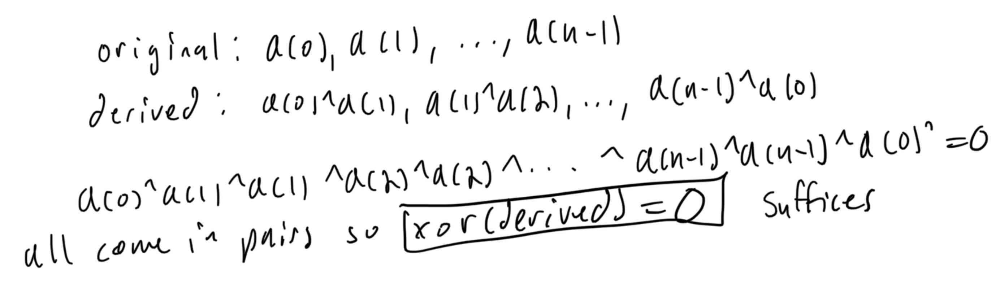

# Leetcode Weekly Contest 345

## 2682. Find the Losers of the Circular Game

### Solution 1:  simulate

```py
class Solution:
    def circularGameLosers(self, n: int, k: int) -> List[int]:
        winners = [0]*n
        friend = 0
        turn = 1
        while True:
            if winners[friend]: break
            winners[friend] = 1
            friend = (friend + turn*k)%n
            turn += 1
        return [i + 1 for i in range(n) if not winners[i]]
```

## 2683. Neighboring Bitwise XOR

### Solution 1:  simulate 

two options either start with 0 or 1 in the array, that will determine the rest of the values for the original array. if first and last element are equal then it was perfectly circular and works. 

```py
from typing import *
class Solution:
    def doesValidArrayExist(self, derived: List[int]) -> bool:
        n = len(derived)
        derived.append(derived[0])
        for start in range(2):
            arr = [0]*(n + 1)
            arr[0] = start
            for i in range(n):
                if derived[i] == 0:
                    arr[i + 1] = arr[i]
                else:
                    arr[i + 1] = arr[i] ^ 1
            if arr[0] == arr[-1]: return True
        return False
```

### Solution 2:  xor sum

Observe that the xor of the derived array is equal to 0 indicates the original array can be formed. 



```py
class Solution:
    def doesValidArrayExist(self, derived: List[int]) -> bool:
        return reduce(operator.xor, derived) == 0
```

## 2684. Maximum Number of Moves in a Grid

### Solution 1:  iterative dynamic programming

```py
class Solution:
    def maxMoves(self, grid: List[List[int]]) -> int:
        R, C = len(grid), len(grid[0])
        dp = [[-math.inf]*C for _ in range(R)]
        # base case initialize to 0 for all 0 column elements
        for r in range(R):
            dp[r][0] = 0
        in_bounds = lambda r, c: 0 <= r < R and 0 <= c < C
        res = 0
        for c in range(1, C):
            for r in range(R):
                for nr, nc in [(r + 1, c - 1), (r, c - 1), (r - 1, c - 1)]:
                    if not in_bounds(nr, nc) or grid[r][c] <= grid[nr][nc]: continue
                    dp[r][c] = max(dp[r][c], dp[nr][nc] + 1)
                res = max(res, dp[r][c])
        return res
```

## 2685. Count the Number of Complete Components

### Solution 1:  union find + graph theory + math

mathematical relationship between vertex and edge count in a completed graph

A complete graph has v(v-1)/2 edges

```py
class UnionFind:
    def __init__(self, n: int):
        self.size = [1]*n
        self.parent = list(range(n))
        self.edge_count = [0]*n
    
    def find(self,i: int) -> int:
        while i != self.parent[i]:
            self.parent[i] = self.parent[self.parent[i]]
            i = self.parent[i]
        return i

    """
    returns true if the nodes were not union prior. 
    """
    def union(self,i: int,j: int) -> bool:
        i, j = self.find(i), self.find(j)
        self.edge_count[i] += 1
        if i!=j:
            if self.size[i] < self.size[j]:
                i,j=j,i
            self.parent[j] = i
            self.size[i] += self.size[j]
            self.edge_count[i] += self.edge_count[j]
            return True
        return False
    
class Solution:
    def countCompleteComponents(self, n: int, edges: List[List[int]]) -> int:
        f = lambda x: (x - 1)*x//2
        dsu = UnionFind(n)
        for u, v in edges:
            dsu.union(u, v)
        roots = [0]*n
        res = 0
        for i in range(n):
            root = dsu.find(i)
            if roots[root]: continue
            roots[root] = 1
            vertex_count = dsu.size[root]
            edge_count = dsu.edge_count[root]
            res += f(vertex_count) == edge_count
        return res
```

### Solution 2:  dfs with stack + connected components

Increment count of complete connected components for when all nodes in the component have count of neighbors equals number of nodes minus 1.

```py
class Solution:
    def countCompleteComponents(self, n: int, edges: List[List[int]]) -> int:
        adj_list = [[] for _ in range(n)]
        for u, v in edges:
            adj_list[u].append(v)
            adj_list[v].append(u)
        vis = [0]*n
        res = 0
        for i in range(n):
            if vis[i]: continue
            nodes = [i]
            stack = [i]
            vis[i] = 1
            while stack:
                node = stack.pop()
                for nei in adj_list[node]:
                    if vis[nei]: continue
                    vis[nei] = 1
                    stack.append(nei)
                    nodes.append(nei)
            res += all(len(adj_list[node]) == len(nodes) - 1 for node in nodes)
        return res
```

