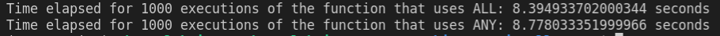

# Benchmarks

## Benchmarking Any vs All in python

The functions we are using. 

```py
# using any
def findAnagramsAny(s, p):
    result, freq = [], [0]*26
    m = len(p)
    def getInt(ch):
        return ord(ch)-ord('a')
    for c in p:
        freq[getInt(c)]+=1
    for i in range(len(s)):
        freq[getInt(s[i])]-=1
        if i>=m:
            freq[getInt(s[i-m])]+=1
        if not any(f!=0 for f in freq):
            result.append(i-m+1)
    return result

# using all
def findAnagramsAll(s, p):
    result, freq = [], [0]*26
    m = len(p)
    def getInt(ch):
        return ord(ch)-ord('a')
    for c in p:
        freq[getInt(c)]+=1
    for i in range(len(s)):
        freq[getInt(s[i])]-=1
        if i>=m:
            freq[getInt(s[i-m])]+=1
        if all(f==0 for f in freq):
            result.append(i-m+1)
    return result
```



It does seem the execution time of all is better than any which does make since because for all
it should exit early to return false at the first iteration that f != 0.  While any needs to check every single
element in the iterable. 

To improve on this benchmark I should create strings of random characters and time those.

