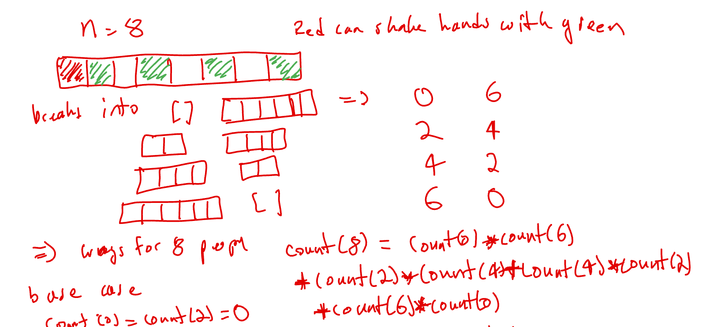
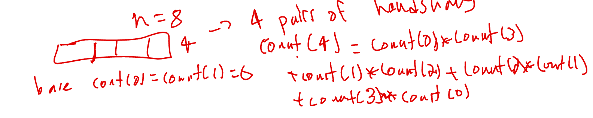

# 1259. Handshakes That Don't Cross

## Solution: dynamic programming with count for N people



We only need to consider the number of ways for even number of people.

TC: O(N^2)

```c++
const int MOD = 1e9+7;
class Solution {
public:
    int numberOfWays(int numPeople) {
        vector<long long> dp(numPeople+1,-1);
        function<long long(int)> dfs = [&](int n) {
            if (n<=2) return 1LL;
            if (dp[n]!=-1) return dp[n];
            long long cnt = 0;
            for (int i = 0;i<=n-2;i+=2) {
                cnt = (cnt+dfs(i)*dfs(n-i-2))%MOD;
            }
            return dp[n]=cnt;
        };
        return dfs(numPeople);
    }
};
```

## Solution: dynamic programming with count for N/2 pairs of people 



```c++
const int MOD = 1e9+7;
class Solution {
public:
    int numberOfWays(int numPeople) {
        vector<long long> dp(numPeople/2+1,-1);
        function<long long(int)> dfs = [&](int n) {
            if (n<2) return 1LL;
            if (dp[n]!=-1) return dp[n];
            long long cnt = 0;
            for (int i = 0;i<n;i++) {
                cnt = (cnt+dfs(i)*dfs(n-i-1))%MOD;
            }
            return dp[n]=cnt;
        };
        return dfs(numPeople/2);
    }
};
```

## Solution: iterative DP with count for N/2 pairs of people

```c++
const int MOD = 1e9+7;
class Solution {
public:
    int numberOfWays(int numPeople) {
        int n = numPeople/2;
        vector<long long> dp(n+1,0);
        dp[0]=1;
        for (int i = 0;i<=n;i++) {
            for (int j = 0;j<i;j++) {
                dp[i] = (dp[i] + dp[j]*dp[i-j-1])%MOD;
            }
        }
        return dp[n];
    }
};
```