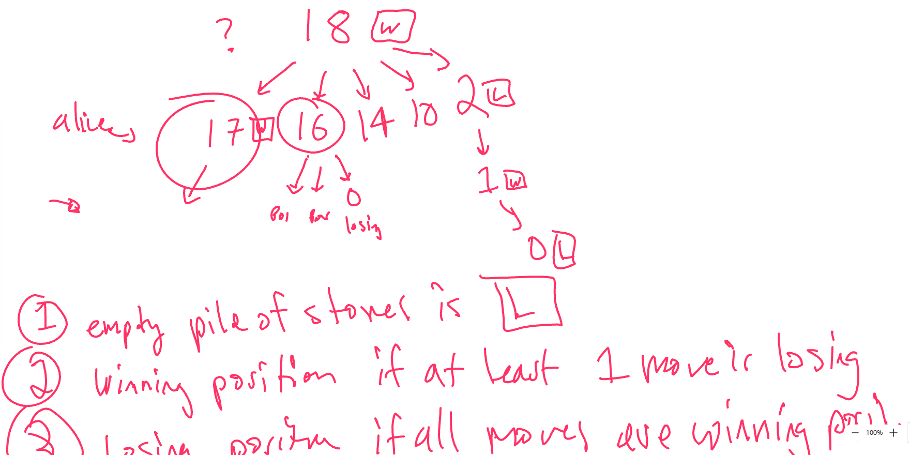

# 1259. Handshakes That Don't Cross

TC of all solutions is O(n^(1.5))

## Solution: Game theory with recursive DP

```c++
vector<int> dpAlice, dpBob;
bool dfsBob(int stones) {
    if (stones<0) {return false;}
    if (stones==0) {return true;}
    if (dpBob[stones]!=-1) {return dpBob[stones];}
    bool res = true;
    for (int i = 1;;i++) {
        res &= dfsAlice(stones-i*i);
        if (i*i>=stones) {
            break;
        }
    }
    return dpBob[stones] = res;
}
bool dfsAlice(int stones) {
    if (stones<0) {return true;}
    if (stones==0) {return false;}
    if (dpAlice[stones]!=-1) {return dpAlice[stones];}
    bool res = false;
    for (int i = 1;;i++) {
        res |= dfsBob(stones-i*i);
        if (i*i>=stones) {
            break;
        }
    }
    return dpAlice[stones] = res;
}

bool winnerSquareGame(int n) {
    dpAlice.assign(n+1,-1);
    dpBob.assign(n+1,-1);
    return dfsAlice(n);
}
```

## Solution:  Game theory with iterative DP




```c++
bool pos[100001];
bool winnerSquareGame(int n) {
    memset(pos,false,sizeof(pos));
    for (int i = 1;i<=n;i++) {
        for (int j=1;j*j<=i;j++) {
            if (!pos[i-j*j]) {
                pos[i] = true;
            }
        }
    }
    return pos[n];
}
```

## Solution: Uses all function from python

```py
def winnerSquareGame(self, n: int) -> bool:
    is_winnable = [False]
    for i in range(1,n+1):
        if not all(is_winnable[i-j*j] for j in range(1,int(math.sqrt(i))+1)):
            is_winnable.append(True)
        else:
            is_winnable.append(False)
    return is_winnable[-1]
```

## Solution: recursive dp with python

```py
def winnerSquareGame(self, n: int) -> bool:
    @cache
    def dp(i): 
        for j in range(1,int(math.sqrt(i))+1):
            if not dp(i-j*j):
                return True
        return False
    return dp(n)
```


