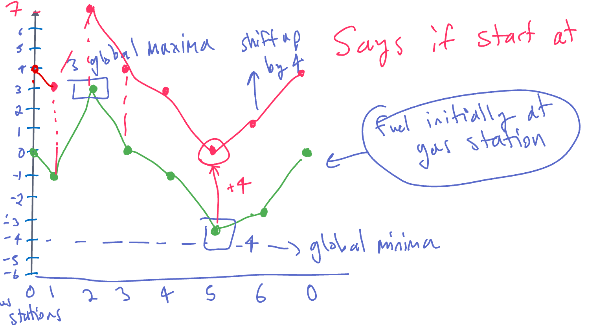

# 134. Gas Station

### Solution: Greedy, move the start point to whereever tank is negative fuel

```c++
int canCompleteCircuit(vector<int>& gas, vector<int>& cost) {
    int n = gas.size(), start= 0, tank = 0;
    for (int end = 0;end<2*n;end++) {
        if (tank<0) {
            start=end;
            tank = 0;
        }
        tank += gas[end%n]-cost[end%n];
    }
    return start<n ? start : -1;
}
```

## Solution: Kadane's algorithm

Kadane's algorithm is used to find the maximum sum of a subarray. 

```c++
int canCompleteCircuit(vector<int>& gas, vector<int>& cost) {
    int n = gas.size();
    if (accumulate(gas.begin(),gas.end(),0)-accumulate(cost.begin(),cost.end(),0)<0) {return -1;}
    int start = 0, mn = INT_MAX;
    for (int i = 0, fuel = 0;i<n;i++) {\
        if (fuel<mn) {
            mn = fuel;
            start = i;
        }
        fuel += gas[i]-cost[i];
    }
    return start;
}
```

## Solution: greedy with finding the global minimum (only one exists if it has a unique solution)



```c++
int canCompleteCircuit(vector<int>& gas, vector<int>& cost) {
    int n = gas.size();
    int start = 0, minBal = 0, bal = 0;
    for (int i = 0;i<n;i++) {\
        if (bal<minBal) {
            minBal = bal;
            start = i;
        }
        bal += gas[i]-cost[i];
    }
    return bal>=0 ? start : -1;
}
```