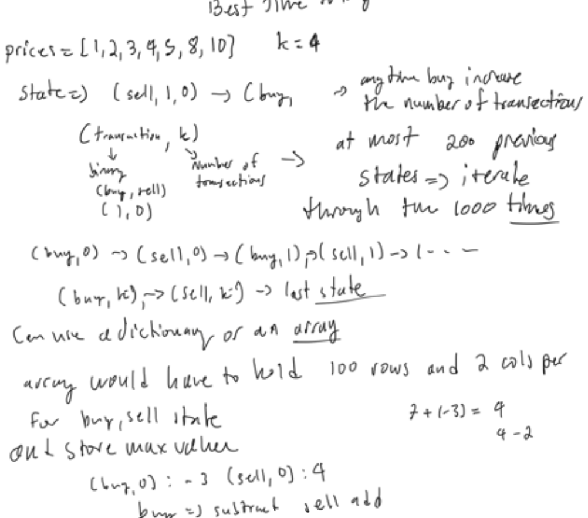

# 188. Best Time to Buy and Sell Stock IV

### Solution: recursive DP + memoization

```c++
int maxProfit(int k, vector<int>& prices) {
    vector<vector<vector<bool>>> cache(prices.size(),vector<vector<bool>>(2, vector<bool>(k,false)));
    vector<vector<vector<int>>> dp(prices.size(),vector<vector<int>>(2, vector<int>(k, 0)));
    function<int(int,bool,int)> dfs = [&](const int i, const bool bought, const int num) {
        if (i==prices.size() || num==k) {
            return 0;
        }
        if (cache[i][bought][num]) {
            return dp[i][bought][num];}
        int profit = bought ? dfs(i+1,false, num+1)+prices[i] : dfs(i+1,true,num)-prices[i];
        cache[i][bought][num] = true;
        return dp[i][bought][num] = max(profit, dfs(i+1,bought,num));
    };
    return dfs(0,false,0);
}
```

### Solution 2:  memoize with dictionary using states (buy/sell, num_transactions)



```py
class Solution:
    def maxProfit(self, k: int, prices: List[int]) -> int:
        memo = dict()
        # BUY STATE IS 0 AND SELL STATE IS 1
        memo[(0,0)] = 0
        max_profit = 0
        for i, price in enumerate(prices):
            previous_states = list(memo.items())
            for (trans, num_trans), val in previous_states:
                if num_trans == k: continue
                state = (trans^1, num_trans+trans)
                cur_price = price if trans else -price
                memo[state] = max(memo.get(state,-inf), val+cur_price)
                max_profit = max(max_profit, memo[state])
        return max_profit
```

```py
class Solution:
    def maxProfit(self, k: int, prices: List[int]) -> int:
        # BUY STATE IS 0 AND SELL STATE IS 1
        memo = [[-inf]*(k+1) for _ in range(2)]
        memo[0][0] = 0
        for i, price in enumerate(prices):
            for j in range(k+1)[::-1]:
                for ii in range(2)[::-1]:
                    previous_trans = ii^1
                    num_trans = j - previous_trans
                    if num_trans < 0: continue
                    cur_price = price if previous_trans else -price
                    if memo[previous_trans][num_trans] > -inf:
                        memo[ii][j] = max(memo[ii][j], memo[previous_trans][num_trans] + cur_price)
        return max(memo[i][j] for i, j in product(range(2), range(k+1)))            
```