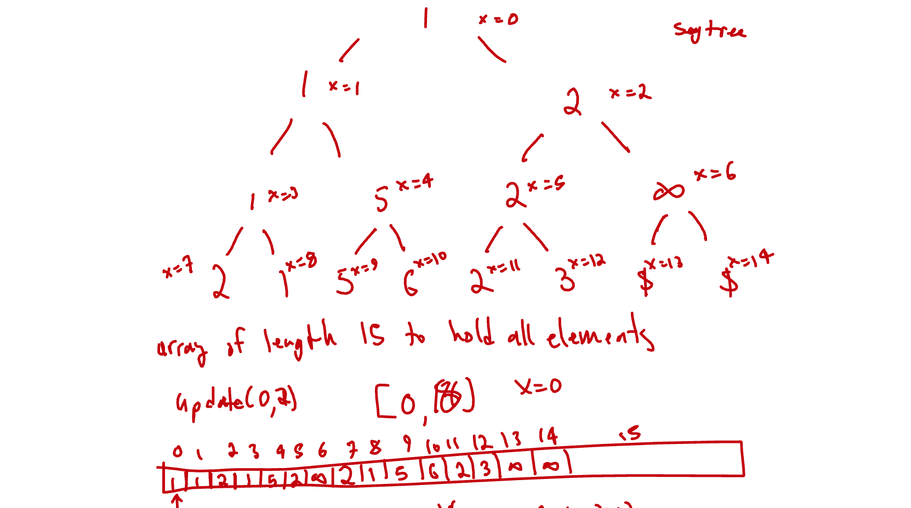

# 84. Largest Rectangle in Histogram

## Solution:  divide and conquer + min segment tree

The idea is that within any range you can use the minimum height to compute the area for that range. 
than you can divide into a left and right range, and find a new minimum that spans those ranges. Basically removing
minimum heights from ranges. 

TC: O(NlogN)



```c++
const pair<int,int> NEUTRAL = {INT_MAX,-1};
#define val first
#define index second
struct SegmentTree {
    vector<pair<int,int>> tree;
    int size;
    void init(int n) {
        size=1;
        while (size<n) {
            size*=2;
        }
        tree.assign(size*2, NEUTRAL);
    }
    void update(int idx, int val) {
        update(idx,val,0,0,size);
    }
    void update(int idx, int val, int x, int lx, int rx) {
        if (rx-lx==1) {
            tree[x] = {val,idx};
            return;
        }
        int mid = rx+lx>>1;
        if (idx<mid) {
            update(idx,val,2*x+1,lx,mid);
        } else {
            update(idx,val,2*x+2,mid,rx);
        }
        tree[x]=min(tree[2*x+1],tree[2*x+2], [&](const auto& a, const auto& b) {
            if (a.val!=b.val) {
                return a.val<b.val;
            }
            return a.index<b.index;
        });
    }
    pair<int,int> query(int l, int r) {
        return query(l,r,0,0,size);
    }
    pair<int,int> query(int l, int r, int x, int lx, int rx) {
        if (l>=rx || r<=lx) return NEUTRAL;
        if (lx>=l && rx<=r) return tree[x];
        int mid = lx+rx>>1;
        return min(query(l,r,2*x+1,lx,mid), query(l,r,2*x+2,mid,rx), [&](const auto& a, const auto& b) {
            if (a.val!=b.val) {
                return a.val<b.val;
            }
            return a.index<b.index;
        });
    }
};
class Solution {
public:
    int largestRectangleArea(vector<int>& heights) {
        SegmentTree seg;
        int n = heights.size();
        seg.init(n);
        for (int i = 0;i<n;i++) {
            seg.update(i,heights[i]);
        }
        function<int(int,int)> dfs = [&](int L, int R) {
            if (L==R) return 0;
            pair<int,int> mid = seg.query(L,R);
            return max({mid.val*(R-L), dfs(L,mid.index), dfs(mid.index+1,R)});
        };
        return dfs(0,n);
        
    }
};
```

## Solution: monotonic increasing stack

TC: O(N)

```c++
int largestRectangleArea(vector<int>& heights) {
    heights.insert(heights.begin(),0);
    heights.push_back(0);
    int n = heights.size(), area = 0;
    stack<int> stk;
    stk.push(0);
    for (int i = 1;i<n;i++) {
        while (!stk.empty() && heights[stk.top()]>heights[i]) {
            int idx = stk.top();
            stk.pop();
            area = max(area, heights[idx]*(i-stk.top()-1));
        }
        stk.push(i);
    }
    return area;
}
```