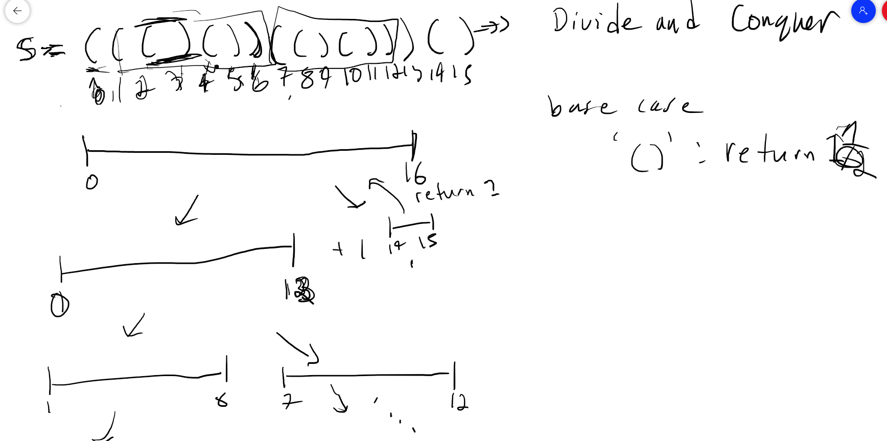

# 856. Score of Parentheses

## Solution: Divide and Conquer



```py
class Solution:
    def scoreOfParentheses(self, s: str) -> int:
        def score_parentheses(i,j):
            if j-i==1: return 1
            score = bal = 0
            for k in range(i,j):
                bal += 1 if s[k]=='(' else -1
                if bal == 0:
                    score += 2*score_parentheses(i+1,k+1)
                    i = k+1
            return score
            
        return score_parentheses(0,len(s))//2
```

## Solution: Stack with constant space = using balance variable + distributive property of multiplication


```py
class Solution:
    def scoreOfParentheses(self, s: str) -> int:
        score = bal = 0
        for left, right in zip(s, s[1:]):
            if left=='(' and right==')':
                score += 1<<bal
            bal += 1 if left=='(' else -1
        return score
```

```py
class Solution:
    def scoreOfParentheses(self, s: str) -> int:
        score = bal = 0
        for i in range(len(s)):
            if s[i:i+2]=='()':
                score += 1<<bal
            bal += 1 if s[i]=='(' else -1
        return score
```