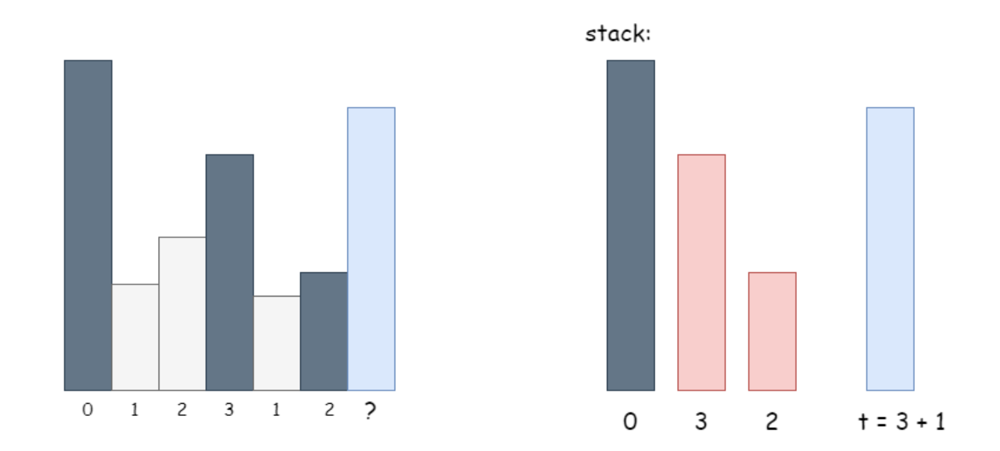
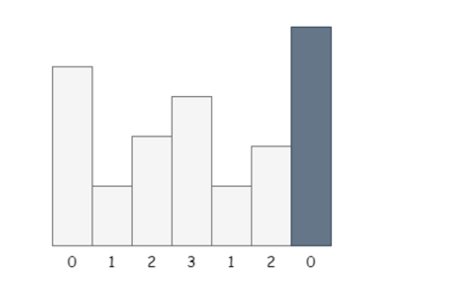
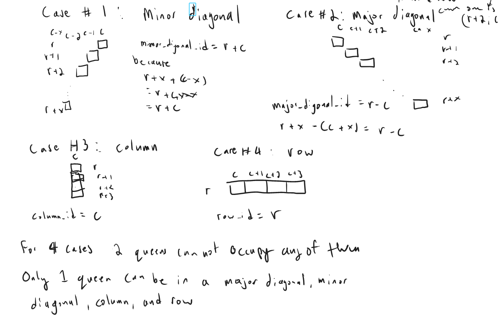
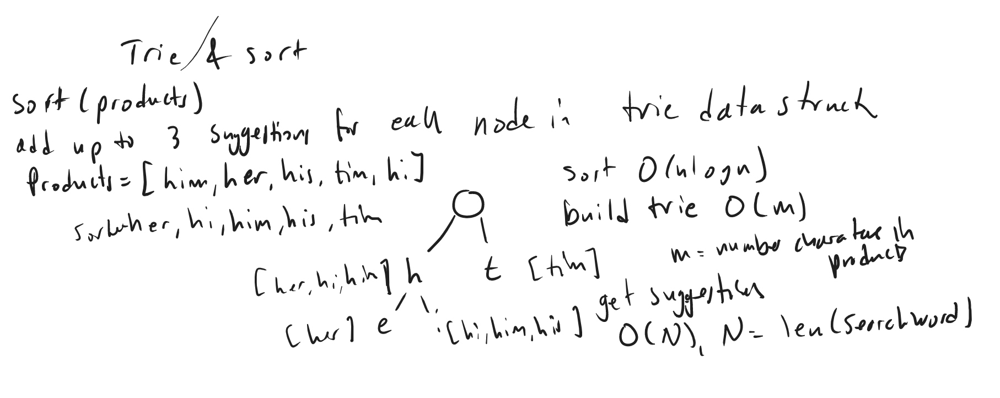
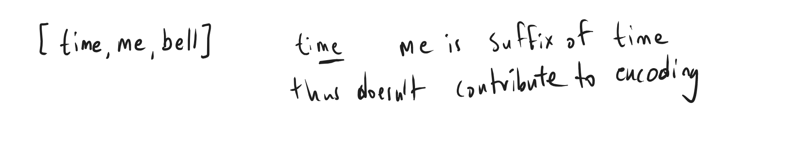
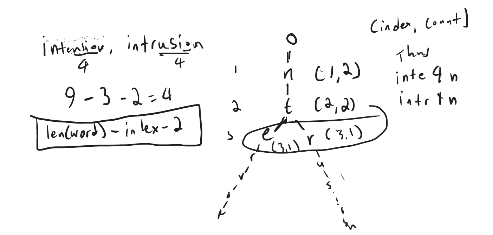
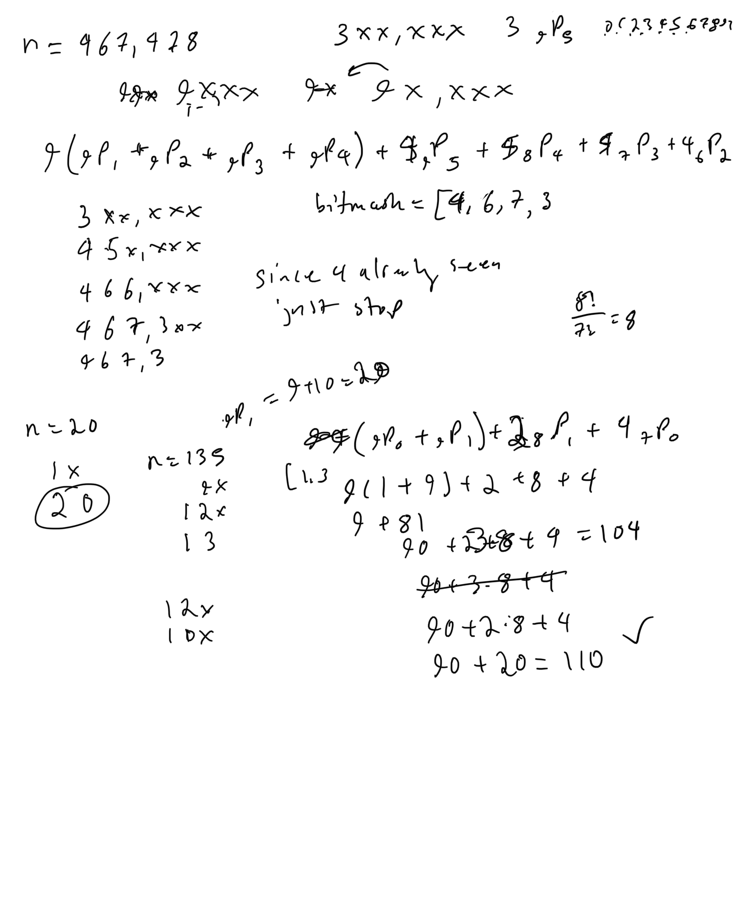

# Summary 

## 99. Recover Binary Search Tree

### Solution 1: dfs + recursion until no longer swap nodes

```py
class Solution:
    def recoverTree(self, root: Optional[TreeNode]) -> None:
        def swap_nodes(root, lo=TreeNode(-inf), hi=TreeNode(inf)):
            if not root: return False
            if root.val < lo.val:
                root.val, lo.val = lo.val, root.val
                return True
            if root.val > hi.val:
                root.val, hi.val = hi.val, root.val
                return True
            if swap_nodes(root.left, lo, root):
                return True
            if swap_nodes(root.right, root, hi):
                return True
        while swap_nodes(root):
            pass
```

### Solution 2: 

```py
class Solution:
    def recoverTree(self, root: TreeNode):
        def inorder(node):
            if node:
                yield from inorder(node.left)
                yield node.val
                yield from inorder(node.right)
        def swapped_nodes(arr):
            first = second = None
            for i in range(1,len(arr)):
                if arr[i] < arr[i-1]:
                    second = arr[i]
                    if not first:
                        first = arr[i-1]
                    
            return first, second
        def recover(node, count = 2):
            if node:
                if node.val == first or node.val == second:
                    node.val = first if node.val == second else second
                    count -= 1
                    if count == 0: return
                recover(node.left, count)
                recover(node.right, count)
        
        arr = list(inorder(root))
        first, second = swapped_nodes(arr)
        recover(root)
```

### Solution 3: Iterative inorder traversal with stack

```py
class Solution:
    def recoverTree(self, root: TreeNode):
        def inorder(node):
            stack = []
            while node or stack:
                while node:
                    stack.append(node)
                    node = node.left
                node = stack.pop()
                yield node
                node = node.right
            
        prev_node = first_node = second_node = None
        for node in inorder(root):
            if prev_node and prev_node.val > node.val:
                second_node = node
                if not first_node:
                    first_node = prev_node
            prev_node = node
        first_node.val, second_node.val = second_node.val, first_node.val
```

## 1586. Binary Search Tree Iterator II

### Solution 1: Flatten BST + recursive inorder traversal

```py
class BSTIterator:
    
    def inorder(self, root):
        if not root: return []
        return self.inorder(root.left) + [root.val] + self.inorder(root.right)

    def __init__(self, root: Optional[TreeNode]):
        self.arr = [0] + self.inorder(root)
        self.i = 0

    def hasNext(self) -> bool:
        return self.i < len(self.arr) - 1

    def next(self) -> int:
        self.i += 1
        return self.arr[self.i]

    def hasPrev(self) -> bool:
        return self.i > 1

    def prev(self) -> int:
        self.i -= 1
        return self.arr[self.i]
```

### Solution 2: iterative stack based inorder traversal

```py
class BSTIterator:

    def __init__(self, root: Optional[TreeNode]):
        self.node = root
        self.stack, self.arr = [], []
        self.pointer = -1

    def hasNext(self) -> bool:
        return self.stack or self.node or self.pointer + 1 < len(self.arr)

    def next(self) -> int:
        self.pointer += 1
        if self.pointer == len(self.arr):
            while self.node:
                self.stack.append(self.node)
                self.node = self.node.left
            self.node = self.stack.pop()
            self.arr.append(self.node.val)
            self.node = self.node.right
        return self.arr[self.pointer]

    def hasPrev(self) -> bool:
        return self.pointer > 0 

    def prev(self) -> int:
        self.pointer -= 1
        return self.arr[self.pointer]
```

## 285. Inorder Successor in BST

### Solution 1: Iterative stack based inorder traversal

```py
class Solution:
    def inorderSuccessor(self, root: TreeNode, p: TreeNode) -> Optional[TreeNode]:
        def inorder(node):
            stack = []
            while node or stack:
                while node:
                    stack.append(node)
                    node=node.left
                node = stack.pop()
                yield node
                node=node.right
        root_iter = inorder(root)
        while next(root_iter).val != p.val: pass
        try: 
            return next(root_iter)
        except:
            return None
```

## 2237. Count Positions on Street With Required Brightness

### Solution 1: counter + hash table for change in brightness

```py
class Solution:
    def meetRequirement(self, n: int, lights: List[List[int]], requirement: List[int]) -> int:
        change_brightness = [0]*n
        for pos, dist in lights:
            change_brightness[max(0,pos-dist)] += 1
            if pos+dist+1 < n:
                change_brightness[pos+dist+1] -= 1
        brightness = cnt = 0
        for req, delta in zip(requirement, change_brightness):
            brightness += delta
            cnt += (brightness >= req)
        return cnt
```

## 2238. Number of Times a Driver Was a Passenger

### Solution 1: Left Join with distinct driver_id + group by driver_id and aggregate for count of passenger_id

```sql
SELECT 
  d.driver_id, Count(r2.passenger_id) cnt
FROM 
  (SELECT DISTINCT r1.driver_id FROM rides r1) d
  LEFT JOIN rides r2 ON d.driver_id = r2.passenger_id
GROUP BY driver_id
```

## 173. Binary Search Tree Iterator

### Solution 1: iterative inorder BST traversal with stack

```py
class BSTIterator:

    def __init__(self, root: Optional[TreeNode]):
        self.node = root
        self.stack = []

    def next(self) -> int:
        while self.node:
            self.stack.append(self.node)
            self.node = self.node.left
        self.node = self.stack.pop()
        val = self.node.val
        self.node = self.node.right
        return val

    def hasNext(self) -> bool:
        return self.stack or self.node
```

## 705. Design Hashset

### Solution 1:  separate-chaining = Hashset with modulus of prime number and using buckets with linkedlist for collisions

This uses separate chaining because each bucket contains a datastructure that stores all elements that have that bucket index
from the hash function.  So if there is a hash collision it will search through the linked list to add it into that bucket.  

This is still O(n) though because to search through linked list is O(n) but delete, add are O(1)

We could use a list for the buckets and it would be O(n) for search and delete but O(1) for add

We could finally use a self-balancing binary search tree which would give O(logn) for add, search, delete

```py
class MyHashSet:

    def __init__(self):
        self.MOD = 769
        self.values = [Bucket() for _ in range(self.MOD)]
    
    def hash_(self, key: int) -> int:
        return key % self.MOD
    
    def add(self, key: int) -> None:
        i = self.hash_(key)
        self.values[i].add(key)

    def remove(self, key: int) -> None:
        i = self.hash_(key)
        self.values[i].remove(key)

    def contains(self, key: int) -> bool:
        i = self.hash_(key)
        return self.values[i].contains(key)

class Bucket:
    def __init__(self):
        self.linked_list = LinkedList()

    def add(self, value):
        self.linked_list.add(value)

    def remove(self, value):
        self.linked_list.remove(value)

    def contains(self, value):
        return self.linked_list.contains(value)

class Node:
    def __init__(self, val=0, next_node=None):
        self.val = val
        self.next = next_node
    
class LinkedList:
    def __init__(self):
        self.head = Node()
    
    def add(self, val: int) -> None:
        if self.contains(val): return
        node = self.head
        while node.next:
            node = node.next
        node.next = Node(val)
    
    def remove(self, val: int) -> None:
        node = self.head
        while node.next:
            if node.next.val == val:
                node.next = node.next.next
                break
            node=node.next
        
    def contains(self, val: int) -> None:
        node = self.head.next
        while node:
            if node.val == val: return True
            node=node.next
        return False
```

### Solution 2: Separate chaining with buckets but bucket is binary search tree

Example of a facade design pattern

```py
class MyHashSet:

    def __init__(self):
        self.MOD = 769
        self.values = [Bucket() for _ in range(self.MOD)]
    
    def hash_(self, key: int) -> int:
        return key % self.MOD
    
    def add(self, key: int) -> None:
        i = self.hash_(key)
        self.values[i].add(key)

    def remove(self, key: int) -> None:
        i = self.hash_(key)
        self.values[i].remove(key)

    def contains(self, key: int) -> bool:
        i = self.hash_(key)
        return self.values[i].contains(key)

class Bucket:
    def __init__(self):
        self.tree = BSTree()

    def add(self, value):
        self.tree.root = self.tree.insertIntoBST(self.tree.root, value)

    def remove(self, value):
        self.tree.root = self.tree.deleteNode(self.tree.root, value)

    def contains(self, value):
        return (self.tree.searchBST(self.tree.root, value) is not None)

class TreeNode:
    def __init__(self, value):
        self.val = value
        self.left = None
        self.right = None

class BSTree:
    def __init__(self):
        self.root = None

    def searchBST(self, root: TreeNode, val: int) -> TreeNode:
        if root is None or val == root.val:
            return root

        return self.searchBST(root.left, val) if val < root.val \
            else self.searchBST(root.right, val)

    def insertIntoBST(self, root: TreeNode, val: int) -> TreeNode:
        if not root:
            return TreeNode(val)

        if val > root.val:
            # insert into the right subtree
            root.right = self.insertIntoBST(root.right, val)
        elif val == root.val:
            return root
        else:
            # insert into the left subtree
            root.left = self.insertIntoBST(root.left, val)
        return root

    def successor(self, root):
        """
        One step right and then always left
        """
        root = root.right
        while root.left:
            root = root.left
        return root.val

    def predecessor(self, root):
        """
        One step left and then always right
        """
        root = root.left
        while root.right:
            root = root.right
        return root.val

    def deleteNode(self, root: TreeNode, key: int) -> TreeNode:
        if not root:
            return None

        # delete from the right subtree
        if key > root.val:
            root.right = self.deleteNode(root.right, key)
        # delete from the left subtree
        elif key < root.val:
            root.left = self.deleteNode(root.left, key)
        # delete the current node
        else:
            # the node is a leaf
            if not (root.left or root.right):
                root = None
            # the node is not a leaf and has a right child
            elif root.right:
                root.val = self.successor(root)
                root.right = self.deleteNode(root.right, root.val)
            # the node is not a leaf, has no right child, and has a left child
            else:
                root.val = self.predecessor(root)
                root.left = self.deleteNode(root.left, root.val)

        return root
```

## 706. Design HashMap

### Solution 1: 

```py
class MyHashMap:

    def __init__(self):
        self.MOD = 2069
        self.buckets = [Bucket() for _ in range(self.MOD)]
        
    def hash_(self, key: int) -> int:
        return key % self.MOD

    def put(self, key: int, value: int) -> None:
        bucket_index = self.hash_(key)
        self.buckets[bucket_index].add(key, value)

    def get(self, key: int) -> int:
        bucket_index = self.hash_(key)
        return self.buckets[bucket_index].search(key)

    def remove(self, key: int) -> None:
        bucket_index = self.hash_(key)
        self.buckets[bucket_index].remove(key)
        
class Node:
    def __init__(self, key=0, val=0,next_node=None):
        self.key = key
        self.val = val
        self.next = next_node
        
class Bucket:
    def __init__(self):
        self.head = Node()
        
    def search(self, key: int) -> int:
        node = self.head.next
        while node:
            if node.key == key: return node.val
            node=node.next
        return -1
    
    def add(self, key: int, val: int) -> None:
        node = self.head
        while node.next:
            if node.next.key == key: 
                node.next.val = val
                return
            node=node.next
        node.next = Node(key,val)
    
    def remove(self, key: int) -> None:
        node = self.head
        while node.next:
            if node.next.key == key:
                node.next = node.next.next
                return
            node=node.next
```

## 687. Longest Univalue Path

### Solution 1: Recursion + postorder dfs binary tree traversal

```py
class Solution:
    def longestUnivaluePath(self, root: Optional[TreeNode]) -> int:
        self.longest_path = 0
        def dfs(node):
            if not node: return 0
            left_len, right_len = dfs(node.left), dfs(node.right)
            left_arrow = right_arrow = 0
            if node.left and node.val==node.left.val:
                left_arrow = left_len + 1
            if node.right and node.val==node.right.val:
                right_arrow = right_len + 1
            self.longest_path = max(self.longest_path, left_arrow + right_arrow)
            return max(left_arrow, right_arrow)
                
        dfs(root)
        return self.longest_path
```

## 535. Encode and Decode TinyURL

### Solution 1: counter + hash table

The problems with this solution is that integer will get very large over time and the tinyurl will be no longy short. 
And in other languages it will overflow, python it won't overflow so that is fine. But there will be performance degredation potentially

```py
class Codec:
    def __init__(self):
        self.cnt = 0
        self.map = {}
    def encode(self, longUrl: str) -> str:
        """Encodes a URL to a shortened URL.
        """
        self.map[self.cnt] = longUrl
        shortUrl = 'http://tinyurl.com/' + str(self.cnt)
        self.cnt += 1
        return shortUrl
    def decode(self, shortUrl: str) -> str:
        """Decodes a shortened URL to its original URL.
        """
        return self.map[int(shortUrl.replace('http://tinyurl.com/', ''))]
```

### Solution 2: variable length encoding

The next level is to use more than just integers to fix the overflow and the fact the short url becomes long quickly

we can use 62 characters if we take integers + alphabet

```py
    def __init__(self):
        self.chars = string.ascii_letters + string.digits
        self.cnt = 0
        self.map = {}
    def encode(self, longUrl: str) -> str:
        """Encodes a URL to a shortened URL.
        """
        count = self.cnt
        encoding = []
        while count > 0:
            encoding.append(self.chars[count%62])
            count //= 62
        encoding_str = "".join(encoding)
        shortUrl = f'http://tinyurl.com/{encoding_str}'
        self.map[encoding_str] = longUrl
        return shortUrl
    def decode(self, shortUrl: str) -> str:
        """Decodes a shortened URL to its original URL.
        """
        return self.map[shortUrl.replace('http://tinyurl.com/', '')]
```

### Solution 3: python inbuilt hash function

```py
class Codec:
    def __init__(self):
        self.map = {}
    def encode(self, longUrl: str) -> str:
        """Encodes a URL to a shortened URL.
        """
        hash_ = hash(longUrl)
        self.map[hash_] = longUrl
        return f'http://tinyurl.com/{hash_}'
    def decode(self, shortUrl: str) -> str:
        """Decodes a shortened URL to its original URL.
        """
        return self.map[int(shortUrl.replace('http://tinyurl.com/', ''))]
```

### Solution 4: random fixed length encoding

62 characters with 6 as fixed size is 62^6

```py

```

## 1396. Design Underground System

### Solution 1: Multiple hash tables 

```py
class UndergroundSystem:

    def __init__(self):
        self.trip_times = Counter()
        self.trip_counts = Counter()
        self.checkedin = {}

    def checkIn(self, id: int, stationName: str, t: int) -> None:
        self.checkedin[id] = (stationName, t)

    def checkOut(self, id: int, stationName: str, t: int) -> None:
        startStation, t1 = self.checkedin[id]
        self.trip_counts[(startStation, stationName)] += 1
        self.trip_times[(startStation, stationName)] += (t-t1)

    def getAverageTime(self, startStation: str, endStation: str) -> float:
        return self.trip_times[(startStation, endStation)] / self.trip_counts[(startStation, endStation)]
```

## 284. Peeking Iterator

### Solution 1: iterator that stores next value for peek, and uses boolean for end so it works with any data type

```py
# Below is the interface for Iterator, which is already defined for you.
#
# class Iterator:
#     def __init__(self, nums):
#         """
#         Initializes an iterator object to the beginning of a list.
#         :type nums: List[int]
#         """
#
#     def hasNext(self):
#         """
#         Returns true if the iteration has more elements.
#         :rtype: bool
#         """
#
#     def next(self):
#         """
#         Returns the next element in the iteration.
#         :rtype: int
#         """

class PeekingIterator:
    def __init__(self, iterator):
        """
        Initialize your data structure here.
        :type iterator: Iterator
        """
        self.iterator = iterator
        self.next_data = self.iterator.next()
        self.not_end = True

    def peek(self):
        """
        Returns the next element in the iteration without advancing the iterator.
        :rtype: int
        """
        if not self.hasNext():
            raise StopIteration
        return self.next_data

    def next(self):
        """
        :rtype: int
        """
        if not self.hasNext():
            raise StopIteration
        data = self.next_data
        self.not_end = False
        if self.iterator.hasNext():
            self.next_data = self.iterator.next()
            self.not_end = True
        return data

    def hasNext(self):
        """
        :rtype: bool
        """
        return self.not_end

# Your PeekingIterator object will be instantiated and called as such:
# iter = PeekingIterator(Iterator(nums))
# while iter.hasNext():
#     val = iter.peek()   # Get the next element but not advance the iterator.
#     iter.next()         # Should return the same value as [val].
```

## 1166. Design File System

### Solution 1: hash table + hash table for tree

```py
class FileSystem:

    def __init__(self):
        self.paths = {}

    def createPath(self, path: str, value: int) -> bool:
        if path in self.paths: return False
        parent = path[:path.rfind('/')]
        if len(parent) > 1 and parent not in self.paths: return False
        self.paths[path] = value
        return True

    def get(self, path: str) -> int:
        return self.paths[path] if path in self.paths else -1
```

### Solution 2: Trie datastructure

```py
class TrieNode:
    def __init__(self, name):
        self.children = defaultdict(TrieNode)
        self.name = name
        self.value = -1
class FileSystem:

    def __init__(self):
        self.root = TrieNode('')

    def createPath(self, path: str, value: int) -> bool:
        components = path.split('/')
        node = self.root
        for i in range(1,len(components)):
            name = components[i]
            if name not in node.children:
                if i==len(components)-1:
                    node.children[name] = TrieNode(name)
                else: 
                    return False
            node=node.children[name]
        if node.value != -1: return False
        node.value = value
        return True

    def get(self, path: str) -> int:
        components = path.split('/')
        node = self.root
        for i in range(1,len(components)):
            name = components[i]
            if name not in node.children: return -1
            node=node.children[name]
        return node.value
```

## 1584. Min Cost to Connect All Points

### Solution 1: Kruskal's Algorithm to find Minimimum Spanning Tree + UnionFind + sort

```py
class UnionFind:
    def __init__(self,n):
        self.size = [1]*n
        self.parent = list(range(n))
    
    def find(self,i):
        if i==self.parent[i]:
            return i
        self.parent[i] = self.find(self.parent[i])
        return self.parent[i]

    def union(self,i,j):
        i, j = self.find(i), self.find(j)
        if i!=j:
            if self.size[i] < self.size[j]:
                i,j=j,i
            self.parent[j] = i
            self.size[i] += self.size[j]
            return True
        return False
class Solution:
    def minCostConnectPoints(self, points: List[List[int]]) -> int:
        n = len(points)
        edges = []
        manhattan = lambda p1, p2: abs(p1[0]-p2[0])+abs(p1[1]-p2[1])
        for i in range(n):
            for j in range(i+1,n):
                edges.append((manhattan(points[i], points[j]), i, j))
        edges.sort()
        dsu = UnionFind(n)
        minCost = 0
        for cost, u, v in edges:
            if dsu.union(u,v):
                minCost += cost
            if dsu.size[u] == n: break
        return minCost
```

### Solution 2: Union find + min heap datastructure + minimum spanning Tree (MST)

```py
class UnionFind:
    def __init__(self,n):
        self.size = [1]*n
        self.parent = list(range(n))
    
    def find(self,i):
        if i==self.parent[i]:
            return i
        self.parent[i] = self.find(self.parent[i])
        return self.parent[i]

    def union(self,i,j):
        i, j = self.find(i), self.find(j)
        if i!=j:
            if self.size[i] < self.size[j]:
                i,j=j,i
            self.parent[j] = i
            self.size[i] += self.size[j]
            return True
        return False
class Solution:
    def minCostConnectPoints(self, points: List[List[int]]) -> int:
        n = len(points)
        manhattan_distance = lambda p1, p2: abs(p2[0]-p1[0]) + abs(p2[1]-p1[1])
        minheap = []
        for (i, p1), (j, p2) in product(enumerate(points), repeat = 2):
            if i == j: continue
            heappush(minheap, (manhattan_distance(p1,p2), i, j))
        dsu = UnionFind(n)
        mincost = 0
        while dsu.size[dsu.find(0)] < n:
            cost, i, j = heappop(minheap)
            if dsu.union(i,j):
                mincost += cost
        return mincost
        
```

## 1202. Smallest String With Swaps

### Solution 1: Union find + minheap for each connected component

```py
class UnionFind:
    pass
class Solution:
    def smallestStringWithSwaps(self, s: str, pairs: List[List[int]]) -> str:
        n = len(s)
        dsu = UnionFind(n)
        for u, v in pairs:
            dsu.union(u,v)
        connected_components = defaultdict(list)
        for i in range(n):
            heappush(connected_components[dsu.find(i)], s[i])
        swapped = []
        for i in range(n):
            swapped.append(heappop(connected_components[dsu.find(i)]))
        return "".join(swapped)
```

### Solution 1: dfs + sorting

```py
class Solution:
    def smallestStringWithSwaps(self, s: str, pairs: List[List[int]]) -> str:
        def dfs(u):
            component.append(u)
            for v in graph[u]:
                if visited[v]: continue
                visited[v] = 1
                dfs(v)
        n = len(s)
        graph = defaultdict(list)
        for u, v in pairs:
            graph[u].append(v)
            graph[v].append(u)
        visited = [0]*n
        result = list(s)
        for i in range(n):
            if visited[i]: continue
            component = []
            visited[i] = 1
            dfs(i)
            component.sort()
            chars = [s[j] for j in component]
            chars.sort()
            for j, k in enumerate(component):
                result[k] = chars[j]
        return "".join(result)
```

## 1631. Path With Minimum Effort

### Solution 1: min heap datastructure + memoize cheapest cost to that cell (similar to dijkstra algorithm)

```py
class Solution:
    def minimumEffortPath(self, heights: List[List[int]]) -> int:
        R, C = len(heights), len(heights[0])
        heap = [(0, 0, 0)] # (cost, row, column)
        diff_matrix = [[inf]*C for _ in range(R)]
        in_boundary = lambda r, c: 0<=r<R and 0<=c<C
        while heap:
            cost, row, col = heappop(heap)
            if row==R-1 and col==C-1:
                return cost
            for r, c in map(lambda x: (row+x[0], col+x[1]), [(1,0),(-1,0),(0,1),(0,-1)]):
                if not in_boundary(r,c): continue
                ncost = max(abs(heights[r][c]-heights[row][col]), cost)
                if ncost < diff_matrix[r][c]:
                    heappush(heap, (ncost, r, c))
                    diff_matrix[r][c] = ncost
        return -1
```

### Solution 2: Binary search + BFS

```py
class Solution:
    def minimumEffortPath(self, heights: List[List[int]]) -> int:
        left, right = 0, max((max(height) for height in heights))-min((min(height) for height in heights))
        R, C = len(heights), len(heights[0])
        def bfs(threshold):
            queue = deque([(0, 0)]) # (row, col)
            visited = set()
            in_boundary = lambda r, c: 0<=r<R and 0<=c<C
            while queue:
                row, col = queue.popleft()
                if row==R-1 and col==C-1:
                    return True
                for nr, nc in map(lambda x: (row+x[0], col+x[1]), [(1,0),(-1,0),(0,1),(0,-1)]):
                    if not in_boundary(nr,nc): continue
                    if (nr,nc) in visited or abs(heights[row][col]-heights[nr][nc]) > threshold: continue
                    visited.add((nr,nc))
                    queue.append((nr,nc))
            return False
        while left < right:
            mid = (left+right)>>1
            if not bfs(mid):
                left = mid+1
            else:
                right = mid
        return left
```

### Solution 3: binary search + dfs

Turns out to be much faster than using bfs too. 

```py
class Solution:
    def minimumEffortPath(self, heights: List[List[int]]) -> int:
        left, right = 0, max((max(height) for height in heights))-min((min(height) for height in heights))
        R, C = len(heights), len(heights[0])
        def dfs(row, col, threshold):
            if row==R-1 and col==C-1: return True
            visited[row][col] = 1
            for nr, nc in map(lambda x: (row+x[0], col+x[1]), [(1,0),(-1,0),(0,1),(0,-1)]):
                if not (0<=nr<R and 0<=nc<C): continue
                if visited[nr][nc] or abs(heights[row][col]-heights[nr][nc]) > threshold: continue
                visited[nr][nc] = 1
                if dfs(nr,nc,threshold): return True
            return False
        while left < right:
            mid = (left+right)>>1
            visited = [[0]*C for _ in range(R)]
            if not dfs(0,0,mid):
                left = mid+1
            else:
                right = mid
        return left
```

### Solution 4: Union Find + it contains the first and last cell in path

```py
class UnionFind:
    pass
class Solution:
    def minimumEffortPath(self, heights: List[List[int]]) -> int:
        R, C = len(heights), len(heights[0])
        dsu = UnionFind(R*C)
        edges = []
        in_boundary = lambda r, c: 0<=r<R and 0<=c<C
        for r, c in product(range(R), range(C)):
            for nr, nc in map(lambda x: (r+x[0],c+x[1]), [(1,0),(-1,0),(0,1),(0,-1)]):
                if not in_boundary(nr,nc): continue
                cost = abs(heights[r][c]-heights[nr][nc])
                node1, node2 = r*C+c, nr*C+nc
                edges.append((cost, node1, node2))
        edges.sort()
        for cost, u, v in edges:
            dsu.union(u,v)
            if dsu.find(0) == dsu.find(R*C-1):
                return cost
        return 0 # single node 
```


## 399. Evaluate Division

### Solution 1: Union Find to check if evaluate division will work + bfs

This is rather brute force, not really saving values, and just recomputing bfs many times. 

```py
class UnionFind:
    pass
class Solution:
    def calcEquation(self, equations: List[List[str]], values: List[float], queries: List[List[str]]) -> List[float]:
        graph = defaultdict(list)
        compressed = {}
        for i, (a, b) in enumerate(equations):
            if a not in compressed:
                compressed[a] = len(compressed)
            if b not in compressed:
                compressed[b] = len(compressed)
            u, v = compressed[a], compressed[b]
            graph[u].append((v, values[i]))
            graph[v].append((u, 1.0/values[i]))
        n=len(compressed)
        dsu = UnionFind(n)
        for a, b in equations:
            dsu.union(compressed[a], compressed[b])
        def bfs(u, v):
            queue = deque([(u, 1.0)])
            visited = set()
            visited.add(u)
            while queue:
                node, val = queue.popleft()
                if node == v: return val
                for nei, weight in graph[node]:
                    if nei in visited: continue
                    queue.append((nei, val*weight))
                    visited.add(nei)
            return -1.0
        answer = [-1.0]*len(queries)
        for i, (a, b) in enumerate(queries):
            if a not in compressed or b not in compressed: continue
            u, v = compressed[a], compressed[b]
            if dsu.find(u) != dsu.find(v): continue
            answer[i] = bfs(u, v)
        return answer
            
```

### Solution 2: Brute Force DFS

```py
class Solution:
    def calcEquation(self, equations: List[List[str]], values: List[float], queries: List[List[str]]) -> List[float]:
        graph = defaultdict(defaultdict)
        for (dividend, divisor), val in zip(equations, values):
            graph[dividend][divisor] = val
            graph[divisor][dividend] = 1/val
        def dfs(current_node, target_node):
            if current_node == target_node: return 1.0
            prod = inf
            for nei in graph[current_node]:
                if nei in visited: continue
                visited.add(nei)
                prod = (graph[current_node][nei]*dfs(nei, target_node))
                if prod != inf: return prod
            return prod 
        answer = [-1.0]*len(queries)
        for i, (a, b) in enumerate(queries):
            if a not in graph or b not in graph: continue
            visited = set()
            res = dfs(a,b)
            answer[i] = res if res != inf else -1.0
        return answer
```

### Solution 3: Floyd Warshall Algorithm

works because we have small number of vertices, the algorithm takes O(V^3) time complexity, 
very good for dense graphs that have many edges.  

think k internal nodes, 

```py
class Solution:
    def calcEquation(self, equations, values, queries):
        graph = defaultdict(dict)
        # INITIALIZE THE VALUES FOR EDGES AND ITSELF
        for (a, b), val in zip(equations, values):
            graph[a][b] = val
            graph[b][a] = 1.0/val
            graph[a][a] = 1.0
            graph[b][b] = 1.0
        # (i,j) => (i,k) + (k,j), k is internal node
        for k, i, j in permutations(graph, 3):
            if k in graph[i] and j in graph[k]:
                graph[i][j] = graph[i][k]*graph[k][j]
        return [graph[i][j] if j in graph[i] else -1.0 for i,j in queries]
```


```py
class Solution:
    def calcEquation(self, equations, values, queries):
        graph = defaultdict(dict)
        # INITIALIZE THE VALUES FOR EDGES AND ITSELF
        for (a, b), val in zip(equations, values):
            graph[a][b] = val
            graph[b][a] = 1.0/val
            graph[a][a] = 1.0
            graph[b][b] = 1.0
        n = len(graph)
        # (i,j) => (i,k) + (k,j), k is internal node
        for k in graph.keys():
            for i in graph.keys():
                if k not in graph[i]: continue
                for j in graph.keys():
                    if j not in graph[k]: continue
                    graph[i][j] = graph[i][k]*graph[k][j]
        return [graph[i][j] if j in graph[i] else -1.0 for i,j in queries]
```

### Solution 4: Union Find with Weighted Edges

```py

```

## 431. Encode N-ary Tree to Binary Tree

### Solution 1: BFS type algorithm 

The strategy is that for a given nary tree, for the first child we add it as a left node in the binary tree
Then from that binary tree we add each additional child node as a right node from each binary node. 


```py
class Codec:
    # Encodes an n-ary tree to a binary tree.
    def encode(self, root: 'Optional[Node]') -> Optional[TreeNode]:
        if not root: return None
        binary_root = TreeNode(root.val)
        queue = deque([(root, binary_root)])
        while queue:
            nary_node, binary_node = queue.popleft()
            current_node = binary_node # current binary node
            for child in nary_node.children:
                if not binary_node.left:
                    current_node.left = TreeNode(child.val)
                    current_node=current_node.left
                else:
                    current_node.right = TreeNode(child.val)
                    current_node=current_node.right
                queue.append((child, current_node))
        return binary_root
	
	# Decodes your binary tree to an n-ary tree.
    def decode(self, data: Optional[TreeNode]) -> 'Optional[Node]':
        if not data: return None
        queue = deque([(data, None)])
        while queue:
            binary_node, nary_node = queue.popleft()
            # nary node is going to be the parent for the current nary node
            current_node = Node(binary_node.val, []) # current nary node
            if not nary_node:
                root = current_node
            else:
                nary_node.children.append(current_node)
            if binary_node.left:
                queue.append((binary_node.left, current_node))
            if binary_node.right:
                queue.append((binary_node.right, nary_node))
        return root
```

### Solution 2: Alternative BFS

```py
class Codec:
    # Encodes an n-ary tree to a binary tree.
    def encode(self, root: 'Optional[Node]') -> Optional[TreeNode]:
        if not root: return None
        binary_root = TreeNode(root.val)
        queue = deque([(root, binary_root)])
        while queue:
            nary_node, binary_node = queue.popleft()
            current_node = binary_node # current binary node
            for child in nary_node.children:
                if not binary_node.left:
                    current_node.left = TreeNode(child.val)
                    current_node=current_node.left
                else:
                    current_node.right = TreeNode(child.val)
                    current_node=current_node.right
                queue.append((child, current_node))
        return binary_root
	
	# Decodes your binary tree to an n-ary tree.
    def decode(self, data: Optional[TreeNode]) -> 'Optional[Node]':
        if not data: return None
        root = Node(data.val, [])
        queue = deque([(data, root)])
        while queue:
            binary_node, nary_node = queue.popleft()
            # nary node is going to be the parent for the current nary node
            sibling = binary_node.left
            while sibling:
                current_node = Node(sibling.val, []) # current nary node
                nary_node.children.append(current_node)
                queue.append((sibling, current_node))
                sibling = sibling.right
        return root
```

### Solution 3: DFS with Recursion

```py
class Codec:
    # Encodes an n-ary tree to a binary tree.
    def encode(self, root: 'Optional[Node]') -> Optional[TreeNode]:
        if not root: return None
        binary_root = TreeNode(root.val)
        if not root.children: return binary_root
        binary_root.left = self.encode(root.children[0])
        current_node = binary_root.left
        for i in range(1,len(root.children)):
            current_node.right = self.encode(root.children[i])
            current_node = current_node.right
        return binary_root
	
	# Decodes your binary tree to an n-ary tree.
    def decode(self, data: Optional[TreeNode]) -> 'Optional[Node]':
        if not data: return None
        root = Node(data.val, [])
        sibling_node = data.left
        while sibling_node:
            root.children.append(self.decode(sibling_node))
            sibling_node = sibling_node.right
        return root
```

## 785. Is Graph Bipartite?

### Solution 1: dfs with 2 coloring algorithm 

```py
class Solution:
    def isBipartite(self, graph: List[List[int]]) -> bool:
        n=len(graph)
        colors = {}
        def dfs(node):
            if node not in colors: 
                colors[node] = 0
            for nei in graph[node]:
                if nei in colors and node in colors and colors[nei]==colors[node]: return False
                if nei in colors and node in colors: continue
                colors[nei] = colors[node]^1
                if not dfs(nei): return False
            return True
        
        for i in range(n):
            if not dfs(i): return False
        return True
```

### Solution 2: BFS with 2 coloring algorithm 

```py
class Solution:
    def isBipartite(self, graph: List[List[int]]) -> bool:
        n=len(graph)
        colors = {}
        def bfs(node):
            queue = deque([node])
            colors[node] = 0
            while queue:
                node = queue.popleft()
                for nei in graph[node]:
                    if node in colors and nei in colors:
                        if colors[node]==colors[nei]: return False
                        continue
                    colors[nei] = colors[node]^1
                    queue.append(nei)
            return True
        for i in range(n):
            if i in colors: continue
            if not bfs(i): return False
        return True
```

### Solution 3: Union Find

idea is that a node and all of it's neighbors should be in two disjoint sets.  If you ever catch
a node being in the same disjoint set as one of it's neighbor it is not a bipartite graph

```py
class UnionFind:
    pass
class Solution:
    def isBipartite(self, graph: List[List[int]]) -> bool:
        n=len(graph)
        dsu = UnionFind(n)
        for i in range(n):
            for j in graph[i]:
                if dsu.find(i) == dsu.find(j): return False
                dsu.union(graph[i][0], j)
        return True
```

## 905. Sort Array By Parity

### Solution 1: sorting by parity

```py
class Solution:
    def sortArrayByParity(self, nums: List[int]) -> List[int]:
        return sorted(nums, key=lambda x: x%2)
```

### Solution 2: two pointers

```py
class Solution:
    def sortArrayByParity(self, nums: List[int]) -> List[int]:
        n=len(nums)
        i, j = 0, n-1
        while i < j:
            if nums[i]%2==0:
                i += 1
            else:
                nums[i], nums[j] = nums[j], nums[i]
                j -= 1
        return nums
```

## 581. Shortest Unsorted Continuous Subarray

### Solution 1: Prefix Max + Suffix Min + two pointers + 3 loops + extra space

suppose it is sorted
nums = [2,4,6,6,6,6,8,9,10,15]
prefixMax = [-f,02,04,06,06,08,09,10,15]
suffixMin = [02,04,06,06,08,09,10,15,+f]
since prefixMax[i]==suffixMin[i-1] we know we can keep moving and it is sorted
the reason is that prefix max says the largest element I've seen at say index = 0, 
and so we ask the question what is the smallest element I've seen at index = 0, if they are the same
that would indicate that it is bost the max in the prefix and the min in the suffix, thus it is
the largest element so far, while also being the samllest from the suffix, so that means it belongs
at the prefix, and as they keep equal we are good, cause that means it is sorted according to this prefix max and suffix min
it doesn't mean it is the largest too, just that it is the equal to the largest or is the largest
and it doesn't mean it is the smallest, just that it is equal to the smallest or is the smallest. 
then again we know we can do the same from the right side, cause if suffixmin equals prefix max that means we can move it to left, cause that means it is th elargest element so far. 

```py
class Solution:
    def findUnsortedSubarray(self, nums: List[int]) -> int:
        n=len(nums)
        left, right = 1, n
        prefixMax, suffixMin = [-inf]*(n+1), [inf]*(n+1)
        for i in range(n):
            prefixMax[i+1] = max(prefixMax[i], nums[i])
        for i in range(n)[::-1]:
            suffixMin[i] = min(suffixMin[i+1], nums[i])
        while left <= right:
            if prefixMax[left]==suffixMin[left-1]:
                left += 1
            elif prefixMax[right]==suffixMin[right-1]:
                right -= 1
            else:
                break
        return right - left +1
```

### Solution 2: prefix Max + suffix Min + find last index + find first index + 2 O(n) loops + no extra space

```py
class Solution:
    def findUnsortedSubarray(self, nums: List[int]) -> int:
        n = len(nums)
        # find the last index that breaks the sort
        prefixMax = -inf
        right = 0
        for i in range(n):
            if nums[i] < prefixMax:
                right = i
            else:
                prefixMax = nums[i]
        # find the first index that breaks sort
        suffixMin = inf
        left = n-1
        for i in range(n)[::-1]:
            if nums[i] > suffixMin:
                left = i
            else:
                suffixMin = nums[i]
        return right-left+1 if right>0 else 0
```

```py
class Solution:
    def findUnsortedSubarray(self, nums: List[int]) -> int:
        n = len(nums)
        # find the last index that breaks the sort
        # find the first index that breaks sort
        prefixMax, suffixMin = -inf, inf
        left, right = n-1,0
        for i in range(n):
            if nums[i] < prefixMax:
                right = i
            if nums[n-i-1] > suffixMin:
                left = n-i-1
            prefixMax = max(prefixMax, nums[i])
            suffixMin = min(suffixMin, nums[n-i-1])
        return right-left+1 if right>0 else 0
```

### Solution 3: Using two deque for nums and sorted(nums), then just pop from left and from right as long as they are equal

```py
class Solution:
    def findUnsortedSubarray(self, nums: List[int]) -> int:
        nq = deque(nums)
        sq = deque(sorted(nums))
        while nq and nq[0]==sq[0]:
            nq.popleft(), sq.popleft()
        while nq and nq[-1]==sq[-1]:
            nq.pop(), sq.pop()
        return len(nq)
```

## 1679. Max Number of K-Sum Pairs

### Solution 1: sort + two pointers

```py
class Solution:
    def maxOperations(self, nums: List[int], k: int) -> int:
        nums.sort()
        n=len(nums)
        i, j = 0, n-1
        cnt = 0
        while i < j:
            if nums[i]+nums[j] == k:
                cnt += 1
                i += 1
                j -= 1
            elif nums[i]+nums[j] > k:
                j -= 1
            else:
                i += 1
        return cnt
```

### Solution 2: count + hash table

```py
class Solution:
    def maxOperations(self, nums: List[int], k: int) -> int:
        count = Counter()
        cnt = 0
        for x in nums:
            y = k - x
            if count[y] > 0:
                count[y] -= 1
                cnt += 1
            else:
                count[x] += 1
        return cnt
```

## 225. Implement Stack using Queues

### Solution 1: 2 queues push O(n), pop O(1)

```py
class MyStack:

    def __init__(self):
        self.queue = deque()

    def push(self, x: int) -> None:
        tmp_queue = deque([x])
        while self.queue:
            tmp_queue.append(self.queue.popleft())
        self.queue = tmp_queue

    def pop(self) -> int:
        return self.queue.popleft()

    def top(self) -> int:
        return self.queue[0]

    def empty(self) -> bool:
        return not self.queue
```

### Solution 2: Single queue with push O(n) and pop O(1)

```py
class MyStack:

    def __init__(self):
        self.queue = deque()

    def push(self, x: int) -> None:
        n = len(self.queue)
        self.queue.append(x)
        for _ in range(n):
            self.queue.append(self.queue.popleft())

    def pop(self) -> int:
        return self.queue.popleft()

    def top(self) -> int:
        return self.queue[0]

    def empty(self) -> bool:
        return not self.queue
```

### Solution 3:  queue of queues

```py
class MyStack:

    def __init__(self):
        self.queue = deque()

    def push(self, x: int) -> None:
        q = deque([x])
        q.append(self.queue)
        self.queue = q

    def pop(self) -> int:
        elem = self.queue.popleft()
        self.queue = self.queue.popleft()
        return elem

    def top(self) -> int:
        return self.queue[0]

    def empty(self) -> bool:
        return not self.queue
```


## 1209. Remove All Adjacent Duplicates in String II

### Solution 1: stack + store count

```py
class Solution:
    def removeDuplicates(self, s: str, k: int) -> str:
        stack = []
        for ch in s:
            if not stack or stack[-1][0] != ch:
                stack.append([ch, 1])
            elif stack[-1][0] == ch:
                stack[-1][1] += 1
            if stack and stack[-1][1] == k:
                stack.pop()
        return "".join(char*cnt for char, cnt in stack)
```

## 232. Implement Queue using Stacks

### Solution 1: temporary stack in push O(n), O(1) for pop 

```py
class MyQueue:

    def __init__(self):
        self.stack = []

    def push(self, x: int) -> None:
        tmp_stack = []
        while self.stack:
            tmp_stack.append(self.stack.pop())
        tmp_stack.append(x)
        while tmp_stack:
            self.stack.append(tmp_stack.pop())
        
    def pop(self) -> int:
        return self.stack.pop()

    def peek(self) -> int:
        return self.stack[-1]

    def empty(self) -> bool:
        return not bool(self.stack)
```

### Solution 2: two stacks, when one is empty place into there, O(1) push, and amortized O(1) pop

```py
class MyQueue:
    def __init__(self):
        self.stack1, self.stack2 = [], []
    def push(self, x: int) -> None:
        self.stack1.append(x)  
    def pop(self) -> int:
        self.move()
        return self.stack2.pop()
    def peek(self) -> int:
        self.move()
        return self.stack2[-1]
    def move(self) -> None:
        if not self.stack2:
            while self.stack1:
                self.stack2.append(self.stack1.pop())
    def empty(self) -> bool:
        return not bool(self.stack1) and not bool(self.stack2)
```

## 456. 132 Pattern

### Solution 1: Sorted Dictionary + binary search through sorted dictionary to find elemen that is greater than prefix min and less than current element. 

```py
from sortedcontainers import SortedDict
class Solution:
    def find132pattern(self, nums: List[int]) -> bool:
        n = len(nums)
        sdict = SortedDict()
        for i in range(1,n):
            cnt = sdict.setdefault(nums[i], 0) + 1
            sdict[nums[i]] = cnt
        prefixMin = nums[0]
        for j in range(1,n-1):
            sdict[nums[j]] -= 1
            if sdict[nums[j]] == 0:
                sdict.pop(nums[j])
            k = sdict.bisect_right(prefixMin)
            keys = sdict.keys()
            if k < len(keys) and keys[k] < nums[j]: return True
            prefixMin = min(prefixMin, nums[j])
        return False
```

### Solution 2: prefix min for nums[i] candidates + min stack for nums[k] candidates + backwards iteration for nums[j] candidates to find if nums[i] < nums[k] < nums[j]

```py
class Solution:
    def find132pattern(self, nums: List[int]) -> bool:
        n = len(nums)
        prefixMin = list(accumulate(nums, min, initial=inf))
        minStack = [] # top element is minimum of stack, sorted in descending order
        k = n
        for i in range(n)[::-1]:
            k = bisect_right(nums, prefixMin[i], k, n)
            if k < n and prefixMin[i] < nums[k] < nums[i]: return True
            k -= 1
            nums[k] = nums[i]
        return False
```

### Solution 3: prefix min for nums[i] + storing values in nums array with a specific left and right pointer in nums array that is the segment to be binary searched to find elements that are greater than nums[i] for nums[k], then just need to check nums[k] < nums[j]

```py
class Solution:
    def find132pattern(self, nums: List[int]) -> bool:
        n = len(nums)
        prefixMin = list(accumulate(nums, min, initial=inf))
        minStack = [] # top element is minimum of stack, sorted in descending order
        k = n
        for i in range(n)[::-1]:
            k = bisect_right(nums, prefixMin[i], k, n)
            if k < n and prefixMin[i] < nums[k] < nums[i]: return True
            k -= 1
            nums[k] = nums[i]
        return False
```

## 484. Find Permutation

### Solution 1: stack based to reverse when it is D, and then always add to I and add from stack.  

```py
class Solution:
    def findPermutation(self, s: str) -> List[int]:
        result = []
        stack = []
        for i, ch in enumerate(s, start=1):
            if ch=='I':
                stack.append(i)
                while stack:
                    result.append(stack.pop())
            else:
                stack.append(i)
        stack.append(len(s)+1)
        while stack:
            result.append(stack.pop())
        return result
```

### Solution 2: greedily fill in the result array with elements in decreasing order everytime see an I, and add until you hit the len of result array, 

```py
class Solution:
    def findPermutation(self, s: str) -> List[int]:
        result = []
        for i, ch in enumerate(s, start=1):
            if ch=='I':
                result.extend(range(i, len(result),-1))
        result.extend(range(len(s)+1,len(result),-1))
        return result
```

## 2264. Largest 3-Same-Digit Number in String

### Solution 1: Check previous values

```py
class Solution:
    def largestGoodInteger(self, num: str) -> str:
        return max(num[i-2:i+1] if num[i-2]==num[i-1]==num[i] else "" for i in range(2,len(num)))
```

## 2265. Count Nodes Equal to Average of Subtree

### Solution 1: recursion and postorder traversal of binary tree

```py
class Solution:
    def averageOfSubtree(self, root: Optional[TreeNode]) -> int:
        self.cnt = 0
        def dfs(node):
            if not node: return 0, 0
            lsum, lcnt = dfs(node.left)
            rsum, rcnt = dfs(node.right)
            sum_ = lsum + rsum + node.val
            cnt_ = lcnt + rcnt + 1
            if sum_//cnt_ == node.val:
                self.cnt += 1
            return sum_, cnt_
        dfs(root)
        return self.cnt
```

## 2266. Count Number of Texts

### Solution 1:

```py

```

## 

### Solution 1: dynamic programming with state being the row,col,balance of the parentheses

```py
class Solution:
    def hasValidPath(self, grid: List[List[str]]) -> bool:
        R, C = len(grid), len(grid[0])
        for r, c in product(range(R), range(C)):
            grid[r][c] = 1 if grid[r][c] == '(' else -1
        stack = []
        if grid[0][0] == ')': return False
        stack.append((0,0,1))
        visited = set()
        in_bounds = lambda r, c: 0<=r<R and 0<=c<C
        while stack:
            row, col, bal = stack.pop()
            for nr, nc in [(row+1,col),(row,col+1)]:
                if not in_bounds(nr,nc): continue
                nbal = bal + grid[nr][nc]
                if nbal < 0 or nbal > (R+C)//2: continue
                state = (nr,nc,nbal)
                if state in visited: continue
                if nr==R-1 and nc==C-1 and nbal == 0: 
                    return True
                visited.add(state)
                stack.append(state)
        return False
```

## 341. Flatten Nested List Iterator

### Solution 1: Preprocess to flatten the list with a preorder traversal, and treating the nestedlist as a tree, where the leaf nodes are integers and internal nodes are nestedLists, gives a normal list of integers, and that is easy to creat iterator with a pointer.  Uses Recursion for the preorder traversal

```py
class NestedIterator:
    def __init__(self, nestedList: [NestedInteger]):
        self.nestedList = nestedList
        self.flatList = []
        self.flattenList(nestedList)
        self.pointer = 0
        
    def flattenList(self, node):
        for nei_node in node:
            if nei_node.isInteger():
                self.flatList.append(nei_node.getInteger())
            else:
                self.flattenList(nei_node.getList())
    
    def next(self) -> int:
        elem = self.flatList[self.pointer]
        self.pointer += 1
        return elem
    
    def hasNext(self) -> bool:
        return self.pointer < len(self.flatList)
```

### Solution 2: Same as solution 1, but just add a yield and make the flat list a flat list generator, then included peeked so that we can check if it hasNext element any number of times. 

```py
class NestedIterator:
    def __init__(self, nestedList: [NestedInteger]):
        self.flatList_generator = self.flattenList(nestedList)
        self.peeked = None
        
    def flattenList(self, node):
        for nei_node in node:
            if nei_node.isInteger():
                yield nei_node.getInteger()
            else:
                yield from self.flattenList(nei_node.getList())
    
    def next(self) -> int:
        if not self.hasNext(): return None # so we can get the next element for peeked
        integer, self.peeked = self.peeked, None
        return integer
    
    def hasNext(self) -> bool:
        if self.peeked is not None: return True
        try:
            self.peeked = next(self.flatList_generator)
            return True
        except:
            return False
```

### Solution 3: stack of nestedIntegers

```py

```

### Solution 4: optimized stack with 2 stack, pointers and nested list

```py

```

## 251. Flatten 2D Vector

### Solution 1: flatten generator with iterative solution 

```py
class Vector2D:

    def __init__(self, vec: List[List[int]]):
        self.flattenGen = self.flatten_generator(vec)
        self.peeked = None
        
    def flatten_generator(self, vec):
        for lst in vec:
            for elem in lst:
                yield elem

    def next(self) -> int:
        if not self.hasNext(): return None
        integer, self.peeked = self.peeked, None
        return integer

    def hasNext(self) -> bool:
        if self.peeked is not None: return True
        try: 
            self.peeked = next(self.flattenGen)
            return True
        except:
            return False
```

### Solution 2: two pointers 

```py
class Vector2D:

    def __init__(self, vec: List[List[int]]):
        self.vec = vec
        self.outer = self.inner = 0
        
    def update_pointers(self):
        while self.outer < len(self.vec) and self.inner == len(self.vec[self.outer]):
            self.outer += 1
            self.inner = 0

    def next(self) -> int:
        if not self.hasNext(): return
        elem = self.vec[self.outer][self.inner]
        self.inner += 1
        return elem

    def hasNext(self) -> bool:
        self.update_pointers()
        return self.outer < len(self.vec)
```

### Solution 3: hold the next value in peek always + Use None to mark the end of the iterator

```py
class Vector2D:

    def __init__(self, vec: List[List[int]]):
        self.flatten = chain.from_iterable(vec)
        self.peek()
        
    def peek(self) -> None:
        self.next_val = next(self.flatten, None)

    def next(self) -> int:
        elem = self.next_val
        self.peek()
        return elem

    def hasNext(self) -> bool:
        return self.next_val is not None
```

## 216 Combination Sum III

### Solution 1: Uses itertools.combinations in python to generate combinations of an iterage of range(1,10) with length of k

```py
class Solution:
    def combinationSum3(self, k: int, n: int) -> List[List[int]]:
        return [combo for combo in combinations(range(1,10),k) if sum(combo) == n]
```

### Solution 2: Iterates through all possible combinations of 1-9 digits with a bitmask and checks if the sum of digits equal to n

```py
class Solution:
    def combinationSum3(self, k: int, n: int) -> List[List[int]]:
        combinations = []
        for bitmask in range(1, 1<<9):
            if bitmask.bit_count() != k: continue
            cur_comb = []
            for i in range(9):
                if (bitmask>>i)&1:
                    cur_comb.append(i+1)
            if sum(cur_comb) == n:
                combinations.append(cur_comb)
        return combinations
```

## 223. Rectangle Area

### Solution 1: Geometry and Math

```py
class Solution:
    def computeArea(self, ax1: int, ay1: int, ax2: int, ay2: int, bx1: int, by1: int, bx2: int, by2: int) -> int:
        x_overlap, y_overlap = max(min(ax2,bx2) - max(ax1,bx1), 0), max(min(ay2,by2) - max(ay1,by1),0)
        area_overlap = x_overlap*y_overlap
        get_area = lambda x1, x2, y1, y2: (x2-x1)*(y2-y1)
        return get_area(ax1,ax2,ay1,ay2) + get_area(bx1,bx2,by1,by2) - area_overlap
```

## 2268. Minimum Number of Keypresses

### Solution 1: Math + count 

```py
class Solution:
    def minimumKeypresses(self, s: str) -> int:
        return sum(cnt*((i+9)//9) for i, cnt in enumerate(sorted(Counter(s).values(), reverse=True)))
```

## 2254. Design Video Sharing Platform

### Solution 1: hash table + minheap

```py
Video = namedtuple('Video', ['video', 'likes', 'dislikes', 'views'])
class VideoSharingPlatform:
    
    def __init__(self):
        self.video_dict = {}
        self.minheap = []
        self.pointer = 0

    def upload(self, video: str) -> int:
        if self.minheap:
            videoId = heappop(self.minheap)
        else:
            videoId = self.pointer
            self.pointer += 1
        self.video_dict[videoId] = Video(video,0,0,0)
        return videoId
        
    def remove(self, videoId: int) -> None:
        if videoId not in self.video_dict: return
        self.video_dict.pop(videoId)
        heappush(self.minheap, videoId)

    def watch(self, videoId: int, startMinute: int, endMinute: int) -> str:
        if videoId not in self.video_dict: return "-1"
        video = self.video_dict[videoId]
        self.video_dict[videoId] = video._replace(views=video.views+1)
        return video.video[startMinute:endMinute+1]

    def like(self, videoId: int) -> None:
        if videoId in self.video_dict:
            video = self.video_dict[videoId]
            self.video_dict[videoId] = video._replace(likes=video.likes + 1)

    def dislike(self, videoId: int) -> None:
        if videoId in self.video_dict:
            video = self.video_dict[videoId]
            self.video_dict[videoId] = video._replace(dislikes=video.dislikes+1)

    def getLikesAndDislikes(self, videoId: int) -> List[int]:
        if videoId not in self.video_dict: return [-1]
        likes, dislikes = self.video_dict[videoId].likes, self.video_dict[videoId].dislikes
        return [likes, dislikes]

    def getViews(self, videoId: int) -> int:
        if videoId not in self.video_dict: return -1
        return self.video_dict[videoId].views
```

## 117. Populating Next Right Pointers in Each Node II

### Solution 1: Preorder dfs with recursion 

```py
class Solution:
    def connect(self, root: 'Node') -> 'Node':
        depth_node_dict = {}
        def preorder_dfs(depth, node):
            if not node: return
            if depth in depth_node_dict:
                depth_node_dict[depth].next = node
            depth_node_dict[depth] = node
            preorder_dfs(depth+1, node.left)
            preorder_dfs(depth+1, node.right)
        preorder_dfs(0, root)
        return root
```

### Solution 2: stack based solution

```py
class Solution:
    def connect(self, root: 'Node') -> 'Node':
        depth_node_dict = {}
        stack = [(0, root)]
        while stack:
            depth, node = stack.pop()
            if not node: continue
            print(depth, node.val)
            if depth in depth_node_dict:
                depth_node_dict[depth].next = node
            depth_node_dict[depth] = node
            stack.append((depth+1, node.right))
            stack.append((depth+1, node.left))
        return root
```

### Solution 3: BFS level order traversal to remove needing the dictionary of previous node

```py
class Solution:
    def connect(self, root: 'Node') -> 'Node':
        queue = deque([(root)])
        while queue:
            sz = len(queue)
            prev_node = None
            for _ in range(sz):
                node = queue.popleft()
                if not node: continue
                if prev_node:
                    prev_node.next = node
                prev_node = node
                queue.append(node.left)
                queue.append(node.right)
        return root
```

### Solution 4: no extra space + using current level as linked list with next pointers set, and set next pointers for next level

```py
class Solution:
    def processChild(self, child_node, prev_node, leftmost_node):
        if child_node:
            if prev_node:
                prev_node.next = child_node
            else:
                leftmost_node = child_node
            prev_node = child_node
        return prev_node, leftmost_node
    def connect(self, root: 'Node') -> 'Node':
        leftmost_node = root
        
        while leftmost_node:
            
            curr_node, leftmost_node, prev_node = leftmost_node, None, None
            while curr_node:
                prev_node, leftmost_node = self.processChild(curr_node.left, prev_node, leftmost_node)
                prev_node, leftmost_node = self.processChild(curr_node.right, prev_node, leftmost_node)
                curr_node=curr_node.next
            
        return root
```

## Network Delay Time

### Solution 1: shortest path from single source in directed graph + dijkstra algorithm + O((V+E)logV)

```py
class Solution:
    def networkDelayTime(self, times: List[List[int]], n: int, k: int) -> int:
        graph = defaultdict(list)
        for u, v, w in times:
            graph[u].append((v,w))
        minheap = [(0, k)] # (time, node)
        dist = defaultdict(lambda: inf)
        dist[k] = 0
        while minheap:
            time, u = heappop(minheap)
            for v, w in graph[u]:
                ntime = time + w
                if ntime < dist[v]:
                    dist[v] = ntime
                    heappush(minheap, (ntime, v))
        return max(dist.values()) if len(dist)==n else -1
```

### Solution 2: Floyd Warshall + O(v^3) + good if dense networks (lots of edges)

```py
class Solution:
    def networkDelayTime(self, times: List[List[int]], n: int, K: int) -> int:
        dist = [[inf]*n for _ in range(n)]
        for u, v, w in times:
            dist[u-1][v-1] = w
        for i in range(n):
            dist[i][i] = 0
        for k, i, j in product(range(n),repeat=3):
            dist[i][j] = min(dist[i][j], dist[i][k]+dist[k][j])
        return max(dist[K-1]) if max(dist[K-1]) < inf else -1
```

### Solution 3: Bellman ford + SSSP(Single Source Shortest Path) + O(VE) + negative edge weights

```py
class Solution:
    def networkDelayTime(self, times: List[List[int]], n: int, k: int) -> int:  
        dist = defaultdict(lambda: inf)
        dist[k] = 0
        for _ in range(n):
            for u, v, w in times:
                dist[v] = min(dist[v], dist[u]+w)
        print(dist)
        return max(dist.values()) if len(dist)== n and max(dist.values()) < inf else -1
```

## Reverse Integer

### Solution 1: string 

```py
class Solution:
    def reverse(self, x: int) -> int:
        sign = [1,-1][x<0]
        rev_x = sign * int(str(abs(x))[::-1])
        return rev_x if rev_x>= -2**31 and rev_x<2**31 else 0
```

## 2269. Find the K-Beauty of a Number

### Solution 1: convert to strings + sliding window

```py
class Solution:
    def divisorSubstrings(self, num: int, k: int) -> int:
        nums = [int(str(num)[i-k:i]) for i in range(k,len(str(num))+1)]
        return sum(1 for n in nums if n!=0 and num%n==0)
```

## 2270. Number of Ways to Split Array

### Solution 1: prefix and suffix sum

```py
class Solution:
    def waysToSplitArray(self, nums: List[int]) -> int:
        psum = 0
        ssum = sum(nums)
        n = len(nums)
        cnt = 0
        for i in range(n-1):
            psum += nums[i]
            ssum -= nums[i]
            cnt += (psum>=ssum)
        return cnt
```

## 2271. Maximum White Tiles Covered by a Carpet

### Solution 1:

```py

```

## 2272. Substring With Largest Variance

### Solution 1: dynamic programming with maximum subarray by converting values to 1 and -1 + reduce search space by considering pair of characters, and convert to 1 and -1, 1 for the maximize one, and -1 for the minimize one. Then do the opposite. 

```py

class Solution:
    def largestVariance(self, s: str) -> int:
        n, var = len(s), 0
        chars = list(set(s))
        def maxSubarray(arr):
            mxSub = rsum = 0
            seen = False
            for x in arr:
                if x < 0: seen = True
                rsum += x
                if seen:
                    mxSub = max(mxSub, rsum)
                else:
                    mxSub = max(mxSub, rsum-1)
                if rsum < 0:
                    rsum = 0
                    seen = False
            return mxSub
        for i in range(len(chars)):
            for j in range(i+1,len(chars)):
                a, b = chars[i], chars[j]
                arr = []
                for ch in s:
                    if ch == a:
                        arr.append(1)
                    elif ch == b:
                        arr.append(-1)
                var = max(var, maxSubarray(arr), maxSubarray([-v for v in arr]))
        return var
```

## 1302. Deepest Leaves Sum

### Solution 1: Tree traversal + sum array

```py
class Solution:
    def deepestLeavesSum(self, root: Optional[TreeNode]) -> int:
        # sum of each level
        sum_arr = [0]
        def preorder(depth, node):
            if not node: return
            if depth == len(sum_arr):
                sum_arr.append(0)
            sum_arr[depth] += node.val
            preorder(depth+1, node.left)
            preorder(depth+1, node.right)
        preorder(0, root)
        return sum_arr[-1]
```

```py
class Solution:
    def deepestLeavesSum(self, root: Optional[TreeNode]) -> int:
        # sum of each level
        sum_arr = [0]
        def getDepth(node):
            if not node: return 0
            return max(getDepth(node.left), getDepth(node.right)) + 1
        self.depth = getDepth(root)
        self.sum = 0
        def deepSum(depth, node):
            if not node: return 0
            self.sum += (node.val if depth==self.depth else 0)
            deepSum(depth+1,node.left)
            deepSum(depth+1,node.right)
        deepSum(1, root)
        return self.sum
```

### Solution 2: Iterative BFS

```py
class Solution:
    def deepestLeavesSum(self, root: Optional[TreeNode]) -> int:
        last_sum = 0
        queue = deque([root])
        while queue:
            sz = len(queue)
            last_sum = 0
            for _ in range(sz):
                node = queue.popleft()
                last_sum += node.val
                if node.left:
                    queue.append(node.left)
                if node.right:
                    queue.append(node.right)
        return last_sum
```

## 694. Number of Distinct Islands

### Solution 1: hash table for distinct islands + DFS to create the local coordinates + frozenset to make set hashable

```py
class Solution:
    def numDistinctIslands(self, grid: List[List[int]]) -> int:
        R, C = len(grid), len(grid[0])
        unique_islands_set = set()
        def dfs(row, col):
            if 0<=row<R and 0<=col<C and grid[row][col]==1:
                grid[row][col] = 0
                island_set.add((row-cur_row,col-cur_col))
                for nr, nc in [(row+1,col), (row-1,col), (row,col+1), (row,col-1)]:
                    dfs(nr,nc)
        for r, c in product(range(R), range(C)):
            island_set = set()
            cur_row, cur_col = r, c
            dfs(r,c)
            if island_set:
                unique_islands_set.add(frozenset(island_set))
        return len(unique_islands_set)
```

### Solution 2: hash table + bfs + local coordinates + frozenset

```py
class Solution:
    def numDistinctIslands(self, grid: List[List[int]]) -> int:
        R, C = len(grid), len(grid[0])
        unique_islands_set = set()
        def bfs(row, col):
            queue = deque([(row,col)])
            grid[row][col] = 0
            in_bounds = lambda r, c: 0<=r<R and 0<=c<C
            while queue:
                r, c = queue.popleft()
                island_set.add((r-cur_row,c-cur_col))
                for nr, nc in [(r+1,c), (r-1,c), (r,c+1), (r,c-1)]:
                    if not in_bounds(nr,nc) or grid[nr][nc] == 0: continue
                    queue.append((nr,nc))
                    grid[nr][nc] = 0
        for r, c in product(range(R), range(C)):
            if grid[r][c] == 1:
                island_set = set()
                cur_row, cur_col = r, c
                bfs(r,c)
                unique_islands_set.add(frozenset(island_set))
        return len(unique_islands_set)
```

### Solution 2: dfs + hash table of tuple of path signature + need to store when backtracking in dfs

```py
class Solution:
    def numDistinctIslands(self, grid: List[List[int]]) -> int:
        R, C = len(grid), len(grid[0])
        unique_islands_set = set()
        def dfs(r, c, direction='0'):
            if 0<=r<R and 0<=c<C and grid[r][c] == 1:
                grid[r][c] = 0
                path_sig.append(direction)
                for nr, nc, ndirection in [(r+1,c,'D'),(r-1,c,'U'),(r,c+1,'R'),(r,c-1,'L')]:
                    dfs(nr,nc,ndirection)
                path_sig.append('0')
        for r, c in product(range(R), range(C)):
            if grid[r][c] == 1:
                path_sig = []
                dfs(r,c)
                unique_islands_set.add(tuple(path_sig))
        return len(unique_islands_set)
```

## 2273. Find Resultant Array After Removing Anagrams

### Solution 1: stack

```py
class Solution:
    def removeAnagrams(self, words: List[str]) -> List[str]:
        stk = [words[0]]
        for i in range(1,len(words)):
            if Counter(words[i]) == Counter(words[i-1]): continue
            stk.append(words[i])
        return stk
```

## 2274. Maximum Consecutive Floors Without Special Floors

### Solution 1: Sort + iterate

```py
class Solution:
    def maxConsecutive(self, bottom: int, top: int, special: List[int]) -> int:
        special.extend([bottom-1, top + 1])
        special.sort()
        result = 0
        for x, y in zip(special, special[1:]):
            result = max(result, y - x - 1)
        return result
```

## 2275. Largest Combination With Bitwise AND Greater Than Zero

### Solution 1: count maximum bit set across all candidates + 24 bits long

```py
class Solution:
    def largestCombination(self, candidates: List[int]) -> int:
        counts = [0]*24
        for cand in candidates:
            for i in range(24):
                if (cand>>i)&1:
                    counts[i] += 1
        return max(counts)
```

## 2276. Count Integers in Intervals

### Solution 1: binary search + merge intervals

```py
class Node:
    def __init__(self, lo=0, hi=10 ** 9):
        self.lo = lo
        self.hi = hi
        self.mi = (lo + hi) // 2
        self.cnt = 0
        self.left = self.right = None
    
    def add(self, lo, hi):
        if lo > self.hi or hi < self.lo or self.cnt == self.hi - self.lo + 1:
            return
        if lo <= self.lo and hi >= self.hi:
            self.cnt = self.hi - self.lo + 1
        else:
            if self.left is None:
                self.left = Node(self.lo, self.mi)
            self.left.add(lo, hi)
            if self.right is None:
                self.right = Node(self.mi + 1, self.hi)
            self.right.add(lo, hi)
            self.cnt = self.left.cnt + self.right.cnt


class CountIntervals:

    def __init__(self):
        self.root = Node()

    def add(self, left: int, right: int) -> None:
        self.root.add(left, right)

    def count(self) -> int:
        return self.root.cnt
```

```cpp
class CountIntervals {
public:
    set<pair<LL, LL> > se;
    LL W = 0;

    CountIntervals() {
    }
    
    void add(int left_, int right_) {
	LL left = left_;
	LL right = right_ + 1;
	auto it = se.lower_bound(make_pair(left, -1LL));
	while (it != se.end() && it->second <= right) {
	    W -= it->first - it->second;
	    amin(left, it->second);
	    amax(right, it->first);
	    se.erase(it++);
	}
        
	W += right - left;
	se.emplace(right, left);
    }
    
    int count() {
        
	return W;
    }
};

```

## 1091. Shortest Path in Binary Matrix

### Solution 1: BFS + queue

```py
class Solution:
    def shortestPathBinaryMatrix(self, grid: List[List[int]]) -> int:
        if grid[0][0] == 1: return -1
        n = len(grid)
        queue = deque([(0,0,1)])
        grid[0][0] = 1
        in_bounds = lambda r,c: 0<=r<n and 0<=c<n
        while queue:
            r, c, dist = queue.popleft()
            if r==c==n-1:
                return dist
            for nr,nc in [(r+1,c),(r-1,c),(r,c+1),(r,c-1),(r+1,c+1),(r+1,c-1),(r-1,c+1),(r-1,c-1)]:
                if not in_bounds(nr,nc) or grid[nr][nc]==1: continue
                queue.append((nr,nc,dist+1))
                grid[nr][nc] = 1
        return -1
```

## 1192. Critical Connections in a Network

### Solution 1: Find Articulation Points with DFS in undirected graph

```py

```

## 329. Longest Increasing Path in a Matrix

### Solution 1: sort + memoization

```py
class Solution:
    def longestIncreasingPath(self, matrix: List[List[int]]) -> int:
        R, C = len(matrix), len(matrix[0])
        cells = sorted([(r,c) for r, c in product(range(R), range(C))], key=lambda x: matrix[x[0]][x[1]])
        memo = [[1]*C for _ in range(R)]
        in_bounds = lambda r, c: 0<=r<R and 0<=c<C
        longest_path = 0
        for r, c in cells:
            val = matrix[r][c]
            for nr, nc in [(r+1,c), (r-1,c), (r,c+1), (r,c-1)]:
                if not in_bounds(nr,nc) or matrix[nr][nc] >= val: continue
                memo[r][c] = max(memo[r][c], memo[nr][nc]+1)
            longest_path = max(longest_path, memo[r][c])
        return longest_path
```

### Solution 2: Topological sort and longest path in DAG

```py

```

## 647. Palindromic Substrings

### Solution 1: dynamic programming

```py
class Solution:
    def countSubstrings(self, s: str) -> int:
        cnt, n = 0, len(s)
        def expand(left, right):
            cnt = 0
            while left >= 0 and right < n and s[left]==s[right]:
                cnt += 1
                left -= 1
                right += 1
            return cnt
        for i in range(n):
            cnt += expand(i, i)
            cnt += expand(i, i+1)
        return cnt
```

## 277. Find the Celebrity

### Solution 1: Graph problem 

```py
class Solution:
    def findCelebrity(self, n: int) -> int:
        celebrity = [True]*n 
        for celeb in range(n):
            if not celebrity[celeb]: continue
            for guest in range(n):
                if guest==celeb: continue
                if knows(guest, celeb):
                    celebrity[guest] = False # guest can't be celeb
                else:
                    celebrity[celeb] = False
                    break
                if knows(celeb, guest):
                    celebrity[celeb] = False
                else:
                    celebrity[guest] = False
        try:
            return celebrity.index(True)
        except:
            return -1
```

## 474. Ones and Zeroes

### Solution 1: Dynamic Programming with take or not take + Recursion

```py
class Solution:
    def findMaxForm(self, strs: List[str], m: int, n: int) -> int:
        @cache
        def dfs(i, zeros, ones):
            if i == len(strs) or zeros==ones==0: return 0
            cntOnes = strs[i].count('1')
            cntZeros = len(strs[i]) - cntOnes
            if zeros >= cntZeros and ones >= cntOnes:
                return max(dfs(i+1,zeros,ones), dfs(i+1,zeros-cntZeros,ones-cntOnes)+1)
            return dfs(i+1,zeros,ones)
            
        return dfs(0,m,n)
```

### Solution 2: dynamic programming + knapsack

```py
class Solution:
    def findMaxForm(self, strs: List[str], m: int, n: int) -> int:
        dp = [[0]*(m+1) for _ in range(n+1)]
        for s in strs:
            cntOnes = s.count('1')
            cntZeros = len(s) - cntOnes
            for ones, zeros in product(range(n,cntOnes-1,-1), range(m,cntZeros-1,-1)):
                dp[ones][zeros] = max(dp[ones][zeros], 1+dp[ones-cntOnes][zeros-cntZeros])
        return dp[-1][-1]
```

## Russian Doll Envelopes

### Solution 1: dynamic programming with sort + binary search

```py
class Solution:
    def maxEnvelopes(self, envelopes):
        nums = sorted(envelopes, key = lambda x: (x[0], -x[1]))
        UPPER_BOUND = 100001
        dp = [UPPER_BOUND] * (len(nums) + 1)
        for w, h in nums: 
            i = bisect_left(dp, h)
            dp[i] = h
        return dp.index(UPPER_BOUND)
```

## 268. Missing Number

### Solution 1: bit manipulation with xor

```py
class Solution:
    def missingNumber(self, nums: List[int]) -> int:
        answer = len(nums)
        for i, x in enumerate(nums):
            answer = answer ^ i ^ x
        return answer
```

### Solution 2: Gauss formula 

```py
class Solution:
    def missingNumber(self, nums: List[int]) -> int:
        n = len(nums)
        expected_sum = n*(n+1)//2
        return expected_sum - sum(nums)
```

## 1059. All Paths from Source Lead to Destination

### Solution 1: BFS + Detect cycle in directed graph with dfs with backtracking algorithm, checking if node is in path. 

```py
class Solution:
    def leadsToDestination(self, n: int, edges: List[List[int]], source: int, destination: int) -> bool:
        graph = defaultdict(list)
        for u, v in edges:
            graph[u].append(v)
        visited = [0]*n
        in_path = [0]*n
        def detect_cycle(node):
            visited[node] = 1
            in_path[node] = 1
            for nei in graph[node]:
                if in_path[nei]: return True
                if not visited[nei] and detect_cycle(nei): return True
            in_path[node] = 0
            return False
        if detect_cycle(source): return False
        visited = [0]*n
        visited[source] = 1
        queue = deque([source])
        is_terminal = lambda x: len(graph[x])==0
        while queue:
            node = queue.popleft()
            if is_terminal(node) and node != destination: return False
            for nei in graph[node]:
                if visited[nei]: continue
                visited[nei] = 1
                queue.append(nei)
        return True
```

## 595. Big Countries

### Solution 1: WHERE clause

```sql
SELECT name, population, area
FROM World
WHERE area >= 3000000
OR population >= 25000000;
```

## 1757. Recyclable and Low Fat Products

### Solution 1: Where clause

```sql
SELECT product_id
FROM Products
WHERE recyclable = 'Y'
AND low_fats = 'Y';
```

## 584. Find Customer Referee

### Solution 1: Where clause and IS NULL

```sql
SELECT name
FROM Customer
WHERE referee_id IS NULL
OR referee_id != 2;
```

## 183. Customers Who Never Order

### Solution 1: NOT IN clause

```sql
SELECT name AS Customers
FROM Customers
WHERE id NOT IN (SELECT customerId FROM Orders);
```

## 2286. Booking Concert Tickets in Groups

### Solution 1: fenwick tree for range sum queries and segment tree for range max query

```py
class FenwickTree:
    def __init__(self, N):
        self.sums = [0 for _ in range(N+1)]

    def update(self, i, delta):

        while i < len(self.sums):
            self.sums[i] += delta
            i += i & (-i)

    def query(self, i):
        res = 0
        while i > 0:
            res += self.sums[i]
            i -= i & (-i)
        return res

    def __repr__(self):
        return f"array: {self.sums}"
class MaxSegmentTree:
    def __init__(self,arr):
        self.arr = arr
        n = len(arr)
        self.neutral = -inf
        self.size = 1
        while self.size<n:
            self.size*=2
        self.tree = [0 for _ in range(self.size*2)]
    def update_tree(self, idx, val):
        self.update(idx,val,0,0,self.size)
    def build_tree(self):
        for i, val in enumerate(self.arr):
            self.update_tree(i,val)
    def update(self,idx,val,x,lx,rx):
        if rx-lx==1:
            self.tree[x] = val
            return
        mid = rx+lx>>1
        if idx<mid:
            self.update(idx,val,2*x+1,lx,mid)
        else:
            self.update(idx,val,2*x+2,mid,rx)
        self.tree[x] = max(self.tree[2*x+1],self.tree[2*x+2])
    def query(self, l, r, x, lx, rx):
        if lx>=r or l>=rx:
            return self.neutral
        if lx>=l and rx<=r:
            return self.tree[x]
        m = lx+rx>>1
        sl = self.query(l,r,2*x+1,lx,m)
        sr = self.query(l,r,2*x+2,m,rx)
        return max(sl,sr)
    def query_tree(self, l, r):
        return self.query(l,r,0,0,self.size)
    def get_first_tree(self,l, r,val):
        return self.get_first(l,r,0,0,self.size,val)
    def get_first(self,l,r,x,lx,rx,val):
        if lx>=r or rx<=l: return -1
        if l<=lx and rx<=r:
            if self.tree[x] < val: return -1
            while rx != lx+1:
                mid = lx + rx >> 1
                if self.tree[2*x+1]>=val:
                    x = 2*x+1
                    rx = mid
                else:
                    x = 2*x+2
                    lx = mid

            return lx
        mid = lx+rx>>1
        left_segment = self.get_first(l,r,2*x+1,lx,mid,val)
        if left_segment != -1: return left_segment
        return self.get_first(l,r,2*x+2,mid,rx,val)
    def __repr__(self):
        return f"array: {self.tree}"

class BookMyShow:

    def __init__(self, n: int, m: int):
        self.seats = [m]*n # cnt of empty seats
        self.row_len = m
        self.fenwick = FenwickTree(n)
        for i in range(1,n+1):
            self.fenwick.update(i,m)
        self.maxSegTree = MaxSegmentTree(self.seats)
        self.maxSegTree.build_tree()
        self.cur_row = 0
    def gather(self, k: int, maxRow: int) -> List[int]:
        r = self.maxSegTree.get_first_tree(0,maxRow+1,k)
        if r < 0: return []
        empty_seats = self.seats[r]
        c = self.row_len - empty_seats
        self.seats[r] -= k # update the empty seats in the row
        self.fenwick.update(r+1,-k)
        self.maxSegTree.update_tree(r,self.seats[r])
        return [r,c]

    def scatter(self, k: int, maxRow: int) -> bool:
        if self.fenwick.query(maxRow+1) < k: return False
        for r in range(self.cur_row, maxRow+1):
            fill_seats = min(k, self.seats[r])
            self.seats[r] -= fill_seats
            k -= fill_seats
            self.fenwick.update(r+1,-fill_seats)
            self.maxSegTree.update_tree(r,self.seats[r])
            if self.seats[r] == 0:
                self.cur_row = r + 1
            if k == 0: break
        return True
```

## 2283. Check if Number Has Equal Digit Count and Digit Value

### Solution 1: counter

```py
class Solution:
    def digitCount(self, num: str) -> bool:
        counts = Counter(map(int, num))
        return not any(counts[digit]!=cnt for digit, cnt in enumerate(map(int,num)))
```

## 2284. Sender With Largest Word Count

### Solution 1: counter + sorting

```py
class Solution:
    def largestWordCount(self, messages: List[str], senders: List[str]) -> str:
        sender_counter = Counter()
        for message, sender in zip(messages, senders):
            sender_counter[sender] += message.count(' ') + 1
        pairs = [(cnt , sender) for sender, cnt in sender_counter.items()]
        pairs.sort(reverse=True)
        return pairs[0][1]
```

## 2285. Maximum Total Importance of Roads

### Solution 1: count indegrees of undirected graph

```py
class Solution:
    def maximumImportance(self, n: int, roads: List[List[int]]) -> int:
        graph = defaultdict(list)
        for u, v in roads:
            graph[u].append(v)
            graph[v].append(u)
        num_nei = sorted([len(edges) for edges in graph.values()], reverse=True)
        return sum(i*cnt for i, cnt in zip(range(n+1)[::-1], num_nei))
```

```py
class Solution:
    def maximumImportance(self, n: int, roads: List[List[int]]) -> int:
        indegrees = [0]*n
        for u, v in roads:
            indegrees[u]+=1
            indegrees[v]+=1
        indegrees.sort()
        return sum(node*cnt_indegrees for node, cnt_indegrees in enumerate(indegrees, start=1))
```

## 318. Maximum Product of Word Lengths

### Solution 1: Counter + bitmask + bit manipulation

```py
class Solution:
    def maxProduct(self, words: List[str]) -> int:
        bitmask_dict = Counter()
        for word in words:
            bitmask = 0
            for ch in word:
                right_shift_index = ord(ch)-ord('a')
                bitmask |= (1<<right_shift_index)
            bitmask_dict[bitmask] = max(bitmask_dict[bitmask], len(word))
        max_prod = 0
        for (b1,l1), (b2,l2) in product(bitmask_dict.items(), repeat=2):
            if b1 & b2 == 0:
                max_prod = max(max_prod, l1*l2)
        return max_prod
```

### Solution 2: reduce 

```py
class Solution:
    def maxProduct(self, words: List[str]) -> int:
        bitmask_dict = Counter()
        for word in words:
            bitmask = reduce(lambda prev, cur: prev|(1<<(ord(cur)-ord('a'))), word, 0)
            bitmask_dict[bitmask] = max(bitmask_dict[bitmask], len(word))
        max_prod = 0
        for (b1,l1), (b2,l2) in product(bitmask_dict.items(), repeat=2):
            if b1 & b2 == 0:
                max_prod = max(max_prod, l1*l2)
        return max_prod
```

## 1136. Parallel Courses

### Solution 1: Topological sort + Use Topological sort to detect cycle + BFS Implementation + Called Kahn's Algorithm

```py
class Solution:
    def minimumSemesters(self, n: int, relations: List[List[int]]) -> int:
        visited = [0]*(n+1)
        graph = defaultdict(list)
        indegrees = [0]*(n+1)
        for u, v in relations:
            graph[u].append(v)
            indegrees[v] += 1
        num_semesters = studied_count = 0
        queue = deque()
        for node in range(1,n+1):
            if indegrees[node] == 0:
                queue.append(node)
                studied_count += 1
        while queue:
            num_semesters += 1
            sz = len(queue)
            for _ in range(sz):
                node = queue.popleft()
                for nei in graph[node]:
                    indegrees[nei] -= 1
                    if indegrees[nei] == 0 and not visited[nei]:
                        queue.append(nei)
                        studied_count += 1
        return num_semesters if studied_count == n else -1
```

## 2289. Steps to Make Array Non-decreasing

### Solution 1: stack + dynamic programming




```py
class Solution:
    def totalSteps(self, nums: List[int]) -> int:
        stack = []
        total_steps = 0
        for num in nums:
            steps = 0
            while stack and num >= stack[-1][0]:
                steps = max(steps, stack[-1][1])
                stack.pop()
            steps = steps + 1 if stack else 0
            total_steps = max(total_steps, steps)
            stack.append((num,steps))
        return total_steps
```

## 29. Divide Two Integers

### Solution 1: Repeated Exponential Search 

```py
class Solution:
    def divide(self, dividend: int, divisor: int) -> int:
        LOWER, UPPER = -2**31, 2**31-1  
        sign = 1 if (divisor>0)^(dividend>0) else -1
        # SPECIAL CASE
        if dividend == LOWER and divisor == -1: return UPPER
        quotient = 0
        dividend, divisor = -abs(dividend), -abs(divisor)
        while dividend <= divisor:
            value = divisor
            num_times = -1
            while value >= LOWER//2 and value+value >= dividend:
                value+=value
                num_times += num_times
            quotient += num_times
            dividend -= value
        return sign*quotient
```

### Solution 2: Single Exponential Search + memoization + linear scan in reverse through potential values

```py
class Solution:
    def divide(self, dividend: int, divisor: int) -> int:
        LOWER, UPPER = -2**31, 2**31-1  
        sign = 1 if (divisor>0)^(dividend>0) else -1
        # SPECIAL CASE
        if dividend == LOWER and divisor == -1: return UPPER
        quotient = 0
        dividend, divisor = -abs(dividend), -abs(divisor)
        powers_arr, values_arr = [], []
        values_arr, powers_arr = [divisor], [-1]
        while values_arr[-1] >= LOWER//2 and values_arr[-1]+values_arr[-1] >= dividend:
            values_arr.append(values_arr[-1]+values_arr[-1])
            powers_arr.append(powers_arr[-1]+powers_arr[-1])
        for val, pow_ in zip(reversed(values_arr), reversed(powers_arr)):
            if val >= dividend:
                quotient += pow_
                dividend -= val
        return sign*quotient
```

## 2287. Rearrange Characters to Make Target String

### Solution 1: Counter + min 

```py
class Solution:
    def rearrangeCharacters(self, s: str, target: str) -> int:
        counts, tcounts = map(Counter, (s, target))
        return min(counts[c]//tcounts[c] for c in tcounts)
```

## 2288. Apply Discount to Prices

### Solution 1: isnumeric() + string + floats

```py
class Solution:
    def discountPrices(self, sentence: str, discount: int) -> str:
        delta = (100-discount)/100
        words = sentence.split()
        for i, word in enumerate(words):
            if word[0] == '$' and word[1:].isnumeric():
                updated_price = int(word[1:])*delta
                words[i] = f'${updated_price:.2f}'
        return ' '.join(words)
```

## 627. Swap Salary

### Solution 1: UPDATE Query with CASE statement

```sql
UPDATE Salary
SET 
    sex =  CASE 
        WHEN sex = 'f' THEN 'm'
        ELSE 'f'
    END;
```

## 196. Delete Duplicate Emails

### Solution 1: DELETE FROM WITH IMPLICT JOIN QUERY USING WHERE

```sql
DELETE p1 FROM Person p1, Person p2
WHERE p1.email = p2.email 
AND p1.id > p2.id;
```

## 1873. Calculate Special Bonus

### Solution 1: SELECT + CASE + SUBSTRING

```sql
SELECT employee_id, 
    CASE 
        WHEN employee_id%2 = 0 OR SUBSTRING(name, 1, 1) = 'M' THEN 0
        ELSE salary
    END bonus
FROM Employees;
```

### Solution 2: SELECT + CASE + LIKE for prefix

```sql
SELECT employee_id, 
    CASE 
        WHEN employee_id%2 != 0 AND name NOT LIKE 'M%' THEN salary
        ELSE 0
    END bonus
FROM Employees;
```

## 2290. Minimum Obstacle Removal to Reach Corner

### Solution 1: Dijkstra Algorithm + minheap datastructure + shortest path

```py
class Solution:
    def minimumObstacles(self, grid: List[List[int]]) -> int:
        R, C = len(grid), len(grid[0])
        minheap = [(0,0,0)] # (num_obstacles_removed, row, col)
        # goal is to minimize on the num_obstacles_removed
        dist = [[inf]*C for _ in range(R)]
        in_bounds = lambda r, c: 0<=r<R and 0<=c<C
        def neighbors(row, col):
            for nr, nc in [(row-1,col),(row+1,col),(row,col-1),(row,col+1)]:
                if not in_bounds(nr,nc): continue
                yield nr, nc
        dist[0][0] = 0
        while minheap:
            cost, row, col = heappop(minheap)
            if row == R-1 and col == C-1:
                return cost
            for nr, nc in neighbors(row,col):
                ncost = cost + grid[nr][nc]
                if ncost < dist[nr][nc]:
                    dist[nr][nc] = ncost
                    heappush(minheap, (ncost,nr,nc))
        return -1
```

### Solution 2: 0/1 BFS + Modified BFS

```py
class Solution:
    def minimumObstacles(self, grid: List[List[int]]) -> int:
        R, C = len(grid), len(grid[0])
        queue = deque([(0,0,0)]) # (num_obstacles_removed, row, col)
        # goal is to minimize on the num_obstacles_removed
        dist = [[inf]*C for _ in range(R)]
        in_bounds = lambda r, c: 0<=r<R and 0<=c<C
        def neighbors(row, col):
            for nr, nc in [(row-1,col),(row+1,col),(row,col-1),(row,col+1)]:
                if not in_bounds(nr,nc) or dist[nr][nc] < inf: continue
                yield nr, nc
        dist[0][0] = 0
        while queue:
            cost, row, col = queue.popleft()
            if row == R-1 and col == C-1:
                return cost
            for nr, nc in neighbors(row,col):
                if grid[nr][nc] == 1:
                    dist[nr][nc] = cost + 1
                    queue.append((cost+1,nr,nc))
                else:
                    dist[nr][nc] = cost
                    queue.appendleft((cost, nr,nc))
        return -1
```

## 1667. Fix Names in a Table

### Solution 1: CONCAT + UPPER/LOWER + SUBSTRING

```sql
SELECT user_id, CONCAT(UPPER(SUBSTRING(name, 1, 1)),LOWER(SUBSTRING(name, 2))) AS name
FROM Users
ORDER BY user_id
```

## 1484. Group Sold Products By The Date

### Solution 1: GROUPBY + ORDERBY + GROUP_CONCAT create a list from a column

```sql
SELECT sell_date, COUNT(DISTINCT(product)) AS num_sold, GROUP_CONCAT(DISTINCT product ORDER BY product ASC) AS products
FROM Activities
GROUP BY sell_date
ORDER BY sell_date 
```

## 1527. Patients With a Condition

### Solution 1: WHERE WITH LIKE for prefix search + search for prefix in string

```sql
SELECT *
FROM Patients
WHERE conditions LIKE '% DIAB1%'
OR conditions LIKE 'DIAB1%'
```

## 1965. Employees With Missing Information

### Solution 1: INNER JOIN + UNION

```sql
SELECT employee_id 
FROM Employees
WHERE employee_id NOT IN (
    SELECT e.employee_id 
    FROM Employees e
    JOIN Salaries s
    ON e.employee_id=s.employee_id)
UNION
SELECT employee_id
FROM Salaries
WHERE employee_id NOT IN (
    SELECT e.employee_id
    FROM Employees e
    JOIN Salaries s
    ON e.employee_id=s.employee_id)
ORDER BY employee_id
```

## 1795. Rearrange Products Table

### Solution 1: UNION + DERIVED TABLE + WHERE

```sql
SELECT *
FROM (SELECT product_id, 'store1' AS store, store1 AS price
FROM Products
UNION
SELECT product_id, 'store2' AS store, store2 AS price
FROM Products
UNION
SELECT product_id, 'store3' AS store, store3 AS price
FROM Products) tbl
WHERE price IS NOT NULL;
```

### Solution 2: UNION + WITH for CTE (temporary table)

```sql
WITH tmp_tbl AS (SELECT product_id, 'store1' AS store, store1 AS price
FROM Products
UNION
SELECT product_id, 'store2' AS store, store2 AS price
FROM Products
UNION
SELECT product_id, 'store3' AS store, store3 AS price
FROM Products)
SELECT *
FROM tmp_tbl
WHERE price IS NOT NULL
```

## 608. Tree Node

### Solution 1: CASE STATEMENT 

```sql
SELECT id, 
CASE
    WHEN p_id IS NULL THEN 'Root'
    WHEN id NOT IN (SELECT DISTINCT(p_id) AS id FROM Tree WHERE p_id IS NOT NULL) THEN 'Leaf'
    ELSE 'Inner'
END AS type
FROM Tree;
```

## 176. Second Highest Salary

### Solution 1: LIMIT + OFFSET + GROUPBY + SUBQUERY FOR NULL

```sql
SELECT (
    SELECT
        salary
    FROM Employee
    GROUP BY salary
    ORDER BY salary DESC
    LIMIT 1 OFFSET 1
) SecondHighestSalary;
```

### Solution 2: LIMIT + OFFSET + GROUPBY + IFNULL

```sql
SELECT
    IFNULL (
    (SELECT
        salary
    FROM Employee
    GROUP BY salary
    ORDER BY salary DESC
    LIMIT 1 OFFSET 1
), NULL
) SecondHighestSalary;
```

## 1461. Check If a String Contains All Binary Codes of Size K

### Solution 1: set + combinations

Note on how to think about this, for if k = 3, for each index you have two choices '0' or '1'. 
so you have 2 choices for index=0, 2 choices for index=1, 2 choices for index=2, which gives
total of 2*2*2=8 ways to create unique binary string.  So you have 

```py
class Solution:
    def hasAllCodes(self, s: str, k: int) -> bool:
        return len(set(s[i-k:i] for i in range(k,len(s)+1))) == 2**k
```

```py
class Solution:
    def hasAllCodes(self, s: str, k: int) -> bool:
        need = 2**k
        seen = set()
        for i in range(k,len(s)+1):
            subs = s[i-k:i]
            if subs not in seen:
                need -= 1
                seen.add(subs)
            if need == 0: return True
        return False
```

### Solution 2: Rolling Hash with binary numbers formed from a specific size of bits

```py
class Solution:
    def hasAllCodes(self, s: str, k: int) -> bool:
        need = 2**k
        ones = need-1
        seen = [False]*need
        cur_hash = 0
        for i, bit in enumerate(map(int, s)):
            cur_hash = ((cur_hash << 1) & ones) | bit
            if i>=k-1 and not seen[cur_hash]:
                seen[cur_hash] = True
                need -= 1
                if need == 0: return True
        return False
```

```py
class Solution:
    def hasAllCodes(self, s: str, k: int) -> bool:
        all_codes = 2**k
        ones = all_codes-1
        seen = [False]*all_codes
        cur_hash = 0
        for i, bit in enumerate(map(int, s)):
            cur_hash = ((cur_hash << 1) & ones) | bit
            if i>=k-1 and not seen[cur_hash]:
                seen[cur_hash] = True
        return all(val for val in seen)
```

## 1480. Running Sum of 1d Array

### Solution 1: accumulate

```py
class Solution:
    def runningSum(self, nums: List[int]) -> List[int]:
        return accumulate(nums)
```

## 175. Combine Two Tables

### Solution 1: LEFT JOIN

```sql
SELECT p.firstName, p.lastName, a.city, a.state
FROM Person p
LEFT JOIN Address a
ON p.personId = a.personId
```

## 1581. Customer Who Visited but Did Not Make Any Transactions

### Solution 1: LEFT JOIN + GROUPBY

```sql
SELECT v.customer_id, COUNT(v.visit_id) AS count_no_trans
FROM Visits v
LEFT JOIN Transactions t
ON v.visit_id = t.visit_id
WHERE t.transaction_id IS NULL
GROUP BY v.customer_id
```

## 1148. Article Views I

### Solution 1: WHERE + DISTINCT

```sql
SELECT DISTINCT author_id AS id
FROM Views
WHERE author_id = viewer_id
ORDER BY id
```

## 586. Customer Placing the Largest Number of Orders

### Solution 1: GROUP BY + HAVING + ORDER BY + LIMIT

```sql
SELECT customer_number
FROM Orders
GROUP BY customer_number
HAVING COUNT(order_number) = (SELECT COUNT(order_number) AS cnt
                             FROM Orders
                             GROUP BY customer_number
                             ORDER BY cnt DESC LIMIT 1)
```

## 52. N-Queens II

### Solution 1: backtracking algorithm



```py
class Solution:
    def totalNQueens(self, n: int) -> int:
        # NEVER PLACE TWO QUEENS IN THE SAME COLUMN, MINOR DIAGONAL OR MAJOR DIAGONAL
        cols, minor_diagonals, major_diagonals = set(), set(), set()
        
        def place(r, c):
            minor_diagonals.add(r+c)
            major_diagonals.add(r-c)
            cols.add(c)
            
        def remove(r, c):
            minor_diagonals.remove(r+c)
            major_diagonals.remove(r-c)
            cols.remove(c)
            
        def is_free(r,c):
            return not (c in cols or r+c in minor_diagonals or r-c in major_diagonals)
        
        # COUNT THE VALID NUMBER OF BOARDS TO PLACE N QUEENS VIA BACKTRACK ALGORITHM
        def backtrack(num_queens, r):
            if num_queens == n:
                return 1
            counter = 0
            for c in range(n):
                if not is_free(r,c): continue
                place(r,c)
                counter += backtrack(num_queens+1, r+1)
                remove(r,c)
            return counter
        
        return backtrack(0,0)
```

## 51. N-Queens

### Solution 1: Backtracking algorithm

```py
class Solution:
    def solveNQueens(self, n: int) -> List[List[str]]:
        # NEVER PLACE TWO QUEENS IN THE SAME COLUMN, MINOR DIAGONAL OR MAJOR DIAGONAL
        cols, minor_diagonals, major_diagonals = set(), set(), set()
        boards, current_board = [], [['.']*n for _ in range(n)]
        
        def place(r, c):
            minor_diagonals.add(r+c)
            major_diagonals.add(r-c)
            cols.add(c)
            current_board[r][c] = 'Q'
            
        def remove(r, c):
            minor_diagonals.remove(r+c)
            major_diagonals.remove(r-c)
            cols.remove(c)
            current_board[r][c] = '.'
            
        def is_free(r,c):
            return not (c in cols or r+c in minor_diagonals or r-c in major_diagonals)
        
        def create_board():
            return [''.join(row) for row in current_board]
        
        def backtrack(num_queens, r):
            if num_queens == n:
                boards.append(create_board())
                return
            for c in range(n):
                if not is_free(r,c): continue
                place(r,c)
                backtrack(num_queens+1, r+1)
                remove(r,c)
        
        backtrack(0,0)
        return boards
```

## 2293. Min Max Game

### Solution 1: min-max game + simulation

```py
class Solution:
    def minMaxGame(self, nums: List[int]) -> int:
        while len(nums) > 1:
            sz = len(nums)//2
            new_nums = [0]*sz
            for i in range(sz):
                if i%2==0:
                    new_nums[i] = min(nums[2*i], nums[2*i+1])
                else:
                    new_nums[i] = max(nums[2*i], nums[2*i+1])
            nums = new_nums
        return nums[0]
```

## 2294. Partition Array Such That Maximum Difference Is K

### Solution 1: sort + sliding window 

```py
class Solution:
    def partitionArray(self, nums: List[int], k: int) -> int:
        nums.sort()
        counter = 1
        start_val = nums[0]
        for val in nums[1:]:
            if val-start_val > k:
                start_val = val
                counter += 1
        return counter
```

## 2295. Replace Elements in an Array

### Solution 1: dictionary to store the value and index and then replace arrays

```py
class Solution:
    def arrayChange(self, nums: List[int], operations: List[List[int]]) -> List[int]:
        nums_dict = {val: i for i, val in enumerate(nums)}
        for u, v in operations:
            index = nums_dict[u]
            nums[index] = v
            nums_dict[v] = index
        return nums
```

## 2296. Design a Text Editor

### Solution 1:  Doubly Linked List Data Structure implemented from scratch

```py
class Node:
    def __init__(self, val='', prev_node=None, next_node=None):
        self.val = val
        self.next = next_node
        self.prev = prev_node
    
class DoublyLinkedList:
    def __init__(self):
        self.head = Node() # head node
        self.cursor_node = self.head
        
    def add(self, text: str) -> None:
        node = self.cursor_node
        node_after = node.next
        for ch in text:
            node.next = Node(ch,node)
            node = node.next
        node.next = node_after
        if node_after:
            node_after.prev = node
        self.cursor_node = node
        
    def remove(self, num: int) -> int:
        node = self.cursor_node
        node_after = node.next
        counter = 0
        while counter < num:
            if node.val == '': break
            node = node.prev
            counter += 1
        node.next = node_after
        if node_after:
            node_after.prev = node
        self.cursor_node = node
        return counter

    def moveLeft(self, num: int) -> str:
        node = self.cursor_node
        for _ in range(num):
            if node.val == '': break
            node = node.prev
        self.cursor_node = node
        left_elements = []
        for _ in range(10):
            if node.val == '': break
            left_elements.append(node.val)
            node=node.prev
        return ''.join(reversed(left_elements))
    
    def moveRight(self, num: int) -> str:
        node = self.cursor_node
        for _ in range(num):
            if not node.next: break
            node = node.next
        self.cursor_node = node
        left_elements = []
        for _ in range(10):
            if node.val == '': break
            left_elements.append(node.val)
            node=node.prev
        return ''.join(reversed(left_elements))
    
class TextEditor:

    def __init__(self):
        self.text = DoublyLinkedList()

    def addText(self, text: str) -> None:
        self.text.add(text)

    def deleteText(self, k: int) -> int:
        res = self.text.remove(k)
        return res

    def cursorLeft(self, k: int) -> str:
        res = self.text.moveLeft(k)
        return res

    def cursorRight(self, k: int) -> str:
        res = self.text.moveRight(k)
        return res
```

## 511. Game Play Analysis I

### Solution 1: MIN for dates with GROUP BY

```sql
SELECT player_id, MIN(event_date) AS first_login
FROM Activity
GROUP BY player_id
```

## 1890. The Latest Login in 2020

### Solution 1: YEAR function with GROUP BY 

```sql
SELECT user_id, MAX(time_stamp) AS last_stamp
FROM Logins
WHERE YEAR(time_stamp) = 2020
GROUP BY user_id
```

## 1741. Find Total Time Spent by Each Employee

### Solution 1:

```sql
SELECT event_day AS day, emp_id, SUM(out_time-in_time) AS total_time
FROM Employees
GROUP BY emp_id, event_day
```

## 1729. Find Followers Count

### Solution 1: GROUP BY + ORDER BY

```sql
SELECT user_id, COUNT(follower_id) AS followers_count
FROM Followers
GROUP BY user_id
ORDER BY user_id
```

## 1693. Daily Leads and Partners

### Solution 1: GROUP BY + COUNT DISTINCT

```sql
SELECT date_id, make_name, COUNT(DISTINCT(lead_id)) AS unique_leads, COUNT(DISTINCT(partner_id)) AS unique_partners
FROM DailySales
GROUP BY date_id, make_name
```

## 1141. User Activity for the Past 30 Days I

### Solution 1: GROUP BY + COUNT DISTINCT + DATEDIFF + BETWEEN

```sql
SELECT activity_date AS day, COUNT(DISTINCT(user_id)) AS active_users
FROM Activity
WHERE DATEDIFF('2019-07-27', activity_date) BETWEEN 0 AND 29
GROUP BY activity_date
```

## 607. Sales Person

### Solution 1: NESTED IN + WHERE

```sql
SELECT name
FROM SalesPerson
WHERE sales_id NOT IN (
    SELECT sales_id
    FROM Orders
    WHERE com_id IN (
        SELECT com_id
        FROM Company
        WHERE name = 'RED'
    )
)
```

### Solution 2: RIGHT JOIN

```sql
SELECT s.name
FROM Orders o
JOIN Company c
ON o.com_id = c.com_id AND c.name = 'RED'
RIGHT JOIN SalesPerson s
ON s.sales_id = o.sales_id
WHERE o.sales_id IS NULL
```

### Solution 3: JOIN + IN

```sql
SELECT name FROM salesperson
where sales_id not in
(SELECT sales_id FROM orders
JOIN
company 
ON orders.com_id=company.com_id 
WHERE company.name='RED')

```

## 197. Rising Temperature

### Solution 1: JOIN + DATEDIFF

```sql
SELECT w2.id
FROM weather w1
JOIN weather w2
ON DATEDIFF(w2.recordDate, w1.recordDate) = 1 
AND w2.temperature > w1.temperature
```

### Solution 2: LAG WINDOW FUNCTION IN SUBQUERY

```sql
SELECT 
    id 
FROM (
    SELECT 
        id, 
        temperature current_temp, 
        LAG(temperature,1) OVER(
            ORDER BY recordDate
        ) prev_temp,
        recordDate current_d,
        LAG(recordDate,1) OVER(
            ORDER BY recordDate
        ) prev_d
    FROM 
        Weather
) w
WHERE current_temp > prev_temp
AND DATEDIFF(current_d,prev_d) = 1
```

## 1197. Minimum Knight Moves

### Solution 1: BFS

```py
class Solution:
    def minKnightMoves(self, x: int, y: int) -> int:
        queue = deque([(0,0,0)])
        vis = set([(0,0)])
        while queue:
            steps, cur_x, cur_y = queue.popleft()
            if cur_x == x and cur_y == y:
                return steps
            for nx, ny in [(cur_x+2, cur_y+1), (cur_x+1,cur_y+2), (cur_x+2,cur_y-1), (cur_x+1,cur_y-2), (cur_x-2,cur_y+1), (cur_x-1,cur_y+2,),(cur_x-2,cur_y-1),(cur_x-1,cur_y-2)]:
                if (nx,ny) not in vis:
                    vis.add((nx,ny))
                    queue.append((steps+1,nx,ny))
        return -1
```

### Solution 2: Optimized BFS + Double BFS 

```py

```

### Solution 3: Heuristic BFS + manhattan distance

```py

```

## 160. Intersection of Two Linked Lists

### Solution 1: two pointer + math of length of linked lists + single pass


```py
class Solution:
    def getIntersectionNode(self, headA: ListNode, headB: ListNode) -> Optional[ListNode]:
        pointerA, pointerB = headA, headB
        while pointerA != pointerB:
            pointerA = pointerA.next if pointerA else headB
            pointerB = pointerB.next if pointerB else headA
        return pointerA
```

## 1151. Minimum Swaps to Group All 1's Together

### Solution 1: two pointers for sliding window algorithm

```py
class Solution:
    def minSwaps(self, data: List[int]) -> int:
        count_ones, count_zeros, min_swaps = sum(data), 0, len(data)
        if count_ones == 0: return 0
        for i, bit in enumerate(data):
            count_zeros += (bit==0)
            if i>=count_ones-1:
                min_swaps = min(min_swaps, count_zeros)
                count_zeros -= (data[i-count_ones+1]==0)
        return min_swaps
```

### Solution 2: deque for sliding window

```py
class Solution:
    def minSwaps(self, data: List[int]) -> int:
        queue = deque()
        count_ones, min_swaps, count_zeros = sum(data), len(data), 0
        if count_ones == 0: return 0
        for i, bit in enumerate(data):
            queue.append(bit)
            count_zeros += (bit==0)
            if len(queue) == count_ones:
                min_swaps = min(min_swaps, count_zeros)
                count_zeros -= (queue.popleft()==0)
        return min_swaps
```

## 1332. Remove Palindromic Subsequences


### Solution 1: any with two pointers to check if palindrome

```py
class Solution:
    def removePalindromeSub(self, s: str) -> int:
        return 2 if any(s[i]!=s[~i] for i in range(len(s)//2)) else 1
```

## 1084. Sales Analysis III

### Solution 1:

```sql
WITH outside_dates_tbl AS (
    SELECT DISTINCT product_id
    FROM Sales
    WHERE sale_date NOT BETWEEN '2019-01-01' AND '2019-03-31'
),
inside_dates_tbl AS (
    SELECT DISTINCT product_id
    FROM Sales
    WHERE sale_date BETWEEN '2019-01-01' AND '2019-03-31'
),
products_in_range_tbl AS (
    SELECT i.product_id
    FROM inside_dates_tbl i
    LEFT JOIN outside_dates_tbl o
    ON i.product_id = o.product_id
    WHERE o.product_id IS NULL
)
SELECT p.product_id, p.product_name
FROM Product p
JOIN products_in_range_tbl o
ON p.product_id = o.product_id
```

```sql
WITH accepted_products_tbl AS (
    SELECT DISTINCT product_id
    FROM Sales
    WHERE sale_date BETWEEN '2019-01-01' AND '2019-03-31'
    AND product_id NOT IN (
        SELECT DISTINCT product_id
        FROM Sales
        WHERE sale_date NOT BETWEEN '2019-01-01' AND '2019-03-31'
    ) 
)
SELECT p.product_id, p.product_name
FROM Product p
WHERE p.product_id IN (SELECT product_id FROM accepted_products_tbl);
```

## 1587. Bank Account Summary II

### Solution 1:

```sql
WITH balance_tbl AS (
    SELECT account, SUM(amount) AS balance
    FROM Transactions
    GROUP BY account
    HAVING balance > 10000
)
SELECT 
    a.name, b.balance
FROM
    Users a
JOIN
    balance_tbl b
ON
    a.account = b.account
```

## 182. Duplicate Emails

### Solution 1:

```sql
SELECT email
FROM Person
GROUP BY email
HAVING COUNT(id) > 1;
```

## 1050. Actors and Directors Who Cooperated At Least Three Times

### Solution 1:

```sql
SELECT actor_id, director_id
FROM ActorDirector
GROUP BY actor_id, director_id
HAVING COUNT(timestamp) >= 3;
```

## 1393. Capital Gain/Loss

### Solution 1:

```sql
SELECT
    stock_name,
    SUM(
        CASE
            WHEN operation = 'Buy' THEN -price
            ELSE price
        END
    ) AS capital_gain_loss
FROM 
    Stocks
GROUP BY 
    stock_name
```

## 1407. Top Travellers

### Solution 1:

```sql
WITH dist_tbl AS (
    SELECT
        user_id, 
        SUM(distance) AS travelled_distance
    FROM
        Rides
    GROUP BY 
        user_id
)
SELECT
    u.name,
    IFNULL(
        d.travelled_distance, 
        0
    ) AS travelled_distance
FROM 
    Users u
LEFT JOIN
    dist_tbl d
ON 
    u.id = d.user_id
ORDER BY
    travelled_distance DESC,
    name ASC;
```

## 1158. Market Analysis I

### Solution 1:

```sql
WITH orders_2019_tbl AS (
    SELECT 
        buyer_id,
        COUNT(order_id) AS orders_in_2019
    FROM
        Orders
    WHERE
        YEAR(order_date) = 2019
    GROUP BY
        buyer_id
)
SELECT
    u.user_id AS buyer_id,
    u.join_date,
    IFNULL(o.orders_in_2019, 0) AS orders_in_2019
FROM
    Users u
LEFT JOIN
    orders_2019_tbl o
ON
    u.user_id = o.buyer_id
```

## 2292. Products With Three or More Orders in Two Consecutive Years

### Solution 1: SELF JOIN + GROUP BY WITH HAVING + ABS

```sql
WITH order_tbl AS (
    SELECT 
        COUNT(order_id) AS order_count, 
        YEAR(purchase_date) AS purchase_year,
        product_id
    FROM Orders
    GROUP BY product_id, YEAR(purchase_date)
    HAVING COUNT(order_id) >= 3
)
SELECT DISTINCT o1.product_id
FROM order_tbl o1
JOIN order_tbl o2
ON o1.product_id = o2.product_id
AND ABS(o1.purchase_year-o2.purchase_year) = 1
```

## 167. Two Sum II - Input Array Is Sorted

### Solution 1: 

```py
class Solution:
    def twoSum(self, numbers: List[int], target: int) -> List[int]:
        left, right = 0, len(numbers)-1
        while left < right:
            sum_ = numbers[left] + numbers[right]
            if sum_ == target:
                return [left+1,right+1]
            if sum_ < target:
                left += 1
            else:
                right -= 1
        return [-1,-1]
```

## 2297. Jump Game IX

### Solution 1: two stacks + dynammic programming

```py
class Solution:
    def minCost(self, nums: List[int], costs: List[int]) -> int:
        n = len(nums)
        dp = [inf]*n
        dp[0] = 0
        dstack, istack = [], []
        for j in range(n):
            num, cost = nums[j], costs[j]
            while dstack and num >= nums[dstack[-1]]:
                i = dstack.pop()
                dp[j] = min(dp[j], dp[i]+cost)
            dstack.append(j)
            while istack and num < nums[istack[-1]]:
                i = istack.pop()
                dp[j] = min(dp[j], dp[i]+cost)
            istack.append(j)
        return dp[-1]
```

## 3. Longest Substring Without Repeating Characters

### Solution 1: sliding window + counting + deque

```py
class Solution:
    def lengthOfLongestSubstring(self, s: str) -> int:
        window = deque()
        counter = Counter()
        max_window = 0
        for right_ch in s:
            counter[right_ch] += 1
            window.append(right_ch)
            while counter[right_ch] > 1:
                left_ch = window.popleft()
                counter[left_ch] -= 1
            max_window = max(max_window, len(window))
        return max_window
```

### Solution 2: Optimized sliding window with map + two pointers

```py
class Solution:
    def lengthOfLongestSubstring(self, s: str) -> int:
        last_seen = defaultdict(lambda: -inf)
        max_window = 0
        left = 0 
        for right in range(len(s)):
            ch = s[right]
            index = last_seen[ch]
            if index >= left:
                left = index + 1
            last_seen[ch] = right
            max_window = max(max_window, right-left+1)
        return max_window
```

## 1658. Minimum Operations to Reduce X to Zero

### Solution 1: sliding window + deque

```py
class Solution:
    def minOperations(self, nums: List[int], x: int) -> int:
        window = deque()
        subarray_sum, total, min_outer_window = 0, sum(nums), inf
        for num in nums:
            window.append(num)
            subarray_sum += num
            while window and subarray_sum > total-x:
                prev_num = window.popleft()
                subarray_sum -= prev_num
            if subarray_sum == total-x:
                min_outer_window = min(min_outer_window, len(nums)-len(window))
        return min_outer_window if min_outer_window != inf else -1
```

## 2277. Closest Node to Path in Tree

### Solution 1: BFS + Binary Lifting

```py
class TreeAncestor:

    def __init__(self, n: int, parent: List[int]):
        LOG = int(log2(n))+1
        self.up = [[-1]*LOG for _ in range(n)]
        for i in range(n):
            self.up[i][0] = parent[i]
        for j in range(1,LOG):
            for i in range(n):
                if self.up[i][j-1] == -1: continue
                self.up[i][j] = self.up[self.up[i][j-1]][j-1]
    def getKthAncestor(self, node: int, k: int) -> int:
        while node!=-1 and k>0:
            i = int(log2(k))
            node = self.up[node][i]
            k -= (1<<i)
        return node
```

## 1695. Maximum Erasure Value

### Solution 1: sliding window with deque

```py
class Solution:
    def maximumUniqueSubarray(self, nums: List[int]) -> int:
        window = deque()
        counter = Counter()
        max_window = sum_ = 0
        for num in nums:
            counter[num] += 1
            window.append(num)
            sum_ += num
            while counter[num] > 1:
                lnum = window.popleft()
                counter[lnum] -= 1
                sum_ -= lnum
            max_window = max(max_window, sum_)
        return max_window
```

### Solution 2: sliding window with two pointers

```py
class Solution:
    def maximumUniqueSubarray(self, nums: List[int]) -> int:
        counter_dict = Counter()
        left = sum_ = max_window = 0
        for num in nums:
            counter_dict[num] += 1
            sum_ += num
            while counter_dict[num] > 1:
                sum_ -= nums[left]
                counter_dict[nums[left]] -= 1
                left += 1
            max_window = max(max_window, sum_)
        return max_window
```

## 2303. Calculate Amount Paid in Taxes

### Solution 1: array

```py
class Solution:
    def calculateTax(self, brackets: List[List[int]], income: int) -> float:
        owe = cur_income = 0
        for upper, percent in brackets:
            fraction_in_bracket = min(upper, income) - cur_income
            owe += fraction_in_bracket*percent/100.0
            cur_income = upper
            if cur_income >= income: break
        return owe
```

## 2304. Minimum Path Cost in a Grid

### Solution 1: Dijkstra + shortest path problem

```py
class Solution:
    def minPathCost(self, grid: List[List[int]], moveCost: List[List[int]]) -> int:
        R, C = len(grid), len(grid[0])
        minheap = [(grid[0][c],0,c) for c in range(C)]
        dist = [[inf]*C for _ in range(R)]
        heapify(minheap)
        for c in range(C):
            dist[0][c] = 0
        while minheap:
            cost, r, c = heappop(minheap)
            if r == R-1:
                return cost
            for nc in range(C):
                ncost = cost + grid[r+1][nc] + moveCost[grid[r][c]][nc]
                if ncost < dist[r+1][nc]:
                    heappush(minheap, (ncost,r+1,nc))
                    dist[r+1][nc] = ncost
        return -1
```

## 2305. Fair Distribution of Cookies

### Solution 1: backtracking + early pruning optimization

```py
class Solution:
    def distributeCookies(self, cookies: List[int], k: int) -> int:
        n = len(cookies)
        if k == n: return max(cookies)
        end_mask = (1<<n)-1
        fair = [0]*k 
        self.fairest = inf
        def dfs(i):
            if i == n:
                self.fairest = min(self.fairest, max(fair))
                return
            if max(fair) >= self.fairest: return
            for j in range(k):
                fair[j] += cookies[i]
                dfs(i+1)
                fair[j] -= cookies[i]
        dfs(0)
        return self.fairest
```

### Solution 2: iterative dynamic programming 

```py
class Solution:
    def minPathCost(self, grid: List[List[int]], moveCost: List[List[int]]) -> int:
        R, C = len(grid), len(grid[0])
        min_cost_memo = [[inf]*C for _ in range(R)]
        for c in range(C):
            min_cost_memo[0][c] = grid[0][c]
        prev_cells = [0]*C
        for r in range(1,R):
            for c in range(C):
                for prev_c in range(C):
                    prev_cells[prev_c] = moveCost[grid[r-1][prev_c]][c] + min_cost_memo[r-1][prev_c] + grid[r][c]
                min_cost_memo[r][c] = min(prev_cells)
        return min(min_cost_memo[R-1])
```

## 2306. Naming a Company

### Solution 1:  Combinatinatorics + set theory + intersection of suffix sets


```py
class Solution:
    def distinctNames(self, ideas: List[str]) -> int:
        num_valid_names = 0
        suffix_sets = [set() for _ in range(26)]
        for first_ch_index, suffix in zip(map(lambda x: ord(x[0])-ord('a'), ideas), map(lambda x: x[1:], ideas)):
            suffix_sets[first_ch_index].add(suffix)
        for i in range(26):
            if len(suffix_sets[i]) == 0: continue
            for j in range(i+1,26):
                if len(suffix_sets[j]) == 0: continue
                num_intersections = len(suffix_sets[i] & suffix_sets[j])
                left_unique = len(suffix_sets[i]) - num_intersections
                right_unique = len(suffix_sets[j]) - num_intersections
                num_valid_names += 2*left_unique*right_unique
        return num_valid_names
```

## 2299. Strong Password Checker II

### Solution 1: conditional + any

```py
class Solution:
    def strongPasswordCheckerII(self, password: str) -> bool:
        SPECIAL_CHARACTERS = "!@#$%^&*()-+"
        return not (len(password) < 8 or not any(ch.isupper() for ch in password) or\
                    not any(ch.islower() for ch in password) or\
                    not any(ch.isdigit() for ch in password) or \
                    not any(ch in SPECIAL_CHARACTERS for ch in password) or \
                    any(pch==ch for pch, ch in zip(password, password[1:])))
```

## 2300. Successful Pairs of Spells and Potions

### Solution 1: sort + binary search

```py
class Solution:
    def successfulPairs(self, spells: List[int], potions: List[int], success: int) -> List[int]:
        n, m = len(spells), len(potions)
        result = [0]*n
        potions.sort(reverse=True)
        def binary_search(spell):
            lo, hi = 0, m
            while lo < hi:
                mid = (lo+hi)>>1
                if spell*potions[mid]>=success:
                    lo=mid+1
                else:
                    hi = mid
            return lo
        for i in range(n):
            result[i] = binary_search(spells[i])
        return result
```

## 2301. Match Substring After Replacement

### Solution 1: hashmap + substrings slicing + all

```py
class Solution:
    def matchReplacement(self, s: str, sub: str, mappings: List[List[str]]) -> bool:
        mappings_dict = defaultdict(set)
        for u, v in mappings:
            mappings_dict[u].add(v)
        for ch in sub:
            mappings_dict[ch].add(ch)
        len_s, len_sub = len(s), len(sub)
        for i in range(len_sub, len_s+1):
            subs = s[i-len_sub:i]
            if all(ch in mappings_dict[sch] for ch, sch in zip(subs, sub)): return True
        return False
```

## 2302. Count Subarrays With Score Less Than K

### Solution 1: math + sliding window + deque

```py
class Solution:
    def countSubarrays(self, nums: List[int], k: int) -> int:
        num_ways = window_sum = 0
        window = deque()
        for num in nums:
            window.append(num)
            window_sum += num
            while window_sum*len(window) >= k:
                left_num = window.popleft()
                window_sum -= left_num
            num_ways += len(window)
        return num_ways
```

## 2298. Tasks Count in the Weekend

### Solution 1: GROUP BY + DAYOFWEEK + HAVING

```sql
WITH weekend_tbl AS (
    SELECT
        COUNT(task_id) AS weekend_cnt,
        DAYOFWEEK(submit_date) AS day
    FROM
        Tasks
    GROUP BY day IN (1,7)
    HAVING day IN (1, 7)
),
week_tbl AS (
    SELECT
        COUNT(task_id) AS working_cnt,
        DAYOFWEEK(submit_date) AS day
    FROM
        tasks
    GROUP BY day IN (2,3,4,5,6)
    HAVING day IN (2,3,4,5,6)
)
SELECT 
    weekend_tbl.weekend_cnt,
    week_tbl.working_cnt
FROM
    weekend_tbl, week_tbl

 # 1=Sunday, 2=Monday, 3=Tuesday, 4=Wednesday, 5=Thursday, 6=Friday, 7=Saturday.
```

### Solution 2: SUM + WEEKDAY

```sql
SELECT
    SUM(WEEKDAY(submit_date)>=5) AS weekend_cnt,
    SUM(WEEKDAY(submit_date)<5) AS working_cnt
FROM
    tasks
# 0=Monday, ..., 5=Saturday, 6=Sunday
```

## 745. Prefix and Suffix Search

### Solution 1: Wrapped Suffix with suffix#word trie datastructure + Create a virtual word to see if it exists as a prefix to any word in virtual dictionary

```py
class TrieNode:
    def __init__(self, index=-1):
        self.children = defaultdict(TrieNode)
        self.index = index

class WordFilter:

    def __init__(self, words: List[str]):
        self.trie = TrieNode()
        for i, word in enumerate(words):
            for j in range(len(word)):
                suffix_wrapped = f'{word[j:]}#{word}'
                current_node = self.trie
                for ch in suffix_wrapped:
                    current_node = current_node.children[ch]
                    current_node.index = i

    def f(self, prefix: str, suffix: str) -> int:
        virtual_prefix = f'{suffix}#{prefix}'
        current_node = self.trie
        for ch in virtual_prefix:
            current_node = current_node.children[ch]
            if current_node.index == -1: return -1
        return current_node.index
```

### Solution 2: Pair Trie Data structure + Advanced Trie datastructure

```py
class TrieNode:
    def __init__(self, index=-1):
        self.children = defaultdict(TrieNode)
        self.index = index
class WordFilter:

    def __init__(self, words: List[str]):
        self.trie = TrieNode()
        for i, word in enumerate(words):
            current_node = self.trie
            for j in range(len(word)):
                tmp_node = current_node
                for ch in word[j:]:
                    tmp_node = tmp_node.children[(ch,None)]
                    tmp_node.index = i
                tmp_node = current_node
                for ch in word[::-1][j:]:
                    tmp_node = tmp_node.children[(None, ch)]
                    tmp_node.index = i
                current_node = current_node.children[(word[j],word[~j])]
                current_node.index = i

    def f(self, prefix: str, suffix: str) -> int:
        current_node = self.trie
        for pch, sch in zip_longest(prefix, reversed(suffix)):
            current_node = current_node.children[(pch, sch)]
            if current_node.index == -1: return -1
        return current_node.index
```

### Solution 3: virtual word 'prefix#suffix' in hashmap

```py
class WordFilter:

    def __init__(self, words: List[str]):
        self.words_dict = defaultdict(lambda: -1)
        for index, word in enumerate(words):
            for i, j in product(range(len(word)), repeat=2):
                self.words_dict[f'{word[:i+1]}#{word[j:]}'] = index

    def f(self, prefix: str, suffix: str) -> int:
        return self.words_dict[f'{prefix}#{suffix}']
```

## 968. Binary Tree Cameras

### Solution 1: postorder DFS traversal for binary tree + place camera on parent if can else on current node.  Only place camera if it has no adjacent camera

```py
class Solution:
    def minCameraCover(self, root: Optional[TreeNode]) -> int:
        def postorderDFS(parent, node):
            if not node: return 0
            num_cameras = 0
            num_cameras +=  postorderDFS(node, node.left)
            num_cameras += postorderDFS(node, node.right)
            if (node.left and node.left.val == 1) or (node.right and node.right.val == 1) or node.val == 1 or (parent and parent.val == 1): return num_cameras
            if parent:
                parent.val = 1
            else:
                node.val = 1
            return num_cameras + 1
        return postorderDFS(None, root)
```

### Solution 2: postorder dfs + set for the covered pairs, which is always 4 nodes if include Nones

```py
class Solution:
    def minCameraCover(self, root: Optional[TreeNode]) -> int:
        covered = {None}
        def postorderDFS(node, parent = None):
            num_cameras = 0
            if node:
                num_cameras += postorderDFS(node.left, node)
                num_cameras += postorderDFS(node.right, node)
                if node.left not in covered or node.right not in covered or (parent is None and node not in covered):
                    covered.update({parent, node, node.left, node.right})
                    return num_cameras + 1
            return num_cameras
        return postorderDFS(root, None)
```

## 28. Implement strStr()

### Solution 1: Rolling hash to find pattern in string

```py
class Solution:
    def strStr(self, haystack: str, needle: str) -> int:
        p, MOD = 31, int(1e9)+7
        coefficient = lambda x: ord(x) - ord('a') + 1
        pat_hash = 0
        for ch in needle:
            pat_hash = ((pat_hash*p)%MOD + coefficient(ch))%MOD
        POW = 1
        for _ in range(len(needle)-1):
            POW = (POW*p)%MOD
        cur_hash = 0
        for i, ch in enumerate(haystack):
            cur_hash = ((cur_hash*p)%MOD + coefficient(ch))%MOD
            if i>=len(needle)-1:
                if cur_hash == pat_hash: return i-len(needle)+1
                cur_hash = (cur_hash - (POW*coefficient(haystack[i-len(needle)+1]))%MOD + MOD)%MOD
        return -1
```

### Solution 2: Generate hash for every substring of same length as needle to find a matching hash

```py
class Solution:
    def strStr(self, haystack: str, needle: str) -> int:
        pat_hash = hash(needle)
        for i in range(len(needle),len(haystack)+1):
            cur_hash = hash(haystack[i-len(needle):i])
            if pat_hash == cur_hash: return i-len(needle)
        return -1
```

## 90. Subsets II

### Solution 1: backtracking + dupe handling

```py
class Solution:
    def subsetsWithDup(self, nums: List[int]) -> List[List[int]]:
        nums.sort()
        n = len(nums)
        subsets, subset = [], []
        def backtrack(i):
            subsets.append(subset[:])
            if i == n: return
            for j in range(i, n):
                if j != i and nums[j] == nums[j-1]: continue
                subset.append(nums[j])
                backtrack(j+1)
                subset.pop()
        backtrack(0)
        return subsets
```

## 1575. Count All Possible Routes

### Solution 1: recursive DP + states are (city_index, fuel_amount)

```py
class Solution:
    def countRoutes(self, locations: List[int], start: int, finish: int, fuel: int) -> int:
        n = len(locations)
        MOD = int(1e9)+7
        cost = lambda x, y: abs(locations[x]-locations[y])
        @cache
        def dfs(index, fuel_):
            if fuel_ < 0: return 0
            num_routes = int(index == finish)
            for j in range(n):
                if index == j: continue
                num_routes = (num_routes + dfs(j, fuel_-cost))%MOD
            return num_routes
        return dfs(start, fuel)
```

```py
class Solution:
    def countRoutes(self, locations: List[int], start: int, finish: int, fuel: int) -> int:
        n = len(locations)
        MOD = int(1e9)+7
        cost = lambda x, y: abs(locations[x]-locations[y])
        @cache
        def dfs(index, fuel_):
            if fuel_ < 0: return 0
            return (sum(dfs(j, fuel_-cost(index, j)) for j in range(n) if index!=j) + (index==finish))%MOD
        return dfs(start, fuel)
```

## 1268. Search Suggestions System

### Solution 1:  Trie data structure + minheap 

```py
class TrieNode:
    def __init__(self):
        self.children = defaultdict(TrieNode)
        self.minheap = []
class Solution:
    def suggestedProducts(self, products: List[str], searchWord: str) -> List[List[str]]:
        trie = TrieNode()
        for product in products:
            current_node = trie
            for ch in product:
                current_node = current_node.children[ch]
                heappush(current_node.minheap, product)
        suggested = []
        current_node = trie
        for ch in searchWord:
            suggest = []
            current_node = current_node.children[ch]
            while len(suggest) < 3 and current_node.minheap:
                product = heappop(current_node.minheap)
                suggest.append(product)
            for sug in suggest:
                heappush(current_node.minheap, sug)
            suggested.append(suggest)
        return suggested
```

### Solution 2: sort products + trie for prefix



```py
class TrieNode:
    def __init__(self):
        self.children = defaultdict(TrieNode)
        self.suggestions = []
    def add_suggestion(self, suggestion):
        if len(self.suggestions) < 3:
            self.suggestions.append(suggestion)
class Solution:
    def suggestedProducts(self, products: List[str], searchWord: str) -> List[List[str]]:
        products.sort()
        trie = TrieNode()
        for product in products:
            current_node = trie
            for ch in product:
                current_node = current_node.children[ch]
                current_node.add_suggestion(product)
        suggested = []
        current_node = trie
        for ch in searchWord:
            current_node = current_node.children[ch]
            suggested.append(current_node.suggestions)
        return suggested
```

### Solution 3: binary search + optimized pruned search space 

```py
class Solution:
    def suggestedProducts(self, products: List[str], searchWord: str) -> List[List[str]]:
        products.sort()
        suggested = []
        prefix = ''
        start = 0
        for ch in searchWord:
            prefix += ch
            i = bisect_left(products, prefix, lo=start)
            start = i
            suggest = []
            for _ in range(3):
                if i == len(products) or prefix != products[i][:len(prefix)]: break
                suggest.append(products[i])
                i += 1
            suggested.append(suggest)
        return suggested
```

## 1699. Number of Calls Between Two Persons

### Solution 1: GROUP BY WITH PAIRS AND CASE STATEMENT

```sql
SELECT
    from_id AS person1,
    to_id AS person2,
    COUNT(duration) AS call_count,
    SUM(duration) AS total_duration
FROM
    Calls
GROUP BY   
    CASE
        WHEN from_id < to_id THEN from_id
        ELSE to_id
    END, 
    CASE
        WHEN from_id > to_id THEN from_id
        ELSE to_id
    END

```

### Solution 2: Group by person1 and person2 that are formed from LEAST AND GREATEST

```sql
SELECT
    LEAST(from_id, to_id) AS person1,
    GREATEST(from_id, to_id) AS person2,
    COUNT(duration) AS call_count,
    SUM(duration) AS total_duration
FROM
    Calls
GROUP BY person1, person2
```

## 1251. Average Selling Price

### Solution 1: GROUP BY + JOINS 

```sql
WITH units_sold_price_tbl AS (
    SELECT 
        u.product_id, 
        u.units,
        p.price
    FROM 
        UnitsSold u
    JOIN 
        Prices p
    ON 
        u.product_id = p.product_id
        AND u.purchase_date BETWEEN p.start_date AND p.end_date
),
quantity_tbl AS (
    SELECT
        product_id,
        SUM(units) AS quantity
    FROM 
        UnitsSold
    GROUP BY 
        product_id
),
price_tbl AS (
    SELECT
        product_id,
        SUM(units*price) AS price
    FROM
        units_sold_price_tbl
    GROUP BY
        product_id
)
SELECT
    p.product_id,
    ROUND(p.price/q.quantity,2) AS average_price
FROM
    quantity_tbl q, price_tbl p
WHERE
    q.product_id = p.product_id

```

## 1571. Warehouse Manager

### Solution 1: JOIN + SUM + GROUP BY

```sql
SELECT
    w.name AS warehouse_name,
    SUM(p.Width*p.Length*p.Height*w.units) AS volume
FROM Warehouse w
JOIN Products p
ON w.product_id = p.product_id
GROUP BY warehouse_name
```

## 1445. Apples & Oranges

### Solution 1: GROUP BY + CASE FOR SUM TO GET POSITIVE OR NEGATIVE

```sql
SELECT
    sale_date,
    SUM(
    CASE
        WHEN fruit = 'apples' THEN sold_num
        ELSE -sold_num
    END) AS diff
FROM Sales
GROUP BY sale_date
ORDER BY sale_date
```

## 1193. Monthly Transactions I

### Solution 1:

```sql
SELECT
    DATE_FORMAT(trans_date, '%Y-%m') AS month,
    country,
    COUNT(id) AS trans_count,
    SUM(state='approved') AS approved_count,
    SUM(amount) AS trans_total_amount,
    SUM(amount*(state='approved')) AS approved_total_amount
    
FROM
    Transactions
GROUP BY 
    month, country
```

### Solution 2: SUM + IF STATEMENTS

```sql
SELECT
    DATE_FORMAT(trans_date, '%Y-%m') AS month,
    country,
    COUNT(id) AS trans_count,
    SUM(IF(state='approved', 1, 0)) AS approved_count,
    SUM(amount) AS trans_total_amount,
    SUM(IF(state='approved', amount, 0)) AS approved_total_amount
FROM
    Transactions
GROUP BY 
    month, country
```

## 1211. Queries Quality and Percentage

### Solution 1:  GROUP BY + ROUND + AVG

```sql
SELECT
    query_name, 
    ROUND(AVG(rating/position), 2) AS quality,
    ROUND(AVG(rating<3)*100, 2) AS poor_query_percentage
FROM
    Queries
GROUP BY
    query_name
```

## 1173. Immediate Food Delivery I

### Solution 1: ROUND + AVG

```sql
SELECT
    ROUND(AVG(order_date = customer_pref_delivery_date)*100, 2) AS immediate_percentage
FROM
    Delivery
```

## 1633. Percentage of Users Attended a Contest

### Solution 1:  ROUND + COUNT + ORDER BY

```sql
SELECT
    contest_id,
    ROUND(COUNT(user_id)*100/(SELECT COUNT(user_id) FROM Users), 2) AS percentage
FROM
    Register
GROUP BY
    contest_id
ORDER BY
    percentage DESC, contest_id ASC
```

## 1607. Sellers With No Sales

### Solution 1: LEFT JOIN + YEAR

```sql
SELECT
    s.seller_name
FROM Seller s
LEFT JOIN Orders o
ON s.seller_id = o.seller_id
WHERE s.seller_id NOT IN (SELECT seller_id FROM Orders WHERE YEAR(sale_date) = '2020')
ORDER BY seller_name
```

## 619. Biggest Single Number

### Solution 1:  SUBQUERY + COUNT + IF

```sql
WITH single_number_tbl AS (
    SELECT num
    FROM MyNumbers
    GROUP BY num
    HAVING COUNT(*) = 1
)
SELECT 
    IF(COUNT(*)>0,MAX(num),NULL) AS num
FROM single_number_tbl
```

### Solution 2: SELECT single row in subquery that will return null if you have empty table

```sql
SELECT (SELECT num
FROM MyNumbers
GROUP BY num
HAVING COUNT(*) = 1
ORDER BY num DESC LIMIT 1) AS num
```

### Solution 3: UNION ORDER BY NULL IN LAST PLACE + LIMIT 

```sql
SELECT num
FROM MyNumbers
GROUP BY num
HAVING COUNT(*) = 1
UNION 
SELECT NULL
ORDER BY num DESC
LIMIT 1
```

## 1112. Highest Grade For Each Student

### Solution 1: JOIN + GROUP BY

```sql
WITH grd_tbl AS (  
    SELECT MAX(grade) AS grade, student_id
    FROM Enrollments
    GROUP BY student_id
),
tmp_tbl AS (
    SELECT e.student_id, e.course_id, e.grade
    FROM Enrollments e
    JOIN grd_tbl g
    ON e.grade = g.grade
    AND e.student_id = g.student_id
)
SELECT student_id, MIN(course_id) as course_id, grade
FROM tmp_tbl
GROUP BY student_id
ORDER BY student_id ASC
```

## 1398. Customers Who Bought Products A and B but Not C

### Solution 1:

```sql
WITH tmp_tbl AS (
    SELECT customer_id
    FROM Orders
    WHERE product_name IN ('A', 'B')
    GROUP BY customer_id
    HAVING COUNT(DISTINCT(product_name)) = 2
),
customer_tbl AS (
    SELECT DISTINCT t.customer_id
    FROM tmp_tbl t
    JOIN Orders o
    ON t.customer_id = o.customer_id
    WHERE o.customer_id NOT IN (SELECT DISTINCT customer_id FROM Orders WHERE product_name = 'C')
)
SELECT c1.customer_id, c2.customer_name
FROM customer_tbl c1
JOIN Customers c2
ON c1.customer_id = c2.customer_id
```

## 2309. Greatest English Letter in Upper and Lower Case

### Solution 1:  set intersection for upper and lower + max with default

```py
class Solution:
    def greatestLetter(self, s: str) -> str:
        lower, upper = set(), set()
        for ch in s:
            if ch.isupper():
                upper.add(ch)
            else:
                lower.add(ch.upper())
        return max(lower&upper, default='')
```

### Solution 2:  string + set + max with default

```py
class Solution:
    def greatestLetter(self, s: str) -> str:
        return max(set(ch for ch in string.ascii_uppercase if ch.lower() in s and ch.upper() in s), default='')
```

## 2310. Sum of Numbers With Units Digit K

### Solution 1:  iterative DP + memoization

```py
class Solution:
    def minimumNumbers(self, num: int, k: int) -> int:
        if num == 0: return 0
        memo = [inf]*(num+1)
        seen = []
        for i in range(num+1):
            if i%10 == k:
                memo[i] = 1
                seen.append(i)
                continue
            for j in seen:
                memo[i] = min(memo[i], memo[j] + memo[i-j])
        return memo[-1] if memo[-1] != inf else -1
```

### Solution 2: math + nk+10a = sum, where 10a = sum - nk

```py
class Solution:
    def minimumNumbers(self, num: int, k: int) -> int:
        if num == 0: return 0
        for i in range(1,11):
            if i*k%10 == num%10 and i*k <= num: return i
        return -1
```

## 2311. Longest Binary Subsequence Less Than or Equal to K

### Solution 1:  greedy + binary + bit manipulation

```py
class Solution:
    def longestSubsequence(self, s: str, k: int) -> int:
        count_zeros = s.count('0')
        num = longest = 0
        for i, bit in enumerate(reversed(s)):
            count_zeros -= (bit=='0')
            num |= (1<<i)*int(bit)
            if num > k: break
            longest = max(longest, count_zeros+i+1)
        return longest
```

## 721. Accounts Merge

### Solution 1:  DFS

```py

```

## 820. Short Encoding of Words

### Solution 1:  sort + suffix set

```py
class Solution:
    def minimumLengthEncoding(self, words: List[str]) -> int:
        suffix_set = set()
        words.sort(key=lambda x: len(x), reverse=True)
        encode_len = 0
        for word in words:
            if word in suffix_set: continue
            suffix_set.update(word[i:] for i in range(len(word)))
            encode_len += len(word) + 1
        return encode_len
```

### Solution 2:  set of words + remove word if it is a suffix of any other word



```py
class Solution:
    def minimumLengthEncoding(self, words: List[str]) -> int:
        non_suffix_words = set(words)
        for word in words:
            for i in range(1,len(word)):
                non_suffix_words.discard(word[i:])
        return sum(len(word)+1 for word in non_suffix_words)
```

## 527. Word Abbreviation

### Solution 1:  Count for all abbreviations

```py
class Solution:
    def wordsAbbreviation(self, words: List[str]) -> List[str]:
        n = len(words)
        abbrev_count = Counter()
        for word in words:
            internal_count = len(word)-2
            for i in range(1,len(word)-2):
                abbrev_count[f'{word[:i]}{len(word)-i-1}{word[-1]}'] += 1
        for i in range(n):
            for j in range(1,len(words[i])-2):
                word = f'{words[i][:j]}{len(words[i])-j-1}{words[i][-1]}'
                if abbrev_count[word] == 1:
                    words[i] = word
                    break
        return words
```

### Solution 2: groups with (len(word), first_letter, last_letter) + iterate through groups with trie datastructure



```py
class TrieNode:
    def __init__(self):
        self.children = defaultdict(TrieNode)
        self.count = 0
class Solution:
    def wordsAbbreviation(self, words: List[str]) -> List[str]:
        n = len(words)
        groups = defaultdict(list)
        for i, word in enumerate(words):
            groups[(len(word), word[0], word[-1])].append((word,i))
        for group in groups.values():
            if len(group) == 1:
                for word, index in group:
                    if len(word)-2 > 1:
                        words[index] = f'{word[:1]}{len(word)-2}{word[-1]}'
                continue
            trie = TrieNode()
            for word, _ in group:
                current_node = trie
                for ch in word[1:]:
                    current_node = current_node.children[ch] 
                    current_node.count += 1
            for word, index in group:
                current_node = trie
                for i in range(1,len(word)):
                    current_node = current_node.children[word[i]]
                    if current_node.count == 1:
                        if len(word)-i-2 > 1:
                            words[index] = f'{word[:i+1]}{len(word)-i-2}{word[-1]}'
                        break
        return words
```

## 24. Swap Nodes in Pairs

### Solution 1:  linked list +  rearranging

```py
class Solution:
    def swapPairs(self, head: Optional[ListNode]) -> Optional[ListNode]:
        sentinel_node = ListNode(next=head)
        current_node = sentinel_node
        while current_node and current_node.next and current_node.next.next:
            first_node = current_node.next
            second_node = current_node.next.next
            third_node = current_node.next.next.next
            second_node.next = first_node
            current_node.next = second_node
            first_node.next = third_node
            current_node = first_node
        return sentinel_node.next
```

### Solution 2: recursion + first and second node

```py
class Solution:
    def swapPairs(self, head: Optional[ListNode]) -> Optional[ListNode]:
        if not head or not head.next: return head
        first_node = head
        second_node = head.next
        first_node.next = self.swapPairs(second_node.next)
        second_node.next = first_node
        return second_node
```

## 2. Add Two Numbers

### Solution 1:  linked list + math

```py
class Solution:
    def addTwoNumbers(self, l1: Optional[ListNode], l2: Optional[ListNode]) -> Optional[ListNode]:
        sentinel_node = ListNode()
        node = sentinel_node
        carry = 0
        while l1 or l2 or carry>0:
            sum_ = carry
            if l1:
                sum_ += l1.val
                l1 = l1.next
            if l2:
                sum_ += l2.val
                l2 = l2.next
            carry = sum_//10
            node.next = ListNode(sum_%10)
            node = node.next
        return sentinel_node.next
```

## 1440. Evaluate Boolean Expression

### Solution 1:  multiple joins + case + if statement

```sql
SELECT 
    e.left_operand,
    e.operator, 
    e.right_operand, 
    (CASE
        WHEN e.operator = '<' THEN IF(v1.value < v2.value, 'true', 'false')
        WHEN e.operator = '=' THEN IF(v1.value = v2.value, 'true', 'false')
        WHEN e.operator = '>' THEN IF(v1.value > v2.value, 'true', 'false')
    END) AS value
FROM Expressions e
JOIN Variables v1
ON e.left_operand = v1.name
JOIN Variables v2
ON e.right_operand = v2.name


```

## 1264. Page Recommendations

### Solution 1:  CASE + JOIN + NOT IN

```sql
WITH friends_tbl AS (
    SELECT 
        (
        CASE
            WHEN user1_id != 1 THEN user1_id
            ELSE user2_id
        END
        ) AS user_id
    FROM Friendship
    WHERE user1_id = 1 or user2_id = 1
)
SELECT 
    DISTINCT l.page_id AS recommended_page
FROM friends_tbl f
JOIN Likes l
ON f.user_id = l.user_id
WHERE l.page_id NOT IN (SELECT page_id FROM Likes WHERE user_id = 1)
```

## 570. Managers with at Least 5 Direct Reports

### Solution 1:  SUBQUERY + HAVING + GROUPBY 

```sql
SELECT e1.name
FROM Employee e1
JOIN (SELECT
    managerId
    FROM Employee e1
    WHERE managerId != 'NULL'
    GROUP BY managerId
    HAVING COUNT(*) >= 5) e2
ON e1.id = e2.managerId
```

### Solution 2: self join + employee and manager table + having + groupby

```sql
SELECT e.name
FROM Employee e
JOIN Employee m
ON e.id = m.managerId
GROUP BY e.id
HAVING COUNT(*)>=5
```

## 1303. Find the Team Size

### Solution 1:  Self Join + Group By

```sql
SELECT
    e.employee_id,
    t.team_size
FROM Employee e 
JOIN (SELECT team_id, COUNT(employee_id) AS team_size FROM Employee GROUP BY team_id) t
ON e.team_id = t.team_id
```

### Solution 2: WINDOW FUNCTION WITH OVER CLAUSE + PARTITION 

```sql
SELECT
    employee_id,
    COUNT(*) OVER(PARTITION BY team_id) AS team_size
FROM Employee
```

## 1280. Students and Examinations

### Solution 1:  LEFT JOIN + GROUP BY

```sql
WITH exam_count_tbl AS (
    SELECT
        student_id,
        subject_name,
        COUNT(*) AS attended_exams
    FROM Examinations
    GROUP BY student_id, subject_name
),
class_tbl AS (
    SELECT *
    FROM students s1
    JOIN Subjects s2
)
SELECT 
    s.student_id,
    s.student_name,
    s.subject_name,
    IFNULL(e.attended_exams, 0) AS attended_exams
FROM class_tbl s
LEFT JOIN exam_count_tbl e
ON s.student_id = e.student_id AND s.subject_name = e.subject_name
ORDER BY s.student_id, s.subject_name 
```

### Soltuion 2: no subqueries

```sql
SELECT 
    s1.student_id,
    s1.student_name,
    s2.subject_name,
    COUNT(e.subject_name) as attended_exams
FROM Students s1
JOIN Subjects s2
LEFT JOIN Examinations e
ON s1.student_id = e.student_id AND s2.subject_name = e.subject_name
GROUP BY student_id, subject_name
ORDER BY student_id, subject_name
```

## 1501. Countries You Can Safely Invest In

### Solution 1: TWO JOINS + AVG + HAVING + GROUP BY

```sql
SELECT 
    co.name AS country
FROM Person p
JOIN Calls c
ON p.id IN (c.caller_id, c.callee_id)
JOIN Country co
ON SUBSTRING(p.phone_number, 1, 3) = co.country_code
GROUP BY co.name
HAVING AVG(c.duration) > (SELECT AVG(duration) FROM Calls)
```

## 184. Department Highest Salary

### Solution 1:  MULTIPLE JOINS + GROUP BY + MAX

```sql
WITH highest_salary_tbl AS (
    SELECT
        MAX(salary) AS salary,
        departmentId
    FROM Employee
    GROUP BY departmentId
)
SELECT
    d.name AS Department,
    e.name AS Employee,
    e.salary
FROM Employee e
JOIN highest_salary_tbl AS h
ON e.salary = h.salary AND e.departmentId = h.departmentId
JOIN Department d
ON e.departmentId = d.id
```

## 580. Count Student Number in Departments

### Solution 1:  LEFT JOIN + DESC AND ASC ORDER BY

```sql
SELECT
    d.dept_name,
    COUNT(s.student_id) AS student_number
FROM Department d
LEFT JOIN Student s
ON d.dept_id = s.dept_id
GROUP BY d.dept_id
ORDER BY student_number DESC, d.dept_name ASC
```

## 1164. Product Price at a Given Date

### Solution 1:

```sql
WITH latest_tbl AS (
    SELECT 
        product_id,
        MAX(change_date) AS recent_date
    FROM Products
    WHERE DATEDIFF(change_date, '2019-08-16') <= 0
    GROUP BY product_id
),
product_tbl AS (
    SELECT DISTINCT product_id
    FROM Products
),
price_tbl AS (
    SELECT 
        p.product_id,
        p.new_price AS price
    FROM Products p
    JOIN latest_tbl l
    ON p.product_id = l.product_id AND p.change_date = l.recent_date
)
SELECT 
    p1.product_id,
    IFNULL(p2.price, 10) AS price
FROM product_tbl p1
LEFT JOIN price_tbl p2
ON p1.product_id = p2.product_id
```

## 665. Non-decreasing Array

### Solution 1:  

```py
class Solution:
    def checkPossibility(self, nums: List[int]) -> bool:
        n = len(nums)
        can_increase = can_decrease = True
        cnti = cntd = 0
        for i in range(n):
            if i + 1 < n and nums[i] > nums[i+1]:
                if i > 0 and nums[i-1] > nums[i+1]:
                    can_decrease = False
                cntd += 1
            if i > 0 and nums[i] < nums[i-1]:
                if i + 1 < n and nums[i-1] > nums[i+1]:
                    can_increase = False
                cnti += 1
        return (cnti <= 1 and can_increase) or (cntd <= 1 and can_decrease)
```

## 2318. Number of Distinct Roll Sequences

### Solution 1:  dynamic programming + math + states are (prev_prev_roll, prev_roll) then you take the next possible roll and add to its state

```py
class Solution:
    def distinctSequences(self, n: int) -> int:
        if n == 1: return 6
        gcd_lookup = [[0]*6 for _ in range(6)]
        for i, j in product(range(6), repeat=2):
            gcd_lookup[i][j] = gcd(i+1,j+1)
        is_next = lambda r1, r2: gcd_lookup[r1][r2]==1 and r1!=r2
        last_roll = [[0]*6 for _ in range(6)]
        for i in range(6):
            for j in range(6):
                if not is_next(i,j): continue
                last_roll[i][j] += 1
        MOD = int(1e9)+7
        for i in range(2,n):
            next_roll = [[0]*6 for _ in range(6)]
            for r1, r2 in product(range(6), repeat=2):
                if last_roll[r1][r2] == 0: continue
                for r3 in range(6):
                    if not is_next(r2,r3) or r1 == r3: continue
                    next_roll[r2][r3] = (next_roll[r2][r3] + last_roll[r1][r2])%MOD
            last_roll = next_roll
        res = 0
        for row in last_roll:
            res = (res+sum(row)%MOD)%MOD
        return res
```

## 1294. Weather Type in Each Country

### Solution 1:

```sql
SELECT 
    c.country_name,
    (CASE
        WHEN AVG(a.weather_state) <= 15 THEN 'Cold'
        WHEN AVG(a.weather_state) >= 25 THEN 'Hot'
        ELSE 'Warm'
    END) AS weather_type
FROM Countries c
JOIN Weather a
ON c.country_id = a.country_id
WHERE DATE_FORMAT(a.day, '%m-%Y') = '11-2019'
GROUP BY c.country_id
```

## 1783. Grand Slam Titles

### Solution 1:

```sql
SELECT
    p.player_id,
    p.player_name,
    SUM(p.player_id=c.Wimbledon) + SUM(p.player_id=c.Fr_open) + SUM(p.player_id=c.US_open) + SUM(p.player_id=c.Au_open) AS grand_slams_count
FROM Championships c
JOIN Players p
ON p.player_id IN (c.Wimbledon, c.Fr_open, c.US_open, c.Au_open)
GROUP BY p.player_id
```

```sql
WITH unpivot_tbl AS (
    SELECT 
        c.Wimbledon AS id
    FROM Championships c
    UNION ALL
    SELECT
        c.Fr_open AS id
    FROM Championships c
    UNION ALL
    SELECT
        c.US_open AS id
    FROM Championships c
    UNION ALL
    SELECT
        c.Au_open AS id
    FROM Championships c
)
SELECT 
    b.player_id,
    b.player_name,
    COUNT(*) AS grand_slams_count
FROM unpivot_tbl a
JOIN Players b
ON a.id = b.player_id
GROUP BY a.id
```

## 626. Exchange Seats

### Solution 1:  LEAD + LAG + MOD

```sql
SELECT
    id,
    (CASE
        WHEN MOD(id,2)!=0 AND LEAD(student) OVER(ORDER BY id) IS NOT NULL THEN LEAD(student) OVER(ORDER BY id)
        WHEN MOD(id,2)=0 AND LAG(student) OVER(ORDER BY id) IS NOT NULL THEN LAG(student) OVER(ORDER BY id)
        ELSE student
    END) AS student
FROM Seat
```

## 181. Employees Earning More Than Their Managers

### Solution 1: SELF JOIN + WHERE

```sql
SELECT
    e1.name AS Employee
FROM Employee e1
JOIN Employee e2
ON e1.managerId = e2.id
WHERE e1.salary > e2.salary
```

## 2320. Count Number of Ways to Place Houses

### Solution 1:  fibonacci derivative + square of fibonacci sequence

```py
class Solution:
    def countHousePlacements(self, n: int) -> int:
        MOD = int(1e9)+7
        a = b = 1
        for _ in range(1,n+1):
            c = (a + b)%MOD
            b = a
            a = c
        return (c*c)%MOD
```

## 1423. Maximum Points You Can Obtain from Cards

### Solution 1:  prefix + suffix sum + stack

```py
class Solution:
    def maxScore(self, cardPoints: List[int], k: int) -> int:
        psum_stack = [0]
        for i in range(k):
            psum_stack.append(psum_stack[-1] + cardPoints[i])
        max_score = psum_stack[-1]
        n = len(cardPoints)
        ssum = 0
        for i, points in enumerate(reversed(cardPoints)):
            if i == k: break
            psum_stack.pop()
            ssum += points
            max_score = max(max_score, psum_stack[-1]+ssum)
        return max_score
```

### Solution 2: sliding window algorithm

```py
class Solution:
    def maxScore(self, cardPoints: List[int], k: int) -> int:
        min_score = inf
        n = len(cardPoints)
        if k == n: return sum(cardPoints)
        window_size = n - k
        window_sum = 0
        window = deque()
        for point in cardPoints:
            window.append(point)
            window_sum += point
            if len(window) == window_size:
                min_score = min(min_score, window_sum)
                left_point = window.popleft()
                window_sum -= left_point
        return sum(cardPoints) - min_score
```

## 1689. Partitioning Into Minimum Number Of Deci-Binary Numbers

### Solution 1:  greedy + observation

```py
class Solution:
    def minPartitions(self, n: str) -> int:
        return max(n)
```

## 1229. Meeting Scheduler

### Solution 1:  sort + two pointers

```py
class Solution:
    def minAvailableDuration(self, slots1: List[List[int]], slots2: List[List[int]], duration: int) -> List[int]:
        slots1.sort()
        slots2.sort()
        overlap = lambda s1, e1, s2, e2: min(e2,e1) - max(s1, s2)
        ptr1 = ptr2 = 0
        n, m = len(slots1), len(slots2)
        while ptr1 < n and ptr2 < m:
            s1, e1 = slots1[ptr1]
            s2, e2 = slots2[ptr2]
            if overlap(s1,e1,s2,e2) >= duration:
                return [max(s1,s2),max(s1,s2)+duration]
            if e1 < e2:
                ptr1 += 1
            else:
                ptr2 += 1
        return []
```

### Solution 2: heap

```py
class Solution:
    def minAvailableDuration(self, slots1: List[List[int]], slots2: List[List[int]], duration: int) -> List[int]:
        timeslots = list(filter(lambda x: x[1]-x[0]>=duration, slots1+slots2))
        heapify(timeslots)
        while len(timeslots) > 1:
            s1, e1 = heappop(timeslots)
            s2, e2 = timeslots[0]
            if e1 >= s2+duration:
                return [s2,s2+duration]
        return []
```

## 1747. Leetflex Banned Accounts

### Solution 1:  SELF JOIN + TEMPORAL JOIN + RANGE JOIN

```sql
SELECT 
    DISTINCT l1.account_id
FROM LogInfo l1
JOIN LogInfo l2
ON l1.account_id = l2.account_id 
AND l2.login BETWEEN l1.login AND l1.logout
AND l1.ip_address != l2.ip_address
```

## 1731. The Number of Employees Which Report to Each Employee

### Solution 1:

```sql
SELECT 
    e1.employee_id,
    e1.name,
    COUNT(e2.employee_id) AS reports_count,
    ROUND(AVG(e2.age),0) AS average_age
FROM Employees e1
JOIN Employees e2
ON e1.employee_id = e2.reports_to
GROUP BY e1.employee_id
ORDER BY e1.employee_id
```

## 603. Consecutive Available Seats

### Solution 1: SELF JOIN + DISTINCT + WHERE

```sql
SELECT
    DISTINCT c1.seat_id
FROM Cinema c1
JOIN Cinema c2
ON abs(c1.seat_id - c2.seat_id) = 1
WHERE c1.free AND c2.free
ORDER BY c1.seat_id
```

## 1459. Rectangles Area

### Solution 1:

```sql
SELECT 
    p.id AS p1,
    q.id AS p2,
    ABS((p.x_value-q.x_value)*(p.y_value-q.y_value)) AS area
FROM Points pa
JOIN Points q
ON p.id < q.id AND p.x_value != q.x_value AND p.y_value != q.y_value
ORDER BY area DESC, p1 ASC, p2 ASC
```

## 180. Consecutive Numbers

### Solution 1:  LEAD(column, steps) + DISTINCT

```sql
WITH pivot_tbl AS (
    SELECT 
        num,
        LEAD(num) OVER(ORDER BY id) AS num1, 
        LEAD(num,2) OVER(ORDER BY id) AS num2
    FROM Logs
)
SELECT
    DISTINCT num AS consecutiveNums
FROM pivot_tbl
WHERE num = num1 AND num = num2
```

### Solution 2: 3 WAY SELF JOIN + DISTINCT

```sql
SELECT 
    DISTINCT l1.num AS consecutiveNums
FROM Logs l1, Logs l2, Logs l3
WHERE
    l1.id = l2.id-1 
    AND l2.id = l3.id-1
    AND l1.num = l2.num
    AND l2.num = l3.num
```

## 1988. Find Cutoff Score for Each School

### Solution 1:  LEFT JOIN + COALESCE + GROUP BY

```sql
SELECT
    s.school_id,
    COALESCE(MIN(e.score),-1) AS score
FROM Schools s
LEFT JOIN Exam e
ON s.capacity >= e.student_count
GROUP BY s.school_id

```

## 1045. Customers Who Bought All Products

### Solution 1:  GROUP BY + HAVNIG + COUNT + DISTINCT + SUBQUERY

```sql
SELECT 
    customer_id
FROM Customer
GROUP BY customer_id
HAVING COUNT(DISTINCT product_key) = (SELECT COUNT(*) FROM Product)
```

## 1321. Restaurant Growth

### Solution 1:  WINDOW FUNCTION + ROWS BETWEEN IN WINDOW + GROUP BY + OFFSET

```sql
SELECT 
    visited_on,
    SUM(SUM(amount)) OVER(ORDER BY visited_on ROWS BETWEEN 6 PRECEDING AND CURRENT ROW) AS amount,
    ROUND(SUM(SUM(amount)) OVER(ORDER BY visited_on ROWS BETWEEN 6 PRECEDING AND CURRENT ROW) / 7.0, 2) as average_amount
FROM Customer
GROUP BY visited_on
ORDER BY visited_on
LIMIT 99999 OFFSET 6
```

### Solution 2:  WINDOW FUNCTION + RANGE BETWEEN INTERVAL FOR DATETIME 

```sql
SELECT 
    DISTINCT
    visited_on,
    SUM(amount) OVER(ORDER BY visited_on RANGE BETWEEN INTERVAL 6 DAY PRECEDING AND CURRENT ROW) AS amount,
    ROUND(SUM(amount) OVER(ORDER BY visited_on RANGE BETWEEN INTERVAL 6 DAY PRECEDING AND CURRENT ROW)/7.0, 2) AS average_amount
FROM Customer
ORDER BY visited_on
LIMIT 99999 OFFSET 6
```

### Solution 3:  SELF JOIN + DATEDIFF

```sql

```

## 1549. The Most Recent Orders for Each Product

### Solution 1:

```sql
WITH most_recent_tbl AS (
    SELECT
        product_id,
        MAX(order_date) AS order_date
    FROM Orders
    GROUP BY product_id
),
tmp_tbl AS (
    SELECT 
    p.product_name,
    m.product_id,
    m.order_date
    FROM most_recent_tbl m
    JOIN Products p
    ON m.product_id = p.product_id
)
SELECT
    t.product_name,
    t.product_id,
    o.order_id,
    t.order_date
FROM tmp_tbl t
JOIN Orders o
ON t.product_id = o.product_id
AND t.order_date = o.order_date
ORDER BY t.product_name ASC, t.product_id ASC, o.order_id ASC
```

## 1341. Movie Rating

### Solution 1:

```sql
WITH rated_tbl AS (
    SELECT 
        user_id,
        COUNT(movie_id) AS movie_count
    FROM MovieRating
    GROUP BY user_id
),
user_rate_most_tbl AS (
    SELECT
        u.name AS results
    FROM rated_tbl r
    JOIN Users u
    ON r.user_Id = u.user_id
    ORDER BY r.movie_count DESC, results ASC
    LIMIT 1
),
movie_avg_feb_tbl AS (
    SELECT 
        movie_id,
        AVG(rating) AS average_rating
    FROM MovieRating
    WHERE DATE_FORMAT(created_at, '%m-%Y') = '02-2020'
    GROUP BY movie_id
),
highest_rated_movie_feb_tbl AS (
    SELECT
        m2.title AS results
    FROM movie_avg_feb_tbl m1
    JOIN Movies m2
    ON m1.movie_id = m2.movie_id
    ORDER BY m1.average_rating DESC, results ASC
    LIMIT 1
)
SELECT *
FROM user_rate_most_tbl
UNION
SELECT *
FROM highest_rated_movie_feb_tbl
```

## 1867. Orders With Maximum Quantity Above Average

### Solution 1:  SUBQUERY + AVG + MAX + GROUP BY 

```sql
WITH quantity_avg_tbl AS (
    SELECT
        order_id,
        ROUND(AVG(quantity), 2) AS average_quantity,
        MAX(quantity) AS max_quantity
    FROM OrdersDetails
    GROUP BY order_id
)
SELECT
    order_id
FROM quantity_avg_tbl
WHERE max_quantity > (SELECT MAX(average_quantity) FROM quantity_avg_tbl)
```

### Solution 2: GROUP BY + HAVING + ALL

```sql
SELECT
    order_id
FROM OrdersDetails
GROUP BY order_id
HAVING MAX(quantity) > ALL (SELECT AVG(quantity) FROM OrdersDetails GROUP BY order_id)
```

## 550. Game Play Analysis IV

### Solution 1:

```sql
WITH tmp_tbl AS (
    SELECT
        player_id,
        MIN(event_date) AS first_login
    FROM Activity
    GROUP BY player_Id
)
SELECT 
    ROUND(COUNT(t.player_id) / (SELECT COUNT(DISTINCT player_id) FROM Activity), 2) AS fraction
FROM tmp_tbl t
JOIN Activity a
ON t.player_id = a.player_id
AND DATEDIFF(a.event_date, t.first_login) = 1
```

## 262. Trips and Users

### Solution 1:  TWO JOINS TO HELP FILTER + GROUP BY + WHERE + LIKE

```sql
SELECT 
    t.request_at AS Day,
    ROUND(SUM(t.status LIKE 'cancelled%')/COUNT(t.id), 2) AS 'Cancellation Rate'
FROM Trips t
JOIN Users u1
ON t.client_id = u1.users_id AND u1.banned = 'No'
JOIN Users u2
ON t.driver_id = u2.users_id AND u2.banned = 'No'
WHERE t.request_at BETWEEN '2013-10-01' AND '2013-10-03'
GROUP BY t.request_at
```

### Solution 2: FROM 3 tables + IMPLICIT JOIN IN WHERE CLAUSE

```sql
SELECT 
    t.request_at AS Day,
    ROUND(SUM(t.status LIKE 'cancelled%')/COUNT(t.id), 2) AS 'Cancellation Rate'
FROM Trips t, Users u1, Users u2
WHERE t.client_id = u1.users_id 
AND t.driver_id = u2.users_id
AND u1.banned = 'No'
AND u2.banned = 'No'
AND t.request_at BETWEEN '2013-10-01' AND '2013-10-03'
GROUP BY t.request_at
```

## 1647. Minimum Deletions to Make Character Frequencies Unique

### Solution 1:  sorting + greedy

```py
class Solution:
    def minDeletions(self, s: str) -> int:
        last_count, num_deletions = len(s) + 1, 0
        for cnt in sorted(Counter(s).values(), reverse=True):
            cur = min(cnt, max(0, last_count-1))
            num_deletions += (cnt-cur)
            last_count = cur
        return num_deletions
```

## 1564. Put Boxes Into the Warehouse I

### Solution 1: 

```py
class Solution:
    def maxBoxesInWarehouse(self, boxes: List[int], warehouse: List[int]) -> int:
        boxes.sort(reverse=True)
        cnt = i = 0
        for height in warehouse:
            while i<len(boxes) and boxes[i] > height:
                i += 1
            cnt += (i<len(boxes))
            i += 1
        return cnt
```

## 406. Queue Reconstruction by Height

### Solution 1:  brute force + greedily place smallest h with largest k first, but always some slots back

```py
class Solution:
    def reconstructQueue(self, people: List[List[int]]) -> List[List[int]]:
        n = len(people)
        rqueue = [-1]*n
        for h, k in sorted(people, key=lambda x: (x[0],-x[1])):
            num_slots = 0
            for i in range(n):
                if rqueue[i] != -1: continue
                if num_slots == k:
                    rqueue[i] = [h,k]
                    break
                num_slots += 1
        return rqueue
```

### Solution 2:  sort in descending order for height and ascending order for k, then insert at index, because it will have enough larger or equal elements in front of it. 

```py
class Solution:
    def reconstructQueue(self, people: List[List[int]]) -> List[List[int]]:
        output = []
        for h, k in sorted(people, key=lambda x: (-x[0], x[1])):
            output.insert(k, [h,k])
        return output
```

## 1465. Maximum Area of a Piece of Cake After Horizontal and Vertical Cuts

### Solution 1:  sort + greedy + area = width*height

```py
class Solution:
    def maxArea(self, h: int, w: int, horizontalCuts: List[int], verticalCuts: List[int]) -> int:
        MOD = int(1e9) + 7
        horizontalCuts = sorted([0] + horizontalCuts + [h])
        verticalCuts = sorted([0] + verticalCuts + [w])
        max_height = max(map(lambda x: x[1]-x[0], zip(horizontalCuts, horizontalCuts[1:])))
        max_width = max(map(lambda x: x[1]-x[0], zip(verticalCuts, verticalCuts[1:])))
        return max_height*max_width%MOD
```

## 256. Paint House

### Solution 1:  dynammic programing

```py
class Solution:
    def minCost(self, costs: List[List[int]]) -> int:
        memo = [0]*3
        for cost in costs:
            nmemo = [inf]*3
            for i in range(3):
                for j in range(3):
                    if i == j: continue
                    nmemo[i] = min(nmemo[i], cost[i] + memo[j])
            memo = nmemo
        return min(memo)
```

## 1710. Maximum Units on a Truck

### Solution 1:  sort + greedy

```py
class Solution:
    def maximumUnits(self, boxTypes: List[List[int]], truckSize: int) -> int:
        boxTypes.sort(key=lambda x: (-x[1], x[0]))
        cnt = 0
        for numBoxes, units in boxTypes:
            take = min(truckSize, numBoxes)
            cnt += take*units
            truckSize -= take
            if truckSize == 0: break
        return cnt
```

## 462. Minimum Moves to Equal Array Elements II

### Solution 1:  sort + median of array

```py
class Solution:
    def minMoves2(self, nums: List[int]) -> int:
        n = len(nums)
        nums.sort()
        return sum(abs(val-nums[n//2]) for val in nums)
```

## 453. Minimum Moves to Equal Array Elements

### Solution 1:  dynamic programming + moving the smallest numbers to larger value 

```py
class Solution:
    def minMoves(self, nums: List[int]) -> int:
        nums.sort()
        moves = 0
        n = len(nums)
        for i in range(1,n):
            adjusted_num = nums[i] + moves
            moves += adjusted_num - nums[i-1]
            nums[i] = adjusted_num
        return moves
```

### Solution 2: math + decrement each individual number to the smallest number + work backwards + relative distance of all numbers after each step is same

```py
class Solution:
    def minMoves(self, nums: List[int]) -> int:
        min_num = min(nums)
        return reduce(lambda x,y: x-min_num+y, nums, 0)
```

## 1836. Remove Duplicates From an Unsorted Linked List

### Solution 1:  hash table + linked list

```py
class Solution:
    def deleteDuplicatesUnsorted(self, head: ListNode) -> ListNode:
        counter = Counter()
        sentinel_node = ListNode(0, head)
        while head:
            counter[head.val] += 1
            head = head.next
        cur = sentinel_node
        while cur:
            while cur.next and counter[cur.next.val] > 1:
                cur.next = cur.next.next 
            cur = cur.next
        return sentinel_node.next
```

## 1634. Add Two Polynomials Represented as Linked Lists

### Solution 1:  iterate 2 linked lists

```py
class Solution:
    def addPoly(self, poly1: 'PolyNode', poly2: 'PolyNode') -> 'PolyNode':
        sentinel_node = PolyNode()
        head = sentinel_node
        while poly1 and poly2:
            cur_power = max(poly1.power, poly2.power)
            cur_coef = 0
            if poly1.power == cur_power:
                cur_coef += poly1.coefficient
                poly1 = poly1.next
            if poly2.power == cur_power:
                cur_coef += poly2.coefficient
                poly2 = poly2.next
            if cur_coef != 0:
                head.next = PolyNode(cur_coef, cur_power)
                head = head.next
        if poly1:
            head.next = poly1
        if poly2:
            head.next = poly2
        return sentinel_node.next
```

## 369. Plus One Linked List

### Solution 1:  recursive post order traversal of linked list

```py
class Solution:
    def plusOne(self, head: ListNode) -> ListNode:
        sentinel_node = ListNode(0, head)
        def postorder(node):
            if not node:
                return 1
            carry = postorder(node.next)
            node.val += carry
            carry = max(0, node.val - 9)
            node.val %= 10
            return carry
        postorder(sentinel_node)
        return sentinel_node if sentinel_node.val > 0 else sentinel_node.next
```

## 135. Candy

### Solution 1:  sort + greedy

```py
class Solution:
    def candy(self, ratings: List[int]) -> int:
        cells = sorted([(rating, i) for i, rating in enumerate(ratings)])
        n = len(ratings)
        candies = [1]*n
        in_bounds = lambda x: 0<=x<n
        for rating, i in cells:
            for j in [i-1,i+1]:
                if not in_bounds(j) or ratings[j] >= rating: continue
                candies[i] = max(candies[i], candies[j] + 1)
        return sum(candies)
```

## 1213. Intersection of Three Sorted Arrays

### Solution 1:  set intersection + sort

```py
class Solution:
    def arraysIntersection(self, arr1: List[int], arr2: List[int], arr3: List[int]) -> List[int]:
        return sorted(set(arr1)&set(arr2)&set(arr3))
```

### Solution 2: hash table

```py
class Solution:
    def arraysIntersection(self, arr1: List[int], arr2: List[int], arr3: List[int]) -> List[int]:
        return [key for key, cnt in Counter(arr1+arr2+arr3).items() if cnt == 3]
```

### Solution 3: three pointers

```py
class Solution:
    def arraysIntersection(self, arr1: List[int], arr2: List[int], arr3: List[int]) -> List[int]:
        p1 = p2 = p3 = 0
        n1, n2, n3 = len(arr1), len(arr2), len(arr3)
        result = []
        while p1 < n1 and p2 < n2 and p3 < n3:
            v1, v2, v3 = arr1[p1], arr2[p2], arr3[p3]
            v = min(v1,v2,v3)
            if v1 == v2 == v3:
                result.append(v1)
            if v1 == v:
                p1 += 1
            if v2 == v:
                p2 += 1
            if v3 == v:
                p3 += 1
        return result
```

### Solution 4:  binary search

```py
class Solution:
    def arraysIntersection(self, arr1: List[int], arr2: List[int], arr3: List[int]) -> List[int]:
        n1, n2, n3 = len(arr1), len(arr2), len(arr3)
        result = []
        for val in arr1:
            i = bisect_left(arr2, val)
            j = bisect_left(arr3, val)
            if i == n2 or j == n3: continue
            if arr2[i] == arr3[j] == val:
                result.append(val)
        return result
```

## 1099. Two Sum Less Than K

### Solution 1:  two pointers + max

```py
class Solution:
    def twoSumLessThanK(self, nums: List[int], k: int) -> int:
        nums.sort()
        n = len(nums)
        left, right = 0, n-1
        best = -1
        while left < right:
            sum_ = nums[left] + nums[right]
            if sum_ < k:
                best = max(best, sum_)
                left += 1
            else:
                right -= 1
        return best
```

## 261. Graph Valid Tree
 
### Solution 1:  Union Find + cycle detection

```py
class UnionFind:
    def __init__(self, n):
        self.size = [1]*n
        self.parent = list(range(n))
    def union(self, i, j):
        i, j = self.find(i), self.find(j)
        if i != j:
            if self.size[i] < self.size[j]:
                i, j = j, i
            self.size[i] += self.size[j]
            self.parent[j] = i
            return True
        return False
    def find(self, i):
        if i == self.parent[i]:
            return i
        self.parent[i] = self.find(self.parent[i])
        return self.parent[i]
class Solution:
    def validTree(self, n: int, edges: List[List[int]]) -> bool:
        if len(edges) != n-1:
            return False
        dsu = UnionFind(n)
        for u, v in edges:
            if not dsu.union(u, v):
                return False
        return True
```

## 128. Longest Consecutive Sequence

### Solution 1:  hash set + intelligent sequence building

```py
class Solution:
    def longestConsecutive(self, nums: List[int]) -> int:
        nums_set = set(nums)
        long_streak = cur_streak = 0
        for num in nums_set:
            if num-1 in nums_set: continue
            cur_streak = 1
            cnum = num
            while cnum+1 in nums_set:
                cur_streak += 1
                cnum += 1
            long_streak = max(long_streak, cur_streak)
        return long_streak
```

## 426. Convert Binary Search Tree to Sorted Doubly Linked List

### Solution 1:  recursion + inorder binary search tree traversal + inplace algorithm + doubly linked list

```py
class Solution:
    def treeToDoublyList(self, root: 'Optional[Node]') -> 'Optional[Node]':
        if not root: return root
        self.last = self.first = None
        def inorder(node):
            if not node: return
            inorder(node.left)
            if self.last:
                self.last.right = node
                node.left = self.last
            else:
                self.first = node
            self.last = node
            inorder(node.right)
        inorder(root)
        self.last.right = self.first
        self.first.left = self.last
        return self.first
```

## 525. Contiguous Array

### Solution 1:  prefix sum + hash table

```py
class Solution:
    def findMaxLength(self, nums: List[int]) -> int:
        first_index = {0:-1}
        psum = max_len = 0
        for i, num in enumerate(nums):
            psum += (-1 if num==0 else 1)
            if psum not in first_index:
                first_index[psum] = i
            else:
                max_len = max(max_len, i-first_index[psum])
        return max_len
```

## 209. Minimum Size Subarray Sum

### Solution 1:  two pointers + sliding window

```py
class Solution:
    def minSubArrayLen(self, target: int, nums: List[int]) -> int:
        left = 0
        max_len, window_sum = inf, 0
        for right, num in enumerate(nums):
            window_sum += num
            while window_sum >= target:
                max_len = min(max_len, right-left+1)
                window_sum -= nums[left]
                left += 1
        return max_len if max_len != inf else 0
```

## 325. Maximum Size Subarray Sum Equals k

### Solution 1:  hash table + prefix sum + solve equation psum_right - psum_left = k

```py
class Solution:
    def maxSubArrayLen(self, nums: List[int], k: int) -> int:
        first_index = defaultdict(lambda: inf)
        first_index[0] = -1
        max_len = psum = 0
        for i, num in enumerate(nums):
            psum += num
            psum_left = psum - k
            first_index[psum] = min(first_index[psum],i)
            max_len = max(max_len, i-first_index[psum_left])
        return max_len
```

## 684. Redundant Connection

### Solution 1:  Union Find + cycle prevention + modified cycle detection

```py
class UnionFind:
    def __init__(self, n):
        self.size = [1]*n
        self.parent = list(range(n))
    def union(self, i, j):
        i, j = self.find(i), self.find(j)
        if i != j:
            if self.size[i] < self.size[j]:
                i, j = j, i
            self.size[i] += self.size[j]
            self.parent[j] = i
            return True
        return False
    def find(self, i):
        if i == self.parent[i]:
            return i
        self.parent[i] = self.find(self.parent[i])
        return self.parent[i]
class Solution:
    def findRedundantConnection(self, edges: List[List[int]]) -> List[int]:
        result = None
        n = len(edges)
        dsu = UnionFind(n+1) 
        for u, v in edges:
            if not dsu.union(u,v):
                result = [u,v]
        return result
```

## 685. Redundant Connection II

### Solution 1:

```py

```

## 1579. Remove Max Number of Edges to Keep Graph Fully Traversable

### Solution 1:  double union find + greedy

```py
class UnionFind:
    def __init__(self, n):
        self.size = [1]*n
        self.parent = list(range(n))
    def union(self, i, j):
        i, j = self.find(i), self.find(j)
        if i != j:
            if self.size[i] < self.size[j]:
                i, j = j, i
            self.size[i] += self.size[j]
            self.parent[j] = i
            return True
        return False
    def find(self, i):
        if i == self.parent[i]:
            return iself
        self.parent[i] = self.find(self.parent[i])
        return self.parent[i]
class Solution:
    def maxNumEdgesToRemove(self, n: int, edges: List[List[int]]) -> int:
        dsuA, dsuB = UnionFind(n+1), UnionFind(n+1)
        num_edges = 0
        for t, u, v in edges:
            if t == 3:
                if not dsuA.union(u,v):
                    num_edges += 1
                dsuB.union(u,v)
        for t, u, v in edges:
            if t == 1:
                if not dsuA.union(u,v):
                    num_edges += 1
            elif t == 2:
                if not dsuB.union(u,v):
                    num_edges += 1
        return num_edges if dsuA.size[dsuA.find(1)] == n and dsuB.size[dsuB.find(1)] == n else -1
```

## 1101. The Earliest Moment When Everyone Become Friends

### Solution 1:  union find + single connected component

```py
class UnionFind:
    def __init__(self, n):
        self.size = [1]*n
        self.parent = list(range(n))
    def union(self, i, j):
        i, j = self.find(i), self.find(j)
        if i != j:
            if self.size[i] < self.size[j]:
                i, j = j, i
            self.size[i] += self.size[j]
            self.parent[j] = i
            return True
        return False
    def find(self, i):
        if i == self.parent[i]:
            return i
        self.parent[i] = self.find(self.parent[i])
        return self.parent[i]
    def single_connected_component(self):
        return self.size[self.find(0)] == len(self.parent)
class Solution:
    def earliestAcq(self, logs: List[List[int]], n: int) -> int:
        dsu = UnionFind(n)
        logs.sort()
        for t, u, v in logs:
            dsu.union(u,v)
            if dsu.single_connected_component():
                return t
        return -1
```

## 990. Satisfiability of Equality Equations

### Solution 1:  Union find for equality + check for inequality that they are not in same connected component + variables in same connected component must be equal in value

```py
class UnionFind:
    def __init__(self, n):
        self.size = [1]*n
        self.parent = list(range(n))
    def union(self, i, j):
        i, j = self.find(i), self.find(j)
        if i != j:
            if self.size[i] < self.size[j]:
                i, j = j, i
            self.size[i] += self.size[j]
            self.parent[j] = i
            return True
        return False
    def find(self, i):
        if i == self.parent[i]:
            return i
        self.parent[i] = self.find(self.parent[i])
        return self.parent[i]
class Solution:
    def equationsPossible(self, equations: List[str]) -> bool:
        dsu = UnionFind(26)
        unicode = lambda x: ord(x) - ord('a')
        for u, eq, _, v in equations:
            if eq == '=':
                dsu.union(unicode(u),unicode(v))
        for u, eq, _, v in equations:
            if eq == '!' and dsu.find(unicode(u)) == dsu.find(unicode(v)):
                return False
        return True
```

## 213. House Robber II

### Solution 1:  Iterative DP

```py
class Solution:
    def house_robber(self, nums: List[int]) -> int:
        rob = not_rob = 0
        for num in nums:
            not_rob, rob = rob, max(rob, not_rob+num)
        return rob
    def rob(self, nums: List[int]) -> int:
        if len(nums) == 1: return nums[0]
        return max(self.house_robber(nums[1:]), self.house_robber(nums[:-1]))
```

## 1150. Check If a Number Is Majority Element in a Sorted Array

### Solution 1:  two binary search to find the range

```py
class Solution:
    def isMajorityElement(self, nums: List[int], target: int) -> bool:
        return bisect_right(nums, target) - bisect_left(nums, target) > len(nums)//2
```

## 1428. Leftmost Column with at Least a One

### Solution 1:  binary search on each row + API interface

```py
class Solution:
    def leftMostColumnWithOne(self, binaryMatrix: 'BinaryMatrix') -> int:
        R, C = binaryMatrix.dimensions()
        left_most = C
        for r in range(R):
            left, right = 0, C
            while left < right:
                mid = (left+right) >> 1
                try:
                    is_one = binaryMatrix.get(r,mid)
                except:
                    is_one = True
                if is_one:
                    right = mid
                else:
                    left = mid+1
            left_most = min(left_most, left)
        return left_most if left_most < C else -1
```

## 737. Sentence Similarity II

### Solution 1:  Union Find

```py
class UnionFind:
    def __init__(self, n):
        self.size = [1]*n
        self.parent = list(range(n))
    def union(self, i, j):
        i, j = self.find(i), self.find(j)
        if i != j:
            if self.size[i] < self.size[j]:
                i, j = j, i
            self.size[i] += self.size[j]
            self.parent[j] = i
            return True
        return False
    def find(self, i):
        if i == self.parent[i]:
            return i
        self.parent[i] = self.find(self.parent[i])
        return self.parent[i]
class Solution:
    def areSentencesSimilarTwo(self, sentence1: List[str], sentence2: List[str], similarPairs: List[List[str]]) -> bool:
        if len(sentence1) != len(sentence2): return False
        sindex_map = {}
        for s1, s2 in similarPairs:
            if s1 not in sindex_map:
                sindex_map[s1] = len(sindex_map)
            if s2 not in sindex_map:
                sindex_map[s2] = len(sindex_map)
        for s1, s2 in zip(sentence1, sentence2):
            if s1 not in sindex_map:
                sindex_map[s1] = len(sindex_map)
            if s2 not in sindex_map:
                sindex_map[s2] = len(sindex_map)
        dsu = UnionFind(len(sindex_map))
        for s1, s2 in similarPairs:
            u, v = sindex_map[s1], sindex_map[s2]
            dsu.union(u,v)
        return all(dsu.find(sindex_map[s1])==dsu.find(sindex_map[s2]) for s1, s2 in zip(sentence1, sentence2))
```

## 1061. Lexicographically Smallest Equivalent String

### Solution 1:

```py

```

## 509. Fibonacci Number

### Solution 1: dynamic programming + matrix exponentiation + numpy arrays + identity numpy array + matrix product

```py
import numpy as np   
class Solution:
    def fib(self, n: int) -> int:
        transition_matrix = np.array([[1,1],[1,0]])
        result = np.identity(2, dtype=np.int64)
        while n > 0:
            if n%2==1:
                result = np.matmul(result,transition_matrix)
            transition_matrix = np.matmul(transition_matrix,transition_matrix)
            n >>= 1
        return result[-1][0]
```

### Solution 2: Iterative DP + constant memory optimization

```py
class Solution:
    def fib(self, n: int) -> int:
        if n == 0: return 0
        f1, f2 = 1, 0
        for _ in range(2, n+1):
            f2, f1 = f1, f1+f2
        return f1
```

## 97. Interleaving String

### Solution 1:  bfs + memo + deque

```py
class Solution:
    def isInterleave(self, s1: str, s2: str, s3: str) -> bool:
        n1, n2, n3 = len(s1), len(s2), len(s3)
        if n1+n2 != n3: return False
        memo = set([(0,0)])
        queue = deque([(0,0)])
        while queue:
            i, j= queue.popleft()
            if i+j == n3: return True
            if i<n1 and s1[i] == s3[i+j] and (i+1,j) not in memo:
                queue.append((i+1,j))
                memo.add((i+1,j))
            if j<n2 and s2[j] == s3[i+j] and (i,j+1) not in memo:
                queue.append((i,j+1))
                memo.add((i,j+1))
        return False
```

## 270. Closest Binary Search Tree Value

### Solution 1:  binary search tree + nested function + min with custom comparison key

```py
class Solution:
    def __init__(self):
        self.closest_value = inf
    def closestValue(self, root: Optional[TreeNode], target: float) -> int:
        def binary_search(node):
            if not node: return
            self.closest_value = min(self.closest_value, node.val, key=lambda x: abs(x-target))
            if target < node.val:
                binary_search(node.left)
            else:
                binary_search(node.right)
        binary_search(root)
        return self.closest_value
```

### Solution 2:  iterative binary search on tree + min with custom comparison key

```py
class Solution:
    def closestValue(self, root: Optional[TreeNode], target: float) -> int:
        closest = root.val
        while root:
            closest = min(root.val, closest, key=lambda x: abs(target-x))
            root = root.left if target < root.val else root.right
        return closest
```

## 1231. Divide Chocolate

### Solution 1:  binary search + linear scan + greedy check

```py
class Solution:
    def maximizeSweetness(self, sweetness: List[int], k: int) -> int:
        left, right = 1, sum(sweetness)
        def possible(target):
            cuts = cur_sweet = 0
            for sweet in sweetness:
                cur_sweet += sweet
                if cur_sweet >= target:
                    cur_sweet = 0
                    cuts += 1
            return cuts > k
        while left < right:
            mid = (left+right+1)>>1
            if possible(mid):
                left = mid
            else:
                right = mid-1
        return left
```

## 153. Find Minimum in Rotated Sorted Array

### Solution 1:  optimized binary search + edge case analysis + pivot

```py
class Solution:
    def findMin(self, nums: List[int]) -> int:
        n = len(nums)
        left, right = 0, n-1
        while left < right:
            mid = (left+right)>>1
            if nums[mid]>=nums[left] and nums[mid]>nums[right]:
                left = mid+1
            else:
                right = mid
        return nums[left]
```

## 528. Random Pick with Weight

### Solution 1:  prefix sum + random with randint + binary search

```py
class Solution:

    def __init__(self, w: List[int]):
        self.psum = list(accumulate(w))

    def pickIndex(self) -> int:
        val = random.randint(1, self.psum[-1])
        return bisect_left(self.psum, val)
```

## 1831. Maximum Transaction Each Day

### Solution 1: DATE_FORMAT + JOIN + MAX + GROUP BY

```sql
WITH max_amt_tbl AS (
    SELECT
        DATE_FORMAT(day, '%Y-%m-%d') AS date,
        MAX(amount) AS max_amount
    FROM Transactions
    GROUP BY date
)
SELECT 
    t.transaction_id
FROM Transactions t
JOIN max_amt_tbl m
ON t.amount = m.max_amount
AND DATE_FORMAT(t.day, '%Y-%m-%d') = m.date
ORDER BY t.transaction_id
```

### Solution 2: RANK + PARTITION BY + ORDER BY + RANK USED TO FIND WHEN VALUE IS EQUAL TO MAX + MAX VALUE WILL ALWAYS HAVE A RANK OF 1

```sql
WITH trans_rank_tbl AS (
    SELECT
        transaction_id,
        DATE_FORMAT(day, '%Y-%m-%d') AS date,
        RANK() OVER(PARTITION BY DATE_FORMAT(day, '%Y-%m-%d') ORDER BY amount DESC) AS trans_rank
    FROM Transactions
)
SELECT transaction_id
FROM trans_rank_tbl
WHERE trans_rank = 1
ORDER BY transaction_id
```

## 1126. Active Businesses

### Solution 1: AVG + GROUP BY + JOIN

```sql
WITH avg_tbl AS (
    SELECT
        event_type,
        AVG(occurences) AS average_activity
    FROM Events
    GROUP BY event_type
)
SELECT 
    e.business_id
FROM Events e
JOIN avg_tbl a
ON e.event_type = a.event_type
AND e.occurences > a.average_activity
GROUP BY e.business_id
HAVING COUNT(*) > 1
```

### Solution 2: AVG + WINDOW FUNCTION WITH PARTITION BY + CASE + GROUP BY + HAVING

```sql
WITH chosen_tbl AS (
    SELECT
        business_id,
        CASE
            WHEN occurences > AVG(occurences) OVER(PARTITION BY event_type) THEN 1
            ELSE 0
        END AS chosen
    FROM Events
)
SELECT business_id
FROM chosen_tbl
GROUP BY business_id
HAVING SUM(chosen) > 1
```

## 1532. The Most Recent Three Orders

### Solution 1:  RANK + WINDOW FUNCTION WITH PARTITION BY AND ORDER BY + JOIN

Only works because each customer only orders once each day, otherwise would need ROW_NUMBER

```sql
WITH cust_rank_tbl AS (
    SELECT 
        c.name AS customer_name,
        c.customer_id,
        o.order_id,
        o.order_date,
        RANK() OVER (PARTITION BY customer_id ORDER BY order_date DESC)  AS order_rank
    FROM Orders o
    JOIN Customers c
    ON o.customer_id = c.customer_id
)
SELECT 
    customer_name,
    customer_id,
    order_id,
    order_date
FROM cust_rank_tbl
WHERE order_rank <= 3
ORDER BY customer_name, customer_id, order_date DESC
```

## 1949. Strong Friendship

### Solution 1:

```sql

```

## 1613. Find the Missing IDs

### Solution 1:  RECURSIVE CTE

```sql
WITH RECURSIVE series_tbl AS (
    SELECT 1 AS value
    UNION ALL
    SELECT value + 1
    FROM series_tbl
    WHERE value < (SELECT MAX(customer_id) FROM Customers)
)
SELECT
    value AS ids
FROM series_tbl
WHERE value NOT IN (SELECT customer_id FROM Customers)
```

## 1270. All People Report to the Given Manager

### Solution 1:  RECURSIVE CTE WITH HIERARCHICAL DATA + TREE DATA STRUCTURE

```sql
WITH RECURSIVE tree_tbl AS (
    SELECT employee_id
    FROM Employees
    WHERE manager_id = 1 AND employee_id != 1
    UNION
    SELECT e.employee_Id
    FROM Employees e
    JOIN tree_tbl t
    ON e.manager_id = t.employee_id
)
SELECT *
FROM tree_tbl
```

## 178. Rank Scores

### Solution 1:  WINDOW FUNCTION WITH DENSE_RANK 

```sql
SELECT 
    score,
    DENSE_RANK() OVER(ORDER BY score DESC) AS 'rank'
FROM Scores
```

## 177. Nth Highest Salary

### Solution 1:  WINDOW FUNCTION WITH DENSE_RANK + JOIN + LIMIT

```sql
CREATE FUNCTION getNthHighestSalary(N INT) RETURNS INT
BEGIN
  RETURN (
      WITH rank_tbl AS (
        SELECT 
            id,
            DENSE_RANK() OVER(ORDER BY salary DESC) AS rank_
        FROM Employee
      )
      SELECT 
         b.salary
      FROM rank_tbl a
      JOIN Employee b
      ON a.id = b.id
      WHERE a.rank_ = N
      LIMIT 1
  );
END
```

## 1709. Biggest Window Between Visits

### Solution 1:  WINDOW FUNCTION WITH LAG + PARTITION BY + DATEDIFF + IFNULL + GROUP BY

```sql
WITH window_tbl AS (
    SELECT 
        user_id,
        visit_date AS visit_date1,
        LAG(visit_date, 1, '2021-1-1') OVER(PARTITION BY user_id ORDER BY visit_date DESC) AS visit_date2
    FROM UserVisits
),
diff_tbl AS (
    SELECT
        user_id,
        MAX(DATEDIFF(visit_date2, visit_date1)) AS biggest_window
    FROM window_tbl
    GROUP BY user_id
)
SELECT *
FROM diff_tbl
```

## 1951. All the Pairs With the Maximum Number of Common Followers

### Solution 1:  WINDOW FUNCTION WITH RANK BY COMMON FOLLOWER COUNT + GROUP BY + SELF JOIN + GET HIGHEST RANK

```sql
WITH rank_tbl AS (
    SELECT 
        r1.user_id AS user1,
        r2.user_id AS user2,
        RANK() OVER(ORDER BY COUNT(r1.follower_id) DESC) AS follower_rank
    FROM Relations r1
    JOIN Relations r2
    ON r1.follower_id = r2.follower_id
    AND r1.user_id < r2.user_id
    GROUP BY user1, user2
)
SELECT 
    user1 AS user1_id,
    user2 AS user2_id
FROM rank_tbl
WHERE follower_rank = 1
```

## 1369. Get the Second Most Recent Activity 

### Solution 1:  WINDOW FUNCTION WITH RANK PARTITION BY + WINDOW FUNCTION FOR COUNT 

```sql
WITH rank_tbl AS (
    SELECT
        username,
        activity,
        startDate,
        endDate,
        RANK() OVER(PARTITION BY username ORDER BY endDate DESC) AS activity_rank,
        COUNT(*) OVER(PARTITION BY username) AS cnt
    FROM UserActivity
)
SELECT 
    username,
    activity,
    startDate,
    endDate
FROM rank_tbl
WHERE activity_rank = 2
OR cnt < 2

```

## 2339. All the Matches of the League

### Solution 1:  SELF JOIN

```sql
SELECT 
    t1.team_name AS home_team,
    t2.team_name AS away_team
FROM Teams t1
JOIN Teams t2
ON t1.team_name != t2.team_name
```

## 2346. Compute the Rank as a Percentage

### Solution 1:  WINDOW FUNCTION + PERCENT_RANK() + percentile rank

```sql
SELECT
    student_id,
    department_id,
    ROUND(100*PERCENT_RANK() OVER(
    PARTITION BY department_id ORDER BY mark DESC
    ),2) AS percentage
FROM Students

```

## 300. Longest Increasing Subsequence

### Solution 1:  binary search + dynamic programming

```py
class Solution:
    def lengthOfLIS(self, nums: List[int]) -> int:
        sub = [nums[0]]
        for num in nums[1:]:
            if num > sub[-1]:
                sub.append(num)
            else:
                i = bisect_left(sub, num)
                sub[i] = num
        return len(sub)
```

## 1061. Lexicographically Smallest Equivalent String

### Solution 1:  union find + find minimum character in each connected component + union find for the alphabet

```py
class UnionFind:
    def __init__(self, n):
        self.size = [1]*n
        self.parent = list(range(n))
    def union(self, i, j):
        i, j = self.find(i), self.find(j)
        if i != j:
            if self.size[i] < self.size[j]:
                i, j = j, i
            self.size[i] += self.size[j]
            self.parent[j] = i
            return True
        return False
    def find(self, i):
        if i == self.parent[i]:
            return i
        self.parent[i] = self.find(self.parent[i])
        return self.parent[i]
class Solution:
    def smallestEquivalentString(self, s1: str, s2: str, baseStr: str) -> str:
        dsu = UnionFind(26)
        unicode = lambda ch: ord(ch)-ord('a')
        char = lambda x: chr(x+ord('a'))
        for u, v in zip(s1,s2):
            dsu.union(unicode(u),unicode(v))
        connected_components = defaultdict(lambda: 'z')
        for i in range(26):
            root = dsu.find(i)
            connected_components[root] = min(connected_components[root], char(i))
        result = []
        for v in map(lambda x: unicode(x), baseStr):
            result.append(connected_components[dsu.find(v)])
        return ''.join(result)
```

## 1258. Synonymous Sentences

### Solution 1:  union find + mapping strings to integers for union find + hash table + brute force

```py
class UnionFind:
    def __init__(self, n):
        self.size = [1]*n
        self.parent = list(range(n))
    def union(self, i, j):
        i, j = self.find(i), self.find(j)
        if i != j:
            if self.size[i] < self.size[j]:
                i, j = j, i
            self.size[i] += self.size[j]
            self.parent[j] = i
            return True
        return False
    def find(self, i):
        if i == self.parent[i]:
            return i
        self.parent[i] = self.find(self.parent[i])
        return self.parent[i]
class Solution:
    def generateSentences(self, synonyms: List[List[str]], text: str) -> List[str]:
        sindex = {}
        for u, v in synonyms:
            if u not in sindex:
                sindex[u] = len(sindex)
            if v not in sindex:
                sindex[v] = len(sindex)
        n = len(sindex)
        dsu = UnionFind(n)
        for u, v in synonyms:
            dsu.union(sindex[u], sindex[v])
        connected_components = defaultdict(list)
        for word, index in sindex.items():
            connected_components[dsu.find(index)].append(word)
        result = [[]]
        for word in text.split():
            result2 = []
            if word not in sindex:
                for res in result:
                    result2.append(res + [word])
            else:
                for gword in connected_components[dsu.find(sindex[word])]:
                    for res in result:
                        result2.append(res + [gword])
            result = result2
        return sorted([' '.join(sent) for sent in result])
```

## 1891. Cutting Ribbons

### Solution 1:  binary search + greedy

```py
class Solution:
    def maxLength(self, ribbons: List[int], k: int) -> int:
        left, right = 0, sum(ribbons)//k
        possible = lambda ribbon_len: sum(ribbon//ribbon_len for ribbon in ribbons) >=k
        while left < right:
            mid = (left+right+1)>>1
            if possible(mid):
                left = mid
            else:
                right = mid-1
        return left
```

## 1885. Count Pairs in Two Arrays

### Solution 1:  binary seach + math + sorting

```py
class Solution:
    def countPairs(self, nums1: List[int], nums2: List[int]) -> int:
        nums = sorted([x-y for x,y in zip(nums1,nums2)])
        res = 0
        n = len(nums)
        for i, x in enumerate(nums):
            idx = bisect_right(nums, -x, i+1)
            res += n - idx
        return res
```

## 658. Find K Closest Elements

### Solution 1:  sort with custom comparator

```py
class Solution:
    def findClosestElements(self, arr: List[int], k: int, x: int) -> List[int]:
        pre_arr = sorted([v for v in arr], key=lambda v: abs(v-x))
        return sorted(pre_arr[:k])
```

## 36. Valid Sudoku

### Solution 1:  hash table + math + defaultdict

```py
class Solution:
    def isValidSudoku(self, board: List[List[str]]) -> bool:
        rows, cols, subs = [defaultdict(set) for _ in range(3)]
        R, C = len(board), len(board[0])
        for r, c in product(range(R), range(C)):
            digit = board[r][c]
            if digit == '.': continue
            if digit in rows[r] or digit in cols[c] or digit in subs[(r//3, c//3)]: return False
            rows[r].add(digit)
            cols[c].add(digit)
            subs[(r//3,c//3)].add(digit)
        return True
```

## 37. Sudoku Solver

### Solution 1:  backtracking + hash table + deque

```py
class Solution:
    def solveSudoku(self, board: List[List[str]]) -> None:
        """
        Do not return anything, modify board in-place instead.
        """
        rows, cols, subs = [defaultdict(set) for _ in range(3)]
        R, C = len(board), len(board[0])
        empty_cells = deque()
        for r, c in product(range(R), range(C)):
            digit = board[r][c]
            if digit == '.':
                empty_cells.append((r,c))
                continue
            rows[r].add(digit)
            cols[c].add(digit)
            subs[(r//3,c//3)].add(digit)
        def backtrack():
            if not empty_cells:
                return True
            r, c = empty_cells.popleft()
            for digit in string.digits[1:]:
                sub = (r//3,c//3)
                if digit in rows[r] or digit in cols[c] or digit in subs[sub]: continue
                rows[r].add(digit)
                cols[c].add(digit)
                subs[sub].add(digit)
                board[r][c] = digit
                if backtrack(): return True
                rows[r].remove(digit)
                cols[c].remove(digit)
                subs[sub].remove(digit)
                board[r][c] = '.'
            empty_cells.appendleft((r,c))
            return False
        backtrack()
```

## 79. Word Search

### Solution 1:  dfs with backtracking

```py
class Solution:
    def exist(self, board: List[List[str]], word: str) -> bool:
        n = len(word)
        R, C = len(board), len(board[0])
        in_bounds = lambda r, c: 0<=r<R and 0<=c<C
        def backtrack(i, r, c):
            if i == n:
                return True
            for nr, nc in [(r+1,c),(r-1,c),(r,c+1),(r,c-1)]:
                if not in_bounds(nr,nc) or board[nr][nc] == '.' or board[nr][nc] != word[i]: continue
                board[nr][nc] = '.'
                if backtrack(i+1,nr,nc): return True
                board[nr][nc] = word[i]
            return False
        for r, c in product(range(R), range(C)):
            if board[r][c] == word[0]:
                board[r][c] = '.'
                if backtrack(1,r,c): return True
                board[r][c] = word[0]
        return False          
```

## 17. Letter Combinations of a Phone Number

### Solution 1:  brute force + subset iterative

```py
class Solution:
    def letterCombinations(self, digits: str) -> List[str]:
        if not digits: return []
        phone = {'2': 'abc', '3': 'def', '4': 'ghi', '5': 'jkl', '6': 'mno', '7': 'pqrs', '8': 'tuv', '9': 'wxyz'}
        result = ['']
        for digit in digits:
            result2 = []
            for res in result:
                for ch in phone[digit]:
                    result2.append(res+ch)
            result = result2
        return result
```

## 139. Word Break

### Solution 1:  memoization + iterative dynamic programing + set

```py
class Solution:
    def wordBreak(self, s: str, wordDict: List[str]) -> bool:
        n = len(s)
        max_len = len(max(wordDict, key = lambda x: len(x)))
        words = set(wordDict)
        memo = [0]*(n+1)
        memo[0] = 1
        for j in range(1,n+1):
            for i in range(max(0,j-max_len),j):
                if s[i:j] in words:
                    memo[j] |= memo[i]
        return memo[-1]
```

## 295. Find Median from Data Stream

### Solution 1:  max heap and min heap datastructure + heap + rolling heap

```py
class MedianFinder:

    def __init__(self):
        self.minheap, self.maxheap = [], []

    def addNum(self, num: int) -> None:
        heappush(self.minheap, num)
        if len(self.minheap) > len(self.maxheap):
            elem = heappop(self.minheap)
            heappush(self.maxheap, -elem)
        elif self.minheap and self.maxheap:
            elem = -heappop(self.maxheap)
            heappush(self.minheap, elem)
            elem2 = heappop(self.minheap)
            heappush(self.maxheap, -elem2)

    def findMedian(self) -> float:
        return -self.maxheap[0] if len(self.maxheap) != len(self.minheap) else (self.minheap[0] - self.maxheap[0])/2

```

## 632. Smallest Range Covering Elements from K Lists

### Solution 1:  sort + sliding window + frequencey array + min with custom comparator

```py
class Solution:
    def smallestRange(self, nums: List[List[int]]) -> List[int]:
        arr = sorted([(v, i) for i, row in enumerate(nums) for v in row])
        rng, left = [-inf,inf], 0
        kcnt = 0
        k = len(nums)
        freq = [0]*k
        for v, i in arr:
            kcnt += (freq[i]==0)
            freq[i] += 1
            if kcnt < k: continue
            while freq[arr[left][1]] > 1:
                freq[arr[left][1]] -= 1
                left += 1
            left_v = arr[left][0]
            rng = min(rng, [left_v,v], key=lambda x: x[1]-x[0])
        return rng
```

## 542. 01 Matrix

### Solution 1:  bfs + memoization + iterative dynamic programming + visited array with in place modification + deque

```py
class Solution:
    def updateMatrix(self, mat: List[List[int]]) -> List[List[int]]:
        R, C = len(mat), len(mat[0])
        queue = deque()
        dist = [[inf]*C for _ in range(R)]
        in_bounds = lambda r,c: 0<=r<R and 0<=c<C
        for r, c in product(range(R), range(C)):
            if mat[r][c] == 0:
                queue.append((r,c,0))
                dist[r][c] = 0
        while queue:
            r, c, d = queue.popleft()
            for nr, nc in [(r+1,c),(r-1,c),(r,c+1),(r,c-1)]:
                if not in_bounds(nr,nc) or d >= dist[nr][nc]: continue
                queue.append((nr,nc, d+1))
                dist[nr][nc] = d + 1
        return dist
```

### Solution 2: iterative dynamic programming + from two directions

```py
class Solution:
    def updateMatrix(self, mat: List[List[int]]) -> List[List[int]]:
        R, C = len(mat), len(mat[0])
        dist = [[inf]*C for _ in range(R)]
        in_bounds = lambda r,c: 0<=r<R and 0<=c<C
        for r, c in product(range(R), range(C)):
            if mat[r][c] == 0:
                dist[r][c] = 0
        for r, c in product(range(R), range(C)):
            if mat[r][c] == 0: continue
            for nr, nc in [(r-1,c),(r,c-1)]:
                if not in_bounds(nr,nc): continue
                dist[r][c] = min(dist[r][c], dist[nr][nc]+1)
        for r, c in product(range(R)[::-1], range(C)[::-1]):
            if mat[r][c] == 0: continue
            for nr, nc in [(r+1,c),(r,c+1)]:
                if not in_bounds(nr,nc): continue
                dist[r][c] = min(dist[r][c], dist[nr][nc]+1)
        return dist
```

## 221. Maximal Square

### Solution 1:  iterative dynamic programming

```py
class Solution:
    def maximalSquare(self, matrix: List[List[str]]) -> int:
        R, C = len(matrix), len(matrix[0])
        max_wid = 0
        memo = [[0]*(C+1) for _ in range(R+1)]
        for r, c in product(range(R), range(C)):
            if matrix[r][c] == '0': continue
            memo[r][c] = min(memo[r-1][c],memo[r][c-1],memo[r-1][c-1]) + 1
            max_wid = max(max_wid, memo[r][c])
        return max_wid*max_wid
```

## 787. Cheapest Flights Within K Stops

### Solution 1:  dijkstra + stops constraint + dynammic programming

```py
class Solution:
    def findCheapestPrice(self, n: int, flights: List[List[int]], src: int, dst: int, k: int) -> int:
        graph = [[] for _ in range(n)]
        for u, v, price in flights:
            graph[u].append((v,price))
        minheap = [(0,0,src)]
        dist = [[inf]*(k+1) for _ in range(n)]
        dist[src][0] = 0
        while minheap:
            cost, stops, node = heappop(minheap)
            if node == dst: return cost
            if stops > k: continue
            for nei, w in graph[node]:
                ncost = cost + w
                if ncost < dist[nei][stops]: 
                    dist[nei][stops] = ncost
                    heappush(minheap, (ncost, stops+1, nei))
        return -1
```

## 815. Bus Routes

### Solution 1:  multisource bfs + construct undirected graph + set + set intersection

```py
class Solution:
    def numBusesToDestination(self, routes: List[List[int]], source: int, target: int) -> int:
        if source == target: return 0
        routes = list(map(set, routes))
        n = len(routes)
        graph = [[] for _ in range(n)]
        for i in range(n):
            for j in range(i+1,n):
                if len(routes[i]&routes[j])>0:
                    graph[i].append(j)
                    graph[j].append(i)
        seen, targets = set(), set()
        queue = deque()
        for i in range(n):
            if source in routes[i]:
                seen.add(i)
                queue.append((i,1))
            if target in routes[i]:
                targets.add(i)
        while queue:
            bus, stops = queue.popleft()
            if bus in targets: return stops
            for nei in graph[bus]:
                if nei in seen: continue
                seen.add(nei)
                queue.append((nei, stops+1))
        return -1
```

## 239. Sliding Window Maximum

### Solution 1:  monotonic stack with enqueue and dequeu + deque

```py
class Solution:
    def maxSlidingWindow(self, nums: List[int], k: int) -> List[int]:
        stack, result = deque(), []
        for i, num in enumerate(nums):
            while stack and stack[-1][0]<=num:
                stack.pop()
            stack.append((num, i))
            if i >= k-1: 
                while stack[0][1] <= i-k:
                    stack.popleft()
                result.append(stack[0][0])
        return result
```

## 42. Trapping Rain Water

### Solution 1:  stack

```py
class Solution:
    def trap(self, height: List[int]) -> int:
        stack = []
        res = 0
        for i,h in enumerate(height):
            while stack and height[stack[-1]] < h:
                top = stack.pop()
                if not stack: continue
                distance = i - stack[-1] - 1
                bounded_height = min(h, height[stack[-1]]) - height[top]
                res += distance*bounded_height
            stack.append(i)
        return res
```

## 1696. Jump Game VI

### Solution 1:  iterative dynamic programming + monotonic stack + deque

```py
class Solution:
    def maxResult(self, nums: List[int], k: int) -> int:
        n = len(nums)
        queue = deque([(nums[0], 0)])
        for i, num in enumerate(nums[1:], start=1):
            while queue[0][1] < i-k:
                queue.popleft()
            v = queue[0][0] + num
            while queue and queue[-1][0]<=v:
                queue.pop()
            queue.append((v,i))
        return queue.pop()[0]
```

## 437. Path Sum III

### Solution 1:  dfs on tree

```py
class Solution:
    def pathSum(self, root: Optional[TreeNode], targetSum: int) -> int:
        def dfs(node, paths):
            if not node: return 0
            for i in range(len(paths)):
                paths[i] += node.val
            paths.append(node.val)
            cnt = sum(1 for p in paths if p==targetSum)
            return cnt + dfs(node.left, paths[:]) + dfs(node.right, paths[:])
        return dfs(root,[])
```

## 297. Serialize and Deserialize Binary Tree

### Solution 1:  bfs + dfs + serialize tree into string + map + hash table

```py
class Codec:

    def serialize(self, root):
        """Encodes a tree to a single string.
        
        :type root: TreeNode
        :rtype: str
        """
        serial_list = []
        queue = deque([(root, 0)])
        while queue:
            node, i = queue.popleft()
            if not node: continue
            serial_list.append(f'{i}:{node.val}')
            queue.append((node.left, 2*i+1))
            queue.append((node.right, 2*i+2))
        return ','.join(serial_list)
        

    def deserialize(self, data):
        """Decodes your encoded data to tree.
        
        :type data: str
        :rtype: TreeNode
        """
        if not data: return None
        table = {k:v for k, v in map(lambda x: map(int, x.split(':')), data.split(','))}
        def dfs(node, i):
            if not node: return None
            if 2*i+1 in table:
                node.left = TreeNode(table[2*i+1])
            if 2*i+2 in table:
                node.right = TreeNode(table[2*i+2])
            dfs(node.left, 2*i+1)
            dfs(node.right, 2*i+2)
            return node
        return dfs(TreeNode(table[0]), 0)
```

## 380 Insert Delete GetRandom O(1)

### Solution 1:  hash table for storing index in array + array for using random.choice + remove in O(1) in array by swaping value to last position 

```py
class RandomizedSet:

    def __init__(self):
        self.index_table = {}
        self.arr = []

    def insert(self, val: int) -> bool:
        if val in self.index_table: return False
        self.index_table[val] = len(self.index_table)
        self.arr.append(val)
        return True

    def remove(self, val: int) -> bool:
        if val not in self.index_table: return False
        index = self.index_table[val]
        self.arr[index], self.arr[-1] = self.arr[-1], self.arr[index]
        self.index_table[self.arr[index]] = index
        del self.index_table[val]
        self.arr.pop()
        return True

    def getRandom(self) -> int:
        return random.choice(self.arr)
```

## 13. Roman to Integer

### Solution 1:  hash table + math

```py
class Solution:
    def romanToInt(self, s: str) -> int:
        rom_int_table = {'I': 1, 'V': 5, 'X': 10, 'L': 50, 'C': 100, 'D': 500, 'M': 1000}
        result = 0
        prev = 'M'
        for rom in s:
            prev_val, val = map(lambda x: rom_int_table[x], [prev, rom])
            if prev_val < val:
                result -= 2*prev_val
            result += val
            prev = rom
        return result
```

## 105. Construct Binary Tree from Preorder and Inorder Traversal

### Solution 1:  dfs on binary tree + hash table for value to index in inorder array + divide and conquer + recursion

```py
class Solution:
    def buildTree(self, preorder: List[int], inorder: List[int]) -> Optional[TreeNode]:
        self.index = 0
        self.inorder_table = {v: i for i, v in enumerate(inorder)}
        def dfs(left, right):
            if left > right: return None
            val = preorder[self.index]
            mid_index = self.inorder_table[val]
            root = TreeNode(val)
            self.index += 1
            root.left = dfs(left, mid_index-1)
            root.right = dfs(mid_index+1,right)
            return root
        return dfs(0,len(preorder)-1)
```

## 746. Min Cost Climbing Stairs

### Solution 1:  iterative dynamic programming + constant space

```py
class Solution:
    def minCostClimbingStairs(self, cost: List[int]) -> int:
        prev, cur = 0, 0
        for v in cost:
            prev, cur = cur, min(prev,cur) + v
        return min(prev,cur)
```

## 199. Binary Tree Right Side View

### Solution 1:  right side leaning dfs

```py
class Solution:
    def rightSideView(self, root: Optional[TreeNode]) -> List[int]:
        result = []
        def dfs(node, depth):
            if not node: return
            if depth == len(result):
                result.append(node.val)
            dfs(node.right, depth+1)
            dfs(node.left, depth+1)
        dfs(root, 0)
        return result
```

### Solution 2:  bfs + sum for concatenation of lists + filter for removing the None

```py
class Solution:
    def rightSideView(self, root: Optional[TreeNode]) -> List[int]:
        if root is None:
            return []
        view = []
        layer = [root]
        while layer:
            view.append(layer[-1].val)
            layer = sum([list(filter(None, (node.left, node.right))) for node in layer], [])
        return view
```

## 739. Daily Temperatures

### Solution 1:  monotonic stack + montonically non-increasing stack

```py
class Solution:
    def dailyTemperatures(self, temperatures: List[int]) -> List[int]:
        stack = []
        result = [0]*len(temperatures)
        for i, temp in enumerate(temperatures):
            while stack and stack[-1][0] < temp:
                _, j = stack.pop()
                result[j] = i - j
            stack.append((temp, i))
        return result
```

## 150. Evaluate Reverse Polish Notation

### Solution 1:  stack + switch case statement

```py
class Solution:
    def evalRPN(self, tokens: List[str]) -> int:
        def evaluate(left, right, op):
            match op:
                case '*':
                    return left*right
                case '/':
                    return math.ceil(left/right) if left*right <0 else left//right
                case '+':
                    return left+right
                case '-':
                    return left-right
            return 0
        operand_stk = []
        for token in tokens:
            if token in '+*-/':
                right_operand = operand_stk.pop()
                left_operand = operand_stk.pop()
                operand_stk.append(evaluate(left_operand, right_operand, token))
            else:
                operand_stk.append(int(token))
        return operand_stk[-1]
```

## 25. Reverse Nodes in k-Group

### Solution 1:

```py
class Solution:
    def reverseKGroup(self, head: Optional[ListNode], k: int) -> Optional[ListNode]:
        if k == 1: 
            return head
        groups = []
        len_ = 0
        # CREATING THE GROUPS OF SIZE K LINKED LISTS
        while head:
            if len_ == 0:
                groups.append([head, None])
            len_ += 1
            if len_ == k:
                groups[-1][1] = head
                len_ = 0
            head = head.next
        for i, (head, tail) in enumerate(groups):
            if tail == None: break
            # REVERSE NODES IN EACH K GROUP
            prev = None
            ntail = head
            for _ in range(k):
                node = head
                head = head.next
                node.next = prev
                prev = node
            groups[i] = [node, ntail]
        # REATTACH THE NEW TAILS TO EACH NEW HEAD FOR EACH K SIZED LINKED LIST
        for i in range(1,len(groups)):
            groups[i-1][-1].next = groups[i][0]
        return groups[0][0]
```

## 103. Binary Tree Zigzag Level Order Traversal

### Solution 1:  stack

```py
class Solution:
    def zigzagLevelOrder(self, root: Optional[TreeNode]) -> List[List[int]]:
        if not root: return []
        stack = [root]
        level = [root.val]
        result = [[root.val]]
        to_right = 0
        while stack:
            to_right ^= 1
            nstack = []
            level.clear()
            while stack:
                node = stack.pop()
                if to_right:
                    if node.right:
                        nstack.append(node.right)
                        level.append(node.right.val)
                    if node.left:
                        nstack.append(node.left)
                        level.append(node.left.val)
                else:
                    if node.left:
                        nstack.append(node.left)
                        level.append(node.left.val)
                    if node.right:
                        nstack.append(node.right)
                        level.append(node.right.val)
            stack = nstack
            if level:
                result.append(level[:])
        return result
```

## 863. All Nodes Distance K in Binary Tree

### Solution 1:  dfs + parent array + convert tree to undirected graph + bfs from source

```py
class Solution:
    def distanceK(self, root: TreeNode, target: TreeNode, k: int) -> List[int]:
        parents = defaultdict(TreeNode)
        def dfs(node, parent = None):
            if not node: return
            parents[node] = parent
            dfs(node.left, node)
            dfs(node.right, node)
        dfs(root)
        queue = deque([(target, 0)])
        seen = set([target])
        while queue:
            if queue[0][-1] == k: return [node.val for node, _ in queue]
            node, dist = queue.popleft()
            for nei in (node.left, node.right, parents[node]):
                if not nei or nei in seen: continue
                queue.append((nei, dist+1))
                seen.add(nei)
        return []
```

## 146. LRU Cache

### Solution 1:  hash table for charge, value + dequeue

```py
class LRUCache:

    def __init__(self, capacity: int):
        self.queue = deque()
        self.charge_table = {}
        self.table = {}
        self.cap = capacity
        self.charge = 0

    def get(self, key: int) -> int:
        if key not in self.table: return -1
        
        # UPDATE USAGE OF KEY
        self.charge_table[key] = self.charge
        self.queue.append((key, self.charge))
        self.charge += 1
        
        return self.table[key]

    def put(self, key: int, value: int) -> None:
        if key in self.table:
            self.table[key] = value
            self.get(key)
            return
        # REMOVE THE LEAST RECENTLY USED
        while len(self.table) == self.cap:
            prev_key, prev_charge = self.queue.popleft()
            if self.charge_table[prev_key] == prev_charge:
                del self.table[prev_key]
                del self.charge_table[prev_key]
        
            
        # UPDATE USAGE OF KEY AND INSERT INTO TABLE
        self.charge_table[key] = self.charge
        self.queue.append((key, self.charge))
        self.charge += 1
        self.table[key] = value
```

##

### Solution 1:

```py
class Solution:
    def makesquare(self, matchsticks: List[int]) -> bool:
        total_len = sum(matchsticks)
        n = len(matchsticks)
        if total_len%4!=0: return False
        side_len = total_len//4
        sides = [0]*4
        endMask = (1<<n)-1
        matchsticks.sort(reverse=True)
        @cache
        def dfs(mask, side):
            if side == 3:  return sides[0]==sides[1]==sides[2]
            for i in range(n):
                if (mask>>i)&1:
                    sides[side] += matchsticks[i]
                    if sides[side] == side_len:
                        if dfs(mask ^ (1<<i), side+1): return True
                    elif sides[side] < side_len:
                        if dfs(mask ^ (1<<i), side): return True
                    sides[side] -= matchsticks[i]
            return False
        return dfs(endMask, 0)
```

## 695. Max Area of Island

### Solution 1:  dfs + in-place visited array

```py
class Solution:
    def maxAreaOfIsland(self, grid: List[List[int]]) -> int:
        R, C = len(grid), len(grid[0])
        in_bounds = lambda r, c: 0<=r<R and 0<=c<C
        def dfs(r, c):
            if grid[r][c] == 0: return 0
            grid[r][c] = 0
            cnt = 1
            for nr, nc in [(r+1,c),(r-1,c),(r,c+1),(r,c-1)]:
                if not in_bounds(nr,nc) or grid[nr][nc] == 0: continue
                cnt += dfs(nr,nc)
            return cnt
        return max(dfs(r,c) for r, c in product(range(R), range(C)))
```

## 1135. Connecting Cities With Minimum Cost

### Solution 1:  union find + minimum spanning tree

```py
class UnionFind:
    def __init__(self,n):
        self.size = [1]*n
        self.parent = list(range(n))
    
    def find(self,i):
        if i==self.parent[i]:
            return i
        self.parent[i] = self.find(self.parent[i])
        return self.parent[i]

    def union(self,i,j):
        i, j = self.find(i), self.find(j)
        if i!=j:
            if self.size[i] < self.size[j]:
                i,j=j,i
            self.parent[j] = i
            self.size[i] += self.size[j]
            return True
        return False
class Solution:
    def minimumCost(self, n: int, connections: List[List[int]]) -> int:
        connections.sort(key=lambda edge: edge[2])
        dsu = UnionFind(n)
        num_sets = n
        minCost = 0
        for u,v,w in connections:
            if dsu.union(u-1,v-1):
                minCost += w
                num_sets -= 1
        return minCost if num_sets == 1 else -1
```

## 778. Swim in Rising Water

### Solution 1:  min heap + shortest path

```py
class Solution:
    def swimInWater(self, grid: List[List[int]]) -> int:
        N = len(grid)
        minheap = [(grid[0][0], 0, 0)]
        dist = [[inf]*N for _ in range(N)]
        dist[0][0] = grid[0][0]
        in_bounds = lambda r,c: 0<=r<N and 0<=c<N
        while minheap:
            val, r, c = heappop(minheap)
            if r==N-1 and c==N-1:
                return val
            for nr, nc in [(r+1,c),(r-1,c),(r,c+1),(r,c-1)]:
                if not in_bounds(nr,nc): continue
                nval = max(val, grid[nr][nc])
                if nval < dist[nr][nc]:
                    heappush(minheap, (nval, nr, nc))
                    dist[nr][nc] = nval
        return -1
```

## 1489. Find Critical and Pseudo-Critical Edges in Minimum Spanning Tree

### Solution 1:  union find + minimum spanning tree + test exclude or include each node, 

```py
class UnionFind:
    def __init__(self,n):
        self.size = [1]*n
        self.parent = list(range(n))
    
    def find(self,i):
        if i==self.parent[i]:
            return i
        self.parent[i] = self.find(self.parent[i])
        return self.parent[i]

    def union(self,i,j):
        i, j = self.find(i), self.find(j)
        if i!=j:
            if self.size[i] < self.size[j]:
                i,j=j,i
            self.parent[j] = i
            self.size[i] += self.size[j]
            return True
        return False
class Solution:
    def minimumSpanningTree(self, n, edges, include_edge = None):
        minCost = 0
        dsu = UnionFind(n)
        if include_edge:
            u, v, w = include_edge
            dsu.union(u,v)
            minCost += w
        for u, v, w in edges:
            if dsu.union(u,v):
                minCost += w
        return minCost
    def findCriticalAndPseudoCriticalEdges(self, n: int, edges: List[List[int]]) -> List[List[int]]:
        edge_index = {tuple(edge): i for i, edge in enumerate(edges)}
        edges.sort(key=lambda edge: edge[2])
        mst = self.minimumSpanningTree(n, edges)
        critical, pseudo = [], []
        for i, edge in enumerate(edges):
            mst_exclude = self.minimumSpanningTree(n, edges[:i] + edges[i+1:])
            if mst_exclude != mst:
                critical.append(edge_index[tuple(edge)])
            elif mst_exclude == mst and self.minimumSpanningTree(n, edges, edge) == mst:
                pseudo.append(edge_index[tuple(edge)])
        return [critical, pseudo]
```

## 1168. Optimize Water Distribution in a Village

### Solution 1:  virtual node + minimum spanning tree + union find

```py
class UnionFind:
    def __init__(self,n):
        self.size = [1]*n
        self.parent = list(range(n))
    
    def find(self,i):
        if i==self.parent[i]:
            return i
        self.parent[i] = self.find(self.parent[i])
        return self.parent[i]

    def union(self,i,j):
        i, j = self.find(i), self.find(j)
        if i!=j:
            if self.size[i] < self.size[j]:
                i,j=j,i
            self.parent[j] = i
            self.size[i] += self.size[j]
            return True
        return False
class Solution:
    def minCostToSupplyWater(self, n: int, wells: List[int], pipes: List[List[int]]) -> int:
        for i, weight in enumerate(wells, start=1):
            pipes.append((0,i,weight))
        pipes.sort(key=lambda edge: edge[2])
        dsu = UnionFind(n+1)
        return sum(w for u,v,w in pipes if dsu.union(u,v))
```

## 576. Out of Boundary Paths

### Solution 1:  iterative DP + BFS + memoization

```py
class Solution:
    def findPaths(self, m: int, n: int, maxMove: int, startRow: int, startColumn: int) -> int:
        # m rows, n cols
        MOD = int(1e9)+7
        paths = [[0]*n for _ in range(m)]
        paths[startRow][startColumn] = 1
        in_bounds = lambda r,c: 0<=r<m and 0<=c<n
        ways = 0
        for _ in range(maxMove):
            npaths = [[0]*n for _ in range(m)]
            for r,c in product(range(m), range(n)):
                for nr, nc in [(r+1,c),(r-1,c),(r,c+1),(r,c-1)]:
                    if not in_bounds(nr,nc): 
                        ways = (ways + paths[r][c])%MOD
                        continue
                    npaths[r][c] = (npaths[r][c] + paths[nr][nc])%MOD
            paths = npaths
        return ways
```

## 2331. Evaluate Boolean Binary Tree

### Solution 1:

```py
class Solution:
    def evaluateTree(self, root: Optional[TreeNode]) -> bool:
        if not root.left:
            return root.val
        left, right = self.evaluateTree(root.left), self.evaluateTree(root.right)
        return left|right if root.val == 2 else left&right
```

## 2332. The Latest Time to Catch a Bus

### Solution 1:

```py
class Solution:
    def latestTimeCatchTheBus(self, buses: List[int], passengers: List[int], capacity: int) -> int:
        passengers.sort()
        i = 0
        for time in sorted(buses):
            cap = capacity
            while i < len(passengers) and passengers[i] <= time and cap > 0:
                i += 1
                cap -= 1
        best = time if cap > 0 else passengers[i-1]
        passengers = set(passengers)
        while best in passengers:
            best -= 1
        return best
```

## 2338. Count the Number of Ideal Arrays

### Solution 1:  combinatorics + combinations + dynamic programming + strictly increasing list + prime sieve

```py
class Solution:
    def idealArrays(self, n: int, maxValue: int) -> int:
        MOD = int(1e9)+7
        @cache
        def combinations_(n, r):
            return math.comb(n,r)%MOD
        @cache
        def dfs(last_num, num_increases):
            result = combinations_(n-1,num_increases)
            if num_increases == n-1:
                return result
            for i in range(last_num+last_num,maxValue+1,last_num):
                result = (result + dfs(i,num_increases+1))%MOD
            return result
        ways = 0
        for i in range(1, maxValue+1):
            ways  = (ways+dfs(i,0))%MOD
        return ways
```

## 629. K Inverse Pairs Array

### Solution 1:

```py

```

## 2341. Maximum Number of Pairs in Array

### Solution 1:  hash map + counter + sum

```py
class Solution:
    def numberOfPairs(self, nums: List[int]) -> List[int]:
        counts = Counter(nums)
        return [sum(cnt//2 for cnt in counts.values()), sum(cnt%2 for cnt in counts.values())]
```

## 2342. Max Sum of a Pair With Equal Sum of Digits

### Solution 1:  hash map + sum

```py
class Solution:
    def maximumSum(self, nums: List[int]) -> int:
        m = {}
        result = 0
        for num in nums:
            digits = sum(int(x) for x in str(num))
            if digits in m:
                result = max(result, m[digits] + num)
                m[digits] = max(m[digits], num)
            else:
                m[digits] = num
        return result if result > 0 else -1
```

## 2343. Query Kth Smallest Trimmed Number
 
### Solution 1:  offline query + sort queries by length of integers + nsmallest + heap

```py
class Solution:
    def smallestTrimmedNumbers(self, nums: List[str], queries: List[List[int]]) -> List[int]:
        queries = sorted([(j,i,k) for k, (i,j) in enumerate(queries)], reverse=True)
        answer = [0]*len(queries)
        len_ = len(nums[0])
        numI = [(int(x), i) for i,x in enumerate(nums)]
        for trim, k, i in queries:
            if trim != len_:
                nums = [num[len_-trim:] for num in nums]
                numI = [(int(x), i) for i,x in enumerate(nums)]
            len_ = len(nums[0])
            answer[i] = nsmallest(k, numI)[-1][1]
        return answer
```

## Solution 2:  custom comparator with single array that contains string and index


```py
class Solution:
    def smallestTrimmedNumbers(self, nums: List[str], queries: List[List[int]]) -> List[int]:
        queries = sorted([(j,i,k) for k, (i,j) in enumerate(queries)], reverse=True)
        answer = [0]*len(queries)
        len_ = len(nums[0])
        nums = [(num, i) for i, num in enumerate(nums)]
        for trim, k, i in queries:
            if trim != len_:
                nums = [(num[len_-trim:], i) for num, i in nums]
            len_ = len(nums[0][0])
            answer[i] = nsmallest(k, nums, key=lambda x: (x[0], x[1]))[-1][1]
        return answer
```

## 2344. Minimum Deletions to Make Array Divisible

### Solution 1:  gcd + reduce + next + default value

```py
class Solution:
    def minOperations(self, nums: List[int], numsDivide: List[int]) -> int:
        n = len(nums)
        gcd_ = reduce(gcd, numsDivide)
        return next((i for i, num in enumerate(sorted(nums)) if gcd_%num==0), -1)
```

## 92. Reverse Linked List II

### Solution 1:  iterative + reverse linked list + need two extra pointers for connection_node and tail_node

```py
class Solution:
    def reverseBetween(self, head: Optional[ListNode], left: int, right: int) -> Optional[ListNode]:
        cur_node, prev_node = head, None
        # FIND THE CONNECTION AND TAIL NODE
        while left > 1:
            prev_node = cur_node
            cur_node = cur_node.next
            left -= 1
            right -= 1
        con_node, tail_node = prev_node, cur_node
        prev_node = None
        # REVERSE IN THE RANGE
        while right > 0:
            next_node = cur_node.next
            cur_node.next = prev_node
            prev_node = cur_node
            cur_node = next_node
            right -=1
        if con_node:
            con_node.next = prev_node
        else:
            head = prev_node
        tail_node.next = cur_node
        return head
```

## 792. Number of Matching Subsequences

### Solution 1:  hash table + str_iterator + pop for dictionary with default + default for iter + 

```py
class Solution:
    def numMatchingSubseq(self, s: str, words: List[str]) -> int:
        char_table = defaultdict(list)
        for word in map(iter, words):
            char_table[next(word)].append(word)
        for ch in s:
            for it in char_table.pop(ch, ()):
                char_table[next(it, None)].append(it)
        return len(char_table[None])
```

## 1074. Number of Submatrices That Sum to Target

### Solution 1:  2D prefix sum + reduce to 1D in terms of row1, row2 for upper and lower bound + hash table

```py
class Solution:
    def numSubmatrixSumTarget(self, matrix: List[List[int]], target: int) -> int:
        R, C = len(matrix), len(matrix[0])
        ps = [[0]*(C+1) for _ in range(R+1)]
        cnt = 0
        # BUILD 2D PREFIX SUM
        for r, c in product(range(1,R+1),range(1,C+1)):
            ps[r][c] = ps[r-1][c] + ps[r][c-1] + matrix[r-1][c-1] - ps[r-1][c-1]
        for r1 in range(R):
            for r2 in range(r1+1,R+1):
                counter = Counter()
                counter[0] = 1
                for c in range(1,C+1):
                    submatrix_presum = ps[r2][c] - ps[r1][c]
                    sum_ = submatrix_presum-target
                    cnt += counter[sum_]
                    counter[submatrix_presum] += 1
        return cnt
```

## 86. Partition List

### Solution 1:  before/left and after/right node with a joint between them + connect at joint + two pointer

```py
class Solution:
    def partition(self, head: Optional[ListNode], x: int) -> Optional[ListNode]:
        left_node = ListNode()
        lhead = left_node
        right_node = ListNode()
        rhead = right_node
        while head:
            node = head.next
            if head.val < x:
                lhead.next = head
                head.next = None
                lhead = lhead.next
            else:
                rhead.next = head
                head.next = None
                rhead = rhead.next
            head = node
        lhead.next = right_node.next
        return left_node.next
```

## 1462. Course Schedule IV

### Solution 1:  bfs from each node

```py
class Solution:
    def checkIfPrerequisite(self, numCourses: int, prerequisites: List[List[int]], queries: List[List[int]]) -> List[bool]:
        isReachable = [[0]*numCourses for _ in range(numCourses)]
        graph = [[] for _ in range(numCourses)]
        for u, v in prerequisites:
            graph[u].append(v)
        def bfs(start_node):
            queue = deque([start_node])
            visited = [0]*numCourses
            visited[start_node] = 1
            while queue:
                node = queue.popleft()
                for nei in graph[node]:
                    if visited[nei]: continue
                    isReachable[nei][start_node] = 1 # (start node can reach nei)
                    visited[nei] = 1
                    queue.append(nei)
        for i in range(numCourses):
            bfs(i)
        return [bool(isReachable[v][u]) for u,v in queries]
```

## 207. Course Schedule
 
### Solution 1:  topological order of directed graph + detect cycle

```py
class Solution:
    def canFinish(self, numCourses: int, prerequisites: List[List[int]]) -> bool:
        indegrees = [0]*numCourses
        graph = [[] for _ in range(numCourses)]
        for u, v in prerequisites:
            graph[u].append(v) # u has edge to v, travel from  u to v
            indegrees[v] += 1
        queue = deque([i for i in range(numCourses) if indegrees[i] == 0])
        while queue:
            node = queue.popleft()
            for nei in graph[node]:
                indegrees[nei] -= 1
                if indegrees[nei] == 0:
                    queue.append(nei)
        return all(indegree==0 for indegree in indegrees)
```

## 323. Number of Connected Components in an Undirected Graph

### Solution 1:  union find + number of components

```py
class UnionFind:
    def __init__(self,n):
        self.size = [1]*n
        self.parent = list(range(n))
    
    def find(self,i):
        if i==self.parent[i]:
            return i
        self.parent[i] = self.find(self.parent[i])
        return self.parent[i]

    def union(self,i,j):
        i, j = self.find(i), self.find(j)
        if i!=j:
            if self.size[i] < self.size[j]:
                i,j=j,i
            self.parent[j] = i
            self.size[i] += self.size[j]
            return True
        return False
class Solution:
    def countComponents(self, n: int, edges: List[List[int]]) -> int:
        dsu = UnionFind(n)
        num_components = n
        for u, v in edges:
            if dsu.union(u,v):
                num_components -= 1
        return num_components
```

## 317. Shortest Distance from All Buildings

### Solution 1:  bfs + in place visited array + problem of using multiple visited arrays, unless use trick for inplace 

```py
class Solution:
    def shortestDistance(self, grid: List[List[int]]) -> int:
        R, C = len(grid), len(grid[0])
        dist = [[0]*C for _ in range(R)]
        house_count = 0
        in_bounds = lambda r,c: 0<=r<R and 0<=c<C
        def bfs(r,c,mark):
            queue = deque([(r,c,0)])
            while queue:
                r,c,d = queue.popleft()
                dist[r][c] += d
                for nr,nc in [(r+1,c),(r-1,c),(r,c+1),(r,c-1)]:
                    if not in_bounds(nr,nc) or grid[nr][nc] != mark+1: continue
                    queue.append((nr,nc,d+1))
                    grid[nr][nc] = mark
        for r,c in product(range(R),range(C)):
            if grid[r][c] == 1:
                house_count -= 1
                bfs(r,c,house_count)
        return min((dist[r][c] for r,c in product(range(R),range(C)) if grid[r][c] == house_count),default=-1)
```

## 1334. Find the City With the Smallest Number of Neighbors at a Threshold Distance

### Solution 1:  shortest path for each node + heap datastructure

```py
class Solution:
    def findTheCity(self, n: int, edges: List[List[int]], distanceThreshold: int) -> int:
        city = 0
        # BUILD ADJACENCY LIST FOR GRAPH
        graph = [[] for _ in range(n)]
        for u, v, w in edges:
            graph[u].append((v,w))
            graph[v].append((u,w))
        # BFS FOR EACH NODE
        def bfs(snode):
            minheap = [(0,snode)]
            visited = [inf]*n
            visited[snode] = 0
            while minheap:
                dist, node = heappop(minheap)
                for nei, weight in graph[node]:
                    ndist = dist + weight
                    if ndist >= visited[nei] or ndist > distanceThreshold: continue
                    visited[nei] = ndist
                    heappush(minheap, (ndist, nei))
            return sum(1 for val in visited if val < inf)
        return min((i for i in range(n)[::-1]),key=lambda x: bfs(x))
```

## 315. Count of Smaller Numbers After Self

### Solution 1: binary index tree + fenwick + hash table for coordinate compression 

```py
class FenwickTree:
    def __init__(self, N):
        self.sums = [0 for _ in range(N+1)]

    def update(self, i, delta):

        while i < len(self.sums):
            self.sums[i] += delta
            i += i & (-i)

    def query(self, i):
        res = 0
        while i > 0:
            res += self.sums[i]
            i -= i & (-i)
        return res

    def __repr__(self):
        return f"array: {self.sums}"
class Solution:
    def countSmaller(self, nums: List[int]) -> List[int]:
        table = {v:i for i,v in enumerate(sorted(set(nums)))}
        fenwick = FenwickTree(len(table))
        result = []
        for num in reversed(nums):
            result.append(fenwick.query(table[num]))
            fenwick.update(table[num]+1, 1)
        return reversed(result)
```

### Solution 2:  modified merge sort + divide and conquer

```py
class MergeSort:
    def __init__(self, arr):
        self.arr = arr
        self.count = [0]*len(self.arr)
        
    def run(self, left, right):
        self.merge_sort(left, right)
        return self.count
    
    def merge_sort(self, left, right):
        if right-left <= 1: return
        mid = (left+right)>>1
        self.merge_sort(left, mid)
        self.merge_sort(mid, right)
        self.merge(left,right,mid)
   
    def merge(self, left, right, mid):
        i, j = left, mid
        temp = []
        while i < mid and j < right:
            if self.arr[i][0] <= self.arr[j][0]:
                temp.append(self.arr[i])
                self.count[self.arr[i][1]] += j-mid
                i += 1
            else:
                temp.append(self.arr[j])
                j+=1
        while i < mid:
            temp.append(self.arr[i])
            self.count[self.arr[i][1]] += j-mid
            i += 1
        while j < right:
            temp.append(self.arr[j])
            j += 1
        for i in range(left, right):
            self.arr[i] = temp[i-left]
class Solution:
    def countSmaller(self, nums: List[int]) -> List[int]:
        n = len(nums)
        nums = [[v,i] for i,v in enumerate(nums)]
        ms = MergeSort(nums)
        return ms.run(0,n)
```

## 2354. Number of Excellent Pairs

### Solution 1:  decompose problem to two sum + sum of bits for pair >= k + binary search + sort

```py
class Solution:
    def countExcellentPairs(self, nums: List[int], k: int) -> int:
        nums = set(nums)
        n = len(nums)
        nums = sorted([num.bit_count() for num in nums])
        cnt = sum(1 for num in nums if 2*num >= k)
        for i, num in enumerate(nums):
            j = bisect_left(nums, k-num, lo=i+1)
            cnt += 2*(n-j)
        return cnt
```

### Solution 2: two pointers + sort + set

```py
class Solution:
    def countExcellentPairs(self, nums: List[int], k: int) -> int:
        nums = set(nums)
        n = len(nums)
        nums = sorted([num.bit_count() for num in nums])
        right = n-1
        cnt = 0
        for left in range(n):
            if nums[left] + nums[right] < k: continue
            while right >= 1 and nums[left] + nums[right-1] >= k:
                right -= 1
            cnt += n-right
        return cnt
```

## 2351. First Letter to Appear Twice

### Solution 1:

```py
class Solution:
    def repeatedCharacter(self, s: str) -> str:
        seen = set()
        for ch in s:
            if ch in seen: return ch
            seen.add(ch)
        return 'a'
```

## 2352. Equal Row and Column Pairs

### Solution 1:  3 nested loops to compare each row and column to check that all values are equal

```py
class Solution:
    def equalPairs(self, grid: List[List[int]]) -> int:
        n = len(grid)
        return sum(1 for r,c in product(range(n),repeat=2) if all(grid[r][i]==grid[i][c] for i in range(n)))
```

### Solution 2:  transpose of matrix + hash with counter dictionary

```py
class Solution:
    def equalPairs(self, grid: List[List[int]]) -> int:
        thashes = Counter(zip(*grid))
        ghashes = Counter(map(tuple,grid))
        return sum(ghashes[t]*thashes[t] for t in thashes)
```

## 2353. Design a Food Rating System

### Solution 1:  hash maps + max heap

```py
class FoodRatings:

    def __init__(self, foods: List[str], cuisines: List[str], ratings: List[int]):
        self.rating = {}
        self.cuisine_heaps = defaultdict(list)
        self.cuisine_dict = {}
        for food, cuisine, rating in zip(foods, cuisines, ratings):
            self.rating[food] = rating
            heappush(self.cuisine_heaps[cuisine], (-rating, food))
            self.cuisine_dict[food] = cuisine

    def changeRating(self, food: str, newRating: int) -> None:
        self.rating[food] = newRating
        cuisine = self.cuisine_dict[food]
        heappush(self.cuisine_heaps[cuisine], (-newRating, food))

    def highestRated(self, cuisine: str) -> str:
        while self.cuisine_heaps[cuisine]:
            rating, food = heappop(self.cuisine_heaps[cuisine])
            rating = abs(rating)
            if rating == self.rating[food]:
                heappush(self.cuisine_heaps[cuisine], (-rating, food))
                return food
        return '0'
```

## 34. Find First and Last Position of Element in Sorted Array

### Solution 1:  two binary search to find start and end of element

```py
class Solution:
    def searchRange(self, nums: List[int], target: int) -> List[int]:
        left = bisect_left(nums, target)
        right = bisect_right(nums, target)
        return [-1,-1] if right == left else [left, right-1]
```

## 240. Search a 2D Matrix II

### Solution 1:  for each row perform binary search

```py
class Solution:
    def searchMatrix(self, matrix: List[List[int]], target: int) -> bool:
        for row in matrix:
            i = bisect_left(row, target)
            if i < len(row) and row[i] == target: return True
        return False
```

## 236. Lowest Common Ancestor of a Binary Tree

### Solution 1:  binary lifting + dfs + iterative dp table + lca + kth ancestor

```py
class BinaryLift:

    def __init__(self, root: 'TreeNode', p: 'TreeNode', q: 'TreeNode'):
        self.root = root
        self.p = p
        self.q = q
        self.nodesIndex = defaultdict(int) # node to index
        self.nodes = [] # index to node
        self.parents = defaultdict(lambda: -1) # index of node to parent index
        self.levels = defaultdict(int) # index of node to level
        self.i = -1
        self.dfs(root)
        self.build_table(self.i+1)
        
    def build_table(self, n: int):
        self.C = 1+int(math.log2(n))
        self.table = [[-1 for _ in range(self.C)] for _ in range(n)]
        for c in range(self.C):
            for r in range(n):
                if c==0: self.table[r][c] = self.parents[r]
                elif self.table[r][c-1] != -1:
                    self.table[r][c] = self.table[self.table[r][c-1]][c-1]
    
    """
    Finding the parents and level nodes
    """
    def dfs(self, node, level=0, parent=-1):
        if not node: return
        self.i += 1
        i = self.i
        self.nodesIndex[node] = self.i
        self.nodes.append(node)
        self.levels[self.i] = level
        self.parents[self.i] = parent
        self.dfs(node.left, level+1, i)
        self.dfs(node.right, level+1, i)
        
        
    def getKthAncestor(self, node: int, k: int) -> int:
        while node != -1 and k>0:
            i = int(math.log2(k))
            node = self.table[node][i]
            k-=(1<<i)
        return node
    
    def find_lca(self):
        # p is at deeper level
        p, q = self.nodesIndex[self.p], self.nodesIndex[self.q]
        if self.levels[p]<self.levels[q]:
            p, q = q, p
        # put on same level by finding the kth ancestor
        k = self.levels[p] - self.levels[q]
        p = self.getKthAncestor(p, k)
        if p == q:
            return self.nodes[p]
        for j in range(self.C)[::-1]:
            if self.table[p][j] != self.table[q][j]:
                p = self.table[p][j]
                q = self.table[q][j]
        return self.nodes[self.table[p][0]]
        
class Solution:
    def lowestCommonAncestor(self, root: 'TreeNode', p: 'TreeNode', q: 'TreeNode') -> 'TreeNode':
        lca = BinaryLift(root, p, q)
        return lca.find_lca()
```

## 114. Flatten Binary Tree to Linked List

### Solution 1:  swap nodes + preorder + recursion

```py
class Solution:
    def flatten(self, root: Optional[TreeNode]) -> None:
        """
        Do not return anything, modify root in-place instead.
        """
        def switchNodes(node):
            if not node: return
            node.left, node.right = node.right, node.left
            switchNodes(node.left)
            switchNodes(node.right)
        switchNodes(root)
        self.prev_node = None
        def reverse_preorder(node):
            if not node: return
            if self.prev_node:
                self.prev_node.right = node
            self.prev_node = node
            reverse_preorder(node.right)
            reverse_preorder(node.left)
            node.left = None
        reverse_preorder(root)
```

### Solution 2: recursion + subproblem is left and right tails, need four pointers, left, right, leftTail, rightTail

```py
class Solution:
    def flatten(self, root: Optional[TreeNode]) -> None:
        """
        Do not return anything, modify root in-place instead.
        """
        def dfs(node):
            if not node: return None
            if not node.left and not node.right: return node
            leftTail = dfs(node.left)
            rightTail = dfs(node.right)
            if leftTail:
                leftTail.right = node.right
                node.right = node.left
                node.left = None
            return rightTail or leftTail
        dfs(root)
```

## 2350. Shortest Impossible Sequence of Rolls

### Solution 1:  hash table + greedy + form complete sets

```py
class Solution:
    def shortestSequence(self, rolls: List[int], k: int) -> int:
        current_set = set()
        num_completed_sets = 0
        for num in rolls:
            current_set.add(num)
            if len(current_set) == k:
                num_completed_sets += 1
                current_set.clear()
        return num_completed_sets + 1
```

## 2347. Best Poker Hand

### Solution 1:  hash map + counter + if statements

```py
class Solution:
    def bestHand(self, ranks: List[int], suits: List[str]) -> str:
        max_suits, max_ranks = max(Counter(suits).values()), max(Counter(ranks).values())
        return 'Flush' if max_suits >= 5 else 'Three of a Kind' if max_ranks >= 3 else 'Pair' if max_ranks >= 2 else 'High Card'
```

### Solution 2:  pattern matching + switch statements

```py
class Solution:
    def bestHand(self, ranks: List[int], suits: List[str]) -> str:
        if len(set(suits)) == 1: return 'Flush'
        match max(Counter(ranks).values()):
            case 3 | 4 | 5:
                return 'Three of a Kind'
            case 2:
                return 'Pair'
            case _:
                return 'High Card'
```

## 2348. Number of Zero-Filled Subarrays

### Solution 1:  math + sum of natural numbers

```py
class Solution:
    def zeroFilledSubarray(self, nums: List[int]) -> int:
        cnt = 0
        delta = 0
        for num in nums:
            if num == 0:
                delta += 1
                cnt += delta
            else:
                delta = 0
        return cnt
```

### Solution 2: sum + map + sum of natural numbers + groupby

```py
class Solution:
    def zeroFilledSubarray(self, nums: List[int]) -> int:
        return sum(n*(n+1)//2 for val, n in map(lambda grp: (grp[0], len(list(grp[1]))), groupby(nums)) if val == 0)
```

## 2349. Design a Number Container System

### Solution 1:  hash map + min heap + lazy update to the min heap

```py
class NumberContainers:

    def __init__(self):
        self.indexNumber = {}
        self.number_minheaps = defaultdict(list)

    def change(self, index: int, number: int) -> None:
        self.indexNumber[index] = number
        heappush(self.number_minheaps[number], index)

    def find(self, number: int) -> int:
        while self.number_minheaps[number]:
            pindex = self.number_minheaps[number][0]
            if self.indexNumber[pindex] == number: return pindex
            heappop(self.number_minheaps[number])
        return -1
```

### Solution 2:  hash map + sorted list 

```py
from sortedcontainers import SortedList
class NumberContainers:

    def __init__(self):
        self.indexNumber = {}
        self.numberIndex = defaultdict(SortedList)

    def change(self, index: int, number: int) -> None:
        if index in self.indexNumber:
            old_num = self.indexNumber[index]
            self.numberIndex[old_num].discard(index)
            if not self.numberIndex[old_num]:
                del self.numberIndex[old_num]
        self.indexNumber[index] = number
        self.numberIndex[number].add(index)

    def find(self, number: int) -> int:
        return self.numberIndex.get(number, [-1])[0]
```

## 2345. Finding the Number of Visible Mountains

### Solution 1:

```py

```

## 916. Word Subsets

### Solution 1:  hash table + counter + counter subset of another counter + create a superset from words2, superset must be a subset of each word

```py
class Solution:
    def wordSubsets(self, words1: List[str], words2: List[str]) -> List[str]:
        charLimit = reduce(lambda c1, c2: c1|c2, map(Counter, words2))
        return filter(lambda word: charLimit <= Counter(word), words1)
```

## 890. Find and Replace Pattern

### Solution 1:  two maps + forward and backwards for the bijection + check that it never fails

```py
class Solution:
    def findAndReplacePattern(self, words: List[str], pattern: str) -> List[str]:
        def match(word):
            forward, backward = {}, {}
            for p, w in zip(pattern, word):
                if p not in forward: forward[p] = w
                if w not in backward: backward[w] = p
                if (forward[p], backward[w]) != (w,p): return False
            return True
        return filter(match, words)
```

## 83. Remove Duplicates from Sorted List

### Solution 1:  looping + remove node in linked list

```py
class Solution:
    def deleteDuplicates(self, head: Optional[ListNode]) -> Optional[ListNode]:
        sentinel_node = ListNode(0, head)
        while head:
            while head.next and head.val == head.next.val:
                head.next = head.next.next
            head = head.next
        return sentinel_node.next
```

## 458. Poor Pigs

### Solution 1:  math + quantum bits + count number of states

```py
class Solution:
    def poorPigs(self, buckets: int, minutesToDie: int, minutesToTest: int) -> int:
        if buckets == 1: return 0
        states, cur_buckets, cur_pigs = minutesToTest//minutesToDie + 1, 1, 0
        while cur_buckets < buckets:
            cur_buckets *= states
            cur_pigs += 1
        return cur_pigss
```

## 377. Combination Sum IV

### Solution 1:  dynamic programming

```py
class Solution:
    def combinationSum4(self, nums: List[int], target: int) -> int:
        dp = [0]*(target+1)
        dp[0] = 1
        for combo_sum in range(1, target+1):
            for num in nums:
                if combo_sum-num>=0:
                    dp[combo_sum] += dp[combo_sum-num]
        return dp[target]
```

## 2308. Arrange Table by Gender

### Solution 1:  DENSE RANK + rank on gender with IF + rank for each gender partition + ORDER BY rankings

```sql
WITH rank_tbl AS (
    SELECT
        user_id,
        gender,
        DENSE_RANK() OVER(PARTITION BY gender ORDER BY user_id) AS user_rank_per_gender,
        IF(gender = 'female', 1, IF(gender = 'other', 2, 3)) AS gender_rank
    FROM Genders
)
SELECT 
    user_id,
    gender
FROM rank_tbl
ORDER BY user_rank_per_gender, gender_rank
```

## 858. Mirror Reflection

### Solution 1:  iterative + unique math solution, stacking the configurtions and waiting until it hits a top corner

```py
class Solution:
    def mirrorReflection(self, p: int, q: int) -> int:
        k = 1
        while (q*k)%p: k += 1
        return 2 if k%2==0 else 1 if ((q*k)//p)%2 else 0
```

## 366. Find Leaves of Binary Tree

### Solution 1:  dfs + post order traversal + add leaves at the bottom

```py
class Solution:
    def findLeaves(self, root: Optional[TreeNode]) -> List[List[int]]:
        leaves = []
        def get_height(node):
            if not node: return -1
            left_h, right_h = get_height(node.left), get_height(node.right)
            cur_h = 1 + max(left_h, right_h)
            if cur_h == len(leaves):
                leaves.append([])
            leaves[cur_h].append(node.val)
            return cur_h
        get_height(root)
        return leaves
```

## 378. Kth Smallest Element in a Sorted Matrix

### Solution 1:  sort

```py
class Solution:
    def kthSmallest(self, matrix: List[List[int]], k: int) -> int:
        minheap = sorted([matrix[r][c] for r,c in product(range(len(matrix)), repeat=2)])
        return minheap[k-1]
```

## 1220. Count Vowels Permutation

### Solution 1:  dynamic programming + constant memory + space optimized + state transitions

```py
class Solution:
    def countVowelPermutation(self, n: int) -> int:
        dpa = dpe = dpi = dpo = dpu = 1
        mod = int(1e9)+7
        for i in range(1,n):
            dpa, dpe, dpi, dpo, dpu = (dpe+dpu+dpi)%mod, (dpa+dpi)%mod, (dpe+dpo)%mod, dpi, (dpo+dpi)%mod
        return (dpa+dpe+dpi+dpo+dpu)%mod
```

## 864. Shortest Path to Get All Keys

### Solution 1:  minheap + shortest path (dijkstra) + hash table + bitmask

```py
class Solution:
    def shortestPathAllKeys(self, grid: List[str]) -> int:
        R, C = len(grid), len(grid[0])
        minheap = []
        min_dist = defaultdict(lambda: inf)
        endMask = 1
        for r, c in product(range(R), range(C)):
            if grid[r][c] == '@':
                heappush(minheap, (0, r, c, 0))
                min_dist[(r,c,0)] = 0
            if grid[r][c] in string.ascii_lowercase:
                endMask <<= 1
        endMask -= 1
        in_bounds = lambda r, c: 0<=r<R and 0<=c<C
        unicode = lambda ch: ord(ch)-ord('a')
        is_lock = lambda ch: ch in string.ascii_uppercase
        have_key = lambda mask, ch: (mask>>unicode(ch.lower()))&1
        is_key = lambda ch: ch in string.ascii_lowercase
        is_blocked = lambda r, c: grid[r][c] == '#'
        while minheap:
            dist, r, c, mask = heappop(minheap)
            if mask == endMask: return dist
            for nr, nc in [(r+1,c),(r-1,c),(r,c+1),(r,c-1)]:
                if not in_bounds(nr,nc) or is_blocked(nr,nc): continue
                nmask = mask
                char = grid[nr][nc]
                if is_key(char):
                    nmask |= (1<<unicode(char))
                # LOCK AND DON'T HAVE KEY CAN'T CONTINUE
                if is_lock(char) and not have_key(nmask, char): continue
                ndist = dist + 1
                if ndist >= min_dist[(nr,nc,nmask)]: continue
                min_dist[(nr,nc,nmask)] = ndist
                heappush(minheap, (ndist,nr,nc,nmask))
        return -1
```

## 2367. Number of Arithmetic Triplets

### Solution 1:

```py
class Solution:
    def arithmeticTriplets(self, nums: List[int], diff: int) -> int:
        n = len(nums)
        cnt = 0
        for i in range(n):
            for j in range(i+1,n):
                for k in range(j+1,n):
                    if nums[k]-nums[j] == nums[j]-nums[i] == diff:
                        cnt += 1
        return cnt
```

## 2368. Reachable Nodes With Restrictions

### Solution 1:  undirected graph + bfs from the 0 node

```py
class Solution:
    def reachableNodes(self, n: int, edges: List[List[int]], restricted: List[int]) -> int:
        restrict_set = set(restricted)
        graph = defaultdict(list)
        cnt = 0
        for u, v in edges:
            graph[u].append(v)
            graph[v].append(u)
        queue = deque([0])
        seen = set([0])
        while queue:
            node = queue.popleft()
            cnt += 1
            for nei in graph[node]:
                if nei in seen or nei in restrict_set: continue
                seen.add(nei)
                queue.append(nei)
        return cnt
```

## 2369. Check if There is a Valid Partition For The Array

### Solution 1:  dynamic programming + constant memory + space optimized

```py
class Solution:
    def validPartition(self, nums: List[int]) -> bool:
        n = len(nums)
        prev3, prev2, prev1 = 0, 1, 0
        for i in range(1, n):
            cur = 0
            if nums[i-1] == nums[i]:
                cur |= prev2
            if i > 1 and (nums[i-2]==nums[i-1]==nums[i] or nums[i-2]+2==nums[i-1]+1==nums[i]):
                cur |= prev3
            prev3, prev2, prev1 = prev2, prev1, cur
        return cur
```

## 2370. Longest Ideal Subsequence

### Solution 1:  dynamic programming + store longest ideal string ending with character

```py
class Solution:
    def longestIdealString(self, s: str, k: int) -> int:
        ideal = [0]*26
        unicode = lambda ch: ord(ch)-ord('a')
        for ch in s:
            index = unicode(ch)
            ideal[index] += 1
            for i in range(max(0,index-k), min(index+k+1,26)):
                if i == index: continue
                ideal[index] = max(ideal[index], ideal[i]+1)
        return max(ideal)
```

## 2356. Number of Unique Subjects Taught by Each Teacher

### Solution 1:  GROUP By + COUNT DISTINCT

```sql
SELECT
    teacher_id,
    COUNT(DISTINCT(subject_id)) AS cnt
FROM Teacher
GROUP BY teacher_id
```

## 314. Binary Tree Vertical Order Traversal

### Solution 1:  hash map + queue + bfs + sort

```py
class Solution:
    def verticalOrder(self, root: Optional[TreeNode]) -> List[List[int]]:
        vertical_table = defaultdict(list)
        queue = deque([(root,0)])
        while queue:
            node, offset = queue.popleft()
            if not node: continue
            vertical_table[offset].append(node.val)
            queue.extend([(node.left, offset-1), (node.right, offset+1)])
        return [vertical_table[i] for i in sorted(vertical_table)]
```

## 2366. Minimum Replacements to Sort the Array

### Solution 1:  backwards iteration + math + division + greedy

```py
class Solution:
    def minimumReplacement(self, nums: List[int]) -> int:
        n = len(nums)
        prev = nums[-1]
        cnt = 0
        for i in range(n-2,-1,-1):
            num_times = ceil(nums[i]/prev)
            cnt += num_times-1
            prev = nums[i]//num_times
        return cnt
```

## 2365. Task Scheduler II

### Solution 1:  hash map

```py
class Solution:
    def taskSchedulerII(self, tasks: List[int], space: int) -> int:
        last = defaultdict(lambda: -len(tasks))
        time = 0
        for task in tasks:
            last[task] = time = max(time, last[task]+space)+1
        return time
```

## 2364. Count Number of Bad Pairs

### Solution 1:

```py
class Solution:
    def countBadPairs(self, nums: List[int]) -> int:
        vis = Counter()
        cnt = 0
        for i, num in enumerate(nums):
            key = i-num
            cnt += (i-vis[key])
            vis[key] += 1
        return cnt
```

## 2363. Merge Similar Items

### Solution 1:  counter dictionary + add + sort

```py
class Solution:
    def mergeSimilarItems(self, items1: List[List[int]], items2: List[List[int]]) -> List[List[int]]:
        return sorted((Counter(dict(items1))+Counter(dict(items2))).items())
```

## 2361. Minimum Costs Using the Train Line

### Solution 1:  dynammic programming + constant memory + space optimized

```py
class Solution:
    def minimumCosts(self, regular: List[int], express: List[int], expressCost: int) -> List[int]:
        min_regular, min_express = 0, inf
        n = len(regular)
        result = [0]*n
        for i, reg, exp in zip(range(n),regular, express):
            min_regular, min_express = min(min_regular,min_express)+reg, min(min_express,min_regular+expressCost)+exp
            result[i] = min(min_regular, min_express)
        return result
```

## 2362. Generate the Invoice

### Solution 1:  GROUP BY + JOIN + LIMIT 1

```sql
WITH purchase_tbl AS (
    SELECT
        p1.invoice_id,
        p1.product_id,
        p1.quantity,
        p2.price*p1.quantity AS price
    FROM Purchases p1
    JOIN Products p2
    ON p1.product_id = p2.product_id
)
SELECT 
    product_id,
    quantity,
    price
FROM purchase_tbl
WHERE invoice_id = (SELECT 
    invoice_id
FROM purchase_tbl
GROUP BY invoice_id
ORDER BY SUM(price) DESC, invoice_id
LIMIT 1)
```

## 671. Second Minimum Node In a Binary Tree

### Solution 1:  bfs + queue + early termination

```py
class Solution:
    def findSecondMinimumValue(self, root: Optional[TreeNode]) -> int:
        queue = deque([root])
        min_val = root.val
        result = inf
        while queue:
            node = queue.popleft()
            if node.val > min_val:
                result = min(result, node.val)
                continue
            queue.extend(filter(None, (node.left, node.right)))
        return result if result < inf else -1
```

## 679. 24 Game

### Solution 1:  dfs + backtracking + permutation + any + math isclose + rounding error + real division

```py
class Solution:
    def judgePoint24(self, cards: List[int]) -> bool:
        if len(cards) == 1:
            return math.isclose(cards[0], 24.0, rel_tol=0.01)
        return any(self.judgePoint24(rest+[ret])
            for a,b,*rest in permutations(cards)
                for ret in [a+b,a-b,a*b,b and a/b])
```

## 959. Regions Cut By Slashes

### Solution 1:

```py

```

## 101. Symmetric Tree

### Solution 1:  recursion on opposing nodes

```py
class Solution:
    def isSymmetric(self, root: Optional[TreeNode]) -> bool:
        def dfs(node1, node2):
            if not node1 and not node2: return True
            if not node1 or not node2 or node1.val != node2.val: return False
            return dfs(node1.left, node2.right) and dfs(node1.right, node2.left)
        return dfs(root.left, root.right)
```

## 823. Binary Trees With Factors

### Solution 1:  dynamic programming + counter + hash table

```py
class Solution:
    def numFactoredBinaryTrees(self, arr: List[int]) -> int:
        cnt = Counter()
        arr.sort()
        n = len(arr)
        mod = int(1e9)+7
        for i in range(n):
            cnt[arr[i]] += 1
            for j in range(0,i):
                if arr[i]%arr[j]==0:
                    f1, f2 = arr[j], arr[i]//arr[j]
                    cnt[arr[i]] += cnt[f1]*cnt[f2]%mod
        return sum(cnt.values())%mod
```

## 108. Convert Sorted Array to Binary Search Tree

### Solution 1:  recursion

```py
class Solution:
    def sortedArrayToBST(self, nums: List[int]) -> Optional[TreeNode]:
        if not nums: return None
        m = len(nums)//2
        root = TreeNode(nums[m])
        root.left = self.sortedArrayToBST(nums[:m])
        root.right = self.sortedArrayToBST(nums[m+1:])
        return root
```

## 98. Validate Binary Search Tree

### Solution 1:  binary search + recursion

```py
class Solution:
    def isValidBST(self, root: Optional[TreeNode], lower_bound=-inf, upper_bound=inf) -> bool:
        if not root: return True
        if root.val <= lower_bound or root.val >= upper_bound: return False
        return self.isValidBST(root.left, lower_bound, root.val) and self.isValidBST(root.right, root.val, upper_bound)
```

## 235. Lowest Common Ancestor of a Binary Search Tree

### Solution 1:  binary search + recursion

```py
class Solution:
    def lowestCommonAncestor(self, root: 'TreeNode', p: 'TreeNode', q: 'TreeNode') -> 'TreeNode':
        pval, pv, qv = root.val, p.val, q.val
        if pv > pval and qv > pval:
            return self.lowestCommonAncestor(root.right, p, q)
        if pv < pval and qv < pval:
            return self.lowestCommonAncestor(root.left, p, q)
        return root
```

## 30. Substring with Concatenation of All Words

### Solution 1:  multiple sliding windows (up to 30) + deque + counter hash table

```py
class Solution:
    def findSubstring(self, s: str, words: List[str]) -> List[int]:
        word_len, num_words = len(words[0]), len(words)
        word_counts = Counter(words)
        window = [deque() for _ in range(word_len)]
        window_counts = [Counter() for _ in range(word_len)]
        result = []
        for i in range(word_len, len(s)+1):
            word = s[i-word_len:i]
            window_counts[i%word_len][word] += 1
            window[i%word_len].append((i-word_len, word))
            while window_counts[i%word_len][word] > word_counts[word]:
                _, pword = window[i%word_len].popleft()
                window_counts[i%word_len][pword] -= 1
            if len(window[i%word_len]) == num_words:
                start_index, pword = window[i%word_len].popleft()
                result.append(start_index)
                window_counts[i%word_len][pword] -= 1
        return result    
```

## 1786. Number of Restricted Paths From First to Last Node

### Solution 1:  dfs + recursive dynamic programming + minheap

```py
class Solution:
    def countRestrictedPaths(self, n: int, edges: List[List[int]]) -> int:
        mod = int(1e9)+7
        # ARRAY TO STORE THE NUMBER OF PATHS
        num_restricted_paths = [0]*(n+1)
        num_restricted_paths[n] = 1
        # BUILDING THE ADJACENCY LIST FOR THE GRAPH
        graph = [[] for _ in range(n+1)]
        for u, v, w in edges:
            graph[u].append((v,w))
            graph[v].append((u,w))
        # SHORTEST PATH ALGO TO FIND SHORTEST DISTANCE TO ALL NODES FROM LAST NODE
        distanceToLastNode = [inf]*(n+1)
        minheap = [(0,n)]
        distanceToLastNode[n] = 0
        while minheap:
            dist, node = heappop(minheap)
            for nei, wei in graph[node]:
                ndist = dist + wei
                if ndist < distanceToLastNode[nei]:
                    distanceToLastNode[nei] = ndist
                    heappush(minheap, (ndist, nei))
        # GRAPH TRAVERSAL DFS
        @cache
        def dfs(node):
            if node == n: return 1
            paths = 0
            for nei, _ in graph[node]:
                if distanceToLastNode[nei] < distanceToLastNode[node]:
                    paths = (paths+dfs(nei))%mod
            return paths
        return dfs(1)
```

## 490. The Maze

### Solution 1:  bfs + memoization

```py
class Solution:
    def hasPath(self, maze: List[List[int]], start: List[int], destination: List[int]) -> bool:
        empty, wall, visited = 0, 1, 2
        R, C = len(maze), len(maze[0])
        queue = deque([tuple(start)])
        maze[start[0]][start[1]] = visited
        is_ball_moving = lambda r, c: 0<=r<R and 0<=c<C and maze[r][c] != wall
        while queue:
            r, c = queue.popleft()
            if [r,c] == destination: return True
            for dr, dc in [(1,0),(-1,0),(0,1),(0,-1)]:
                nr, nc = r+dr, c+dc
                while is_ball_moving(nr,nc):
                    nr += dr
                    nc += dc
                nr -= dr
                nc -= dc
                if maze[nr][nc] != visited:
                    queue.append((nr,nc))
                    maze[nr][nc] = visited
        return False
```

## 505. The Maze II

### Solution 1:  minheap + dijkstra + generator

```py
class Solution:
    def shortestDistance(self, maze: List[List[int]], start: List[int], destination: List[int]) -> int:
        empty, wall = 0, 1
        R, C = len(maze), len(maze[0])
        minheap = [(0, *start)]
        min_dist = [[inf]*C for _ in range(R)]
        min_dist[start[0]][start[1]] = 0
        is_ball_moving = lambda r, c: 0<=r<R and 0<=c<C and maze[r][c] != wall
        def neighbors(r, c):
            for dr, dc in [(1,0),(0,1),(-1,0),(0,-1)]:
                nr, nc, gap = r + dr, c + dc, 1
                while is_ball_moving(nr,nc):
                    nr, nc, gap = nr + dr, nc + dc, gap + 1
                yield (nr-dr,nc-dc,gap-1)
        while minheap:
            dist, r, c = heappop(minheap)
            if [r,c] == destination: return dist
            for nr, nc, gap in neighbors(r,c):
                ndist = dist + gap
                if ndist < min_dist[nr][nc]:
                    min_dist[nr][nc] = ndist
                    heappush(minheap, (ndist, nr, nc))
        return -1
```

## 499. The Maze III


### Solution 1:

```py

```

## 1368. Minimum Cost to Make at Least One Valid Path in a Grid

### Solution 1:  minheap + dijkstra algo

```py
class Solution:
    def minCost(self, grid: List[List[int]]) -> int:
        right, left, down, up = 1, 2, 3, 4
        R, C = len(grid), len(grid[0])
        minheap = [(0,0,0)]
        min_dist = [[inf]*C for _ in range(R)]
        min_dist[0][0] = 0
        in_bounds = lambda r,c: 0<=r<R and 0<=c<C
        while minheap:
            dist, r, c = heappop(minheap)
            if [r,c] == [R-1,C-1]: return dist
            for di, (nr,nc) in zip([1,2,3,4],[(r,c+1),(r,c-1),(r+1,c),(r-1,c)]):
                if not in_bounds(nr,nc): continue
                ndist = dist + int(grid[r][c]!=di)
                if ndist < min_dist[nr][nc]:
                    min_dist[nr][nc] = ndist
                    heappush(minheap, (ndist,nr,nc))
        return -1
```

## 1928. Minimum Cost to Reach Destination in Time

### Solution 1: minheap + dijkstra algo + memoization for time and node

```py
class Solution:
    def minCost(self, maxTime: int, edges: List[List[int]], passingFees: List[int]) -> int:
        n = len(passingFees)
        min_cost = [[inf]*(maxTime+1) for _ in range(n)] #(node,time)
        min_cost[0][0] = passingFees[0]
        # CONSTRUCT THE GRAPH
        graph = [[] for _ in range(n)]
        for u, v, t in edges:
            graph[u].append((v,t))
            graph[v].append((u,t))
        minheap = [(passingFees[0], 0, 0)]
        while minheap:
            cost, time, node = heappop(minheap)
            if node == n-1: return cost
            for nei, wei in graph[node]:
                ncost = cost + passingFees[nei]
                ntime = time + wei
                if ntime > maxTime: continue
                if ncost < min_cost[nei][ntime]:
                    min_cost[nei][ntime] = ncost
                    heappush(minheap,(ncost,ntime,nei))
        return -1
```

## 1514. Path with Maximum Probability

### Solution 1:

```py

```

## 126. Word Ladder II

### Solution 1:

```py
class Solution:
    def findLadders(self, beginWord: str, endWord: str, wordList: List[str]) -> List[List[str]]:
        wildcard = '*'
        word_len = len(beginWord)
        wordList = set([beginWord, *wordList])
        if endWord not in wordList: return []
        get_pattern = lambda word: word[:i]+wildcard+word[i+1:]
        # CONSTRUCT THE ADJACENCY LIST THAT IS FOR A PATTERN WHAT WOULD BE THE NEXT NODES FROM IT
        adjList = defaultdict(list)
        for word in wordList:
            for i in range(word_len):
                pattern = get_pattern(word)
                adjList[pattern].append(word)
        wordList -= set([beginWord])
        graph = defaultdict(list)
        # BFS AND BUILD A DIRECTED GRAPH THAT IS BACKWARDS, THAT IS CREATING BACKEDGES FROM NODE TO PARENT NODE
        queue = deque([beginWord])
        while queue:
            sz = len(queue)
            cur_level_visited = set()
            for _ in range(sz):
                node = queue.popleft()
                for i in range(word_len):
                    pattern = get_pattern(node)                   
                    for nnode in adjList[pattern]:
                        if nnode not in wordList: continue
                        if nnode not in cur_level_visited:
                            cur_level_visited.add(nnode)
                            queue.append(nnode)
                        graph[nnode].append(node)
            wordList -= cur_level_visited
        # PERFORM BFS ON THE BACKWARDS GRAPH
        layer = [[endWord]]
        found_begin = False
        while layer:
            nlayer = []
            for node_list in layer:
                node = node_list[0]
                for nei in graph[node]:
                    nlayer.append([nei] + node_list)
                    found_begin |= (nei == beginWord)
            layer = nlayer
            if found_begin: break
        return layer
```

## 1570. Dot Product of Two Sparse Vectors

### Solution 1:  two pointers + reduce space by creating list of tuples

```py
class SparseVector:
    def __init__(self, nums: List[int]):
        self.vec = [(i, num) for i, num in enumerate(nums) if num != 0]
        
    # Return the dotProduct of two sparse vectors
    def dotProduct(self, vec: 'SparseVector') -> int:
        v1, v2 = self.vec, vec.vec
        n, m = len(v1), len(v2)
        if n > m:
            v1, v2 = v2, v1
            n, m = m, n
        j = 0
        result = 0
        for i, vi in v1:
            while j < m and v2[j][0] < i:
                j += 1
            if j == m: break
            if i == v2[j][0]:
                result += vi*v2[j][1]
        return result
```

## 387. First Unique Character in a String

### Solution 1:  counter + hash table

```py
class Solution:
    def firstUniqChar(self, s: str) -> int:
        cnts = Counter(s)
        for i, ch in enumerate(s):
            if cnts[ch] == 1: return i
        return -1
```

## 1203. Sort Items by Groups Respecting Dependencies

### Solution 1:

```py

```

## 871. Minimum Number of Refueling Stops

### Solution 1:  dynamic programming 

```py
class Solution:
    def minRefuelStops(self, target: int, startFuel: int, stations: List[List[int]]) -> int:
        n = len(stations)
        maxPos = [startFuel] + [0]*n
        for i, (pos, fuel) in enumerate(stations, start=1):
            for j in reversed(range(i)):
                if pos <= maxPos[j]:
                    maxPos[j+1] = max(maxPos[j+1], maxPos[j]+fuel)
        for i, dist in enumerate(maxPos):
            if dist >= target: return i
        return -1
```

## 659. Split Array into Consecutive Subsequences

### Solution 1: deque + doubly linked list

```py
class Solution:
    def isPossible(self, nums: List[int]) -> bool:
        queue = deque()
        for num in nums:
            while queue and queue[0][0] < num - 1: 
                _, cnt = queue.popleft()
                if cnt < 3: return False 
            if queue and queue[0][0]+1 == num:
                _, cnt = queue.popleft()
                queue.append((num, cnt+1))
            else:
                queue.appendleft((num, 1))
        return not any(cnt < 3 for _, cnt in queue)
```

## 1338. Reduce Array Size to The Half

### Solution 1:  custom sort comparator sort + greedy

```py
class Solution:
    def minSetSize(self, arr: List[int]) -> int:
        cnts = Counter(arr)
        n = len(arr)
        removed_cnt = 0
        for i, k in enumerate(sorted(cnts,key=lambda x: cnts[x], reverse=True), start=1):
            removed_cnt += cnts[k]
            if removed_cnt >= n//2:
                return i
        return len(cnts)
```

## 804. Unique Morse Code Words

### Solution 1:  string parsing + map

```py
class Solution:
    def uniqueMorseRepresentations(self, words: List[str]) -> int:
        morse_to_alpha = [".-","-...","-.-.","-..",".","..-.","--.","....","..",".---","-.-",".-..","--","-.","---",".--.","--.-",".-.","...","-","..-","...-",".--","-..-","-.--","--.."]
        return len({''.join(map(lambda ch: morse_to_alpha[ord(ch)-ord('a')], word)) for word in words})

```

## 2373. Largest Local Values in a Matrix

### Solution 1:  find max for neighbors

```py
class Solution:
    def largestLocal(self, grid: List[List[int]]) -> List[List[int]]:
        n = len(grid)
        result = [[0]*(n-2) for _ in range(n-2)]
        for r,c in product(range(1,n-1),repeat=2):
            result[r-1][c-1] = max(grid[nr][nc] for nr,nc in [(r-1,c),(r+1,c),(r,c+1),(r,c-1),(r-1,c-1),(r-1,c+1),(r+1,c-1),(r+1,c+1),(r,c)])
        return result
```

## 2374. Node With Highest Edge Score

### Solution 1:  array + custom max function

```py
class Solution:
    def edgeScore(self, edges: List[int]) -> int:
        n = len(edges)
        scores = [0]*n
        for out, in_ in enumerate(edges):
            scores[in_] += out
        return max(range(n), key=lambda i: scores[i])
```

## 2375. Construct Smallest Number From DI String

### Solution 1:  backtracking + visited set

```py
class Solution:
    def smallestNumber(self, pattern: str) -> str:
        digits = '123456789'
        self.cur_num = []
        n = len(pattern)
        self.ans = '9'*(n+1)
        used = set()
        def backtrack(i):
            if i == n:
                self.ans = min(self.ans, ''.join(self.cur_num))
                return
            for dig in digits:
                if dig in used: continue
                if pattern[i] == 'I' and dig > self.cur_num[-1]:
                    self.cur_num.append(dig)
                    used.add(dig)
                    backtrack(i+1)
                    self.cur_num.pop()
                    used.remove(dig)
                elif pattern[i] == 'D' and dig < self.cur_num[-1]:
                    self.cur_num.append(dig)
                    used.add(dig)
                    backtrack(i+1)
                    self.cur_num.pop()
                    used.remove(dig)
        for dig in digits:
            self.cur_num.append(dig)
            used.add(dig)
            backtrack(0)
            self.cur_num.pop()
            used.remove(dig)
        return self.ans
```

## 2379. Minimum Recolors to Get K Consecutive Black Blocks

### Solution 1:  sliding window

```py
class Solution:
    def minimumRecolors(self, blocks: str, k: int) -> int:
        n = len(blocks)
        cnt_black = 0
        max_black = 0
        for i in range(n):
            cnt_black += (blocks[i] == 'B')
            if i >= k:
                cnt_black -= (blocks[i-k] == 'B')     
            max_black = max(max_black, cnt_black)
        return k-max_black
```

## 2380. Time Needed to Rearrange a Binary String

### Solution 1:  brute force + find substring in string + string replace

```py
class Solution:
    def secondsToRemoveOccurrences(self, s: str) -> int:
        time = 0
        while '01' in s:
            s = s.replace('01', '10')
            time += 1
        return time
```

### Solution 2:  dynammic programming + prefix sum

```py
class Solution:
    def secondsToRemoveOccurrences(self, s: str) -> int:
        prefix = 0
        cnt_zeros = 0
        for ch in s:
            cnt_zeros += (ch=='0')
            if ch == '1' and cnt_zeros > 0:
                prefix = max(cnt_zeros, prefix+1)
        return prefix
```

## 2381. Shifting Letters II

### Solution 1:  mark start and end of each shift + prefix sum over the shifts + mod + line sweep

```py
class Solution:
    def shiftingLetters(self, s: str, shifts: List[List[int]]) -> str:
        mod = 26
        n = len(s)
        offsets = [0]*(n+1)
        for start, end, dir in shifts:
            if dir == 1:
                offsets[start] += 1
                offsets[end+1] -= 1
            else:
                offsets[start] -= 1
                offsets[end+1] += 1
        result = ['a']*n
        rolling_shift = 0
        for i, ch in enumerate(s):
            rolling_shift += offsets[i]
            val = (ord(ch) - ord('a') + rolling_shift + mod)%mod + ord('a')
            result[i] = chr(val)
        return ''.join(result)
```

## 2382. Maximum Segment Sum After Removals

### Solution 1:  hash table + backwards + merge segments with a hash table

```py
class Solution:
    def maximumSegmentSum(self, nums: List[int], removeQueries: List[int]) -> List[int]:
        n = len(nums)
        Segment = namedtuple('Segment', ['val', 'len'])
        seg_dict = defaultdict(lambda: Segment(0,0))
        arr = []
        maxSegmentVal = 0
        for i in reversed(removeQueries):
            arr.append(maxSegmentVal)
            left_segment, right_segment = seg_dict[i-1], seg_dict[i+1]
            len_ = left_segment.len + right_segment.len + 1
            segment_val = left_segment.val + right_segment.val + nums[i]
            maxSegmentVal = max(maxSegmentVal, segment_val)
            seg_dict[i-left_segment.len] = Segment(segment_val, len_)
            seg_dict[i+right_segment.len] = Segment(segment_val, len_)
        return reversed(arr)
```

## 549. Binary Tree Longest Consecutive Sequence II

### Solution 1:  dfs + dataclasses + binary tree

```py
from dataclasses import make_dataclass
class Solution:
    def longestConsecutive(self, root: Optional[TreeNode]) -> int:
        Delta = make_dataclass('Delta', [('incr', int), ('decr', int)], frozen=True)
        self.ans = 0
        def dfs(node):
            if not node: return Delta(0,0)
            incr = decr = 1
            val = node.val
            if node.left:
                left = dfs(node.left)
                if node.left.val == val - 1:
                    decr += left.decr
                elif node.left.val == val + 1:
                    incr += left.incr
            if node.right:
                right = dfs(node.right)
                if node.right.val == val - 1:
                    decr = max(decr, 1 + right.decr)
                if node.right.val == val + 1:
                    incr = max(incr, 1 + right.incr)
            self.ans = max(self.ans, incr+decr-1)
            return Delta(incr, decr)
        dfs(root)
        return self.ans
```

## 342. Power of Four

### Solution 1:  bit manipulation + hexadecimal + find it is power of two + find it is even bit with hexadecimal bitmask

```py
class Solution:
    def isPowerOfFour(self, n: int) -> bool:
        return n > 0 and n & (n-1) == 0 and 0xaaaaaaaa&n == 0
```

## 2376. Count Special Integers

### Solution 1:  digit dynamic programming + math + permutations + statistics + bitmask



```py
class Solution:
    def countSpecialNumbers(self, n: int) -> int:
        # math.perm(n,r) total objects is n, and can pick r objects
        snum = str(n)
        num_digits = len(snum)
        num_objects = 9
        result = 0
        # PART 1 permutations
        for num_spaces in range(num_digits-1):
            result += math.perm(num_objects,num_spaces)
        result *= 9
        # PART 2
        bitmask = 0
        num_digits -= 1
        is_last_digit = lambda cur_dig, upper_dig, num_digits: cur_dig == upper_dig and num_digits > 0
        is_leading_zero = lambda num_digits, cur_dig: num_digits == len(snum)-1 and cur_dig == 0
        is_marked_digit = lambda bitmask, cur_dig: (bitmask>>cur_dig)&1
        for dig in map(int, snum):
            cur_perm = math.perm(num_objects, num_digits)
            for cur_dig in range(dig+1):
                if is_last_digit(cur_dig, dig, num_digits) or is_leading_zero(num_digits, cur_dig) or is_marked_digit(bitmask, cur_dig): continue 
                result += cur_perm
            if is_marked_digit(bitmask, dig): break
            bitmask |= (1<<dig)
            num_objects -= 1
            num_digits -= 1
        return result 
```

## 383. Ransom Note

### Solution 1:  two hashmaps + all

```py
class Solution:
    def count_arr(self, s: str) -> List[int]:
        cnter = [0]*26
        get_unicode = lambda ch: ord(ch) - ord('a')
        for ch in s:
            cnter[get_unicode(ch)] += 1
        return cnter
    def canConstruct(self, ransomNote: str, magazine: str) -> bool:
        ranCnt, magCnt = self.count_arr(ransomNote), self.count_arr(magazine)
        return all(cnt1>=cnt2 for cnt1, cnt2 in zip(magCnt, ranCnt))
```

### Solution 2:  one hashmap 

```py
class Solution:
    def canConstruct(self, ransomNote: str, magazine: str) -> bool:
        magCnt = Counter(magazine)
        for ch in ransomNote:
            magCnt[ch] -= 1
            if magCnt[ch] < 0: return False
        return True
```

### Solution 3:  counter subtraction + set difference

```py
class Solution:
    def canConstruct(self, ransomNote: str, magazine: str) -> bool:
        return not Counter(ransomNote) - Counter(magazine)
```

## 326. Power of Three

### Solution 1:  numpy convert to base 10 (decimal) to base 3 

```py
import numpy as np
class Solution:
    def isPowerOfThree(self, n: int) -> bool:
        return n > 0 and sum(map(int, np.base_repr(n, base=3))) == 1
```

### Solution 2:  prime integers find the if the largest value is divisible by n

```py
class Solution:
    def isPowerOfThree(self, n: int) -> bool:
        return n > 0 and 3**19 % n == 0
```

## 342. Power of Four

### Solution 1:  bit manipulation + bitmask + find that it is power of 2 by trick + find it is 1 at an odd position in binary

```py
class Solution:
    def isPowerOfFour(self, n: int) -> bool:
        return n > 0 and n & (n-1) == 0 and 0xaaaaaaaa&n == 0
```

## 234. Palindrome Linked List

### Solution 1:  slow and fast pointer get middle + reversed linked list with (prev, cur, next) pointer 

```py
class Solution:
    def isPalindrome(self, head: Optional[ListNode]) -> bool:
        # SLOW AND FAST POINTER
        middle = self.get_middle(head)
        right = self.reversed_list(middle.next)
        while right:
            if head.val != right.val: return False
            head = head.next
            right = right.next
        return True
    
    def get_middle(self, head: Optional[ListNode]) -> Optional[ListNode]:
        slow = fast = head
        while fast.next and fast.next.next:
            slow = slow.next
            fast = fast.next.next
        return slow

    def reversed_list(self, head: Optional[ListNode]) -> Optional[ListNode]:
        prev = None
        cur = head
        while cur:
            next_ = cur.next
            cur.next = prev
            prev = cur
            cur = next_
        return prev
```

## 1857. Largest Color Value in a Directed Graph

### Solution 1:  topological sort + store count for each path + deque

```py
class Solution:
    def largestPathValue(self, colors: str, edges: List[List[int]]) -> int:
        n = len(colors)
        # CONSTRUCT GRAPH
        graph = [[] for _ in range(n)]
        indegrees = [0]*n
        for node_out, node_in in edges:
            graph[node_out].append(node_in)
            indegrees[node_in] += 1
        queue = deque()
        counters = [[0]*26 for _ in range(n)]
        get_unicode = lambda ch: ord(ch) - ord('a')
        for i in range(n):
            if indegrees[i] == 0:
                queue.append(i)
        largest_path = processed_nodes = 0
        while queue:
            node = queue.popleft()
            color = get_unicode(colors[node])
            counters[node][color] += 1
            largest_path = max(largest_path, counters[node][color])
            processed_nodes += 1
            for nei in graph[node]:
                indegrees[nei] -= 1
                for i in range(26):
                    counters[nei][i] = max(counters[nei][i], counters[node][i])
                if indegrees[nei] == 0:
                    queue.append(nei)
        return largest_path if processed_nodes == n else -1
```

## 1203. Sort Items by Groups Respecting Dependencies

### Solution 1:  topological sort + double topological sort + groups

```py
class Solution:
    def topSort(self, item: int, graph: defaultdict[List[int]]) -> List[int]:
        result = []
        queue = deque([item])
        while queue:
            item = queue.popleft()
            result.append(item)
            for nei in graph[item]:
                self.indegrees[nei] -= 1
                if self.indegrees[nei] == 0:
                    queue.append(nei)
        return result
    def sortItems(self, n: int, m: int, group: List[int], beforeItems: List[List[int]]) -> List[int]:
        nogroup = -1
        Group = namedtuple('Group', ['start', 'end'])
        groups = [Group(i, i+1) for i in range(n,n+2*m,2)]
        # for debug purpose used defaultdict
        # graph = defaultdict(list)
        self.indegrees = [0]*(n+2*m)
        graph = [[] for _ in range(n+2*m)]
        for i, gi in enumerate(group):
            if gi == nogroup: continue
            grp = groups[gi]
            graph[grp.start].append(i)
            graph[i].append(grp.end)
            self.indegrees[i] += 1
            self.indegrees[grp.end] += 1
        for node_in, nodes_out in enumerate(beforeItems):
            for node_out in nodes_out:
                if group[node_in] != nogroup and group[node_out] != nogroup and group[node_in] != group[node_out]:
                    grp_out, grp_in = groups[group[node_out]], groups[group[node_in]]
                    graph[grp_out.end].append(grp_in.start)
                    self.indegrees[grp_in.start] += 1
                elif group[node_in] == group[node_out]:
                    graph[node_out].append(node_in)
                    self.indegrees[node_in] += 1
                elif group[node_in] == nogroup:
                    grp_out = groups[group[node_out]]
                    graph[grp_out.end].append(node_in)
                    self.indegrees[node_in] += 1
                else:
                    grp_in = groups[group[node_in]]
                    graph[node_out].append(grp_in.start)
                    self.indegrees[grp_in.start] += 1
        result = []
        start_nodes = [i for i in range(n+2*m) if self.indegrees[i] == 0]
        for node in start_nodes:
            result.extend(self.topSort(node,graph))
        return [] if any(indegree > 0 for indegree in self.indegrees) else filter(lambda x: x < n, result)
```

## 1591. Strange Printer II

### Solution 1:  topological sort + dataclass + default value + graphlib library + detect cycle in graph

```py
from dataclasses import make_dataclass, field
from graphlib import TopologicalSorter
class Solution:
    def isPrintable(self, targetGrid: List[List[int]]) -> bool:
        Rectangle = make_dataclass('Rectangle', [('maxRow', int, field(default=-inf)), ('minCol', int, field(default=inf)), ('minRow', int, field(default=inf)), ('maxCol', int, field(default=-inf))])
        R, C = len(targetGrid), len(targetGrid[0])
        rect_dict = defaultdict(Rectangle)
        for r, c in product(range(R), range(C)):
            color = targetGrid[r][c]
            rect = rect_dict[color]
            rect.maxRow = max(rect.maxRow, r)
            rect.minRow = min(rect.minRow, r)
            rect.maxCol = max(rect.maxCol, c)
            rect.minCol = min(rect.minCol, c)
        in_bounds = lambda r, c, rect: rect.minRow<=r<=rect.maxRow and rect.minCol<=c<=rect.maxCol
        indegrees = Counter()
        graph = defaultdict(set)
        for r, c in product(range(R), range(C)):
            color_out = targetGrid[r][c]
            for color_in, rect in rect_dict.items():
                if color_out == color_in or not in_bounds(r,c,rect): continue
                graph[color_in].add(color_out)
        ts = TopologicalSorter(graph)
        try:
            ts.prepare()
            return True
        except:
            return False
```

### Solution 2:  topological sort + deque

```py
from dataclasses import make_dataclass, field
class Solution:
    def isPrintable(self, targetGrid: List[List[int]]) -> bool:
        Rectangle = make_dataclass('Rectangle', [('maxRow', int, field(default=-inf)), ('minCol', int, field(default=inf)), ('minRow', int, field(default=inf)), ('maxCol', int, field(default=-inf))])
        R, C = len(targetGrid), len(targetGrid[0])
        rect_dict = defaultdict(Rectangle)
        for r, c in product(range(R), range(C)):
            color = targetGrid[r][c]
            rect = rect_dict[color]
            rect.maxRow = max(rect.maxRow, r)
            rect.minRow = min(rect.minRow, r)
            rect.maxCol = max(rect.maxCol, c)
            rect.minCol = min(rect.minCol, c)
        in_bounds = lambda r, c, rect: rect.minRow<=r<=rect.maxRow and rect.minCol<=c<=rect.maxCol
        indegrees = Counter()
        graph = defaultdict(set)
        for r, c in product(range(R), range(C)):
            color_out = targetGrid[r][c]
            for color_in, rect in rect_dict.items():
                if color_out == color_in or not in_bounds(r,c,rect): continue
                graph[color_in].add(color_out)
        for node_ins in graph.values():
            for node_in in node_ins:
                indegrees[node_in] += 1
        queue = deque()
        for color in rect_dict.keys():
            if indegrees[color] == 0:
                queue.append(color)
        while queue:
            node = queue.popleft()
            for nei in graph[node]:
                indegrees[nei] -= 1
                if indegrees[nei] == 0:
                    queue.append(nei)
        return sum(indegrees.values()) == 0
```

## 869. Reordered Power of 2

### Solution 1:  permutations + backtracking + filter + map + any

```py
class Solution:
    def reorderedPowerOf2(self, n: int) -> bool:
        perm_gen = permutations(str(n))
        perm_filter = filter(lambda p: p[0]!='0', perm_gen)
        perm_map = map(lambda p: int(''.join(p)), perm_filter)
        return any(v&(v-1) == 0 for v in perm_map)
```

### Solution 2:  counter + generate every possible counter for power of 2, and check if it is equal to current number

```py
class Solution:
    def reorderedPowerOf2(self, n: int) -> bool:
        counts = Counter(str(n))
        return any(counts == Counter(str(1<<i)) for i in range(30))
```

## 363. Max Sum of Rectangle No Larger Than K

### Solution 1:  sortedset + transpose + binary search + 2d prefix sum + convert 2d to 1d array

```py
from sortedcontainers import SortedSet
import numpy as np
class Solution:
    def maxSumSubmatrix(self, matrix: List[List[int]], k: int) -> int:
        R, C = len(matrix), len(matrix[0])
        # tranpose so that the shorter dimension is in the nested loop
        if R > C:
            matrix = np.transpose(matrix)
            R, C = C, R
        self.result = -inf
        def colRangeSum(rowSum):
            seen = SortedSet([0])
            for s in accumulate(rowSum):
                idx = seen.bisect_left(s-k)
                if idx < len(seen):
                    self.result = max(self.result, s-seen[idx])
                seen.add(s)
        for r1 in range(R):
            rowSum = [0]*C
            for r2 in range(r1,R):
                for c in range(C):
                    rowSum[c] += matrix[r2][c]
                colRangeSum(rowSum)
                if self.result == k: return self.result
        return self.result
                    
```

## 1567. Maximum Length of Subarray With Positive Product

### Solution 1:  sliding window

```py
class Solution:
    def getMaxLen(self, nums: List[int]) -> int:
        left = maxLen = negativeCount = 0
        leftMostNegative = None
        n = len(nums)
        for right in range(n):
            if nums[right] == 0:
                left = right + 1
                negativeCount = 0
            elif nums[right] < 0:
                if negativeCount == 0:
                    leftMostNegative = right
                negativeCount += 1
            if negativeCount%2 == 0:
                maxLen = max(maxLen, right-left+1)
            else:
                maxLen = max(maxLen, right-leftMostNegative)
        return maxLen 
```

### Solution 2:  dynamic programming

```py

```

## 2389. Longest Subsequence With Limited Sum

### Solution 1: sort + offline queries

```py
class Solution:
    def answerQueries(self, nums: List[int], queries: List[int]) -> List[int]:
        n, m = len(nums), len(queries)
        nums.sort()
        answer = [0]*m
        j = psum = 0
        for q, i in sorted([(q, i) for i, q in enumerate(queries)]):
            while j < n and psum <= q:
                psum += nums[j]
                j += 1
            answer[i] = j
            if psum > q:
                answer[i] -= 1
        return answer
```

## 2390. Removing Stars From a String

### Solution 1:  stack 

```py
class Solution:
    def removeStars(self, s: str) -> str:
        star = '*'
        stack = []
        for ch in s:
            if ch == star:
                if stack:
                    stack.pop()
            else:
                stack.append(ch)
        return ''.join(stack)
```

## 2391. Minimum Amount of Time to Collect Garbage

### Solution 1:  greedy + iterate over each garbage material

```py
class Solution:
    def garbageCollection(self, garbage: List[str], travel: List[int]) -> int:
        n = len(travel)
        glass, paper, metal = 'G', 'P', 'M'
        def compute_time(material: str) -> int:
            cnt = sum(g.count(material) for g in garbage)
            time = 0
            for i, garb in enumerate(garbage):
                cur_count = garb.count(material)
                time += cur_count
                cnt -= cur_count
                if cnt == 0: break
                time += travel[i]
            return time
        return compute_time(glass) + compute_time(paper) + compute_time(metal)
```

## 2392. Build a Matrix With Conditions

### Solution 1: topological sort for row and col + hash map + cycle detection + queue + set

```py
class Solution:
    def topoSort(self, k: int, conditions: List[List[int]]) -> List[int]:
        condSet = set([tuple(edge) for edge in conditions])
        topoList = []
        graph = [[] for _ in range(k+1)]
        indegrees = [0]*(k+1)
        for u, v in condSet:
            graph[u].append(v)
            indegrees[v] += 1
        queue = deque()
        for i in range(1,k+1):
            if indegrees[i] == 0:
                queue.append(i)
        while queue:
            node = queue.popleft()
            topoList.append(node)
            for nei_node in graph[node]:
                indegrees[nei_node] -= 1
                if indegrees[nei_node] == 0:
                    queue.append(nei_node)
        return topoList
    def buildMatrix(self, k: int, rowConditions: List[List[int]], colConditions: List[List[int]]) -> List[List[int]]:
        row = self.topoSort(k, rowConditions)
        if len(row) < k: return []
        col = self.topoSort(k, colConditions)
        if len(col) < k: return []
        col_mapper = {v:i for i,v in enumerate(col)}
        matrix = [[0]*k for _ in range(k)]    
        for r, rv in enumerate(row):
            c = col_mapper[rv]
            matrix[r][c] = rv
        return matrix
```

## 1329. Sort the Matrix Diagonally

### Solution 1:  heap + hash map

```py
class Solution:
    def diagonalSort(self, mat: List[List[int]]) -> List[List[int]]:
        R, C = len(mat), len(mat[0])
        diagonals = defaultdict(list)
        for r, c in product(range(R), range(C)):
            diagonals[r-c].append(mat[r][c])
        for diagonal in diagonals.values():
            heapify(diagonal)
        for r, c in product(range(R), range(C)):
            val = heappop(diagonals[r-c])
            mat[r][c] = val
        return mat
```

## 200. Number of Islands

### Solution 1:

```py
class Solution:
    def numIslands(self, grid: List[List[str]]) -> int:
        R, C = len(grid), len(grid[0])
        water, land = '0', '1'
        num_islands = 0
        def dfs(r,c):
            is_land = lambda r, c: 0<=r<R and 0<=c<C and grid[r][c] == land
            for nr, nc in filter(lambda x: is_land(x[0],x[1]), [(r+1,c),(r-1,c),(r,c+1),(r,c-1)]):
                grid[nr][nc] = water
                dfs(nr,nc)
        for r, c in product(range(R), range(C)):
            if grid[r][c] == land:
                dfs(r,c)
                num_islands += 1
        return num_islands
```

## 2398. Maximum Number of Robots Within Budget

### Solution 1:  two sliding window algorithms for running cost and max charge time + monotonic sliding window + deque

```py
class Solution:
    def maximumRobots(self, chargeTimes: List[int], runningCosts: List[int], budget: int) -> int:
        n = len(chargeTimes)
        maxRobots = 0
        cur_cost = 0
        charge_window = deque()
        window = deque()
        for i in range(n):
            charge = chargeTimes[i]
            cost = runningCosts[i]
            cur_cost += cost
            window.append(i)
            while charge_window and charge_window[-1][0] < charge:
                charge_window.pop()
            charge_window.append((charge, i))
            while window and charge_window[0][0] + len(window)*cur_cost > budget:
                j = window.popleft()
                prev_cost = runningCosts[j]
                while charge_window and charge_window[0][1]<=j:
                    charge_window.popleft()
                cur_cost -= prev_cost
            maxRobots = max(maxRobots, len(window))
        return maxRobots
```

## 2397. Maximum Rows Covered by Columns

### Solution 1: bitmask + array to store count for each row to quickly check if it is covered

```py
class Solution:
    def maximumRows(self, mat: List[List[int]], cols: int) -> int:
        maxCover = 0
        R, C = len(mat), len(mat[0])
        count_rows = [0]*R
        for r, c in product(range(R), range(C)):
            count_rows[r] += mat[r][c]
        for i in range(1<<C):
            if i.bit_count() != cols: continue
            cur_rows = [0]*R
            for j in range(C):
                if (i>>j)&1:
                    for r in range(R):
                        cur_rows[r] += mat[r][j]
            maxCover = max(maxCover, sum(cnt1==cnt2 for cnt1,cnt2 in zip(count_rows, cur_rows)))
        return maxCover
```

## 2396. Strictly Palindromic Number

### Solution 1:  loop + convert to base 10 number to arbitrary base + reverse to check it is palindrome

```py
class Solution:
    def isStrictlyPalindromic(self, n: int) -> bool:
        for base in range(2,n-1):
            arr = []
            num = n
            while num > 0:
                digit = int(num%base)
                arr.append(digit)
                num //= base
            if arr[::-1] != arr:
                return False
        return True
```

## 2395. Find Subarrays With Equal Sum

### Solution 1:  loop + zip + dictionary

```py
class Solution:
    def findSubarrays(self, nums: List[int]) -> bool:
        n = len(nums)
        seen = set()
        for x,y in zip(nums,nums[1:]):
            if x+y in seen: return True
            seen.add(x+y)
        return False
                
```

## 967. Numbers With Same Consecutive Differences

### Solution 1:  recursion + backtrack

```py
class Solution:
    def numsSameConsecDiff(self, n: int, k: int) -> List[int]:
        result = []
        def backtrack(i):
            if i == n:
                result.append(int(''.join(map(str,number))))
                return
            for j in range(10):
                if abs(number[-1]-j) == k:
                    number.append(j)
                    backtrack(i+1)
                    number.pop()
        number = []
        for i in range(1,10):
            number.append(i)
            backtrack(1)
            number.pop()
        return result
```

## 924. Minimize Malware Spread

### Solution 1:

```py

```

## 928. Minimize Malware Spread II

### Solution 1:

```py

```

## 1697. Checking Existence of Edge Length Limited Paths

### Solution 1:  union find + offline query + sort edge and query lists

```py
class UnionFind:
    def __init__(self,n):
        self.size = [1]*n
        self.parent = list(range(n))
    
    def find(self,i):
        if i==self.parent[i]:
            return i
        self.parent[i] = self.find(self.parent[i])
        return self.parent[i]

    def union(self,i,j):
        i, j = self.find(i), self.find(j)
        if i!=j:
            if self.size[i] < self.size[j]:
                i,j=j,i
            self.parent[j] = i
            self.size[i] += self.size[j]
            return True
        return False
    
class Solution:
    def distanceLimitedPathsExist(self, n: int, edgeList: List[List[int]], queries: List[List[int]]) -> List[bool]:
        dsu = UnionFind(n)
        edgeList.sort(key = lambda edge: edge[2])
        queries = [(*query,i) for i, query in enumerate(queries)]
        i = 0
        edge_len = len(edgeList)
        query_len = len(queries)
        answer = [False]*query_len
        for p, q, lim, index in sorted(queries, key = lambda query: query[2]):
            while i < edge_len and edgeList[i][2] < lim:
                dsu.union(edgeList[i][0], edgeList[i][1])
                i += 1
            answer[index] = dsu.find(p) == dsu.find(q)
        return answer
```

## 1724. Checking Existence of Edge Length Limited Paths II

### Solution 1:

```py
class UnionFind:
    def __init__(self,n):
        self.size = [1]*n
        self.parent = list(range(n))
    
    def find(self,i):
        if i==self.parent[i]:
            return i
        self.parent[i] = self.find(self.parent[i])
        return self.parent[i]

    def union(self,i,j):
        i, j = self.find(i), self.find(j)
        if i!=j:
            if self.size[i] < self.size[j]:
                i,j=j,i
            self.parent[j] = i
            self.size[i] += self.size[j]
            return True
        return False
    
class BinaryLift:
    def __init__(self, node_count, graph):
        self.size = node_count
        self.graph = graph # pass in an adjacency list to represent the graph
        self.depth = [0]*node_count
        self.parents = [-1]*node_count
        self.parentsWeight = [0]*node_count
        self.visited = [False]*node_count
        for node in range(node_count):
            if self.visited[node]: continue
            self.visited[node] = True
            self.get_parent_depth(node)
        # print(self.parents, self.parentsWeight, self.depth)
        self.maxAncestor = 18
        self.jump = [[-1]*self.maxAncestor for _ in range(self.size)]
        self.maxJumpWeight = [[0]*self.maxAncestor for _ in range(self.size)]
        self.build_sparse_table()
        
    def build_sparse_table(self):
        """
        builds the jump and maxWeightJump sparse arrays for computing the 2^jth ancestor of ith node in any given query
        """
        for j in range(self.maxAncestor):
            for i in range(self.size):
                if j == 0:
                    self.jump[i][j] = self.parents[i]
                    self.maxJumpWeight[i][j] = self.parentsWeight[i]
                elif self.jump[i][j-1] != -1:
                    prev_ancestor = self.jump[i][j-1]
                    # print('i', i, 'j', j, 'prev_anc', prev_ancestor)
                    self.jump[i][j] = self.jump[prev_ancestor][j-1]
                    current_jump_weight = self.maxJumpWeight[i][j-1]
                    prev_max_weight = self.maxJumpWeight[prev_ancestor][j-1]
                    if prev_max_weight == 0: continue
                    self.maxJumpWeight[i][j] = max(current_jump_weight, prev_max_weight)
                    
    def get_parent_depth(self, node, parent_node = -1, weight = 0, depth = 0):
        """
        Fills out the depth array for each node and the parent array for each node
        """
        self.parents[node] = parent_node
        self.parentsWeight[node] = weight
        self.depth[node] = depth
        for nei_node, wei in self.graph[node]:
            if self.visited[nei_node]: continue
            self.visited[nei_node] = True
            self.get_parent_depth(nei_node, node, wei, depth+1)
            
    def max_weight_lca(self, p: int, q: int) -> int:
        self.maxWeight = 0
        # ASSUME NODE P IS DEEPER THAN NODE Q   
        if self.depth[p] < self.depth[q]:
            p, q = q, p
        k = self.depth[p] - self.depth[q]
        p = self.kthAncestor(p, k)
        if p == q: return self.maxWeight
        for j in range(self.maxAncestor)[::-1]:
            if self.jump[p][j] != self.jump[q][j]:
                self.maxWeight = max(self.maxWeight, self.maxJumpWeight[p][j], self.maxJumpWeight[q][j])
                p, q = self.jump[p][j], self.jump[q][j] # jump to 2^jth ancestor nodes
        self.maxWeight = max(self.maxWeight, self.maxJumpWeight[p][0], self.maxJumpWeight[q][0])
        return self.maxWeight
    
    def kthAncestor(self, node: int, k: int) -> int:
        while node != -1 and k > 0:
            j = int(math.log2(k))
            self.maxWeight = max(self.maxWeight, self.maxJumpWeight[node][j])
            node = self.jump[node][j]
            k -= (1<<j)
        return node
        
class DistanceLimitedPathsExist:

    def __init__(self, n: int, edgeList: List[List[int]]):
        # CONSTRUCT THE MINIMUM SPANNING TREE 
        edgeList.sort(key=lambda edge: edge[2])
        self.dsu = UnionFind(n)
        graph = [[] for _ in range(n)]
        weight = defaultdict(int)
        for u, v, w in edgeList:
            if self.dsu.union(u,v):
                graph[u].append((v,w))
                graph[v].append((u,w))
        self.binary_lift = BinaryLift(n, graph)

    def query(self, p: int, q: int, limit: int) -> bool:
        # CHECK THAT BOTH P AND Q BELONG TO SAME MINIMUM SPANNING TREE, THAT IS ARE IN THE SAME DISJOINT SET OF NODES
        if self.dsu.find(p) != self.dsu.find(q): return False
        # COMPUTE THE MAX WEIGHT WHILE FINDING THE LOWEST COMMON ANCESTOR
        maxWeight = self.binary_lift.max_weight_lca(p,q)
        return maxWeight < limit

```

## 1627. Graph Connectivity With Threshold

### Solution 1:  union find + prime sieve + memoization

```py
class UnionFind:
    def __init__(self,n):
        self.size = [1]*n
        self.parent = list(range(n))
    
    def find(self,i):
        if i==self.parent[i]:
            return i
        self.parent[i] = self.find(self.parent[i])
        return self.parent[i]

    def union(self,i,j):
        i, j = self.find(i), self.find(j)
        if i!=j:
            if self.size[i] < self.size[j]:
                i,j=j,i
            self.parent[j] = i
            self.size[i] += self.size[j]
            return True
        return False
    def __repr__(self):
        return f'parents: {[(i, parent) for i, parent in enumerate(self.parent)]}, sizes: {self.size}'
    
class Solution:
    def areConnected(self, n: int, threshold: int, queries: List[List[int]]) -> List[bool]:
        if threshold == 0: return [True]*len(queries)
        def prime_sieve(lim):
            sieve, primes = [[] for _ in range(lim)], []
            for integer in range(2,lim):
                if not len(sieve[integer]):
                    primes.append(integer)
                    for possibly_divisible_integer in range(integer,lim,integer):
                        current_integer = possibly_divisible_integer
                        while not current_integer%integer:
                            sieve[possibly_divisible_integer].append(integer)
                            current_integer //= integer
            return primes
        dsu = UnionFind(n+1)
        queue = deque(prime_sieve(n+1))
        visited = [False]*(n+1)
        while queue:
            integer = queue.popleft()
            visited[integer] = True
            for i in range(integer+integer, n+1, integer):
                if integer > threshold:
                    dsu.union(integer, i)
                if not visited[i]:
                    queue.append(i)
                    visited[i] = True
        return [dsu.find(x)==dsu.find(y) for x,y in queries]
```

## 2399. Check Distances Between Same Letters

### Solution 1:  string + re.finditer

```py
class Solution:
    def checkDistances(self, s: str, distance: List[int]) -> bool:
        for ch in string.ascii_lowercase:
            v = ord(ch)-ord('a')
            indices = [i.start() for i in re.finditer(ch, s)]
            if indices and indices[1]-indices[0]-1 != distance[v]: return False
        return True
```

## 2400. Number of Ways to Reach a Position After Exactly k Steps

### Solution 1:  iterative dynamic programming + set of previous positions + memoization

```py
class Solution:
    def numberOfWays(self, startPos: int, endPos: int, k: int) -> int:
        mod = int(1e9)+7
        memo = defaultdict(int)
        prev_positions = set([startPos])
        memo[(startPos,0)] = 1
        for i in range(k):
            next_positions = set()
            for pos in prev_positions:
                if k-i < abs(pos-endPos): continue
                for step in [-1,1]:
                    state = (pos+step, i+1)
                    memo[state] = (memo[state]+memo[(pos,i)])%mod
                    next_positions.add(pos+step)
            prev_positions = next_positions
        return memo[(endPos, k)]
```

## 2401. Longest Nice Subarray

### Solution 1:  sliding window + bit manipulation + count of bits must be less than or equal to 1 for subarray to work

```py
class Solution:
    def longestNiceSubarray(self, nums: List[int]) -> int:
        left = 0
        bit_counts = [0]*32
        maxWindow = 0
        over = 0
        for right, num in enumerate(nums):
            for i in range(32):
                if (num>>i)&1:
                    bit_counts[i] += 1
                    if bit_counts[i] > 1:
                        over += 1
            while over:
                pnum = nums[left]
                left += 1
                for i in range(32):
                    if (pnum>>i)&1:
                        bit_counts[i] -= 1
                        if bit_counts[i] == 1:
                            over -= 1
            maxWindow = max(maxWindow, right-left+1)
        return maxWindow
```

## 2402. Meeting Rooms III

### Solution 1:  two minheap + minheap for room indices + minheap for (endtime, room_index)

```py
class Solution:
    def mostBooked(self, n: int, meetings: List[List[int]]) -> int:
        num_meetings = [0]*n
        next_rooms = []
        avail_rooms = [i for i in range(n)]
        heapify(avail_rooms)
        for start, end in sorted(meetings):
            while next_rooms and next_rooms[0][0] <= start:
                _, room = heappop(next_rooms)
                heappush(avail_rooms, room)
            if avail_rooms:
                room_index = heappop(avail_rooms)
                heappush(next_rooms, (end, room_index))
            else:
                time, room_index = heappop(next_rooms)
                duration = end-start
                heappush(next_rooms, (time + duration, room_index))
            num_meetings[room_index] += 1
        return max(range(n), key = lambda i: num_meetings[i])
```

## 987. Vertical Order Traversal of a Binary Tree

### Solution 1:  bfs + deque + sort + hash table

```py
class Solution:
    def verticalTraversal(self, root: Optional[TreeNode]) -> List[List[int]]:
        cols = defaultdict(list)
        cols[0].append(root.val)
        queue = deque([(root, 0)])
        while queue:
            sz = len(queue)
            row = defaultdict(list)
            for _ in range(sz):
                node, col = queue.popleft()
                for nei, nc in zip([node.left, node.right], [col-1, col+1]):
                    if not nei: continue
                    queue.append((nei, nc))
                    row[nc].append(nei.val)
            for c in row: cols[c].extend(sorted(row[c]))
        return [cols[c] for c in sorted(cols)]
```

## 2393. Count Strictly Increasing Subarrays

### Solution 1:  math + space optimized dyanmic programming

```py
class Solution:
    def countSubarrays(self, nums: List[int]) -> int:
        delta = pnum = result = 0
        for num in nums:
            if num > pnum:
                delta += 1
            else:
                delta = 1
            result += delta
            pnum = num
        return result
```

##

### Solution 1:

```py

```

##

### Solution 1:

```py

```

##

### Solution 1:

```py

```

##

### Solution 1:

```py

```

##

### Solution 1:

```py

```

##

### Solution 1:

```py

```

##

### Solution 1:

```py

```

##

### Solution 1:

```py

```

##

### Solution 1:

```py

```

##

### Solution 1:

```py

```

##

### Solution 1:

```py

```

##

### Solution 1:

```py

```

##

### Solution 1:

```py

```

##

### Solution 1:

```py

```